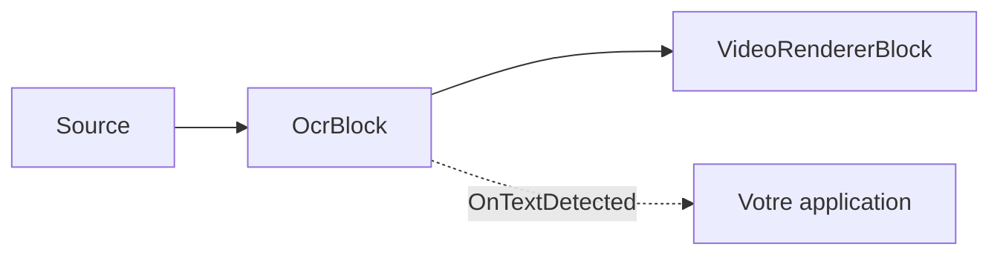
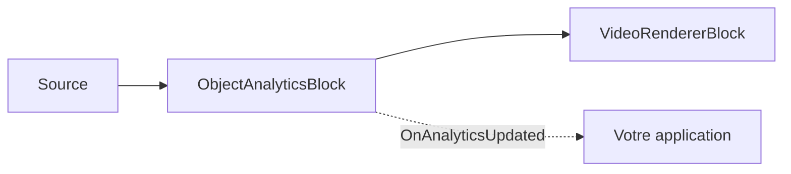

# Blocs IA : OCR, reconnaissance de plaques et analytique d'objets

Le Media Blocks SDK .Net fournit des blocs IA d'apprentissage profond construits sur [ONNX Runtime](https://onnxruntime.ai/)
et les modèles PP-OCR de [PaddleOCR](https://github.com/PaddlePaddle/PaddleOCR). Ils s'exécutent sur le CPU ou, lorsqu'il
est disponible, sur le GPU — DirectML sous Windows, CoreML sous Apple et CUDA sous NVIDIA — et sont entièrement
multiplateformes (Windows, Linux, macOS, Android).

Ces blocs se trouvent dans le paquet `VisioForge.Core.AI` (`VisioForge.DotNet.Core.AI`), aux côtés du
[`YOLOObjectDetectorBlock`](../index.md).

## OcrBlock — reconnaissance de texte

`OcrBlock` reconnaît le texte dans toute source vidéo ou image. En interne, il exécute le pipeline PP-OCR
multi-étapes — détection de texte (DBNet) → classification d'angle 0°/180° optionnelle → reconnaissance de lignes de texte
(CRNN/SVTR + décodage CTC) — sur chaque image traitée, émet les régions reconnues et, en option,
les dessine dans la vidéo.



### Utilisation

```csharp
using VisioForge.Core.MediaBlocks;
using VisioForge.Core.MediaBlocks.AI;
using VisioForge.Core.Types.X.AI;

var ocrSettings = new OcrSettings(
    detectionModelPath: "ch_PP-OCRv5_mobile_det.onnx",
    recognitionModelPath: "latin_PP-OCRv5_rec_mobile_infer.onnx",
    characterDictionaryPath: "ppocrv5_latin_dict.txt",
    classificationModelPath: "ch_ppocr_mobile_v2.0_cls_infer.onnx")
{
    Provider = OnnxExecutionProvider.Auto, // CPU / CUDA / DirectML / CoreML
    FramesToSkip = 3,                      // exécuter l'OCR une image sur quatre en vidéo en direct
    DrawResults = true,                    // incruster les cadres + le texte dans l'image
};

var ocr = new OcrBlock(ocrSettings);
ocr.OnTextDetected += (sender, e) =>
{
    foreach (var region in e.Regions)
    {
        Console.WriteLine($"{region.Text} ({region.Confidence:P0}) at {region.BoundingBox}");
    }
};

pipeline.Connect(source.Output, ocr.Input);
pipeline.Connect(ocr.Output, videoRenderer.Input);
```

Chaque `OcrTextRegion` porte le `Text` reconnu, une `Confidence` moyenne (0..1), un
`BoundingBox` aligné sur les axes et le `Polygon` de détection (4 points, en pixels de l'image source).

### Réglages clés

| Propriété | Par défaut | Description |
| --- | --- | --- |
| `DetectionModelPath` | — | Modèle ONNX de détection de texte (DBNet). Obligatoire. |
| `RecognitionModelPath` | — | Modèle ONNX de reconnaissance de texte (CRNN/SVTR). Obligatoire. |
| `CharacterDictionaryPath` | — | Dictionnaire de caractères du reconnaisseur ; doit correspondre à la langue du modèle de reconnaissance. Obligatoire. |
| `ClassificationModelPath` | `null` | Classifieur d'angle 0°/180° optionnel. |
| `UseAngleClassifier` | `true` | Appliquer le classifieur d'angle (nécessite `ClassificationModelPath`). |
| `Provider` | `Auto` | Fournisseur d'exécution ONNX. |
| `FramesToSkip` | `0` | Images ignorées entre les exécutions d'OCR. Utilisez une valeur non nulle pour la vidéo en direct. |
| `MaxSideLength` | `1024` | L'entrée du détecteur est limitée à cette longueur du plus grand côté. |
| `BoxThreshold` / `BoxScoreThreshold` / `UnclipRatio` | `0.3` / `0.5` / `1.6` | Réglage du détecteur. |
| `TextScoreThreshold` | `0.5` | Score moyen de reconnaissance minimal pour qu'une ligne soit signalée. |
| `DrawResults` | `true` | Dessiner les cadres + le texte dans l'image. |

## LicensePlateRecognizerBlock — ANPR / LPR

`LicensePlateRecognizerBlock` lit les plaques d'immatriculation des véhicules. Il exécute le même pipeline PP-OCR sur
l'image entière et filtre le texte reconnu pour ne conserver que les candidats plaques selon le motif, la longueur, la confiance
et la forme — il n'a donc **besoin d'aucun modèle de détection de plaques distinct et soumis à licence**.

```csharp
using VisioForge.Core.MediaBlocks.AI;
using VisioForge.Core.Types.X.AI;

var anprSettings = new LicensePlateRecognizerSettings(ocrSettings)
{
    PlatePattern = "^[A-Z0-9]{4,10}$", // regex .NET sur le candidat normalisé
    MinCharacters = 4,
    MaxCharacters = 10,
    MinConfidence = 0.5f,
    MinAspectRatio = 1.5f,             // les plaques sont plus larges que hautes
    DrawResults = true,
};

var anpr = new LicensePlateRecognizerBlock(anprSettings);
anpr.OnPlateRecognized += (sender, e) =>
{
    foreach (var plate in e.Plates)
    {
        Console.WriteLine($"Plate: {plate.Text} ({plate.Confidence:P0})");
    }
};

pipeline.Connect(source.Output, anpr.Input);
pipeline.Connect(anpr.Output, videoRenderer.Input);
```

Pour une meilleure précision dans les scènes chargées, exécutez un détecteur de plaques dédié (par exemple un
[`YOLOObjectDetectorBlock`](../index.md) avec un modèle de plaques sous licence Apache/MIT) en amont et fournissez-lui
les plaques recadrées.

## Modèles et licences

Ces blocs exécutent des modèles ONNX tiers. Les exemples fournissent les modèles **PP-OCRv5 mobile** sous Apache-2.0
(détection, classification d'angle, reconnaissance latine) et un dictionnaire latin ; les modèles sont
distribués à côté des exécutables d'exemple, et non à l'intérieur du paquet NuGet. PP-OCR prend en charge plus de 100
langues — téléchargez le modèle de reconnaissance et le dictionnaire correspondants pour les autres langues.

!!! note "Licences des modèles"
    La licence d'un modèle est déterminée par son origine (code d'entraînement + poids publiés), et non par le format
    ONNX. Vérifiez la licence de tout modèle — code, poids et jeu de données — avant de le distribuer. Évitez les
    modèles sous licence AGPL/GPL (par exemple Ultralytics YOLO) dans un produit à code source fermé. Les modèles
    PP-OCR fournis sont sous Apache-2.0.

## ObjectAnalyticsBlock — suivi multi-objets et tripwire

`ObjectAnalyticsBlock` effectue un suivi multi-objets stable (ByteTrack), le franchissement de lignes de détection dirigées
(tripwire) et l'occupation de zones polygonales par-dessus tout détecteur d'objets ONNX compatible (YOLOX, RT-DETR,
YOLOv8). Il dessine des superpositions (cadres, étiquettes, IDs de suivi, traces, lignes, zones, compteurs) et
émet un événement `OnAnalyticsUpdated` avec les objets suivis, les événements de franchissement et les instantanés de zone.



### Utilisation

```csharp
using SkiaSharp;
using VisioForge.Core.MediaBlocks;
using VisioForge.Core.MediaBlocks.AI;
using VisioForge.Core.Types.Events;
using VisioForge.Core.Types.X.AI;

// Réglages du détecteur — réutilisez n'importe quel modèle YOLO compatible.
var detector = new YoloDetectorSettings("yolox_nano.onnx")
{
    Model = ObjectDetectorModel.YOLOX,
    ConfidenceThreshold = 0.25f,
    DrawDetections = false, // Le moteur de rendu de l'analytique dessine à la place.
};

var settings = new ObjectAnalyticsSettings(detector);

// Ajouter une ligne de franchissement (tripwire) dirigée (Start -> End).
settings.Lines.Add(new LineZoneSettings
{
    Id = "door",
    Start = new SKPoint(200, 200),
    End = new SKPoint(400, 200),
    Anchor = DetectionAnchor.BottomCenter, // contact des pieds
});

// Ajouter une zone polygonale.
settings.Zones.Add(new PolygonZoneSettings
{
    Id = "area",
    Points = new[] { new SKPoint(100, 100), new SKPoint(300, 100),
                     new SKPoint(300, 300), new SKPoint(100, 300) },
});

var analytics = new ObjectAnalyticsBlock(settings);
analytics.OnAnalyticsUpdated += (s, e) =>
{
    foreach (var obj in e.Objects)
        Console.WriteLine($"ID #{obj.TrackerId}: {obj.Label} {obj.Confidence:P0}");

    foreach (var c in e.LineCrossings)
        Console.WriteLine($"{c.LineId}: {c.Label}#{c.TrackerId} {c.Direction}");
};
```

Le bloc exécute l'inférence de manière synchrone sur le thread de streaming du pipeline. Utilisez `FramesToSkip` pour réduire
la fréquence d'inférence. Sur les images ignorées, seuls la géométrie statique et les compteurs sont dessinés — aucun
cadre d'objet obsolète ni trace.

L'API d'analytique en C# pur (`ByteTracker`, `LineZone`, `PolygonZone`, `DetectionFilter`) est également
disponible directement pour une utilisation sans pipeline MediaBlocks.

## Démos

- **YOLO Object Detection Demo** (`_DEMOS/Media Blocks SDK/WPF/CSharp/YOLO Object Detection Demo`) — inclut à la fois le mode de détection d'objets et le mode d'analytique d'objets
- **OCR Text Recognition Demo** (`_DEMOS/Media Blocks SDK/WPF/CSharp/OCR Text Recognition Demo`)
- **License Plate Recognition Demo** (`_DEMOS/Media Blocks SDK/WPF/CSharp/License Plate Recognition Demo`)
