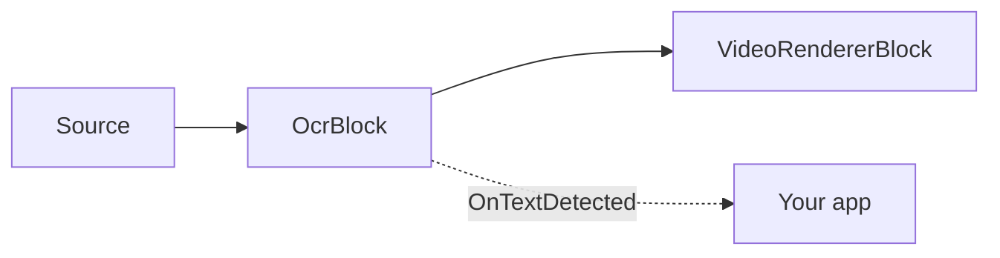
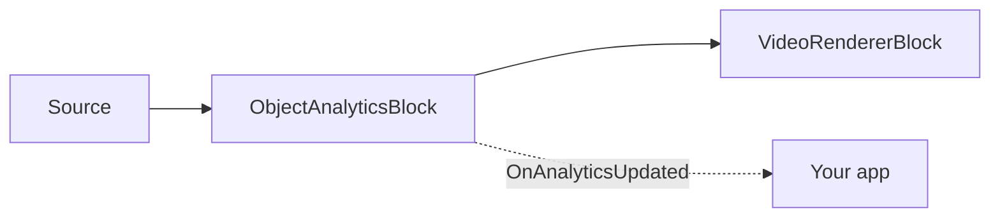

# AI Blocks: OCR, License Plate Recognition, and Object Analytics

The Media Blocks SDK .Net ships deep-learning AI blocks built on [ONNX Runtime](https://onnxruntime.ai/)
and [PaddleOCR](https://github.com/PaddlePaddle/PaddleOCR) PP-OCR models. They run on the CPU or, when
available, the GPU — DirectML on Windows, CoreML on Apple, and CUDA on NVIDIA — and are fully
cross-platform (Windows, Linux, macOS, Android).

These blocks live in the `VisioForge.Core.AI` package (`VisioForge.DotNet.Core.AI`) alongside the
[`YOLOObjectDetectorBlock`](../index.md).

## OcrBlock — text recognition

`OcrBlock` recognizes text in any video or image source. Internally it runs the multi-stage PP-OCR
pipeline — text detection (DBNet) → optional 0°/180° angle classification → text-line recognition
(CRNN/SVTR + CTC decoding) — on each processed frame, raises the recognized regions, and optionally
draws them into the video.



### Usage

```csharp
using VisioForge.Core.MediaBlocks;
using VisioForge.Core.MediaBlocks.AI;
using VisioForge.Core.Types.X.AI;

var ocrSettings = new OcrSettings(
    detectionModelPath: "ch_PP-OCRv5_mobile_det.onnx",
    recognitionModelPath: "latin_PP-OCRv5_rec_mobile_infer.onnx",
    characterDictionaryPath: "ppocrv5_latin_dict.txt",
    classificationModelPath: "ch_ppocr_mobile_v2.0_cls_infer.onnx")
{
    Provider = OnnxExecutionProvider.Auto, // CPU / CUDA / DirectML / CoreML
    FramesToSkip = 3,                      // run OCR every 4th frame on live video
    DrawResults = true,                    // burn boxes + text into the frame
};

var ocr = new OcrBlock(ocrSettings);
ocr.OnTextDetected += (sender, e) =>
{
    foreach (var region in e.Regions)
    {
        Console.WriteLine($"{region.Text} ({region.Confidence:P0}) at {region.BoundingBox}");
    }
};

pipeline.Connect(source.Output, ocr.Input);
pipeline.Connect(ocr.Output, videoRenderer.Input);
```

Each `OcrTextRegion` carries the recognized `Text`, an average `Confidence` (0..1), an axis-aligned
`BoundingBox`, and the detection `Polygon` (4 points, in source-frame pixels).

### Key settings

| Property | Default | Description |
| --- | --- | --- |
| `DetectionModelPath` | — | Text-detection (DBNet) ONNX model. Required. |
| `RecognitionModelPath` | — | Text-recognition (CRNN/SVTR) ONNX model. Required. |
| `CharacterDictionaryPath` | — | Recognizer character dictionary; must match the recognition model's language. Required. |
| `ClassificationModelPath` | `null` | Optional 0°/180° angle classifier. |
| `UseAngleClassifier` | `true` | Apply the angle classifier (needs `ClassificationModelPath`). |
| `Provider` | `Auto` | ONNX execution provider. |
| `FramesToSkip` | `0` | Frames skipped between OCR runs. Use a non-zero value for live video. |
| `MaxSideLength` | `1024` | Detector input is capped at this longer-side length. |
| `BoxThreshold` / `BoxScoreThreshold` / `UnclipRatio` | `0.3` / `0.5` / `1.6` | Detector tuning. |
| `TextScoreThreshold` | `0.5` | Minimum mean recognition score for a line to be reported. |
| `DrawResults` | `true` | Draw boxes + text into the frame. |

## LicensePlateRecognizerBlock — ANPR / LPR

`LicensePlateRecognizerBlock` reads vehicle number plates. It runs the same PP-OCR pipeline on the
whole frame and filters the recognized text down to plate candidates by pattern, length, confidence,
and shape — so it needs **no separate, license-encumbered plate-detection model**.

```csharp
using VisioForge.Core.MediaBlocks.AI;
using VisioForge.Core.Types.X.AI;

var anprSettings = new LicensePlateRecognizerSettings(ocrSettings)
{
    PlatePattern = "^[A-Z0-9]{4,10}$", // .NET regex over the normalized candidate
    MinCharacters = 4,
    MaxCharacters = 10,
    MinConfidence = 0.5f,
    MinAspectRatio = 1.5f,             // plates are wider than tall
    DrawResults = true,
};

var anpr = new LicensePlateRecognizerBlock(anprSettings);
anpr.OnPlateRecognized += (sender, e) =>
{
    foreach (var plate in e.Plates)
    {
        Console.WriteLine($"Plate: {plate.Text} ({plate.Confidence:P0})");
    }
};

pipeline.Connect(source.Output, anpr.Input);
pipeline.Connect(anpr.Output, videoRenderer.Input);
```

For higher accuracy on busy scenes, run a dedicated plate detector (for example a
[`YOLOObjectDetectorBlock`](../index.md) with an Apache/MIT-licensed plate model) upstream and feed
cropped plates in.

## Models and licensing

These blocks run third-party ONNX models. The samples ship the Apache-2.0 **PP-OCRv5 mobile** models
(detection, angle classification, Latin recognition) and a Latin dictionary; the models are
distributed next to the sample executables, not inside the NuGet package. PP-OCR supports 100+
languages — download the matching recognition model and dictionary for other languages.

!!! note "Model licenses"
    A model's license is set by its origin (training code + published weights), not by the ONNX
    format. Verify the license of any model — code, weights, and dataset — before shipping it. Avoid
    AGPL/GPL-licensed models (for example Ultralytics YOLO) in a closed-source product. The bundled
    PP-OCR models are Apache-2.0.

## ObjectAnalyticsBlock — multi-object tracking and tripwire

`ObjectAnalyticsBlock` performs stable multi-object tracking (ByteTrack), directed tripwire line
crossing, and polygon zone occupancy on top of any supported ONNX object detector (YOLOX, RT-DETR,
YOLOv8). It draws overlays (boxes, labels, track IDs, traces, lines, zones, counters) and
raises an `OnAnalyticsUpdated` event with tracked objects, crossing events, and zone snapshots.



### Usage

```csharp
using SkiaSharp;
using VisioForge.Core.MediaBlocks;
using VisioForge.Core.MediaBlocks.AI;
using VisioForge.Core.Types.Events;
using VisioForge.Core.Types.X.AI;

// Detector settings — reuse any supported YOLO model.
var detector = new YoloDetectorSettings("yolox_nano.onnx")
{
    Model = ObjectDetectorModel.YOLOX,
    ConfidenceThreshold = 0.25f,
    DrawDetections = false, // Analytics renderer draws instead.
};

var settings = new ObjectAnalyticsSettings(detector);

// Add a tripwire line (directed Start -> End).
settings.Lines.Add(new LineZoneSettings
{
    Id = "door",
    Start = new SKPoint(200, 200),
    End = new SKPoint(400, 200),
    Anchor = DetectionAnchor.BottomCenter, // feet contact
});

// Add a polygon zone.
settings.Zones.Add(new PolygonZoneSettings
{
    Id = "area",
    Points = new[] { new SKPoint(100, 100), new SKPoint(300, 100),
                     new SKPoint(300, 300), new SKPoint(100, 300) },
});

var analytics = new ObjectAnalyticsBlock(settings);
analytics.OnAnalyticsUpdated += (s, e) =>
{
    foreach (var obj in e.Objects)
        Console.WriteLine($"ID #{obj.TrackerId}: {obj.Label} {obj.Confidence:P0}");

    foreach (var c in e.LineCrossings)
        Console.WriteLine($"{c.LineId}: {c.Label}#{c.TrackerId} {c.Direction}");
};
```

The block runs inference synchronously on the pipeline streaming thread. Use `FramesToSkip` to reduce
inference frequency. On skipped frames only static geometry and counters are drawn — no stale object
boxes or traces.

The pure C# analytics API (`ByteTracker`, `LineZone`, `PolygonZone`, `DetectionFilter`) is also
available directly for use without a MediaBlocks pipeline.

## Demos

- **YOLO Object Detection Demo** (`_DEMOS/Media Blocks SDK/WPF/CSharp/YOLO Object Detection Demo`) — includes both ordinary object detection and object analytics modes
- **OCR Text Recognition Demo** (`_DEMOS/Media Blocks SDK/WPF/CSharp/OCR Text Recognition Demo`)
- **License Plate Recognition Demo** (`_DEMOS/Media Blocks SDK/WPF/CSharp/License Plate Recognition Demo`)
