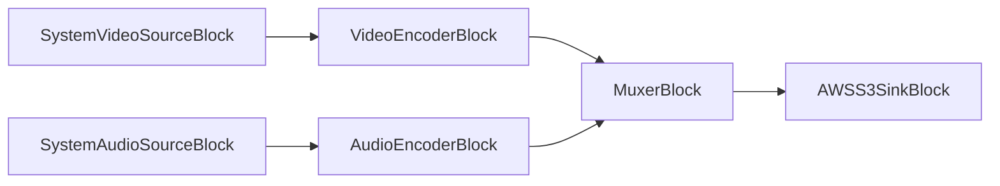

# Bloques AWS S3 - VisioForge Media Blocks SDK .Net

[Media Blocks SDK .Net](https://www.visioforge.com/media-blocks-sdk-net){ .md-button .md-button--primary target="_blank" }

Los bloques AWS S3 permiten la interacción con Amazon Simple Storage Service (S3) para leer archivos de medios como fuentes o escribir archivos de medios como sinks dentro de sus pipelines.

## AWSS3SinkBlock

El `AWSS3SinkBlock` le permite escribir datos de medios de su pipeline a un archivo en un bucket de AWS S3. Esto es útil para almacenar medios grabados, archivos transcodificados u otras salidas directamente al almacenamiento en la nube.

#### Información del bloque

Nombre: `AWSS3SinkBlock`.

| Dirección del pin | Tipo de medio | Cantidad de pines |
| --- | :---: | :---: |
| Entrada | Auto (depende del bloque conectado) | 1 |

#### Configuraciones

El `AWSS3SinkBlock` se configura usando `AWSS3SinkSettings`. Propiedades principales:

- `Uri` (string): La URI de S3 donde se escribirá el archivo de medios (ej., "s3://nombre-de-su-bucket/ruta/a/archivo/salida.mp4").
- `AccessKeyId` (string): Su ID de clave de acceso de AWS.
- `SecretAccessKey` (string): Su clave de acceso secreta de AWS.
- `Region` (string): La región de AWS donde está ubicado el bucket (ej., "us-east-1").
- `SessionToken` (string, opcional): Token de sesión de AWS, si usa credenciales temporales.
- `EndpointUrl` (string, opcional): URL de endpoint personalizado compatible con S3.
- `ContentType` (string, opcional): El tipo MIME del contenido que se está cargando (ej., "video/mp4").
- `StorageClass` (string, opcional): Clase de almacenamiento de S3 (ej., "STANDARD", "INTELLIGENT_TIERING").
- `ServerSideEncryption` (string, opcional): Método de cifrado del lado del servidor (ej., "AES256", "aws:kms").
- `ACL` (string, opcional): Lista de Control de Acceso para el objeto cargado (ej., "private", "public-read").

#### Pipeline de ejemplo



#### Código de ejemplo

```csharp
var pipeline = new MediaBlocksPipeline();

// Crear fuente de video (ej., webcam)
var videoDevice = (await DeviceEnumerator.Shared.VideoSourcesAsync())[0];
var videoSourceSettings = new VideoCaptureDeviceSourceSettings(videoDevice);
var videoSource = new SystemVideoSourceBlock(videoSourceSettings);

// Crear fuente de audio (ej., micrófono)
var audioDevice = (await DeviceEnumerator.Shared.AudioSourcesAsync())[0];
var audioSourceSettings = audioDevice.CreateSourceSettings(audioDevice.Formats[0].ToFormat());
var audioSource = new SystemAudioSourceBlock(audioSourceSettings);

// Crear codificador de video
var h264Settings = new OpenH264EncoderSettings(); // Configuraciones de ejemplo del codificador
var videoEncoder = new H264EncoderBlock(h264Settings);

// Crear codificador de audio
var opusSettings = new OpusEncoderSettings(); // Configuraciones de ejemplo del codificador
var audioEncoder = new OpusEncoderBlock(opusSettings);

// Crear un muxer (ej., MP4MuxBlock)
var mp4MuxSettings = new MP4MuxSettings();
var mp4Muxer = new MP4MuxBlock(mp4MuxSettings);

// Configurar AWSS3SinkSettings
var s3SinkSettings = new AWSS3SinkSettings
{
    Uri = "s3://nombre-de-su-bucket/salida/video-grabado.mp4",
    AccessKeyId = "SU_ID_DE_CLAVE_DE_ACCESO_AWS",
    SecretAccessKey = "SU_CLAVE_DE_ACCESO_SECRETA_AWS",
    Region = "su-region-aws", // ej., "us-east-1"
    ContentType = "video/mp4"
};

var s3Sink = new AWSS3SinkBlock(s3SinkSettings);

// Conectar ruta de video
pipeline.Connect(videoSource.Output, videoEncoder.Input);
pipeline.Connect(videoEncoder.Output, mp4Muxer.CreateNewInput(MediaBlockPadMediaType.Video));

// Conectar ruta de audio
pipeline.Connect(audioSource.Output, audioEncoder.Input);
pipeline.Connect(audioEncoder.Output, mp4Muxer.CreateNewInput(MediaBlockPadMediaType.Audio));

// Conectar muxer al sink S3
pipeline.Connect(mp4Muxer.Output, s3Sink.Input);

// Verificar si AWSS3Sink está disponible
if (!AWSS3SinkBlock.IsAvailable())
{
    Console.WriteLine("El Bloque AWS S3 Sink no está disponible. Verifique los redistribuibles del SDK.");
    return;
}

// Iniciar pipeline
await pipeline.StartAsync();

// ... esperar a que termine la grabación ...

// Detener pipeline
await pipeline.StopAsync();
```

#### Observaciones

Puede verificar si el `AWSS3SinkBlock` está disponible en tiempo de ejecución usando el método estático `AWSS3SinkBlock.IsAvailable()`. Esto asegura que los plugins GStreamer subyacentes necesarios y los componentes del SDK de AWS estén presentes.

#### Plataformas

Windows, macOS, Linux. (La disponibilidad depende del plugin AWS de GStreamer y el soporte del SDK de AWS en estas plataformas).
