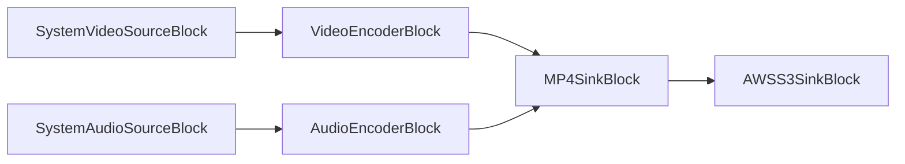

# Blocs AWS S3 - VisioForge Media Blocks SDK .Net

[Media Blocks SDK .Net](https://www.visioforge.com/media-blocks-sdk-net){ .md-button .md-button--primary target="_blank" }

Les blocs AWS S3 permettent d'interagir avec Amazon Simple Storage Service (S3) pour lire des fichiers multimédias comme sources ou écrire des fichiers multimédias comme puits au sein de vos pipelines.

## AWSS3SinkBlock

L'`AWSS3SinkBlock` vous permet d'écrire les données multimédias de votre pipeline dans un fichier d'un compartiment AWS S3. Pratique pour stocker les enregistrements, les fichiers transcodés ou d'autres sorties directement vers le stockage cloud.

#### Informations sur le bloc

Nom : `AWSS3SinkBlock`.

| Direction du pin | Type de média | Nombre de pins |
| --- | :---: | :---: |
| Entrée | Auto (dépend du bloc connecté) | 1 |

#### Paramètres

L'`AWSS3SinkBlock` est configuré au moyen d'`AWSS3SinkSettings`. Propriétés clés :

- `Uri` (string) : URI de l'objet S3 (par ex. "s3://your-bucket-name/path/to/output/file.mp4"). Vous pouvez également définir `Bucket` et `Key` séparément.
- `Bucket` (string) : nom du compartiment S3 cible.
- `Key` (string) : clé de l'objet (chemin dans le compartiment).
- `AccessKey` (string) : votre AWS Access Key.
- `SecretAccessKey` (string) : votre AWS Secret Access Key.
- `Region` (string) : région AWS du compartiment (par défaut `"us-west-1"`).
- `SessionToken` (string, facultatif) : jeton de session temporaire AWS issu de STS, en cas d'identifiants temporaires.
- `EndpointUri` (string, facultatif) : URI personnalisée d'un point de terminaison compatible S3.
- `ContentType` (string, facultatif) : type MIME du contenu téléversé (par ex. "video/mp4").
- `ContentDisposition` (string, facultatif) : en-tête Content-Disposition à définir pour l'objet téléversé.
- `Metadata` (Dictionary&lt;string, string&gt;, facultatif) : table de métadonnées utilisateur à stocker avec l'objet.
- `ForcePathStyle` (bool, facultatif) : force le client à utiliser l'adressage par chemin pour les compartiments.
- `UseMultipartUpload` (bool, facultatif, par défaut `true`) : utilise le téléversement multipart pour les fichiers volumineux.
- `PartSize` (ulong, facultatif, par défaut 5 Mo) : taille en octets d'une partie individuelle utilisée pour le téléversement multipart.
- `OnError` (S3SinkOnError, facultatif) : comportement en cas d'erreur de téléversement.
- `RequestTimeout` (TimeSpan, facultatif, par défaut 15 s) : délai d'attente des requêtes S3 (mettre à `TimeSpan.Zero` pour l'infini).
- `RetryAttempts` (uint, facultatif, par défaut 5) : nombre de tentatives avant d'abandonner une requête.

#### Pipeline d'exemple



#### Exemple de code

```csharp
var pipeline = new MediaBlocksPipeline();

// Créer la source vidéo (par ex. une webcam)
var videoDevice = (await DeviceEnumerator.Shared.VideoSourcesAsync())[0];
var videoSourceSettings = new VideoCaptureDeviceSourceSettings(videoDevice);
var videoSource = new SystemVideoSourceBlock(videoSourceSettings);

// Créer la source audio (par ex. un microphone)
var audioDevice = (await DeviceEnumerator.Shared.AudioSourcesAsync())[0];
var audioSourceSettings = audioDevice.CreateSourceSettings(audioDevice.Formats[0].ToFormat());
var audioSource = new SystemAudioSourceBlock(audioSourceSettings);

// Créer l'encodeur vidéo
var h264Settings = new OpenH264EncoderSettings(); // Exemple de paramètres d'encodeur
var videoEncoder = new H264EncoderBlock(h264Settings);

// Créer l'encodeur audio
var opusSettings = new OPUSEncoderSettings(); // Exemple de paramètres d'encodeur
var audioEncoder = new OPUSEncoderBlock(opusSettings);

// Créer un multiplexeur MP4 en mode mux-only — produit un pad de sortie multiplexé au lieu d'écrire un fichier.
var mp4MuxSettings = new MP4SinkSettings(string.Empty) { MuxOnly = true };
var mp4Muxer = new MP4SinkBlock(mp4MuxSettings);

// Configurer AWSS3SinkSettings
var s3SinkSettings = new AWSS3SinkSettings
{
    Uri = "s3://your-bucket-name/output/recorded-video.mp4",
    AccessKey = "YOUR_AWS_ACCESS_KEY",
    SecretAccessKey = "YOUR_AWS_SECRET_ACCESS_KEY",
    Region = "your-aws-region", // par ex. "us-east-1"
    ContentType = "video/mp4"
};

var s3Sink = new AWSS3SinkBlock(s3SinkSettings);

// Connecter le chemin vidéo
pipeline.Connect(videoSource.Output, videoEncoder.Input);
pipeline.Connect(videoEncoder.Output, mp4Muxer.CreateNewInput(MediaBlockPadMediaType.Video));

// Connecter le chemin audio
pipeline.Connect(audioSource.Output, audioEncoder.Input);
pipeline.Connect(audioEncoder.Output, mp4Muxer.CreateNewInput(MediaBlockPadMediaType.Audio));

// Connecter le multiplexeur au puits S3
pipeline.Connect(mp4Muxer.Output, s3Sink.Input);

// Vérifier si le bloc AWSS3Sink est disponible
if (!AWSS3SinkBlock.IsAvailable())
{
    Console.WriteLine("Le bloc AWS S3 Sink n'est pas disponible. Vérifiez les redistribuables du SDK.");
    return;
}

// Démarrer le pipeline
await pipeline.StartAsync();

// ... attendre la fin de l'enregistrement ...

// Arrêter le pipeline
await pipeline.StopAsync();
```

#### Remarques

Vous pouvez vérifier si l'`AWSS3SinkBlock` est disponible à l'exécution via la méthode statique `AWSS3SinkBlock.IsAvailable()`. Cela garantit la présence des plugins GStreamer sous-jacents et des composants du SDK AWS requis.

#### Plateformes

Windows, macOS, Linux. (La disponibilité dépend du plugin AWS de GStreamer et de la prise en charge du SDK AWS sur ces plateformes).
