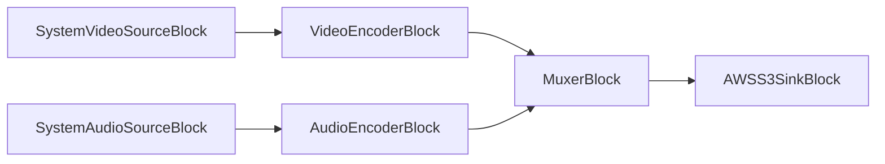

# AWS S3 Blocks - VisioForge Media Blocks SDK .Net

[!badge size="xl" target="blank" variant="info" text="Media Blocks SDK .Net"](https://www.visioforge.com/media-blocks-sdk-net)

AWS S3 blocks enable interaction with Amazon Simple Storage Service (S3) to read media files as sources or write media files as sinks within your pipelines.

## AWSS3SinkBlock

The `AWSS3SinkBlock` allows you to write media data from your pipeline to a file in an AWS S3 bucket. This is useful for storing recorded media, transcoded files, or other outputs directly to cloud storage.

#### Block info

Name: `AWSS3SinkBlock`.

| Pin direction | Media type | Pins count |
| --- | :---: | :---: |
| Input | Auto (depends on connected block) | 1 |

#### Settings

The `AWSS3SinkBlock` is configured using `AWSS3SinkSettings`. Key properties:

- `Uri` (string): The S3 URI where the media file will be written (e.g., "s3://your-bucket-name/path/to/output/file.mp4").
- `AccessKeyId` (string): Your AWS Access Key ID.
- `SecretAccessKey` (string): Your AWS Secret Access Key.
- `Region` (string): The AWS region where the bucket is located (e.g., "us-east-1").
- `SessionToken` (string, optional): AWS session token, if using temporary credentials.
- `EndpointUrl` (string, optional): Custom S3-compatible endpoint URL.
- `ContentType` (string, optional): The MIME type of the content being uploaded (e.g., "video/mp4").
- `StorageClass` (string, optional): S3 storage class (e.g., "STANDARD", "INTELLIGENT_TIERING").
- `ServerSideEncryption` (string, optional): Server-side encryption method (e.g., "AES256", "aws:kms").
- `ACL` (string, optional): Access Control List for the uploaded object (e.g., "private", "public-read").

#### The sample pipeline



#### Sample code

```csharp
var pipeline = new MediaBlocksPipeline();

// Create video source (e.g., webcam)
var videoDevice = (await DeviceEnumerator.Shared.VideoSourcesAsync())[0];
var videoSourceSettings = new VideoCaptureDeviceSourceSettings(videoDevice);
var videoSource = new SystemVideoSourceBlock(videoSourceSettings);

// Create audio source (e.g., microphone)
var audioDevice = (await DeviceEnumerator.Shared.AudioSourcesAsync())[0];
var audioSourceSettings = audioDevice.CreateSourceSettings(audioDevice.Formats[0].ToFormat());
var audioSource = new SystemAudioSourceBlock(audioSourceSettings);

// Create video encoder
var h264Settings = new OpenH264EncoderSettings(); // Example encoder settings
var videoEncoder = new H264EncoderBlock(h264Settings);

// Create audio encoder
var opusSettings = new OpusEncoderSettings(); // Example encoder settings
var audioEncoder = new OpusEncoderBlock(opusSettings);

// Create a muxer (e.g., MP4MuxBlock)
var mp4MuxSettings = new MP4MuxSettings();
var mp4Muxer = new MP4MuxBlock(mp4MuxSettings);

// Configure AWSS3SinkSettings
var s3SinkSettings = new AWSS3SinkSettings
{
    Uri = "s3://your-bucket-name/output/recorded-video.mp4",
    AccessKeyId = "YOUR_AWS_ACCESS_KEY_ID",
    SecretAccessKey = "YOUR_AWS_SECRET_ACCESS_KEY",
    Region = "your-aws-region", // e.g., "us-east-1"
    ContentType = "video/mp4"
};

var s3Sink = new AWSS3SinkBlock(s3SinkSettings);

// Connect video path
pipeline.Connect(videoSource.Output, videoEncoder.Input);
pipeline.Connect(videoEncoder.Output, mp4Muxer.CreateNewInput(MediaBlockPadMediaType.Video));

// Connect audio path
pipeline.Connect(audioSource.Output, audioEncoder.Input);
pipeline.Connect(audioEncoder.Output, mp4Muxer.CreateNewInput(MediaBlockPadMediaType.Audio));

// Connect muxer to S3 sink
pipeline.Connect(mp4Muxer.Output, s3Sink.Input);

// Check if AWSS3Sink is available
if (!AWSS3SinkBlock.IsAvailable())
{
    Console.WriteLine("AWS S3 Sink Block is not available. Check SDK redistributables.");
    return;
}

// Start pipeline
await pipeline.StartAsync();

// ... wait for recording to finish ...

// Stop pipeline
await pipeline.StopAsync();
```

#### Remarks

You can check if the `AWSS3SinkBlock` is available at runtime using the static method `AWSS3SinkBlock.IsAvailable()`. This ensures that the necessary underlying GStreamer plugins and AWS SDK components are present.

#### Platforms

Windows, macOS, Linux. (Availability depends on GStreamer AWS plugin and AWS SDK support on these platforms).
