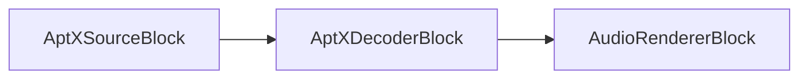

# Bloques de codificadores de audio

[Media Blocks SDK .Net](https://www.visioforge.com/media-blocks-sdk-net){ .md-button .md-button--primary target="_blank" }

La codificación de audio es el proceso de convertir datos de audio sin procesar a un formato comprimido. Este proceso es esencial para reducir el tamaño de los archivos de audio, haciéndolos más fáciles de almacenar y transmitir por internet. VisioForge Media Blocks SDK proporciona una amplia gama de codificadores de audio que soportan varios formatos y códecs.

## Verificaciones de disponibilidad

Antes de usar cualquier codificador, debe verificar si está disponible en la plataforma actual. Cada bloque de codificador proporciona un método estático `IsAvailable()` para este propósito:

```csharp
// Para la mayoría de los codificadores
if (EncoderBlock.IsAvailable())
{
    // Usar el codificador
}

// Para el codificador AAC que requiere pasar configuraciones
if (AACEncoderBlock.IsAvailable(settings))
{
    // Usar el codificador AAC
}
```

Esta verificación es importante porque no todos los codificadores están disponibles en todas las plataformas. Siempre realice esta verificación antes de intentar usar un codificador para evitar errores en tiempo de ejecución.

## Codificador AAC

`AAC (Advanced Audio Coding)`: Un formato de compresión con pérdida conocido por su eficiencia y calidad de sonido superior en comparación con MP3, ampliamente utilizado en música digital y transmisión.

El codificador AAC se usa para codificar archivos en formatos MP4, MKV, M4A y otros, así como para streaming de red usando RTSP y HLS.

Use la clase `AACEncoderSettings` para establecer los parámetros.

### Información del bloque

Nombre: AACEncoderBlock.

Dirección del pin | Tipo de medio | Cantidad de pines
--- | :---: | :---:
Entrada | PCM/IEEE | 1
Salida | AAC | 1

### Opciones del constructor

```csharp
// Constructor con configuraciones personalizadas
public AACEncoderBlock(IAACEncoderSettings settings)

// Constructor sin parámetros (usa configuraciones predeterminadas)
public AACEncoderBlock() // Usa GetDefaultSettings() internamente
```

### Configuraciones

El `AACEncoderBlock` funciona con cualquier implementación de la interfaz `IAACEncoderSettings`. Diferentes implementaciones están disponibles dependiendo de la plataforma:

- `AVENCAACEncoderSettings` - Disponible en Windows y macOS/Linux (preferido cuando está disponible)
- `MFAACEncoderSettings` - Implementación de Windows Media Foundation (solo Windows)
- `VOAACEncoderSettings` - Usado en Android e iOS

Puede usar el método estático `GetDefaultSettings()` para obtener la configuración óptima del codificador para la plataforma actual:

```csharp
var settings = AACEncoderBlock.GetDefaultSettings();
```

### Pipeline de ejemplo


### Código de ejemplo

```cs
var pipeline = new MediaBlocksPipeline();

var filename = "test.mp3";
var fileSource = new UniversalSourceBlock(await UniversalSourceSettings.CreateAsync(new Uri(filename)));

var aacEncoderBlock = new AACEncoderBlock(new MFAACEncoderSettings() { Bitrate = 192 });

pipeline.Connect(fileSource.AudioOutput, aacEncoderBlock.Input);

var m4aSinkBlock = new MP4SinkBlock(new MP4SinkSettings(@"output.m4a"));
pipeline.Connect(aacEncoderBlock.Output, m4aSinkBlock.CreateNewInput(MediaBlockPadMediaType.Audio));

await pipeline.StartAsync();
```

## Codificador ADPCM

`ADPCM (Adaptive Differential Pulse Code Modulation)`: Un tipo de compresión de audio que reduce la tasa de bits requerida para almacenamiento y transmisión de audio mientras mantiene la calidad a través de predicción adaptativa.

El codificador ADPCM se usa para incrustar flujos de audio en formatos DV, WAV y AVI.

Use la clase `ADPCMEncoderSettings` para establecer los parámetros.

### Información del bloque

Nombre: ADPCMEncoderBlock.

Dirección del pin | Tipo de medio | Cantidad de pines
--- | :---: | :---:
Entrada | PCM/IEEE | 1
Salida | ADPCM | 1

### Opciones del constructor

```csharp
// Constructor con parámetro de alineación de bloque
public ADPCMEncoderBlock(int blockAlign = 1024)
```

El parámetro `blockAlign` define la alineación del bloque en bytes. El valor predeterminado es 1024.

### Pipeline de ejemplo


### Código de ejemplo

```csharp
var pipeline = new MediaBlocksPipeline();

var filename = "test.mp3";
var fileSource = new UniversalSourceBlock(await UniversalSourceSettings.CreateAsync(new Uri(filename)));

var adpcmEncoderBlock = new ADPCMEncoderBlock(new ADPCMEncoderSettings());
pipeline.Connect(fileSource.AudioOutput, adpcmEncoderBlock.Input);

var wavSinkBlock = new WAVSinkBlock(@"output.wav");
pipeline.Connect(adpcmEncoderBlock.Output, wavSinkBlock.Input);

await pipeline.StartAsync();
```

## Codificador AptX

`AptX`: Un algoritmo de códec de audio psicoacústico que proporciona calidad de audio similar a CD con baja latencia para aplicaciones de audio Bluetooth. Usa una relación de compresión 4:1 y soporta solo audio estéreo, haciéndolo ideal para transmisión de audio inalámbrica.

### Información del bloque

Nombre: AptXEncoderBlock.

Dirección del pin | Tipo de medio | Cantidad de pines
--- | :---: | :---:
Entrada | PCM | 1
Salida | AptX | 1

### Opciones del constructor

```csharp
// Constructor con configuraciones personalizadas
public AptXEncoderBlock(AptXEncoderSettings settings)
```

### Configuraciones

El `AptXEncoderBlock` requiere `AptXEncoderSettings` para la configuración.

### Pipeline de ejemplo


### Código de ejemplo

```csharp
var pipeline = new MediaBlocksPipeline();

var filename = "test.wav";
var fileSource = new UniversalSourceBlock(await UniversalSourceSettings.CreateAsync(new Uri(filename)));

var aptxSettings = new AptXEncoderSettings();
var aptxEncoder = new AptXEncoderBlock(aptxSettings);
pipeline.Connect(fileSource.AudioOutput, aptxEncoder.Input);

var audioRenderer = new AudioRendererBlock();
pipeline.Connect(aptxEncoder.Output, audioRenderer.Input);

await pipeline.StartAsync();
```

### Plataformas

Windows, Linux (requiere plugin GStreamer AptX).

## Decodificador AptX

`Decodificador AptX`: Decodifica flujos de audio comprimidos AptX a audio PCM sin procesar. Este decodificador maneja flujos de bits AptX de fuentes de audio Bluetooth y produce audio PCM estéreo de alta calidad.

### Información del bloque

Nombre: AptXDecoderBlock.

Dirección del pin | Tipo de medio | Cantidad de pines
--- | :---: | :---:
Entrada | AptX | 1
Salida | PCM | 1

### Opciones del constructor

```csharp
// Constructor con configuraciones personalizadas
public AptXDecoderBlock(AptXDecoderSettings settings)
```

### Configuraciones

El `AptXDecoderBlock` requiere `AptXDecoderSettings` para la configuración.

### Pipeline de ejemplo



### Código de ejemplo

```csharp
var pipeline = new MediaBlocksPipeline();

// Asumimos que tenemos una fuente AptX (ej., receptor Bluetooth)
var aptxSource = new UniversalSourceBlock(await UniversalSourceSettings.CreateAsync(new Uri("aptx_stream")));

var aptxSettings = new AptXDecoderSettings();
var aptxDecoder = new AptXDecoderBlock(aptxSettings);
pipeline.Connect(aptxSource.AudioOutput, aptxDecoder.Input);

var audioRenderer = new AudioRendererBlock();
pipeline.Connect(aptxDecoder.Output, audioRenderer.Input);

await pipeline.StartAsync();
```

### Plataformas

Windows, Linux (requiere plugin GStreamer AptX).

## Codificador ALAW

`ALAW (algoritmo A-law)`: Un algoritmo de compansión estándar usado en sistemas de comunicaciones digitales para optimizar el rango dinámico de una señal analógica para digitalización.

El codificador ALAW se usa para incrustar flujos de audio en formato WAV o transmitir sobre IP.

Use la clase `ALAWEncoderSettings` para establecer los parámetros.

### Información del bloque

Nombre: ALAWEncoderBlock.

Dirección del pin | Tipo de medio | Cantidad de pines
--- | :---: | :---:
Entrada | PCM/IEEE | 1
Salida | ALAW | 1

### Opciones del constructor

```csharp
// Constructor predeterminado
public ALAWEncoderBlock()
```

### Pipeline de ejemplo


### Código de ejemplo

```csharp
var pipeline = new MediaBlocksPipeline();

var filename = "test.mp3";
var fileSource = new UniversalSourceBlock(await UniversalSourceSettings.CreateAsync(new Uri(filename)));

var alawEncoderBlock = new ALAWEncoderBlock(new ALAWEncoderSettings());
pipeline.Connect(fileSource.AudioOutput, alawEncoderBlock.Input);

var wavSinkBlock = new WAVSinkBlock(@"output.wav");
pipeline.Connect(alawEncoderBlock.Output, wavSinkBlock.Input);

await pipeline.StartAsync();
```

## Codificador FLAC

`FLAC (Free Lossless Audio Codec)`: Un formato de compresión de audio sin pérdida que preserva la calidad de audio mientras reduce significativamente el tamaño del archivo en comparación con formatos sin comprimir como WAV.

El codificador FLAC se usa para codificar audio en formato FLAC.

Use la clase `FLACEncoderSettings` para establecer los parámetros.

### Información del bloque

Nombre: FLACEncoderBlock.

Dirección del pin | Tipo de medio | Cantidad de pines
--- | :---: | :---:
Entrada | PCM/IEEE | 1
Salida | FLAC | 1

### Opciones del constructor

```csharp
// Constructor con configuraciones
public FLACEncoderBlock(FLACEncoderSettings settings)
```

### Pipeline de ejemplo


### Código de ejemplo

```csharp
var pipeline = new MediaBlocksPipeline();

var filename = "test.mp3";
var fileSource = new UniversalSourceBlock(await UniversalSourceSettings.CreateAsync(new Uri(filename)));

var flacEncoderBlock = new FLACEncoderBlock(new FLACEncoderSettings());
pipeline.Connect(fileSource.AudioOutput, flacEncoderBlock.Input);

var fileSinkBlock = new FileSinkBlock(@"output.flac");
pipeline.Connect(flacEncoderBlock.Output, fileSinkBlock.Input);

await pipeline.StartAsync();
```

## Codificador MP2

`MP2 (MPEG-1 Audio Layer II)`: Un formato de compresión de audio más antiguo que precedió al MP3, todavía usado en algunas aplicaciones de transmisión debido a su eficiencia en tasas de bits específicas.

El codificador MP2 se usa para transmitir sobre IP o incrustar en formatos AVI/MPEG-2.

Use la clase `MP2EncoderSettings` para establecer los parámetros.

### Información del bloque

Nombre: MP2EncoderBlock.

Dirección del pin | Tipo de medio | Cantidad de pines
--- | :---: | :---:
Entrada | PCM/IEEE | 1
Salida | audio/mpeg | 1

### Opciones del constructor

```csharp
// Constructor con configuraciones
public MP2EncoderBlock(MP2EncoderSettings settings)
```

La clase `MP2EncoderSettings` le permite configurar parámetros como:

- Bitrate (predeterminado: 192 kbps)

### Pipeline de ejemplo


### Código de ejemplo

```csharp
var pipeline = new MediaBlocksPipeline();

var filename = "test.mp3";
var fileSource = new UniversalSourceBlock(await UniversalSourceSettings.CreateAsync(new Uri(filename)));

var mp2EncoderBlock = new MP2EncoderBlock(new MP2EncoderSettings() { Bitrate = 192 });
pipeline.Connect(fileSource.AudioOutput, mp2EncoderBlock.Input);

var fileSinkBlock = new FileSinkBlock(@"output.mp2");
pipeline.Connect(mp2EncoderBlock.Output, fileSinkBlock.Input);

await pipeline.StartAsync();
```

## Codificador MP3

`MP3 (MPEG Audio Layer III)`: Un formato de audio con pérdida popular que revolucionó la distribución de música digital comprimiendo archivos mientras retiene una calidad de sonido razonable.

Un codificador MP3 puede convertir flujos de audio en archivos MP3 o incrustar flujos de audio MP3 en formatos como AVI, MKV y otros.

Use la clase `MP3EncoderSettings` para establecer los parámetros.

### Información del bloque

Nombre: MP3EncoderBlock.

Dirección del pin | Tipo de medio | Cantidad de pines
--- | :---: | :---:
Entrada | PCM/IEEE | 1
Salida | audio/mpeg | 1

### Opciones del constructor

```csharp
// Constructor con configuraciones y bandera opcional de parser
public MP3EncoderBlock(MP3EncoderSettings settings, bool addParser = false)
```

El parámetro `addParser` se usa para agregar un parser al flujo de salida, que es requerido para ciertas aplicaciones de streaming como streaming RTMP (YouTube/Facebook).

### Pipeline de ejemplo


### Código de ejemplo

```csharp
var pipeline = new MediaBlocksPipeline();

var filename = "test.mp3";
var fileSource = new UniversalSourceBlock(await UniversalSourceSettings.CreateAsync(new Uri(filename)));

var mp3EncoderBlock = new MP3EncoderBlock(new MP3EncoderSettings() { Bitrate = 192 });
pipeline.Connect(fileSource.AudioOutput, mp3EncoderBlock.Input);

var fileSinkBlock = new FileSinkBlock(@"output.mp3");
pipeline.Connect(mp3EncoderBlock.Output, fileSinkBlock.Input);

await pipeline.StartAsync();
```

### Ejemplo de streaming a RTMP

```csharp
var pipeline = new MediaBlocksPipeline();

var filename = "test.mp3";
var fileSource = new UniversalSourceBlock(await UniversalSourceSettings.CreateAsync(new Uri(filename)));

// addParser está establecido en true para streaming RTMP
var mp3EncoderBlock = new MP3EncoderBlock(new MP3EncoderSettings() { Bitrate = 192 }, addParser: true);
pipeline.Connect(fileSource.AudioOutput, mp3EncoderBlock.Input);

// Conectar al sink RTMP
var rtmpSink = new RTMPSinkBlock(new RTMPSinkSettings("rtmp://streaming-server/live/stream"));
pipeline.Connect(mp3EncoderBlock.Output, rtmpSink.CreateNewInput(MediaBlockPadMediaType.Audio));

await pipeline.StartAsync();
```

## Codificador OPUS

`OPUS`: Un formato de compresión de audio con pérdida altamente eficiente diseñado para internet con baja latencia y alta calidad de audio, haciéndolo ideal para aplicaciones en tiempo real como WebRTC.

El codificador OPUS se usa para incrustar flujos de audio en formatos WebM u OGG.

Use la clase `OPUSEncoderSettings` para establecer los parámetros.

### Información del bloque

Nombre: OPUSEncoderBlock.

Dirección del pin | Tipo de medio | Cantidad de pines
--- | :---: | :---:
Entrada | PCM/IEEE | 1
Salida | OPUS | 1

### Opciones del constructor

```csharp
// Constructor con configuraciones
public OPUSEncoderBlock(OPUSEncoderSettings settings)
```

La clase `OPUSEncoderSettings` le permite configurar parámetros como:

- Bitrate (predeterminado: 128 kbps)
- Ancho de banda de audio
- Tamaño de frame y otros parámetros de codificación

### Pipeline de ejemplo


### Código de ejemplo

```csharp
var pipeline = new MediaBlocksPipeline();

var filename = "test.mp3";
var fileSource = new UniversalSourceBlock(await UniversalSourceSettings.CreateAsync(new Uri(filename)));

var opusEncoderBlock = new OPUSEncoderBlock(new OPUSEncoderSettings() { Bitrate = 192 });
pipeline.Connect(fileSource.AudioOutput, opusEncoderBlock.Input);

var webmSinkBlock = new WebMSinkBlock(new WebMSinkSettings(@"output.webm"));
pipeline.Connect(opusEncoderBlock.Output, webmSinkBlock.CreateNewInput(MediaBlockPadMediaType.Audio));

await pipeline.StartAsync();
```

## Codificador Speex

`Speex`: Un formato de compresión de audio libre de patentes diseñado específicamente para voz, ofreciendo altas tasas de compresión mientras mantiene claridad para grabaciones de voz.

El codificador Speex se usa para incrustar flujos de audio en formato OGG.

Use la clase `SpeexEncoderSettings` para establecer los parámetros.

### Información del bloque

Nombre: SpeexEncoderBlock.

Dirección del pin | Tipo de medio | Cantidad de pines
--- | :---: | :---:
Entrada | PCM/IEEE | 1
Salida | Speex | 1

### Opciones del constructor

```csharp
// Constructor con configuraciones
public SpeexEncoderBlock(SpeexEncoderSettings settings)
```

La clase `SpeexEncoderSettings` le permite configurar parámetros como:

- Mode (SpeexMode): NarrowBand, WideBand, UltraWideBand
- Quality
- Complexity
- VAD (Voice Activity Detection)
- DTX (Discontinuous Transmission)

### Pipeline de ejemplo


### Código de ejemplo

```csharp
var pipeline = new MediaBlocksPipeline();

var filename = "test.mp3";
var fileSource = new UniversalSourceBlock(await UniversalSourceSettings.CreateAsync(new Uri(filename)));

var speexEncoderBlock = new SpeexEncoderBlock(new SpeexEncoderSettings() { Mode = SpeexMode.NarrowBand });
pipeline.Connect(fileSource.AudioOutput, speexEncoderBlock.Input);

var oggSinkBlock = new OGGSinkBlock(@"output.ogg");
pipeline.Connect(speexEncoderBlock.Output, oggSinkBlock.Input);

await pipeline.StartAsync();
```

## Codificador Vorbis

`Vorbis`: Un formato de compresión de audio de código abierto con pérdida diseñado como alternativa libre a MP3, frecuentemente usado dentro del formato contenedor OGG.

El codificador Vorbis se usa para incrustar flujos de audio en formatos OGG o WebM.

Use la clase `VorbisEncoderSettings` para establecer los parámetros.

### Información del bloque

Nombre: VorbisEncoderBlock.

Dirección del pin | Tipo de medio | Cantidad de pines
--- | :---: | :---:
Entrada | PCM/IEEE | 1
Salida | Vorbis | 1

### Opciones del constructor

```csharp
// Constructor con configuraciones
public VorbisEncoderBlock(VorbisEncoderSettings settings)
```

La clase `VorbisEncoderSettings` le permite configurar parámetros como:

- BaseQuality: Un valor flotante entre 0.0 y 1.0 que determina la calidad del audio codificado
- Bitrate: Configuración alternativa basada en bitrate

### Pipeline de ejemplo


### Código de ejemplo

```csharp
var pipeline = new MediaBlocksPipeline();

var filename = "test.mp3";
var fileSource = new UniversalSourceBlock(await UniversalSourceSettings.CreateAsync(new Uri(filename)));

var vorbisEncoderBlock = new VorbisEncoderBlock(new VorbisEncoderSettings() { BaseQuality = 0.5f });
pipeline.Connect(fileSource.AudioOutput, vorbisEncoderBlock.Input);

var oggSinkBlock = new OGGSinkBlock(@"output.ogg");
pipeline.Connect(vorbisEncoderBlock.Output, oggSinkBlock.Input);

await pipeline.StartAsync();
```

## Codificador WAV

`WAV (Waveform Audio File Format)`: Un formato de audio sin comprimir que preserva la calidad de audio pero resulta en tamaños de archivo más grandes comparados con formatos comprimidos.

El codificador WAV se usa para codificar audio en formato WAV.

Use la clase `WAVEncoderSettings` para establecer los parámetros.

### Información del bloque

Nombre: WAVEncoderBlock.

Dirección del pin | Tipo de medio | Cantidad de pines
--- | :---: | :---:
Entrada | PCM/IEEE | 1
Salida | WAV | 1

### Opciones del constructor

```csharp
// Constructor con configuraciones
public WAVEncoderBlock(WAVEncoderSettings settings)
```

La clase `WAVEncoderSettings` le permite configurar varios parámetros para el formato WAV.

### Pipeline de ejemplo


### Código de ejemplo

```csharp
var pipeline = new MediaBlocksPipeline();

var filename = "test.mp3";
var fileSource = new UniversalSourceBlock(await UniversalSourceSettings.CreateAsync(new Uri(filename)));

var wavEncoderBlock = new WAVEncoderBlock(new WAVEncoderSettings());
pipeline.Connect(fileSource.AudioOutput, wavEncoderBlock.Input);

var fileSinkBlock = new FileSinkBlock(@"output.wav");
pipeline.Connect(wavEncoderBlock.Output, fileSinkBlock.Input);

await pipeline.StartAsync();
```

## Codificador WavPack

`WavPack`: Un formato de compresión de audio sin pérdida libre y de código abierto que ofrece altas tasas de compresión mientras mantiene excelente calidad de audio, soportando modos híbridos con pérdida/sin pérdida.

El codificador WavPack se usa para codificar audio en formato WavPack, que es ideal para archivar audio con fidelidad perfecta.

Use la clase `WavPackEncoderSettings` para establecer los parámetros.

### Información del bloque

Nombre: WavPackEncoderBlock.

Dirección del pin | Tipo de medio | Cantidad de pines
--- | :---: | :---:
Entrada | PCM/IEEE | 1
Salida | WavPack | 1

### Opciones del constructor

```csharp
// Constructor con configuraciones
public WavPackEncoderBlock(WavPackEncoderSettings settings)
```

### Pipeline de ejemplo


### Código de ejemplo

```csharp
var pipeline = new MediaBlocksPipeline();

var filename = "test.mp3";
var fileSource = new UniversalSourceBlock(await UniversalSourceSettings.CreateAsync(new Uri(filename)));

var wavpackEncoderBlock = new WavPackEncoderBlock(new WavPackEncoderSettings());
pipeline.Connect(fileSource.AudioOutput, wavpackEncoderBlock.Input);

var fileSinkBlock = new FileSinkBlock(@"output.wv");
pipeline.Connect(wavpackEncoderBlock.Output, fileSinkBlock.Input);

await pipeline.StartAsync();
```

## Codificador WMA

`WMA (Windows Media Audio)`: Un formato de compresión de audio propietario desarrollado por Microsoft, ofreciendo varios niveles de compresión y características para diferentes aplicaciones de audio.

El codificador WMA se usa para codificar audio en formato WMA.

Use la clase `WMAEncoderSettings` para establecer los parámetros.

### Información del bloque

Nombre: WMAEncoderBlock.

Dirección del pin | Tipo de medio | Cantidad de pines
--- | :---: | :---:
Entrada | PCM/IEEE | 1
Salida | WMA | 1

### Opciones del constructor

```csharp
// Constructor con configuraciones
public WMAEncoderBlock(WMAEncoderSettings settings)
```

La clase `WMAEncoderSettings` le permite configurar parámetros como:

- Bitrate (predeterminado: 128 kbps)
- Configuraciones de calidad
- Opciones VBR (Variable Bit Rate)

### Configuraciones predeterminadas

Puede usar el método estático para obtener configuraciones predeterminadas:

```csharp
var settings = WMAEncoderBlock.GetDefaultSettings();
```

### Pipeline de ejemplo


### Código de ejemplo

```csharp
var pipeline = new MediaBlocksPipeline();

var filename = "test.mp3";
var fileSource = new UniversalSourceBlock(await UniversalSourceSettings.CreateAsync(new Uri(filename)));

var wmaEncoderBlock = new WMAEncoderBlock(new WMAEncoderSettings() { Bitrate = 192 });
pipeline.Connect(fileSource.AudioOutput, wmaEncoderBlock.Input);

var asfSinkBlock = new ASFSinkBlock(@"output.wma");
pipeline.Connect(wmaEncoderBlock.Output, asfSinkBlock.CreateNewInput(MediaBlockPadMediaType.Audio));

await pipeline.StartAsync();
```

## Gestión de recursos

Todos los bloques de codificador implementan `IDisposable` y tienen mecanismos de limpieza internos. Se recomienda eliminarlos correctamente cuando ya no sean necesarios:

```csharp
// Bloque using
using (var encoder = new MP3EncoderBlock(settings))
{
    // Usar codificador
}

// O eliminación manual
var encoder = new MP3EncoderBlock(settings);
try {
    // Usar codificador
}
finally {
    encoder.Dispose();
}
```

## Plataformas

Windows, macOS, Linux, iOS, Android.

Tenga en cuenta que no todos los codificadores están disponibles en todas las plataformas. Siempre use el método `IsAvailable()` para verificar la disponibilidad antes de usar un codificador.
