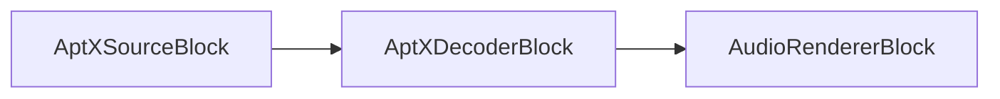

# Blocs d'encodeurs audio

[Media Blocks SDK .Net](https://www.visioforge.com/media-blocks-sdk-net){ .md-button .md-button--primary target="_blank" }

L'encodage audio est le processus de conversion de données audio brutes en un format compressé. Ce processus est essentiel pour réduire la taille des fichiers audio, ce qui les rend plus faciles à stocker et à diffuser sur Internet. Le VisioForge Media Blocks SDK fournit une large gamme d'encodeurs audio prenant en charge divers formats et codecs.

## Vérifications de disponibilité

Avant d'utiliser un encodeur, vous devez vérifier qu'il est disponible sur la plateforme courante. Chaque bloc d'encodeur expose une méthode statique `IsAvailable()` à cet effet :

```csharp
// Pour la plupart des encodeurs
if (EncoderBlock.IsAvailable())
{
    // Utiliser l'encodeur
}

// Pour l'encodeur AAC qui exige de passer les paramètres
if (AACEncoderBlock.IsAvailable(settings))
{
    // Utiliser l'encodeur AAC
}
```

Cette vérification est importante car tous les encodeurs ne sont pas disponibles sur toutes les plateformes. Effectuez toujours ce contrôle avant de tenter d'utiliser un encodeur, afin d'éviter les erreurs à l'exécution.

## Encodeur AAC { #aac-encoder }

`AAC (Advanced Audio Coding)` : un format de compression avec perte connu pour son efficacité et sa qualité sonore supérieure à celle du MP3, largement utilisé dans la musique numérique et la radiodiffusion.

L'encodeur AAC est utilisé pour encoder des fichiers aux formats MP4, MKV, M4A et quelques autres, ainsi que pour le streaming réseau via RTSP et HLS.

Utilisez la classe `AACEncoderSettings` pour définir les paramètres.

### Informations sur le bloc

Nom : AACEncoderBlock.

Direction du pad | Type de média | Nombre de pads
--- | :---: | :---:
Entrée | PCM/IEEE | 1
Sortie | AAC | 1

### Options du constructeur

```csharp
// Constructeur avec paramètres personnalisés
public AACEncoderBlock(IAACEncoderSettings settings)

// Constructeur sans paramètres (utilise les paramètres par défaut)
public AACEncoderBlock() // Utilise GetDefaultSettings() en interne
```

### Paramètres

L'`AACEncoderBlock` fonctionne avec toute implémentation de l'interface `IAACEncoderSettings`. Différentes implémentations sont disponibles selon la plateforme :

- `AVENCAACEncoderSettings` — disponible sur Windows et macOS/Linux (à privilégier lorsque possible)
- `MFAACEncoderSettings` — implémentation Windows Media Foundation (Windows uniquement)
- `VOAACEncoderSettings` — utilisée sur Android et iOS

Vous pouvez recourir à la méthode statique `GetDefaultSettings()` pour obtenir les paramètres d'encodeur optimaux pour la plateforme courante :

```csharp
var settings = AACEncoderBlock.GetDefaultSettings();
```

### Pipeline d'exemple


### Exemple de code

```cs
var pipeline = new MediaBlocksPipeline();

var filename = "test.mp3";
var fileSource = new UniversalSourceBlock(await UniversalSourceSettings.CreateAsync(filename));

var aacEncoderBlock = new AACEncoderBlock(new MFAACEncoderSettings() { Bitrate = 192 });

pipeline.Connect(fileSource.AudioOutput, aacEncoderBlock.Input);

var m4aSinkBlock = new MP4SinkBlock(new MP4SinkSettings(@"output.m4a"));
pipeline.Connect(aacEncoderBlock.Output, m4aSinkBlock.CreateNewInput(MediaBlockPadMediaType.Audio));

await pipeline.StartAsync();
```

## Encodeur ADPCM

`ADPCM (Adaptive Differential Pulse Code Modulation)` : un type de compression audio qui réduit le débit binaire nécessaire au stockage et à la transmission audio, tout en maintenant la qualité grâce à une prédiction adaptative.

L'encodeur ADPCM est utilisé pour intégrer des flux audio aux formats DV, WAV et AVI.

Utilisez la classe `ADPCMEncoderSettings` pour définir les paramètres.

### Informations sur le bloc

Nom : ADPCMEncoderBlock.

Direction du pad | Type de média | Nombre de pads
--- | :---: | :---:
Entrée | PCM/IEEE | 1
Sortie | ADPCM | 1

### Options du constructeur

```csharp
// Constructeur avec paramètre d'alignement de bloc
public ADPCMEncoderBlock(int blockAlign = 1024)
```

Le paramètre `blockAlign` définit l'alignement du bloc en octets. La valeur par défaut est 1024.

### Pipeline d'exemple


### Exemple de code

```csharp
var pipeline = new MediaBlocksPipeline();

var filename = "test.mp3";
var fileSource = new UniversalSourceBlock(await UniversalSourceSettings.CreateAsync(filename));

// ADPCMEncoderBlock prend un int optionnel block-align (par défaut 1024) — pas de classe Settings.
var adpcmEncoderBlock = new ADPCMEncoderBlock(blockAlign: 1024);
pipeline.Connect(fileSource.AudioOutput, adpcmEncoderBlock.Input);

var wavSinkBlock = new WAVSinkBlock(@"output.wav");
pipeline.Connect(adpcmEncoderBlock.Output, wavSinkBlock.Input);

await pipeline.StartAsync();
```

## Encodeur AptX

`AptX` : un algorithme de codec audio psychoacoustique qui offre une qualité audio proche du CD avec une faible latence pour les applications audio Bluetooth. Il utilise un rapport de compression 4:1 et ne prend en charge que l'audio stéréo, ce qui le rend idéal pour la transmission audio sans fil.

### Informations sur le bloc

Nom : AptXEncoderBlock.

Direction du pad | Type de média | Nombre de pads
--- | :---: | :---:
Entrée | PCM | 1
Sortie | AptX | 1

### Options du constructeur

```csharp
// Constructeur avec paramètres personnalisés
public AptXEncoderBlock(AptXEncoderSettings settings)
```

### Paramètres

L'`AptXEncoderBlock` exige des `AptXEncoderSettings` pour sa configuration.

### Pipeline d'exemple


### Exemple de code

```csharp
var pipeline = new MediaBlocksPipeline();

var filename = "test.wav";
var fileSource = new UniversalSourceBlock(await UniversalSourceSettings.CreateAsync(filename));

var aptxSettings = new AptXEncoderSettings();
var aptxEncoder = new AptXEncoderBlock(aptxSettings);
pipeline.Connect(fileSource.AudioOutput, aptxEncoder.Input);

var audioRenderer = new AudioRendererBlock();
pipeline.Connect(aptxEncoder.Output, audioRenderer.Input);

await pipeline.StartAsync();
```

### Plateformes

Windows, Linux (nécessite le plugin GStreamer AptX).

## Décodeur AptX

`Décodeur AptX` : décode les flux audio compressés AptX en audio PCM brut. Ce décodeur traite les flux binaires AptX provenant de sources audio Bluetooth et produit un audio PCM stéréo de haute qualité.

### Informations sur le bloc

Nom : AptXDecoderBlock.

Direction du pad | Type de média | Nombre de pads
--- | :---: | :---:
Entrée | AptX | 1
Sortie | PCM | 1

### Options du constructeur

```csharp
// Constructeur avec paramètres personnalisés
public AptXDecoderBlock(AptXDecoderSettings settings)
```

### Paramètres

L'`AptXDecoderBlock` exige des `AptXDecoderSettings` pour sa configuration.

### Pipeline d'exemple



### Exemple de code

```csharp
var pipeline = new MediaBlocksPipeline();

// Supposons que nous disposons d'une source AptX (par ex. un récepteur Bluetooth)
var aptxSource = new UniversalSourceBlock(await UniversalSourceSettings.CreateAsync("aptx_stream"));

var aptxSettings = new AptXDecoderSettings();
var aptxDecoder = new AptXDecoderBlock(aptxSettings);
pipeline.Connect(aptxSource.AudioOutput, aptxDecoder.Input);

var audioRenderer = new AudioRendererBlock();
pipeline.Connect(aptxDecoder.Output, audioRenderer.Input);

await pipeline.StartAsync();
```

### Plateformes

Windows, Linux (nécessite le plugin GStreamer AptX).

## Encodeur ALAW

`ALAW (algorithme A-law)` : un algorithme de compansion standard utilisé dans les systèmes de communication numérique pour optimiser la plage dynamique d'un signal analogique en vue de sa numérisation.

L'encodeur ALAW est utilisé pour intégrer des flux audio au format WAV ou pour la transmission sur IP.

Utilisez la classe `ALAWEncoderSettings` pour définir les paramètres.

### Informations sur le bloc

Nom : ALAWEncoderBlock.

Direction du pad | Type de média | Nombre de pads
--- | :---: | :---:
Entrée | PCM/IEEE | 1
Sortie | ALAW | 1

### Options du constructeur

```csharp
// Constructeur par défaut
public ALAWEncoderBlock()
```

### Pipeline d'exemple


### Exemple de code

```csharp
var pipeline = new MediaBlocksPipeline();

var filename = "test.mp3";
var fileSource = new UniversalSourceBlock(await UniversalSourceSettings.CreateAsync(filename));

// ALAWEncoderBlock possède un constructeur sans paramètres.
var alawEncoderBlock = new ALAWEncoderBlock();
pipeline.Connect(fileSource.AudioOutput, alawEncoderBlock.Input);

var wavSinkBlock = new WAVSinkBlock(@"output.wav");
pipeline.Connect(alawEncoderBlock.Output, wavSinkBlock.Input);

await pipeline.StartAsync();
```

## Encodeur FLAC

`FLAC (Free Lossless Audio Codec)` : un format de compression audio sans perte qui préserve la qualité audio tout en réduisant significativement la taille du fichier par rapport aux formats non compressés comme WAV.

L'encodeur FLAC est utilisé pour encoder de l'audio au format FLAC.

Utilisez la classe `FLACEncoderSettings` pour définir les paramètres.

### Informations sur le bloc

Nom : FLACEncoderBlock.

Direction du pad | Type de média | Nombre de pads
--- | :---: | :---:
Entrée | PCM/IEEE | 1
Sortie | FLAC | 1

### Options du constructeur

```csharp
// Constructeur avec paramètres
public FLACEncoderBlock(FLACEncoderSettings settings)
```

### Pipeline d'exemple


### Exemple de code

```csharp
var pipeline = new MediaBlocksPipeline();

var filename = "test.mp3";
var fileSource = new UniversalSourceBlock(await UniversalSourceSettings.CreateAsync(filename));

var flacEncoderBlock = new FLACEncoderBlock(new FLACEncoderSettings());
pipeline.Connect(fileSource.AudioOutput, flacEncoderBlock.Input);

var fileSinkBlock = new FileSinkBlock(@"output.flac");
pipeline.Connect(flacEncoderBlock.Output, fileSinkBlock.Input);

await pipeline.StartAsync();
```

## Encodeur MP2

`MP2 (MPEG-1 Audio Layer II)` : un format de compression audio plus ancien qui a précédé le MP3, encore utilisé dans certaines applications de radiodiffusion en raison de son efficacité à des débits spécifiques.

L'encodeur MP2 est utilisé pour la transmission sur IP ou pour l'intégration aux formats AVI/MPEG-2.

Utilisez la classe `MP2EncoderSettings` pour définir les paramètres.

### Informations sur le bloc

Nom : MP2EncoderBlock.

Direction du pad | Type de média | Nombre de pads
--- | :---: | :---:
Entrée | PCM/IEEE | 1
Sortie | audio/mpeg | 1

### Options du constructeur

```csharp
// Constructeur avec paramètres
public MP2EncoderBlock(MP2EncoderSettings settings)
```

La classe `MP2EncoderSettings` permet de configurer des paramètres tels que :

- Débit binaire (par défaut : 192 kbps)

### Pipeline d'exemple


### Exemple de code

```csharp
var pipeline = new MediaBlocksPipeline();

var filename = "test.mp3";
var fileSource = new UniversalSourceBlock(await UniversalSourceSettings.CreateAsync(filename));

var mp2EncoderBlock = new MP2EncoderBlock(new MP2EncoderSettings() { Bitrate = 192 });
pipeline.Connect(fileSource.AudioOutput, mp2EncoderBlock.Input);

var fileSinkBlock = new FileSinkBlock(@"output.mp2");
pipeline.Connect(mp2EncoderBlock.Output, fileSinkBlock.Input);

await pipeline.StartAsync();
```

## Encodeur MP3

`MP3 (MPEG Audio Layer III)` : un format audio avec perte populaire qui a révolutionné la distribution de musique numérique en compressant les fichiers tout en conservant une qualité sonore acceptable.

Un encodeur MP3 peut convertir des flux audio en fichiers MP3 ou intégrer des flux audio MP3 dans des formats comme AVI, MKV, et d'autres.

Utilisez la classe `MP3EncoderSettings` pour définir les paramètres.

### Informations sur le bloc

Nom : MP3EncoderBlock.

Direction du pad | Type de média | Nombre de pads
--- | :---: | :---:
Entrée | PCM/IEEE | 1
Sortie | audio/mpeg | 1

### Options du constructeur

```csharp
// Constructeur avec paramètres et indicateur optionnel de parser
public MP3EncoderBlock(MP3EncoderSettings settings, bool addParser = false)
```

Le paramètre `addParser` permet d'ajouter un analyseur syntaxique au flux de sortie, ce qui est requis pour certaines applications de streaming comme le streaming RTMP (YouTube/Facebook).

### Pipeline d'exemple


### Exemple de code

```csharp
var pipeline = new MediaBlocksPipeline();

var filename = "test.mp3";
var fileSource = new UniversalSourceBlock(await UniversalSourceSettings.CreateAsync(filename));

var mp3EncoderBlock = new MP3EncoderBlock(new MP3EncoderSettings() { Bitrate = 192 });
pipeline.Connect(fileSource.AudioOutput, mp3EncoderBlock.Input);

var fileSinkBlock = new FileSinkBlock(@"output.mp3");
pipeline.Connect(mp3EncoderBlock.Output, fileSinkBlock.Input);

await pipeline.StartAsync();
```

### Exemple de streaming vers RTMP

```csharp
var pipeline = new MediaBlocksPipeline();

var filename = "test.mp3";
var fileSource = new UniversalSourceBlock(await UniversalSourceSettings.CreateAsync(filename));

// addParser est défini à true pour le streaming RTMP
var mp3EncoderBlock = new MP3EncoderBlock(new MP3EncoderSettings() { Bitrate = 192 }, addParser: true);
pipeline.Connect(fileSource.AudioOutput, mp3EncoderBlock.Input);

// Connexion au puits RTMP — RTMPSinkSettings n'a pas de constructeur prenant une chaîne ; l'URL passe par la propriété Location.
var rtmpSink = new RTMPSinkBlock(new RTMPSinkSettings { Location = "rtmp://streaming-server/live/stream" });
pipeline.Connect(mp3EncoderBlock.Output, rtmpSink.CreateNewInput(MediaBlockPadMediaType.Audio));

await pipeline.StartAsync();
```

## Encodeur OPUS

`OPUS` : un format de compression audio avec perte hautement efficace, conçu pour Internet avec une faible latence et une haute qualité audio, ce qui le rend idéal pour les applications en temps réel comme WebRTC.

L'encodeur OPUS est utilisé pour intégrer des flux audio aux formats WebM ou OGG.

Utilisez la classe `OPUSEncoderSettings` pour définir les paramètres.

### Informations sur le bloc

Nom : OPUSEncoderBlock.

Direction du pad | Type de média | Nombre de pads
--- | :---: | :---:
Entrée | PCM/IEEE | 1
Sortie | OPUS | 1

### Options du constructeur

```csharp
// Constructeur avec paramètres
public OPUSEncoderBlock(OPUSEncoderSettings settings)
```

La classe `OPUSEncoderSettings` permet de configurer des paramètres tels que :

- Débit binaire (par défaut : 128 kbps)
- Bande passante audio
- Taille de trame et autres paramètres d'encodage

### Pipeline d'exemple


### Exemple de code

```csharp
var pipeline = new MediaBlocksPipeline();

var filename = "test.mp3";
var fileSource = new UniversalSourceBlock(await UniversalSourceSettings.CreateAsync(filename));

var opusEncoderBlock = new OPUSEncoderBlock(new OPUSEncoderSettings() { Bitrate = 192 });
pipeline.Connect(fileSource.AudioOutput, opusEncoderBlock.Input);

var webmSinkBlock = new WebMSinkBlock(new WebMSinkSettings(@"output.webm"));
pipeline.Connect(opusEncoderBlock.Output, webmSinkBlock.CreateNewInput(MediaBlockPadMediaType.Audio));

await pipeline.StartAsync();
```

## Encodeur Speex

`Speex` : un format de compression audio libre de brevets conçu spécifiquement pour la voix, qui offre des taux de compression élevés tout en conservant la clarté des enregistrements vocaux.

L'encodeur Speex est utilisé pour intégrer des flux audio au format OGG.

Utilisez la classe `SpeexEncoderSettings` pour définir les paramètres.

### Informations sur le bloc

Nom : SpeexEncoderBlock.

Direction du pad | Type de média | Nombre de pads
--- | :---: | :---:
Entrée | PCM/IEEE | 1
Sortie | Speex | 1

### Options du constructeur

```csharp
// Constructeur avec paramètres
public SpeexEncoderBlock(SpeexEncoderSettings settings)
```

La classe `SpeexEncoderSettings` permet de configurer des paramètres tels que :

- Mode (SpeexEncoderMode) : NarrowBand, WideBand, UltraWideBand
- Qualité
- Complexité
- VAD (détection d'activité vocale)
- DTX (transmission discontinue)

### Pipeline d'exemple


### Exemple de code

```csharp
var pipeline = new MediaBlocksPipeline();

var filename = "test.mp3";
var fileSource = new UniversalSourceBlock(await UniversalSourceSettings.CreateAsync(filename));

var speexEncoderBlock = new SpeexEncoderBlock(new SpeexEncoderSettings() { Mode = SpeexEncoderMode.NarrowBand });
pipeline.Connect(fileSource.AudioOutput, speexEncoderBlock.Input);

// OGGSinkBlock possède des entrées dynamiques — appelez CreateNewInput(...) pour obtenir un pad audio typé.
var oggSinkBlock = new OGGSinkBlock(new OGGSinkSettings(@"output.ogg"));
pipeline.Connect(speexEncoderBlock.Output, oggSinkBlock.CreateNewInput(MediaBlockPadMediaType.Audio));

await pipeline.StartAsync();
```

## Encodeur Vorbis

`Vorbis` : un format de compression audio avec perte open source conçu comme alternative libre au MP3, souvent utilisé au sein du conteneur OGG.

L'encodeur Vorbis est utilisé pour intégrer des flux audio aux formats OGG ou WebM.

Utilisez la classe `VorbisEncoderSettings` pour définir les paramètres.

### Informations sur le bloc

Nom : VorbisEncoderBlock.

Direction du pad | Type de média | Nombre de pads
--- | :---: | :---:
Entrée | PCM/IEEE | 1
Sortie | Vorbis | 1

### Options du constructeur

```csharp
// Constructeur avec paramètres
public VorbisEncoderBlock(VorbisEncoderSettings settings)
```

La classe `VorbisEncoderSettings` permet de configurer des paramètres tels que :

- Quality : valeur entière entre -1 et 10 (par défaut 4). Utilisée lorsque `RateControl = VorbisEncoderRateControl.Quality`.
- Bitrate : débit binaire cible en Kbit/s. Utilisé lorsque `RateControl = VorbisEncoderRateControl.Bitrate`.
- RateControl : `VorbisEncoderRateControl.Quality` (mode VBR par qualité) ou `VorbisEncoderRateControl.Bitrate` (basé sur le débit).

### Pipeline d'exemple


### Exemple de code

```csharp
var pipeline = new MediaBlocksPipeline();

var filename = "test.mp3";
var fileSource = new UniversalSourceBlock(await UniversalSourceSettings.CreateAsync(filename));

var vorbisEncoderBlock = new VorbisEncoderBlock(new VorbisEncoderSettings { Quality = 5 });
pipeline.Connect(fileSource.AudioOutput, vorbisEncoderBlock.Input);

// OGGSinkBlock possède des entrées dynamiques — appelez CreateNewInput(...) pour obtenir un pad audio typé.
var oggSinkBlock = new OGGSinkBlock(new OGGSinkSettings(@"output.ogg"));
pipeline.Connect(vorbisEncoderBlock.Output, oggSinkBlock.CreateNewInput(MediaBlockPadMediaType.Audio));

await pipeline.StartAsync();
```

## Encodeur WAV

`WAV (Waveform Audio File Format)` : un format audio non compressé qui préserve la qualité audio mais aboutit à des fichiers de plus grande taille que les formats compressés.

L'encodeur WAV est utilisé pour encoder de l'audio au format WAV.

Utilisez la classe `WAVEncoderSettings` pour définir les paramètres.

### Informations sur le bloc

Nom : WAVEncoderBlock.

Direction du pad | Type de média | Nombre de pads
--- | :---: | :---:
Entrée | PCM/IEEE | 1
Sortie | WAV | 1

### Options du constructeur

```csharp
// Constructeur avec paramètres
public WAVEncoderBlock(WAVEncoderSettings settings)
```

La classe `WAVEncoderSettings` permet de configurer divers paramètres pour le format WAV.

### Pipeline d'exemple


### Exemple de code

```csharp
var pipeline = new MediaBlocksPipeline();

var filename = "test.mp3";
var fileSource = new UniversalSourceBlock(await UniversalSourceSettings.CreateAsync(filename));

var wavEncoderBlock = new WAVEncoderBlock(new WAVEncoderSettings());
pipeline.Connect(fileSource.AudioOutput, wavEncoderBlock.Input);

var fileSinkBlock = new FileSinkBlock(@"output.wav");
pipeline.Connect(wavEncoderBlock.Output, fileSinkBlock.Input);

await pipeline.StartAsync();
```

## Encodeur WavPack

`WavPack` : un format de compression audio sans perte libre et open source qui offre des taux de compression élevés tout en conservant une excellente qualité audio, et qui prend en charge des modes hybrides avec/sans perte.

L'encodeur WavPack est utilisé pour encoder de l'audio au format WavPack, idéal pour archiver de l'audio avec une fidélité parfaite.

Utilisez la classe `WavPackEncoderSettings` pour définir les paramètres.

### Informations sur le bloc

Nom : WavPackEncoderBlock.

Direction du pad | Type de média | Nombre de pads
--- | :---: | :---:
Entrée | PCM/IEEE | 1
Sortie | WavPack | 1

### Options du constructeur

```csharp
// Constructeur avec paramètres
public WavPackEncoderBlock(WavPackEncoderSettings settings)
```

### Pipeline d'exemple


### Exemple de code

```csharp
var pipeline = new MediaBlocksPipeline();

var filename = "test.mp3";
var fileSource = new UniversalSourceBlock(await UniversalSourceSettings.CreateAsync(filename));

var wavpackEncoderBlock = new WavPackEncoderBlock(new WavPackEncoderSettings());
pipeline.Connect(fileSource.AudioOutput, wavpackEncoderBlock.Input);

var fileSinkBlock = new FileSinkBlock(@"output.wv");
pipeline.Connect(wavpackEncoderBlock.Output, fileSinkBlock.Input);

await pipeline.StartAsync();
```

## Encodeur WMA

`WMA (Windows Media Audio)` : un format de compression audio propriétaire développé par Microsoft, offrant divers niveaux de compression et fonctionnalités adaptés à différentes applications audio.

L'encodeur WMA est utilisé pour encoder de l'audio au format WMA.

Utilisez la classe `WMAEncoderSettings` pour définir les paramètres.

### Informations sur le bloc

Nom : WMAEncoderBlock.

Direction du pad | Type de média | Nombre de pads
--- | :---: | :---:
Entrée | PCM/IEEE | 1
Sortie | WMA | 1

### Options du constructeur

```csharp
// Constructeur avec paramètres
public WMAEncoderBlock(WMAEncoderSettings settings)
```

La classe `WMAEncoderSettings` permet de configurer des paramètres tels que :

- Débit binaire (par défaut : 128 kbps)
- Paramètres de qualité
- Options VBR (Variable Bit Rate)

### Paramètres par défaut

Vous pouvez utiliser la méthode statique pour obtenir les paramètres par défaut :

```csharp
var settings = WMAEncoderBlock.GetDefaultSettings();
```

### Pipeline d'exemple


### Exemple de code

```csharp
var pipeline = new MediaBlocksPipeline();

var filename = "test.mp3";
var fileSource = new UniversalSourceBlock(await UniversalSourceSettings.CreateAsync(filename));

var wmaEncoderBlock = new WMAEncoderBlock(new WMAEncoderSettings() { Bitrate = 192 });
pipeline.Connect(fileSource.AudioOutput, wmaEncoderBlock.Input);

var asfSinkBlock = new ASFSinkBlock(new ASFSinkSettings(@"output.wma"));
pipeline.Connect(wmaEncoderBlock.Output, asfSinkBlock.CreateNewInput(MediaBlockPadMediaType.Audio));

await pipeline.StartAsync();
```

## Gestion des ressources

Tous les blocs d'encodeur implémentent `IDisposable` et disposent de mécanismes de nettoyage internes. Il est recommandé de les libérer correctement lorsqu'ils ne sont plus nécessaires :

```csharp
// Bloc using
using (var encoder = new MP3EncoderBlock(settings))
{
    // Utiliser l'encodeur
}

// Ou libération manuelle
var encoder = new MP3EncoderBlock(settings);
try {
    // Utiliser l'encodeur
}
finally {
    encoder.Dispose();
}
```

## Plateformes

Windows, macOS, Linux, iOS, Android.

Notez que tous les encodeurs ne sont pas disponibles sur toutes les plateformes. Utilisez toujours la méthode `IsAvailable()` pour vérifier la disponibilité avant d'utiliser un encodeur.
