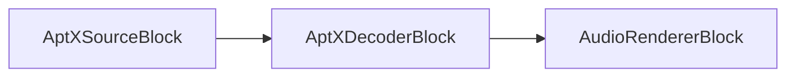

# Audio encoders blocks

[Media Blocks SDK .Net](https://www.visioforge.com/media-blocks-sdk-net){ .md-button .md-button--primary target="_blank" }

Audio encoding is the process of converting raw audio data into a compressed format. This process is essential for reducing the size of audio files, making them easier to store and stream over the internet. VisioForge Media Blocks SDK provides a wide range of audio encoders that support various formats and codecs.

## Availability checks

Before using any encoder, you should check if it's available on the current platform. Each encoder block provides a static `IsAvailable()` method for this purpose:

```csharp
// For most encoders
if (EncoderBlock.IsAvailable())
{
    // Use the encoder
}

// For AAC encoder which requires passing settings
if (AACEncoderBlock.IsAvailable(settings))
{
    // Use the AAC encoder
}
```

This check is important because not all encoders are available on all platforms. Always perform this check before attempting to use an encoder to avoid runtime errors.

## AAC encoder

`AAC (Advanced Audio Coding)`: A lossy compression format known for its efficiency and superior sound quality compared to MP3, widely used in digital music and broadcasting.

AAC encoder is used for encoding files in MP4, MKV, M4A and some other formats, as well as for network streaming using RTSP and HLS.

Use the `AACEncoderSettings` class to set the parameters.

### Block info

Name: AACEncoderBlock.

Pin direction | Media type | Pins count
--- | :---: | :---:
Input | PCM/IEEE | 1
Output | AAC | 1

### Constructor options

```csharp
// Constructor with custom settings
public AACEncoderBlock(IAACEncoderSettings settings)

// Constructor without parameters (uses default settings)
public AACEncoderBlock() // Uses GetDefaultSettings() internally
```

### Settings

The `AACEncoderBlock` works with any implementation of the `IAACEncoderSettings` interface. Different implementations are available depending on the platform:

- `AVENCAACEncoderSettings` - Available on Windows and macOS/Linux (preferred when available)
- `MFAACEncoderSettings` - Windows Media Foundation implementation (Windows only)
- `VOAACEncoderSettings` - Used on Android and iOS

You can use the static `GetDefaultSettings()` method to get the optimal encoder settings for the current platform:

```csharp
var settings = AACEncoderBlock.GetDefaultSettings();
```

### The sample pipeline


### Sample code

```cs
var pipeline = new MediaBlocksPipeline();

var filename = "test.mp3";
var fileSource = new UniversalSourceBlock(await UniversalSourceSettings.CreateAsync(new Uri(filename)));

var aacEncoderBlock = new AACEncoderBlock(new MFAACEncoderSettings() { Bitrate = 192 });

pipeline.Connect(fileSource.AudioOutput, aacEncoderBlock.Input);

var m4aSinkBlock = new MP4SinkBlock(new MP4SinkSettings(@"output.m4a"));
pipeline.Connect(aacEncoderBlock.Output, m4aSinkBlock.CreateNewInput(MediaBlockPadMediaType.Audio));

await pipeline.StartAsync();
```

## ADPCM encoder

`ADPCM (Adaptive Differential Pulse Code Modulation)`: A type of audio compression that reduces the bit rate required for audio storage and transmission while maintaining audio quality through adaptive prediction.

ADPCM encoder is used for embedding audio streams in DV, WAV and AVI formats.

Use the `ADPCMEncoderSettings` class to set the parameters.

### Block info

Name: ADPCMEncoderBlock.

Pin direction | Media type | Pins count
--- | :---: | :---:
Input | PCM/IEEE | 1
Output | ADPCM | 1

### Constructor options

```csharp
// Constructor with block align parameter
public ADPCMEncoderBlock(int blockAlign = 1024)
```

The `blockAlign` parameter defines the block alignment in bytes. The default value is 1024.

### The sample pipeline


### Sample code

```csharp
var pipeline = new MediaBlocksPipeline();

var filename = "test.mp3";
var fileSource = new UniversalSourceBlock(await UniversalSourceSettings.CreateAsync(new Uri(filename)));

var adpcmEncoderBlock = new ADPCMEncoderBlock(new ADPCMEncoderSettings());
pipeline.Connect(fileSource.AudioOutput, adpcmEncoderBlock.Input);

var wavSinkBlock = new WAVSinkBlock(@"output.wav");
pipeline.Connect(adpcmEncoderBlock.Output, wavSinkBlock.Input);

await pipeline.StartAsync();
```

## AptX encoder

`AptX`: A psychoacoustic audio codec algorithm that provides CD-like audio quality with low latency for Bluetooth audio applications. Uses 4:1 compression ratio and supports stereo audio only, making it ideal for wireless audio transmission.

### Block info

Name: AptXEncoderBlock.

Pin direction | Media type | Pins count
--- | :---: | :---:
Input | PCM | 1
Output | AptX | 1

### Constructor options

```csharp
// Constructor with custom settings
public AptXEncoderBlock(AptXEncoderSettings settings)
```

### Settings

The `AptXEncoderBlock` requires `AptXEncoderSettings` for configuration.

### The sample pipeline


### Sample code

```csharp
var pipeline = new MediaBlocksPipeline();

var filename = "test.wav";
var fileSource = new UniversalSourceBlock(await UniversalSourceSettings.CreateAsync(new Uri(filename)));

var aptxSettings = new AptXEncoderSettings();
var aptxEncoder = new AptXEncoderBlock(aptxSettings);
pipeline.Connect(fileSource.AudioOutput, aptxEncoder.Input);

var audioRenderer = new AudioRendererBlock();
pipeline.Connect(aptxEncoder.Output, audioRenderer.Input);

await pipeline.StartAsync();
```

### Platforms

Windows, Linux (requires GStreamer AptX plugin).

## AptX decoder

`AptX Decoder`: Decodes AptX compressed audio streams into raw PCM audio. This decoder handles AptX bitstreams from Bluetooth audio sources and outputs high-quality stereo PCM audio.

### Block info

Name: AptXDecoderBlock.

Pin direction | Media type | Pins count
--- | :---: | :---:
Input | AptX | 1
Output | PCM | 1

### Constructor options

```csharp
// Constructor with custom settings
public AptXDecoderBlock(AptXDecoderSettings settings)
```

### Settings

The `AptXDecoderBlock` requires `AptXDecoderSettings` for configuration.

### The sample pipeline



### Sample code

```csharp
var pipeline = new MediaBlocksPipeline();

// Assume we have an AptX source (e.g., Bluetooth receiver)
var aptxSource = new UniversalSourceBlock(await UniversalSourceSettings.CreateAsync(new Uri("aptx_stream")));

var aptxSettings = new AptXDecoderSettings();
var aptxDecoder = new AptXDecoderBlock(aptxSettings);
pipeline.Connect(aptxSource.AudioOutput, aptxDecoder.Input);

var audioRenderer = new AudioRendererBlock();
pipeline.Connect(aptxDecoder.Output, audioRenderer.Input);

await pipeline.StartAsync();
```

### Platforms

Windows, Linux (requires GStreamer AptX plugin).

## ALAW encoder

`ALAW (A-law algorithm)`: A standard companding algorithm used in digital communications systems to optimize the dynamic range of an analog signal for digitizing.

ALAW encoder is used for embedding audio streams in WAV format or transmitting over IP.

Use the `ALAWEncoderSettings` class to set the parameters.

### Block info

Name: ALAWEncoderBlock.

Pin direction | Media type | Pins count
--- | :---: | :---:
Input | PCM/IEEE | 1
Output | ALAW | 1

### Constructor options

```csharp
// Default constructor
public ALAWEncoderBlock()
```

### The sample pipeline


### Sample code

```csharp
var pipeline = new MediaBlocksPipeline();

var filename = "test.mp3";
var fileSource = new UniversalSourceBlock(await UniversalSourceSettings.CreateAsync(new Uri(filename)));

var alawEncoderBlock = new ALAWEncoderBlock(new ALAWEncoderSettings());
pipeline.Connect(fileSource.AudioOutput, alawEncoderBlock.Input);

var wavSinkBlock = new WAVSinkBlock(@"output.wav");
pipeline.Connect(alawEncoderBlock.Output, wavSinkBlock.Input);

await pipeline.StartAsync();
```

## FLAC encoder

`FLAC (Free Lossless Audio Codec)`: A lossless audio compression format that preserves audio quality while significantly reducing file size compared to uncompressed formats like WAV.

FLAC encoder is used for encoding audio in FLAC format.

Use the `FLACEncoderSettings` class to set the parameters.

### Block info

Name: FLACEncoderBlock.

Pin direction | Media type | Pins count
--- | :---: | :---:
Input | PCM/IEEE | 1
Output | FLAC | 1

### Constructor options

```csharp
// Constructor with settings
public FLACEncoderBlock(FLACEncoderSettings settings)
```

### The sample pipeline


### Sample code

```csharp
var pipeline = new MediaBlocksPipeline();

var filename = "test.mp3";
var fileSource = new UniversalSourceBlock(await UniversalSourceSettings.CreateAsync(new Uri(filename)));

var flacEncoderBlock = new FLACEncoderBlock(new FLACEncoderSettings());
pipeline.Connect(fileSource.AudioOutput, flacEncoderBlock.Input);

var fileSinkBlock = new FileSinkBlock(@"output.flac");
pipeline.Connect(flacEncoderBlock.Output, fileSinkBlock.Input);

await pipeline.StartAsync();
```

## MP2 encoder

`MP2 (MPEG-1 Audio Layer II)`: An older audio compression format that preceded MP3, still used in some broadcasting applications due to its efficiency at specific bitrates.

MP2 encoder is used for transmitting over IP or embedding to AVI/MPEG-2 formats.

Use the `MP2EncoderSettings` class to set the parameters.

### Block info

Name: MP2EncoderBlock.

Pin direction | Media type | Pins count
--- | :---: | :---:
Input | PCM/IEEE | 1
Output | audio/mpeg | 1

### Constructor options

```csharp
// Constructor with settings
public MP2EncoderBlock(MP2EncoderSettings settings)
```

The `MP2EncoderSettings` class allows you to configure parameters such as:

- Bitrate (default: 192 kbps)

### The sample pipeline


### Sample code

```csharp
var pipeline = new MediaBlocksPipeline();

var filename = "test.mp3";
var fileSource = new UniversalSourceBlock(await UniversalSourceSettings.CreateAsync(new Uri(filename)));

var mp2EncoderBlock = new MP2EncoderBlock(new MP2EncoderSettings() { Bitrate = 192 });
pipeline.Connect(fileSource.AudioOutput, mp2EncoderBlock.Input);

var fileSinkBlock = new FileSinkBlock(@"output.mp2");
pipeline.Connect(mp2EncoderBlock.Output, fileSinkBlock.Input);

await pipeline.StartAsync();
```

## MP3 encoder

`MP3 (MPEG Audio Layer III)`: A popular lossy audio format that revolutionized digital music distribution by compressing files while retaining a reasonable sound quality.

An MP3 encoder can convert audio streams into MP3 files or embed MP3 audio streams in formats like AVI, MKV, and others.

Use the `MP3EncoderSettings` class to set the parameters.

### Block info

Name: MP3EncoderBlock.

Pin direction | Media type | Pins count
--- | :---: | :---:
Input | PCM/IEEE | 1
Output | audio/mpeg | 1

### Constructor options

```csharp
// Constructor with settings and optional parser flag
public MP3EncoderBlock(MP3EncoderSettings settings, bool addParser = false)
```

The `addParser` parameter is used to add a parser to the output stream, which is required for certain streaming applications like RTMP (YouTube/Facebook) streaming.

### The sample pipeline


### Sample code

```csharp
var pipeline = new MediaBlocksPipeline();

var filename = "test.mp3";
var fileSource = new UniversalSourceBlock(await UniversalSourceSettings.CreateAsync(new Uri(filename)));

var mp3EncoderBlock = new MP3EncoderBlock(new MP3EncoderSettings() { Bitrate = 192 });
pipeline.Connect(fileSource.AudioOutput, mp3EncoderBlock.Input);

var fileSinkBlock = new FileSinkBlock(@"output.mp3");
pipeline.Connect(mp3EncoderBlock.Output, fileSinkBlock.Input);

await pipeline.StartAsync();
```

### Streaming to RTMP example

```csharp
var pipeline = new MediaBlocksPipeline();

var filename = "test.mp3";
var fileSource = new UniversalSourceBlock(await UniversalSourceSettings.CreateAsync(new Uri(filename)));

// Add parser is set to true for RTMP streaming
var mp3EncoderBlock = new MP3EncoderBlock(new MP3EncoderSettings() { Bitrate = 192 }, addParser: true);
pipeline.Connect(fileSource.AudioOutput, mp3EncoderBlock.Input);

// Connect to RTMP sink
var rtmpSink = new RTMPSinkBlock(new RTMPSinkSettings("rtmp://streaming-server/live/stream"));
pipeline.Connect(mp3EncoderBlock.Output, rtmpSink.CreateNewInput(MediaBlockPadMediaType.Audio));

await pipeline.StartAsync();
```

## OPUS encoder

`OPUS`: A highly efficient lossy audio compression format designed for the internet with low latency and high audio quality, making it ideal for real-time applications like WebRTC.

OPUS encoder is used for embedding audio streams in WebM or OGG formats.

Use the `OPUSEncoderSettings` class to set the parameters.

### Block info

Name: OPUSEncoderBlock.

Pin direction | Media type | Pins count
--- | :---: | :---:
Input | PCM/IEEE | 1
Output | OPUS | 1

### Constructor options

```csharp
// Constructor with settings
public OPUSEncoderBlock(OPUSEncoderSettings settings)
```

The `OPUSEncoderSettings` class allows you to configure parameters such as:

- Bitrate (default: 128 kbps)
- Audio bandwidth
- Frame size and other encoding parameters

### The sample pipeline


### Sample code

```csharp
var pipeline = new MediaBlocksPipeline();

var filename = "test.mp3";
var fileSource = new UniversalSourceBlock(await UniversalSourceSettings.CreateAsync(new Uri(filename)));

var opusEncoderBlock = new OPUSEncoderBlock(new OPUSEncoderSettings() { Bitrate = 192 });
pipeline.Connect(fileSource.AudioOutput, opusEncoderBlock.Input);

var webmSinkBlock = new WebMSinkBlock(new WebMSinkSettings(@"output.webm"));
pipeline.Connect(opusEncoderBlock.Output, webmSinkBlock.CreateNewInput(MediaBlockPadMediaType.Audio));

await pipeline.StartAsync();
```

## Speex encoder

`Speex`: A patent-free audio compression format designed specifically for speech, offering high compression rates while maintaining clarity for voice recordings.

Speex encoder is used for embedding audio streams in OGG format.

Use the `SpeexEncoderSettings` class to set the parameters.

### Block info

Name: SpeexEncoderBlock.

Pin direction | Media type | Pins count
--- | :---: | :---:
Input | PCM/IEEE | 1
Output | Speex | 1

### Constructor options

```csharp
// Constructor with settings
public SpeexEncoderBlock(SpeexEncoderSettings settings)
```

The `SpeexEncoderSettings` class allows you to configure parameters such as:

- Mode (SpeexMode): NarrowBand, WideBand, UltraWideBand
- Quality
- Complexity
- VAD (Voice Activity Detection)
- DTX (Discontinuous Transmission)

### The sample pipeline


### Sample code

```csharp
var pipeline = new MediaBlocksPipeline();

var filename = "test.mp3";
var fileSource = new UniversalSourceBlock(await UniversalSourceSettings.CreateAsync(new Uri(filename)));

var speexEncoderBlock = new SpeexEncoderBlock(new SpeexEncoderSettings() { Mode = SpeexMode.NarrowBand });
pipeline.Connect(fileSource.AudioOutput, speexEncoderBlock.Input);

var oggSinkBlock = new OGGSinkBlock(@"output.ogg");
pipeline.Connect(speexEncoderBlock.Output, oggSinkBlock.Input);

await pipeline.StartAsync();
```

## Vorbis encoder

`Vorbis`: An open-source, lossy audio compression format designed as a free alternative to MP3, often used within the OGG container format.

Vorbis encoder is used for embedding audio streams in OGG or WebM formats.

Use the `VorbisEncoderSettings` class to set the parameters.

### Block info

Name: VorbisEncoderBlock.

Pin direction | Media type | Pins count
--- | :---: | :---:
Input | PCM/IEEE | 1
Output | Vorbis | 1

### Constructor options

```csharp
// Constructor with settings
public VorbisEncoderBlock(VorbisEncoderSettings settings)
```

The `VorbisEncoderSettings` class allows you to configure parameters such as:

- BaseQuality: A float value between 0.0 and 1.0 that determines the quality of the encoded audio
- Bitrate: Alternative bitrate-based configuration

### The sample pipeline


### Sample code

```csharp
var pipeline = new MediaBlocksPipeline();

var filename = "test.mp3";
var fileSource = new UniversalSourceBlock(await UniversalSourceSettings.CreateAsync(new Uri(filename)));

var vorbisEncoderBlock = new VorbisEncoderBlock(new VorbisEncoderSettings() { BaseQuality = 0.5f });
pipeline.Connect(fileSource.AudioOutput, vorbisEncoderBlock.Input);

var oggSinkBlock = new OGGSinkBlock(@"output.ogg");
pipeline.Connect(vorbisEncoderBlock.Output, oggSinkBlock.Input);

await pipeline.StartAsync();
```

## WAV encoder

`WAV (Waveform Audio File Format)`: An uncompressed audio format that preserves audio quality but results in larger file sizes compared to compressed formats.

WAV encoder is used for encoding audio into WAV format.

Use the `WAVEncoderSettings` class to set the parameters.

### Block info

Name: WAVEncoderBlock.

Pin direction | Media type | Pins count
--- | :---: | :---:
Input | PCM/IEEE | 1
Output | WAV | 1

### Constructor options

```csharp
// Constructor with settings
public WAVEncoderBlock(WAVEncoderSettings settings)
```

The `WAVEncoderSettings` class allows you to configure various parameters for the WAV format.

### The sample pipeline


### Sample code

```csharp
var pipeline = new MediaBlocksPipeline();

var filename = "test.mp3";
var fileSource = new UniversalSourceBlock(await UniversalSourceSettings.CreateAsync(new Uri(filename)));

var wavEncoderBlock = new WAVEncoderBlock(new WAVEncoderSettings());
pipeline.Connect(fileSource.AudioOutput, wavEncoderBlock.Input);

var fileSinkBlock = new FileSinkBlock(@"output.wav");
pipeline.Connect(wavEncoderBlock.Output, fileSinkBlock.Input);

await pipeline.StartAsync();
```

## WavPack encoder

`WavPack`: A free and open-source lossless audio compression format that offers high compression rates while maintaining excellent audio quality, supporting hybrid lossy/lossless modes.

WavPack encoder is used for encoding audio in WavPack format, which is ideal for archiving audio with perfect fidelity.

Use the `WavPackEncoderSettings` class to set the parameters.

### Block info

Name: WavPackEncoderBlock.

Pin direction | Media type | Pins count
--- | :---: | :---:
Input | PCM/IEEE | 1
Output | WavPack | 1

### Constructor options

```csharp
// Constructor with settings
public WavPackEncoderBlock(WavPackEncoderSettings settings)
```

### The sample pipeline


### Sample code

```csharp
var pipeline = new MediaBlocksPipeline();

var filename = "test.mp3";
var fileSource = new UniversalSourceBlock(await UniversalSourceSettings.CreateAsync(new Uri(filename)));

var wavpackEncoderBlock = new WavPackEncoderBlock(new WavPackEncoderSettings());
pipeline.Connect(fileSource.AudioOutput, wavpackEncoderBlock.Input);

var fileSinkBlock = new FileSinkBlock(@"output.wv");
pipeline.Connect(wavpackEncoderBlock.Output, fileSinkBlock.Input);

await pipeline.StartAsync();
```

## WMA encoder

`WMA (Windows Media Audio)`: A proprietary audio compression format developed by Microsoft, offering various compression levels and features for different audio applications.

WMA encoder is used for encoding audio in WMA format.

Use the `WMAEncoderSettings` class to set the parameters.

### Block info

Name: WMAEncoderBlock.

Pin direction | Media type | Pins count
--- | :---: | :---:
Input | PCM/IEEE | 1
Output | WMA | 1

### Constructor options

```csharp
// Constructor with settings
public WMAEncoderBlock(WMAEncoderSettings settings)
```

The `WMAEncoderSettings` class allows you to configure parameters such as:

- Bitrate (default: 128 kbps)
- Quality settings
- VBR (Variable Bit Rate) options

### Default settings

You can use the static method to get default settings:

```csharp
var settings = WMAEncoderBlock.GetDefaultSettings();
```

### The sample pipeline


### Sample code

```csharp
var pipeline = new MediaBlocksPipeline();

var filename = "test.mp3";
var fileSource = new UniversalSourceBlock(await UniversalSourceSettings.CreateAsync(new Uri(filename)));

var wmaEncoderBlock = new WMAEncoderBlock(new WMAEncoderSettings() { Bitrate = 192 });
pipeline.Connect(fileSource.AudioOutput, wmaEncoderBlock.Input);

var asfSinkBlock = new ASFSinkBlock(@"output.wma");
pipeline.Connect(wmaEncoderBlock.Output, asfSinkBlock.CreateNewInput(MediaBlockPadMediaType.Audio));

await pipeline.StartAsync();
```

## Resource management

All encoder blocks implement `IDisposable` and have internal cleanup mechanisms. It's recommended to properly dispose of them when they're no longer needed:

```csharp
// Using block
using (var encoder = new MP3EncoderBlock(settings))
{
    // Use encoder
}

// Or manual disposal
var encoder = new MP3EncoderBlock(settings);
try {
    // Use encoder
}
finally {
    encoder.Dispose();
}
```

## Platforms

Windows, macOS, Linux, iOS, Android.

Note that not all encoders are available on all platforms. Always use the `IsAvailable()` method to check for availability before using an encoder.
