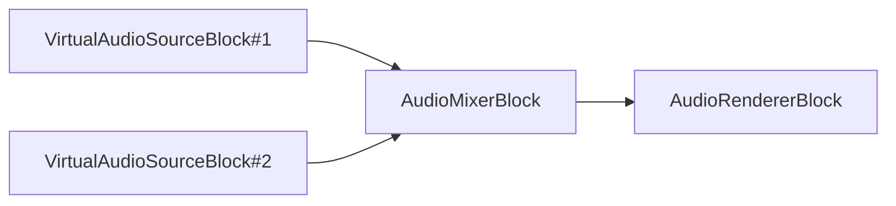

# Bloques de procesamiento y efectos de audio

[Media Blocks SDK .Net](https://www.visioforge.com/media-blocks-sdk-net){ .md-button .md-button--primary target="_blank" }

VisioForge Media Blocks SDK .Net incluye un conjunto de bloques de procesamiento y efectos de audio que le permiten crear pipelines de procesamiento de audio para sus aplicaciones.

Los bloques pueden conectarse entre sí para crear un pipeline de procesamiento.

La mayoría de los bloques están disponibles para todas las plataformas, incluyendo Windows, Linux, MacOS, Android e iOS.

## Procesamiento Básico de Audio

### Conversor de Audio

El bloque conversor de audio convierte audio de un formato a otro.

#### Información del bloque

Nombre: AudioConverterBlock.

Dirección del pin | Tipo de medio | Cantidad de pines
--- | :---: | :---:
Entrada | Audio sin comprimir | 1
Salida | Audio sin comprimir | 1

#### Pipeline de ejemplo


#### Código de ejemplo

```csharp
var pipeline = new MediaBlocksPipeline();

var filename = "test.mp3";
var fileSource = new UniversalSourceBlock(await UniversalSourceSettings.CreateAsync(new Uri(filename)));

var audioConverter = new AudioConverterBlock();
pipeline.Connect(fileSource.AudioOutput, audioConverter.Input);

var audioRenderer = new AudioRendererBlock();
pipeline.Connect(audioConverter.Output, audioRenderer.Input);

await pipeline.StartAsync();
```

#### Plataformas

Windows, macOS, Linux, iOS, Android.

### Resampler de Audio

El bloque resampler de audio cambia la tasa de muestreo de un flujo de audio.

#### Información del bloque

Nombre: AudioResamplerBlock.

Dirección del pin | Tipo de medio | Cantidad de pines
--- | :---: | :---:
Entrada | Audio sin comprimir | 1
Salida | Audio sin comprimir | 1

#### Pipeline de ejemplo


#### Código de ejemplo

```csharp
var pipeline = new MediaBlocksPipeline();

var filename = "test.mp3";
var fileSource = new UniversalSourceBlock(await UniversalSourceSettings.CreateAsync(new Uri(filename)));

// Remuestrear a 48000 Hz, estéreo
var settings = new AudioResamplerSettings(AudioFormatX.S16LE, 48000, 2);
var audioResampler = new AudioResamplerBlock(settings);
pipeline.Connect(fileSource.AudioOutput, audioResampler.Input);

var audioRenderer = new AudioRendererBlock();
pipeline.Connect(audioResampler.Output, audioRenderer.Input);

await pipeline.StartAsync();
```

#### Plataformas

Windows, macOS, Linux, iOS, Android.

### Corrector de Marca de Tiempo de Audio

El bloque corrector de marca de tiempo de audio puede agregar o eliminar frames para corregir el flujo de entrada de fuentes inestables.

#### Información del bloque

Nombre: AudioTimestampCorrectorBlock.

Dirección del pin | Tipo de medio | Cantidad de pines
--- | :---: | :---:
Entrada | Audio sin comprimir | 1
Salida | Audio sin comprimir | 1

#### Pipeline de ejemplo


#### Código de ejemplo

```csharp
var pipeline = new MediaBlocksPipeline();

var filename = "test.mp3";
var fileSource = new UniversalSourceBlock(await UniversalSourceSettings.CreateAsync(new Uri(filename)));

var settings = new AudioTimestampCorrectorSettings();
var corrector = new AudioTimestampCorrectorBlock(settings);
pipeline.Connect(fileSource.AudioOutput, corrector.Input);

var audioRenderer = new AudioRendererBlock();
pipeline.Connect(corrector.Output, audioRenderer.Input);

await pipeline.StartAsync();
```

#### Plataformas

Windows, macOS, Linux, iOS, Android.

### Volumen

El bloque de volumen le permite controlar el volumen del flujo de audio.

#### Información del bloque

Nombre: VolumeBlock.

Dirección del pin | Tipo de medio | Cantidad de pines
--- | :---: | :---:
Entrada | Audio sin comprimir | 1
Salida | Audio sin comprimir | 1

#### Pipeline de ejemplo


#### Código de ejemplo

```csharp
var pipeline = new MediaBlocksPipeline();

var filename = "test.mp3";
var fileSource = new UniversalSourceBlock(await UniversalSourceSettings.CreateAsync(new Uri(filename)));

// Volumen: 0.0 (silencio) a 1.0 (normal) o mayor (amplificación)
var volume = new VolumeBlock(0.8);
pipeline.Connect(fileSource.AudioOutput, volume.Input);

var audioRenderer = new AudioRendererBlock();
pipeline.Connect(volume.Output, audioRenderer.Input);

await pipeline.StartAsync();
```

#### Plataformas

Windows, macOS, Linux, iOS, Android.

### Mezclador de audio

El bloque mezclador de audio mezcla múltiples flujos de audio en uno. El bloque mezcla los flujos independientemente de su formato, convirtiendo si es necesario.

Todos los flujos de entrada serán sincronizados. El bloque mezclador maneja la conversión de diferentes formatos de audio de entrada a un formato común para mezclar. Por defecto, intentará coincidir con el formato de la primera entrada conectada, pero esto puede configurarse explícitamente.

Use la clase `AudioMixerSettings` para establecer el formato de salida personalizado. Esto es útil si necesita una tasa de muestreo, distribución de canales o formato de audio específico (como S16LE, Float32LE, etc.) para la salida mezclada.

#### Información del bloque

Nombre: AudioMixerBlock.

Dirección del pin | Tipo de medio | Cantidad de pines
--- | :---: | :---:
Entrada | Audio sin comprimir | 1 (creado dinámicamente)
Salida | Audio sin comprimir | 1

#### Pipeline de ejemplo



#### Código de ejemplo

```csharp
var pipeline = new MediaBlocksPipeline();

var audioSource1Block = new VirtualAudioSourceBlock(new VirtualAudioSourceSettings());
var audioSource2Block = new VirtualAudioSourceBlock(new VirtualAudioSourceSettings());

// Configurar el mezclador con configuraciones de salida específicas si es necesario
// Por ejemplo, para salida de audio 48kHz, 2 canales, S16LE:
// var mixerSettings = new AudioMixerSettings() { Format = new AudioInfoX(AudioFormatX.S16LE, 48000, 2) };
// var audioMixerBlock = new AudioMixerBlock(mixerSettings);
var audioMixerBlock = new AudioMixerBlock(new AudioMixerSettings());

// Cada llamada a CreateNewInput() agrega una nueva entrada al mezclador
var inputPad1 = audioMixerBlock.CreateNewInput();
pipeline.Connect(audioSource1Block.Output, inputPad1);

var inputPad2 = audioMixerBlock.CreateNewInput();
pipeline.Connect(audioSource2Block.Output, inputPad2);

// Enviar el audio mezclado al renderizador de audio predeterminado
var audioRenderer = new AudioRendererBlock();
pipeline.Connect(audioMixerBlock.Output, audioRenderer.Input);

await pipeline.StartAsync();
```

#### Controlando Flujos de Entrada Individuales

Puede controlar el volumen y el estado de silencio de flujos de entrada individuales conectados al `AudioMixerBlock`.
El `streamIndex` para estos métodos corresponde al orden en que las entradas fueron agregadas vía `CreateNewInput()` o `CreateNewInputLive()` (comenzando desde 0).

* **Establecer Volumen**: Use el método `SetVolume(int streamIndex, double value)`. El `value` va de 0.0 (silencio) a 1.0 (volumen normal), y puede ser mayor para amplificación (ej., hasta 10.0, aunque los detalles pueden depender de los límites de la implementación subyacente).
* **Establecer Silencio**: Use el método `SetMute(int streamIndex, bool value)`. Establezca `value` en `true` para silenciar el flujo y `false` para reactivarlo.

```csharp
// Asumiendo que audioMixerBlock ya está creado y las entradas están conectadas

// Establecer volumen del primer flujo de entrada (índice 0) al 50%
audioMixerBlock.SetVolume(0, 0.5);

// Silenciar el segundo flujo de entrada (índice 1)
audioMixerBlock.SetMute(1, true);
```

#### Gestión Dinámica de Entradas (Pipeline en Vivo)

El `AudioMixerBlock` soporta agregar y eliminar entradas dinámicamente mientras el pipeline está ejecutándose:

* **Agregar Entradas**: Use el método `CreateNewInputLive()` para obtener un nuevo pad de entrada que puede conectarse a una fuente. Los elementos GStreamer subyacentes serán configurados para manejar la nueva entrada.
* **Eliminar Entradas**: Use el método `RemoveInputLive(MediaBlockPad blockPad)`. Esto desconectará el pad de entrada especificado y limpiará los recursos asociados.

Esto es particularmente útil para aplicaciones donde el número de fuentes de audio puede cambiar durante la operación, como una consola de mezcla en vivo o una aplicación de conferencias.

#### Plataformas

Windows, macOS, Linux, iOS, Android.

### Capturador de muestras de audio

El bloque capturador de muestras de audio le permite acceder a las muestras de audio sin procesar del flujo de audio.

#### Información del bloque

Nombre: AudioSampleGrabberBlock.

Dirección del pin | Tipo de medio | Cantidad de pines
--- | :---: | :---:
Entrada | Audio sin comprimir | 1
Salida | Audio sin comprimir | 1

#### Pipeline de ejemplo


#### Código de ejemplo

```csharp
var pipeline = new MediaBlocksPipeline();

var filename = "test.mp3";
var fileSource = new UniversalSourceBlock(await UniversalSourceSettings.CreateAsync(new Uri(filename)));

var audioSampleGrabber = new AudioSampleGrabberBlock();
audioSampleGrabber.SampleGrabbed += (sender, args) =>
{
    // Procesar muestras de audio
    // args.AudioData - muestras de audio
    // args.AudioFormat - formato de audio
};
pipeline.Connect(fileSource.AudioOutput, audioSampleGrabber.Input);

var audioRenderer = new AudioRendererBlock();
pipeline.Connect(audioSampleGrabber.Output, audioRenderer.Input);

await pipeline.StartAsync();
```

#### Plataformas

Windows, macOS, Linux, iOS, Android.

## Efectos de Audio

### Amplificar

El bloque amplifica un flujo de audio por un factor de amplificación. Varios modos de recorte están disponibles.

Use valores de método y nivel para configurar.

#### Información del bloque

Nombre: AmplifyBlock.

Dirección del pin | Tipo de medio | Cantidad de pines
--- | :---: | :---:
Entrada | Audio sin comprimir | 1
Salida | Audio sin comprimir | 1

#### Pipeline de ejemplo


#### Código de ejemplo

```csharp
var pipeline = new MediaBlocksPipeline();

var filename = "test.mp3";
var fileSource = new UniversalSourceBlock(await UniversalSourceSettings.CreateAsync(new Uri(filename)));

var amplify = new AmplifyBlock(AmplifyClippingMethod.Normal, 2.0);
pipeline.Connect(fileSource.AudioOutput, amplify.Input);

var audioRenderer = new AudioRendererBlock();
pipeline.Connect(amplify.Output, audioRenderer.Input);

await pipeline.StartAsync();
```

#### Plataformas

Windows, macOS, Linux, iOS, Android.

### Eco

El bloque de eco agrega efecto de eco al flujo de audio.

#### Información del bloque

Nombre: EchoBlock.

Dirección del pin | Tipo de medio | Cantidad de pines
--- | :---: | :---:
Entrada | Audio sin comprimir | 1
Salida | Audio sin comprimir | 1

#### Pipeline de ejemplo


#### Código de ejemplo

```csharp
var pipeline = new MediaBlocksPipeline();

var filename = "test.mp3";
var fileSource = new UniversalSourceBlock(await UniversalSourceSettings.CreateAsync(new Uri(filename)));

// Retardo en ms, intensidad 0.0 - 1.0
var echo = new EchoBlock(500, 0.5);
pipeline.Connect(fileSource.AudioOutput, echo.Input);

var audioRenderer = new AudioRendererBlock();
pipeline.Connect(echo.Output, audioRenderer.Input);

await pipeline.StartAsync();
```

#### Plataformas

Windows, macOS, Linux, iOS, Android.

### Karaoke

El bloque de karaoke aplica un efecto de karaoke al flujo de audio, eliminando las voces centradas.

#### Información del bloque

Nombre: KaraokeBlock.

Dirección del pin | Tipo de medio | Cantidad de pines
--- | :---: | :---:
Entrada | Audio sin comprimir | 1
Salida | Audio sin comprimir | 1

#### Pipeline de ejemplo


#### Código de ejemplo

```csharp
var pipeline = new MediaBlocksPipeline();

var filename = "test.mp3";
var fileSource = new UniversalSourceBlock(await UniversalSourceSettings.CreateAsync(new Uri(filename)));

var settings = new KaraokeAudioEffect();
var karaoke = new KaraokeBlock(settings);
pipeline.Connect(fileSource.AudioOutput, karaoke.Input);

var audioRenderer = new AudioRendererBlock();
pipeline.Connect(karaoke.Output, audioRenderer.Input);

await pipeline.StartAsync();
```

#### Plataformas

Windows, macOS, Linux, iOS, Android.

### Reverberación

El bloque de reverberación agrega efectos de reverb al flujo de audio.

#### Información del bloque

Nombre: ReverberationBlock.

Dirección del pin | Tipo de medio | Cantidad de pines
--- | :---: | :---:
Entrada | Audio sin comprimir | 1
Salida | Audio sin comprimir | 1

#### Pipeline de ejemplo


#### Código de ejemplo

```csharp
var pipeline = new MediaBlocksPipeline();

var filename = "test.mp3";
var fileSource = new UniversalSourceBlock(await UniversalSourceSettings.CreateAsync(new Uri(filename)));

var settings = new ReverberationAudioEffect();
var reverb = new ReverberationBlock(settings);
pipeline.Connect(fileSource.AudioOutput, reverb.Input);

var audioRenderer = new AudioRendererBlock();
pipeline.Connect(reverb.Output, audioRenderer.Input);

await pipeline.StartAsync();
```

#### Plataformas

Windows, macOS, Linux, iOS, Android.

### Estéreo Amplio

El bloque de estéreo amplio mejora la imagen estéreo del audio.

#### Información del bloque

Nombre: WideStereoBlock.

Dirección del pin | Tipo de medio | Cantidad de pines
--- | :---: | :---:
Entrada | Audio sin comprimir | 1
Salida | Audio sin comprimir | 1

#### Pipeline de ejemplo


#### Código de ejemplo

```csharp
var pipeline = new MediaBlocksPipeline();

var filename = "test.mp3";
var fileSource = new UniversalSourceBlock(await UniversalSourceSettings.CreateAsync(new Uri(filename)));

var settings = new WideStereoAudioEffect();
var wideStereo = new WideStereoBlock(settings);
pipeline.Connect(fileSource.AudioOutput, wideStereo.Input);

var audioRenderer = new AudioRendererBlock();
pipeline.Connect(wideStereo.Output, audioRenderer.Input);

await pipeline.StartAsync();
```

#### Plataformas

Windows, macOS, Linux, iOS, Android.

## Ecualización y Filtrado

### Balance

El bloque le permite controlar el balance entre los canales izquierdo y derecho.

#### Información del bloque

Nombre: AudioBalanceBlock.

Dirección del pin | Tipo de medio | Cantidad de pines
--- | :---: | :---:
Entrada | Audio sin comprimir | 1
Salida | Audio sin comprimir | 1

#### Pipeline de ejemplo


#### Código de ejemplo

```csharp
var pipeline = new MediaBlocksPipeline();

var filename = "test.mp3";
var fileSource = new UniversalSourceBlock(await UniversalSourceSettings.CreateAsync(new Uri(filename)));

// Balance: -1.0 (izquierda completa) a 1.0 (derecha completa), 0.0 - centro
var balance = new AudioBalanceBlock(0.5);
pipeline.Connect(fileSource.AudioOutput, balance.Input);

var audioRenderer = new AudioRendererBlock();
pipeline.Connect(balance.Output, audioRenderer.Input);

await pipeline.StartAsync();
```

#### Plataformas

Windows, macOS, Linux, iOS, Android.

### Ecualizador (10 bandas)

El bloque ecualizador de 10 bandas proporciona un ecualizador de 10 bandas para procesamiento de audio.

#### Información del bloque

Nombre: Equalizer10Block.

Dirección del pin | Tipo de medio | Cantidad de pines
--- | :---: | :---:
Entrada | Audio sin comprimir | 1
Salida | Audio sin comprimir | 1

#### Pipeline de ejemplo


#### Código de ejemplo

```csharp
var pipeline = new MediaBlocksPipeline();

var filename = "test.mp3";
var fileSource = new UniversalSourceBlock(await UniversalSourceSettings.CreateAsync(new Uri(filename)));

// Crear ecualizador de 10 bandas con todas las bandas en 0 dB
var equalizer = new Equalizer10Block(0, 0, 0, 0, 0, 0, 0, 0, 0, 0);

// O establecer bandas individualmente
equalizer.SetBand(0, 3); // Banda 0 (31 Hz) a +3 dB
equalizer.SetBand(1, 2); // Banda 1 (62 Hz) a +2 dB
equalizer.SetBand(9, -3); // Banda 9 (16 kHz) a -3 dB

pipeline.Connect(fileSource.AudioOutput, equalizer.Input);

var audioRenderer = new AudioRendererBlock();
pipeline.Connect(equalizer.Output, audioRenderer.Input);

await pipeline.StartAsync();
```

#### Plataformas

Windows, macOS, Linux, iOS, Android.

### Ecualizador (Paramétrico)

El bloque ecualizador paramétrico proporciona un ecualizador paramétrico para procesamiento de audio.

#### Información del bloque

Nombre: EqualizerParametricBlock.

Dirección del pin | Tipo de medio | Cantidad de pines
--- | :---: | :---:
Entrada | Audio sin comprimir | 1
Salida | Audio sin comprimir | 1

#### Pipeline de ejemplo


#### Código de ejemplo

```csharp
var pipeline = new MediaBlocksPipeline();

var filename = "test.mp3";
var fileSource = new UniversalSourceBlock(await UniversalSourceSettings.CreateAsync(new Uri(filename)));

// Crear ecualizador paramétrico
var equalizer = new EqualizerParametricBlock();

// Configurar hasta 4 bandas
equalizer.SetBand(0, 100, 1.0, 3); // Banda 0: frecuencia 100 Hz, Q 1.0, ganancia +3 dB
equalizer.SetBand(1, 1000, 1.5, -2); // Banda 1: frecuencia 1000 Hz, Q 1.5, ganancia -2 dB

pipeline.Connect(fileSource.AudioOutput, equalizer.Input);

var audioRenderer = new AudioRendererBlock();
pipeline.Connect(equalizer.Output, audioRenderer.Input);

await pipeline.StartAsync();
```

#### Plataformas

Windows, macOS, Linux, iOS, Android.

### Chebyshev Pasa Banda/Rechaza Banda

El bloque Chebyshev pasa banda/rechaza banda aplica un filtro pasa banda o rechaza banda al flujo de audio usando filtros Chebyshev.

#### Información del bloque

Nombre: ChebyshevBandPassRejectBlock.

Dirección del pin | Tipo de medio | Cantidad de pines
--- | :---: | :---:
Entrada | Audio sin comprimir | 1
Salida | Audio sin comprimir | 1

#### Pipeline de ejemplo


#### Código de ejemplo

```csharp
var pipeline = new MediaBlocksPipeline();

var filename = "test.mp3";
var fileSource = new UniversalSourceBlock(await UniversalSourceSettings.CreateAsync(new Uri(filename)));

var settings = new ChebyshevBandPassRejectAudioEffect();
var filter = new ChebyshevBandPassRejectBlock(settings);
pipeline.Connect(fileSource.AudioOutput, filter.Input);

var audioRenderer = new AudioRendererBlock();
pipeline.Connect(filter.Output, audioRenderer.Input);

await pipeline.StartAsync();
```

#### Plataformas

Windows, macOS, Linux, iOS, Android.

### Chebyshev Límite

El bloque Chebyshev límite aplica filtrado pasa bajos o pasa altos al audio usando filtros Chebyshev.

#### Información del bloque

Nombre: ChebyshevLimitBlock.

Dirección del pin | Tipo de medio | Cantidad de pines
--- | :---: | :---:
Entrada | Audio sin comprimir | 1
Salida | Audio sin comprimir | 1

#### Pipeline de ejemplo


#### Código de ejemplo

```csharp
var pipeline = new MediaBlocksPipeline();

var filename = "test.mp3";
var fileSource = new UniversalSourceBlock(await UniversalSourceSettings.CreateAsync(new Uri(filename)));

var settings = new ChebyshevLimitAudioEffect();
var filter = new ChebyshevLimitBlock(settings);
pipeline.Connect(fileSource.AudioOutput, filter.Input);

var audioRenderer = new AudioRendererBlock();
pipeline.Connect(filter.Output, audioRenderer.Input);

await pipeline.StartAsync();
```

#### Plataformas

Windows, macOS, Linux, iOS, Android.

## Procesamiento Dinámico

### Compresor/Expansor

El bloque compresor/expansor proporciona compresión o expansión de rango dinámico.

#### Información del bloque

Nombre: CompressorExpanderBlock.

Dirección del pin | Tipo de medio | Cantidad de pines
--- | :---: | :---:
Entrada | Audio sin comprimir | 1
Salida | Audio sin comprimir | 1

#### Pipeline de ejemplo


#### Código de ejemplo

```csharp
var pipeline = new MediaBlocksPipeline();

var filename = "test.mp3";
var fileSource = new UniversalSourceBlock(await UniversalSourceSettings.CreateAsync(new Uri(filename)));

var compressor = new CompressorExpanderBlock(0.5, 0.9, 0.1, 0.5);
pipeline.Connect(fileSource.AudioOutput, compressor.Input);

var audioRenderer = new AudioRendererBlock();
pipeline.Connect(compressor.Output, audioRenderer.Input);

await pipeline.StartAsync();
```

#### Plataformas

Windows, macOS, Linux, iOS, Android.

### Escala/Tempo

El bloque escala/tempo le permite cambiar el tempo y el tono del flujo de audio.

#### Información del bloque

Nombre: ScaleTempoBlock.

Dirección del pin | Tipo de medio | Cantidad de pines
--- | :---: | :---:
Entrada | Audio sin comprimir | 1
Salida | Audio sin comprimir | 1

#### Pipeline de ejemplo


#### Código de ejemplo

```csharp
var pipeline = new MediaBlocksPipeline();

var filename = "test.mp3";
var fileSource = new UniversalSourceBlock(await UniversalSourceSettings.CreateAsync(new Uri(filename)));

// Escalar tempo por factor (1.0 es normal, 0.5 es mitad de velocidad, 2.0 es doble velocidad)
var scaleTempo = new ScaleTempoBlock(1.5);
pipeline.Connect(fileSource.AudioOutput, scaleTempo.Input);

var audioRenderer = new AudioRendererBlock();
pipeline.Connect(scaleTempo.Output, audioRenderer.Input);

await pipeline.StartAsync();
```

#### Plataformas

Windows, macOS, Linux, iOS, Android.

## Análisis y Medición

### Medidor VU

El bloque medidor VU le permite medir el nivel de volumen del flujo de audio.

#### Información del bloque

Nombre: VUMeterBlock.

Dirección del pin | Tipo de medio | Cantidad de pines
--- | :---: | :---:
Entrada | Audio sin comprimir | 1
Salida | Audio sin comprimir | 1

#### Pipeline de ejemplo


#### Código de ejemplo

```csharp
var pipeline = new MediaBlocksPipeline();

var filename = "test.mp3";
var fileSource = new UniversalSourceBlock(await UniversalSourceSettings.CreateAsync(new Uri(filename)));

var vuMeter = new VUMeterBlock();
vuMeter.VolumeUpdated += (sender, args) =>
{
    // Volumen del canal izquierdo en dB
    var leftVolume = args.LeftVolume;
    
    // Volumen del canal derecho en dB
    var rightVolume = args.RightVolume;
    
    Console.WriteLine($"Izquierdo: {leftVolume:F2} dB, Derecho: {rightVolume:F2} dB");
};
pipeline.Connect(fileSource.AudioOutput, vuMeter.Input);

var audioRenderer = new AudioRendererBlock();
pipeline.Connect(vuMeter.Output, audioRenderer.Input);

await pipeline.StartAsync();
```

#### Plataformas

Windows, macOS, Linux, iOS, Android.

## Efectos de Audio

### Efectos de Audio

El bloque AudioEffects proporciona una colección completa de efectos de procesamiento de audio que pueden aplicarse a flujos de audio.

#### Información del bloque

Nombre: AudioEffectsBlock.

Dirección del pin | Tipo de medio | Cantidad de pines
--- | :---: | :---:
Entrada | Audio sin comprimir | 1
Salida | Audio sin comprimir | 1

#### Pipeline de ejemplo


#### Código de ejemplo

```csharp
var pipeline = new MediaBlocksPipeline();

var filename = "test.mp3";
var fileSource = new UniversalSourceBlock(await UniversalSourceSettings.CreateAsync(new Uri(filename)));

var audioEffects = new AudioEffectsBlock();
pipeline.Connect(fileSource.AudioOutput, audioEffects.Input);

var audioRenderer = new AudioRendererBlock();
pipeline.Connect(audioEffects.Output, audioRenderer.Input);

await pipeline.StartAsync();
```

#### Plataformas

Windows, macOS, Linux, iOS, Android.

### Normalización de Sonoridad de Audio

El bloque AudioLoudNorm normaliza la sonoridad del audio según los estándares EBU R128, asegurando una sonoridad percibida consistente en diferentes contenidos de audio.

#### Información del bloque

Nombre: AudioLoudNormBlock.

Dirección del pin | Tipo de medio | Cantidad de pines
--- | :---: | :---:
Entrada | Audio sin comprimir | 1
Salida | Audio sin comprimir | 1

#### Pipeline de ejemplo

```mermaid
graph LR;
    UniversalSourceBlock-->AudioLoudNormBlock;
    AudioLoudNormBlock-->AudioRendererBlock;
```

#### Código de ejemplo

```csharp
var pipeline = new MediaBlocksPipeline();

var filename = "test.mp3";
var fileSource = new UniversalSourceBlock(await UniversalSourceSettings.CreateAsync(new Uri(filename)));

var loudNorm = new AudioLoudNormBlock();
pipeline.Connect(fileSource.AudioOutput, loudNorm.Input);

var audioRenderer = new AudioRendererBlock();
pipeline.Connect(loudNorm.Output, audioRenderer.Input);

await pipeline.StartAsync();
```

#### Plataformas

Windows, macOS, Linux, iOS, Android.

### Reducción de Ruido RNN

El bloque AudioRNNoise usa reducción de ruido basada en red neuronal recurrente (RNN) para eliminar ruido de fondo de flujos de audio mientras preserva la calidad del habla.

#### Información del bloque

Nombre: AudioRNNoiseBlock.

Dirección del pin | Tipo de medio | Cantidad de pines
--- | :---: | :---:
Entrada | Audio sin comprimir | 1
Salida | Audio sin comprimir | 1

#### Pipeline de ejemplo

```mermaid
graph LR;
    UniversalSourceBlock-->AudioRNNoiseBlock;
    AudioRNNoiseBlock-->AudioRendererBlock;
```

#### Código de ejemplo

```csharp
var pipeline = new MediaBlocksPipeline();

var filename = "noisy_audio.mp3";
var fileSource = new UniversalSourceBlock(await UniversalSourceSettings.CreateAsync(new Uri(filename)));

var rnnoise = new AudioRNNoiseBlock();
pipeline.Connect(fileSource.AudioOutput, rnnoise.Input);

var audioRenderer = new AudioRendererBlock();
pipeline.Connect(rnnoise.Output, audioRenderer.Input);

await pipeline.StartAsync();
```

#### Plataformas

Windows, macOS, Linux, iOS, Android.

### Eliminar Silencio

El bloque RemoveSilence detecta y elimina automáticamente porciones silenciosas de flujos de audio, útil para podcasts, grabaciones de voz y edición de audio.

#### Información del bloque

Nombre: RemoveSilenceBlock.

Dirección del pin | Tipo de medio | Cantidad de pines
--- | :---: | :---:
Entrada | Audio sin comprimir | 1
Salida | Audio sin comprimir | 1

#### Pipeline de ejemplo

```mermaid
graph LR;
    UniversalSourceBlock-->RemoveSilenceBlock;
    RemoveSilenceBlock-->AudioRendererBlock;
```

#### Código de ejemplo

```csharp
var pipeline = new MediaBlocksPipeline();

var filename = "podcast.mp3";
var fileSource = new UniversalSourceBlock(await UniversalSourceSettings.CreateAsync(new Uri(filename)));

var removeSilence = new RemoveSilenceBlock();
pipeline.Connect(fileSource.AudioOutput, removeSilence.Input);

var audioRenderer = new AudioRendererBlock();
pipeline.Connect(removeSilence.Output, audioRenderer.Input);

await pipeline.StartAsync();
```

#### Plataformas

Windows, macOS, Linux, iOS, Android.

### Filtro Csound

El bloque CsoundFilter proporciona síntesis y procesamiento de audio avanzado usando el lenguaje de programación de audio Csound.

#### Información del bloque

Nombre: CsoundFilterBlock.

Dirección del pin | Tipo de medio | Cantidad de pines
--- | :---: | :---:
Entrada | Audio sin comprimir | 1
Salida | Audio sin comprimir | 1

#### Pipeline de ejemplo

```mermaid
graph LR;
    UniversalSourceBlock-->CsoundFilterBlock;
    CsoundFilterBlock-->AudioRendererBlock;
```

#### Código de ejemplo

```csharp
var pipeline = new MediaBlocksPipeline();

var filename = "test.mp3";
var fileSource = new UniversalSourceBlock(await UniversalSourceSettings.CreateAsync(new Uri(filename)));

var csoundSettings = new CsoundFilterSettings
{
    CsdPath = "filter.csd" // Archivo de script Csound
};
var csound = new CsoundFilterBlock(csoundSettings);
pipeline.Connect(fileSource.AudioOutput, csound.Input);

var audioRenderer = new AudioRendererBlock();
pipeline.Connect(csound.Output, audioRenderer.Input);

await pipeline.StartAsync();
```

#### Plataformas

Windows, macOS, Linux (requiere Csound).

### Nivel EBU R128

El bloque EbuR128Level mide la sonoridad del audio según el estándar EBU R128, proporcionando mediciones de sonoridad precisas para cumplimiento de transmisión.

#### Información del bloque

Nombre: EbuR128LevelBlock.

Dirección del pin | Tipo de medio | Cantidad de pines
--- | :---: | :---:
Entrada | Audio sin comprimir | 1
Salida | Audio sin comprimir | 1

#### Pipeline de ejemplo

```mermaid
graph LR;
    UniversalSourceBlock-->EbuR128LevelBlock;
    EbuR128LevelBlock-->AudioRendererBlock;
```

#### Código de ejemplo

```csharp
var pipeline = new MediaBlocksPipeline();

var filename = "test.mp3";
var fileSource = new UniversalSourceBlock(await UniversalSourceSettings.CreateAsync(new Uri(filename)));

var ebuR128 = new EbuR128LevelBlock();
ebuR128.LoudnessUpdated += (sender, args) =>
{
    Console.WriteLine($"Momentánea: {args.MomentaryLoudness:F2} LUFS");
    Console.WriteLine($"Corto plazo: {args.ShortTermLoudness:F2} LUFS");
};
pipeline.Connect(fileSource.AudioOutput, ebuR128.Input);

var audioRenderer = new AudioRendererBlock();
pipeline.Connect(ebuR128.Output, audioRenderer.Input);

await pipeline.StartAsync();
```

#### Plataformas

Windows, macOS, Linux, iOS, Android.

### Renderizado HRTF

El bloque HRTFRender aplica procesamiento de Función de Transferencia Relacionada con la Cabeza (HRTF) para crear efectos de audio espacial 3D a partir de audio estéreo o multicanal.

#### Información del bloque

Nombre: HRTFRenderBlock.

Dirección del pin | Tipo de medio | Cantidad de pines
--- | :---: | :---:
Entrada | Audio sin comprimir | 1
Salida | Audio sin comprimir | 1

#### Pipeline de ejemplo

```mermaid
graph LR;
    UniversalSourceBlock-->HRTFRenderBlock;
    HRTFRenderBlock-->AudioRendererBlock;
```

#### Código de ejemplo

```csharp
var pipeline = new MediaBlocksPipeline();

var filename = "test.mp3";
var fileSource = new UniversalSourceBlock(await UniversalSourceSettings.CreateAsync(new Uri(filename)));

var hrtfSettings = new HRTFRenderSettings
{
    Azimuth = 45.0,  // Dirección en grados
    Elevation = 0.0
};
var hrtf = new HRTFRenderBlock(hrtfSettings);
pipeline.Connect(fileSource.AudioOutput, hrtf.Input);

var audioRenderer = new AudioRendererBlock();
pipeline.Connect(hrtf.Output, audioRenderer.Input);

await pipeline.StartAsync();
```

#### Plataformas

Windows, macOS, Linux, iOS, Android.

### RS Audio Echo

El bloque RSAudioEcho proporciona efectos de eco de alta calidad usando el plugin GStreamer rsaudiofx.

#### Información del bloque

Nombre: RSAudioEchoBlock.

Dirección del pin | Tipo de medio | Cantidad de pines
--- | :---: | :---:
Entrada | Audio sin comprimir | 1
Salida | Audio sin comprimir | 1

#### Pipeline de ejemplo

```mermaid
graph LR;
    UniversalSourceBlock-->RSAudioEchoBlock;
    RSAudioEchoBlock-->AudioRendererBlock;
```

#### Código de ejemplo

```csharp
var pipeline = new MediaBlocksPipeline();

var filename = "test.mp3";
var fileSource = new UniversalSourceBlock(await UniversalSourceSettings.CreateAsync(new Uri(filename)));

var echoSettings = new RSAudioEchoSettings
{
    Delay = 500,      // Retardo en milisegundos
    Intensity = 0.5,  // Intensidad del eco (0-1)
    Feedback = 0.3    // Cantidad de retroalimentación (0-1)
};
var rsEcho = new RSAudioEchoBlock(echoSettings);
pipeline.Connect(fileSource.AudioOutput, rsEcho.Input);

var audioRenderer = new AudioRendererBlock();
pipeline.Connect(rsEcho.Output, audioRenderer.Input);

await pipeline.StartAsync();
```

#### Plataformas

Windows, macOS, Linux (requiere plugin rsaudiofx).
