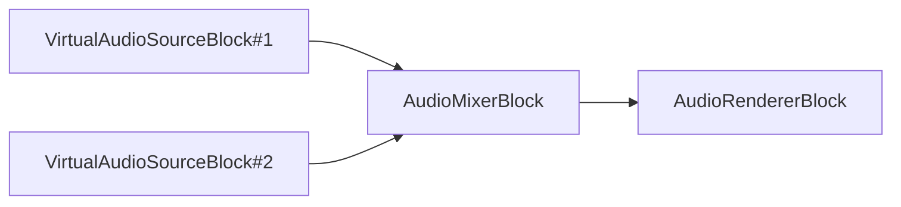

# Bloques de Procesamiento y Efectos de Audio para .NET

[Media Blocks SDK .Net](https://www.visioforge.com/media-blocks-sdk-net){ .md-button .md-button--primary target="_blank" }

VisioForge Media Blocks SDK proporciona un enfoque basado en pipelines para el procesamiento de audio en C# y .NET. Conecte bloques de audio — conversores, remuestreadores, mezcladores, ecualizadores, efectos y analizadores — para construir cadenas de procesamiento de audio en tiempo real para sus aplicaciones. Cada bloque tiene pines de entrada/salida tipados que se conectan entre sí usando `pipeline.Connect()`.

Para obtener información detallada sobre los parámetros y propiedades de los efectos de audio, consulte la [Referencia de Efectos de Audio](../../general/audio-effects/reference.md).

Todos los bloques son multiplataforma y funcionan en Windows, macOS, Linux, iOS y Android.

## Procesamiento Básico de Audio

### Audio Converter

El bloque Audio Converter convierte audio de un formato a otro.

#### Información del bloque

Nombre: AudioConverterBlock.

Dirección del pin | Tipo de medio | Cantidad de pines
--- | :---: | :---:
Entrada | Audio sin comprimir | 1
Salida | Audio sin comprimir | 1

#### Configuración

Sin parámetros configurables. Negocia y convierte automáticamente los formatos de audio entre los elementos conectados.

**Elemento GStreamer**: `audioconvert`

#### Pipeline de ejemplo


```mermaid
graph LR;
    UniversalSourceBlock-->AudioConverterBlock;
    AudioConverterBlock-->AudioRendererBlock;
```

#### Código de ejemplo

```csharp
var pipeline = new MediaBlocksPipeline();

var filename = "test.mp3";
var fileSource = new UniversalSourceBlock(await UniversalSourceSettings.CreateAsync(new Uri(filename)));

var audioConverter = new AudioConverterBlock();
pipeline.Connect(fileSource.AudioOutput, audioConverter.Input);

var audioRenderer = new AudioRendererBlock();
pipeline.Connect(audioConverter.Output, audioRenderer.Input);

await pipeline.StartAsync();
```

#### Plataformas

Windows, macOS, Linux, iOS, Android.

### Audio Resampler

El bloque Audio Resampler cambia la tasa de muestreo de un flujo de audio.

#### Información del bloque

Nombre: AudioResamplerBlock.

Dirección del pin | Tipo de medio | Cantidad de pines
--- | :---: | :---:
Entrada | Audio sin comprimir | 1
Salida | Audio sin comprimir | 1

#### Configuración

Configure mediante `AudioResamplerSettings`:

| Propiedad | Tipo | Predeterminado | Descripción |
|----------|------|---------|-------------|
| `Format` | `AudioFormatX` | `S16LE` | Formato de muestra de audio de destino |
| `SampleRate` | `int` | `44100` | Tasa de muestreo de destino en Hz |
| `Channels` | `int` | `2` | Número de canales de audio de destino |
| `Quality` | `int` | `4` | Calidad de remuestreo (0 = más baja, 10 = mejor) |
| `ResampleMethod` | `AudioResamplerMethod` | `Kaiser` | Algoritmo de remuestreo: `Nearest`, `Linear`, `Cubic`, `BlackmanNuttall`, `Kaiser` |

**Elemento GStreamer**: `audioresample`

#### Pipeline de ejemplo


```mermaid
graph LR;
    UniversalSourceBlock-->AudioResamplerBlock;
    AudioResamplerBlock-->AudioRendererBlock;
```

#### Código de ejemplo

```csharp
var pipeline = new MediaBlocksPipeline();

var filename = "test.mp3";
var fileSource = new UniversalSourceBlock(await UniversalSourceSettings.CreateAsync(new Uri(filename)));

// Resample to 48000 Hz, stereo
var settings = new AudioResamplerSettings(AudioFormatX.S16LE, 48000, 2);
var audioResampler = new AudioResamplerBlock(settings);
pipeline.Connect(fileSource.AudioOutput, audioResampler.Input);

var audioRenderer = new AudioRendererBlock();
pipeline.Connect(audioResampler.Output, audioRenderer.Input);

await pipeline.StartAsync();
```

#### Plataformas

Windows, macOS, Linux, iOS, Android.

### Audio Timestamp Corrector

El bloque Audio Timestamp Corrector puede agregar o eliminar cuadros para corregir el flujo de entrada de fuentes inestables.

#### Información del bloque

Nombre: AudioTimestampCorrectorBlock.

Dirección del pin | Tipo de medio | Cantidad de pines
--- | :---: | :---:
Entrada | Audio sin comprimir | 1
Salida | Audio sin comprimir | 1

#### Configuración

Configure mediante `AudioTimestampCorrectorSettings`:

| Propiedad | Tipo | Predeterminado | Descripción |
|----------|------|---------|-------------|
| `Silent` | `bool` | `true` | Suprime las señales de notificación para cuadros descartados y duplicados |
| `SkipToFirst` | `bool` | `false` | No produce búferes antes de que se reciba el primero |
| `Tolerance` | `TimeSpan` | `40 ms` | Diferencia mínima de marca de tiempo antes de que se agreguen o descarten muestras |

**Elemento GStreamer**: `audiorate`

#### Pipeline de ejemplo


```mermaid
graph LR;
    UniversalSourceBlock-->AudioTimestampCorrectorBlock;
    AudioTimestampCorrectorBlock-->AudioRendererBlock;
```

#### Código de ejemplo

```csharp
var pipeline = new MediaBlocksPipeline();

var filename = "test.mp3";
var fileSource = new UniversalSourceBlock(await UniversalSourceSettings.CreateAsync(new Uri(filename)));

var settings = new AudioTimestampCorrectorSettings();
var corrector = new AudioTimestampCorrectorBlock(settings);
pipeline.Connect(fileSource.AudioOutput, corrector.Input);

var audioRenderer = new AudioRendererBlock();
pipeline.Connect(corrector.Output, audioRenderer.Input);

await pipeline.StartAsync();
```

#### Plataformas

Windows, macOS, Linux, iOS, Android.

### Audio Delay

El bloque Audio Delay desplaza las marcas de tiempo de los búferes de audio para retrasar todo el flujo de audio. Úselo cuando el audio capturado o decodificado llega antes que el video y necesita corregir la sincronización A/V, o cuando solo una rama del pipeline de audio debe retrasarse antes de grabar o transmitir.

`AudioDelayBlock` es diferente de efectos de eco como `EchoBlock` o `RSAudioEchoBlock`: no mezcla una copia retrasada de vuelta en la señal. Retrasa el flujo aplicando un desplazamiento de marca de tiempo.

#### Información del bloque

Nombre: AudioDelayBlock.

Dirección del pin | Tipo de medio | Cantidad de pines
--- | :---: | :---:
Entrada | Audio sin comprimir | 1
Salida | Audio sin comprimir | 1

#### Configuración

Configure mediante `AudioDelaySettings` o pase un `TimeSpan` directamente al constructor:

| Propiedad | Tipo | Predeterminado | Descripción |
|----------|------|---------|-------------|
| `Delay` | `TimeSpan` | `TimeSpan.Zero` | Retardo de audio no negativo que se aplica al flujo |
| `Sync` | `bool` | `true` | Sincroniza el elemento subyacente con el reloj del pipeline |
| `Silent` | `bool` | `true` | Suprime mensajes handoff del elemento subyacente |

**Elemento GStreamer**: `identity` con `ts-offset`.

#### Pipeline de ejemplo


```mermaid
graph LR;
    UniversalSourceBlock-->AudioDelayBlock;
    AudioDelayBlock-->AudioRendererBlock;
```

#### Código de ejemplo

```csharp
var pipeline = new MediaBlocksPipeline();

var filename = "test.mp4";
var fileSource = new UniversalSourceBlock(await UniversalSourceSettings.CreateAsync(new Uri(filename)));

// Retrasa el audio 500 ms.
var audioDelay = new AudioDelayBlock(TimeSpan.FromMilliseconds(500));
pipeline.Connect(fileSource.AudioOutput, audioDelay.Input);

var audioRenderer = new AudioRendererBlock();
pipeline.Connect(audioDelay.Output, audioRenderer.Input);

await pipeline.StartAsync();
```

#### Retrasar solo la rama de grabación

Cuando previsualiza y graba al mismo tiempo, coloque `AudioDelayBlock` solo en la rama que necesita el desplazamiento.

```csharp
var audioTee = new TeeBlock(2, MediaBlockPadMediaType.Audio);
pipeline.Connect(audioSource.Output, audioTee.Input);

// Rama de previsualización sin retardo adicional.
pipeline.Connect(audioTee.Outputs[0], audioRenderer.Input);

// Rama de grabación con audio retrasado.
var audioDelay = new AudioDelayBlock(TimeSpan.FromMilliseconds(250));
pipeline.Connect(audioTee.Outputs[1], audioDelay.Input);
pipeline.Connect(audioDelay.Output, aacEncoder.Input);
pipeline.Connect(aacEncoder.Output, mp4Sink.CreateNewInput(MediaBlockPadMediaType.Audio));
```

#### Plataformas

Windows, macOS, Linux, iOS, Android.

### Volume

El bloque Volume le permite controlar el volumen del flujo de audio.

#### Información del bloque

Nombre: VolumeBlock.

Dirección del pin | Tipo de medio | Cantidad de pines
--- | :---: | :---:
Entrada | Audio sin comprimir | 1
Salida | Audio sin comprimir | 1

#### Configuración

| Propiedad | Tipo | Predeterminado | Descripción |
|----------|------|---------|-------------|
| `Level` | `double` | `1.0` | Multiplicador del nivel de volumen (0.0 = silencio, 1.0 = original, valores > 1.0 amplifican) |
| `Mute` | `bool` | `false` | Silencia el flujo de audio sin cambiar el nivel de volumen |

**Elemento GStreamer**: `volume`

#### Pipeline de ejemplo


```mermaid
graph LR;
    UniversalSourceBlock-->VolumeBlock;
    VolumeBlock-->AudioRendererBlock;
```

#### Código de ejemplo

```csharp
var pipeline = new MediaBlocksPipeline();

var filename = "test.mp3";
var fileSource = new UniversalSourceBlock(await UniversalSourceSettings.CreateAsync(new Uri(filename)));

// VolumeBlock tiene constructor sin parámetros; establece Level vía propiedad (0.0 silencio, 1.0 normal, >1.0 amplificado).
var volume = new VolumeBlock { Level = 0.8 };
pipeline.Connect(fileSource.AudioOutput, volume.Input);

var audioRenderer = new AudioRendererBlock();
pipeline.Connect(volume.Output, audioRenderer.Input);

await pipeline.StartAsync();
```

#### Plataformas

Windows, macOS, Linux, iOS, Android.

### Mezclador de audio

El bloque mezclador de audio mezcla múltiples flujos de audio en uno solo. El bloque mezcla los flujos independientemente de su formato, convirtiendo si es necesario.

Todos los flujos de entrada serán sincronizados. El bloque mezclador maneja la conversión de diferentes formatos de audio de entrada a un formato común para la mezcla. Por defecto, intentará coincidir con el formato de la primera entrada conectada, pero esto puede configurarse explícitamente.

Use la clase `AudioMixerSettings` para establecer el formato de salida personalizado. Esto es útil si necesita una tasa de muestreo, disposición de canales o formato de audio específico (como S16LE, Float32LE, etc.) para la salida mezclada.

#### Información del bloque

Nombre: AudioMixerBlock.

Dirección del pin | Tipo de medio | Cantidad de pines
--- | :---: | :---:
Entrada | Audio sin comprimir | 1 (creado dinámicamente)
Salida | Audio sin comprimir | 1

#### Configuración

Configure mediante `AudioMixerSettings`:

| Propiedad | Tipo | Predeterminado | Descripción |
|----------|------|---------|-------------|
| `Format` | `AudioInfoX` | `S16LE, 48000 Hz, 2 ch` | Formato de audio de salida (formato de muestra, tasa de muestreo, número de canales) |

**Métodos en tiempo de ejecución:**

| Método | Descripción |
|--------|-------------|
| `CreateNewInput()` | Crea un nuevo pad de entrada (antes de iniciar el pipeline) |
| `CreateNewInputLive()` | Crea un nuevo pad de entrada durante la reproducción |
| `RemoveInputLive(MediaBlockPad)` | Elimina un pad de entrada durante la reproducción |
| `SetVolume(int streamIndex, double value)` | Establece volumen para una entrada por índice 0-based (0.0–10.0) |
| `SetMute(int streamIndex, bool value)` | Silencia o activa una entrada por índice 0-based |

**Elemento GStreamer**: `audiomixer`

#### Pipeline de ejemplo


```mermaid
graph LR;
    VirtualAudioSourceBlock#1-->AudioMixerBlock;
    VirtualAudioSourceBlock#2-->AudioMixerBlock;
    AudioMixerBlock-->AudioRendererBlock;
```

#### Código de ejemplo

```csharp
var pipeline = new MediaBlocksPipeline();

var audioSource1Block = new VirtualAudioSourceBlock(new VirtualAudioSourceSettings());
var audioSource2Block = new VirtualAudioSourceBlock(new VirtualAudioSourceSettings());

// Configure the mixer with specific output settings if needed
// For example, to output 48kHz, 2-channel, S16LE audio:
// var mixerSettings = new AudioMixerSettings() { Format = new AudioInfoX(AudioFormatX.S16LE, 48000, 2) };
// var audioMixerBlock = new AudioMixerBlock(mixerSettings);
var audioMixerBlock = new AudioMixerBlock(new AudioMixerSettings());

// Each call to CreateNewInput() adds a new input to the mixer
var inputPad1 = audioMixerBlock.CreateNewInput();
pipeline.Connect(audioSource1Block.Output, inputPad1);

var inputPad2 = audioMixerBlock.CreateNewInput();
pipeline.Connect(audioSource2Block.Output, inputPad2);

// Output the mixed audio to the default audio renderer
var audioRenderer = new AudioRendererBlock();
pipeline.Connect(audioMixerBlock.Output, audioRenderer.Input);

await pipeline.StartAsync();
```

#### Control de flujos de entrada individuales

Puede controlar el volumen y el estado de silencio de los flujos de entrada individuales conectados al `AudioMixerBlock`.
El `streamIndex` para estos métodos corresponde al orden en que se agregaron las entradas mediante `CreateNewInput()` o `CreateNewInputLive()` (comenzando desde 0).

* **Establecer volumen**: Use el método `SetVolume(int streamIndex, double value)`. El `value` varía de 0.0 (silencio) a 1.0 (volumen normal), y puede ser mayor para amplificación (por ejemplo, hasta 10.0, aunque los detalles pueden depender de los límites de la implementación subyacente).
* **Establecer silencio**: Use el método `SetMute(int streamIndex, bool value)`. Establezca `value` en `true` para silenciar el flujo y `false` para activarlo.

```csharp
// Assuming audioMixerBlock is already created and inputs are connected

// Set volume of the first input stream (index 0) to 50%
audioMixerBlock.SetVolume(0, 0.5);

// Mute the second input stream (index 1)
audioMixerBlock.SetMute(1, true);
```

#### Gestión dinámica de entradas (pipeline en vivo)

El `AudioMixerBlock` soporta agregar y eliminar entradas dinámicamente mientras el pipeline está en ejecución:

* **Agregar entradas**: Use el método `CreateNewInputLive()` para obtener un nuevo pad de entrada que puede conectarse a una fuente. Los elementos GStreamer subyacentes se configurarán para manejar la nueva entrada.
* **Eliminar entradas**: Use el método `RemoveInputLive(MediaBlockPad blockPad)`. Esto desconectará el pad de entrada especificado y limpiará los recursos asociados.

Esto es particularmente útil para aplicaciones donde el número de fuentes de audio puede cambiar durante la operación, como una consola de mezcla en vivo o una aplicación de conferencias.

#### Plataformas

Windows, macOS, Linux, iOS, Android.

### Capturador de muestras de audio

El bloque capturador de muestras de audio le permite acceder a las muestras de audio sin procesar del flujo de audio.

#### Información del bloque

Nombre: AudioSampleGrabberBlock.

Dirección del pin | Tipo de medio | Cantidad de pines
--- | :---: | :---:
Entrada | Audio sin comprimir | 1
Salida | Audio sin comprimir | 1

#### Configuración

| Propiedad | Tipo | Predeterminado | Descripción |
|----------|------|---------|-------------|
| `format` (constructor) | `AudioFormatX` | `S16LE` | Formato de muestra de audio para cuadros capturados |

| Evento | Tipo de Args | Descripción |
|-------|-----------|-------------|
| `OnAudioFrameBuffer` | `AudioFrameBufferEventArgs` | Se dispara para cada cuadro de audio capturado con datos de audio sin procesar, tasa de muestreo, canales y marca de tiempo |

#### Pipeline de ejemplo


```mermaid
graph LR;
    UniversalSourceBlock-->AudioSampleGrabberBlock;
    AudioSampleGrabberBlock-->AudioRendererBlock;
```

#### Código de ejemplo

```csharp
var pipeline = new MediaBlocksPipeline();

var filename = "test.mp3";
var fileSource = new UniversalSourceBlock(await UniversalSourceSettings.CreateAsync(new Uri(filename)));

var audioSampleGrabber = new AudioSampleGrabberBlock();
audioSampleGrabber.OnAudioFrameBuffer += (sender, args) =>
{
    // args.Frame.Data        — IntPtr al buffer PCM crudo
    // args.Frame.DataSize    — tamaño en bytes del buffer
    // args.Frame.Info.Format — AudioFormat (ej. S16LE, F32LE)
    // args.Frame.Info.SampleRate / Channels / BPS
    // Establece args.UpdateData = true si mutas el buffer y quieres que se propague downstream.
};
pipeline.Connect(fileSource.AudioOutput, audioSampleGrabber.Input);

var audioRenderer = new AudioRendererBlock();
pipeline.Connect(audioSampleGrabber.Output, audioRenderer.Input);

await pipeline.StartAsync();
```

#### Plataformas

Windows, macOS, Linux, iOS, Android.

## Efectos de Audio

### Amplify

El bloque amplifica un flujo de audio por un factor de amplificación. Hay varios modos de recorte disponibles.

Use los valores de método y nivel para configurar.

#### Información del bloque

Nombre: AmplifyBlock.

Dirección del pin | Tipo de medio | Cantidad de pines
--- | :---: | :---:
Entrada | Audio sin comprimir | 1
Salida | Audio sin comprimir | 1

#### Configuración

| Propiedad | Tipo | Predeterminado | Descripción |
|----------|------|---------|-------------|
| `Level` | `double` | `1.0` | Multiplicador de amplificación (1.0 = sin cambio, 2.0 = doble volumen, 0.5 = mitad de volumen) |
| `Method` | `AmplifyClippingMethod` | `Normal` | Método de recorte cuando el audio amplificado excede el rango válido |

Valores de `AmplifyClippingMethod`:

| Valor | Descripción |
|-------|-------------|
| `Normal` | Recorte duro en el nivel máximo |
| `WrapNegative` | Empuja los valores sobreexcitados de regreso desde el lado opuesto |
| `WrapPositive` | Empuja los valores sobreexcitados de regreso desde el mismo lado |
| `NoClip` | Sin recorte aplicado |

**Elemento GStreamer**: `audioamplify`

#### Pipeline de ejemplo


```mermaid
graph LR;
    UniversalSourceBlock-->AmplifyBlock;
    AmplifyBlock-->AudioRendererBlock;
```

#### Código de ejemplo

```csharp
var pipeline = new MediaBlocksPipeline();

var filename = "test.mp3";
var fileSource = new UniversalSourceBlock(await UniversalSourceSettings.CreateAsync(new Uri(filename)));

var amplify = new AmplifyBlock(AmplifyClippingMethod.Normal, 2.0);
pipeline.Connect(fileSource.AudioOutput, amplify.Input);

var audioRenderer = new AudioRendererBlock();
pipeline.Connect(amplify.Output, audioRenderer.Input);

await pipeline.StartAsync();
```

#### Plataformas

Windows, macOS, Linux, iOS, Android.

### Echo

El bloque Echo agrega efecto de eco al flujo de audio.

#### Información del bloque

Nombre: EchoBlock.

Dirección del pin | Tipo de medio | Cantidad de pines
--- | :---: | :---:
Entrada | Audio sin comprimir | 1
Salida | Audio sin comprimir | 1

#### Configuración

| Propiedad | Tipo | Predeterminado | Descripción |
|----------|------|---------|-------------|
| `Delay` | `TimeSpan` | `200 ms` | Tiempo de retardo del eco entre la señal original y sus repeticiones |
| `MaxDelay` | `TimeSpan` | `500 ms` | Retardo máximo del eco (determina el tamaño del búfer interno). Debe ser >= `Delay` |
| `Intensity` | `float` | `0` | Volumen de la señal retardada (0.0 = sin eco, 1.0 = volumen completo) |
| `Feedback` | `float` | `0` | Cantidad de retroalimentación para repeticiones del eco (0.0 = eco único, valores cercanos a 1.0 = retroalimentación infinita) |

**Elemento GStreamer**: `audioecho`

#### Pipeline de ejemplo


```mermaid
graph LR;
    UniversalSourceBlock-->EchoBlock;
    EchoBlock-->AudioRendererBlock;
```

#### Código de ejemplo

```csharp
var pipeline = new MediaBlocksPipeline();

var filename = "test.mp3";
var fileSource = new UniversalSourceBlock(await UniversalSourceSettings.CreateAsync(new Uri(filename)));

// EchoBlock tiene constructor sin parámetros; establece las propiedades directamente.
var echo = new EchoBlock
{
    Delay     = TimeSpan.FromMilliseconds(200),   // retardo del eco
    MaxDelay  = TimeSpan.FromMilliseconds(500),   // tamaño de buffer interno (debe ser >= Delay)
    Intensity = 0.5f,                             // volumen del signal retardado (0.0-1.0)
    Feedback  = 0.3f                              // cantidad de feedback (0.0-cerca de 1.0)
};
pipeline.Connect(fileSource.AudioOutput, echo.Input);

var audioRenderer = new AudioRendererBlock();
pipeline.Connect(echo.Output, audioRenderer.Input);

await pipeline.StartAsync();
```

#### Plataformas

Windows, macOS, Linux, iOS, Android.

### Karaoke

El bloque Karaoke aplica un efecto de karaoke al flujo de audio, eliminando las voces con panorámica central.

#### Información del bloque

Nombre: KaraokeBlock.

Dirección del pin | Tipo de medio | Cantidad de pines
--- | :---: | :---:
Entrada | Audio sin comprimir | 1
Salida | Audio sin comprimir | 1

#### Configuración

Configure mediante `KaraokeAudioEffect`:

| Propiedad | Tipo | Predeterminado | Descripción |
|----------|------|---------|-------------|
| `Level` | `float` | `1.0` | Intensidad de supresión vocal (0.0 = sin efecto, 1.0 = supresión máxima) |
| `MonoLevel` | `float` | `1.0` | Nivel de supresión para contenido mono/canal central (0.0–1.0) |
| `FilterBand` | `float` | `220` | Frecuencia central de la banda de filtro en Hz dirigida al rango vocal |
| `FilterWidth` | `float` | `100` | Ancho de la banda de frecuencia a procesar en Hz |

**Elemento GStreamer**: `audiokaraoke`

#### Pipeline de ejemplo


```mermaid
graph LR;
    UniversalSourceBlock-->KaraokeBlock;
    KaraokeBlock-->AudioRendererBlock;
```

#### Código de ejemplo

```csharp
var pipeline = new MediaBlocksPipeline();

var filename = "test.mp3";
var fileSource = new UniversalSourceBlock(await UniversalSourceSettings.CreateAsync(new Uri(filename)));

var settings = new KaraokeAudioEffect();
var karaoke = new KaraokeBlock(settings);
pipeline.Connect(fileSource.AudioOutput, karaoke.Input);

var audioRenderer = new AudioRendererBlock();
pipeline.Connect(karaoke.Output, audioRenderer.Input);

await pipeline.StartAsync();
```

#### Plataformas

Windows, macOS, Linux, iOS, Android.

### Reverberación

El bloque de reverberación agrega efectos de reverberación al flujo de audio.

#### Información del bloque

Nombre: ReverberationBlock.

Dirección del pin | Tipo de medio | Cantidad de pines
--- | :---: | :---:
Entrada | Audio sin comprimir | 1
Salida | Audio sin comprimir | 1

#### Configuración

Configure mediante `ReverberationAudioEffect`:

| Propiedad | Tipo | Predeterminado | Descripción |
|----------|------|---------|-------------|
| `RoomSize` | `float` | `0.5` | Tamaño de la habitación simulada (0.0 = habitación pequeña, 1.0 = sala grande) |
| `Damping` | `float` | `0.2` | Amortiguación de alta frecuencia (0.0 = brillante, 1.0 = oscuro/amortiguado) |
| `Width` | `float` | `1.0` | Ancho estéreo de la reverberación (0.0 = mono, 1.0 = estéreo completo) |
| `Level` | `float` | `0.5` | Nivel de mezcla húmedo/seco (0.0 = solo seco, 1.0 = solo húmedo) |

**Elemento GStreamer**: `freeverb`

#### Pipeline de ejemplo


```mermaid
graph LR;
    UniversalSourceBlock-->ReverberationBlock;
    ReverberationBlock-->AudioRendererBlock;
```

#### Código de ejemplo

```csharp
var pipeline = new MediaBlocksPipeline();

var filename = "test.mp3";
var fileSource = new UniversalSourceBlock(await UniversalSourceSettings.CreateAsync(new Uri(filename)));

var settings = new ReverberationAudioEffect();
var reverb = new ReverberationBlock(settings);
pipeline.Connect(fileSource.AudioOutput, reverb.Input);

var audioRenderer = new AudioRendererBlock();
pipeline.Connect(reverb.Output, audioRenderer.Input);

await pipeline.StartAsync();
```

#### Plataformas

Windows, macOS, Linux, iOS, Android.

### Wide Stereo

El bloque Wide Stereo mejora la imagen estéreo del audio.

#### Información del bloque

Nombre: WideStereoBlock.

Dirección del pin | Tipo de medio | Cantidad de pines
--- | :---: | :---:
Entrada | Audio sin comprimir | 1
Salida | Audio sin comprimir | 1

#### Configuración

Configure mediante `WideStereoAudioEffect`:

| Propiedad | Tipo | Predeterminado | Descripción |
|----------|------|---------|-------------|
| `Level` | `float` | `0.01` | Cantidad de ampliación estéreo (0.0 = sin ampliación, valores más altos = imagen estéreo más amplia). Típico: 0.01–0.03 sutil, 0.05–0.10 moderado, 0.15+ fuerte |

**Elemento GStreamer**: `stereo`

#### Pipeline de ejemplo


```mermaid
graph LR;
    UniversalSourceBlock-->WideStereoBlock;
    WideStereoBlock-->AudioRendererBlock;
```

#### Código de ejemplo

```csharp
var pipeline = new MediaBlocksPipeline();

var filename = "test.mp3";
var fileSource = new UniversalSourceBlock(await UniversalSourceSettings.CreateAsync(new Uri(filename)));

var settings = new WideStereoAudioEffect();
var wideStereo = new WideStereoBlock(settings);
pipeline.Connect(fileSource.AudioOutput, wideStereo.Input);

var audioRenderer = new AudioRendererBlock();
pipeline.Connect(wideStereo.Output, audioRenderer.Input);

await pipeline.StartAsync();
```

#### Plataformas

Windows, macOS, Linux, iOS, Android.

## Ecualización y Filtrado

### Balance

El bloque le permite controlar el balance entre los canales izquierdo y derecho.

#### Información del bloque

Nombre: AudioBalanceBlock.

Dirección del pin | Tipo de medio | Cantidad de pines
--- | :---: | :---:
Entrada | Audio sin comprimir | 1
Salida | Audio sin comprimir | 1

#### Configuración

| Propiedad | Tipo | Predeterminado | Descripción |
|----------|------|---------|-------------|
| `Balance` | `float` | `0.0` | Posición del balance estéreo (-1.0 = completamente a la izquierda, 0.0 = centro, +1.0 = completamente a la derecha) |

**Elemento GStreamer**: `audiopanorama`

#### Pipeline de ejemplo


```mermaid
graph LR;
    UniversalSourceBlock-->AudioBalanceBlock;
    AudioBalanceBlock-->AudioRendererBlock;
```

#### Código de ejemplo

```csharp
var pipeline = new MediaBlocksPipeline();

var filename = "test.mp3";
var fileSource = new UniversalSourceBlock(await UniversalSourceSettings.CreateAsync(new Uri(filename)));

// Balance: -1.0 (full left) to 1.0 (full right), 0.0 - center
var balance = new AudioBalanceBlock(0.5f);  // el constructor toma float, no double
pipeline.Connect(fileSource.AudioOutput, balance.Input);

var audioRenderer = new AudioRendererBlock();
pipeline.Connect(balance.Output, audioRenderer.Input);

await pipeline.StartAsync();
```

#### Plataformas

Windows, macOS, Linux, iOS, Android.

### Ecualizador (10 bandas)

El bloque de ecualizador de 10 bandas proporciona un ecualizador de 10 bandas para el procesamiento de audio.

#### Información del bloque

Nombre: Equalizer10Block.

Dirección del pin | Tipo de medio | Cantidad de pines
--- | :---: | :---:
Entrada | Audio sin comprimir | 1
Salida | Audio sin comprimir | 1

#### Configuración

El ecualizador proporciona 10 bandas de frecuencia fija. Use `SetBand(int index, double gain)` para ajustar bandas individuales. Rango de ganancia: -24 dB a +12 dB.

| Índice de Banda | Frecuencia Central | Ancho de Banda |
|------------|-----------------|-----------|
| 0 | 29 Hz | 19 Hz |
| 1 | 59 Hz | 39 Hz |
| 2 | 119 Hz | 79 Hz |
| 3 | 237 Hz | 157 Hz |
| 4 | 474 Hz | 314 Hz |
| 5 | 947 Hz | 628 Hz |
| 6 | 1889 Hz | 1257 Hz |
| 7 | 3770 Hz | 2511 Hz |
| 8 | 7523 Hz | 5765 Hz |
| 9 | 15011 Hz | 11498 Hz |

El constructor no tiene parámetros. Usa `SetBand(int index, double gain)` para ajustar cada una de las 10 bandas después de la construcción.

**Elemento GStreamer**: `equalizer-10bands`

#### Pipeline de ejemplo


```mermaid
graph LR;
    UniversalSourceBlock-->Equalizer10Block;
    Equalizer10Block-->AudioRendererBlock;
```

#### Código de ejemplo

```csharp
var pipeline = new MediaBlocksPipeline();

var filename = "test.mp3";
var fileSource = new UniversalSourceBlock(await UniversalSourceSettings.CreateAsync(new Uri(filename)));

// Crear ecualizador de 10 bandas (ctor sin parámetros; bandas por defecto en 0 dB)
var equalizer = new Equalizer10Block();

// Configurar bandas individualmente
equalizer.SetBand(0, 3); // Band 0 (31 Hz) to +3 dB
equalizer.SetBand(1, 2); // Band 1 (62 Hz) to +2 dB
equalizer.SetBand(9, -3); // Band 9 (16 kHz) to -3 dB

pipeline.Connect(fileSource.AudioOutput, equalizer.Input);

var audioRenderer = new AudioRendererBlock();
pipeline.Connect(equalizer.Output, audioRenderer.Input);

await pipeline.StartAsync();
```

#### Plataformas

Windows, macOS, Linux, iOS, Android.

### Ecualizador (Paramétrico)

El bloque de ecualizador paramétrico proporciona un ecualizador paramétrico para el procesamiento de audio.

#### Información del bloque

Nombre: EqualizerParametricBlock.

Dirección del pin | Tipo de medio | Cantidad de pines
--- | :---: | :---:
Entrada | Audio sin comprimir | 1
Salida | Audio sin comprimir | 1

#### Configuración

Use `SetNumBands(int count)` para establecer el número de bandas (1–64, predeterminado 3), luego configure cada banda con `SetState(int index, ParametricEqualizerBand band)`.

Propiedades de `ParametricEqualizerBand`:

| Propiedad | Tipo | Predeterminado | Descripción |
|----------|------|---------|-------------|
| `Frequency` | `float` | varía | Frecuencia central en Hz |
| `Gain` | `float` | `0.0` | Ganancia de banda en dB (-24 a +12) |
| `Width` | `float` | `1.0` | Ancho de banda en Hz |

Bandas predeterminadas (cuando se configuran 3 bandas):

| Banda | Frecuencia | Ancho de Banda |
|------|-----------|-----------|
| 0 | 110 Hz | 100 Hz |
| 1 | 1100 Hz | 1000 Hz |
| 2 | 11000 Hz | 10000 Hz |

**Elemento GStreamer**: `equalizer-nbands`

#### Pipeline de ejemplo


```mermaid
graph LR;
    UniversalSourceBlock-->EqualizerParametricBlock;
    EqualizerParametricBlock-->AudioRendererBlock;
```

#### Código de ejemplo

```csharp
var pipeline = new MediaBlocksPipeline();

var filename = "test.mp3";
var fileSource = new UniversalSourceBlock(await UniversalSourceSettings.CreateAsync(new Uri(filename)));

// Create parametric equalizer
var equalizer = new EqualizerParametricBlock();

// Set up to 4 bands
// ParametricEqualizerBand(freq: Hz, width: Hz bandwidth, gain: dB). Propiedades: Frequency, Width, Gain.
equalizer.SetNumBands(4);
equalizer.SetState(0, new ParametricEqualizerBand(freq: 100f,  width: 50f,  gain: 3f));
equalizer.SetState(1, new ParametricEqualizerBand(freq: 1000f, width: 500f, gain: -2f));

pipeline.Connect(fileSource.AudioOutput, equalizer.Input);

var audioRenderer = new AudioRendererBlock();
pipeline.Connect(equalizer.Output, audioRenderer.Input);

await pipeline.StartAsync();
```

#### Plataformas

Windows, macOS, Linux, iOS, Android.

### Chebyshev Band Pass/Reject

El bloque Chebyshev Band Pass/Reject aplica un filtro pasa banda o rechaza banda al flujo de audio usando filtros de Chebyshev.

#### Información del bloque

Nombre: ChebyshevBandPassRejectBlock.

Dirección del pin | Tipo de medio | Cantidad de pines
--- | :---: | :---:
Entrada | Audio sin comprimir | 1
Salida | Audio sin comprimir | 1

#### Configuración

Configure mediante `ChebyshevBandPassRejectAudioEffect`:

| Propiedad | Tipo | Predeterminado | Descripción |
|----------|------|---------|-------------|
| `Mode` | `ChebyshevBandMode` | `BandPass` | Modo de filtro: `BandPass` (pasar frecuencias en rango) o `BandReject` (rechazar frecuencias en rango) |
| `LowerFrequency` | `float` | `220.0` | Frecuencia de corte inferior en Hz |
| `UpperFrequency` | `float` | `3000.0` | Frecuencia de corte superior en Hz |
| `Poles` | `int` | `4` | Número de polos del filtro (2–32, debe ser par). Valores más altos = corte más abrupto |
| `Type` | `int` | `1` | Tipo de filtro Chebyshev: 1 (rizado en banda de paso) o 2 (rizado en banda de rechazo) |
| `Ripple` | `float` | `0.25` | Cantidad de rizado en dB (Tipo 1: rizado en banda de paso, Tipo 2: rizado en banda de rechazo) |

**Elemento GStreamer**: `audiochebband`

#### Pipeline de ejemplo


```mermaid
graph LR;
    UniversalSourceBlock-->ChebyshevBandPassRejectBlock;
    ChebyshevBandPassRejectBlock-->AudioRendererBlock;
```

#### Código de ejemplo

```csharp
var pipeline = new MediaBlocksPipeline();

var filename = "test.mp3";
var fileSource = new UniversalSourceBlock(await UniversalSourceSettings.CreateAsync(new Uri(filename)));

var settings = new ChebyshevBandPassRejectAudioEffect();
var filter = new ChebyshevBandPassRejectBlock(settings);
pipeline.Connect(fileSource.AudioOutput, filter.Input);

var audioRenderer = new AudioRendererBlock();
pipeline.Connect(filter.Output, audioRenderer.Input);

await pipeline.StartAsync();
```

#### Plataformas

Windows, macOS, Linux, iOS, Android.

### Chebyshev Limit

El bloque Chebyshev Limit aplica filtrado de paso bajo o paso alto al audio usando filtros de Chebyshev.

#### Información del bloque

Nombre: ChebyshevLimitBlock.

Dirección del pin | Tipo de medio | Cantidad de pines
--- | :---: | :---:
Entrada | Audio sin comprimir | 1
Salida | Audio sin comprimir | 1

#### Configuración

Configure mediante `ChebyshevLimitAudioEffect`:

| Propiedad | Tipo | Predeterminado | Descripción |
|----------|------|---------|-------------|
| `Mode` | `ChebyshevLimitMode` | `LowPass` | Modo de filtro: `LowPass` (eliminar frecuencias altas) o `HighPass` (eliminar frecuencias bajas) |
| `CutOffFrequency` | `float` | `1000.0` | Frecuencia de corte en Hz |
| `Poles` | `int` | `4` | Número de polos del filtro (2–32, debe ser par). Valores más altos = corte más abrupto |
| `Type` | `int` | `1` | Tipo de filtro Chebyshev: 1 (rizado en banda de paso) o 2 (rizado en banda de rechazo) |
| `Ripple` | `float` | `0.25` | Cantidad de rizado en dB |

**Elemento GStreamer**: `audiocheblimit`

#### Pipeline de ejemplo


```mermaid
graph LR;
    UniversalSourceBlock-->ChebyshevLimitBlock;
    ChebyshevLimitBlock-->AudioRendererBlock;
```

#### Código de ejemplo

```csharp
var pipeline = new MediaBlocksPipeline();

var filename = "test.mp3";
var fileSource = new UniversalSourceBlock(await UniversalSourceSettings.CreateAsync(new Uri(filename)));

var settings = new ChebyshevLimitAudioEffect();
var filter = new ChebyshevLimitBlock(settings);
pipeline.Connect(fileSource.AudioOutput, filter.Input);

var audioRenderer = new AudioRendererBlock();
pipeline.Connect(filter.Output, audioRenderer.Input);

await pipeline.StartAsync();
```

#### Plataformas

Windows, macOS, Linux, iOS, Android.

## Procesamiento Dinámico

### Compresor/Expansor

El bloque compresor/expansor proporciona compresión o expansión del rango dinámico.

#### Información del bloque

Nombre: CompressorExpanderBlock.

Dirección del pin | Tipo de medio | Cantidad de pines
--- | :---: | :---:
Entrada | Audio sin comprimir | 1
Salida | Audio sin comprimir | 1

#### Configuración

Configure mediante `CompressorExpanderAudioEffect`:

| Propiedad | Tipo | Predeterminado | Descripción |
|----------|------|---------|-------------|
| `Mode` | `AudioCompressorMode` | `Compressor` | Modo de procesamiento: `Compressor` (reducir rango dinámico) o `Expander` (aumentar rango dinámico) |
| `Characteristics` | `AudioDynamicCharacteristics` | `HardKnee` | Tipo de rodilla: `HardKnee` (transición abrupta) o `SoftKnee` (transición gradual) |
| `Ratio` | `float` | `1.0` | Relación de compresión/expansión (por ejemplo, 2.0 = compresión 2:1) |
| `Threshold` | `float` | `0.0` | Nivel de umbral (0.0–1.0). La señal por encima de este nivel se comprime/expande |

El constructor no tiene parámetros. Configura vía `Ratio`, `Threshold`, `Mode` y `Characteristics` después de construir.

**Elemento GStreamer**: `audiodynamic`

#### Pipeline de ejemplo


```mermaid
graph LR;
    UniversalSourceBlock-->CompressorExpanderBlock;
    CompressorExpanderBlock-->AudioRendererBlock;
```

#### Código de ejemplo

```csharp
var pipeline = new MediaBlocksPipeline();

var filename = "test.mp3";
var fileSource = new UniversalSourceBlock(await UniversalSourceSettings.CreateAsync(new Uri(filename)));

// CompressorExpanderBlock tiene constructor sin parámetros; establece las propiedades directamente.
var compressor = new CompressorExpanderBlock
{
    Mode            = AudioCompressorMode.Compressor,
    Characteristics = AudioDynamicCharacteristics.HardKnee,
    Ratio           = 4f,    // compresión 4:1
    Threshold       = 0.5f   // 0.0-1.0 (amplitud lineal, no dB en este bloque)
};
pipeline.Connect(fileSource.AudioOutput, compressor.Input);

var audioRenderer = new AudioRendererBlock();
pipeline.Connect(compressor.Output, audioRenderer.Input);

await pipeline.StartAsync();
```

#### Plataformas

Windows, macOS, Linux, iOS, Android.

### Scale/Tempo

El bloque Scale/Tempo le permite cambiar el tempo y el tono del flujo de audio.

#### Información del bloque

Nombre: ScaleTempoBlock.

Dirección del pin | Tipo de medio | Cantidad de pines
--- | :---: | :---:
Entrada | Audio sin comprimir | 1
Salida | Audio sin comprimir | 1

#### Configuración

| Propiedad | Tipo | Predeterminado | Descripción |
|----------|------|---------|-------------|
| `Rate` | `double` | `1.0` | Multiplicador de velocidad de reproducción (0.5 = mitad de velocidad, 1.0 = normal, 2.0 = doble velocidad). Se preserva el tono |
| `Overlap` | `double` | `0.2` | Porcentaje de stride a superponer (0.0–1.0). Valores más altos mejoran la calidad a costa de CPU |
| `Search` | `TimeSpan` | `14 ms` | Longitud de la ventana de búsqueda para la mejor posición de superposición |
| `Stride` | `TimeSpan` | `30 ms` | Longitud del stride de audio de salida |

El constructor no tiene parámetros; establece `Rate` vía propiedad (el `SetRate` subyacente se invoca internamente al asignar `Rate`).

**Elemento GStreamer**: `scaletempo`

#### Pipeline de ejemplo


```mermaid
graph LR;
    UniversalSourceBlock-->ScaleTempoBlock;
    ScaleTempoBlock-->AudioRendererBlock;
```

#### Código de ejemplo

```csharp
var pipeline = new MediaBlocksPipeline();

var filename = "test.mp3";
var fileSource = new UniversalSourceBlock(await UniversalSourceSettings.CreateAsync(new Uri(filename)));

// Scale tempo by factor (1.0 is normal, 0.5 is half-speed, 2.0 is double-speed)
// ScaleTempoBlock tiene constructor sin parámetros; establece Rate vía propiedad.
// 1.0 = normal, 0.5 = mitad de velocidad, 2.0 = doble velocidad; el pitch se preserva.
var scaleTempo = new ScaleTempoBlock { Rate = 1.5 };
pipeline.Connect(fileSource.AudioOutput, scaleTempo.Input);

var audioRenderer = new AudioRendererBlock();
pipeline.Connect(scaleTempo.Output, audioRenderer.Input);

await pipeline.StartAsync();
```

#### Plataformas

Windows, macOS, Linux, iOS, Android.

## Análisis y Medición

### VU Meter

El bloque VU Meter le permite medir el nivel de volumen del flujo de audio.

#### Información del bloque

Nombre: VUMeterBlock.

Dirección del pin | Tipo de medio | Cantidad de pines
--- | :---: | :---:
Entrada | Audio sin comprimir | 1
Salida | Audio sin comprimir | 1

#### Configuración

Bloque basado en eventos. Suscríbase al evento `OnAudioVUMeter` (tipo: `EventHandler<VUMeterXEventArgs>`) para recibir datos de nivel.

`VUMeterXEventArgs.MeterData` contiene una instancia `VUMeterXData` con arrays por canal:

| Propiedad en `VUMeterXData` | Tipo | Descripción |
|----------|------|-------------|
| `ChannelsCount` | `int` | Número de canales de audio reportados |
| `Peak` | `double[]` | Niveles de pico por canal (dB) |
| `RMS` | `double[]` | Niveles RMS por canal (dB) |
| `Decay` | `double[]` | Niveles de decay por canal (dB) |

**Elemento GStreamer**: `level`

#### Pipeline de ejemplo


```mermaid
graph LR;
    UniversalSourceBlock-->VUMeterBlock;
    VUMeterBlock-->AudioRendererBlock;
```

#### Código de ejemplo

```csharp
var pipeline = new MediaBlocksPipeline();

var filename = "test.mp3";
var fileSource = new UniversalSourceBlock(await UniversalSourceSettings.CreateAsync(new Uri(filename)));

var vuMeter = new VUMeterBlock();
vuMeter.OnAudioVUMeter += (sender, args) =>
{
    var data = args.MeterData;
    for (int i = 0; i < data.ChannelsCount; i++)
    {
        Console.WriteLine($"Ch{i}: Peak={data.Peak[i]:F2} dB, RMS={data.RMS[i]:F2} dB");
    }
};
pipeline.Connect(fileSource.AudioOutput, vuMeter.Input);

var audioRenderer = new AudioRendererBlock();
pipeline.Connect(vuMeter.Output, audioRenderer.Input);

await pipeline.StartAsync();
```

#### Plataformas

Windows, macOS, Linux, iOS, Android.

## Efectos de Audio

### Audio Effects

El bloque AudioEffects proporciona una colección completa de efectos de procesamiento de audio que pueden aplicarse a flujos de audio. Para obtener información detallada sobre los parámetros y propiedades de los efectos, consulte la [Referencia de Efectos de Audio](../../general/audio-effects/reference.md).

#### Información del bloque

Nombre: AudioEffectsBlock.

Dirección del pin | Tipo de medio | Cantidad de pines
--- | :---: | :---:
Entrada | Audio sin comprimir | 1
Salida | Audio sin comprimir | 1

#### Configuración

Gestión de efectos basada en colección. Use los siguientes métodos:

| Método | Descripción |
|--------|-------------|
| `AddOrUpdate(BaseAudioEffect effect)` | Agrega un nuevo efecto o actualiza uno existente del mismo tipo |
| `Remove<T>()` | Elimina el efecto del tipo especificado |
| `Clear()` | Elimina todos los efectos |
| `Get<T>()` | Retorna el efecto del tipo especificado, o null |

Los tipos de efectos soportados incluyen todos los efectos del espacio de nombres `VisioForge.Core.Types.X.AudioEffects`. Consulte la [Referencia de Efectos de Audio](../../general/audio-effects/reference.md) para parámetros detallados.

#### Pipeline de ejemplo

```mermaid
graph LR;
    UniversalSourceBlock-->AudioEffectsBlock;
    AudioEffectsBlock-->AudioRendererBlock;
```

#### Código de ejemplo

```csharp
var pipeline = new MediaBlocksPipeline();

var filename = "test.mp3";
var fileSource = new UniversalSourceBlock(await UniversalSourceSettings.CreateAsync(new Uri(filename)));

var audioEffects = new AudioEffectsBlock();
pipeline.Connect(fileSource.AudioOutput, audioEffects.Input);

var audioRenderer = new AudioRendererBlock();
pipeline.Connect(audioEffects.Output, audioRenderer.Input);

await pipeline.StartAsync();
```

#### Plataformas

Windows, macOS, Linux, iOS, Android.

### Normalización de Sonoridad de Audio

El bloque AudioLoudNorm normaliza la sonoridad del audio según los estándares EBU R128, asegurando una sonoridad percibida consistente entre diferentes contenidos de audio.

#### Información del bloque

Nombre: AudioLoudNormBlock.

Dirección del pin | Tipo de medio | Cantidad de pines
--- | :---: | :---:
Entrada | Audio sin comprimir | 1
Salida | Audio sin comprimir | 1

#### Configuración

Configure mediante `AudioLoudNormAudioEffect`:

| Propiedad | Tipo | Predeterminado | Descripción |
|----------|------|---------|-------------|
| `LoudnessTarget` | `double` | `-24.0` | Sonoridad integrada objetivo en LUFS (-70.0 a -5.0) |
| `LoudnessRangeTarget` | `double` | `7.0` | Rango de sonoridad objetivo en LU (1.0 a 20.0) |
| `MaxTruePeak` | `double` | `-2.0` | Pico verdadero máximo en dBTP (-9.0 a 0.0) |
| `Offset` | `double` | `0.0` | Ganancia de compensación en LU (-99.0 a 99.0) |

**Elemento GStreamer**: `audioloudnorm`

#### Pipeline de ejemplo

```mermaid
graph LR;
    UniversalSourceBlock-->AudioLoudNormBlock;
    AudioLoudNormBlock-->AudioRendererBlock;
```

#### Código de ejemplo

```csharp
var pipeline = new MediaBlocksPipeline();

var filename = "test.mp3";
var fileSource = new UniversalSourceBlock(await UniversalSourceSettings.CreateAsync(new Uri(filename)));

var loudNorm = new AudioLoudNormBlock();
pipeline.Connect(fileSource.AudioOutput, loudNorm.Input);

var audioRenderer = new AudioRendererBlock();
pipeline.Connect(loudNorm.Output, audioRenderer.Input);

await pipeline.StartAsync();
```

#### Plataformas

Windows, macOS, Linux, iOS, Android.

### Reducción de Ruido RNN

El bloque AudioRNNoise utiliza reducción de ruido basada en redes neuronales recurrentes (RNN) para eliminar el ruido de fondo de los flujos de audio mientras preserva la calidad del habla.

#### Información del bloque

Nombre: AudioRNNoiseBlock.

Dirección del pin | Tipo de medio | Cantidad de pines
--- | :---: | :---:
Entrada | Audio sin comprimir | 1
Salida | Audio sin comprimir | 1

#### Configuración

| Propiedad | Tipo | Predeterminado | Descripción |
|----------|------|---------|-------------|
| `VadThreshold` | `float` | `0.0` | Umbral de Detección de Actividad de Voz (0.0–1.0). Cuando > 0, actúa como puerta: el audio por debajo de esta probabilidad de habla se silencia. 0.0 = solo reducción de ruido, sin compuerta |

**Elemento GStreamer**: `audiornnoise`

#### Pipeline de ejemplo

```mermaid
graph LR;
    UniversalSourceBlock-->AudioRNNoiseBlock;
    AudioRNNoiseBlock-->AudioRendererBlock;
```

#### Código de ejemplo

```csharp
var pipeline = new MediaBlocksPipeline();

var filename = "noisy_audio.mp3";
var fileSource = new UniversalSourceBlock(await UniversalSourceSettings.CreateAsync(new Uri(filename)));

var rnnoise = new AudioRNNoiseBlock();
pipeline.Connect(fileSource.AudioOutput, rnnoise.Input);

var audioRenderer = new AudioRendererBlock();
pipeline.Connect(rnnoise.Output, audioRenderer.Input);

await pipeline.StartAsync();
```

#### Plataformas

Windows, macOS, Linux, iOS, Android.

### Eliminar Silencio

El bloque RemoveSilence detecta y elimina automáticamente las porciones silenciosas de los flujos de audio, útil para podcasts, grabaciones de voz y edición de audio.

#### Información del bloque

Nombre: RemoveSilenceBlock.

Dirección del pin | Tipo de medio | Cantidad de pines
--- | :---: | :---:
Entrada | Audio sin comprimir | 1
Salida | Audio sin comprimir | 1

#### Configuración

Configure mediante `RemoveSilenceAudioEffect`:

| Propiedad | Tipo | Predeterminado | Descripción |
|----------|------|---------|-------------|
| `Threshold` | `double` | `0.05` | Umbral de silencio (0.0–1.0). El audio por debajo de este nivel se considera silencio |
| `Squash` | `bool` | `true` | Cuando es verdadero, elimina las porciones silenciosas por completo. Cuando es falso, las deja pasar |

**Elemento GStreamer**: `removesilence`

#### Pipeline de ejemplo

```mermaid
graph LR;
    UniversalSourceBlock-->RemoveSilenceBlock;
    RemoveSilenceBlock-->AudioRendererBlock;
```

#### Código de ejemplo

```csharp
var pipeline = new MediaBlocksPipeline();

var filename = "podcast.mp3";
var fileSource = new UniversalSourceBlock(await UniversalSourceSettings.CreateAsync(new Uri(filename)));

var removeSilence = new RemoveSilenceBlock();
pipeline.Connect(fileSource.AudioOutput, removeSilence.Input);

var audioRenderer = new AudioRendererBlock();
pipeline.Connect(removeSilence.Output, audioRenderer.Input);

await pipeline.StartAsync();
```

#### Plataformas

Windows, macOS, Linux, iOS, Android.

### Filtro Csound

El bloque CsoundFilter proporciona síntesis y procesamiento de audio avanzado utilizando el lenguaje de programación de audio Csound.

#### Información del bloque

Nombre: CsoundFilterBlock.

Dirección del pin | Tipo de medio | Cantidad de pines
--- | :---: | :---:
Entrada | Audio sin comprimir | 1
Salida | Audio sin comprimir | 1

#### Configuración

Configure mediante `CsoundAudioEffect`:

| Propiedad | Tipo | Predeterminado | Descripción |
|----------|------|---------|-------------|
| `CsdText` | `string` | `null` | Texto de script CSD de Csound en línea |
| `Location` | `string` | `null` | Ruta a un archivo .csd externo (alternativa a CsdText) |
| `Loop` | `bool` | `false` | Si se debe repetir la partitura de Csound |
| `ScoreOffset` | `double` | `0.0` | Desplazamiento de tiempo de la partitura en segundos |

**Elemento GStreamer**: `csoundfilter`

#### Pipeline de ejemplo

```mermaid
graph LR;
    UniversalSourceBlock-->CsoundFilterBlock;
    CsoundFilterBlock-->AudioRendererBlock;
```

#### Código de ejemplo

```csharp
var pipeline = new MediaBlocksPipeline();

var filename = "test.mp3";
var fileSource = new UniversalSourceBlock(await UniversalSourceSettings.CreateAsync(new Uri(filename)));

// CsoundFilterBlock toma el contenido del script Csound (.csd) directamente, no un objeto settings.
// Carga el script desde disco y pasa el texto al constructor — opcionalmente establece Loop/ScoreOffset.
var csdText = File.ReadAllText("filter.csd");
var csound = new CsoundFilterBlock(csdText, loop: false, scoreOffset: 0.0);
pipeline.Connect(fileSource.AudioOutput, csound.Input);

var audioRenderer = new AudioRendererBlock();
pipeline.Connect(csound.Output, audioRenderer.Input);

await pipeline.StartAsync();
```

#### Plataformas

Windows, macOS, Linux (requiere Csound).

### Nivel EBU R128

El bloque EbuR128Level mide la sonoridad del audio según el estándar EBU R128, proporcionando mediciones precisas de sonoridad para cumplimiento de transmisión.

#### Información del bloque

Nombre: EbuR128LevelBlock.

Dirección del pin | Tipo de medio | Cantidad de pines
--- | :---: | :---:
Entrada | Audio sin comprimir | 1
Salida | Audio sin comprimir | 1

#### Configuración

| Propiedad | Tipo | Predeterminado | Descripción |
|----------|------|---------|-------------|
| `Mode` | `EbuR128Mode` | `All` | Indicadores de modo de medición: `MomentaryLoudness`, `ShortTermLoudness`, `GlobalLoudness`, `LoudnessRange`, `SamplePeak`, `TruePeak`, `All` |
| `PostMessages` | `bool` | `true` | Si se deben publicar mensajes de bus GStreamer con los resultados de medición |
| `Interval` | `TimeSpan` | `1 s` | Intervalo entre actualizaciones de medición |

`EbuR128LevelBlock` mide la sonoridad internamente y publica los resultados en el bus GStreamer cuando `PostMessages = true`. **No** expone un evento managed — lee la propiedad `level` o maneja el mensaje del bus tú mismo si necesitas los valores desde .NET.

**Elemento GStreamer**: `ebur128level`

#### Pipeline de ejemplo

```mermaid
graph LR;
    UniversalSourceBlock-->EbuR128LevelBlock;
    EbuR128LevelBlock-->AudioRendererBlock;
```

#### Código de ejemplo

```csharp
var pipeline = new MediaBlocksPipeline();

var filename = "test.mp3";
var fileSource = new UniversalSourceBlock(await UniversalSourceSettings.CreateAsync(new Uri(filename)));

var ebuR128 = new EbuR128LevelBlock
{
    Mode         = EbuR128Mode.All,
    PostMessages = true,                      // habilita mensajes del bus GStreamer con resultados de medición
    Interval     = TimeSpan.FromSeconds(1)    // cadencia de medición
};
pipeline.Connect(fileSource.AudioOutput, ebuR128.Input);

var audioRenderer = new AudioRendererBlock();
pipeline.Connect(ebuR128.Output, audioRenderer.Input);

await pipeline.StartAsync();
```

#### Plataformas

Windows, macOS, Linux, iOS, Android.

### HRTF Render

El bloque HRTFRender aplica procesamiento de Función de Transferencia Relacionada con la Cabeza (HRTF) para crear efectos de audio espacial 3D a partir de audio estéreo o multicanal.

#### Información del bloque

Nombre: HRTFRenderBlock.

Dirección del pin | Tipo de medio | Cantidad de pines
--- | :---: | :---:
Entrada | Audio sin comprimir | 1
Salida | Audio sin comprimir | 1

#### Configuración

| Propiedad | Tipo | Predeterminado | Descripción |
|----------|------|---------|-------------|
| `HrirFile` | `string` | `""` | Ruta al archivo HRIR (Respuesta al Impulso Relacionada con la Cabeza) para renderizado espacial |
| `InterpolationSteps` | `ulong` | `8` | Número de pasos de interpolación para transiciones espaciales suaves |
| `BlockLength` | `ulong` | `512` | Longitud del bloque de procesamiento en muestras |
| `DistanceGain` | `float` | `1.0` | Factor de atenuación de ganancia basado en distancia |

Todas las propiedades soportan actualizaciones en tiempo real durante la reproducción.

**Elemento GStreamer**: `hrtfrender`

#### Pipeline de ejemplo

```mermaid
graph LR;
    UniversalSourceBlock-->HRTFRenderBlock;
    HRTFRenderBlock-->AudioRendererBlock;
```

#### Código de ejemplo

```csharp
var pipeline = new MediaBlocksPipeline();

var filename = "test.mp3";
var fileSource = new UniversalSourceBlock(await UniversalSourceSettings.CreateAsync(new Uri(filename)));

// HRTFRenderBlock tiene constructor sin parámetros; configura vía propiedades.
// Debes proporcionar un archivo HRIR (Head-Related Impulse Response) — requerido para renderizado espacial.
var hrtf = new HRTFRenderBlock
{
    HrirFile           = "hrir.sofa",    // ruta al archivo HRIR
    InterpolationSteps = 8,              // ulong — transiciones más suaves = más CPU
    BlockLength        = 512,            // ulong — tamaño del bloque de procesamiento
    DistanceGain       = 1.0f            // float — cuánto atenúa la distancia
};
pipeline.Connect(fileSource.AudioOutput, hrtf.Input);

var audioRenderer = new AudioRendererBlock();
pipeline.Connect(hrtf.Output, audioRenderer.Input);

await pipeline.StartAsync();
```

#### Plataformas

Windows, macOS, Linux, iOS, Android.

### RS Audio Echo

El bloque RSAudioEcho proporciona efectos de eco de alta calidad utilizando el plugin GStreamer rsaudiofx.

#### Información del bloque

Nombre: RSAudioEchoBlock.

Dirección del pin | Tipo de medio | Cantidad de pines
--- | :---: | :---:
Entrada | Audio sin comprimir | 1
Salida | Audio sin comprimir | 1

#### Configuración

| Propiedad | Tipo | Predeterminado | Descripción |
|----------|------|---------|-------------|
| `Delay` | `TimeSpan` | `500 ms` | Tiempo de retardo del eco |
| `MaxDelay` | `TimeSpan` | `1000 ms` | Retardo máximo permitido (debe ser >= Delay) |
| `Intensity` | `double` | `0.5` | Intensidad del eco (0.0–1.0) |
| `Feedback` | `double` | `0.0` | Cantidad de retroalimentación -- controla las repeticiones del eco (0.0–1.0) |

Todas las propiedades soportan actualizaciones en tiempo real durante la reproducción.

**Elemento GStreamer**: `rsaudioecho`

#### Pipeline de ejemplo

```mermaid
graph LR;
    UniversalSourceBlock-->RSAudioEchoBlock;
    RSAudioEchoBlock-->AudioRendererBlock;
```

#### Código de ejemplo

```csharp
var pipeline = new MediaBlocksPipeline();

var filename = "test.mp3";
var fileSource = new UniversalSourceBlock(await UniversalSourceSettings.CreateAsync(new Uri(filename)));

// RSAudioEchoBlock tiene constructor sin parámetros; configura vía propiedades (Delay/MaxDelay son TimeSpan).
var rsEcho = new RSAudioEchoBlock
{
    Delay     = TimeSpan.FromMilliseconds(500),
    MaxDelay  = TimeSpan.FromMilliseconds(1000),
    Intensity = 0.5,   // 0.0-1.0 — volumen del eco
    Feedback  = 0.3    // 0.0-0.9 — cuántas repeticiones antes del decay
};
pipeline.Connect(fileSource.AudioOutput, rsEcho.Input);

var audioRenderer = new AudioRendererBlock();
pipeline.Connect(rsEcho.Output, audioRenderer.Input);

await pipeline.StartAsync();
```

#### Plataformas

Windows, macOS, Linux (requiere el plugin rsaudiofx).

### Pitch Shifter

El `PitchBlock` cambia el tono de un flujo de audio sin afectar la velocidad de reproducción. Utiliza la biblioteca SoundTouch a través del elemento GStreamer `pitch`, soportando cambios de -12 a +12 semitonos (una octava abajo a una octava arriba).

#### Información del bloque

Nombre: PitchBlock.

Dirección del pin | Tipo de medio | Cantidad de pines
--- | :---: | :---:
Entrada | Audio sin comprimir | 1
Salida | Audio sin comprimir | 1

#### Configuración

| Propiedad | Tipo | Predeterminado | Descripción |
|----------|------|---------|-------------|
| `Semitones` | `int` | `0` | Cambio de tono en semitonos (-12 a +12) |
| `Pitch` | `float` | `1.0` | Multiplicador directo de tono (1.0 = sin cambio, 2.0 = una octava arriba, 0.5 = una octava abajo) |

#### Disponibilidad

`PitchBlock.IsAvailable()` retorna `true` si el elemento GStreamer `pitch` (plugin SoundTouch) está presente.

#### Pipeline de ejemplo

```mermaid
graph LR;
    UniversalSourceBlock-->PitchBlock;
    PitchBlock-->AudioRendererBlock;
```

#### Código de ejemplo

```csharp
var pipeline = new MediaBlocksPipeline();

var filename = "test.mp3";
var fileSource = new UniversalSourceBlock(await UniversalSourceSettings.CreateAsync(new Uri(filename)));

var pitchBlock = new PitchBlock(semitones: 5);
pipeline.Connect(fileSource.AudioOutput, pitchBlock.Input);

var audioRenderer = new AudioRendererBlock();
pipeline.Connect(pitchBlock.Output, audioRenderer.Input);

await pipeline.StartAsync();
```

#### Plataformas

Windows, macOS, Linux.

### Detector de Silencio

El `SilenceDetectorBlock` analiza los niveles de audio en tiempo real para detectar períodos de silencio basándose en un umbral configurable en dBFS. Es un bloque de paso -- el audio se reenvía sin cambios mientras los eventos `OnSilenceStarted` y `OnSilenceEnded` se disparan en las transiciones de estado. Los períodos detectados pueden recuperarse como lista o exportarse como JSON.

#### Información del bloque

Nombre: SilenceDetectorBlock.

Dirección del pin | Tipo de medio | Cantidad de pines
--- | :---: | :---:
Entrada | Audio sin comprimir | 1
Salida | Audio sin comprimir | 1

#### Configuración

| Propiedad | Tipo | Predeterminado | Descripción |
|----------|------|---------|-------------|
| `ThresholdDb` | `double` | `-40.0` | Umbral de silencio en dBFS; el audio por debajo de este nivel se trata como silencio |

Métodos clave:

- `GetSilencePeriods()` -- retorna todos los objetos `SilencePeriod` detectados.
- `FinalizeSilencePeriods(TimeSpan endTime)` -- cierra cualquier período en curso y retorna la lista completa.
- `ExportSilencePeriodsJson()` -- retorna una cadena JSON con las marcas de tiempo de inicio/fin de cada período detectado.

#### Pipeline de ejemplo

```mermaid
graph LR;
    UniversalSourceBlock-->SilenceDetectorBlock;
    SilenceDetectorBlock-->AudioRendererBlock;
```

#### Código de ejemplo

```csharp
var pipeline = new MediaBlocksPipeline();

var filename = "test.mp3";
var fileSource = new UniversalSourceBlock(await UniversalSourceSettings.CreateAsync(new Uri(filename)));

var silenceDetector = new SilenceDetectorBlock(thresholdDb: -35.0);
silenceDetector.OnSilenceStarted += (s, e) => Console.WriteLine($"Silence started at {e.Timestamp}");
silenceDetector.OnSilenceEnded += (s, e) => Console.WriteLine($"Silence ended at {e.Timestamp}");
pipeline.Connect(fileSource.AudioOutput, silenceDetector.Input);

var audioRenderer = new AudioRendererBlock();
pipeline.Connect(silenceDetector.Output, audioRenderer.Input);

await pipeline.StartAsync();

// After pipeline stops, export detected silence periods
var json = silenceDetector.ExportSilencePeriodsJson();
Console.WriteLine(json);
```

#### Plataformas

Windows, macOS, Linux, iOS, Android.

### Mezcla de Canales Ponderada

El `WeightedChannelMixBlock` mezcla los canales estéreo izquierdo y derecho con pesos ajustables de forma independiente, produciendo una salida mono o estéreo. Se utiliza principalmente para fuentes de doble mono, como audio de karaoke donde un canal lleva una pista instrumental y el otro una mezcla completa.

Los pesos pueden cambiarse en tiempo de ejecución sin reconstruir el pipeline. Valores superiores a 1.0 amplifican el canal pero pueden causar recorte.

#### Información del bloque

Nombre: WeightedChannelMixBlock.

Dirección del pin | Tipo de medio | Cantidad de pines
--- | :---: | :---:
Entrada | Audio estéreo sin comprimir | 1
Salida | Audio sin comprimir | 1

#### Configuración

| Propiedad | Tipo | Predeterminado | Descripción |
|----------|------|---------|-------------|
| `LeftChannelWeight` | `float` | `0.5` | Peso de mezcla para el canal izquierdo (0.0–1.0+) |
| `RightChannelWeight` | `float` | `0.5` | Peso de mezcla para el canal derecho (0.0–1.0+) |

#### Pipeline de ejemplo

```mermaid
graph LR;
    UniversalSourceBlock-->WeightedChannelMixBlock;
    WeightedChannelMixBlock-->AudioRendererBlock;
```

#### Código de ejemplo

```csharp
var pipeline = new MediaBlocksPipeline();

var filename = "karaoke.mp3";
var fileSource = new UniversalSourceBlock(await UniversalSourceSettings.CreateAsync(new Uri(filename)));

// Use only the instrumental (left) channel
var mixer = new WeightedChannelMixBlock(leftWeight: 1.0f, rightWeight: 0.0f);
pipeline.Connect(fileSource.AudioOutput, mixer.Input);

var audioRenderer = new AudioRendererBlock();
pipeline.Connect(mixer.Output, audioRenderer.Input);

await pipeline.StartAsync();
```

#### Plataformas

Windows, macOS, Linux, iOS, Android.

## Preguntas Frecuentes

???+ "¿Cómo conecto bloques de audio en un pipeline?"
    Cree un `MediaBlocksPipeline`, instancie los bloques que necesite, luego conéctelos usando `pipeline.Connect(sourceBlock.Output, destinationBlock.Input)`. Cada bloque tiene pines de entrada y salida tipados -- el pipeline valida que los pines conectados tengan tipos de medios compatibles.

???+ "¿Puedo aplicar múltiples efectos de audio en un solo pipeline?"
    Sí. Puede encadenar cualquier cantidad de bloques de audio en secuencia. Por ejemplo, conecte una fuente a un bloque ecualizador, luego a un bloque de reverberación, y finalmente a un renderizador. Alternativamente, use el `AudioEffectsBlock` para aplicar múltiples efectos dentro de un solo bloque. Para parámetros de efectos, consulte la [Referencia de Efectos de Audio](../../general/audio-effects/reference.md).

???+ "¿Cómo mezclo múltiples fuentes de audio juntas?"
    Use el `AudioMixerBlock` para combinar múltiples entradas de audio en una sola salida. Conecte cada fuente a un pin de entrada separado en el mezclador. El mezclador soporta control de volumen por entrada y negociación automática de formato.

???+ "¿Cuál es la diferencia entre AudioEffectsBlock y los bloques de efectos individuales?"
    Los bloques de efectos individuales (como `AmplifyBlock`, `EchoBlock`, `ReverbBlock`) envuelven un solo elemento GStreamer y se conectan como nodos separados del pipeline. El `AudioEffectsBlock` le permite aplicar múltiples efectos dentro de un bloque agregando instancias de efectos a su colección -- útil cuando necesita varios efectos sin cableado complejo.

???+ "¿Los bloques de audio soportan cambios de parámetros en tiempo real?"
    Sí. Puede modificar las propiedades de los bloques durante la reproducción. Por ejemplo, cambiar el nivel de volumen, ajustar bandas del EQ o actualizar los pesos del mezclador mientras el pipeline está en ejecución. Los cambios toman efecto inmediatamente sin detener el pipeline.

## Ver También

* [Descripción General de Efectos de Audio](../../general/audio-effects/index.md)
* [Referencia de Efectos de Audio](../../general/audio-effects/reference.md)
* [Codificadores de Audio](../../general/audio-encoders/index.md)
* [Descripción General del SDK Media Blocks](../index.md)
