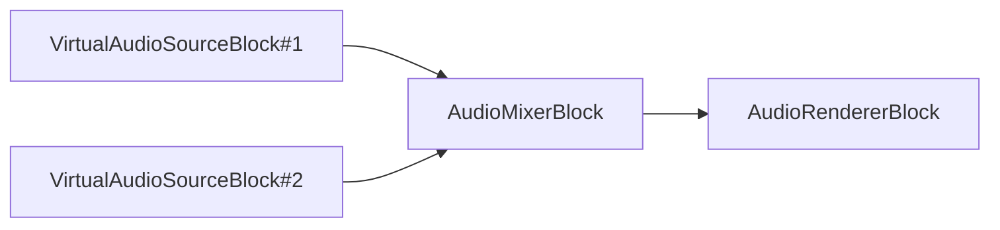

# Blocs de traitement audio et d'effets pour .NET

[Media Blocks SDK .Net](https://www.visioforge.com/media-blocks-sdk-net){ .md-button .md-button--primary target="_blank" }

VisioForge Media Blocks SDK propose une approche par pipeline du traitement audio en C# et .NET. Connectez des blocs audio — convertisseurs, rééchantillonneurs, mélangeurs, égaliseurs, effets et analyseurs — pour construire des chaînes de traitement audio en temps réel pour vos applications. Chaque bloc possède des pins d'entrée/sortie typés que vous reliez avec `pipeline.Connect()`.

Pour les paramètres et propriétés détaillés des effets audio, consultez la [Référence des effets audio](../../general/audio-effects/reference.md).

Tous les blocs sont multiplateformes et fonctionnent sous Windows, macOS, Linux, iOS et Android.

## Traitement audio de base

### Convertisseur audio

Le bloc convertisseur audio convertit l'audio d'un format à un autre.

#### Informations sur le bloc

Nom : AudioConverterBlock.

Direction du pin | Type de média | Nombre de pins
--- | :---: | :---:
Entrée | Audio non compressé | 1
Sortie | Audio non compressé | 1

#### Paramètres

Aucun paramètre configurable. Négocie et convertit automatiquement les formats audio entre les éléments connectés.

**Élément GStreamer** : `audioconvert`

#### Exemple de pipeline


#### Exemple de code

```csharp
var pipeline = new MediaBlocksPipeline();

var filename = "test.mp3";
var fileSource = new UniversalSourceBlock(await UniversalSourceSettings.CreateAsync(new Uri(filename)));

var audioConverter = new AudioConverterBlock();
pipeline.Connect(fileSource.AudioOutput, audioConverter.Input);

var audioRenderer = new AudioRendererBlock();
pipeline.Connect(audioConverter.Output, audioRenderer.Input);

await pipeline.StartAsync();
```

#### Plateformes

Windows, macOS, Linux, iOS, Android.

### Rééchantillonneur audio

Le bloc de rééchantillonnage audio modifie la fréquence d'échantillonnage d'un flux audio.

#### Informations sur le bloc

Nom : AudioResamplerBlock.

Direction du pin | Type de média | Nombre de pins
--- | :---: | :---:
Entrée | Audio non compressé | 1
Sortie | Audio non compressé | 1

#### Paramètres

Configurez via `AudioResamplerSettings` :

| Propriété | Type | Par défaut | Description |
|----------|------|---------|-------------|
| `Format` | `AudioFormatX` | `S16LE` | Format d'échantillon audio cible |
| `SampleRate` | `int` | `44100` | Fréquence d'échantillonnage cible en Hz |
| `Channels` | `int` | `2` | Nombre de canaux audio cible |
| `Quality` | `int` | `4` | Qualité du rééchantillonnage (0 = la plus basse, 10 = la meilleure) |
| `ResampleMethod` | `AudioResamplerMethod` | `Kaiser` | Algorithme de rééchantillonnage : `Nearest`, `Linear`, `Cubic`, `BlackmanNuttall`, `Kaiser` |

**Élément GStreamer** : `audioresample`

#### Exemple de pipeline


#### Exemple de code

```csharp
var pipeline = new MediaBlocksPipeline();

var filename = "test.mp3";
var fileSource = new UniversalSourceBlock(await UniversalSourceSettings.CreateAsync(new Uri(filename)));

// Rééchantillonner à 48000 Hz, stéréo
var settings = new AudioResamplerSettings(AudioFormatX.S16LE, 48000, 2);
var audioResampler = new AudioResamplerBlock(settings);
pipeline.Connect(fileSource.AudioOutput, audioResampler.Input);

var audioRenderer = new AudioRendererBlock();
pipeline.Connect(audioResampler.Output, audioRenderer.Input);

await pipeline.StartAsync();
```

#### Plateformes

Windows, macOS, Linux, iOS, Android.

### Correcteur d'horodatage audio

Le bloc correcteur d'horodatage audio peut ajouter ou retirer des trames pour corriger le flux d'entrée provenant de sources instables.

#### Informations sur le bloc

Nom : AudioTimestampCorrectorBlock.

Direction du pin | Type de média | Nombre de pins
--- | :---: | :---:
Entrée | Audio non compressé | 1
Sortie | Audio non compressé | 1

#### Paramètres

Configurez via `AudioTimestampCorrectorSettings` :

| Propriété | Type | Par défaut | Description |
|----------|------|---------|-------------|
| `Silent` | `bool` | `true` | Supprime les signaux de notification pour les trames supprimées et dupliquées |
| `SkipToFirst` | `bool` | `false` | Ne produit pas de tampons avant la réception du premier |
| `Tolerance` | `TimeSpan` | `40 ms` | Différence d'horodatage minimale avant l'ajout ou la suppression d'échantillons |

**Élément GStreamer** : `audiorate`

#### Exemple de pipeline


#### Exemple de code

```csharp
var pipeline = new MediaBlocksPipeline();

var filename = "test.mp3";
var fileSource = new UniversalSourceBlock(await UniversalSourceSettings.CreateAsync(new Uri(filename)));

var settings = new AudioTimestampCorrectorSettings();
var corrector = new AudioTimestampCorrectorBlock(settings);
pipeline.Connect(fileSource.AudioOutput, corrector.Input);

var audioRenderer = new AudioRendererBlock();
pipeline.Connect(corrector.Output, audioRenderer.Input);

await pipeline.StartAsync();
```

#### Plateformes

Windows, macOS, Linux, iOS, Android.

### Délai audio

Le bloc de délai audio décale les horodatages du tampon audio pour retarder l'ensemble du flux audio. Utilisez-le lorsque l'audio capturé ou décodé arrive plus tôt que la vidéo et que vous devez corriger la synchronisation A/V, ou lorsqu'une seule branche d'un pipeline audio doit être retardée avant l'enregistrement ou le streaming.

`AudioDelayBlock` est différent des effets d'écho comme `EchoBlock` ou `RSAudioEchoBlock` : il ne mixe pas une copie retardée dans le signal. Il retarde le flux lui-même en appliquant un décalage d'horodatage.

#### Informations sur le bloc

Nom : AudioDelayBlock.

Direction du pin | Type de média | Nombre de pins
--- | :---: | :---:
Entrée | Audio non compressé | 1
Sortie | Audio non compressé | 1

#### Paramètres

Configurez via `AudioDelaySettings` ou passez un `TimeSpan` directement au constructeur :

| Propriété | Type | Par défaut | Description |
|----------|------|---------|-------------|
| `Delay` | `TimeSpan` | `TimeSpan.Zero` | Délai audio non négatif à appliquer au flux |
| `Sync` | `bool` | `true` | Synchronise l'élément sous-jacent avec l'horloge du pipeline |
| `Silent` | `bool` | `true` | Supprime les messages de handoff de l'élément sous-jacent |

**Élément GStreamer** : `identity` avec `ts-offset`.

#### Exemple de pipeline


#### Exemple de code

```csharp
var pipeline = new MediaBlocksPipeline();

var filename = "test.mp4";
var fileSource = new UniversalSourceBlock(await UniversalSourceSettings.CreateAsync(new Uri(filename)));

// Retarder l'audio de 500 ms.
var audioDelay = new AudioDelayBlock(TimeSpan.FromMilliseconds(500));
pipeline.Connect(fileSource.AudioOutput, audioDelay.Input);

var audioRenderer = new AudioRendererBlock();
pipeline.Connect(audioDelay.Output, audioRenderer.Input);

await pipeline.StartAsync();
```

#### Retarder uniquement la branche d'enregistrement

Lorsque vous prévisualisez et enregistrez en même temps, placez `AudioDelayBlock` uniquement sur la branche qui nécessite le décalage.

```csharp
var audioTee = new TeeBlock(2, MediaBlockPadMediaType.Audio);
pipeline.Connect(audioSource.Output, audioTee.Input);

// Branche d'aperçu sans délai supplémentaire.
pipeline.Connect(audioTee.Outputs[0], audioRenderer.Input);

// Branche d'enregistrement avec audio retardé.
var audioDelay = new AudioDelayBlock(TimeSpan.FromMilliseconds(250));
pipeline.Connect(audioTee.Outputs[1], audioDelay.Input);
pipeline.Connect(audioDelay.Output, aacEncoder.Input);
pipeline.Connect(aacEncoder.Output, mp4Sink.CreateNewInput(MediaBlockPadMediaType.Audio));
```

#### Plateformes

Windows, macOS, Linux, iOS, Android.

### Volume

Le bloc de volume vous permet de contrôler le volume du flux audio.

#### Informations sur le bloc

Nom : VolumeBlock.

Direction du pin | Type de média | Nombre de pins
--- | :---: | :---:
Entrée | Audio non compressé | 1
Sortie | Audio non compressé | 1

#### Paramètres

| Propriété | Type | Par défaut | Description |
|----------|------|---------|-------------|
| `Level` | `double` | `1.0` | Multiplicateur de niveau de volume (0.0 = silence, 1.0 = original, valeurs > 1.0 amplifient) |
| `Mute` | `bool` | `false` | Coupe le flux audio sans modifier le niveau de volume |

**Élément GStreamer** : `volume`

#### Exemple de pipeline


#### Exemple de code

```csharp
var pipeline = new MediaBlocksPipeline();

var filename = "test.mp3";
var fileSource = new UniversalSourceBlock(await UniversalSourceSettings.CreateAsync(new Uri(filename)));

// VolumeBlock a un constructeur sans paramètre ; définissez Level sur la propriété (0.0 silence, 1.0 normal, >1.0 amplifié).
var volume = new VolumeBlock { Level = 0.8 };
pipeline.Connect(fileSource.AudioOutput, volume.Input);

var audioRenderer = new AudioRendererBlock();
pipeline.Connect(volume.Output, audioRenderer.Input);

await pipeline.StartAsync();
```

#### Plateformes

Windows, macOS, Linux, iOS, Android.

### Mélangeur audio

Le bloc mélangeur audio combine plusieurs flux audio en un seul. Le bloc mélange les flux indépendamment de leur format, en effectuant les conversions nécessaires.

Tous les flux d'entrée seront synchronisés. Le bloc mélangeur gère la conversion de différents formats audio d'entrée vers un format commun pour le mixage. Par défaut, il tentera de correspondre au format de la première entrée connectée, mais cela peut être explicitement configuré.

Utilisez la classe `AudioMixerSettings` pour définir le format de sortie personnalisé. Cela est utile si vous avez besoin d'une fréquence d'échantillonnage, d'une disposition de canaux ou d'un format audio spécifique (comme S16LE, Float32LE, etc.) pour la sortie mélangée.

#### Informations sur le bloc

Nom : AudioMixerBlock.

Direction du pin | Type de média | Nombre de pins
--- | :---: | :---:
Entrée | Audio non compressé | 1 (créé dynamiquement)
Sortie | Audio non compressé | 1

#### Paramètres

Configurez via `AudioMixerSettings` :

| Propriété | Type | Par défaut | Description |
|----------|------|---------|-------------|
| `Format` | `AudioInfoX` | `S16LE, 48000 Hz, 2 canaux` | Format audio de sortie (format d'échantillon, fréquence d'échantillonnage, nombre de canaux) |

**Méthodes à l'exécution :**

| Méthode | Description |
|--------|-------------|
| `CreateNewInput()` | Crée un nouveau pad d'entrée (avant le démarrage du pipeline) |
| `CreateNewInputLive()` | Crée un nouveau pad d'entrée pendant la lecture |
| `RemoveInputLive(MediaBlockPad)` | Supprime un pad d'entrée pendant la lecture |
| `SetVolume(int streamIndex, double value)` | Définit le volume pour une entrée spécifique par index 0 (0.0–10.0) |
| `SetMute(int streamIndex, bool value)` | Coupe ou réactive une entrée spécifique par index 0 |

**Élément GStreamer** : `audiomixer`

#### Exemple de pipeline



#### Exemple de code

```csharp
var pipeline = new MediaBlocksPipeline();

var audioSource1Block = new VirtualAudioSourceBlock(new VirtualAudioSourceSettings());
var audioSource2Block = new VirtualAudioSourceBlock(new VirtualAudioSourceSettings());

// Configurer le mélangeur avec des paramètres de sortie spécifiques si nécessaire
// Par exemple, pour sortir en 48 kHz, 2 canaux, audio S16LE :
// var mixerSettings = new AudioMixerSettings() { Format = new AudioInfoX(AudioFormatX.S16LE, 48000, 2) };
// var audioMixerBlock = new AudioMixerBlock(mixerSettings);
var audioMixerBlock = new AudioMixerBlock(new AudioMixerSettings());

// Chaque appel à CreateNewInput() ajoute une nouvelle entrée au mélangeur
var inputPad1 = audioMixerBlock.CreateNewInput();
pipeline.Connect(audioSource1Block.Output, inputPad1);

var inputPad2 = audioMixerBlock.CreateNewInput();
pipeline.Connect(audioSource2Block.Output, inputPad2);

// Sortir l'audio mélangé vers le moteur de rendu audio par défaut
var audioRenderer = new AudioRendererBlock();
pipeline.Connect(audioMixerBlock.Output, audioRenderer.Input);

await pipeline.StartAsync();
```

#### Contrôle des flux d'entrée individuels

Vous pouvez contrôler le volume et l'état de sourdine de flux d'entrée individuels connectés à l'`AudioMixerBlock`.
Le `streamIndex` pour ces méthodes correspond à l'ordre dans lequel les entrées ont été ajoutées via `CreateNewInput()` ou `CreateNewInputLive()` (à partir de 0).

* **Définir le volume** : utilisez la méthode `SetVolume(int streamIndex, double value)`. La `value` va de 0.0 (silence) à 1.0 (volume normal), et peut être supérieure pour l'amplification (par ex. jusqu'à 10.0, bien que les détails dépendent des limites de l'implémentation sous-jacente).
* **Définir la sourdine** : utilisez la méthode `SetMute(int streamIndex, bool value)`. Définissez `value` à `true` pour couper le flux et `false` pour le réactiver.

```csharp
// En supposant que audioMixerBlock est déjà créé et que les entrées sont connectées

// Régler le volume du premier flux d'entrée (index 0) à 50 %
audioMixerBlock.SetVolume(0, 0.5);

// Couper le deuxième flux d'entrée (index 1)
audioMixerBlock.SetMute(1, true);
```

#### Gestion dynamique des entrées (pipeline en direct)

L'`AudioMixerBlock` prend en charge l'ajout et la suppression d'entrées dynamiquement pendant l'exécution du pipeline :

* **Ajout d'entrées** : utilisez la méthode `CreateNewInputLive()` pour obtenir un nouveau pad d'entrée qui peut être connecté à une source. Les éléments GStreamer sous-jacents seront configurés pour gérer la nouvelle entrée.
* **Suppression d'entrées** : utilisez la méthode `RemoveInputLive(MediaBlockPad blockPad)`. Cela déconnectera le pad d'entrée spécifié et nettoiera les ressources associées.

Cela est particulièrement utile pour les applications où le nombre de sources audio peut changer en cours d'utilisation, comme une console de mixage en direct ou une application de conférence.

#### Plateformes

Windows, macOS, Linux, iOS, Android.

### Capteur d'échantillons audio

Le bloc capteur d'échantillons audio vous permet d'accéder aux échantillons audio bruts du flux audio.

#### Informations sur le bloc

Nom : AudioSampleGrabberBlock.

Direction du pin | Type de média | Nombre de pins
--- | :---: | :---:
Entrée | Audio non compressé | 1
Sortie | Audio non compressé | 1

#### Paramètres

| Propriété | Type | Par défaut | Description |
|----------|------|---------|-------------|
| `format` (constructeur) | `AudioFormatX` | `S16LE` | Format d'échantillon audio pour les trames capturées |

| Événement | Type d'arguments | Description |
|-------|-----------|-------------|
| `OnAudioFrameBuffer` | `AudioFrameBufferEventArgs` | Se déclenche pour chaque trame audio capturée avec les données audio brutes, la fréquence d'échantillonnage, les canaux et l'horodatage |

#### Exemple de pipeline


#### Exemple de code

```csharp
var pipeline = new MediaBlocksPipeline();

var filename = "test.mp3";
var fileSource = new UniversalSourceBlock(await UniversalSourceSettings.CreateAsync(new Uri(filename)));

var audioSampleGrabber = new AudioSampleGrabberBlock();
audioSampleGrabber.OnAudioFrameBuffer += (sender, args) =>
{
    // args.Frame.Data        — IntPtr vers le tampon PCM brut
    // args.Frame.DataSize    — longueur en octets du tampon
    // args.Frame.Info.Format — AudioFormat (par ex. S16LE, F32LE)
    // args.Frame.Info.SampleRate / Channels / BPS
    // Définissez args.UpdateData = true si vous modifiez le tampon et voulez le propager en aval.
};
pipeline.Connect(fileSource.AudioOutput, audioSampleGrabber.Input);

var audioRenderer = new AudioRendererBlock();
pipeline.Connect(audioSampleGrabber.Output, audioRenderer.Input);

await pipeline.StartAsync();
```

#### Plateformes

Windows, macOS, Linux, iOS, Android.

## Effets audio

### Amplification

Le bloc amplifie un flux audio par un facteur d'amplification. Plusieurs modes d'écrêtage sont disponibles.

Utilisez les valeurs method et level pour la configuration.

#### Informations sur le bloc

Nom : AmplifyBlock.

Direction du pin | Type de média | Nombre de pins
--- | :---: | :---:
Entrée | Audio non compressé | 1
Sortie | Audio non compressé | 1

#### Paramètres

| Propriété | Type | Par défaut | Description |
|----------|------|---------|-------------|
| `Level` | `double` | `1.0` | Multiplicateur d'amplification (1.0 = pas de changement, 2.0 = volume doublé, 0.5 = demi-volume) |
| `Method` | `AmplifyClippingMethod` | `Normal` | Méthode d'écrêtage lorsque l'audio amplifié dépasse la plage valide |

Valeurs `AmplifyClippingMethod` :

| Valeur | Description |
|-------|-------------|
| `Normal` | Écrêtage dur au niveau maximum |
| `WrapNegative` | Repousse les valeurs saturées depuis le côté opposé |
| `WrapPositive` | Repousse les valeurs saturées depuis le même côté |
| `NoClip` | Aucun écrêtage appliqué |

**Élément GStreamer** : `audioamplify`

#### Exemple de pipeline


#### Exemple de code

```csharp
var pipeline = new MediaBlocksPipeline();

var filename = "test.mp3";
var fileSource = new UniversalSourceBlock(await UniversalSourceSettings.CreateAsync(new Uri(filename)));

var amplify = new AmplifyBlock(AmplifyClippingMethod.Normal, 2.0);
pipeline.Connect(fileSource.AudioOutput, amplify.Input);

var audioRenderer = new AudioRendererBlock();
pipeline.Connect(amplify.Output, audioRenderer.Input);

await pipeline.StartAsync();
```

#### Plateformes

Windows, macOS, Linux, iOS, Android.

### Écho

Le bloc d'écho ajoute un effet d'écho au flux audio.

#### Informations sur le bloc

Nom : EchoBlock.

Direction du pin | Type de média | Nombre de pins
--- | :---: | :---:
Entrée | Audio non compressé | 1
Sortie | Audio non compressé | 1

#### Paramètres

| Propriété | Type | Par défaut | Description |
|----------|------|---------|-------------|
| `Delay` | `TimeSpan` | `200 ms` | Temps de délai d'écho entre le signal original et ses répétitions |
| `MaxDelay` | `TimeSpan` | `500 ms` | Délai d'écho maximal (détermine la taille du tampon interne). Doit être >= `Delay` |
| `Intensity` | `float` | `0` | Volume du signal retardé (0.0 = pas d'écho, 1.0 = volume plein) |
| `Feedback` | `float` | `0` | Quantité de feedback pour les répétitions d'écho (0.0 = écho unique, valeurs proches de 1.0 = feedback infini) |

**Élément GStreamer** : `audioecho`

#### Exemple de pipeline


#### Exemple de code

```csharp
var pipeline = new MediaBlocksPipeline();

var filename = "test.mp3";
var fileSource = new UniversalSourceBlock(await UniversalSourceSettings.CreateAsync(new Uri(filename)));

// EchoBlock a un constructeur sans paramètre ; définissez les propriétés directement.
var echo = new EchoBlock
{
    Delay     = TimeSpan.FromMilliseconds(200),   // délai d'écho
    MaxDelay  = TimeSpan.FromMilliseconds(500),   // taille du tampon interne (doit être >= Delay)
    Intensity = 0.5f,                             // volume du signal retardé (0.0-1.0)
    Feedback  = 0.3f                              // quantité de feedback (0.0-proche de 1.0)
};
pipeline.Connect(fileSource.AudioOutput, echo.Input);

var audioRenderer = new AudioRendererBlock();
pipeline.Connect(echo.Output, audioRenderer.Input);

await pipeline.StartAsync();
```

#### Plateformes

Windows, macOS, Linux, iOS, Android.

### Karaoké

Le bloc karaoké applique un effet karaoké au flux audio en supprimant les voix centrées.

#### Informations sur le bloc

Nom : KaraokeBlock.

Direction du pin | Type de média | Nombre de pins
--- | :---: | :---:
Entrée | Audio non compressé | 1
Sortie | Audio non compressé | 1

#### Paramètres

Configurez via `KaraokeAudioEffect` :

| Propriété | Type | Par défaut | Description |
|----------|------|---------|-------------|
| `Level` | `float` | `1.0` | Force de suppression vocale (0.0 = pas d'effet, 1.0 = suppression maximale) |
| `MonoLevel` | `float` | `1.0` | Niveau de suppression pour le contenu mono/centré (0.0–1.0) |
| `FilterBand` | `float` | `220` | Fréquence centrale de la bande de filtrage en Hz ciblant la plage vocale |
| `FilterWidth` | `float` | `100` | Largeur de la bande de fréquences à traiter en Hz |

**Élément GStreamer** : `audiokaraoke`

#### Exemple de pipeline


#### Exemple de code

```csharp
var pipeline = new MediaBlocksPipeline();

var filename = "test.mp3";
var fileSource = new UniversalSourceBlock(await UniversalSourceSettings.CreateAsync(new Uri(filename)));

var settings = new KaraokeAudioEffect();
var karaoke = new KaraokeBlock(settings);
pipeline.Connect(fileSource.AudioOutput, karaoke.Input);

var audioRenderer = new AudioRendererBlock();
pipeline.Connect(karaoke.Output, audioRenderer.Input);

await pipeline.StartAsync();
```

#### Plateformes

Windows, macOS, Linux, iOS, Android.

### Réverbération

Le bloc de réverbération ajoute des effets de réverbération au flux audio.

#### Informations sur le bloc

Nom : ReverberationBlock.

Direction du pin | Type de média | Nombre de pins
--- | :---: | :---:
Entrée | Audio non compressé | 1
Sortie | Audio non compressé | 1

#### Paramètres

Configurez via `ReverberationAudioEffect` :

| Propriété | Type | Par défaut | Description |
|----------|------|---------|-------------|
| `RoomSize` | `float` | `0.5` | Taille de la pièce simulée (0.0 = petite pièce, 1.0 = grande salle) |
| `Damping` | `float` | `0.2` | Atténuation des hautes fréquences (0.0 = brillant, 1.0 = sombre/étouffé) |
| `Width` | `float` | `1.0` | Largeur stéréo de la réverbération (0.0 = mono, 1.0 = stéréo complet) |
| `Level` | `float` | `0.5` | Niveau de mélange wet/dry (0.0 = sec seulement, 1.0 = humide seulement) |

**Élément GStreamer** : `freeverb`

#### Exemple de pipeline


#### Exemple de code

```csharp
var pipeline = new MediaBlocksPipeline();

var filename = "test.mp3";
var fileSource = new UniversalSourceBlock(await UniversalSourceSettings.CreateAsync(new Uri(filename)));

var settings = new ReverberationAudioEffect();
var reverb = new ReverberationBlock(settings);
pipeline.Connect(fileSource.AudioOutput, reverb.Input);

var audioRenderer = new AudioRendererBlock();
pipeline.Connect(reverb.Output, audioRenderer.Input);

await pipeline.StartAsync();
```

#### Plateformes

Windows, macOS, Linux, iOS, Android.

### Stéréo large

Le bloc stéréo large améliore l'image stéréo de l'audio.

#### Informations sur le bloc

Nom : WideStereoBlock.

Direction du pin | Type de média | Nombre de pins
--- | :---: | :---:
Entrée | Audio non compressé | 1
Sortie | Audio non compressé | 1

#### Paramètres

Configurez via `WideStereoAudioEffect` :

| Propriété | Type | Par défaut | Description |
|----------|------|---------|-------------|
| `Level` | `float` | `0.01` | Quantité d'élargissement stéréo (0.0 = pas d'élargissement, valeurs plus élevées = image stéréo plus large). Typique : 0.01–0.03 subtil, 0.05–0.10 modéré, 0.15+ fort |

**Élément GStreamer** : `stereo`

#### Exemple de pipeline


#### Exemple de code

```csharp
var pipeline = new MediaBlocksPipeline();

var filename = "test.mp3";
var fileSource = new UniversalSourceBlock(await UniversalSourceSettings.CreateAsync(new Uri(filename)));

var settings = new WideStereoAudioEffect();
var wideStereo = new WideStereoBlock(settings);
pipeline.Connect(fileSource.AudioOutput, wideStereo.Input);

var audioRenderer = new AudioRendererBlock();
pipeline.Connect(wideStereo.Output, audioRenderer.Input);

await pipeline.StartAsync();
```

#### Plateformes

Windows, macOS, Linux, iOS, Android.

## Égalisation et filtrage

### Balance

Le bloc vous permet de contrôler la balance entre les canaux gauche et droit.

#### Informations sur le bloc

Nom : AudioBalanceBlock.

Direction du pin | Type de média | Nombre de pins
--- | :---: | :---:
Entrée | Audio non compressé | 1
Sortie | Audio non compressé | 1

#### Paramètres

| Propriété | Type | Par défaut | Description |
|----------|------|---------|-------------|
| `Balance` | `float` | `0.0` | Position de balance stéréo (-1.0 = gauche complet, 0.0 = centre, +1.0 = droite complet) |

**Élément GStreamer** : `audiopanorama`

#### Exemple de pipeline


#### Exemple de code

```csharp
var pipeline = new MediaBlocksPipeline();

var filename = "test.mp3";
var fileSource = new UniversalSourceBlock(await UniversalSourceSettings.CreateAsync(new Uri(filename)));

// Balance : -1.0 (gauche complet) à 1.0 (droite complet), 0.0 = centre. Le ctor prend un float, pas un double.
var balance = new AudioBalanceBlock(0.5f);
pipeline.Connect(fileSource.AudioOutput, balance.Input);

var audioRenderer = new AudioRendererBlock();
pipeline.Connect(balance.Output, audioRenderer.Input);

await pipeline.StartAsync();
```

#### Plateformes

Windows, macOS, Linux, iOS, Android.

### Égaliseur (10 bandes)

Le bloc égaliseur 10 bandes fournit un égaliseur 10 bandes pour le traitement audio.

#### Informations sur le bloc

Nom : Equalizer10Block.

Direction du pin | Type de média | Nombre de pins
--- | :---: | :---:
Entrée | Audio non compressé | 1
Sortie | Audio non compressé | 1

#### Paramètres

L'égaliseur fournit 10 bandes de fréquence fixes. Utilisez `SetBand(int index, double gain)` pour ajuster les bandes individuelles. Plage de gain : -24 dB à +12 dB.

| Index de bande | Fréquence centrale | Largeur de bande |
|------------|-----------------|-----------|
| 0 | 29 Hz | 19 Hz |
| 1 | 59 Hz | 39 Hz |
| 2 | 119 Hz | 79 Hz |
| 3 | 237 Hz | 157 Hz |
| 4 | 474 Hz | 314 Hz |
| 5 | 947 Hz | 628 Hz |
| 6 | 1889 Hz | 1257 Hz |
| 7 | 3770 Hz | 2511 Hz |
| 8 | 7523 Hz | 5765 Hz |
| 9 | 15011 Hz | 11498 Hz |

Le constructeur est sans paramètre. Utilisez `SetBand(int index, double gain)` pour ajuster chacune des 10 bandes après construction.

**Élément GStreamer** : `equalizer-10bands`

#### Exemple de pipeline


#### Exemple de code

```csharp
var pipeline = new MediaBlocksPipeline();

var filename = "test.mp3";
var fileSource = new UniversalSourceBlock(await UniversalSourceSettings.CreateAsync(new Uri(filename)));

// Créer l'égaliseur 10 bandes (ctor sans paramètre ; les bandes sont à 0 dB par défaut)
var equalizer = new Equalizer10Block();

// Régler les bandes individuellement
equalizer.SetBand(0, 3); // Bande 0 (31 Hz) à +3 dB
equalizer.SetBand(1, 2); // Bande 1 (62 Hz) à +2 dB
equalizer.SetBand(9, -3); // Bande 9 (16 kHz) à -3 dB

pipeline.Connect(fileSource.AudioOutput, equalizer.Input);

var audioRenderer = new AudioRendererBlock();
pipeline.Connect(equalizer.Output, audioRenderer.Input);

await pipeline.StartAsync();
```

#### Plateformes

Windows, macOS, Linux, iOS, Android.

### Égaliseur (paramétrique)

Le bloc égaliseur paramétrique fournit un égaliseur paramétrique pour le traitement audio.

#### Informations sur le bloc

Nom : EqualizerParametricBlock.

Direction du pin | Type de média | Nombre de pins
--- | :---: | :---:
Entrée | Audio non compressé | 1
Sortie | Audio non compressé | 1

#### Paramètres

Utilisez `SetNumBands(int count)` pour définir le nombre de bandes (1–64, par défaut 3), puis configurez chaque bande avec `SetState(int index, ParametricEqualizerBand band)`.

Propriétés de `ParametricEqualizerBand` :

| Propriété | Type | Par défaut | Description |
|----------|------|---------|-------------|
| `Frequency` | `float` | varie | Fréquence centrale en Hz |
| `Gain` | `float` | `0.0` | Gain de bande en dB (-24 à +12) |
| `Width` | `float` | `1.0` | Largeur de bande en Hz |

Bandes par défaut (lorsque 3 bandes sont configurées) :

| Bande | Fréquence | Largeur de bande |
|------|-----------|-----------|
| 0 | 110 Hz | 100 Hz |
| 1 | 1100 Hz | 1000 Hz |
| 2 | 11000 Hz | 10000 Hz |

**Élément GStreamer** : `equalizer-nbands`

#### Exemple de pipeline


#### Exemple de code

```csharp
var pipeline = new MediaBlocksPipeline();

var filename = "test.mp3";
var fileSource = new UniversalSourceBlock(await UniversalSourceSettings.CreateAsync(new Uri(filename)));

// Créer l'égaliseur paramétrique
var equalizer = new EqualizerParametricBlock();

// Configurer le nombre de bandes, puis définir chaque bande via SetState(int index, ParametricEqualizerBand).
// ParametricEqualizerBand(freq : Hz, width : largeur de bande Hz, gain : dB). Propriétés : Frequency, Width, Gain.
equalizer.SetNumBands(4);
equalizer.SetState(0, new ParametricEqualizerBand(freq: 100f,  width: 50f,  gain: 3f));
equalizer.SetState(1, new ParametricEqualizerBand(freq: 1000f, width: 500f, gain: -2f));

pipeline.Connect(fileSource.AudioOutput, equalizer.Input);

var audioRenderer = new AudioRendererBlock();
pipeline.Connect(equalizer.Output, audioRenderer.Input);

await pipeline.StartAsync();
```

#### Plateformes

Windows, macOS, Linux, iOS, Android.

### Chebyshev Band Pass/Reject

Le bloc Chebyshev band pass/reject applique un filtre passe-bande ou réjection de bande au flux audio à l'aide de filtres Chebyshev.

#### Informations sur le bloc

Nom : ChebyshevBandPassRejectBlock.

Direction du pin | Type de média | Nombre de pins
--- | :---: | :---:
Entrée | Audio non compressé | 1
Sortie | Audio non compressé | 1

#### Paramètres

Configurez via `ChebyshevBandPassRejectAudioEffect` :

| Propriété | Type | Par défaut | Description |
|----------|------|---------|-------------|
| `Mode` | `ChebyshevBandMode` | `BandPass` | Mode de filtre : `BandPass` (laisser passer les fréquences dans la plage) ou `BandReject` (rejeter les fréquences dans la plage) |
| `LowerFrequency` | `float` | `220.0` | Fréquence de coupure basse en Hz |
| `UpperFrequency` | `float` | `3000.0` | Fréquence de coupure haute en Hz |
| `Poles` | `int` | `4` | Nombre de pôles du filtre (2–32, doit être pair). Valeurs plus élevées = coupure plus nette |
| `Type` | `int` | `1` | Type de filtre Chebyshev : 1 (ondulation en bande passante) ou 2 (ondulation en bande atténuée) |
| `Ripple` | `float` | `0.25` | Quantité d'ondulation en dB (Type 1 : ondulation en bande passante, Type 2 : ondulation en bande atténuée) |

**Élément GStreamer** : `audiochebband`

#### Exemple de pipeline


#### Exemple de code

```csharp
var pipeline = new MediaBlocksPipeline();

var filename = "test.mp3";
var fileSource = new UniversalSourceBlock(await UniversalSourceSettings.CreateAsync(new Uri(filename)));

var settings = new ChebyshevBandPassRejectAudioEffect();
var filter = new ChebyshevBandPassRejectBlock(settings);
pipeline.Connect(fileSource.AudioOutput, filter.Input);

var audioRenderer = new AudioRendererBlock();
pipeline.Connect(filter.Output, audioRenderer.Input);

await pipeline.StartAsync();
```

#### Plateformes

Windows, macOS, Linux, iOS, Android.

### Chebyshev Limit

Le bloc Chebyshev limit applique un filtrage passe-bas ou passe-haut à l'audio à l'aide de filtres Chebyshev.

#### Informations sur le bloc

Nom : ChebyshevLimitBlock.

Direction du pin | Type de média | Nombre de pins
--- | :---: | :---:
Entrée | Audio non compressé | 1
Sortie | Audio non compressé | 1

#### Paramètres

Configurez via `ChebyshevLimitAudioEffect` :

| Propriété | Type | Par défaut | Description |
|----------|------|---------|-------------|
| `Mode` | `ChebyshevLimitMode` | `LowPass` | Mode de filtre : `LowPass` (supprime les hautes fréquences) ou `HighPass` (supprime les basses fréquences) |
| `CutOffFrequency` | `float` | `1000.0` | Fréquence de coupure en Hz |
| `Poles` | `int` | `4` | Nombre de pôles du filtre (2–32, doit être pair). Valeurs plus élevées = coupure plus nette |
| `Type` | `int` | `1` | Type de filtre Chebyshev : 1 (ondulation en bande passante) ou 2 (ondulation en bande atténuée) |
| `Ripple` | `float` | `0.25` | Quantité d'ondulation en dB |

**Élément GStreamer** : `audiocheblimit`

#### Exemple de pipeline


#### Exemple de code

```csharp
var pipeline = new MediaBlocksPipeline();

var filename = "test.mp3";
var fileSource = new UniversalSourceBlock(await UniversalSourceSettings.CreateAsync(new Uri(filename)));

var settings = new ChebyshevLimitAudioEffect();
var filter = new ChebyshevLimitBlock(settings);
pipeline.Connect(fileSource.AudioOutput, filter.Input);

var audioRenderer = new AudioRendererBlock();
pipeline.Connect(filter.Output, audioRenderer.Input);

await pipeline.StartAsync();
```

#### Plateformes

Windows, macOS, Linux, iOS, Android.

## Traitement dynamique

### Compresseur/Expandeur

Le bloc compresseur/expandeur fournit une compression ou expansion de plage dynamique.

#### Informations sur le bloc

Nom : CompressorExpanderBlock.

Direction du pin | Type de média | Nombre de pins
--- | :---: | :---:
Entrée | Audio non compressé | 1
Sortie | Audio non compressé | 1

#### Paramètres

Configurez via `CompressorExpanderAudioEffect` :

| Propriété | Type | Par défaut | Description |
|----------|------|---------|-------------|
| `Mode` | `AudioCompressorMode` | `Compressor` | Mode de traitement : `Compressor` (réduit la plage dynamique) ou `Expander` (augmente la plage dynamique) |
| `Characteristics` | `AudioDynamicCharacteristics` | `HardKnee` | Type de knee : `HardKnee` (transition abrupte) ou `SoftKnee` (transition graduelle) |
| `Ratio` | `float` | `1.0` | Ratio de compression/expansion (par ex. 2.0 = compression 2:1) |
| `Threshold` | `float` | `0.0` | Niveau de seuil (0.0–1.0). Le signal au-dessus de ce niveau est compressé/expansé |

Le constructeur est sans paramètre. Configurez via les propriétés `Ratio`, `Threshold`, `Mode` et `Characteristics` après construction.

**Élément GStreamer** : `audiodynamic`

#### Exemple de pipeline


#### Exemple de code

```csharp
var pipeline = new MediaBlocksPipeline();

var filename = "test.mp3";
var fileSource = new UniversalSourceBlock(await UniversalSourceSettings.CreateAsync(new Uri(filename)));

// CompressorExpanderBlock a un constructeur sans paramètre ; définissez les propriétés directement.
var compressor = new CompressorExpanderBlock
{
    Mode            = AudioCompressorMode.Compressor,
    Characteristics = AudioDynamicCharacteristics.HardKnee,
    Ratio           = 4f,    // compression 4:1
    Threshold       = 0.5f   // 0.0-1.0 (amplitude linéaire, pas dB sur ce bloc)
};
pipeline.Connect(fileSource.AudioOutput, compressor.Input);

var audioRenderer = new AudioRendererBlock();
pipeline.Connect(compressor.Output, audioRenderer.Input);

await pipeline.StartAsync();
```

#### Plateformes

Windows, macOS, Linux, iOS, Android.

### Échelle/Tempo

Le bloc échelle/tempo vous permet de modifier le tempo et la hauteur du flux audio.

#### Informations sur le bloc

Nom : ScaleTempoBlock.

Direction du pin | Type de média | Nombre de pins
--- | :---: | :---:
Entrée | Audio non compressé | 1
Sortie | Audio non compressé | 1

#### Paramètres

| Propriété | Type | Par défaut | Description |
|----------|------|---------|-------------|
| `Rate` | `double` | `1.0` | Multiplicateur de vitesse de lecture (0.5 = demi-vitesse, 1.0 = normal, 2.0 = vitesse double). La hauteur est préservée |
| `Overlap` | `double` | `0.2` | Pourcentage de chevauchement (0.0–1.0). Valeurs plus élevées améliorent la qualité au coût du CPU |
| `Search` | `TimeSpan` | `14 ms` | Longueur de la fenêtre de recherche pour la meilleure position de chevauchement |
| `Stride` | `TimeSpan` | `30 ms` | Longueur du pas audio de sortie |

Le constructeur est sans paramètre ; définissez `Rate` via la propriété (ou l'accesseur sous-jacent `SetRate` est appelé en interne lorsque `Rate` est assigné).

**Élément GStreamer** : `scaletempo`

#### Exemple de pipeline


#### Exemple de code

```csharp
var pipeline = new MediaBlocksPipeline();

var filename = "test.mp3";
var fileSource = new UniversalSourceBlock(await UniversalSourceSettings.CreateAsync(new Uri(filename)));

// ScaleTempoBlock a un constructeur sans paramètre ; définissez Rate via la propriété.
// 1.0 = normal, 0.5 = demi-vitesse, 2.0 = vitesse double ; la hauteur est préservée.
var scaleTempo = new ScaleTempoBlock { Rate = 1.5 };
pipeline.Connect(fileSource.AudioOutput, scaleTempo.Input);

var audioRenderer = new AudioRendererBlock();
pipeline.Connect(scaleTempo.Output, audioRenderer.Input);

await pipeline.StartAsync();
```

#### Plateformes

Windows, macOS, Linux, iOS, Android.

## Analyse et mesure

### VU-mètre

Le bloc VU-mètre vous permet de mesurer le niveau de volume du flux audio.

#### Informations sur le bloc

Nom : VUMeterBlock.

Direction du pin | Type de média | Nombre de pins
--- | :---: | :---:
Entrée | Audio non compressé | 1
Sortie | Audio non compressé | 1

#### Paramètres

Bloc basé sur des événements. Abonnez-vous à l'événement `OnAudioVUMeter` (type : `EventHandler<VUMeterXEventArgs>`) pour recevoir les données de niveau.

`VUMeterXEventArgs.MeterData` transporte une instance `VUMeterXData` avec des tableaux par canal :

| Propriété sur `VUMeterXData` | Type | Description |
|----------|------|-------------|
| `ChannelsCount` | `int` | Nombre de canaux audio rapportés |
| `Peak` | `double[]` | Niveaux de crête par canal (dB) |
| `RMS` | `double[]` | Niveaux RMS par canal (dB) |
| `Decay` | `double[]` | Niveaux de decay par canal (dB) |

**Élément GStreamer** : `level`

#### Exemple de pipeline


#### Exemple de code

```csharp
var pipeline = new MediaBlocksPipeline();

var filename = "test.mp3";
var fileSource = new UniversalSourceBlock(await UniversalSourceSettings.CreateAsync(new Uri(filename)));

var vuMeter = new VUMeterBlock();
vuMeter.OnAudioVUMeter += (sender, args) =>
{
    var data = args.MeterData;
    for (int i = 0; i < data.ChannelsCount; i++)
    {
        Console.WriteLine($"Canal{i} : Peak={data.Peak[i]:F2} dB, RMS={data.RMS[i]:F2} dB");
    }
};
pipeline.Connect(fileSource.AudioOutput, vuMeter.Input);

var audioRenderer = new AudioRendererBlock();
pipeline.Connect(vuMeter.Output, audioRenderer.Input);

await pipeline.StartAsync();
```

#### Plateformes

Windows, macOS, Linux, iOS, Android.

## Effets audio

### Effets audio

Le bloc AudioEffects fournit une collection complète d'effets de traitement audio qui peuvent être appliqués aux flux audio. Pour les paramètres et propriétés détaillés des effets, consultez la [Référence des effets audio](../../general/audio-effects/reference.md).

#### Informations sur le bloc

Nom : AudioEffectsBlock.

Direction du pin | Type de média | Nombre de pins
--- | :---: | :---:
Entrée | Audio non compressé | 1
Sortie | Audio non compressé | 1

#### Paramètres

Gestion des effets basée sur une collection. Utilisez les méthodes suivantes :

| Méthode | Description |
|--------|-------------|
| `AddOrUpdate(BaseAudioEffect effect)` | Ajoute un nouvel effet ou met à jour un effet existant du même type |
| `Remove<T>()` | Supprime l'effet du type spécifié |
| `Clear()` | Supprime tous les effets |
| `Get<T>()` | Renvoie l'effet du type spécifié, ou null |

Les types d'effets pris en charge incluent tous les effets de l'espace de noms `VisioForge.Core.Types.X.AudioEffects`. Consultez la [Référence des effets audio](../../general/audio-effects/reference.md) pour les paramètres détaillés.

#### Exemple de pipeline

```mermaid
graph LR;
    UniversalSourceBlock-->AudioEffectsBlock;
    AudioEffectsBlock-->AudioRendererBlock;
```

#### Exemple de code

```csharp
var pipeline = new MediaBlocksPipeline();

var filename = "test.mp3";
var fileSource = new UniversalSourceBlock(await UniversalSourceSettings.CreateAsync(new Uri(filename)));

var audioEffects = new AudioEffectsBlock();
pipeline.Connect(fileSource.AudioOutput, audioEffects.Input);

var audioRenderer = new AudioRendererBlock();
pipeline.Connect(audioEffects.Output, audioRenderer.Input);

await pipeline.StartAsync();
```

#### Plateformes

Windows, macOS, Linux, iOS, Android.

### Normalisation de l'intensité audio

Le bloc AudioLoudNorm normalise l'intensité audio selon les normes EBU R128, assurant une intensité perçue cohérente sur différents contenus audio.

#### Informations sur le bloc

Nom : AudioLoudNormBlock.

Direction du pin | Type de média | Nombre de pins
--- | :---: | :---:
Entrée | Audio non compressé | 1
Sortie | Audio non compressé | 1

#### Paramètres

Configurez via `AudioLoudNormAudioEffect` :

| Propriété | Type | Par défaut | Description |
|----------|------|---------|-------------|
| `LoudnessTarget` | `double` | `-24.0` | Intensité intégrée cible en LUFS (-70.0 à -5.0) |
| `LoudnessRangeTarget` | `double` | `7.0` | Plage d'intensité cible en LU (1.0 à 20.0) |
| `MaxTruePeak` | `double` | `-2.0` | Crête vraie maximale en dBTP (-9.0 à 0.0) |
| `Offset` | `double` | `0.0` | Gain de décalage en LU (-99.0 à 99.0) |

**Élément GStreamer** : `audioloudnorm`

#### Exemple de pipeline

```mermaid
graph LR;
    UniversalSourceBlock-->AudioLoudNormBlock;
    AudioLoudNormBlock-->AudioRendererBlock;
```

#### Exemple de code

```csharp
var pipeline = new MediaBlocksPipeline();

var filename = "test.mp3";
var fileSource = new UniversalSourceBlock(await UniversalSourceSettings.CreateAsync(new Uri(filename)));

var loudNorm = new AudioLoudNormBlock();
pipeline.Connect(fileSource.AudioOutput, loudNorm.Input);

var audioRenderer = new AudioRendererBlock();
pipeline.Connect(loudNorm.Output, audioRenderer.Input);

await pipeline.StartAsync();
```

#### Plateformes

Windows, macOS, Linux, iOS, Android.

### Réduction de bruit RNN

Le bloc AudioRNNoise utilise la réduction de bruit basée sur un réseau de neurones récurrent (RNN) pour supprimer le bruit de fond des flux audio tout en préservant la qualité de la parole.

#### Informations sur le bloc

Nom : AudioRNNoiseBlock.

Direction du pin | Type de média | Nombre de pins
--- | :---: | :---:
Entrée | Audio non compressé | 1
Sortie | Audio non compressé | 1

#### Paramètres

| Propriété | Type | Par défaut | Description |
|----------|------|---------|-------------|
| `VadThreshold` | `float` | `0.0` | Seuil de détection d'activité vocale (0.0–1.0). Lorsque > 0, agit comme une porte : l'audio en dessous de cette probabilité de parole est mis en sourdine. 0.0 = réduction de bruit uniquement, pas de portail |

**Élément GStreamer** : `audiornnoise`

#### Exemple de pipeline

```mermaid
graph LR;
    UniversalSourceBlock-->AudioRNNoiseBlock;
    AudioRNNoiseBlock-->AudioRendererBlock;
```

#### Exemple de code

```csharp
var pipeline = new MediaBlocksPipeline();

var filename = "noisy_audio.mp3";
var fileSource = new UniversalSourceBlock(await UniversalSourceSettings.CreateAsync(new Uri(filename)));

var rnnoise = new AudioRNNoiseBlock();
pipeline.Connect(fileSource.AudioOutput, rnnoise.Input);

var audioRenderer = new AudioRendererBlock();
pipeline.Connect(rnnoise.Output, audioRenderer.Input);

await pipeline.StartAsync();
```

#### Plateformes

Windows, macOS, Linux, iOS, Android.

### Suppression de silence

Le bloc RemoveSilence détecte et supprime automatiquement les portions silencieuses des flux audio, utile pour les podcasts, les enregistrements vocaux et le montage audio.

#### Informations sur le bloc

Nom : RemoveSilenceBlock.

Direction du pin | Type de média | Nombre de pins
--- | :---: | :---:
Entrée | Audio non compressé | 1
Sortie | Audio non compressé | 1

#### Paramètres

Configurez via `RemoveSilenceAudioEffect` :

| Propriété | Type | Par défaut | Description |
|----------|------|---------|-------------|
| `Threshold` | `double` | `0.05` | Seuil de silence (0.0–1.0). L'audio en dessous de ce niveau est considéré comme silence |
| `Squash` | `bool` | `true` | Lorsque true, supprime entièrement les portions silencieuses. Lorsque false, les laisse passer |

**Élément GStreamer** : `removesilence`

#### Exemple de pipeline

```mermaid
graph LR;
    UniversalSourceBlock-->RemoveSilenceBlock;
    RemoveSilenceBlock-->AudioRendererBlock;
```

#### Exemple de code

```csharp
var pipeline = new MediaBlocksPipeline();

var filename = "podcast.mp3";
var fileSource = new UniversalSourceBlock(await UniversalSourceSettings.CreateAsync(new Uri(filename)));

var removeSilence = new RemoveSilenceBlock();
pipeline.Connect(fileSource.AudioOutput, removeSilence.Input);

var audioRenderer = new AudioRendererBlock();
pipeline.Connect(removeSilence.Output, audioRenderer.Input);

await pipeline.StartAsync();
```

#### Plateformes

Windows, macOS, Linux, iOS, Android.

### Filtre Csound

Le bloc CsoundFilter fournit une synthèse et un traitement audio avancés à l'aide du langage de programmation audio Csound.

#### Informations sur le bloc

Nom : CsoundFilterBlock.

Direction du pin | Type de média | Nombre de pins
--- | :---: | :---:
Entrée | Audio non compressé | 1
Sortie | Audio non compressé | 1

#### Paramètres

Configurez via `CsoundAudioEffect` :

| Propriété | Type | Par défaut | Description |
|----------|------|---------|-------------|
| `CsdText` | `string` | `null` | Texte de script CSD Csound inline |
| `Location` | `string` | `null` | Chemin vers un fichier .csd externe (alternative à CsdText) |
| `Loop` | `bool` | `false` | Si la partition Csound doit être bouclée |
| `ScoreOffset` | `double` | `0.0` | Décalage temporel de la partition en secondes |

**Élément GStreamer** : `csoundfilter`

#### Exemple de pipeline

```mermaid
graph LR;
    UniversalSourceBlock-->CsoundFilterBlock;
    CsoundFilterBlock-->AudioRendererBlock;
```

#### Exemple de code

```csharp
var pipeline = new MediaBlocksPipeline();

var filename = "test.mp3";
var fileSource = new UniversalSourceBlock(await UniversalSourceSettings.CreateAsync(new Uri(filename)));

// CsoundFilterBlock prend directement le contenu du script Csound (.csd), pas un objet de paramètres.
// Chargez le script depuis le disque et passez le texte au constructeur — définissez optionnellement Loop/ScoreOffset.
var csdText = File.ReadAllText("filter.csd");
var csound = new CsoundFilterBlock(csdText, loop: false, scoreOffset: 0.0);
pipeline.Connect(fileSource.AudioOutput, csound.Input);

var audioRenderer = new AudioRendererBlock();
pipeline.Connect(csound.Output, audioRenderer.Input);

await pipeline.StartAsync();
```

#### Plateformes

Windows, macOS, Linux (nécessite Csound).

### Niveau EBU R128

Le bloc EbuR128Level mesure l'intensité audio selon la norme EBU R128, fournissant des mesures d'intensité précises pour la conformité de diffusion.

#### Informations sur le bloc

Nom : EbuR128LevelBlock.

Direction du pin | Type de média | Nombre de pins
--- | :---: | :---:
Entrée | Audio non compressé | 1
Sortie | Audio non compressé | 1

#### Paramètres

| Propriété | Type | Par défaut | Description |
|----------|------|---------|-------------|
| `Mode` | `EbuR128Mode` | `All` | Indicateurs de mode de mesure : `MomentaryLoudness`, `ShortTermLoudness`, `GlobalLoudness`, `LoudnessRange`, `SamplePeak`, `TruePeak`, `All` |
| `PostMessages` | `bool` | `true` | Si les messages de bus GStreamer doivent être postés avec les résultats de mesure |
| `Interval` | `TimeSpan` | `1 s` | Intervalle entre les mises à jour de mesure |

`EbuR128LevelBlock` mesure l'intensité en interne et poste les résultats sur le bus GStreamer lorsque `PostMessages = true`. Il n'expose **pas** d'événement managé — lisez la propriété `level` ou gérez le message de bus vous-même si vous avez besoin des valeurs dans .NET.

**Élément GStreamer** : `ebur128level`

#### Exemple de pipeline

```mermaid
graph LR;
    UniversalSourceBlock-->EbuR128LevelBlock;
    EbuR128LevelBlock-->AudioRendererBlock;
```

#### Exemple de code

```csharp
var pipeline = new MediaBlocksPipeline();

var filename = "test.mp3";
var fileSource = new UniversalSourceBlock(await UniversalSourceSettings.CreateAsync(new Uri(filename)));

var ebuR128 = new EbuR128LevelBlock
{
    Mode         = EbuR128Mode.All,
    PostMessages = true,                      // activer les messages de bus GStreamer avec les résultats de mesure
    Interval     = TimeSpan.FromSeconds(1)    // cadence de mesure
};
pipeline.Connect(fileSource.AudioOutput, ebuR128.Input);

var audioRenderer = new AudioRendererBlock();
pipeline.Connect(ebuR128.Output, audioRenderer.Input);

await pipeline.StartAsync();
```

#### Plateformes

Windows, macOS, Linux, iOS, Android.

### Rendu HRTF

Le bloc HRTFRender applique le traitement Head-Related Transfer Function (HRTF) pour créer des effets audio spatiaux 3D à partir d'audio stéréo ou multicanal.

#### Informations sur le bloc

Nom : HRTFRenderBlock.

Direction du pin | Type de média | Nombre de pins
--- | :---: | :---:
Entrée | Audio non compressé | 1
Sortie | Audio non compressé | 1

#### Paramètres

| Propriété | Type | Par défaut | Description |
|----------|------|---------|-------------|
| `HrirFile` | `string` | `""` | Chemin vers le fichier HRIR (Head-Related Impulse Response) pour le rendu spatial |
| `InterpolationSteps` | `ulong` | `8` | Nombre d'étapes d'interpolation pour les transitions spatiales fluides |
| `BlockLength` | `ulong` | `512` | Longueur du bloc de traitement en échantillons |
| `DistanceGain` | `float` | `1.0` | Facteur d'atténuation de gain basé sur la distance |

Toutes les propriétés prennent en charge les mises à jour en temps réel pendant la lecture.

**Élément GStreamer** : `hrtfrender`

#### Exemple de pipeline

```mermaid
graph LR;
    UniversalSourceBlock-->HRTFRenderBlock;
    HRTFRenderBlock-->AudioRendererBlock;
```

#### Exemple de code

```csharp
var pipeline = new MediaBlocksPipeline();

var filename = "test.mp3";
var fileSource = new UniversalSourceBlock(await UniversalSourceSettings.CreateAsync(new Uri(filename)));

// HRTFRenderBlock a un ctor sans paramètre ; configurez via les propriétés.
// Fournissez un fichier HRIR (Head-Related Impulse Response) — requis pour le rendu spatial.
var hrtf = new HRTFRenderBlock
{
    HrirFile           = "hrir.sofa",    // chemin vers le fichier HRIR
    InterpolationSteps = 8,              // ulong — transitions plus fluides = plus de CPU
    BlockLength        = 512,            // ulong — taille de bloc de traitement
    DistanceGain       = 1.0f            // float — force d'atténuation par distance
};
pipeline.Connect(fileSource.AudioOutput, hrtf.Input);

var audioRenderer = new AudioRendererBlock();
pipeline.Connect(hrtf.Output, audioRenderer.Input);

await pipeline.StartAsync();
```

#### Plateformes

Windows, macOS, Linux, iOS, Android.

### Écho audio RS

Le bloc RSAudioEcho fournit des effets d'écho de haute qualité à l'aide du plugin GStreamer rsaudiofx.

#### Informations sur le bloc

Nom : RSAudioEchoBlock.

Direction du pin | Type de média | Nombre de pins
--- | :---: | :---:
Entrée | Audio non compressé | 1
Sortie | Audio non compressé | 1

#### Paramètres

| Propriété | Type | Par défaut | Description |
|----------|------|---------|-------------|
| `Delay` | `TimeSpan` | `500 ms` | Temps de délai d'écho |
| `MaxDelay` | `TimeSpan` | `1000 ms` | Délai maximal autorisé (doit être >= Delay) |
| `Intensity` | `double` | `0.5` | Intensité d'écho (0.0–1.0) |
| `Feedback` | `double` | `0.0` | Quantité de feedback — contrôle les répétitions d'écho (0.0–1.0) |

Toutes les propriétés prennent en charge les mises à jour en temps réel pendant la lecture.

**Élément GStreamer** : `rsaudioecho`

#### Exemple de pipeline

```mermaid
graph LR;
    UniversalSourceBlock-->RSAudioEchoBlock;
    RSAudioEchoBlock-->AudioRendererBlock;
```

#### Exemple de code

```csharp
var pipeline = new MediaBlocksPipeline();

var filename = "test.mp3";
var fileSource = new UniversalSourceBlock(await UniversalSourceSettings.CreateAsync(new Uri(filename)));

// RSAudioEchoBlock a un ctor sans paramètre ; configurez via les propriétés (Delay/MaxDelay sont des TimeSpan).
var rsEcho = new RSAudioEchoBlock
{
    Delay     = TimeSpan.FromMilliseconds(500),
    MaxDelay  = TimeSpan.FromMilliseconds(1000),
    Intensity = 0.5,   // 0.0-1.0 — volume de l'écho
    Feedback  = 0.3    // 0.0-0.9 — combien de répétitions avant atténuation
};
pipeline.Connect(fileSource.AudioOutput, rsEcho.Input);

var audioRenderer = new AudioRendererBlock();
pipeline.Connect(rsEcho.Output, audioRenderer.Input);

await pipeline.StartAsync();
```

#### Plateformes

Windows, macOS, Linux (nécessite le plugin rsaudiofx).

### Pitch Shifter

Le `PitchBlock` modifie la hauteur d'un flux audio sans affecter la vitesse de lecture. Il utilise la bibliothèque SoundTouch via l'élément GStreamer `pitch`, prenant en charge des décalages de −12 à +12 demi-tons (une octave vers le bas à une octave vers le haut).

#### Informations sur le bloc

Nom : PitchBlock.

Direction du pin | Type de média | Nombre de pins
--- | :---: | :---:
Entrée | Audio non compressé | 1
Sortie | Audio non compressé | 1

#### Paramètres

| Propriété | Type | Par défaut | Description |
|----------|------|---------|-------------|
| `Semitones` | `int` | `0` | Décalage de hauteur en demi-tons (−12 à +12) |
| `Pitch` | `float` | `1.0` | Multiplicateur direct de hauteur (1.0 = pas de changement, 2.0 = une octave vers le haut, 0.5 = une octave vers le bas) |

#### Disponibilité

`PitchBlock.IsAvailable()` renvoie `true` si l'élément GStreamer `pitch` (plugin SoundTouch) est présent.

#### Exemple de pipeline

```mermaid
graph LR;
    UniversalSourceBlock-->PitchBlock;
    PitchBlock-->AudioRendererBlock;
```

#### Exemple de code

```csharp
var pipeline = new MediaBlocksPipeline();

var filename = "test.mp3";
var fileSource = new UniversalSourceBlock(await UniversalSourceSettings.CreateAsync(new Uri(filename)));

var pitchBlock = new PitchBlock(semitones: 5);
pipeline.Connect(fileSource.AudioOutput, pitchBlock.Input);

var audioRenderer = new AudioRendererBlock();
pipeline.Connect(pitchBlock.Output, audioRenderer.Input);

await pipeline.StartAsync();
```

#### Plateformes

Windows, macOS, Linux.

### Détecteur de silence

Le `SilenceDetectorBlock` analyse les niveaux audio en temps réel pour détecter les périodes de silence en fonction d'un seuil dBFS configurable. C'est un bloc de passage — l'audio est transmis inchangé tandis que les événements `OnSilenceStarted` et `OnSilenceEnded` se déclenchent aux transitions d'état. Les périodes détectées peuvent être récupérées sous forme de liste ou exportées en JSON.

#### Informations sur le bloc

Nom : SilenceDetectorBlock.

Direction du pin | Type de média | Nombre de pins
--- | :---: | :---:
Entrée | Audio non compressé | 1
Sortie | Audio non compressé | 1

#### Paramètres

| Propriété | Type | Par défaut | Description |
|----------|------|---------|-------------|
| `ThresholdDb` | `double` | `-40.0` | Seuil de silence en dBFS ; l'audio en dessous de ce niveau est traité comme du silence |

Méthodes clés :

- `GetSilencePeriods()` — renvoie tous les objets `SilencePeriod` détectés.
- `FinalizeSilencePeriods(TimeSpan endTime)` — ferme toute période en cours et renvoie la liste complète.
- `ExportSilencePeriodsJson()` — renvoie une chaîne JSON avec les horodatages de début/fin pour chaque période détectée.

#### Exemple de pipeline

```mermaid
graph LR;
    UniversalSourceBlock-->SilenceDetectorBlock;
    SilenceDetectorBlock-->AudioRendererBlock;
```

#### Exemple de code

```csharp
var pipeline = new MediaBlocksPipeline();

var filename = "test.mp3";
var fileSource = new UniversalSourceBlock(await UniversalSourceSettings.CreateAsync(new Uri(filename)));

var silenceDetector = new SilenceDetectorBlock(thresholdDb: -35.0);
silenceDetector.OnSilenceStarted += (s, e) => Console.WriteLine($"Silence commencé à {e.Timestamp}");
silenceDetector.OnSilenceEnded += (s, e) => Console.WriteLine($"Silence terminé à {e.Timestamp}");
pipeline.Connect(fileSource.AudioOutput, silenceDetector.Input);

var audioRenderer = new AudioRendererBlock();
pipeline.Connect(silenceDetector.Output, audioRenderer.Input);

await pipeline.StartAsync();

// Après l'arrêt du pipeline, exporter les périodes de silence détectées
var json = silenceDetector.ExportSilencePeriodsJson();
Console.WriteLine(json);
```

#### Plateformes

Windows, macOS, Linux, iOS, Android.

### Mélange de canaux pondéré

Le `WeightedChannelMixBlock` mélange les canaux stéréo gauche et droit avec des poids réglables indépendamment, produisant une sortie mono ou stéréo. Il est principalement utilisé pour les sources dual-mono comme l'audio karaoké où un canal porte une piste instrumentale et l'autre un mix complet.

Les poids peuvent être modifiés à l'exécution sans reconstruire le pipeline. Les valeurs supérieures à 1.0 amplifient le canal mais peuvent provoquer un écrêtage.

#### Informations sur le bloc

Nom : WeightedChannelMixBlock.

Direction du pin | Type de média | Nombre de pins
--- | :---: | :---:
Entrée | Audio stéréo non compressé | 1
Sortie | Audio non compressé | 1

#### Paramètres

| Propriété | Type | Par défaut | Description |
|----------|------|---------|-------------|
| `LeftChannelWeight` | `float` | `0.5` | Poids de mélange pour le canal gauche (0.0–1.0+) |
| `RightChannelWeight` | `float` | `0.5` | Poids de mélange pour le canal droit (0.0–1.0+) |

#### Exemple de pipeline

```mermaid
graph LR;
    UniversalSourceBlock-->WeightedChannelMixBlock;
    WeightedChannelMixBlock-->AudioRendererBlock;
```

#### Exemple de code

```csharp
var pipeline = new MediaBlocksPipeline();

var filename = "karaoke.mp3";
var fileSource = new UniversalSourceBlock(await UniversalSourceSettings.CreateAsync(new Uri(filename)));

// Utiliser uniquement le canal instrumental (gauche)
var mixer = new WeightedChannelMixBlock(leftWeight: 1.0f, rightWeight: 0.0f);
pipeline.Connect(fileSource.AudioOutput, mixer.Input);

var audioRenderer = new AudioRendererBlock();
pipeline.Connect(mixer.Output, audioRenderer.Input);

await pipeline.StartAsync();
```

#### Plateformes

Windows, macOS, Linux, iOS, Android.

## Foire aux questions

???+ "Comment connecter des blocs audio dans un pipeline ?"
    Créez un `MediaBlocksPipeline`, instanciez les blocs dont vous avez besoin, puis connectez-les à l'aide de `pipeline.Connect(sourceBlock.Output, destinationBlock.Input)`. Chaque bloc possède des pins d'entrée et de sortie typés — le pipeline valide que les pins connectés ont des types de médias compatibles.

???+ "Puis-je appliquer plusieurs effets audio dans un seul pipeline ?"
    Oui. Vous pouvez enchaîner un nombre quelconque de blocs audio en séquence. Par exemple, connectez une source à un bloc égaliseur, puis à un bloc de réverbération, puis à un moteur de rendu. Alternativement, utilisez l'`AudioEffectsBlock` pour appliquer plusieurs effets dans un seul bloc. Pour les paramètres d'effet, consultez la [Référence des effets audio](../../general/audio-effects/reference.md).

???+ "Comment mélanger plusieurs sources audio ensemble ?"
    Utilisez l'`AudioMixerBlock` pour combiner plusieurs entrées audio en une seule sortie. Connectez chaque source à un pin d'entrée séparé sur le mélangeur. Le mélangeur prend en charge le contrôle de volume par entrée et la négociation automatique de format.

???+ "Quelle est la différence entre AudioEffectsBlock et les blocs d'effet individuels ?"
    Les blocs d'effet individuels (comme `AmplifyBlock`, `EchoBlock`, `ReverbBlock`) encapsulent un seul élément GStreamer et sont connectés comme des nœuds de pipeline séparés. L'`AudioEffectsBlock` vous permet d'appliquer plusieurs effets au sein d'un seul bloc en ajoutant des instances d'effets à sa collection — utile lorsque vous avez besoin de plusieurs effets sans câblage complexe.

???+ "Les blocs audio prennent-ils en charge les changements de paramètres en temps réel ?"
    Oui. Vous pouvez modifier les propriétés des blocs pendant la lecture. Par exemple, modifier le niveau de volume, ajuster les bandes EQ ou mettre à jour les poids du mélangeur pendant que le pipeline est en cours d'exécution. Les changements prennent effet immédiatement sans arrêter le pipeline.

## Voir aussi

* [Vue d'ensemble des effets audio](../../general/audio-effects/index.md)
* [Référence des effets audio](../../general/audio-effects/reference.md)
* [Encodeurs audio](../../general/audio-encoders/index.md)
* [Vue d'ensemble Media Blocks SDK](../index.md)
