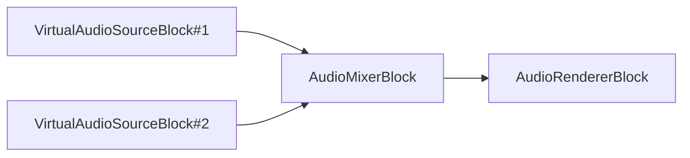

# Audio processing and effect blocks

[Media Blocks SDK .Net](https://www.visioforge.com/media-blocks-sdk-net){ .md-button .md-button--primary target="_blank" }

VisioForge Media Blocks SDK .Net includes a set of audio processing and effect blocks that allow you to create audio processing pipelines for your applications.

The blocks can be connected to each other to create a processing pipeline.

Most of the blocks are available for all platforms, including Windows, Linux, MacOS, Android, and iOS.

## Basic Audio Processing

### Audio Converter

The audio converter block converts audio from one format to another.

#### Block info

Name: AudioConverterBlock.

Pin direction | Media type | Pins count
--- | :---: | :---:
Input | Uncompressed audio | 1
Output | Uncompressed audio | 1

#### The sample pipeline


#### Sample code

```csharp
var pipeline = new MediaBlocksPipeline();

var filename = "test.mp3";
var fileSource = new UniversalSourceBlock(await UniversalSourceSettings.CreateAsync(new Uri(filename)));

var audioConverter = new AudioConverterBlock();
pipeline.Connect(fileSource.AudioOutput, audioConverter.Input);

var audioRenderer = new AudioRendererBlock();
pipeline.Connect(audioConverter.Output, audioRenderer.Input);

await pipeline.StartAsync();
```

#### Platforms

Windows, macOS, Linux, iOS, Android.

### Audio Resampler

The audio resampler block changes the sample rate of an audio stream.

#### Block info

Name: AudioResamplerBlock.

Pin direction | Media type | Pins count
--- | :---: | :---:
Input | Uncompressed audio | 1
Output | Uncompressed audio | 1

#### The sample pipeline


#### Sample code

```csharp
var pipeline = new MediaBlocksPipeline();

var filename = "test.mp3";
var fileSource = new UniversalSourceBlock(await UniversalSourceSettings.CreateAsync(new Uri(filename)));

// Resample to 48000 Hz, stereo
var settings = new AudioResamplerSettings(AudioFormatX.S16LE, 48000, 2);
var audioResampler = new AudioResamplerBlock(settings);
pipeline.Connect(fileSource.AudioOutput, audioResampler.Input);

var audioRenderer = new AudioRendererBlock();
pipeline.Connect(audioResampler.Output, audioRenderer.Input);

await pipeline.StartAsync();
```

#### Platforms

Windows, macOS, Linux, iOS, Android.

### Audio Timestamp Corrector

The audio timestamp corrector block can add or remove frames to correct input stream from unstable sources.

#### Block info

Name: AudioTimestampCorrectorBlock.

Pin direction | Media type | Pins count
--- | :---: | :---:
Input | Uncompressed audio | 1
Output | Uncompressed audio | 1

#### The sample pipeline


#### Sample code

```csharp
var pipeline = new MediaBlocksPipeline();

var filename = "test.mp3";
var fileSource = new UniversalSourceBlock(await UniversalSourceSettings.CreateAsync(new Uri(filename)));

var settings = new AudioTimestampCorrectorSettings();
var corrector = new AudioTimestampCorrectorBlock(settings);
pipeline.Connect(fileSource.AudioOutput, corrector.Input);

var audioRenderer = new AudioRendererBlock();
pipeline.Connect(corrector.Output, audioRenderer.Input);

await pipeline.StartAsync();
```

#### Platforms

Windows, macOS, Linux, iOS, Android.

### Volume

The volume block allows you to control the volume of the audio stream.

#### Block info

Name: VolumeBlock.

Pin direction | Media type | Pins count
--- | :---: | :---:
Input | Uncompressed audio | 1
Output | Uncompressed audio | 1

#### The sample pipeline


#### Sample code

```csharp
var pipeline = new MediaBlocksPipeline();

var filename = "test.mp3";
var fileSource = new UniversalSourceBlock(await UniversalSourceSettings.CreateAsync(new Uri(filename)));

// Volume: 0.0 (silence) to 1.0 (normal) or higher (amplification)
var volume = new VolumeBlock(0.8);
pipeline.Connect(fileSource.AudioOutput, volume.Input);

var audioRenderer = new AudioRendererBlock();
pipeline.Connect(volume.Output, audioRenderer.Input);

await pipeline.StartAsync();
```

#### Platforms

Windows, macOS, Linux, iOS, Android.

### Audio mixer

The audio mixer block mixes multiple audio streams into one. Block mixes the streams regardless of their format, converting if necessary.

All input streams will be synchronized. The mixer block handles the conversion of different input audio formats to a common format for mixing. By default, it will try to match the format of the first connected input, but this can be explicitly configured.

Use the `AudioMixerSettings` class to set the custom output format. This is useful if you need a specific sample rate, channel layout, or audio format (like S16LE, Float32LE, etc.) for the mixed output.

#### Block info

Name: AudioMixerBlock.

Pin direction | Media type | Pins count
--- | :---: | :---:
Input | Uncompressed audio | 1 (dynamically created)
Output | Uncompressed audio | 1

#### The sample pipeline



#### Sample code

```csharp
var pipeline = new MediaBlocksPipeline();

var audioSource1Block = new VirtualAudioSourceBlock(new VirtualAudioSourceSettings());
var audioSource2Block = new VirtualAudioSourceBlock(new VirtualAudioSourceSettings());

// Configure the mixer with specific output settings if needed
// For example, to output 48kHz, 2-channel, S16LE audio:
// var mixerSettings = new AudioMixerSettings() { Format = new AudioInfoX(AudioFormatX.S16LE, 48000, 2) };
// var audioMixerBlock = new AudioMixerBlock(mixerSettings);
var audioMixerBlock = new AudioMixerBlock(new AudioMixerSettings());

// Each call to CreateNewInput() adds a new input to the mixer
var inputPad1 = audioMixerBlock.CreateNewInput();
pipeline.Connect(audioSource1Block.Output, inputPad1);

var inputPad2 = audioMixerBlock.CreateNewInput();
pipeline.Connect(audioSource2Block.Output, inputPad2);

// Output the mixed audio to the default audio renderer
var audioRenderer = new AudioRendererBlock();
pipeline.Connect(audioMixerBlock.Output, audioRenderer.Input);

await pipeline.StartAsync();
```

#### Controlling Individual Input Streams

You can control the volume and mute state of individual input streams connected to the `AudioMixerBlock`.
The `streamIndex` for these methods corresponds to the order in which the inputs were added via `CreateNewInput()` or `CreateNewInputLive()` (starting from 0).

* **Set Volume**: Use the `SetVolume(int streamIndex, double value)` method. The `value` ranges from 0.0 (silence) to 1.0 (normal volume), and can be higher for amplification (e.g., up to 10.0, though specifics might depend on the underlying implementation limits).
* **Set Mute**: Use the `SetMute(int streamIndex, bool value)` method. Set `value` to `true` to mute the stream and `false` to unmute it.

```csharp
// Assuming audioMixerBlock is already created and inputs are connected

// Set volume of the first input stream (index 0) to 50%
audioMixerBlock.SetVolume(0, 0.5);

// Mute the second input stream (index 1)
audioMixerBlock.SetMute(1, true);
```

#### Dynamic Input Management (Live Pipeline)

The `AudioMixerBlock` supports adding and removing inputs dynamically while the pipeline is running:

* **Adding Inputs**: Use the `CreateNewInputLive()` method to get a new input pad that can be connected to a source. The underlying GStreamer elements will be set up to handle the new input.
* **Removing Inputs**: Use the `RemoveInputLive(MediaBlockPad blockPad)` method. This will disconnect the specified input pad and clean up associated resources.

This is particularly useful for applications where the number of audio sources can change during operation, such as a live mixing console or a conferencing application.

#### Platforms

Windows, macOS, Linux, iOS, Android.

### Audio sample grabber

The audio sample grabber block allows you to access the raw audio samples from the audio stream.

#### Block info

Name: AudioSampleGrabberBlock.

Pin direction | Media type | Pins count
--- | :---: | :---:
Input | Uncompressed audio | 1
Output | Uncompressed audio | 1

#### The sample pipeline


#### Sample code

```csharp
var pipeline = new MediaBlocksPipeline();

var filename = "test.mp3";
var fileSource = new UniversalSourceBlock(await UniversalSourceSettings.CreateAsync(new Uri(filename)));

var audioSampleGrabber = new AudioSampleGrabberBlock();
audioSampleGrabber.SampleGrabbed += (sender, args) =>
{
    // Process audio samples
    // args.AudioData - audio samples
    // args.AudioFormat - audio format
};
pipeline.Connect(fileSource.AudioOutput, audioSampleGrabber.Input);

var audioRenderer = new AudioRendererBlock();
pipeline.Connect(audioSampleGrabber.Output, audioRenderer.Input);

await pipeline.StartAsync();
```

#### Platforms

Windows, macOS, Linux, iOS, Android.

## Audio Effects

### Amplify

Block amplifies an audio stream by an amplification factor. Several clipping modes are available.

Use method and level values to configure.

#### Block info

Name: AmplifyBlock.

Pin direction | Media type | Pins count
--- | :---: | :---:
Input | Uncompressed audio | 1
Output | Uncompressed audio | 1

#### The sample pipeline


#### Sample code

```csharp
var pipeline = new MediaBlocksPipeline();

var filename = "test.mp3";
var fileSource = new UniversalSourceBlock(await UniversalSourceSettings.CreateAsync(new Uri(filename)));

var amplify = new AmplifyBlock(AmplifyClippingMethod.Normal, 2.0);
pipeline.Connect(fileSource.AudioOutput, amplify.Input);

var audioRenderer = new AudioRendererBlock();
pipeline.Connect(amplify.Output, audioRenderer.Input);

await pipeline.StartAsync();
```

#### Platforms

Windows, macOS, Linux, iOS, Android.

### Echo

The echo block adds echo effect to the audio stream.

#### Block info

Name: EchoBlock.

Pin direction | Media type | Pins count
--- | :---: | :---:
Input | Uncompressed audio | 1
Output | Uncompressed audio | 1

#### The sample pipeline


#### Sample code

```csharp
var pipeline = new MediaBlocksPipeline();

var filename = "test.mp3";
var fileSource = new UniversalSourceBlock(await UniversalSourceSettings.CreateAsync(new Uri(filename)));

// Delay in ms, strength 0.0 - 1.0
var echo = new EchoBlock(500, 0.5);
pipeline.Connect(fileSource.AudioOutput, echo.Input);

var audioRenderer = new AudioRendererBlock();
pipeline.Connect(echo.Output, audioRenderer.Input);

await pipeline.StartAsync();
```

#### Platforms

Windows, macOS, Linux, iOS, Android.

### Karaoke

The karaoke block applies a karaoke effect to the audio stream, removing center-panned vocals.

#### Block info

Name: KaraokeBlock.

Pin direction | Media type | Pins count
--- | :---: | :---:
Input | Uncompressed audio | 1
Output | Uncompressed audio | 1

#### The sample pipeline


#### Sample code

```csharp
var pipeline = new MediaBlocksPipeline();

var filename = "test.mp3";
var fileSource = new UniversalSourceBlock(await UniversalSourceSettings.CreateAsync(new Uri(filename)));

var settings = new KaraokeAudioEffect();
var karaoke = new KaraokeBlock(settings);
pipeline.Connect(fileSource.AudioOutput, karaoke.Input);

var audioRenderer = new AudioRendererBlock();
pipeline.Connect(karaoke.Output, audioRenderer.Input);

await pipeline.StartAsync();
```

#### Platforms

Windows, macOS, Linux, iOS, Android.

### Reverberation

The reverberation block adds reverb effects to the audio stream.

#### Block info

Name: ReverberationBlock.

Pin direction | Media type | Pins count
--- | :---: | :---:
Input | Uncompressed audio | 1
Output | Uncompressed audio | 1

#### The sample pipeline


#### Sample code

```csharp
var pipeline = new MediaBlocksPipeline();

var filename = "test.mp3";
var fileSource = new UniversalSourceBlock(await UniversalSourceSettings.CreateAsync(new Uri(filename)));

var settings = new ReverberationAudioEffect();
var reverb = new ReverberationBlock(settings);
pipeline.Connect(fileSource.AudioOutput, reverb.Input);

var audioRenderer = new AudioRendererBlock();
pipeline.Connect(reverb.Output, audioRenderer.Input);

await pipeline.StartAsync();
```

#### Platforms

Windows, macOS, Linux, iOS, Android.

### Wide Stereo

The wide stereo block enhances the stereo image of the audio.

#### Block info

Name: WideStereoBlock.

Pin direction | Media type | Pins count
--- | :---: | :---:
Input | Uncompressed audio | 1
Output | Uncompressed audio | 1

#### The sample pipeline


#### Sample code

```csharp
var pipeline = new MediaBlocksPipeline();

var filename = "test.mp3";
var fileSource = new UniversalSourceBlock(await UniversalSourceSettings.CreateAsync(new Uri(filename)));

var settings = new WideStereoAudioEffect();
var wideStereo = new WideStereoBlock(settings);
pipeline.Connect(fileSource.AudioOutput, wideStereo.Input);

var audioRenderer = new AudioRendererBlock();
pipeline.Connect(wideStereo.Output, audioRenderer.Input);

await pipeline.StartAsync();
```

#### Platforms

Windows, macOS, Linux, iOS, Android.

## Equalization and Filtering

### Balance

Block allows you to control the balance between left and right channels.

#### Block info

Name: AudioBalanceBlock.

Pin direction | Media type | Pins count
--- | :---: | :---:
Input | Uncompressed audio | 1
Output | Uncompressed audio | 1

#### The sample pipeline


#### Sample code

```csharp
var pipeline = new MediaBlocksPipeline();

var filename = "test.mp3";
var fileSource = new UniversalSourceBlock(await UniversalSourceSettings.CreateAsync(new Uri(filename)));

// Balance: -1.0 (full left) to 1.0 (full right), 0.0 - center
var balance = new AudioBalanceBlock(0.5);
pipeline.Connect(fileSource.AudioOutput, balance.Input);

var audioRenderer = new AudioRendererBlock();
pipeline.Connect(balance.Output, audioRenderer.Input);

await pipeline.StartAsync();
```

#### Platforms

Windows, macOS, Linux, iOS, Android.

### Equalizer (10 bands)

The 10-band equalizer block provides a 10-band equalizer for audio processing.

#### Block info

Name: Equalizer10Block.

Pin direction | Media type | Pins count
--- | :---: | :---:
Input | Uncompressed audio | 1
Output | Uncompressed audio | 1

#### The sample pipeline


#### Sample code

```csharp
var pipeline = new MediaBlocksPipeline();

var filename = "test.mp3";
var fileSource = new UniversalSourceBlock(await UniversalSourceSettings.CreateAsync(new Uri(filename)));

// Create 10-band equalizer with all bands set to 0 dB
var equalizer = new Equalizer10Block(0, 0, 0, 0, 0, 0, 0, 0, 0, 0);

// Or set bands individually
equalizer.SetBand(0, 3); // Band 0 (31 Hz) to +3 dB
equalizer.SetBand(1, 2); // Band 1 (62 Hz) to +2 dB
equalizer.SetBand(9, -3); // Band 9 (16 kHz) to -3 dB

pipeline.Connect(fileSource.AudioOutput, equalizer.Input);

var audioRenderer = new AudioRendererBlock();
pipeline.Connect(equalizer.Output, audioRenderer.Input);

await pipeline.StartAsync();
```

#### Platforms

Windows, macOS, Linux, iOS, Android.

### Equalizer (Parametric)

The parametric equalizer block provides a parametric equalizer for audio processing.

#### Block info

Name: EqualizerParametricBlock.

Pin direction | Media type | Pins count
--- | :---: | :---:
Input | Uncompressed audio | 1
Output | Uncompressed audio | 1

#### The sample pipeline


#### Sample code

```csharp
var pipeline = new MediaBlocksPipeline();

var filename = "test.mp3";
var fileSource = new UniversalSourceBlock(await UniversalSourceSettings.CreateAsync(new Uri(filename)));

// Create parametric equalizer
var equalizer = new EqualizerParametricBlock();

// Set up to 4 bands
equalizer.SetBand(0, 100, 1.0, 3); // Band 0: 100 Hz frequency, 1.0 Q, +3 dB gain
equalizer.SetBand(1, 1000, 1.5, -2); // Band 1: 1000 Hz frequency, 1.5 Q, -2 dB gain

pipeline.Connect(fileSource.AudioOutput, equalizer.Input);

var audioRenderer = new AudioRendererBlock();
pipeline.Connect(equalizer.Output, audioRenderer.Input);

await pipeline.StartAsync();
```

#### Platforms

Windows, macOS, Linux, iOS, Android.

### Chebyshev Band Pass/Reject

The Chebyshev band pass/reject block applies a band pass or band reject filter to the audio stream using Chebyshev filters.

#### Block info

Name: ChebyshevBandPassRejectBlock.

Pin direction | Media type | Pins count
--- | :---: | :---:
Input | Uncompressed audio | 1
Output | Uncompressed audio | 1

#### The sample pipeline


#### Sample code

```csharp
var pipeline = new MediaBlocksPipeline();

var filename = "test.mp3";
var fileSource = new UniversalSourceBlock(await UniversalSourceSettings.CreateAsync(new Uri(filename)));

var settings = new ChebyshevBandPassRejectAudioEffect();
var filter = new ChebyshevBandPassRejectBlock(settings);
pipeline.Connect(fileSource.AudioOutput, filter.Input);

var audioRenderer = new AudioRendererBlock();
pipeline.Connect(filter.Output, audioRenderer.Input);

await pipeline.StartAsync();
```

#### Platforms

Windows, macOS, Linux, iOS, Android.

### Chebyshev Limit

The Chebyshev limit block applies low-pass or high-pass filtering to the audio using Chebyshev filters.

#### Block info

Name: ChebyshevLimitBlock.

Pin direction | Media type | Pins count
--- | :---: | :---:
Input | Uncompressed audio | 1
Output | Uncompressed audio | 1

#### The sample pipeline


#### Sample code

```csharp
var pipeline = new MediaBlocksPipeline();

var filename = "test.mp3";
var fileSource = new UniversalSourceBlock(await UniversalSourceSettings.CreateAsync(new Uri(filename)));

var settings = new ChebyshevLimitAudioEffect();
var filter = new ChebyshevLimitBlock(settings);
pipeline.Connect(fileSource.AudioOutput, filter.Input);

var audioRenderer = new AudioRendererBlock();
pipeline.Connect(filter.Output, audioRenderer.Input);

await pipeline.StartAsync();
```

#### Platforms

Windows, macOS, Linux, iOS, Android.

## Dynamic Processing

### Compressor/Expander

The compressor/expander block provides dynamic range compression or expansion.

#### Block info

Name: CompressorExpanderBlock.

Pin direction | Media type | Pins count
--- | :---: | :---:
Input | Uncompressed audio | 1
Output | Uncompressed audio | 1

#### The sample pipeline


#### Sample code

```csharp
var pipeline = new MediaBlocksPipeline();

var filename = "test.mp3";
var fileSource = new UniversalSourceBlock(await UniversalSourceSettings.CreateAsync(new Uri(filename)));

var compressor = new CompressorExpanderBlock(0.5, 0.9, 0.1, 0.5);
pipeline.Connect(fileSource.AudioOutput, compressor.Input);

var audioRenderer = new AudioRendererBlock();
pipeline.Connect(compressor.Output, audioRenderer.Input);

await pipeline.StartAsync();
```

#### Platforms

Windows, macOS, Linux, iOS, Android.

### Scale/Tempo

The scale/tempo block allows you to change the tempo and pitch of the audio stream.

#### Block info

Name: ScaleTempoBlock.

Pin direction | Media type | Pins count
--- | :---: | :---:
Input | Uncompressed audio | 1
Output | Uncompressed audio | 1

#### The sample pipeline


#### Sample code

```csharp
var pipeline = new MediaBlocksPipeline();

var filename = "test.mp3";
var fileSource = new UniversalSourceBlock(await UniversalSourceSettings.CreateAsync(new Uri(filename)));

// Scale tempo by factor (1.0 is normal, 0.5 is half-speed, 2.0 is double-speed)
var scaleTempo = new ScaleTempoBlock(1.5);
pipeline.Connect(fileSource.AudioOutput, scaleTempo.Input);

var audioRenderer = new AudioRendererBlock();
pipeline.Connect(scaleTempo.Output, audioRenderer.Input);

await pipeline.StartAsync();
```

#### Platforms

Windows, macOS, Linux, iOS, Android.

## Analysis and Metering

### VU Meter

The VU meter block allows you to measure the volume level of the audio stream.

#### Block info

Name: VUMeterBlock.

Pin direction | Media type | Pins count
--- | :---: | :---:
Input | Uncompressed audio | 1
Output | Uncompressed audio | 1

#### The sample pipeline


#### Sample code

```csharp
var pipeline = new MediaBlocksPipeline();

var filename = "test.mp3";
var fileSource = new UniversalSourceBlock(await UniversalSourceSettings.CreateAsync(new Uri(filename)));

var vuMeter = new VUMeterBlock();
vuMeter.VolumeUpdated += (sender, args) =>
{
    // Left channel volume in dB
    var leftVolume = args.LeftVolume;
    
    // Right channel volume in dB
    var rightVolume = args.RightVolume;
    
    Console.WriteLine($"Left: {leftVolume:F2} dB, Right: {rightVolume:F2} dB");
};
pipeline.Connect(fileSource.AudioOutput, vuMeter.Input);

var audioRenderer = new AudioRendererBlock();
pipeline.Connect(vuMeter.Output, audioRenderer.Input);

await pipeline.StartAsync();
```

#### Platforms

Windows, macOS, Linux, iOS, Android.

## Audio Effects

### Audio Effects

The AudioEffects block provides a comprehensive collection of audio processing effects that can be applied to audio streams.

#### Block info

Name: AudioEffectsBlock.

Pin direction | Media type | Pins count
--- | :---: | :---:
Input | Uncompressed audio | 1
Output | Uncompressed audio | 1

#### The sample pipeline


#### Sample code

```csharp
var pipeline = new MediaBlocksPipeline();

var filename = "test.mp3";
var fileSource = new UniversalSourceBlock(await UniversalSourceSettings.CreateAsync(new Uri(filename)));

var audioEffects = new AudioEffectsBlock();
pipeline.Connect(fileSource.AudioOutput, audioEffects.Input);

var audioRenderer = new AudioRendererBlock();
pipeline.Connect(audioEffects.Output, audioRenderer.Input);

await pipeline.StartAsync();
```

#### Platforms

Windows, macOS, Linux, iOS, Android.

### Audio Loudness Normalization

The AudioLoudNorm block normalizes audio loudness according to EBU R128 standards, ensuring consistent perceived loudness across different audio content.

#### Block info

Name: AudioLoudNormBlock.

Pin direction | Media type | Pins count
--- | :---: | :---:
Input | Uncompressed audio | 1
Output | Uncompressed audio | 1

#### The sample pipeline

```mermaid
graph LR;
    UniversalSourceBlock-->AudioLoudNormBlock;
    AudioLoudNormBlock-->AudioRendererBlock;
```

#### Sample code

```csharp
var pipeline = new MediaBlocksPipeline();

var filename = "test.mp3";
var fileSource = new UniversalSourceBlock(await UniversalSourceSettings.CreateAsync(new Uri(filename)));

var loudNorm = new AudioLoudNormBlock();
pipeline.Connect(fileSource.AudioOutput, loudNorm.Input);

var audioRenderer = new AudioRendererBlock();
pipeline.Connect(loudNorm.Output, audioRenderer.Input);

await pipeline.StartAsync();
```

#### Platforms

Windows, macOS, Linux, iOS, Android.

### RNN Noise Reduction

The AudioRNNoise block uses recurrent neural network (RNN) based noise reduction to remove background noise from audio streams while preserving speech quality.

#### Block info

Name: AudioRNNoiseBlock.

Pin direction | Media type | Pins count
--- | :---: | :---:
Input | Uncompressed audio | 1
Output | Uncompressed audio | 1

#### The sample pipeline

```mermaid
graph LR;
    UniversalSourceBlock-->AudioRNNoiseBlock;
    AudioRNNoiseBlock-->AudioRendererBlock;
```

#### Sample code

```csharp
var pipeline = new MediaBlocksPipeline();

var filename = "noisy_audio.mp3";
var fileSource = new UniversalSourceBlock(await UniversalSourceSettings.CreateAsync(new Uri(filename)));

var rnnoise = new AudioRNNoiseBlock();
pipeline.Connect(fileSource.AudioOutput, rnnoise.Input);

var audioRenderer = new AudioRendererBlock();
pipeline.Connect(rnnoise.Output, audioRenderer.Input);

await pipeline.StartAsync();
```

#### Platforms

Windows, macOS, Linux, iOS, Android.

### Remove Silence

The RemoveSilence block automatically detects and removes silent portions from audio streams, useful for podcasts, voice recordings, and audio editing.

#### Block info

Name: RemoveSilenceBlock.

Pin direction | Media type | Pins count
--- | :---: | :---:
Input | Uncompressed audio | 1
Output | Uncompressed audio | 1

#### The sample pipeline

```mermaid
graph LR;
    UniversalSourceBlock-->RemoveSilenceBlock;
    RemoveSilenceBlock-->AudioRendererBlock;
```

#### Sample code

```csharp
var pipeline = new MediaBlocksPipeline();

var filename = "podcast.mp3";
var fileSource = new UniversalSourceBlock(await UniversalSourceSettings.CreateAsync(new Uri(filename)));

var removeSilence = new RemoveSilenceBlock();
pipeline.Connect(fileSource.AudioOutput, removeSilence.Input);

var audioRenderer = new AudioRendererBlock();
pipeline.Connect(removeSilence.Output, audioRenderer.Input);

await pipeline.StartAsync();
```

#### Platforms

Windows, macOS, Linux, iOS, Android.

### Csound Filter

The CsoundFilter block provides advanced audio synthesis and processing using the Csound audio programming language.

#### Block info

Name: CsoundFilterBlock.

Pin direction | Media type | Pins count
--- | :---: | :---:
Input | Uncompressed audio | 1
Output | Uncompressed audio | 1

#### The sample pipeline

```mermaid
graph LR;
    UniversalSourceBlock-->CsoundFilterBlock;
    CsoundFilterBlock-->AudioRendererBlock;
```

#### Sample code

```csharp
var pipeline = new MediaBlocksPipeline();

var filename = "test.mp3";
var fileSource = new UniversalSourceBlock(await UniversalSourceSettings.CreateAsync(new Uri(filename)));

var csoundSettings = new CsoundFilterSettings
{
    CsdPath = "filter.csd" // Csound script file
};
var csound = new CsoundFilterBlock(csoundSettings);
pipeline.Connect(fileSource.AudioOutput, csound.Input);

var audioRenderer = new AudioRendererBlock();
pipeline.Connect(csound.Output, audioRenderer.Input);

await pipeline.StartAsync();
```

#### Platforms

Windows, macOS, Linux (requires Csound).

### EBU R128 Level

The EbuR128Level block measures audio loudness according to the EBU R128 standard, providing accurate loudness measurements for broadcast compliance.

#### Block info

Name: EbuR128LevelBlock.

Pin direction | Media type | Pins count
--- | :---: | :---:
Input | Uncompressed audio | 1
Output | Uncompressed audio | 1

#### The sample pipeline

```mermaid
graph LR;
    UniversalSourceBlock-->EbuR128LevelBlock;
    EbuR128LevelBlock-->AudioRendererBlock;
```

#### Sample code

```csharp
var pipeline = new MediaBlocksPipeline();

var filename = "test.mp3";
var fileSource = new UniversalSourceBlock(await UniversalSourceSettings.CreateAsync(new Uri(filename)));

var ebuR128 = new EbuR128LevelBlock();
ebuR128.LoudnessUpdated += (sender, args) =>
{
    Console.WriteLine($"Momentary: {args.MomentaryLoudness:F2} LUFS");
    Console.WriteLine($"Short-term: {args.ShortTermLoudness:F2} LUFS");
};
pipeline.Connect(fileSource.AudioOutput, ebuR128.Input);

var audioRenderer = new AudioRendererBlock();
pipeline.Connect(ebuR128.Output, audioRenderer.Input);

await pipeline.StartAsync();
```

#### Platforms

Windows, macOS, Linux, iOS, Android.

### HRTF Render

The HRTFRender block applies Head-Related Transfer Function (HRTF) processing to create 3D spatial audio effects from stereo or multi-channel audio.

#### Block info

Name: HRTFRenderBlock.

Pin direction | Media type | Pins count
--- | :---: | :---:
Input | Uncompressed audio | 1
Output | Uncompressed audio | 1

#### The sample pipeline

```mermaid
graph LR;
    UniversalSourceBlock-->HRTFRenderBlock;
    HRTFRenderBlock-->AudioRendererBlock;
```

#### Sample code

```csharp
var pipeline = new MediaBlocksPipeline();

var filename = "test.mp3";
var fileSource = new UniversalSourceBlock(await UniversalSourceSettings.CreateAsync(new Uri(filename)));

var hrtfSettings = new HRTFRenderSettings
{
    Azimuth = 45.0,  // Direction in degrees
    Elevation = 0.0
};
var hrtf = new HRTFRenderBlock(hrtfSettings);
pipeline.Connect(fileSource.AudioOutput, hrtf.Input);

var audioRenderer = new AudioRendererBlock();
pipeline.Connect(hrtf.Output, audioRenderer.Input);

await pipeline.StartAsync();
```

#### Platforms

Windows, macOS, Linux, iOS, Android.

### RS Audio Echo

The RSAudioEcho block provides high-quality echo effects using the rsaudiofx GStreamer plugin.

#### Block info

Name: RSAudioEchoBlock.

Pin direction | Media type | Pins count
--- | :---: | :---:
Input | Uncompressed audio | 1
Output | Uncompressed audio | 1

#### The sample pipeline

```mermaid
graph LR;
    UniversalSourceBlock-->RSAudioEchoBlock;
    RSAudioEchoBlock-->AudioRendererBlock;
```

#### Sample code

```csharp
var pipeline = new MediaBlocksPipeline();

var filename = "test.mp3";
var fileSource = new UniversalSourceBlock(await UniversalSourceSettings.CreateAsync(new Uri(filename)));

var echoSettings = new RSAudioEchoSettings
{
    Delay = 500,      // Delay in milliseconds
    Intensity = 0.5,  // Echo intensity (0-1)
    Feedback = 0.3    // Feedback amount (0-1)
};
var rsEcho = new RSAudioEchoBlock(echoSettings);
pipeline.Connect(fileSource.AudioOutput, rsEcho.Input);

var audioRenderer = new AudioRendererBlock();
pipeline.Connect(rsEcho.Output, audioRenderer.Input);

await pipeline.StartAsync();
```

#### Platforms

Windows, macOS, Linux (requires rsaudiofx plugin).
