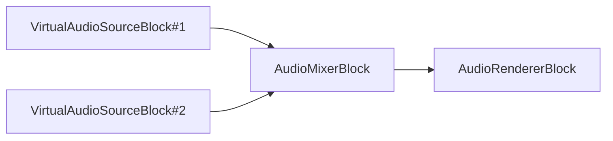

# Audio Processing and Effect Blocks for .NET

[Media Blocks SDK .Net](https://www.visioforge.com/media-blocks-sdk-net){ .md-button .md-button--primary target="_blank" }

VisioForge Media Blocks SDK provides a pipeline-based approach to audio processing in C# and .NET. Connect audio blocks — converters, resamplers, mixers, equalizers, effects, and analyzers — to build real-time audio processing chains for your applications. Each block has typed input/output pins that you wire together using `pipeline.Connect()`.

For detailed audio effect parameters and properties, see the [Audio Effects Reference](../../general/audio-effects/reference.md).

All blocks are cross-platform and work on Windows, macOS, Linux, iOS, and Android.

## Basic Audio Processing

### Audio Converter

The audio converter block converts audio from one format to another.

#### Block info

Name: AudioConverterBlock.

Pin direction | Media type | Pins count
--- | :---: | :---:
Input | Uncompressed audio | 1
Output | Uncompressed audio | 1

#### Settings

No configurable parameters. Automatically negotiates and converts audio formats between connected elements.

**GStreamer Element**: `audioconvert`

#### The sample pipeline


```mermaid
graph LR;
    UniversalSourceBlock-->AudioConverterBlock;
    AudioConverterBlock-->AudioRendererBlock;
```

#### Sample code

```csharp
var pipeline = new MediaBlocksPipeline();

var filename = "test.mp3";
var fileSource = new UniversalSourceBlock(await UniversalSourceSettings.CreateAsync(new Uri(filename)));

var audioConverter = new AudioConverterBlock();
pipeline.Connect(fileSource.AudioOutput, audioConverter.Input);

var audioRenderer = new AudioRendererBlock();
pipeline.Connect(audioConverter.Output, audioRenderer.Input);

await pipeline.StartAsync();
```

#### Platforms

Windows, macOS, Linux, iOS, Android.

### Audio Resampler

The audio resampler block changes the sample rate of an audio stream.

#### Block info

Name: AudioResamplerBlock.

Pin direction | Media type | Pins count
--- | :---: | :---:
Input | Uncompressed audio | 1
Output | Uncompressed audio | 1

#### Settings

Configure via `AudioResamplerSettings`:

| Property | Type | Default | Description |
|----------|------|---------|-------------|
| `Format` | `AudioFormatX` | `S16LE` | Target audio sample format |
| `SampleRate` | `int` | `44100` | Target sample rate in Hz |
| `Channels` | `int` | `2` | Target number of audio channels |
| `Quality` | `int` | `4` | Resample quality (0 = lowest, 10 = best) |
| `ResampleMethod` | `AudioResamplerMethod` | `Kaiser` | Resampling algorithm: `Nearest`, `Linear`, `Cubic`, `BlackmanNuttall`, `Kaiser` |

**GStreamer Element**: `audioresample`

#### The sample pipeline


```mermaid
graph LR;
    UniversalSourceBlock-->AudioResamplerBlock;
    AudioResamplerBlock-->AudioRendererBlock;
```

#### Sample code

```csharp
var pipeline = new MediaBlocksPipeline();

var filename = "test.mp3";
var fileSource = new UniversalSourceBlock(await UniversalSourceSettings.CreateAsync(new Uri(filename)));

// Resample to 48000 Hz, stereo
var settings = new AudioResamplerSettings(AudioFormatX.S16LE, 48000, 2);
var audioResampler = new AudioResamplerBlock(settings);
pipeline.Connect(fileSource.AudioOutput, audioResampler.Input);

var audioRenderer = new AudioRendererBlock();
pipeline.Connect(audioResampler.Output, audioRenderer.Input);

await pipeline.StartAsync();
```

#### Platforms

Windows, macOS, Linux, iOS, Android.

### Audio Timestamp Corrector

The audio timestamp corrector block can add or remove frames to correct input stream from unstable sources.

#### Block info

Name: AudioTimestampCorrectorBlock.

Pin direction | Media type | Pins count
--- | :---: | :---:
Input | Uncompressed audio | 1
Output | Uncompressed audio | 1

#### Settings

Configure via `AudioTimestampCorrectorSettings`:

| Property | Type | Default | Description |
|----------|------|---------|-------------|
| `Silent` | `bool` | `true` | Suppresses notify signals for dropped and duplicated frames |
| `SkipToFirst` | `bool` | `false` | Does not produce buffers before the first one is received |
| `Tolerance` | `TimeSpan` | `40 ms` | Minimum timestamp difference before samples are added or dropped |

**GStreamer Element**: `audiorate`

#### The sample pipeline


```mermaid
graph LR;
    UniversalSourceBlock-->AudioTimestampCorrectorBlock;
    AudioTimestampCorrectorBlock-->AudioRendererBlock;
```

#### Sample code

```csharp
var pipeline = new MediaBlocksPipeline();

var filename = "test.mp3";
var fileSource = new UniversalSourceBlock(await UniversalSourceSettings.CreateAsync(new Uri(filename)));

var settings = new AudioTimestampCorrectorSettings();
var corrector = new AudioTimestampCorrectorBlock(settings);
pipeline.Connect(fileSource.AudioOutput, corrector.Input);

var audioRenderer = new AudioRendererBlock();
pipeline.Connect(corrector.Output, audioRenderer.Input);

await pipeline.StartAsync();
```

#### Platforms

Windows, macOS, Linux, iOS, Android.

### Audio Delay

The audio delay block shifts audio buffer timestamps to delay the entire audio stream. Use it when the captured or decoded audio arrives earlier than video and you need to correct A/V sync, or when only one branch of an audio pipeline should be delayed before recording or streaming.

`AudioDelayBlock` is different from echo effects such as `EchoBlock` or `RSAudioEchoBlock`: it does not mix a delayed copy back into the signal. It delays the stream itself by applying a timestamp offset.

#### Block info

Name: AudioDelayBlock.

Pin direction | Media type | Pins count
--- | :---: | :---:
Input | Uncompressed audio | 1
Output | Uncompressed audio | 1

#### Settings

Configure via `AudioDelaySettings` or pass a `TimeSpan` directly to the constructor:

| Property | Type | Default | Description |
|----------|------|---------|-------------|
| `Delay` | `TimeSpan` | `TimeSpan.Zero` | Non-negative audio delay to apply to the stream |
| `Sync` | `bool` | `true` | Synchronizes the underlying element to the pipeline clock |
| `Silent` | `bool` | `true` | Suppresses handoff messages from the underlying element |

**GStreamer Element**: `identity` with `ts-offset`.

#### The sample pipeline


```mermaid
graph LR;
    UniversalSourceBlock-->AudioDelayBlock;
    AudioDelayBlock-->AudioRendererBlock;
```

#### Sample code

```csharp
var pipeline = new MediaBlocksPipeline();

var filename = "test.mp4";
var fileSource = new UniversalSourceBlock(await UniversalSourceSettings.CreateAsync(new Uri(filename)));

// Delay audio by 500 ms.
var audioDelay = new AudioDelayBlock(TimeSpan.FromMilliseconds(500));
pipeline.Connect(fileSource.AudioOutput, audioDelay.Input);

var audioRenderer = new AudioRendererBlock();
pipeline.Connect(audioDelay.Output, audioRenderer.Input);

await pipeline.StartAsync();
```

#### Delaying only the recording branch

When you preview and record at the same time, place `AudioDelayBlock` only on the branch that needs the offset.

```csharp
var audioTee = new TeeBlock(2, MediaBlockPadMediaType.Audio);
pipeline.Connect(audioSource.Output, audioTee.Input);

// Preview branch without additional delay.
pipeline.Connect(audioTee.Outputs[0], audioRenderer.Input);

// Recording branch with delayed audio.
var audioDelay = new AudioDelayBlock(TimeSpan.FromMilliseconds(250));
pipeline.Connect(audioTee.Outputs[1], audioDelay.Input);
pipeline.Connect(audioDelay.Output, aacEncoder.Input);
pipeline.Connect(aacEncoder.Output, mp4Sink.CreateNewInput(MediaBlockPadMediaType.Audio));
```

#### Platforms

Windows, macOS, Linux, iOS, Android.

### Volume

The volume block allows you to control the volume of the audio stream.

#### Block info

Name: VolumeBlock.

Pin direction | Media type | Pins count
--- | :---: | :---:
Input | Uncompressed audio | 1
Output | Uncompressed audio | 1

#### Settings

| Property | Type | Default | Description |
|----------|------|---------|-------------|
| `Level` | `double` | `1.0` | Volume level multiplier (0.0 = silence, 1.0 = original, values > 1.0 amplify) |
| `Mute` | `bool` | `false` | Mutes the audio stream without changing the volume level |

**GStreamer Element**: `volume`

#### The sample pipeline


```mermaid
graph LR;
    UniversalSourceBlock-->VolumeBlock;
    VolumeBlock-->AudioRendererBlock;
```

#### Sample code

```csharp
var pipeline = new MediaBlocksPipeline();

var filename = "test.mp3";
var fileSource = new UniversalSourceBlock(await UniversalSourceSettings.CreateAsync(new Uri(filename)));

// VolumeBlock has a parameterless constructor; set Level on the property (0.0 silence, 1.0 normal, >1.0 amplified).
var volume = new VolumeBlock { Level = 0.8 };
pipeline.Connect(fileSource.AudioOutput, volume.Input);

var audioRenderer = new AudioRendererBlock();
pipeline.Connect(volume.Output, audioRenderer.Input);

await pipeline.StartAsync();
```

#### Platforms

Windows, macOS, Linux, iOS, Android.

### Audio mixer

The audio mixer block mixes multiple audio streams into one. Block mixes the streams regardless of their format, converting if necessary.

All input streams will be synchronized. The mixer block handles the conversion of different input audio formats to a common format for mixing. By default, it will try to match the format of the first connected input, but this can be explicitly configured.

Use the `AudioMixerSettings` class to set the custom output format. This is useful if you need a specific sample rate, channel layout, or audio format (like S16LE, Float32LE, etc.) for the mixed output.

#### Block info

Name: AudioMixerBlock.

Pin direction | Media type | Pins count
--- | :---: | :---:
Input | Uncompressed audio | 1 (dynamically created)
Output | Uncompressed audio | 1

#### Settings

Configure via `AudioMixerSettings`:

| Property | Type | Default | Description |
|----------|------|---------|-------------|
| `Format` | `AudioInfoX` | `S16LE, 48000 Hz, 2 ch` | Output audio format (sample format, sample rate, channel count) |

**Runtime methods:**

| Method | Description |
|--------|-------------|
| `CreateNewInput()` | Creates a new input pad (before pipeline start) |
| `CreateNewInputLive()` | Creates a new input pad during playback |
| `RemoveInputLive(MediaBlockPad)` | Removes an input pad during playback |
| `SetVolume(int streamIndex, double value)` | Sets volume for a specific input by 0-based index (0.0–10.0) |
| `SetMute(int streamIndex, bool value)` | Mutes or unmutes a specific input by 0-based index |

**GStreamer Element**: `audiomixer`

#### The sample pipeline


```mermaid
graph LR;
    VirtualAudioSourceBlock#1-->AudioMixerBlock;
    VirtualAudioSourceBlock#2-->AudioMixerBlock;
    AudioMixerBlock-->AudioRendererBlock;
```

#### Sample code

```csharp
var pipeline = new MediaBlocksPipeline();

var audioSource1Block = new VirtualAudioSourceBlock(new VirtualAudioSourceSettings());
var audioSource2Block = new VirtualAudioSourceBlock(new VirtualAudioSourceSettings());

// Configure the mixer with specific output settings if needed
// For example, to output 48kHz, 2-channel, S16LE audio:
// var mixerSettings = new AudioMixerSettings() { Format = new AudioInfoX(AudioFormatX.S16LE, 48000, 2) };
// var audioMixerBlock = new AudioMixerBlock(mixerSettings);
var audioMixerBlock = new AudioMixerBlock(new AudioMixerSettings());

// Each call to CreateNewInput() adds a new input to the mixer
var inputPad1 = audioMixerBlock.CreateNewInput();
pipeline.Connect(audioSource1Block.Output, inputPad1);

var inputPad2 = audioMixerBlock.CreateNewInput();
pipeline.Connect(audioSource2Block.Output, inputPad2);

// Output the mixed audio to the default audio renderer
var audioRenderer = new AudioRendererBlock();
pipeline.Connect(audioMixerBlock.Output, audioRenderer.Input);

await pipeline.StartAsync();
```

#### Controlling Individual Input Streams

You can control the volume and mute state of individual input streams connected to the `AudioMixerBlock`.
The `streamIndex` for these methods corresponds to the order in which the inputs were added via `CreateNewInput()` or `CreateNewInputLive()` (starting from 0).

* **Set Volume**: Use the `SetVolume(int streamIndex, double value)` method. The `value` ranges from 0.0 (silence) to 1.0 (normal volume), and can be higher for amplification (e.g., up to 10.0, though specifics might depend on the underlying implementation limits).
* **Set Mute**: Use the `SetMute(int streamIndex, bool value)` method. Set `value` to `true` to mute the stream and `false` to unmute it.

```csharp
// Assuming audioMixerBlock is already created and inputs are connected

// Set volume of the first input stream (index 0) to 50%
audioMixerBlock.SetVolume(0, 0.5);

// Mute the second input stream (index 1)
audioMixerBlock.SetMute(1, true);
```

#### Dynamic Input Management (Live Pipeline)

The `AudioMixerBlock` supports adding and removing inputs dynamically while the pipeline is running:

* **Adding Inputs**: Use the `CreateNewInputLive()` method to get a new input pad that can be connected to a source. The underlying GStreamer elements will be set up to handle the new input.
* **Removing Inputs**: Use the `RemoveInputLive(MediaBlockPad blockPad)` method. This will disconnect the specified input pad and clean up associated resources.

This is particularly useful for applications where the number of audio sources can change during operation, such as a live mixing console or a conferencing application.

#### Platforms

Windows, macOS, Linux, iOS, Android.

### Audio sample grabber

The audio sample grabber block allows you to access the raw audio samples from the audio stream.

#### Block info

Name: AudioSampleGrabberBlock.

Pin direction | Media type | Pins count
--- | :---: | :---:
Input | Uncompressed audio | 1
Output | Uncompressed audio | 1

#### Settings

| Property | Type | Default | Description |
|----------|------|---------|-------------|
| `format` (constructor) | `AudioFormatX` | `S16LE` | Audio sample format for captured frames |

| Event | Args Type | Description |
|-------|-----------|-------------|
| `OnAudioFrameBuffer` | `AudioFrameBufferEventArgs` | Fires for each captured audio frame with raw audio data, sample rate, channels, and timestamp |

#### The sample pipeline


```mermaid
graph LR;
    UniversalSourceBlock-->AudioSampleGrabberBlock;
    AudioSampleGrabberBlock-->AudioRendererBlock;
```

#### Sample code

```csharp
var pipeline = new MediaBlocksPipeline();

var filename = "test.mp3";
var fileSource = new UniversalSourceBlock(await UniversalSourceSettings.CreateAsync(new Uri(filename)));

var audioSampleGrabber = new AudioSampleGrabberBlock();
audioSampleGrabber.OnAudioFrameBuffer += (sender, args) =>
{
    // args.Frame.Data        — IntPtr to the raw PCM buffer
    // args.Frame.DataSize    — byte length of the buffer
    // args.Frame.Info.Format — AudioFormat (e.g., S16LE, F32LE)
    // args.Frame.Info.SampleRate / Channels / BPS
    // Set args.UpdateData = true if you mutate the buffer and want it propagated downstream.
};
pipeline.Connect(fileSource.AudioOutput, audioSampleGrabber.Input);

var audioRenderer = new AudioRendererBlock();
pipeline.Connect(audioSampleGrabber.Output, audioRenderer.Input);

await pipeline.StartAsync();
```

#### Platforms

Windows, macOS, Linux, iOS, Android.

## Audio Effects

### Amplify

Block amplifies an audio stream by an amplification factor. Several clipping modes are available.

Use method and level values to configure.

#### Block info

Name: AmplifyBlock.

Pin direction | Media type | Pins count
--- | :---: | :---:
Input | Uncompressed audio | 1
Output | Uncompressed audio | 1

#### Settings

| Property | Type | Default | Description |
|----------|------|---------|-------------|
| `Level` | `double` | `1.0` | Amplification multiplier (1.0 = no change, 2.0 = double volume, 0.5 = half volume) |
| `Method` | `AmplifyClippingMethod` | `Normal` | Clipping method when amplified audio exceeds the valid range |

`AmplifyClippingMethod` values:

| Value | Description |
|-------|-------------|
| `Normal` | Hard clip at maximum level |
| `WrapNegative` | Push overdriven values back from the opposite side |
| `WrapPositive` | Push overdriven values back from the same side |
| `NoClip` | No clipping applied |

**GStreamer Element**: `audioamplify`

#### The sample pipeline


```mermaid
graph LR;
    UniversalSourceBlock-->AmplifyBlock;
    AmplifyBlock-->AudioRendererBlock;
```

#### Sample code

```csharp
var pipeline = new MediaBlocksPipeline();

var filename = "test.mp3";
var fileSource = new UniversalSourceBlock(await UniversalSourceSettings.CreateAsync(new Uri(filename)));

var amplify = new AmplifyBlock(AmplifyClippingMethod.Normal, 2.0);
pipeline.Connect(fileSource.AudioOutput, amplify.Input);

var audioRenderer = new AudioRendererBlock();
pipeline.Connect(amplify.Output, audioRenderer.Input);

await pipeline.StartAsync();
```

#### Platforms

Windows, macOS, Linux, iOS, Android.

### Echo

The echo block adds echo effect to the audio stream.

#### Block info

Name: EchoBlock.

Pin direction | Media type | Pins count
--- | :---: | :---:
Input | Uncompressed audio | 1
Output | Uncompressed audio | 1

#### Settings

| Property | Type | Default | Description |
|----------|------|---------|-------------|
| `Delay` | `TimeSpan` | `200 ms` | Echo delay time between the original signal and its repetitions |
| `MaxDelay` | `TimeSpan` | `500 ms` | Maximum echo delay (determines internal buffer size). Must be >= `Delay` |
| `Intensity` | `float` | `0` | Volume of the delayed signal (0.0 = no echo, 1.0 = full volume) |
| `Feedback` | `float` | `0` | Feedback amount for echo repetitions (0.0 = single echo, values near 1.0 = infinite feedback) |

**GStreamer Element**: `audioecho`

#### The sample pipeline


```mermaid
graph LR;
    UniversalSourceBlock-->EchoBlock;
    EchoBlock-->AudioRendererBlock;
```

#### Sample code

```csharp
var pipeline = new MediaBlocksPipeline();

var filename = "test.mp3";
var fileSource = new UniversalSourceBlock(await UniversalSourceSettings.CreateAsync(new Uri(filename)));

// EchoBlock has a parameterless constructor; set properties directly.
var echo = new EchoBlock
{
    Delay     = TimeSpan.FromMilliseconds(200),   // echo delay
    MaxDelay  = TimeSpan.FromMilliseconds(500),   // internal buffer size (must be >= Delay)
    Intensity = 0.5f,                             // volume of delayed signal (0.0-1.0)
    Feedback  = 0.3f                              // feedback amount (0.0-near 1.0)
};
pipeline.Connect(fileSource.AudioOutput, echo.Input);

var audioRenderer = new AudioRendererBlock();
pipeline.Connect(echo.Output, audioRenderer.Input);

await pipeline.StartAsync();
```

#### Platforms

Windows, macOS, Linux, iOS, Android.

### Karaoke

The karaoke block applies a karaoke effect to the audio stream, removing center-panned vocals.

#### Block info

Name: KaraokeBlock.

Pin direction | Media type | Pins count
--- | :---: | :---:
Input | Uncompressed audio | 1
Output | Uncompressed audio | 1

#### Settings

Configure via `KaraokeAudioEffect`:

| Property | Type | Default | Description |
|----------|------|---------|-------------|
| `Level` | `float` | `1.0` | Vocal suppression strength (0.0 = no effect, 1.0 = maximum suppression) |
| `MonoLevel` | `float` | `1.0` | Suppression level for mono/center channel content (0.0–1.0) |
| `FilterBand` | `float` | `220` | Center frequency of the filter band in Hz targeting vocal range |
| `FilterWidth` | `float` | `100` | Width of the frequency band to process in Hz |

**GStreamer Element**: `audiokaraoke`

#### The sample pipeline


```mermaid
graph LR;
    UniversalSourceBlock-->KaraokeBlock;
    KaraokeBlock-->AudioRendererBlock;
```

#### Sample code

```csharp
var pipeline = new MediaBlocksPipeline();

var filename = "test.mp3";
var fileSource = new UniversalSourceBlock(await UniversalSourceSettings.CreateAsync(new Uri(filename)));

var settings = new KaraokeAudioEffect();
var karaoke = new KaraokeBlock(settings);
pipeline.Connect(fileSource.AudioOutput, karaoke.Input);

var audioRenderer = new AudioRendererBlock();
pipeline.Connect(karaoke.Output, audioRenderer.Input);

await pipeline.StartAsync();
```

#### Platforms

Windows, macOS, Linux, iOS, Android.

### Reverberation

The reverberation block adds reverb effects to the audio stream.

#### Block info

Name: ReverberationBlock.

Pin direction | Media type | Pins count
--- | :---: | :---:
Input | Uncompressed audio | 1
Output | Uncompressed audio | 1

#### Settings

Configure via `ReverberationAudioEffect`:

| Property | Type | Default | Description |
|----------|------|---------|-------------|
| `RoomSize` | `float` | `0.5` | Size of the simulated room (0.0 = small room, 1.0 = large hall) |
| `Damping` | `float` | `0.2` | High frequency damping (0.0 = bright, 1.0 = dark/muffled) |
| `Width` | `float` | `1.0` | Stereo width of the reverb (0.0 = mono, 1.0 = full stereo) |
| `Level` | `float` | `0.5` | Wet/dry mix level (0.0 = dry only, 1.0 = wet only) |

**GStreamer Element**: `freeverb`

#### The sample pipeline


```mermaid
graph LR;
    UniversalSourceBlock-->ReverberationBlock;
    ReverberationBlock-->AudioRendererBlock;
```

#### Sample code

```csharp
var pipeline = new MediaBlocksPipeline();

var filename = "test.mp3";
var fileSource = new UniversalSourceBlock(await UniversalSourceSettings.CreateAsync(new Uri(filename)));

var settings = new ReverberationAudioEffect();
var reverb = new ReverberationBlock(settings);
pipeline.Connect(fileSource.AudioOutput, reverb.Input);

var audioRenderer = new AudioRendererBlock();
pipeline.Connect(reverb.Output, audioRenderer.Input);

await pipeline.StartAsync();
```

#### Platforms

Windows, macOS, Linux, iOS, Android.

### Wide Stereo

The wide stereo block enhances the stereo image of the audio.

#### Block info

Name: WideStereoBlock.

Pin direction | Media type | Pins count
--- | :---: | :---:
Input | Uncompressed audio | 1
Output | Uncompressed audio | 1

#### Settings

Configure via `WideStereoAudioEffect`:

| Property | Type | Default | Description |
|----------|------|---------|-------------|
| `Level` | `float` | `0.01` | Stereo widening amount (0.0 = no widening, higher values = wider stereo image). Typical: 0.01–0.03 subtle, 0.05–0.10 moderate, 0.15+ strong |

**GStreamer Element**: `stereo`

#### The sample pipeline


```mermaid
graph LR;
    UniversalSourceBlock-->WideStereoBlock;
    WideStereoBlock-->AudioRendererBlock;
```

#### Sample code

```csharp
var pipeline = new MediaBlocksPipeline();

var filename = "test.mp3";
var fileSource = new UniversalSourceBlock(await UniversalSourceSettings.CreateAsync(new Uri(filename)));

var settings = new WideStereoAudioEffect();
var wideStereo = new WideStereoBlock(settings);
pipeline.Connect(fileSource.AudioOutput, wideStereo.Input);

var audioRenderer = new AudioRendererBlock();
pipeline.Connect(wideStereo.Output, audioRenderer.Input);

await pipeline.StartAsync();
```

#### Platforms

Windows, macOS, Linux, iOS, Android.

## Equalization and Filtering

### Balance

Block allows you to control the balance between left and right channels.

#### Block info

Name: AudioBalanceBlock.

Pin direction | Media type | Pins count
--- | :---: | :---:
Input | Uncompressed audio | 1
Output | Uncompressed audio | 1

#### Settings

| Property | Type | Default | Description |
|----------|------|---------|-------------|
| `Balance` | `float` | `0.0` | Stereo balance position (-1.0 = full left, 0.0 = center, +1.0 = full right) |

**GStreamer Element**: `audiopanorama`

#### The sample pipeline


```mermaid
graph LR;
    UniversalSourceBlock-->AudioBalanceBlock;
    AudioBalanceBlock-->AudioRendererBlock;
```

#### Sample code

```csharp
var pipeline = new MediaBlocksPipeline();

var filename = "test.mp3";
var fileSource = new UniversalSourceBlock(await UniversalSourceSettings.CreateAsync(new Uri(filename)));

// Balance: -1.0 (full left) to 1.0 (full right), 0.0 = center. The ctor takes a float, not double.
var balance = new AudioBalanceBlock(0.5f);
pipeline.Connect(fileSource.AudioOutput, balance.Input);

var audioRenderer = new AudioRendererBlock();
pipeline.Connect(balance.Output, audioRenderer.Input);

await pipeline.StartAsync();
```

#### Platforms

Windows, macOS, Linux, iOS, Android.

### Equalizer (10 bands)

The 10-band equalizer block provides a 10-band equalizer for audio processing.

#### Block info

Name: Equalizer10Block.

Pin direction | Media type | Pins count
--- | :---: | :---:
Input | Uncompressed audio | 1
Output | Uncompressed audio | 1

#### Settings

The equalizer provides 10 fixed-frequency bands. Use `SetBand(int index, double gain)` to adjust individual bands. Gain range: -24 dB to +12 dB.

| Band Index | Center Frequency | Bandwidth |
|------------|-----------------|-----------|
| 0 | 29 Hz | 19 Hz |
| 1 | 59 Hz | 39 Hz |
| 2 | 119 Hz | 79 Hz |
| 3 | 237 Hz | 157 Hz |
| 4 | 474 Hz | 314 Hz |
| 5 | 947 Hz | 628 Hz |
| 6 | 1889 Hz | 1257 Hz |
| 7 | 3770 Hz | 2511 Hz |
| 8 | 7523 Hz | 5765 Hz |
| 9 | 15011 Hz | 11498 Hz |

Constructor is parameterless. Use `SetBand(int index, double gain)` to adjust each of the 10 bands after construction.

**GStreamer Element**: `equalizer-10bands`

#### The sample pipeline


```mermaid
graph LR;
    UniversalSourceBlock-->Equalizer10Block;
    Equalizer10Block-->AudioRendererBlock;
```

#### Sample code

```csharp
var pipeline = new MediaBlocksPipeline();

var filename = "test.mp3";
var fileSource = new UniversalSourceBlock(await UniversalSourceSettings.CreateAsync(new Uri(filename)));

// Create 10-band equalizer (parameterless ctor; bands default to 0 dB)
var equalizer = new Equalizer10Block();

// Set bands individually
equalizer.SetBand(0, 3); // Band 0 (31 Hz) to +3 dB
equalizer.SetBand(1, 2); // Band 1 (62 Hz) to +2 dB
equalizer.SetBand(9, -3); // Band 9 (16 kHz) to -3 dB

pipeline.Connect(fileSource.AudioOutput, equalizer.Input);

var audioRenderer = new AudioRendererBlock();
pipeline.Connect(equalizer.Output, audioRenderer.Input);

await pipeline.StartAsync();
```

#### Platforms

Windows, macOS, Linux, iOS, Android.

### Equalizer (Parametric)

The parametric equalizer block provides a parametric equalizer for audio processing.

#### Block info

Name: EqualizerParametricBlock.

Pin direction | Media type | Pins count
--- | :---: | :---:
Input | Uncompressed audio | 1
Output | Uncompressed audio | 1

#### Settings

Use `SetNumBands(int count)` to set the number of bands (1–64, default 3), then configure each band with `SetState(int index, ParametricEqualizerBand band)`.

`ParametricEqualizerBand` properties:

| Property | Type | Default | Description |
|----------|------|---------|-------------|
| `Frequency` | `float` | varies | Center frequency in Hz |
| `Gain` | `float` | `0.0` | Band gain in dB (-24 to +12) |
| `Width` | `float` | `1.0` | Bandwidth (width) in Hz |

Default bands (when 3 bands configured):

| Band | Frequency | Bandwidth |
|------|-----------|-----------|
| 0 | 110 Hz | 100 Hz |
| 1 | 1100 Hz | 1000 Hz |
| 2 | 11000 Hz | 10000 Hz |

**GStreamer Element**: `equalizer-nbands`

#### The sample pipeline


```mermaid
graph LR;
    UniversalSourceBlock-->EqualizerParametricBlock;
    EqualizerParametricBlock-->AudioRendererBlock;
```

#### Sample code

```csharp
var pipeline = new MediaBlocksPipeline();

var filename = "test.mp3";
var fileSource = new UniversalSourceBlock(await UniversalSourceSettings.CreateAsync(new Uri(filename)));

// Create parametric equalizer
var equalizer = new EqualizerParametricBlock();

// Configure the number of bands, then set each band via SetState(int index, ParametricEqualizerBand).
// ParametricEqualizerBand(freq: Hz, width: Hz bandwidth, gain: dB). Properties: Frequency, Width, Gain.
equalizer.SetNumBands(4);
equalizer.SetState(0, new ParametricEqualizerBand(freq: 100f,  width: 50f,  gain: 3f));
equalizer.SetState(1, new ParametricEqualizerBand(freq: 1000f, width: 500f, gain: -2f));

pipeline.Connect(fileSource.AudioOutput, equalizer.Input);

var audioRenderer = new AudioRendererBlock();
pipeline.Connect(equalizer.Output, audioRenderer.Input);

await pipeline.StartAsync();
```

#### Platforms

Windows, macOS, Linux, iOS, Android.

### Chebyshev Band Pass/Reject

The Chebyshev band pass/reject block applies a band pass or band reject filter to the audio stream using Chebyshev filters.

#### Block info

Name: ChebyshevBandPassRejectBlock.

Pin direction | Media type | Pins count
--- | :---: | :---:
Input | Uncompressed audio | 1
Output | Uncompressed audio | 1

#### Settings

Configure via `ChebyshevBandPassRejectAudioEffect`:

| Property | Type | Default | Description |
|----------|------|---------|-------------|
| `Mode` | `ChebyshevBandMode` | `BandPass` | Filter mode: `BandPass` (pass frequencies in range) or `BandReject` (reject frequencies in range) |
| `LowerFrequency` | `float` | `220.0` | Lower cutoff frequency in Hz |
| `UpperFrequency` | `float` | `3000.0` | Upper cutoff frequency in Hz |
| `Poles` | `int` | `4` | Number of filter poles (2–32, must be even). Higher values = sharper cutoff |
| `Type` | `int` | `1` | Chebyshev filter type: 1 (ripple in passband) or 2 (ripple in stopband) |
| `Ripple` | `float` | `0.25` | Amount of ripple in dB (Type 1: passband ripple, Type 2: stopband ripple) |

**GStreamer Element**: `audiochebband`

#### The sample pipeline


```mermaid
graph LR;
    UniversalSourceBlock-->ChebyshevBandPassRejectBlock;
    ChebyshevBandPassRejectBlock-->AudioRendererBlock;
```

#### Sample code

```csharp
var pipeline = new MediaBlocksPipeline();

var filename = "test.mp3";
var fileSource = new UniversalSourceBlock(await UniversalSourceSettings.CreateAsync(new Uri(filename)));

var settings = new ChebyshevBandPassRejectAudioEffect();
var filter = new ChebyshevBandPassRejectBlock(settings);
pipeline.Connect(fileSource.AudioOutput, filter.Input);

var audioRenderer = new AudioRendererBlock();
pipeline.Connect(filter.Output, audioRenderer.Input);

await pipeline.StartAsync();
```

#### Platforms

Windows, macOS, Linux, iOS, Android.

### Chebyshev Limit

The Chebyshev limit block applies low-pass or high-pass filtering to the audio using Chebyshev filters.

#### Block info

Name: ChebyshevLimitBlock.

Pin direction | Media type | Pins count
--- | :---: | :---:
Input | Uncompressed audio | 1
Output | Uncompressed audio | 1

#### Settings

Configure via `ChebyshevLimitAudioEffect`:

| Property | Type | Default | Description |
|----------|------|---------|-------------|
| `Mode` | `ChebyshevLimitMode` | `LowPass` | Filter mode: `LowPass` (remove high frequencies) or `HighPass` (remove low frequencies) |
| `CutOffFrequency` | `float` | `1000.0` | Cutoff frequency in Hz |
| `Poles` | `int` | `4` | Number of filter poles (2–32, must be even). Higher values = sharper cutoff |
| `Type` | `int` | `1` | Chebyshev filter type: 1 (ripple in passband) or 2 (ripple in stopband) |
| `Ripple` | `float` | `0.25` | Amount of ripple in dB |

**GStreamer Element**: `audiocheblimit`

#### The sample pipeline


```mermaid
graph LR;
    UniversalSourceBlock-->ChebyshevLimitBlock;
    ChebyshevLimitBlock-->AudioRendererBlock;
```

#### Sample code

```csharp
var pipeline = new MediaBlocksPipeline();

var filename = "test.mp3";
var fileSource = new UniversalSourceBlock(await UniversalSourceSettings.CreateAsync(new Uri(filename)));

var settings = new ChebyshevLimitAudioEffect();
var filter = new ChebyshevLimitBlock(settings);
pipeline.Connect(fileSource.AudioOutput, filter.Input);

var audioRenderer = new AudioRendererBlock();
pipeline.Connect(filter.Output, audioRenderer.Input);

await pipeline.StartAsync();
```

#### Platforms

Windows, macOS, Linux, iOS, Android.

## Dynamic Processing

### Compressor/Expander

The compressor/expander block provides dynamic range compression or expansion.

#### Block info

Name: CompressorExpanderBlock.

Pin direction | Media type | Pins count
--- | :---: | :---:
Input | Uncompressed audio | 1
Output | Uncompressed audio | 1

#### Settings

Configure via `CompressorExpanderAudioEffect`:

| Property | Type | Default | Description |
|----------|------|---------|-------------|
| `Mode` | `AudioCompressorMode` | `Compressor` | Processing mode: `Compressor` (reduce dynamic range) or `Expander` (increase dynamic range) |
| `Characteristics` | `AudioDynamicCharacteristics` | `HardKnee` | Knee type: `HardKnee` (abrupt transition) or `SoftKnee` (gradual transition) |
| `Ratio` | `float` | `1.0` | Compression/expansion ratio (e.g., 2.0 = 2:1 compression) |
| `Threshold` | `float` | `0.0` | Threshold level (0.0–1.0). Signal above this level is compressed/expanded |

Constructor is parameterless. Configure via `Ratio`, `Threshold`, `Mode`, and `Characteristics` properties after construction.

**GStreamer Element**: `audiodynamic`

#### The sample pipeline


```mermaid
graph LR;
    UniversalSourceBlock-->CompressorExpanderBlock;
    CompressorExpanderBlock-->AudioRendererBlock;
```

#### Sample code

```csharp
var pipeline = new MediaBlocksPipeline();

var filename = "test.mp3";
var fileSource = new UniversalSourceBlock(await UniversalSourceSettings.CreateAsync(new Uri(filename)));

// CompressorExpanderBlock has a parameterless constructor; set properties directly.
var compressor = new CompressorExpanderBlock
{
    Mode            = AudioCompressorMode.Compressor,
    Characteristics = AudioDynamicCharacteristics.HardKnee,
    Ratio           = 4f,    // 4:1 compression
    Threshold       = 0.5f   // 0.0-1.0 (linear amplitude, not dB on this block)
};
pipeline.Connect(fileSource.AudioOutput, compressor.Input);

var audioRenderer = new AudioRendererBlock();
pipeline.Connect(compressor.Output, audioRenderer.Input);

await pipeline.StartAsync();
```

#### Platforms

Windows, macOS, Linux, iOS, Android.

### Scale/Tempo

The scale/tempo block allows you to change the tempo and pitch of the audio stream.

#### Block info

Name: ScaleTempoBlock.

Pin direction | Media type | Pins count
--- | :---: | :---:
Input | Uncompressed audio | 1
Output | Uncompressed audio | 1

#### Settings

| Property | Type | Default | Description |
|----------|------|---------|-------------|
| `Rate` | `double` | `1.0` | Playback rate multiplier (0.5 = half speed, 1.0 = normal, 2.0 = double speed). Pitch is preserved |
| `Overlap` | `double` | `0.2` | Percentage of stride to overlap (0.0–1.0). Higher values improve quality at CPU cost |
| `Search` | `TimeSpan` | `14 ms` | Length of search window for best overlap position |
| `Stride` | `TimeSpan` | `30 ms` | Length of output audio stride |

Constructor is parameterless; set `Rate` via the property (or the underlying `SetRate` accessor is called internally when `Rate` is assigned).

**GStreamer Element**: `scaletempo`

#### The sample pipeline


```mermaid
graph LR;
    UniversalSourceBlock-->ScaleTempoBlock;
    ScaleTempoBlock-->AudioRendererBlock;
```

#### Sample code

```csharp
var pipeline = new MediaBlocksPipeline();

var filename = "test.mp3";
var fileSource = new UniversalSourceBlock(await UniversalSourceSettings.CreateAsync(new Uri(filename)));

// ScaleTempoBlock has a parameterless constructor; set Rate via property.
// 1.0 = normal, 0.5 = half-speed, 2.0 = double-speed; pitch is preserved.
var scaleTempo = new ScaleTempoBlock { Rate = 1.5 };
pipeline.Connect(fileSource.AudioOutput, scaleTempo.Input);

var audioRenderer = new AudioRendererBlock();
pipeline.Connect(scaleTempo.Output, audioRenderer.Input);

await pipeline.StartAsync();
```

#### Platforms

Windows, macOS, Linux, iOS, Android.

## Analysis and Metering

### VU Meter

The VU meter block allows you to measure the volume level of the audio stream.

#### Block info

Name: VUMeterBlock.

Pin direction | Media type | Pins count
--- | :---: | :---:
Input | Uncompressed audio | 1
Output | Uncompressed audio | 1

#### Settings

Event-based block. Subscribe to the `OnAudioVUMeter` event (type: `EventHandler<VUMeterXEventArgs>`) to receive level data.

`VUMeterXEventArgs.MeterData` carries a `VUMeterXData` instance with per-channel arrays:

| Property on `VUMeterXData` | Type | Description |
|----------|------|-------------|
| `ChannelsCount` | `int` | Number of audio channels reported |
| `Peak` | `double[]` | Per-channel peak levels (dB) |
| `RMS` | `double[]` | Per-channel RMS levels (dB) |
| `Decay` | `double[]` | Per-channel decay levels (dB) |

**GStreamer Element**: `level`

#### The sample pipeline


```mermaid
graph LR;
    UniversalSourceBlock-->VUMeterBlock;
    VUMeterBlock-->AudioRendererBlock;
```

#### Sample code

```csharp
var pipeline = new MediaBlocksPipeline();

var filename = "test.mp3";
var fileSource = new UniversalSourceBlock(await UniversalSourceSettings.CreateAsync(new Uri(filename)));

var vuMeter = new VUMeterBlock();
vuMeter.OnAudioVUMeter += (sender, args) =>
{
    var data = args.MeterData;
    for (int i = 0; i < data.ChannelsCount; i++)
    {
        Console.WriteLine($"Ch{i}: Peak={data.Peak[i]:F2} dB, RMS={data.RMS[i]:F2} dB");
    }
};
pipeline.Connect(fileSource.AudioOutput, vuMeter.Input);

var audioRenderer = new AudioRendererBlock();
pipeline.Connect(vuMeter.Output, audioRenderer.Input);

await pipeline.StartAsync();
```

#### Platforms

Windows, macOS, Linux, iOS, Android.

## Audio Effects

### Audio Effects

The AudioEffects block provides a comprehensive collection of audio processing effects that can be applied to audio streams. For detailed effect parameters and properties, see the [Audio Effects Reference](../../general/audio-effects/reference.md).

#### Block info

Name: AudioEffectsBlock.

Pin direction | Media type | Pins count
--- | :---: | :---:
Input | Uncompressed audio | 1
Output | Uncompressed audio | 1

#### Settings

Collection-based effect management. Use the following methods:

| Method | Description |
|--------|-------------|
| `AddOrUpdate(BaseAudioEffect effect)` | Adds a new effect or updates an existing one of the same type |
| `Remove<T>()` | Removes the effect of the specified type |
| `Clear()` | Removes all effects |
| `Get<T>()` | Returns the effect of the specified type, or null |

Supported effect types include all effects from `VisioForge.Core.Types.X.AudioEffects` namespace. See [Audio Effects Reference](../../general/audio-effects/reference.md) for detailed parameters.

#### The sample pipeline

```mermaid
graph LR;
    UniversalSourceBlock-->AudioEffectsBlock;
    AudioEffectsBlock-->AudioRendererBlock;
```

#### Sample code

```csharp
var pipeline = new MediaBlocksPipeline();

var filename = "test.mp3";
var fileSource = new UniversalSourceBlock(await UniversalSourceSettings.CreateAsync(new Uri(filename)));

var audioEffects = new AudioEffectsBlock();
pipeline.Connect(fileSource.AudioOutput, audioEffects.Input);

var audioRenderer = new AudioRendererBlock();
pipeline.Connect(audioEffects.Output, audioRenderer.Input);

await pipeline.StartAsync();
```

#### Platforms

Windows, macOS, Linux, iOS, Android.

### Audio Loudness Normalization

The AudioLoudNorm block normalizes audio loudness according to EBU R128 standards, ensuring consistent perceived loudness across different audio content.

#### Block info

Name: AudioLoudNormBlock.

Pin direction | Media type | Pins count
--- | :---: | :---:
Input | Uncompressed audio | 1
Output | Uncompressed audio | 1

#### Settings

Configure via `AudioLoudNormAudioEffect`:

| Property | Type | Default | Description |
|----------|------|---------|-------------|
| `LoudnessTarget` | `double` | `-24.0` | Target integrated loudness in LUFS (-70.0 to -5.0) |
| `LoudnessRangeTarget` | `double` | `7.0` | Target loudness range in LU (1.0 to 20.0) |
| `MaxTruePeak` | `double` | `-2.0` | Maximum true peak in dBTP (-9.0 to 0.0) |
| `Offset` | `double` | `0.0` | Offset gain in LU (-99.0 to 99.0) |

**GStreamer Element**: `audioloudnorm`

#### The sample pipeline

```mermaid
graph LR;
    UniversalSourceBlock-->AudioLoudNormBlock;
    AudioLoudNormBlock-->AudioRendererBlock;
```

#### Sample code

```csharp
var pipeline = new MediaBlocksPipeline();

var filename = "test.mp3";
var fileSource = new UniversalSourceBlock(await UniversalSourceSettings.CreateAsync(new Uri(filename)));

var loudNorm = new AudioLoudNormBlock();
pipeline.Connect(fileSource.AudioOutput, loudNorm.Input);

var audioRenderer = new AudioRendererBlock();
pipeline.Connect(loudNorm.Output, audioRenderer.Input);

await pipeline.StartAsync();
```

#### Platforms

Windows, macOS, Linux, iOS, Android.

### RNN Noise Reduction

The AudioRNNoise block uses recurrent neural network (RNN) based noise reduction to remove background noise from audio streams while preserving speech quality.

#### Block info

Name: AudioRNNoiseBlock.

Pin direction | Media type | Pins count
--- | :---: | :---:
Input | Uncompressed audio | 1
Output | Uncompressed audio | 1

#### Settings

| Property | Type | Default | Description |
|----------|------|---------|-------------|
| `VadThreshold` | `float` | `0.0` | Voice Activity Detection threshold (0.0–1.0). When > 0, acts as a gate: audio below this speech probability is silenced. 0.0 = noise reduction only, no gating |

**GStreamer Element**: `audiornnoise`

#### The sample pipeline

```mermaid
graph LR;
    UniversalSourceBlock-->AudioRNNoiseBlock;
    AudioRNNoiseBlock-->AudioRendererBlock;
```

#### Sample code

```csharp
var pipeline = new MediaBlocksPipeline();

var filename = "noisy_audio.mp3";
var fileSource = new UniversalSourceBlock(await UniversalSourceSettings.CreateAsync(new Uri(filename)));

var rnnoise = new AudioRNNoiseBlock();
pipeline.Connect(fileSource.AudioOutput, rnnoise.Input);

var audioRenderer = new AudioRendererBlock();
pipeline.Connect(rnnoise.Output, audioRenderer.Input);

await pipeline.StartAsync();
```

#### Platforms

Windows, macOS, Linux, iOS, Android.

### Remove Silence

The RemoveSilence block automatically detects and removes silent portions from audio streams, useful for podcasts, voice recordings, and audio editing.

#### Block info

Name: RemoveSilenceBlock.

Pin direction | Media type | Pins count
--- | :---: | :---:
Input | Uncompressed audio | 1
Output | Uncompressed audio | 1

#### Settings

Configure via `RemoveSilenceAudioEffect`:

| Property | Type | Default | Description |
|----------|------|---------|-------------|
| `Threshold` | `double` | `0.05` | Silence threshold (0.0–1.0). Audio below this level is considered silence |
| `Squash` | `bool` | `true` | When true, removes silent portions entirely. When false, passes them through |

**GStreamer Element**: `removesilence`

#### The sample pipeline

```mermaid
graph LR;
    UniversalSourceBlock-->RemoveSilenceBlock;
    RemoveSilenceBlock-->AudioRendererBlock;
```

#### Sample code

```csharp
var pipeline = new MediaBlocksPipeline();

var filename = "podcast.mp3";
var fileSource = new UniversalSourceBlock(await UniversalSourceSettings.CreateAsync(new Uri(filename)));

var removeSilence = new RemoveSilenceBlock();
pipeline.Connect(fileSource.AudioOutput, removeSilence.Input);

var audioRenderer = new AudioRendererBlock();
pipeline.Connect(removeSilence.Output, audioRenderer.Input);

await pipeline.StartAsync();
```

#### Platforms

Windows, macOS, Linux, iOS, Android.

### Csound Filter

The CsoundFilter block provides advanced audio synthesis and processing using the Csound audio programming language.

#### Block info

Name: CsoundFilterBlock.

Pin direction | Media type | Pins count
--- | :---: | :---:
Input | Uncompressed audio | 1
Output | Uncompressed audio | 1

#### Settings

Configure via `CsoundAudioEffect`:

| Property | Type | Default | Description |
|----------|------|---------|-------------|
| `CsdText` | `string` | `null` | Inline Csound CSD script text |
| `Location` | `string` | `null` | Path to an external .csd file (alternative to CsdText) |
| `Loop` | `bool` | `false` | Whether to loop the Csound score |
| `ScoreOffset` | `double` | `0.0` | Score time offset in seconds |

**GStreamer Element**: `csoundfilter`

#### The sample pipeline

```mermaid
graph LR;
    UniversalSourceBlock-->CsoundFilterBlock;
    CsoundFilterBlock-->AudioRendererBlock;
```

#### Sample code

```csharp
var pipeline = new MediaBlocksPipeline();

var filename = "test.mp3";
var fileSource = new UniversalSourceBlock(await UniversalSourceSettings.CreateAsync(new Uri(filename)));

// CsoundFilterBlock takes the Csound (.csd) script contents directly, not a settings object.
// Load the script from disk and pass the text to the constructor — optionally set Loop/ScoreOffset.
var csdText = File.ReadAllText("filter.csd");
var csound = new CsoundFilterBlock(csdText, loop: false, scoreOffset: 0.0);
pipeline.Connect(fileSource.AudioOutput, csound.Input);

var audioRenderer = new AudioRendererBlock();
pipeline.Connect(csound.Output, audioRenderer.Input);

await pipeline.StartAsync();
```

#### Platforms

Windows, macOS, Linux (requires Csound).

### EBU R128 Level

The EbuR128Level block measures audio loudness according to the EBU R128 standard, providing accurate loudness measurements for broadcast compliance.

#### Block info

Name: EbuR128LevelBlock.

Pin direction | Media type | Pins count
--- | :---: | :---:
Input | Uncompressed audio | 1
Output | Uncompressed audio | 1

#### Settings

| Property | Type | Default | Description |
|----------|------|---------|-------------|
| `Mode` | `EbuR128Mode` | `All` | Measurement mode flags: `MomentaryLoudness`, `ShortTermLoudness`, `GlobalLoudness`, `LoudnessRange`, `SamplePeak`, `TruePeak`, `All` |
| `PostMessages` | `bool` | `true` | Whether to post GStreamer bus messages with measurement results |
| `Interval` | `TimeSpan` | `1 s` | Interval between measurement updates |

`EbuR128LevelBlock` measures loudness internally and posts results on the GStreamer bus when `PostMessages = true`. It does **not** expose a managed event — read the `level` property or handle the bus message yourself if you need the values inside .NET.

**GStreamer Element**: `ebur128level`

#### The sample pipeline

```mermaid
graph LR;
    UniversalSourceBlock-->EbuR128LevelBlock;
    EbuR128LevelBlock-->AudioRendererBlock;
```

#### Sample code

```csharp
var pipeline = new MediaBlocksPipeline();

var filename = "test.mp3";
var fileSource = new UniversalSourceBlock(await UniversalSourceSettings.CreateAsync(new Uri(filename)));

var ebuR128 = new EbuR128LevelBlock
{
    Mode         = EbuR128Mode.All,
    PostMessages = true,                      // enable GStreamer bus messages with measurement results
    Interval     = TimeSpan.FromSeconds(1)    // measurement cadence
};
pipeline.Connect(fileSource.AudioOutput, ebuR128.Input);

var audioRenderer = new AudioRendererBlock();
pipeline.Connect(ebuR128.Output, audioRenderer.Input);

await pipeline.StartAsync();
```

#### Platforms

Windows, macOS, Linux, iOS, Android.

### HRTF Render

The HRTFRender block applies Head-Related Transfer Function (HRTF) processing to create 3D spatial audio effects from stereo or multi-channel audio.

#### Block info

Name: HRTFRenderBlock.

Pin direction | Media type | Pins count
--- | :---: | :---:
Input | Uncompressed audio | 1
Output | Uncompressed audio | 1

#### Settings

| Property | Type | Default | Description |
|----------|------|---------|-------------|
| `HrirFile` | `string` | `""` | Path to the HRIR (Head-Related Impulse Response) file for spatial rendering |
| `InterpolationSteps` | `ulong` | `8` | Number of interpolation steps for smooth spatial transitions |
| `BlockLength` | `ulong` | `512` | Processing block length in samples |
| `DistanceGain` | `float` | `1.0` | Distance-based gain attenuation factor |

All properties support real-time updates during playback.

**GStreamer Element**: `hrtfrender`

#### The sample pipeline

```mermaid
graph LR;
    UniversalSourceBlock-->HRTFRenderBlock;
    HRTFRenderBlock-->AudioRendererBlock;
```

#### Sample code

```csharp
var pipeline = new MediaBlocksPipeline();

var filename = "test.mp3";
var fileSource = new UniversalSourceBlock(await UniversalSourceSettings.CreateAsync(new Uri(filename)));

// HRTFRenderBlock has a parameterless ctor; configure via properties.
// Supply a HRIR (Head-Related Impulse Response) file — required for spatial rendering.
var hrtf = new HRTFRenderBlock
{
    HrirFile           = "hrir.sofa",    // path to HRIR file
    InterpolationSteps = 8,              // ulong — smoother transitions = more CPU
    BlockLength        = 512,            // ulong — processing block size
    DistanceGain       = 1.0f            // float — how strongly distance attenuates
};
pipeline.Connect(fileSource.AudioOutput, hrtf.Input);

var audioRenderer = new AudioRendererBlock();
pipeline.Connect(hrtf.Output, audioRenderer.Input);

await pipeline.StartAsync();
```

#### Platforms

Windows, macOS, Linux, iOS, Android.

### RS Audio Echo

The RSAudioEcho block provides high-quality echo effects using the rsaudiofx GStreamer plugin.

#### Block info

Name: RSAudioEchoBlock.

Pin direction | Media type | Pins count
--- | :---: | :---:
Input | Uncompressed audio | 1
Output | Uncompressed audio | 1

#### Settings

| Property | Type | Default | Description |
|----------|------|---------|-------------|
| `Delay` | `TimeSpan` | `500 ms` | Echo delay time |
| `MaxDelay` | `TimeSpan` | `1000 ms` | Maximum allowed delay (must be >= Delay) |
| `Intensity` | `double` | `0.5` | Echo intensity (0.0–1.0) |
| `Feedback` | `double` | `0.0` | Feedback amount — controls echo repetitions (0.0–1.0) |

All properties support real-time updates during playback.

**GStreamer Element**: `rsaudioecho`

#### The sample pipeline

```mermaid
graph LR;
    UniversalSourceBlock-->RSAudioEchoBlock;
    RSAudioEchoBlock-->AudioRendererBlock;
```

#### Sample code

```csharp
var pipeline = new MediaBlocksPipeline();

var filename = "test.mp3";
var fileSource = new UniversalSourceBlock(await UniversalSourceSettings.CreateAsync(new Uri(filename)));

// RSAudioEchoBlock has a parameterless ctor; configure via properties (Delay/MaxDelay are TimeSpan).
var rsEcho = new RSAudioEchoBlock
{
    Delay     = TimeSpan.FromMilliseconds(500),
    MaxDelay  = TimeSpan.FromMilliseconds(1000),
    Intensity = 0.5,   // 0.0-1.0 — echo volume
    Feedback  = 0.3    // 0.0-0.9 — how many repeats before decay
};
pipeline.Connect(fileSource.AudioOutput, rsEcho.Input);

var audioRenderer = new AudioRendererBlock();
pipeline.Connect(rsEcho.Output, audioRenderer.Input);

await pipeline.StartAsync();
```

#### Platforms

Windows, macOS, Linux (requires rsaudiofx plugin).

### Pitch Shifter

The `PitchBlock` shifts the pitch of an audio stream without affecting playback speed. It uses the SoundTouch library via the GStreamer `pitch` element, supporting shifts from −12 to +12 semitones (one octave down to one octave up).

#### Block info

Name: PitchBlock.

Pin direction | Media type | Pins count
--- | :---: | :---:
Input | Uncompressed audio | 1
Output | Uncompressed audio | 1

#### Settings

| Property | Type | Default | Description |
|----------|------|---------|-------------|
| `Semitones` | `int` | `0` | Pitch shift in semitones (−12 to +12) |
| `Pitch` | `float` | `1.0` | Direct pitch multiplier (1.0 = no change, 2.0 = one octave up, 0.5 = one octave down) |

#### Availability

`PitchBlock.IsAvailable()` returns `true` if the GStreamer `pitch` element (SoundTouch plugin) is present.

#### The sample pipeline

```mermaid
graph LR;
    UniversalSourceBlock-->PitchBlock;
    PitchBlock-->AudioRendererBlock;
```

#### Sample code

```csharp
var pipeline = new MediaBlocksPipeline();

var filename = "test.mp3";
var fileSource = new UniversalSourceBlock(await UniversalSourceSettings.CreateAsync(new Uri(filename)));

var pitchBlock = new PitchBlock(semitones: 5);
pipeline.Connect(fileSource.AudioOutput, pitchBlock.Input);

var audioRenderer = new AudioRendererBlock();
pipeline.Connect(pitchBlock.Output, audioRenderer.Input);

await pipeline.StartAsync();
```

#### Platforms

Windows, macOS, Linux.

### Silence Detector

The `SilenceDetectorBlock` analyzes audio levels in real time to detect silence periods based on a configurable dBFS threshold. It is a pass-through block — audio is forwarded unchanged while `OnSilenceStarted` and `OnSilenceEnded` events fire at state transitions. Detected periods can be retrieved as a list or exported as JSON.

#### Block info

Name: SilenceDetectorBlock.

Pin direction | Media type | Pins count
--- | :---: | :---:
Input | Uncompressed audio | 1
Output | Uncompressed audio | 1

#### Settings

| Property | Type | Default | Description |
|----------|------|---------|-------------|
| `ThresholdDb` | `double` | `-40.0` | Silence threshold in dBFS; audio below this level is treated as silence |

Key methods:

- `GetSilencePeriods()` — returns all detected `SilencePeriod` objects.
- `FinalizeSilencePeriods(TimeSpan endTime)` — closes any in-progress period and returns the full list.
- `ExportSilencePeriodsJson()` — returns a JSON string with start/end timestamps for every detected period.

#### The sample pipeline

```mermaid
graph LR;
    UniversalSourceBlock-->SilenceDetectorBlock;
    SilenceDetectorBlock-->AudioRendererBlock;
```

#### Sample code

```csharp
var pipeline = new MediaBlocksPipeline();

var filename = "test.mp3";
var fileSource = new UniversalSourceBlock(await UniversalSourceSettings.CreateAsync(new Uri(filename)));

var silenceDetector = new SilenceDetectorBlock(thresholdDb: -35.0);
silenceDetector.OnSilenceStarted += (s, e) => Console.WriteLine($"Silence started at {e.Timestamp}");
silenceDetector.OnSilenceEnded += (s, e) => Console.WriteLine($"Silence ended at {e.Timestamp}");
pipeline.Connect(fileSource.AudioOutput, silenceDetector.Input);

var audioRenderer = new AudioRendererBlock();
pipeline.Connect(silenceDetector.Output, audioRenderer.Input);

await pipeline.StartAsync();

// After pipeline stops, export detected silence periods
var json = silenceDetector.ExportSilencePeriodsJson();
Console.WriteLine(json);
```

#### Platforms

Windows, macOS, Linux, iOS, Android.

### Weighted Channel Mix

The `WeightedChannelMixBlock` mixes the left and right stereo channels with independently adjustable weights, producing a mono or stereo output. It is primarily used for dual-mono sources such as karaoke audio where one channel carries an instrumental track and the other a full mix.

Weights can be changed at runtime without rebuilding the pipeline. Values above 1.0 boost the channel but may cause clipping.

#### Block info

Name: WeightedChannelMixBlock.

Pin direction | Media type | Pins count
--- | :---: | :---:
Input | Uncompressed stereo audio | 1
Output | Uncompressed audio | 1

#### Settings

| Property | Type | Default | Description |
|----------|------|---------|-------------|
| `LeftChannelWeight` | `float` | `0.5` | Mix weight for the left channel (0.0–1.0+) |
| `RightChannelWeight` | `float` | `0.5` | Mix weight for the right channel (0.0–1.0+) |

#### The sample pipeline

```mermaid
graph LR;
    UniversalSourceBlock-->WeightedChannelMixBlock;
    WeightedChannelMixBlock-->AudioRendererBlock;
```

#### Sample code

```csharp
var pipeline = new MediaBlocksPipeline();

var filename = "karaoke.mp3";
var fileSource = new UniversalSourceBlock(await UniversalSourceSettings.CreateAsync(new Uri(filename)));

// Use only the instrumental (left) channel
var mixer = new WeightedChannelMixBlock(leftWeight: 1.0f, rightWeight: 0.0f);
pipeline.Connect(fileSource.AudioOutput, mixer.Input);

var audioRenderer = new AudioRendererBlock();
pipeline.Connect(mixer.Output, audioRenderer.Input);

await pipeline.StartAsync();
```

#### Platforms

Windows, macOS, Linux, iOS, Android.

## Frequently Asked Questions

???+ "How do I connect audio blocks in a pipeline?"
    Create a `MediaBlocksPipeline`, instantiate the blocks you need, then connect them using `pipeline.Connect(sourceBlock.Output, destinationBlock.Input)`. Each block has typed input and output pins — the pipeline validates that connected pins have compatible media types.

???+ "Can I apply multiple audio effects in a single pipeline?"
    Yes. You can chain any number of audio blocks in sequence. For example, connect a source to an equalizer block, then to a reverb block, then to a renderer. Alternatively, use the `AudioEffectsBlock` to apply multiple effects within a single block. For effect parameters, see the [Audio Effects Reference](../../general/audio-effects/reference.md).

???+ "How do I mix multiple audio sources together?"
    Use the `AudioMixerBlock` to combine multiple audio inputs into a single output. Connect each source to a separate input pin on the mixer. The mixer supports volume control per input and automatic format negotiation.

???+ "What is the difference between AudioEffectsBlock and individual effect blocks?"
    Individual effect blocks (like `AmplifyBlock`, `EchoBlock`, `ReverbBlock`) wrap a single GStreamer element and are connected as separate pipeline nodes. The `AudioEffectsBlock` lets you apply multiple effects within one block by adding effect instances to its collection — useful when you need several effects without complex wiring.

???+ "Do audio blocks support real-time parameter changes?"
    Yes. You can modify block properties during playback. For example, change the volume level, adjust EQ bands, or update mixer weights while the pipeline is running. Changes take effect immediately without stopping the pipeline.

## See Also

* [Audio Effects Overview](../../general/audio-effects/index.md)
* [Audio Effects Reference](../../general/audio-effects/reference.md)
* [Audio Encoders](../../general/audio-encoders/index.md)
* [Media Blocks SDK Overview](../index.md)
