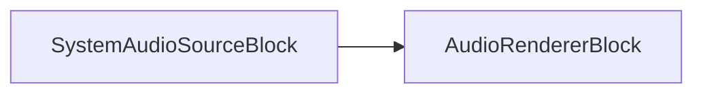

# Bloc de rendu audio : traitement de sortie audio multiplateforme

[Media Blocks SDK .Net](https://www.visioforge.com/media-blocks-sdk-net){ .md-button .md-button--primary target="_blank" }

## Introduction au rendu audio

Le bloc moteur de rendu audio sert de composant critique dans les pipelines de traitement multimédia, permettant aux applications de produire des flux audio vers des périphériques sonores sur de multiples plateformes. Ce bloc polyvalent gère la tâche complexe de conversion des données audio numériques en son audible via les interfaces matérielles appropriées, ce qui en fait un outil essentiel pour les développeurs construisant des applications avec audio.

Le rendu audio nécessite une gestion soigneuse des ressources matérielles, des paramètres de tampon et de la synchronisation temporelle pour garantir une lecture fluide et ininterrompue. Ce bloc abstrait ces complexités et fournit une interface unifiée pour la sortie audio dans divers environnements informatiques.

## Fonctionnalités principales

Le bloc moteur de rendu audio accepte des flux audio non compressés et les envoie soit vers le périphérique audio par défaut, soit vers une alternative sélectionnée par l'utilisateur. Il fournit des contrôles essentiels de lecture audio, notamment :

- Réglage du volume avec contrôle précis en décibels
- Fonctionnalité de mise en sourdine pour un fonctionnement silencieux
- Sélection du périphérique parmi les sorties audio système disponibles
- Paramètres de mise en tampon pour optimiser la latence ou la stabilité

Ces capacités permettent aux développeurs de créer des applications avec une sortie audio de niveau professionnel sans avoir besoin d'implémenter du code spécifique à la plateforme pour chaque système d'exploitation cible.

## Technologie sous-jacente

### Implémentation spécifique à la plateforme

L'`AudioRendererBlock` prend en charge diverses technologies de rendu audio spécifiques à la plateforme. Il peut être configuré pour utiliser un périphérique audio et une API spécifiques (voir la section Gestion des périphériques). Lorsqu'il est instancié à l'aide de son constructeur par défaut (par ex. `new AudioRendererBlock()`), il tente de sélectionner une API audio par défaut appropriée en fonction du système d'exploitation :

- **Windows** : le constructeur par défaut utilise généralement DirectSound. Le bloc prend en charge plusieurs API audio, notamment :
  - DirectSound : fournit une sortie à faible latence avec une large compatibilité
  - WASAPI (Windows Audio Session API) : offre un mode exclusif pour la plus haute qualité
  - ASIO (Audio Stream Input/Output) : audio de qualité professionnelle avec une latence minimale pour le matériel spécialisé
- **macOS** : utilise le framework CoreAudio. Le constructeur par défaut sélectionnera généralement un périphérique basé sur CoreAudio pour :
  - Une sortie audio haute résolution
  - Une intégration native avec le sous-système audio de macOS
  - La prise en charge des audio units et du matériel professionnel
  (Remarque : de même pour macOS, un `OSXAudioSinkBlock` est disponible pour interagir directement avec le puits GStreamer spécifique à la plateforme si nécessaire pour des scénarios spécialisés.)
- **Linux** : implémente ALSA (Advanced Linux Sound Architecture). Le constructeur par défaut sélectionnera généralement un périphérique basé sur ALSA pour :
  - Un accès matériel direct
  - Une prise en charge complète des périphériques
  - Une intégration avec la pile audio Linux
- **iOS** : utilise CoreAudio, optimisé pour le mobile. Le constructeur par défaut sélectionnera généralement un périphérique basé sur CoreAudio, permettant des fonctionnalités telles que :
  - Un rendu économe en énergie
  - Des capacités audio en arrière-plan
  - L'intégration avec la gestion des sessions audio iOS
  (Remarque : pour les développeurs nécessitant un contrôle plus direct sur le puits GStreamer spécifique à iOS ou ayant des cas d'usage avancés, le SDK fournit également `IOSAudioSinkBlock` comme bloc multimédia distinct.)
- **Android** : utilise par défaut OpenSL ES pour fournir :
  - Une sortie audio à faible latence
  - L'accélération matérielle lorsqu'elle est disponible

## OSXAudioSinkBlock : sortie audio macOS directe

L'`OSXAudioSinkBlock` est un bloc multimédia spécifique à la plateforme conçu pour les scénarios avancés où une interaction directe avec le puits audio GStreamer macOS est requise. Ce bloc est utile pour les développeurs qui ont besoin d'un contrôle de bas niveau sur la sortie audio sur les périphériques macOS, comme la sélection personnalisée de périphérique ou l'intégration avec d'autres composants natifs.

### Fonctionnalités clés

- Accès direct au puits audio macOS
- Sélection de périphérique via `DeviceID`
- Adapté aux applications audio spécialisées ou professionnelles sur macOS

### Paramètres : `OSXAudioSinkSettings`

L'`OSXAudioSinkBlock` nécessite un objet `OSXAudioSinkSettings` pour spécifier le périphérique de sortie audio. La classe `OSXAudioSinkSettings` vous permet de définir :

- `DeviceID` : l'ID du périphérique de sortie audio macOS (à partir de 0)

Exemple :

```csharp
using VisioForge.Core.Types.X.Sinks;

// Sélectionner le premier périphérique audio disponible (DeviceID = 0)
var osxSettings = new OSXAudioSinkSettings { DeviceID = 0 };

// Créer le bloc puits audio macOS
var osxAudioSink = new OSXAudioSinkBlock(osxSettings);
```

### Vérification de disponibilité

Vous pouvez vérifier si l'`OSXAudioSinkBlock` est disponible sur la plateforme courante :

```csharp
bool isAvailable = OSXAudioSinkBlock.IsAvailable();
```

### Exemple d'intégration

Voici un exemple minimal d'intégration d'`OSXAudioSinkBlock` dans un pipeline multimédia :

```csharp
var pipeline = new MediaBlocksPipeline();

// Configurer votre bloc source audio selon vos besoins
var audioSourceBlock = new VirtualAudioSourceBlock(new VirtualAudioSourceSettings());

// Définir les paramètres du puits
var osxSettings = new OSXAudioSinkSettings { DeviceID = 0 };
var osxAudioSink = new OSXAudioSinkBlock(osxSettings);

// Connecter la source au puits audio macOS
pipeline.Connect(audioSourceBlock.Output, osxAudioSink.Input);

await pipeline.StartAsync();
```

## IOSAudioSinkBlock : sortie audio iOS directe

L'`IOSAudioSinkBlock` est un bloc multimédia spécifique à la plateforme conçu pour les scénarios avancés où une interaction directe avec le puits audio GStreamer iOS est requise. Ce bloc est utile pour les développeurs qui ont besoin d'un contrôle de bas niveau sur la sortie audio sur les périphériques iOS, comme le routage audio personnalisé, la gestion de formats ou l'intégration avec d'autres composants natifs.

### Fonctionnalités clés

- Accès direct au puits audio GStreamer iOS
- Contrôle fin du format audio, de la fréquence d'échantillonnage et du nombre de canaux
- Adapté aux applications audio spécialisées ou professionnelles sur iOS

### Paramètres : `AudioInfoX`

L'`IOSAudioSinkBlock` nécessite un objet `AudioInfoX` pour spécifier le format audio. La classe `AudioInfoX` vous permet de définir :

- `Format` : le format d'échantillon audio (par ex. `AudioFormatX.S16LE`, `AudioFormatX.F32LE`, etc.)
- `SampleRate` : la fréquence d'échantillonnage en Hz (par ex. 44100, 48000)
- `Channels` : le nombre de canaux audio (par ex. 1 pour mono, 2 pour stéréo)

Exemple :

```csharp
using VisioForge.Core.Types.X;

// Définir le format audio : 16 bits signé little-endian, 44100 Hz, stéréo
var audioInfo = new AudioInfoX(AudioFormatX.S16LE, 44100, 2);

// Créer le bloc puits audio iOS
var iosAudioSink = new IOSAudioSinkBlock(audioInfo);
```

### Vérification de disponibilité

Vous pouvez vérifier si l'`IOSAudioSinkBlock` est disponible sur la plateforme courante :

```csharp
bool isAvailable = IOSAudioSinkBlock.IsAvailable();
```

### Exemple d'intégration

Voici un exemple minimal d'intégration d'`IOSAudioSinkBlock` dans un pipeline multimédia :

```csharp
var pipeline = new MediaBlocksPipeline();

// Configurer votre bloc source audio selon vos besoins
var audioSourceBlock = new VirtualAudioSourceBlock(new VirtualAudioSourceSettings());

// Définir le format audio pour le puits
var audioInfo = new AudioInfoX(AudioFormatX.S16LE, 44100, 2);
var iosAudioSink = new IOSAudioSinkBlock(audioInfo);

// Connecter la source au puits audio iOS
pipeline.Connect(audioSourceBlock.Output, iosAudioSink.Input);

await pipeline.StartAsync();
```

## Spécifications techniques

### Informations sur le bloc

Nom : AudioRendererBlock

| Direction du pin | Type de média | Nombre de pins |
| --- | :---: | :---: |
| Audio en entrée | audio non compressé | 1 |

### Prise en charge des formats audio

Le bloc moteur de rendu audio accepte une large gamme de formats audio non compressés :

- Fréquences d'échantillonnage : 8 kHz à 192 kHz
- Profondeurs de bits : 8 bits, 16 bits, 24 bits et 32 bits (virgule flottante)
- Configurations de canaux : mono, stéréo et multicanal (jusqu'à 7.1 surround)

Cette flexibilité permet aux développeurs de travailler avec tout, des applications vocales basiques aux expériences musicales haute fidélité et audio immersives.

## Gestion des périphériques

### Énumération des périphériques disponibles

Le bloc moteur de rendu audio fournit des méthodes simples pour découvrir et sélectionner parmi les périphériques de sortie audio disponibles sur le système à l'aide de la méthode statique `GetDevicesAsync` :

```csharp
// Obtenir une liste de tous les périphériques de sortie audio sur le système courant
var availableDevices = await AudioRendererBlock.GetDevicesAsync();

// Optionnellement, spécifier l'API à utiliser
var directSoundDevices = await AudioRendererBlock.GetDevicesAsync(AudioOutputDeviceAPI.DirectSound);

// Afficher les informations sur les périphériques
foreach (var device in availableDevices)
{
    Console.WriteLine($"Périphérique : {device.Name}");
}

// Créer un moteur de rendu avec un périphérique spécifique
var audioRenderer = new AudioRendererBlock(availableDevices[0]);
```

### Gestion du périphérique par défaut

Lorsqu'aucun périphérique spécifique n'est sélectionné, le bloc dirige automatiquement l'audio vers le périphérique de sortie par défaut du système. Le constructeur sans paramètre tente de sélectionner un périphérique par défaut approprié en fonction de la plateforme :

```csharp
// Créer avec le périphérique par défaut
var audioRenderer = new AudioRendererBlock();
```

Le bloc surveille également l'état des périphériques, gérant des scénarios tels que :

- La déconnexion du périphérique pendant la lecture
- Les changements de périphérique par défaut par l'utilisateur
- Les changements de format de point de terminaison audio

## Considérations de performance

### Gestion de la latence

La latence du rendu audio est critique pour de nombreuses applications. Le bloc fournit des options de configuration via la propriété `Settings` et un contrôle de synchronisation via la propriété `IsSync` :

```csharp
// Contrôler le comportement de synchronisation
audioRenderer.IsSync = true; // Activer la synchronisation (par défaut)

// Vérifier si une API spécifique est disponible sur cette plateforme
bool isDirectSoundAvailable = AudioRendererBlock.IsAvailable(AudioOutputDeviceAPI.DirectSound);
```

### Contrôle du volume et de la sourdine

L'AudioRendererBlock fournit un contrôle précis du volume et la fonctionnalité de mise en sourdine :

```csharp
// Définir le volume (plage de 0.0 à 1.0)
audioRenderer.Volume = 0.8; // 80 % du volume

// Obtenir le volume courant
double currentVolume = audioRenderer.Volume;

// Activer/désactiver la sourdine
audioRenderer.Mute = true; // Couper l'audio
audioRenderer.Mute = false; // Réactiver l'audio

// Vérifier l'état de sourdine
bool isMuted = audioRenderer.Mute;
```

### Utilisation des ressources

Le bloc moteur de rendu audio est conçu pour l'efficacité, avec des optimisations pour :

- L'utilisation du CPU pendant la lecture
- L'empreinte mémoire pour la gestion des tampons
- La consommation d'énergie sur les appareils mobiles

## Exemples d'intégration

### Configuration de pipeline basique

L'exemple suivant montre comment configurer un pipeline simple de rendu audio à l'aide d'une source audio virtuelle :

```csharp
var pipeline = new MediaBlocksPipeline();

var audioSourceBlock = new VirtualAudioSourceBlock(new VirtualAudioSourceSettings());

// Créer le moteur de rendu audio avec les paramètres par défaut
var audioRenderer = new AudioRendererBlock();
pipeline.Connect(audioSourceBlock.Output, audioRenderer.Input);

await pipeline.StartAsync();
```

### Pipeline audio réel

Pour une application plus pratique, voici comment capturer l'audio système et le restituer :



```csharp
var pipeline = new MediaBlocksPipeline();

// Capturer l'audio système
var systemAudioSource = new SystemAudioSourceBlock();

// Configurer le moteur de rendu audio
var audioRenderer = new AudioRendererBlock();
audioRenderer.Volume = 0.8f; // 80 % du volume

// Connecter les blocs
pipeline.Connect(systemAudioSource.Output, audioRenderer.Input);

// Démarrer le traitement
await pipeline.StartAsync();

// Laisser l'audio jouer pendant 10 secondes
await Task.Delay(TimeSpan.FromSeconds(10));

// Arrêter le pipeline
await pipeline.StopAsync();
```

## Compatibilité et prise en charge des plateformes

Le bloc moteur de rendu audio est conçu pour un fonctionnement multiplateforme, prenant en charge :

- Windows 10 et versions ultérieures
- macOS 10.13 et versions ultérieures
- Linux (Ubuntu, Debian, Fedora)
- iOS 12.0 et versions ultérieures
- Android 8.0 et versions ultérieures

Cette large prise en charge des plateformes permet aux développeurs de créer des expériences audio cohérentes sur différents systèmes d'exploitation et appareils.

## Conclusion

Le bloc moteur de rendu audio offre aux développeurs une solution puissante et flexible pour la sortie audio sur de multiples plateformes. En abstrayant les complexités des API audio spécifiques à chaque plateforme, il leur permet de se concentrer sur la création d'expériences audio exceptionnelles sans se soucier des détails d'implémentation sous-jacents.

Que vous construisiez un simple lecteur multimédia, une application professionnelle de montage audio ou une plateforme de communications en temps réel, le bloc moteur de rendu audio fournit les outils nécessaires pour une sortie audio fiable et de haute qualité.
