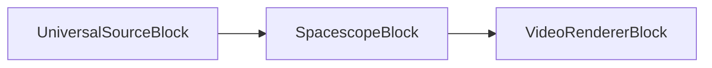
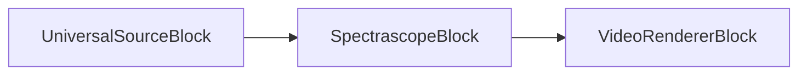
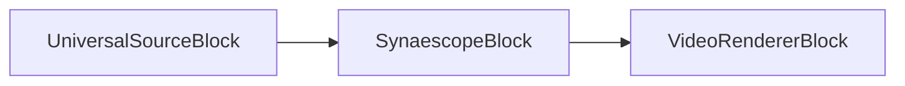
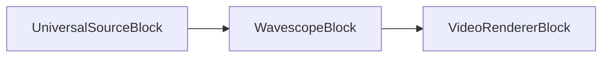

# Bloques de visualizador de audio

[Media Blocks SDK .Net](https://www.visioforge.com/media-blocks-sdk-net){ .md-button .md-button--primary target="_blank" }

VisioForge Media Blocks SDK .Net incluye un conjunto de bloques de visualizador de audio que le permiten crear visualizaciones reactivas al audio para sus aplicaciones. Estos bloques toman entrada de audio y producen salida de video representando las características del audio.

Los bloques pueden conectarse a otros bloques de procesamiento de audio y video para crear pipelines de medios complejos.

La mayoría de los bloques están disponibles para todas las plataformas, incluyendo Windows, Linux, MacOS, Android e iOS.

## Spacescope

El bloque Spacescope es un elemento de visualización de audio simple que mapea los canales de audio izquierdo y derecho a las coordenadas X e Y, respectivamente, creando un patrón similar a Lissajous. Esto visualiza la relación de fase entre los canales. La apariencia, como usar puntos o líneas y colores, puede personalizarse a través de `SpacescopeSettings`.

#### Información del bloque

Nombre: SpacescopeBlock.

Dirección del pin | Tipo de medio | Cantidad de pines
--- | :---: | :---:
Entrada | Audio sin comprimir | 1
Salida | Video | 1

#### Pipeline de ejemplo



#### Código de ejemplo

```csharp
var pipeline = new MediaBlocksPipeline();

var filename = "test.mp3"; // O cualquier fuente de audio
var fileSource = new UniversalSourceBlock(await UniversalSourceSettings.CreateAsync(new Uri(filename)));

// Las configuraciones pueden personalizarse, ej., para shader, grosor de línea, etc.
// El estilo (puntos, líneas, puntos de color, líneas de color) puede establecerse en SpacescopeSettings.
var spacescopeSettings = new SpacescopeSettings(); 
var spacescope = new SpacescopeBlock(spacescopeSettings);
pipeline.Connect(fileSource.AudioOutput, spacescope.Input);

// Asumiendo que tiene un VideoRendererBlock o una forma de mostrar la salida de video
var videoRenderer = new VideoRendererBlock(IntPtr.Zero); // Ejemplo para Windows
pipeline.Connect(spacescope.Output, videoRenderer.Input);

await pipeline.StartAsync();
```

#### Plataformas

Windows, macOS, Linux, iOS, Android.

## Spectrascope

El bloque Spectrascope es un elemento de visualización de espectro simple. Renderiza el espectro de frecuencias de la entrada de audio como una serie de barras.

#### Información del bloque

Nombre: SpectrascopeBlock.

Dirección del pin | Tipo de medio | Cantidad de pines
--- | :---: | :---:
Entrada | Audio sin comprimir | 1
Salida | Video | 1

#### Pipeline de ejemplo



#### Código de ejemplo

```csharp
var pipeline = new MediaBlocksPipeline();

var filename = "test.mp3"; // O cualquier fuente de audio
var fileSource = new UniversalSourceBlock(await UniversalSourceSettings.CreateAsync(new Uri(filename)));

var spectrascope = new SpectrascopeBlock();
pipeline.Connect(fileSource.AudioOutput, spectrascope.Input);

// Asumiendo que tiene un VideoRendererBlock o una forma de mostrar la salida de video
var videoRenderer = new VideoRendererBlock(IntPtr.Zero); // Ejemplo para Windows
pipeline.Connect(spectrascope.Output, videoRenderer.Input);

await pipeline.StartAsync();
```

#### Plataformas

Windows, macOS, Linux, iOS, Android.

## Synaescope

El bloque Synaescope es un elemento de visualización de audio que analiza frecuencias y propiedades fuera de fase del audio. Dibuja este análisis como nubes dinámicas de estrellas, creando patrones coloridos y abstractos.

#### Información del bloque

Nombre: SynaescopeBlock.

Dirección del pin | Tipo de medio | Cantidad de pines
--- | :---: | :---:
Entrada | Audio sin comprimir | 1
Salida | Video | 1

#### Pipeline de ejemplo



#### Código de ejemplo

```csharp
var pipeline = new MediaBlocksPipeline();

var filename = "test.mp3"; // O cualquier fuente de audio
var fileSource = new UniversalSourceBlock(await UniversalSourceSettings.CreateAsync(new Uri(filename)));

// Las configuraciones pueden personalizarse para Synaescope.
// Por ejemplo, para establecer un efecto de shader específico (si está disponible en SynaescopeSettings):
// var synaescopeSettings = new SynaescopeSettings() { Shader = SynaescopeShader.LibVisualCurrent };
// var synaescope = new SynaescopeBlock(synaescopeSettings);
var synaescope = new SynaescopeBlock(); // Configuraciones predeterminadas
pipeline.Connect(fileSource.AudioOutput, synaescope.Input);

// Asumiendo que tiene un VideoRendererBlock o una forma de mostrar la salida de video
var videoRenderer = new VideoRendererBlock(IntPtr.Zero); // Ejemplo para Windows
pipeline.Connect(synaescope.Output, videoRenderer.Input);

await pipeline.StartAsync();
```

#### Plataformas

Windows, macOS, Linux, iOS, Android.

## Wavescope

El bloque Wavescope es un elemento de visualización de audio simple que renderiza las formas de onda de audio, similar a una pantalla de osciloscopio. El estilo de dibujo (puntos, líneas, colores) puede configurarse usando `WavescopeSettings`.

#### Información del bloque

Nombre: WavescopeBlock.

Dirección del pin | Tipo de medio | Cantidad de pines
--- | :---: | :---:
Entrada | Audio sin comprimir | 1
Salida | Video | 1

#### Pipeline de ejemplo



#### Código de ejemplo

```csharp
var pipeline = new MediaBlocksPipeline();

var filename = "test.mp3"; // O cualquier fuente de audio
var fileSource = new UniversalSourceBlock(await UniversalSourceSettings.CreateAsync(new Uri(filename)));

// Las configuraciones pueden personalizarse, ej., para estilo, modo mono/estéreo, etc.
// El estilo (puntos, líneas, puntos de color, líneas de color) puede establecerse en WavescopeSettings.
var wavescopeSettings = new WavescopeSettings(); 
var wavescope = new WavescopeBlock(wavescopeSettings);
pipeline.Connect(fileSource.AudioOutput, wavescope.Input);

// Asumiendo que tiene un VideoRendererBlock o una forma de mostrar la salida de video
var videoRenderer = new VideoRendererBlock(IntPtr.Zero); // Ejemplo para Windows
pipeline.Connect(wavescope.Output, videoRenderer.Input);

await pipeline.StartAsync();
```

#### Plataformas

Windows, macOS, Linux, iOS, Android.

## LibVisual Bumpscope

LibVisual Bumpscope crea un efecto de visualización de osciloscopio con mapa de relieve.

### Información del bloque

Nombre: LibVisualBumpscopeBlock.

| Dirección del pin | Tipo de medio | Cantidad de pines |
| --- | :---: | :---: |
| Entrada de audio | audio sin comprimir | 1 |
| Salida de video | video sin comprimir | 1 |

### Código de ejemplo

```csharp
var pipeline = new MediaBlocksPipeline();

var audioSource = new UniversalSourceBlock(await UniversalSourceSettings.CreateAsync(new Uri("test.mp3")));

var bumpscope = new LibVisualBumpscopeBlock();
pipeline.Connect(audioSource.AudioOutput, bumpscope.Input);

var videoRenderer = new VideoRendererBlock(pipeline, VideoView1);
pipeline.Connect(bumpscope.Output, videoRenderer.Input);

await pipeline.StartAsync();
```

### Plataformas

Windows, macOS, Linux.

## LibVisual Corona

LibVisual Corona crea un efecto de visualización de corona radiante.

### Información del bloque

Nombre: LibVisualCoronaBlock.

| Dirección del pin | Tipo de medio | Cantidad de pines |
| --- | :---: | :---: |
| Entrada de audio | audio sin comprimir | 1 |
| Salida de video | video sin comprimir | 1 |

### Código de ejemplo

```csharp
var pipeline = new MediaBlocksPipeline();

var audioSource = new UniversalSourceBlock(await UniversalSourceSettings.CreateAsync(new Uri("test.mp3")));

var corona = new LibVisualCoronaBlock();
pipeline.Connect(audioSource.AudioOutput, corona.Input);

var videoRenderer = new VideoRendererBlock(pipeline, VideoView1);
pipeline.Connect(corona.Output, videoRenderer.Input);

await pipeline.StartAsync();
```

### Plataformas

Windows, macOS, Linux.

## LibVisual Infinite

LibVisual Infinite crea un efecto de visualización de túnel infinito.

### Información del bloque

Nombre: LibVisualInfiniteBlock.

| Dirección del pin | Tipo de medio | Cantidad de pines |
| --- | :---: | :---: |
| Entrada de audio | audio sin comprimir | 1 |
| Salida de video | video sin comprimir | 1 |

### Código de ejemplo

```csharp
var pipeline = new MediaBlocksPipeline();

var audioSource = new UniversalSourceBlock(await UniversalSourceSettings.CreateAsync(new Uri("test.mp3")));

var infinite = new LibVisualInfiniteBlock();
pipeline.Connect(audioSource.AudioOutput, infinite.Input);

var videoRenderer = new VideoRendererBlock(pipeline, VideoView1);
pipeline.Connect(infinite.Output, videoRenderer.Input);

await pipeline.StartAsync();
```

### Plataformas

Windows, macOS, Linux.

## LibVisual Jakdaw

LibVisual Jakdaw crea un efecto de visualización dinámico.

### Información del bloque

Nombre: LibVisualJakdawBlock.

| Dirección del pin | Tipo de medio | Cantidad de pines |
| --- | :---: | :---: |
| Entrada de audio | audio sin comprimir | 1 |
| Salida de video | video sin comprimir | 1 |

### Código de ejemplo

```csharp
var pipeline = new MediaBlocksPipeline();

var audioSource = new UniversalSourceBlock(await UniversalSourceSettings.CreateAsync(new Uri("test.mp3")));

var jakdaw = new LibVisualJakdawBlock();
pipeline.Connect(audioSource.AudioOutput, jakdaw.Input);

var videoRenderer = new VideoRendererBlock(pipeline, VideoView1);
pipeline.Connect(jakdaw.Output, videoRenderer.Input);

await pipeline.StartAsync();
```

### Plataformas

Windows, macOS, Linux.

## LibVisual Jess

LibVisual Jess crea un efecto de visualización basado en partículas.

### Información del bloque

Nombre: LibVisualJessBlock.

| Dirección del pin | Tipo de medio | Cantidad de pines |
| --- | :---: | :---: |
| Entrada de audio | audio sin comprimir | 1 |
| Salida de video | video sin comprimir | 1 |

### Código de ejemplo

```csharp
var pipeline = new MediaBlocksPipeline();

var audioSource = new UniversalSourceBlock(await UniversalSourceSettings.CreateAsync(new Uri("test.mp3")));

var jess = new LibVisualJessBlock();
pipeline.Connect(audioSource.AudioOutput, jess.Input);

var videoRenderer = new VideoRendererBlock(pipeline, VideoView1);
pipeline.Connect(jess.Output, videoRenderer.Input);

await pipeline.StartAsync();
```

### Plataformas

Windows, macOS, Linux.

## LibVisual LV Analyzer

LibVisual LV Analyzer crea una visualización de analizador de frecuencias.

### Información del bloque

Nombre: LibVisualLVAnalyzerBlock.

| Dirección del pin | Tipo de medio | Cantidad de pines |
| --- | :---: | :---: |
| Entrada de audio | audio sin comprimir | 1 |
| Salida de video | video sin comprimir | 1 |

### Código de ejemplo

```csharp
var pipeline = new MediaBlocksPipeline();

var audioSource = new UniversalSourceBlock(await UniversalSourceSettings.CreateAsync(new Uri("test.mp3")));

var analyzer = new LibVisualLVAnalyzerBlock();
pipeline.Connect(audioSource.AudioOutput, analyzer.Input);

var videoRenderer = new VideoRendererBlock(pipeline, VideoView1);
pipeline.Connect(analyzer.Output, videoRenderer.Input);

await pipeline.StartAsync();
```

### Plataformas

Windows, macOS, Linux.

## LibVisual LV Scope

LibVisual LV Scope crea una visualización de osciloscopio clásico.

### Información del bloque

Nombre: LibVisualLVScopeBlock.

| Dirección del pin | Tipo de medio | Cantidad de pines |
| --- | :---: | :---: |
| Entrada de audio | audio sin comprimir | 1 |
| Salida de video | video sin comprimir | 1 |

### Código de ejemplo

```csharp
var pipeline = new MediaBlocksPipeline();

var audioSource = new UniversalSourceBlock(await UniversalSourceSettings.CreateAsync(new Uri("test.mp3")));

var scope = new LibVisualLVScopeBlock();
pipeline.Connect(audioSource.AudioOutput, scope.Input);

var videoRenderer = new VideoRendererBlock(pipeline, VideoView1);
pipeline.Connect(scope.Output, videoRenderer.Input);

await pipeline.StartAsync();
```

### Plataformas

Windows, macOS, Linux.

## LibVisual Oinksie

LibVisual Oinksie crea un efecto de visualización juguetón.

### Información del bloque

Nombre: LibVisualOinksieBlock.

| Dirección del pin | Tipo de medio | Cantidad de pines |
| --- | :---: | :---: |
| Entrada de audio | audio sin comprimir | 1 |
| Salida de video | video sin comprimir | 1 |

### Código de ejemplo

```csharp
var pipeline = new MediaBlocksPipeline();

var audioSource = new UniversalSourceBlock(await UniversalSourceSettings.CreateAsync(new Uri("test.mp3")));

var oinksie = new LibVisualOinksieBlock();
pipeline.Connect(audioSource.AudioOutput, oinksie.Input);

var videoRenderer = new VideoRendererBlock(pipeline, VideoView1);
pipeline.Connect(oinksie.Output, videoRenderer.Input);

await pipeline.StartAsync();
```

### Plataformas

Windows, macOS, Linux.
