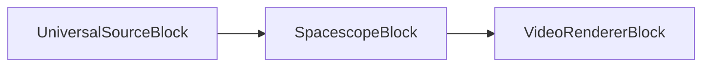
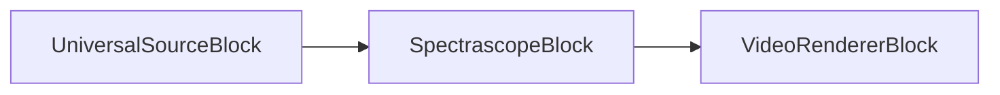
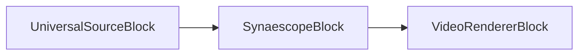
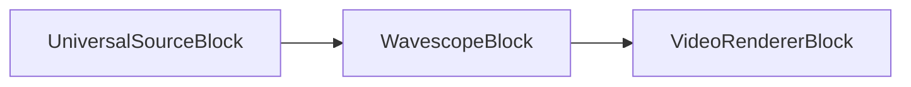

# Blocs de visualiseurs audio

[Media Blocks SDK .Net](https://www.visioforge.com/media-blocks-sdk-net){ .md-button .md-button--primary target="_blank" }

VisioForge Media Blocks SDK .Net inclut un ensemble de blocs de visualiseurs audio qui vous permettent de créer des visualisations audio-réactives pour vos applications. Ces blocs prennent une entrée audio et produisent une sortie vidéo représentant les caractéristiques audio.

Les blocs peuvent être connectés à d'autres blocs de traitement audio et vidéo pour créer des pipelines multimédias complexes.

La plupart des blocs sont disponibles sur toutes les plateformes, y compris Windows, Linux, MacOS, Android et iOS.

## Spacescope

Le bloc Spacescope est un élément simple de visualisation audio qui mappe les canaux audio gauche et droit aux coordonnées X et Y, respectivement, créant un motif de type Lissajous. Cela visualise la relation de phase entre les canaux. L'apparence, telle que l'utilisation de points ou de lignes et de couleurs, peut être personnalisée via `SpacescopeSettings`.

#### Informations sur le bloc

Nom : SpacescopeBlock.

Direction du pin | Type de média | Nombre de pins
--- | :---: | :---:
Entrée | Audio non compressé | 1
Sortie | Vidéo | 1

#### Exemple de pipeline



#### Exemple de code

```csharp
var pipeline = new MediaBlocksPipeline();

var filename = "test.mp3"; // Ou toute source audio
var fileSource = new UniversalSourceBlock(await UniversalSourceSettings.CreateAsync(new Uri(filename)));

// Les paramètres peuvent être personnalisés, par ex. pour le shader, l'épaisseur de ligne, etc.
// Le style (points, lignes, points colorés, lignes colorées) peut être défini dans SpacescopeSettings.
var spacescopeSettings = new SpacescopeSettings(); 
var spacescope = new SpacescopeBlock(spacescopeSettings);
pipeline.Connect(fileSource.AudioOutput, spacescope.Input);

// En supposant que vous avez un VideoRendererBlock ou un moyen d'afficher la sortie vidéo
var videoRenderer = new VideoRendererBlock(pipeline, VideoView1);
pipeline.Connect(spacescope.Output, videoRenderer.Input);

await pipeline.StartAsync();
```

#### Plateformes

Windows, macOS, Linux, iOS, Android.

## Spectrascope

Le bloc Spectrascope est un élément simple de visualisation du spectre. Il fait le rendu du spectre de fréquences de l'entrée audio sous forme d'une série de barres.

#### Informations sur le bloc

Nom : SpectrascopeBlock.

Direction du pin | Type de média | Nombre de pins
--- | :---: | :---:
Entrée | Audio non compressé | 1
Sortie | Vidéo | 1

#### Exemple de pipeline



#### Exemple de code

```csharp
var pipeline = new MediaBlocksPipeline();

var filename = "test.mp3"; // Ou toute source audio
var fileSource = new UniversalSourceBlock(await UniversalSourceSettings.CreateAsync(new Uri(filename)));

var spectrascope = new SpectrascopeBlock();
pipeline.Connect(fileSource.AudioOutput, spectrascope.Input);

// En supposant que vous avez un VideoRendererBlock ou un moyen d'afficher la sortie vidéo
var videoRenderer = new VideoRendererBlock(pipeline, VideoView1);
pipeline.Connect(spectrascope.Output, videoRenderer.Input);

await pipeline.StartAsync();
```

#### Plateformes

Windows, macOS, Linux, iOS, Android.

## Synaescope

Le bloc Synaescope est un élément de visualisation audio qui analyse les fréquences et les propriétés hors phase de l'audio. Il dessine cette analyse sous forme de nuages dynamiques d'étoiles, créant des motifs colorés et abstraits.

#### Informations sur le bloc

Nom : SynaescopeBlock.

Direction du pin | Type de média | Nombre de pins
--- | :---: | :---:
Entrée | Audio non compressé | 1
Sortie | Vidéo | 1

#### Exemple de pipeline



#### Exemple de code

```csharp
var pipeline = new MediaBlocksPipeline();

var filename = "test.mp3"; // Ou toute source audio
var fileSource = new UniversalSourceBlock(await UniversalSourceSettings.CreateAsync(new Uri(filename)));

// SynaescopeBlock utilise les valeurs par défaut de GStreamer — il n'y a pas de classe de paramètres sur la surface managée.
var synaescope = new SynaescopeBlock();
pipeline.Connect(fileSource.AudioOutput, synaescope.Input);

// En supposant que vous avez un VideoRendererBlock ou un moyen d'afficher la sortie vidéo
var videoRenderer = new VideoRendererBlock(pipeline, VideoView1);
pipeline.Connect(synaescope.Output, videoRenderer.Input);

await pipeline.StartAsync();
```

#### Plateformes

Windows, macOS, Linux, iOS, Android.

## Wavescope

Le bloc Wavescope est un élément simple de visualisation audio qui fait le rendu des formes d'onde audio, à la manière d'un affichage oscilloscope. Le style de dessin (points, lignes, couleurs) peut être configuré à l'aide de `WavescopeSettings`.

#### Informations sur le bloc

Nom : WavescopeBlock.

Direction du pin | Type de média | Nombre de pins
--- | :---: | :---:
Entrée | Audio non compressé | 1
Sortie | Vidéo | 1

#### Exemple de pipeline



#### Exemple de code

```csharp
var pipeline = new MediaBlocksPipeline();

var filename = "test.mp3"; // Ou toute source audio
var fileSource = new UniversalSourceBlock(await UniversalSourceSettings.CreateAsync(new Uri(filename)));

// Les paramètres peuvent être personnalisés, par ex. pour le style, le mode mono/stéréo, etc.
// Le style (points, lignes, points colorés, lignes colorées) peut être défini dans WavescopeSettings.
var wavescopeSettings = new WavescopeSettings(); 
var wavescope = new WavescopeBlock(wavescopeSettings);
pipeline.Connect(fileSource.AudioOutput, wavescope.Input);

// En supposant que vous avez un VideoRendererBlock ou un moyen d'afficher la sortie vidéo
var videoRenderer = new VideoRendererBlock(pipeline, VideoView1);
pipeline.Connect(wavescope.Output, videoRenderer.Input);

await pipeline.StartAsync();
```

#### Plateformes

Windows, macOS, Linux, iOS, Android.

## LibVisual Bumpscope

LibVisual Bumpscope crée un effet de visualisation d'oscilloscope avec bump mapping.

### Informations sur le bloc

Nom : LibVisualBumpscopeBlock.

| Direction du pin | Type de média | Nombre de pins |
| --- | :---: | :---: |
| Audio en entrée | audio non compressé | 1 |
| Vidéo en sortie | vidéo non compressée | 1 |

### Exemple de code

```csharp
var pipeline = new MediaBlocksPipeline();

var audioSource = new UniversalSourceBlock(await UniversalSourceSettings.CreateAsync(new Uri("test.mp3")));

var bumpscope = new LibVisualBumpscopeBlock();
pipeline.Connect(audioSource.AudioOutput, bumpscope.Input);

var videoRenderer = new VideoRendererBlock(pipeline, VideoView1);
pipeline.Connect(bumpscope.Output, videoRenderer.Input);

await pipeline.StartAsync();
```

### Plateformes

Windows, macOS, Linux.

## LibVisual Corona

LibVisual Corona crée un effet de visualisation de couronne radiante.

### Informations sur le bloc

Nom : LibVisualCoronaBlock.

| Direction du pin | Type de média | Nombre de pins |
| --- | :---: | :---: |
| Audio en entrée | audio non compressé | 1 |
| Vidéo en sortie | vidéo non compressée | 1 |

### Exemple de code

```csharp
var pipeline = new MediaBlocksPipeline();

var audioSource = new UniversalSourceBlock(await UniversalSourceSettings.CreateAsync(new Uri("test.mp3")));

var corona = new LibVisualCoronaBlock();
pipeline.Connect(audioSource.AudioOutput, corona.Input);

var videoRenderer = new VideoRendererBlock(pipeline, VideoView1);
pipeline.Connect(corona.Output, videoRenderer.Input);

await pipeline.StartAsync();
```

### Plateformes

Windows, macOS, Linux.

## LibVisual Infinite

LibVisual Infinite crée un effet de visualisation de tunnel infini.

### Informations sur le bloc

Nom : LibVisualInfiniteBlock.

| Direction du pin | Type de média | Nombre de pins |
| --- | :---: | :---: |
| Audio en entrée | audio non compressé | 1 |
| Vidéo en sortie | vidéo non compressée | 1 |

### Exemple de code

```csharp
var pipeline = new MediaBlocksPipeline();

var audioSource = new UniversalSourceBlock(await UniversalSourceSettings.CreateAsync(new Uri("test.mp3")));

var infinite = new LibVisualInfiniteBlock();
pipeline.Connect(audioSource.AudioOutput, infinite.Input);

var videoRenderer = new VideoRendererBlock(pipeline, VideoView1);
pipeline.Connect(infinite.Output, videoRenderer.Input);

await pipeline.StartAsync();
```

### Plateformes

Windows, macOS, Linux.

## LibVisual Jakdaw

LibVisual Jakdaw crée un effet de visualisation dynamique.

### Informations sur le bloc

Nom : LibVisualJakdawBlock.

| Direction du pin | Type de média | Nombre de pins |
| --- | :---: | :---: |
| Audio en entrée | audio non compressé | 1 |
| Vidéo en sortie | vidéo non compressée | 1 |

### Exemple de code

```csharp
var pipeline = new MediaBlocksPipeline();

var audioSource = new UniversalSourceBlock(await UniversalSourceSettings.CreateAsync(new Uri("test.mp3")));

var jakdaw = new LibVisualJakdawBlock();
pipeline.Connect(audioSource.AudioOutput, jakdaw.Input);

var videoRenderer = new VideoRendererBlock(pipeline, VideoView1);
pipeline.Connect(jakdaw.Output, videoRenderer.Input);

await pipeline.StartAsync();
```

### Plateformes

Windows, macOS, Linux.

## LibVisual Jess

LibVisual Jess crée un effet de visualisation basé sur des particules.

### Informations sur le bloc

Nom : LibVisualJessBlock.

| Direction du pin | Type de média | Nombre de pins |
| --- | :---: | :---: |
| Audio en entrée | audio non compressé | 1 |
| Vidéo en sortie | vidéo non compressée | 1 |

### Exemple de code

```csharp
var pipeline = new MediaBlocksPipeline();

var audioSource = new UniversalSourceBlock(await UniversalSourceSettings.CreateAsync(new Uri("test.mp3")));

var jess = new LibVisualJessBlock();
pipeline.Connect(audioSource.AudioOutput, jess.Input);

var videoRenderer = new VideoRendererBlock(pipeline, VideoView1);
pipeline.Connect(jess.Output, videoRenderer.Input);

await pipeline.StartAsync();
```

### Plateformes

Windows, macOS, Linux.

## LibVisual LV Analyzer

LibVisual LV Analyzer crée une visualisation analyseur de fréquences.

### Informations sur le bloc

Nom : LibVisualLVAnalyzerBlock.

| Direction du pin | Type de média | Nombre de pins |
| --- | :---: | :---: |
| Audio en entrée | audio non compressé | 1 |
| Vidéo en sortie | vidéo non compressée | 1 |

### Exemple de code

```csharp
var pipeline = new MediaBlocksPipeline();

var audioSource = new UniversalSourceBlock(await UniversalSourceSettings.CreateAsync(new Uri("test.mp3")));

var analyzer = new LibVisualLVAnalyzerBlock();
pipeline.Connect(audioSource.AudioOutput, analyzer.Input);

var videoRenderer = new VideoRendererBlock(pipeline, VideoView1);
pipeline.Connect(analyzer.Output, videoRenderer.Input);

await pipeline.StartAsync();
```

### Plateformes

Windows, macOS, Linux.

## LibVisual LV Scope

LibVisual LV Scope crée une visualisation d'oscilloscope classique.

### Informations sur le bloc

Nom : LibVisualLVScopeBlock.

| Direction du pin | Type de média | Nombre de pins |
| --- | :---: | :---: |
| Audio en entrée | audio non compressé | 1 |
| Vidéo en sortie | vidéo non compressée | 1 |

### Exemple de code

```csharp
var pipeline = new MediaBlocksPipeline();

var audioSource = new UniversalSourceBlock(await UniversalSourceSettings.CreateAsync(new Uri("test.mp3")));

var scope = new LibVisualLVScopeBlock();
pipeline.Connect(audioSource.AudioOutput, scope.Input);

var videoRenderer = new VideoRendererBlock(pipeline, VideoView1);
pipeline.Connect(scope.Output, videoRenderer.Input);

await pipeline.StartAsync();
```

### Plateformes

Windows, macOS, Linux.

## LibVisual Oinksie

LibVisual Oinksie crée un effet de visualisation ludique.

### Informations sur le bloc

Nom : LibVisualOinksieBlock.

| Direction du pin | Type de média | Nombre de pins |
| --- | :---: | :---: |
| Audio en entrée | audio non compressé | 1 |
| Vidéo en sortie | vidéo non compressée | 1 |

### Exemple de code

```csharp
var pipeline = new MediaBlocksPipeline();

var audioSource = new UniversalSourceBlock(await UniversalSourceSettings.CreateAsync(new Uri("test.mp3")));

var oinksie = new LibVisualOinksieBlock();
pipeline.Connect(audioSource.AudioOutput, oinksie.Input);

var videoRenderer = new VideoRendererBlock(pipeline, VideoView1);
pipeline.Connect(oinksie.Output, videoRenderer.Input);

await pipeline.StartAsync();
```

### Plateformes

Windows, macOS, Linux.
