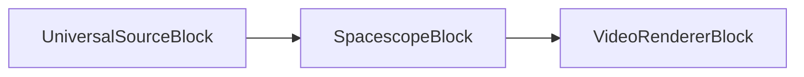
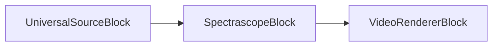
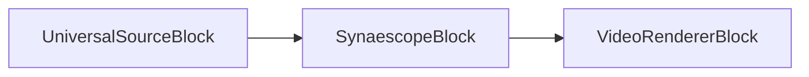
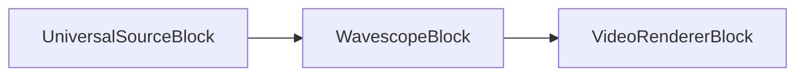

# Audio visualizer blocks

[Media Blocks SDK .Net](https://www.visioforge.com/media-blocks-sdk-net){ .md-button .md-button--primary target="_blank" }

VisioForge Media Blocks SDK .Net includes a set of audio visualizer blocks that allow you to create audio-reactive visualizations for your applications. These blocks take audio input and produce video output representing the audio characteristics.

The blocks can be connected to other audio and video processing blocks to create complex media pipelines.

Most of the blocks are available for all platforms, including Windows, Linux, MacOS, Android, and iOS.

## Spacescope

The Spacescope block is a simple audio visualization element that maps the left and right audio channels to X and Y coordinates, respectively, creating a Lissajous-like pattern. This visualizes the phase relationship between the channels. The appearance, such as using dots or lines and colors, can be customized via `SpacescopeSettings`.

#### Block info

Name: SpacescopeBlock.

Pin direction | Media type | Pins count
--- | :---: | :---:
Input | Uncompressed audio | 1
Output | Video | 1

#### The sample pipeline



#### Sample code

```csharp
var pipeline = new MediaBlocksPipeline();

var filename = "test.mp3"; // Or any audio source
var fileSource = new UniversalSourceBlock(await UniversalSourceSettings.CreateAsync(new Uri(filename)));

// Settings can be customized, e.g., for shader, line thickness, etc.
// The style (dots, lines, color-dots, color-lines) can be set in SpacescopeSettings.
var spacescopeSettings = new SpacescopeSettings(); 
var spacescope = new SpacescopeBlock(spacescopeSettings);
pipeline.Connect(fileSource.AudioOutput, spacescope.Input);

// Assuming you have a VideoRendererBlock or a way to display video output
var videoRenderer = new VideoRendererBlock(IntPtr.Zero); // Example for Windows
pipeline.Connect(spacescope.Output, videoRenderer.Input);

await pipeline.StartAsync();
```

#### Platforms

Windows, macOS, Linux, iOS, Android.

## Spectrascope

The Spectrascope block is a simple spectrum visualization element. It renders the frequency spectrum of the audio input as a series of bars.

#### Block info

Name: SpectrascopeBlock.

Pin direction | Media type | Pins count
--- | :---: | :---:
Input | Uncompressed audio | 1
Output | Video | 1

#### The sample pipeline



#### Sample code

```csharp
var pipeline = new MediaBlocksPipeline();

var filename = "test.mp3"; // Or any audio source
var fileSource = new UniversalSourceBlock(await UniversalSourceSettings.CreateAsync(new Uri(filename)));

var spectrascope = new SpectrascopeBlock();
pipeline.Connect(fileSource.AudioOutput, spectrascope.Input);

// Assuming you have a VideoRendererBlock or a way to display video output
var videoRenderer = new VideoRendererBlock(IntPtr.Zero); // Example for Windows
pipeline.Connect(spectrascope.Output, videoRenderer.Input);

await pipeline.StartAsync();
```

#### Platforms

Windows, macOS, Linux, iOS, Android.

## Synaescope

The Synaescope block is an audio visualization element that analyzes frequencies and out-of-phase properties of the audio. It draws this analysis as dynamic clouds of stars, creating colorful and abstract patterns.

#### Block info

Name: SynaescopeBlock.

Pin direction | Media type | Pins count
--- | :---: | :---:
Input | Uncompressed audio | 1
Output | Video | 1

#### The sample pipeline



#### Sample code

```csharp
var pipeline = new MediaBlocksPipeline();

var filename = "test.mp3"; // Or any audio source
var fileSource = new UniversalSourceBlock(await UniversalSourceSettings.CreateAsync(new Uri(filename)));

// Settings can be customized for Synaescope.
// For example, to set a specific shader effect (if available in SynaescopeSettings):
// var synaescopeSettings = new SynaescopeSettings() { Shader = SynaescopeShader.LibVisualCurrent };
// var synaescope = new SynaescopeBlock(synaescopeSettings);
var synaescope = new SynaescopeBlock(); // Default settings
pipeline.Connect(fileSource.AudioOutput, synaescope.Input);

// Assuming you have a VideoRendererBlock or a way to display video output
var videoRenderer = new VideoRendererBlock(IntPtr.Zero); // Example for Windows
pipeline.Connect(synaescope.Output, videoRenderer.Input);

await pipeline.StartAsync();
```

#### Platforms

Windows, macOS, Linux, iOS, Android.

## Wavescope

The Wavescope block is a simple audio visualization element that renders the audio waveforms, similar to an oscilloscope display. The drawing style (dots, lines, colors) can be configured using `WavescopeSettings`.

#### Block info

Name: WavescopeBlock.

Pin direction | Media type | Pins count
--- | :---: | :---:
Input | Uncompressed audio | 1
Output | Video | 1

#### The sample pipeline



#### Sample code

```csharp
var pipeline = new MediaBlocksPipeline();

var filename = "test.mp3"; // Or any audio source
var fileSource = new UniversalSourceBlock(await UniversalSourceSettings.CreateAsync(new Uri(filename)));

// Settings can be customized, e.g., for style, mono/stereo mode, etc.
// The style (dots, lines, color-dots, color-lines) can be set in WavescopeSettings.
var wavescopeSettings = new WavescopeSettings(); 
var wavescope = new WavescopeBlock(wavescopeSettings);
pipeline.Connect(fileSource.AudioOutput, wavescope.Input);

// Assuming you have a VideoRendererBlock or a way to display video output
var videoRenderer = new VideoRendererBlock(IntPtr.Zero); // Example for Windows
pipeline.Connect(wavescope.Output, videoRenderer.Input);

await pipeline.StartAsync();
```

#### Platforms

Windows, macOS, Linux, iOS, Android.

## LibVisual Bumpscope

LibVisual Bumpscope creates a bumpmapped oscilloscope visualization effect.

### Block info

Name: LibVisualBumpscopeBlock.

| Pin direction | Media type | Pins count |
| --- | :---: | :---: |
| Input audio | uncompressed audio | 1 |
| Output video | uncompressed video | 1 |

### Sample code

```csharp
var pipeline = new MediaBlocksPipeline();

var audioSource = new UniversalSourceBlock(await UniversalSourceSettings.CreateAsync(new Uri("test.mp3")));

var bumpscope = new LibVisualBumpscopeBlock();
pipeline.Connect(audioSource.AudioOutput, bumpscope.Input);

var videoRenderer = new VideoRendererBlock(pipeline, VideoView1);
pipeline.Connect(bumpscope.Output, videoRenderer.Input);

await pipeline.StartAsync();
```

### Platforms

Windows, macOS, Linux.

## LibVisual Corona

LibVisual Corona creates a radiant corona visualization effect.

### Block info

Name: LibVisualCoronaBlock.

| Pin direction | Media type | Pins count |
| --- | :---: | :---: |
| Input audio | uncompressed audio | 1 |
| Output video | uncompressed video | 1 |

### Sample code

```csharp
var pipeline = new MediaBlocksPipeline();

var audioSource = new UniversalSourceBlock(await UniversalSourceSettings.CreateAsync(new Uri("test.mp3")));

var corona = new LibVisualCoronaBlock();
pipeline.Connect(audioSource.AudioOutput, corona.Input);

var videoRenderer = new VideoRendererBlock(pipeline, VideoView1);
pipeline.Connect(corona.Output, videoRenderer.Input);

await pipeline.StartAsync();
```

### Platforms

Windows, macOS, Linux.

## LibVisual Infinite

LibVisual Infinite creates an infinite tunnel visualization effect.

### Block info

Name: LibVisualInfiniteBlock.

| Pin direction | Media type | Pins count |
| --- | :---: | :---: |
| Input audio | uncompressed audio | 1 |
| Output video | uncompressed video | 1 |

### Sample code

```csharp
var pipeline = new MediaBlocksPipeline();

var audioSource = new UniversalSourceBlock(await UniversalSourceSettings.CreateAsync(new Uri("test.mp3")));

var infinite = new LibVisualInfiniteBlock();
pipeline.Connect(audioSource.AudioOutput, infinite.Input);

var videoRenderer = new VideoRendererBlock(pipeline, VideoView1);
pipeline.Connect(infinite.Output, videoRenderer.Input);

await pipeline.StartAsync();
```

### Platforms

Windows, macOS, Linux.

## LibVisual Jakdaw

LibVisual Jakdaw creates a dynamic visualization effect.

### Block info

Name: LibVisualJakdawBlock.

| Pin direction | Media type | Pins count |
| --- | :---: | :---: |
| Input audio | uncompressed audio | 1 |
| Output video | uncompressed video | 1 |

### Sample code

```csharp
var pipeline = new MediaBlocksPipeline();

var audioSource = new UniversalSourceBlock(await UniversalSourceSettings.CreateAsync(new Uri("test.mp3")));

var jakdaw = new LibVisualJakdawBlock();
pipeline.Connect(audioSource.AudioOutput, jakdaw.Input);

var videoRenderer = new VideoRendererBlock(pipeline, VideoView1);
pipeline.Connect(jakdaw.Output, videoRenderer.Input);

await pipeline.StartAsync();
```

### Platforms

Windows, macOS, Linux.

## LibVisual Jess

LibVisual Jess creates a particle-based visualization effect.

### Block info

Name: LibVisualJessBlock.

| Pin direction | Media type | Pins count |
| --- | :---: | :---: |
| Input audio | uncompressed audio | 1 |
| Output video | uncompressed video | 1 |

### Sample code

```csharp
var pipeline = new MediaBlocksPipeline();

var audioSource = new UniversalSourceBlock(await UniversalSourceSettings.CreateAsync(new Uri("test.mp3")));

var jess = new LibVisualJessBlock();
pipeline.Connect(audioSource.AudioOutput, jess.Input);

var videoRenderer = new VideoRendererBlock(pipeline, VideoView1);
pipeline.Connect(jess.Output, videoRenderer.Input);

await pipeline.StartAsync();
```

### Platforms

Windows, macOS, Linux.

## LibVisual LV Analyzer

LibVisual LV Analyzer creates a frequency analyzer visualization.

### Block info

Name: LibVisualLVAnalyzerBlock.

| Pin direction | Media type | Pins count |
| --- | :---: | :---: |
| Input audio | uncompressed audio | 1 |
| Output video | uncompressed video | 1 |

### Sample code

```csharp
var pipeline = new MediaBlocksPipeline();

var audioSource = new UniversalSourceBlock(await UniversalSourceSettings.CreateAsync(new Uri("test.mp3")));

var analyzer = new LibVisualLVAnalyzerBlock();
pipeline.Connect(audioSource.AudioOutput, analyzer.Input);

var videoRenderer = new VideoRendererBlock(pipeline, VideoView1);
pipeline.Connect(analyzer.Output, videoRenderer.Input);

await pipeline.StartAsync();
```

### Platforms

Windows, macOS, Linux.

## LibVisual LV Scope

LibVisual LV Scope creates a classic oscilloscope visualization.

### Block info

Name: LibVisualLVScopeBlock.

| Pin direction | Media type | Pins count |
| --- | :---: | :---: |
| Input audio | uncompressed audio | 1 |
| Output video | uncompressed video | 1 |

### Sample code

```csharp
var pipeline = new MediaBlocksPipeline();

var audioSource = new UniversalSourceBlock(await UniversalSourceSettings.CreateAsync(new Uri("test.mp3")));

var scope = new LibVisualLVScopeBlock();
pipeline.Connect(audioSource.AudioOutput, scope.Input);

var videoRenderer = new VideoRendererBlock(pipeline, VideoView1);
pipeline.Connect(scope.Output, videoRenderer.Input);

await pipeline.StartAsync();
```

### Platforms

Windows, macOS, Linux.

## LibVisual Oinksie

LibVisual Oinksie creates a playful visualization effect.

### Block info

Name: LibVisualOinksieBlock.

| Pin direction | Media type | Pins count |
| --- | :---: | :---: |
| Input audio | uncompressed audio | 1 |
| Output video | uncompressed video | 1 |

### Sample code

```csharp
var pipeline = new MediaBlocksPipeline();

var audioSource = new UniversalSourceBlock(await UniversalSourceSettings.CreateAsync(new Uri("test.mp3")));

var oinksie = new LibVisualOinksieBlock();
pipeline.Connect(audioSource.AudioOutput, oinksie.Input);

var videoRenderer = new VideoRendererBlock(pipeline, VideoView1);
pipeline.Connect(oinksie.Output, videoRenderer.Input);

await pipeline.StartAsync();
```

### Platforms

Windows, macOS, Linux.
