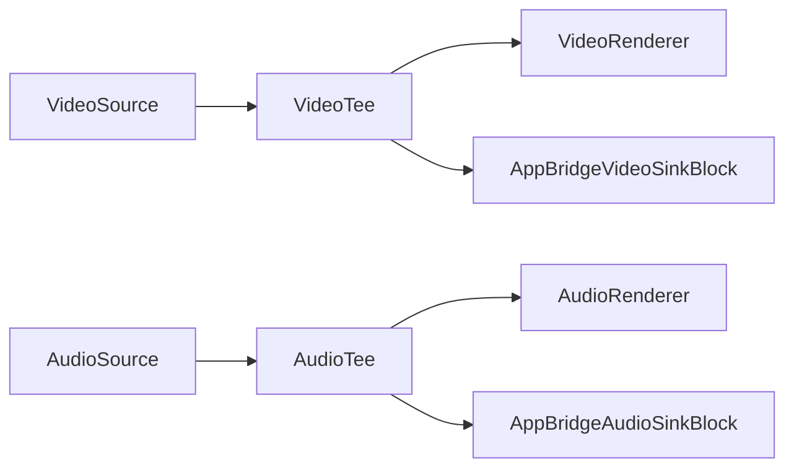
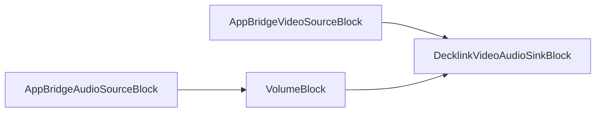

# Bloques Bridge

[Media Blocks SDK .Net](https://www.visioforge.com/media-blocks-sdk-net){ .md-button .md-button--primary target="_blank" }

Los bridges pueden usarse para enlazar dos pipelines y cambiar dinámicamente entre ellos. Por ejemplo, puede cambiar entre diferentes archivos o cámaras en el primer Pipeline sin interrumpir el streaming en el segundo Pipeline.

Para enlazar fuente y sink, deles el mismo nombre. Cada par de bridge tiene un nombre de canal único.

## Bridge audio sink y source

Los bridges pueden usarse para conectar diferentes pipelines de medios y usarlos independientemente. `BridgeAudioSourceBlock` se usa para conectarse a `BridgeAudioSinkBlock` y soporta audio sin comprimir.

### Información del bloque

#### Información de BridgeAudioSourceBlock

| Dirección del pin | Tipo de medio | Cantidad de pines |
| --- | :---: | :---: |
| Salida de audio | audio sin comprimir | 1 |

#### Información de BridgeAudioSinkBlock

| Dirección del pin | Tipo de medio | Cantidad de pines |
| --- | :---: | :---: |
| Entrada de audio | audio sin comprimir | 1 |

### Pipelines de ejemplo

#### Primer pipeline con una fuente de audio y un bridge audio sink


#### Segundo pipeline con un bridge audio source y un renderizador de audio


### Código de ejemplo

El pipeline fuente con fuente de audio virtual y bridge audio sink.

```csharp
// crear pipeline fuente
var sourcePipeline = new MediaBlocksPipeline();

// crear fuente de audio virtual y bridge audio sink
var audioSourceBlock = new VirtualAudioSourceBlock(new VirtualAudioSourceSettings());
var bridgeAudioSink = new BridgeAudioSinkBlock(new BridgeAudioSinkSettings());

// conectar fuente y sink
sourcePipeline.Connect(audioSourceBlock.Output, bridgeAudioSink.Input);

// iniciar pipeline
await sourcePipeline.StartAsync();
```

El pipeline sink con bridge audio source y renderizador de audio.

```csharp
// crear pipeline sink
var sinkPipeline = new MediaBlocksPipeline();

// crear bridge audio source y renderizador de audio
var bridgeAudioSource = new BridgeAudioSourceBlock(new BridgeAudioSourceSettings());
var audioRenderer = new AudioRendererBlock();

// conectar fuente y sink
sinkPipeline.Connect(bridgeAudioSource.Output, audioRenderer.Input);

// iniciar pipeline
await sinkPipeline.StartAsync();
```

## Bridge video sink y source

Los bridges pueden usarse para conectar diferentes pipelines de medios y usarlos independientemente. `BridgeVideoSinkBlock` se usa para conectarse al `BridgeVideoSourceBlock` y soporta video sin comprimir.

### Información de los bloques

#### Información de BridgeVideoSinkBlock

| Dirección del pin | Tipo de medio | Cantidad de pines |
| --- | :---: | :---: |
| Entrada de video | video sin comprimir | 1 |

#### Información de BridgeVideoSourceBlock

| Dirección del pin | Tipo de medio | Cantidad de pines |
| --- | :---: | :---: |
| Salida de video | video sin comprimir | 1 |

### Pipelines de ejemplo

#### Primer pipeline con una fuente de video y un bridge video sink


#### Segundo pipeline con un bridge video source y un renderizador de video


### Código de ejemplo

Pipeline fuente con una fuente de video virtual y bridge video sink.

```csharp
// crear pipeline fuente
var sourcePipeline = new MediaBlocksPipeline();

// crear fuente de video virtual y bridge video sink
var videoSourceBlock = new VirtualVideoSourceBlock(new VirtualVideoSourceSettings());
var bridgeVideoSink = new BridgeVideoSinkBlock(new BridgeVideoSinkSettings());

// conectar fuente y sink
sourcePipeline.Connect(videoSourceBlock.Output, bridgeVideoSink.Input);

// iniciar pipeline
await sourcePipeline.StartAsync();
```

Pipeline sink con un bridge video source y renderizador de video.

```csharp
// crear pipeline sink
var sinkPipeline = new MediaBlocksPipeline();

// crear bridge video source y renderizador de video
var bridgeVideoSource = new BridgeVideoSourceBlock(new BridgeVideoSourceSettings());
var videoRenderer = new VideoRendererBlock(sinkPipeline, VideoView1);

// conectar fuente y sink
sinkPipeline.Connect(bridgeVideoSource.Output, videoRenderer.Input);

// iniciar pipeline
await sinkPipeline.StartAsync();
```

## Bridge subtitle sink y source

Los bridges pueden usarse para conectar diferentes pipelines de medios y usarlos independientemente. `BridgeSubtitleSourceBlock` se usa para conectarse al `BridgeSubtitleSinkBlock` y soporta tipo de medio de texto.

### Información del bloque

#### Información de BridgeSubtitleSourceBlock

| Dirección del pin | Tipo de medio | Cantidad de pines |
| --- | :---: | :---: |
| Salida de video | texto | 1 |

#### Información de BridgeSubtitleSinkBlock

| Dirección del pin | Tipo de medio | Cantidad de pines |
| --- | :---: | :---: |
| Salida de video | texto | 1 |

## Proxy source

El par de bloques proxy source/proxy sink puede usarse para conectar diferentes pipelines de medios y usarlos independientemente.

### Información del bloque

Nombre: ProxySourceBlock.

| Dirección del pin | Tipo de medio | Cantidad de pines |
| --- | :---: | :---: |
| Salida | Cualquier sin comprimir | 1 |

### Pipelines de ejemplo

#### Primer pipeline con una fuente de video y un proxy video sink


#### Segundo pipeline con un proxy video source y un renderizador de video


### Código de ejemplo

```csharp
// pipeline fuente con fuente de video virtual y proxy sink
var sourcePipeline = new MediaBlocksPipeline();
var videoSourceBlock = new VirtualVideoSourceBlock(new VirtualVideoSourceSettings());
var proxyVideoSink = new ProxySinkBlock();
sourcePipeline.Connect(videoSourceBlock.Output, proxyVideoSink.Input);

// pipeline sink con proxy video source y renderizador de video
var sinkPipeline = new MediaBlocksPipeline();
var proxyVideoSource = new ProxySourceBlock(proxyVideoSink);
var videoRenderer = new VideoRendererBlock(sinkPipeline, VideoView1);
sinkPipeline.Connect(proxyVideoSource.Output, videoRenderer.Input);

// iniciar pipelines
await sourcePipeline.StartAsync();
await sinkPipeline.StartAsync();
```

## Plataformas

Todos los bloques bridge son soportados en Windows, macOS, Linux, iOS y Android.

## Bridge Buffer sink y source

Los bloques BridgeBuffer proporcionan comunicación de alto rendimiento basada en buffer de memoria entre pipelines, ideal para compartir frames de video sin sobrecarga de codificación.

### Información del bloque

#### Información de BridgeBufferSinkBlock

| Dirección del pin | Tipo de medio | Cantidad de pines |
| --- | :---: | :---: |
| Entrada de video | video sin comprimir | 1 |

#### Información de BridgeBufferSourceBlock

| Dirección del pin | Tipo de medio | Cantidad de pines |
| --- | :---: | :---: |
| Salida | auto | 1 |

### Código de ejemplo

```csharp
// Primer pipeline con fuente de video y bridge buffer sink
var sourcePipeline = new MediaBlocksPipeline();
var videoSource = new SystemVideoSourceBlock(videoSettings);

var videoInfo = new VideoFrameInfoX(1920, 1080, VideoFormatX.NV12);
var bufferSink = new BridgeBufferSinkBlock("buffer-channel", videoInfo);
sourcePipeline.Connect(videoSource.Output, bufferSink.Input);

// Segundo pipeline con bridge buffer source y renderizador
var sinkPipeline = new MediaBlocksPipeline();
var bufferSource = new BridgeBufferSourceBlock("buffer-channel");
var videoRenderer = new VideoRendererBlock(sinkPipeline, VideoView1);
sinkPipeline.Connect(bufferSource.Output, videoRenderer.Input);

await sourcePipeline.StartAsync();
await sinkPipeline.StartAsync();
```

## InterPipe sink y source

Los bloques InterPipe usan los elementos interpipesink/interpipesrc de GStreamer para comunicación eficiente entre pipelines con soporte para audio y video.

### Información del bloque

#### Información de InterPipeSinkBlock

| Dirección del pin | Tipo de medio | Cantidad de pines |
| --- | :---: | :---: |
| Entrada | audio o video | 1 |

#### Información de InterPipeSourceBlock

| Dirección del pin | Tipo de medio | Cantidad de pines |
| --- | :---: | :---: |
| Salida | audio o video | 1 |

### Código de ejemplo

```csharp
// Primer pipeline con fuente de video e interpipe sink
var sourcePipeline = new MediaBlocksPipeline();
var videoSource = new SystemVideoSourceBlock(videoSettings);

var videoInfo = new VideoFrameInfoX(1920, 1080, VideoFormatX.NV12);
var interpipeSink = new InterPipeSinkBlock("interpipe-channel", videoInfo);
sourcePipeline.Connect(videoSource.Output, interpipeSink.Input);

// Segundo pipeline con interpipe source y renderizador
var sinkPipeline = new MediaBlocksPipeline();
var interpipeSource = new InterPipeSourceBlock("interpipe-channel", MediaBlockPadMediaType.Video);
var videoRenderer = new VideoRendererBlock(sinkPipeline, VideoView1);
sinkPipeline.Connect(interpipeSource.Output, videoRenderer.Input);

await sourcePipeline.StartAsync();
await sinkPipeline.StartAsync();
```

## RS Inter sink y source

Los bloques RSInter usan el plugin GStreamer rsinter basado en Rust para comunicación de alto rendimiento entre pipelines.

### Información del bloque

#### Información de RSInterSinkBlock

| Dirección del pin | Tipo de medio | Cantidad de pines |
| --- | :---: | :---: |
| Entrada | audio o video | 1 |

#### Información de RSInterSourceBlock

| Dirección del pin | Tipo de medio | Cantidad de pines |
| --- | :---: | :---: |
| Salida | audio o video | 1 |

### Código de ejemplo

```csharp
// Primer pipeline con fuente de video y rsinter sink
var sourcePipeline = new MediaBlocksPipeline();
var videoSource = new SystemVideoSourceBlock(videoSettings);

var rsinterSink = new RSInterSinkBlock(MediaBlockPadMediaType.Video, "rsinter-channel");
sourcePipeline.Connect(videoSource.Output, rsinterSink.Input);

// Segundo pipeline con rsinter source y renderizador
var sinkPipeline = new MediaBlocksPipeline();
var rsinterSource = new RSInterSourceBlock(MediaBlockPadMediaType.Video, "rsinter-channel");
var videoRenderer = new VideoRendererBlock(sinkPipeline, VideoView1);
sinkPipeline.Connect(rsinterSource.Output, videoRenderer.Input);

await sourcePipeline.StartAsync();
await sinkPipeline.StartAsync();
```

## AppBridge Video y Audio

Los bloques AppBridge usan los elementos `appsink` y `appsrc` de GStreamer para proporcionar transferencia directa de buffers entre pipelines con **marcas de tiempo preservadas**. A diferencia de otros tipos de bridge que pueden regenerar las marcas de tiempo, AppBridge mantiene los valores originales de PTS (Presentation Timestamp), DTS (Decode Timestamp) y duración.

Esto hace que AppBridge sea ideal para:

- **Salidas de hardware** como tarjetas Decklink que requieren sincronización precisa de tiempo
- **Escenarios de streaming en vivo** donde la precisión de las marcas de tiempo es crítica
- **Arquitecturas multi-pipeline** donde la sincronización de reloj entre pipelines es importante

### Cómo funciona

1. El bloque sink (`AppBridgeVideoSinkBlock` o `AppBridgeAudioSinkBlock`) captura buffers usando `appsink` con `sync=false` para evitar retrasos basados en reloj
2. Los buffers se pasan directamente a la fuente enlazada con sus marcas de tiempo originales preservadas
3. El bloque source (`AppBridgeVideoSourceBlock` o `AppBridgeAudioSourceBlock`) inyecta buffers usando `appsrc` con `is-live=true` y `do-timestamp=false`
4. El elemento downstream (por ejemplo, Decklink) recibe buffers con marcas de tiempo correctas para sincronización con el reloj de hardware

### Información de los bloques

#### AppBridgeVideoSinkBlock

| Dirección del pin | Tipo de medio | Cantidad de pines |
| --- | :---: | :---: |
| Entrada | video sin comprimir | 1 |

#### AppBridgeVideoSourceBlock

| Dirección del pin | Tipo de medio | Cantidad de pines |
| --- | :---: | :---: |
| Salida | video sin comprimir | 1 |

#### AppBridgeAudioSinkBlock

| Dirección del pin | Tipo de medio | Cantidad de pines |
| --- | :---: | :---: |
| Entrada | audio sin comprimir | 1 |

#### AppBridgeAudioSourceBlock

| Dirección del pin | Tipo de medio | Cantidad de pines |
| --- | :---: | :---: |
| Salida | audio sin comprimir | 1 |

### Configuración

#### AppBridgeVideoSinkSettings / AppBridgeAudioSinkSettings

| Propiedad | Tipo | Predeterminado | Descripción |
| --- | --- | --- | --- |
| Channel | string | requerido | Nombre de canal único para coincidir con la fuente |
| Info | VideoFrameInfoX / AudioInfoX | requerido | Especificación del formato de medio |
| MaxBuffers | int | 5 (video) / 10 (audio) | Tamaño máximo de cola de buffers |
| Sync | bool | false | Sincronizar con el reloj del pipeline (false para fuentes en vivo) |

#### AppBridgeVideoSourceSettings / AppBridgeAudioSourceSettings

| Propiedad | Tipo | Predeterminado | Descripción |
| --- | --- | --- | --- |
| Channel | string | requerido | Nombre de canal que coincide con el sink |
| Info | VideoFrameInfoX / AudioInfoX | requerido | Especificación del formato de medio |
| IsLive | bool | true | Marca la fuente como en vivo para comportamiento correcto del pipeline |
| DoTimestamp | bool | false | Establecer en false para preservar marcas de tiempo originales |

#### Generando nombres de canal seguros

Por seguridad, use el método auxiliar `GenerateUniqueChannel()` para crear nombres de canal basados en GUID:

```csharp
var channel = AppBridgeVideoSinkSettings.GenerateUniqueChannel("decklink_video");
// Retorna: "decklink_video_a1b2c3d4e5f6..."
```

### Pipelines de ejemplo

#### Pipeline principal con tee de video/audio y sinks AppBridge



#### Pipeline de salida con sources AppBridge y salida Decklink



### Código de ejemplo

Ejemplo completo mostrando salida Decklink usando AppBridge para manejo correcto de marcas de tiempo:

```csharp
// Pipeline principal con fuentes de video/audio
var mainPipeline = new MediaBlocksPipeline();

// Definiciones de formato de video y audio
var videoInfo = new VideoFrameInfoX(1920, 1080, new VideoFrameRate(60));
var audioInfo = new AudioInfoX(AudioFormatX.S16LE, 48000, 2);

// Crear tees para dividir streams
var videoTee = new TeeBlock(2, MediaBlockPadMediaType.Video);
var audioTee = new TeeBlock(2, MediaBlockPadMediaType.Audio);

// Sinks AppBridge en el pipeline principal
var videoSinkSettings = new AppBridgeVideoSinkSettings("decklink_video", videoInfo);
var appBridgeVideoSink = new AppBridgeVideoSinkBlock(videoSinkSettings);

var audioSinkSettings = new AppBridgeAudioSinkSettings("decklink_audio", audioInfo);
var appBridgeAudioSink = new AppBridgeAudioSinkBlock(audioSinkSettings);

// Conectar salidas de tee a sinks AppBridge
mainPipeline.Connect(videoTee.Outputs[1], appBridgeVideoSink.Input);
mainPipeline.Connect(audioTee.Outputs[1], appBridgeAudioSink.Input);

// Pipeline de salida Decklink
var decklinkPipeline = new MediaBlocksPipeline();

// Sources AppBridge - mismos nombres de canal que los sinks
var videoSourceSettings = new AppBridgeVideoSourceSettings("decklink_video", videoInfo);
var appBridgeVideoSource = new AppBridgeVideoSourceBlock(videoSourceSettings);

var audioSourceSettings = new AppBridgeAudioSourceSettings("decklink_audio", audioInfo);
var appBridgeAudioSource = new AppBridgeAudioSourceBlock(audioSourceSettings);

// Salida Decklink
var decklinkVideoSettings = new DecklinkVideoSinkSettings(0, DecklinkMode.HD1080p60);
var decklinkAudioSettings = new DecklinkAudioSinkSettings(0);
var decklinkOutput = new DecklinkVideoAudioSinkBlock(decklinkVideoSettings, decklinkAudioSettings);

// Conectar sources AppBridge a Decklink
decklinkPipeline.Connect(appBridgeVideoSource.Output, decklinkOutput.VideoInput);
decklinkPipeline.Connect(appBridgeAudioSource.Output, decklinkOutput.AudioInput);

// Iniciar pipelines
await mainPipeline.StartAsync();
await decklinkPipeline.StartAsync();

// Limpieza cuando termine
await decklinkPipeline.StopAsync();
appBridgeVideoSource.Dispose();
appBridgeAudioSource.Dispose();
appBridgeVideoSink.Dispose();
appBridgeAudioSink.Dispose();
```

### Cuándo usar AppBridge vs otros bridges

| Tipo de Bridge | Mejor Para | Manejo de Marcas de Tiempo |
| --- | --- | --- |
| **AppBridge** | Decklink, salidas de hardware, tiempo preciso | Preserva PTS/DTS original |
| Bridge Estándar | Renderizado por software, uso general | Puede regenerar marcas de tiempo |
| InterPipe | Múltiples consumidores, enrutamiento flexible | Depende de la configuración |
| RSInter | Alto rendimiento basado en Rust | Depende de la configuración |
| BridgeBuffer | Compartir memoria, zero-copy | Basado en buffer |

## Plataformas

Todos los bloques bridge son soportados en Windows, macOS, Linux, iOS y Android.

Nota: Los bloques InterPipe y RSInter requieren que los plugins GStreamer correspondientes estén instalados.
