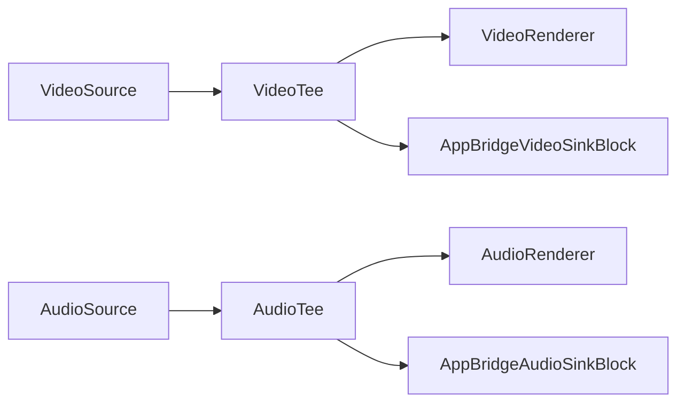
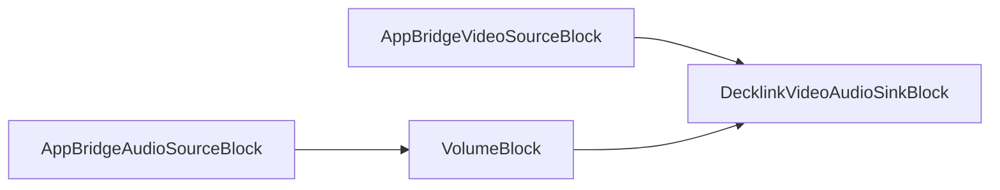

# Blocs de pont

[Media Blocks SDK .Net](https://www.visioforge.com/media-blocks-sdk-net){ .md-button .md-button--primary target="_blank" }

Les ponts permettent de relier deux pipelines et de basculer dynamiquement entre eux. Par exemple, vous pouvez basculer entre différents fichiers ou caméras dans le premier Pipeline sans interrompre la diffusion dans le second Pipeline.

Pour relier une source et un puits, attribuez-leur le même nom. Chaque paire de pont possède un nom de canal unique.

## Puits et source audio Bridge

Les ponts permettent de connecter différents pipelines multimédias et de les utiliser indépendamment. `BridgeAudioSourceBlock` est utilisé pour se connecter à `BridgeAudioSinkBlock` et prend en charge l'audio non compressé.

### Informations sur le bloc

#### Informations BridgeAudioSourceBlock

| Direction du pin | Type de média | Nombre de pins |
| --- | :---: | :---: |
| Sortie audio | audio non compressé | 1 |

#### Informations BridgeAudioSinkBlock

| Direction du pin | Type de média | Nombre de pins |
| --- | :---: | :---: |
| Entrée audio | audio non compressé | 1 |

### Pipelines d'exemple

#### Premier pipeline avec une source audio et un puits audio de pont


#### Second pipeline avec une source audio de pont et un moteur de rendu audio


### Exemple de code

Le pipeline source avec une source audio virtuelle et un puits audio de pont.

```csharp
// créer le pipeline source
var sourcePipeline = new MediaBlocksPipeline();

// créer la source audio virtuelle et le puits audio de pont
// BridgeAudioSinkSettings requiert (string channel, AudioInfoX audioInfo) — pas de ctor sans paramètres
var audioInfo = new AudioInfoX(AudioFormatX.S16LE, 48000, 2);
var audioSourceBlock = new VirtualAudioSourceBlock(new VirtualAudioSourceSettings());
var bridgeAudioSink = new BridgeAudioSinkBlock(new BridgeAudioSinkSettings("audio-bridge", audioInfo));

// connecter la source et le puits
sourcePipeline.Connect(audioSourceBlock.Output, bridgeAudioSink.Input);

// démarrer le pipeline
await sourcePipeline.StartAsync();
```

Le pipeline puits avec la source audio de pont et le moteur de rendu audio.

```csharp
// créer le pipeline puits
var sinkPipeline = new MediaBlocksPipeline();

// créer la source audio de pont et le moteur de rendu audio
// BridgeAudioSourceSettings requiert (string channel, AudioInfoX audioInfo) — doit correspondre au puits ci-dessus
var audioInfo = new AudioInfoX(AudioFormatX.S16LE, 48000, 2);
var bridgeAudioSource = new BridgeAudioSourceBlock(new BridgeAudioSourceSettings("audio-bridge", audioInfo));
var audioRenderer = new AudioRendererBlock();

// connecter la source et le puits
sinkPipeline.Connect(bridgeAudioSource.Output, audioRenderer.Input);

// démarrer le pipeline
await sinkPipeline.StartAsync();
```

## Puits et source vidéo Bridge

Les ponts permettent de connecter différents pipelines multimédias et de les utiliser indépendamment. `BridgeVideoSinkBlock` sert à se connecter à `BridgeVideoSourceBlock` et prend en charge la vidéo non compressée.

### Informations sur les blocs

#### Informations BridgeVideoSinkBlock

| Direction du pin | Type de média | Nombre de pins |
| --- | :---: | :---: |
| Entrée vidéo | vidéo non compressée | 1 |

#### Informations BridgeVideoSourceBlock

| Direction du pin | Type de média | Nombre de pins |
| --- | :---: | :---: |
| Sortie vidéo | vidéo non compressée | 1 |

### Pipelines d'exemple

#### Premier pipeline avec une source vidéo et un puits vidéo de pont


#### Second pipeline avec une source vidéo de pont et un moteur de rendu vidéo


### Exemple de code

Pipeline source avec une source vidéo virtuelle et un puits vidéo de pont.

```csharp
// créer le pipeline source
var sourcePipeline = new MediaBlocksPipeline();

// créer la source vidéo virtuelle et le puits vidéo de pont
var videoSourceBlock = new VirtualVideoSourceBlock(new VirtualVideoSourceSettings());
var bridgeVideoSink = new BridgeVideoSinkBlock(new BridgeVideoSinkSettings());

// connecter la source et le puits
sourcePipeline.Connect(videoSourceBlock.Output, bridgeVideoSink.Input);

// démarrer le pipeline
await sourcePipeline.StartAsync();
```

Pipeline puits avec une source vidéo de pont et un moteur de rendu vidéo.

```csharp
// créer le pipeline puits
var sinkPipeline = new MediaBlocksPipeline();

// créer la source vidéo de pont et le moteur de rendu vidéo
var bridgeVideoSource = new BridgeVideoSourceBlock(new BridgeVideoSourceSettings());
var videoRenderer = new VideoRendererBlock(sinkPipeline, VideoView1);

// connecter la source et le puits
sinkPipeline.Connect(bridgeVideoSource.Output, videoRenderer.Input);

// démarrer le pipeline
await sinkPipeline.StartAsync();
```

## Puits et source de sous-titres Bridge

Les ponts permettent de connecter différents pipelines multimédias et de les utiliser indépendamment. `BridgeSubtitleSourceBlock` est utilisé pour se connecter à `BridgeSubtitleSinkBlock` et prend en charge le type de média texte.

### Informations sur le bloc

#### Informations BridgeSubtitleSourceBlock

| Direction du pin | Type de média | Nombre de pins |
| --- | :---: | :---: |
| Sortie vidéo | texte | 1 |

#### Informations BridgeSubtitleSinkBlock

| Direction du pin | Type de média | Nombre de pins |
| --- | :---: | :---: |
| Sortie vidéo | texte | 1 |

## Source proxy

La paire de blocs source proxy/puits proxy permet de connecter différents pipelines multimédias et de les utiliser indépendamment.

### Informations sur le bloc

Nom : ProxySourceBlock.

| Direction du pin | Type de média | Nombre de pins |
| --- | :---: | :---: |
| Sortie | Tout type non compressé | 1 |

### Pipelines d'exemple

#### Premier pipeline avec une source vidéo et un puits vidéo proxy


#### Second pipeline avec une source vidéo proxy et un moteur de rendu vidéo


### Exemple de code

```csharp
// ProxySink et ProxySource sont appariés par la chaîne pairID — choisissez une valeur unique par paire.
const string pairID = "video-proxy-1";

// pipeline source avec source vidéo virtuelle et puits proxy
var sourcePipeline = new MediaBlocksPipeline();
var videoSourceBlock = new VirtualVideoSourceBlock(new VirtualVideoSourceSettings());
var proxyVideoSink = new ProxySinkBlock(pairID);
sourcePipeline.Connect(videoSourceBlock.Output, proxyVideoSink.Input);

// pipeline puits avec source vidéo proxy et moteur de rendu vidéo — un pairID correspondant les relie
var sinkPipeline = new MediaBlocksPipeline();
var proxyVideoSource = new ProxySourceBlock(pairID);
var videoRenderer = new VideoRendererBlock(sinkPipeline, VideoView1);
sinkPipeline.Connect(proxyVideoSource.Output, videoRenderer.Input);

// démarrer les pipelines
await sourcePipeline.StartAsync();
await sinkPipeline.StartAsync();
```

## Plateformes

Tous les blocs de pont sont pris en charge sous Windows, macOS, Linux, iOS et Android.

## Puits et source BridgeBuffer

Les blocs BridgeBuffer fournissent une communication haute performance entre pipelines basée sur des tampons mémoire, idéale pour partager des images vidéo sans surcharge d'encodage.

### Informations sur le bloc

#### Informations BridgeBufferSinkBlock

| Direction du pin | Type de média | Nombre de pins |
| --- | :---: | :---: |
| Entrée vidéo | vidéo non compressée | 1 |

#### Informations BridgeBufferSourceBlock

| Direction du pin | Type de média | Nombre de pins |
| --- | :---: | :---: |
| Sortie | auto | 1 |

### Exemple de code

```csharp
// Premier pipeline avec source vidéo et puits bridge buffer
var sourcePipeline = new MediaBlocksPipeline();
var videoSource = new SystemVideoSourceBlock(videoSettings);

var videoInfo = new VideoFrameInfoX(1920, 1080, VideoFormatX.NV12, new VideoFrameRate(30));
var bufferSink = new BridgeBufferSinkBlock("buffer-channel", videoInfo);
sourcePipeline.Connect(videoSource.Output, bufferSink.Input);

// Second pipeline avec source bridge buffer et moteur de rendu
var sinkPipeline = new MediaBlocksPipeline();
var bufferSource = new BridgeBufferSourceBlock("buffer-channel");
var videoRenderer = new VideoRendererBlock(sinkPipeline, VideoView1);
sinkPipeline.Connect(bufferSource.Output, videoRenderer.Input);

await sourcePipeline.StartAsync();
await sinkPipeline.StartAsync();
```

## Puits et source InterPipe

Les blocs InterPipe utilisent les éléments interpipesink/interpipesrc de GStreamer pour une communication inter-pipelines efficace, prenant en charge l'audio et la vidéo.

### Informations sur le bloc

#### Informations InterPipeSinkBlock

| Direction du pin | Type de média | Nombre de pins |
| --- | :---: | :---: |
| Entrée | audio ou vidéo | 1 |

#### Informations InterPipeSourceBlock

| Direction du pin | Type de média | Nombre de pins |
| --- | :---: | :---: |
| Sortie | audio ou vidéo | 1 |

### Exemple de code

```csharp
// Premier pipeline avec source vidéo et puits interpipe
var sourcePipeline = new MediaBlocksPipeline();
var videoSource = new SystemVideoSourceBlock(videoSettings);

var videoInfo = new VideoFrameInfoX(1920, 1080, VideoFormatX.NV12, new VideoFrameRate(30));
var interpipeSink = new InterPipeSinkBlock("interpipe-channel", videoInfo);
sourcePipeline.Connect(videoSource.Output, interpipeSink.Input);

// Second pipeline avec source interpipe et moteur de rendu
var sinkPipeline = new MediaBlocksPipeline();
var interpipeSource = new InterPipeSourceBlock("interpipe-channel", MediaBlockPadMediaType.Video);
var videoRenderer = new VideoRendererBlock(sinkPipeline, VideoView1);
sinkPipeline.Connect(interpipeSource.Output, videoRenderer.Input);

await sourcePipeline.StartAsync();
await sinkPipeline.StartAsync();
```

## Puits et source RS Inter

Les blocs RSInter utilisent le plugin GStreamer rsinter basé sur Rust pour une communication inter-pipelines à hautes performances.

### Informations sur le bloc

#### Informations RSInterSinkBlock

| Direction du pin | Type de média | Nombre de pins |
| --- | :---: | :---: |
| Entrée | audio ou vidéo | 1 |

#### Informations RSInterSourceBlock

| Direction du pin | Type de média | Nombre de pins |
| --- | :---: | :---: |
| Sortie | audio ou vidéo | 1 |

### Exemple de code

```csharp
// Premier pipeline avec source vidéo et puits rsinter
var sourcePipeline = new MediaBlocksPipeline();
var videoSource = new SystemVideoSourceBlock(videoSettings);

var rsinterSink = new RSInterSinkBlock(MediaBlockPadMediaType.Video, "rsinter-channel");
sourcePipeline.Connect(videoSource.Output, rsinterSink.Input);

// Second pipeline avec source rsinter et moteur de rendu
var sinkPipeline = new MediaBlocksPipeline();
var rsinterSource = new RSInterSourceBlock(MediaBlockPadMediaType.Video, "rsinter-channel");
var videoRenderer = new VideoRendererBlock(sinkPipeline, VideoView1);
sinkPipeline.Connect(rsinterSource.Output, videoRenderer.Input);

await sourcePipeline.StartAsync();
await sinkPipeline.StartAsync();
```

## AppBridge vidéo et audio

Les blocs AppBridge utilisent les éléments `appsink` et `appsrc` de GStreamer pour fournir un transfert direct de tampons entre pipelines avec **horodatages préservés**. Contrairement aux autres types de ponts qui peuvent régénérer les horodatages, AppBridge conserve les valeurs originales de PTS (Presentation Timestamp), DTS (Decode Timestamp) et de durée.

AppBridge est idéal pour :

- **Sorties matérielles** comme les cartes Decklink qui exigent une synchronisation temporelle précise
- **Diffusion en direct** où la précision des horodatages est essentielle
- **Architectures multi-pipelines** où la synchronisation d'horloge entre pipelines est importante

### Fonctionnement

1. Le bloc puits (`AppBridgeVideoSinkBlock` ou `AppBridgeAudioSinkBlock`) capture les tampons via `appsink` avec `sync=false` pour éviter les délais basés sur l'horloge
2. Les tampons sont transmis directement à la source liée avec leurs horodatages d'origine préservés
3. Le bloc source (`AppBridgeVideoSourceBlock` ou `AppBridgeAudioSourceBlock`) injecte les tampons via `appsrc` avec `is-live=true` et `do-timestamp=false`
4. L'élément en aval (par ex. Decklink) reçoit des tampons correctement horodatés pour la synchronisation d'horloge matérielle

### Informations sur le bloc

#### AppBridgeVideoSinkBlock

| Direction du pin | Type de média | Nombre de pins |
| --- | :---: | :---: |
| Entrée | vidéo non compressée | 1 |

#### AppBridgeVideoSourceBlock

| Direction du pin | Type de média | Nombre de pins |
| --- | :---: | :---: |
| Sortie | vidéo non compressée | 1 |

#### AppBridgeAudioSinkBlock

| Direction du pin | Type de média | Nombre de pins |
| --- | :---: | :---: |
| Entrée | audio non compressé | 1 |

#### AppBridgeAudioSourceBlock

| Direction du pin | Type de média | Nombre de pins |
| --- | :---: | :---: |
| Sortie | audio non compressé | 1 |

### Paramètres

#### AppBridgeVideoSinkSettings / AppBridgeAudioSinkSettings

| Propriété | Type | Par défaut | Description |
| --- | --- | --- | --- |
| Channel | string | requis | Nom de canal unique à apparier avec la source |
| Info | VideoFrameInfoX / AudioInfoX | requis | Spécification du format de média |
| MaxBuffers | int | 5 (vidéo) / 10 (audio) | Taille maximale de la file de tampons |
| Sync | bool | false | Synchronisation sur l'horloge du pipeline (false pour sources en direct) |

#### AppBridgeVideoSourceSettings / AppBridgeAudioSourceSettings

| Propriété | Type | Par défaut | Description |
| --- | --- | --- | --- |
| Channel | string | requis | Nom de canal correspondant au puits |
| Info | VideoFrameInfoX / AudioInfoX | requis | Spécification du format de média |
| IsLive | bool | true | Marque la source comme « live » pour un comportement de pipeline correct |
| DoTimestamp | bool | false | Définir à false pour préserver les horodatages d'origine |

#### Génération de noms de canaux sécurisés

Pour la sécurité, utilisez la méthode d'aide `GenerateUniqueChannel()` pour créer des noms de canaux basés sur des GUID :

```csharp
var channel = AppBridgeVideoSinkSettings.GenerateUniqueChannel("decklink_video");
// Renvoie : "decklink_video_a1b2c3d4e5f6..."
```

### Pipelines d'exemple

#### Pipeline principal avec tee vidéo/audio et puits AppBridge



#### Pipeline de sortie avec sources AppBridge et sortie Decklink



### Exemple de code

Exemple complet illustrant la sortie Decklink utilisant AppBridge pour une gestion correcte des horodatages :

```csharp
// Pipeline principal avec sources vidéo/audio
var mainPipeline = new MediaBlocksPipeline();

// Définition des formats vidéo et audio
var videoInfo = new VideoFrameInfoX(1920, 1080, new VideoFrameRate(60));
var audioInfo = new AudioInfoX(AudioFormatX.S16LE, 48000, 2);

// Créer des tees pour diviser les flux
var videoTee = new TeeBlock(2, MediaBlockPadMediaType.Video);
var audioTee = new TeeBlock(2, MediaBlockPadMediaType.Audio);

// Puits AppBridge dans le pipeline principal
var videoSinkSettings = new AppBridgeVideoSinkSettings("decklink_video", videoInfo);
var appBridgeVideoSink = new AppBridgeVideoSinkBlock(videoSinkSettings);

var audioSinkSettings = new AppBridgeAudioSinkSettings("decklink_audio", audioInfo);
var appBridgeAudioSink = new AppBridgeAudioSinkBlock(audioSinkSettings);

// Connecter les sorties tee aux puits AppBridge
mainPipeline.Connect(videoTee.Outputs[1], appBridgeVideoSink.Input);
mainPipeline.Connect(audioTee.Outputs[1], appBridgeAudioSink.Input);

// Pipeline de sortie Decklink
var decklinkPipeline = new MediaBlocksPipeline();

// Sources AppBridge — mêmes noms de canaux que les puits
var videoSourceSettings = new AppBridgeVideoSourceSettings("decklink_video", videoInfo);
var appBridgeVideoSource = new AppBridgeVideoSourceBlock(videoSourceSettings);

var audioSourceSettings = new AppBridgeAudioSourceSettings("decklink_audio", audioInfo);
var appBridgeAudioSource = new AppBridgeAudioSourceBlock(audioSourceSettings);

// Sortie Decklink
var decklinkVideoSettings = new DecklinkVideoSinkSettings(0, DecklinkMode.HD1080p60);
var decklinkAudioSettings = new DecklinkAudioSinkSettings(0);
var decklinkOutput = new DecklinkVideoAudioSinkBlock(decklinkVideoSettings, decklinkAudioSettings);

// Connecter les sources AppBridge à Decklink
decklinkPipeline.Connect(appBridgeVideoSource.Output, decklinkOutput.VideoInput);
decklinkPipeline.Connect(appBridgeAudioSource.Output, decklinkOutput.AudioInput);

// Démarrer les pipelines
await mainPipeline.StartAsync();
await decklinkPipeline.StartAsync();

// Nettoyage en fin d'utilisation
await decklinkPipeline.StopAsync();
appBridgeVideoSource.Dispose();
appBridgeAudioSource.Dispose();
appBridgeVideoSink.Dispose();
appBridgeAudioSink.Dispose();
```

### Quand utiliser AppBridge par rapport aux autres ponts

| Type de pont | Idéal pour | Gestion des horodatages |
| --- | --- | --- |
| **AppBridge** | Decklink, sorties matérielles, timing précis | Préserve les PTS/DTS d'origine |
| Pont standard | Rendu logiciel, usage général | Peut régénérer les horodatages |
| InterPipe | Plusieurs consommateurs, routage flexible | Dépend de la configuration |
| RSInter | Hautes performances, basé sur Rust | Dépend de la configuration |
| BridgeBuffer | Partage mémoire, zéro-copie | Basé sur les tampons |

## Plateformes

Tous les blocs de pont sont pris en charge sous Windows, macOS, Linux, iOS et Android.

Remarque : les blocs InterPipe et RSInter nécessitent l'installation des plugins GStreamer correspondants.
