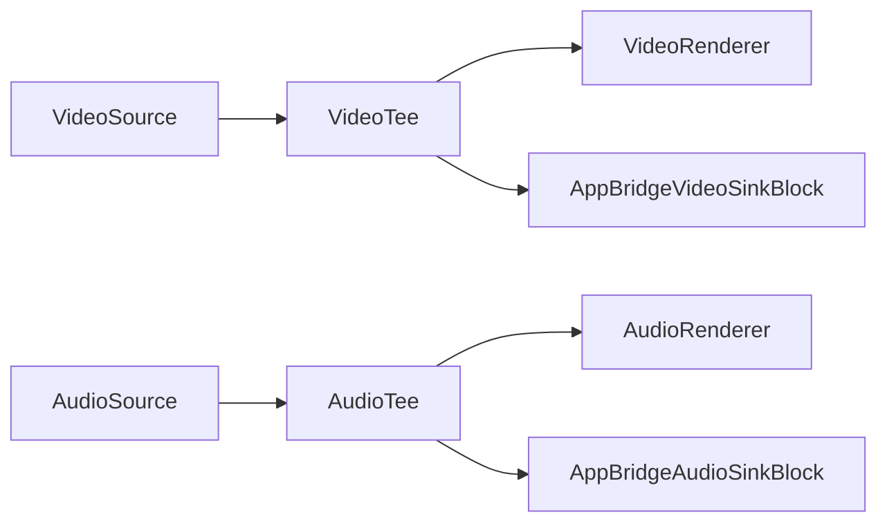
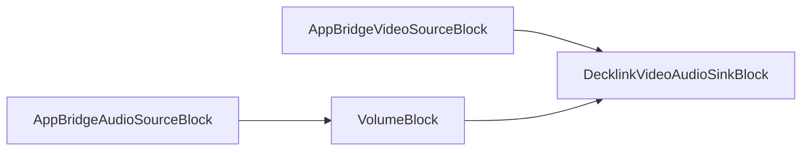

# Bridge blocks

[Media Blocks SDK .Net](https://www.visioforge.com/media-blocks-sdk-net){ .md-button .md-button--primary target="_blank" }

Bridges can be used to link two pipelines and dynamically switch between them. For example, you can switch between different files or cameras in the first Pipeline without interrupting streaming in the second Pipeline.

To link source and sink, give them the same name. Each bridge pair has a unique channel name.

## Bridge audio sink and source

Bridges can be used to connect different media pipelines and use them independently. `BridgeAudioSourceBlock` is used to connect to `BridgeAudioSinkBlock` and supports uncompressed audio.

### Block info

#### BridgeAudioSourceBlock information

| Pin direction | Media type | Pins count |
| --- | :---: | :---: |
| Output audio | uncompressed audio | 1 |

#### BridgeAudioSinkBlock information

| Pin direction | Media type | Pins count |
| --- | :---: | :---: |
| Input audio | uncompressed audio | 1 |

### Sample pipelines

#### First pipeline with an audio source and a bridge audio sink


#### Second pipeline with a bridge audio source and an audio renderer


### Sample code

The source pipeline with virtual audio source and bridge audio sink.

```csharp
// create source pipeline
var sourcePipeline = new MediaBlocksPipeline();

// create virtual audio source and bridge audio sink
var audioSourceBlock = new VirtualAudioSourceBlock(new VirtualAudioSourceSettings());
var bridgeAudioSink = new BridgeAudioSinkBlock(new BridgeAudioSinkSettings());

// connect source and sink
sourcePipeline.Connect(audioSourceBlock.Output, bridgeAudioSink.Input);

// start pipeline
await sourcePipeline.StartAsync();
```

The sink pipeline with bridge audio source and audio renderer.

```csharp
// create sink pipeline
var sinkPipeline = new MediaBlocksPipeline();

// create bridge audio source and audio renderer
var bridgeAudioSource = new BridgeAudioSourceBlock(new BridgeAudioSourceSettings());
var audioRenderer = new AudioRendererBlock();

// connect source and sink
sinkPipeline.Connect(bridgeAudioSource.Output, audioRenderer.Input);

// start pipeline
await sinkPipeline.StartAsync();
```

## Bridge video sink and source

Bridges can be used to connect different media pipelines and use them independently. `BridgeVideoSinkBlock` is used to connect to the `BridgeVideoSourceBlock` and supports uncompressed video.

### Blocks info

#### BridgeVideoSinkBlock information

| Pin direction | Media type | Pins count |
| --- | :---: | :---: |
| Input video | uncompressed video | 1 |

#### BridgeVideoSourceBlock information

| Pin direction | Media type | Pins count |
| --- | :---: | :---: |
| Output video | uncompressed video | 1 |

### Sample pipelines

#### First pipeline with a video source and a bridge video sink


#### Second pipeline with a bridge video source and a video renderer


### Sample code

Source pipeline with a virtual video source and bridge video sink.

```csharp
// create source pipeline
var sourcePipeline = new MediaBlocksPipeline();

// create virtual video source and bridge video sink
var videoSourceBlock = new VirtualVideoSourceBlock(new VirtualVideoSourceSettings());
var bridgeVideoSink = new BridgeVideoSinkBlock(new BridgeVideoSinkSettings());

// connect source and sink
sourcePipeline.Connect(videoSourceBlock.Output, bridgeVideoSink.Input);

// start pipeline
await sourcePipeline.StartAsync();
```

Sink pipeline with a bridge video source and video renderer.

```csharp
// create sink pipeline
var sinkPipeline = new MediaBlocksPipeline();

// create bridge video source and video renderer
var bridgeVideoSource = new BridgeVideoSourceBlock(new BridgeVideoSourceSettings());
var videoRenderer = new VideoRendererBlock(sinkPipeline, VideoView1);

// connect source and sink
sinkPipeline.Connect(bridgeVideoSource.Output, videoRenderer.Input);

// start pipeline
await sinkPipeline.StartAsync();
```

## Bridge subtitle sink and source

Bridges can be used to connect different media pipelines and use them independently. `BridgeSubtitleSourceBlock` is used to connect to the `BridgeSubtitleSinkBlock`and supports text media type.

### Block info

#### BridgeSubtitleSourceBlock information

| Pin direction | Media type | Pins count |
| --- | :---: | :---: |
| Output video | text | 1 |

#### BridgeSubtitleSinkBlock information

| Pin direction | Media type | Pins count |
| --- | :---: | :---: |
| Output video | text | 1 |

## Proxy source

Proxy source/proxy sink pair of blocks can be used to connect different media pipelines and use them independently.

### Block info

Name: ProxySourceBlock.

| Pin direction | Media type | Pins count |
| --- | :---: | :---: |
| Output | Any uncompressed | 1 |

### Sample pipelines

#### First pipeline with a video source and a proxy video sink


#### Second pipeline with a proxy video source and a video renderer


### Sample code

```csharp
// source pipeline with virtual video source and proxy sink
var sourcePipeline = new MediaBlocksPipeline();
var videoSourceBlock = new VirtualVideoSourceBlock(new VirtualVideoSourceSettings());
var proxyVideoSink = new ProxySinkBlock();
sourcePipeline.Connect(videoSourceBlock.Output, proxyVideoSink.Input);

// sink pipeline with proxy video source and video renderer
var sinkPipeline = new MediaBlocksPipeline();
var proxyVideoSource = new ProxySourceBlock(proxyVideoSink);
var videoRenderer = new VideoRendererBlock(sinkPipeline, VideoView1);
sinkPipeline.Connect(proxyVideoSource.Output, videoRenderer.Input);

// start pipelines
await sourcePipeline.StartAsync();
await sinkPipeline.StartAsync();
```

## Platforms

All bridge blocks are supported on Windows, macOS, Linux, iOS, and Android.

## Bridge Buffer sink and source

BridgeBuffer blocks provide high-performance memory buffer-based communication between pipelines, ideal for sharing video frames without encoding overhead.

### Block info

#### BridgeBufferSinkBlock information

| Pin direction | Media type | Pins count |
| --- | :---: | :---: |
| Input video | uncompressed video | 1 |

#### BridgeBufferSourceBlock information

| Pin direction | Media type | Pins count |
| --- | :---: | :---: |
| Output | auto | 1 |

### Sample code

```csharp
// First pipeline with video source and bridge buffer sink
var sourcePipeline = new MediaBlocksPipeline();
var videoSource = new SystemVideoSourceBlock(videoSettings);

var videoInfo = new VideoFrameInfoX(1920, 1080, VideoFormatX.NV12);
var bufferSink = new BridgeBufferSinkBlock("buffer-channel", videoInfo);
sourcePipeline.Connect(videoSource.Output, bufferSink.Input);

// Second pipeline with bridge buffer source and renderer
var sinkPipeline = new MediaBlocksPipeline();
var bufferSource = new BridgeBufferSourceBlock("buffer-channel");
var videoRenderer = new VideoRendererBlock(sinkPipeline, VideoView1);
sinkPipeline.Connect(bufferSource.Output, videoRenderer.Input);

await sourcePipeline.StartAsync();
await sinkPipeline.StartAsync();
```

## InterPipe sink and source

InterPipe blocks use GStreamer's interpipesink/interpipesrc elements for efficient inter-pipeline communication with support for both audio and video.

### Block info

#### InterPipeSinkBlock information

| Pin direction | Media type | Pins count |
| --- | :---: | :---: |
| Input | audio or video | 1 |

#### InterPipeSourceBlock information

| Pin direction | Media type | Pins count |
| --- | :---: | :---: |
| Output | audio or video | 1 |

### Sample code

```csharp
// First pipeline with video source and interpipe sink
var sourcePipeline = new MediaBlocksPipeline();
var videoSource = new SystemVideoSourceBlock(videoSettings);

var videoInfo = new VideoFrameInfoX(1920, 1080, VideoFormatX.NV12);
var interpipeSink = new InterPipeSinkBlock("interpipe-channel", videoInfo);
sourcePipeline.Connect(videoSource.Output, interpipeSink.Input);

// Second pipeline with interpipe source and renderer
var sinkPipeline = new MediaBlocksPipeline();
var interpipeSource = new InterPipeSourceBlock("interpipe-channel", MediaBlockPadMediaType.Video);
var videoRenderer = new VideoRendererBlock(sinkPipeline, VideoView1);
sinkPipeline.Connect(interpipeSource.Output, videoRenderer.Input);

await sourcePipeline.StartAsync();
await sinkPipeline.StartAsync();
```

## RS Inter sink and source

RSInter blocks use the Rust-based GStreamer rsinter plugin for high-performance inter-pipeline communication.

### Block info

#### RSInterSinkBlock information

| Pin direction | Media type | Pins count |
| --- | :---: | :---: |
| Input | audio or video | 1 |

#### RSInterSourceBlock information

| Pin direction | Media type | Pins count |
| --- | :---: | :---: |
| Output | audio or video | 1 |

### Sample code

```csharp
// First pipeline with video source and rsinter sink
var sourcePipeline = new MediaBlocksPipeline();
var videoSource = new SystemVideoSourceBlock(videoSettings);

var rsinterSink = new RSInterSinkBlock(MediaBlockPadMediaType.Video, "rsinter-channel");
sourcePipeline.Connect(videoSource.Output, rsinterSink.Input);

// Second pipeline with rsinter source and renderer
var sinkPipeline = new MediaBlocksPipeline();
var rsinterSource = new RSInterSourceBlock(MediaBlockPadMediaType.Video, "rsinter-channel");
var videoRenderer = new VideoRendererBlock(sinkPipeline, VideoView1);
sinkPipeline.Connect(rsinterSource.Output, videoRenderer.Input);

await sourcePipeline.StartAsync();
await sinkPipeline.StartAsync();
```

## AppBridge Video and Audio

AppBridge blocks use GStreamer's `appsink` and `appsrc` elements to provide direct buffer transfer between pipelines with **preserved timestamps**. Unlike other bridge types that may regenerate timestamps, AppBridge maintains the original PTS (Presentation Timestamp), DTS (Decode Timestamp), and duration values.

This makes AppBridge ideal for:

- **Hardware outputs** like Decklink cards that require precise timing synchronization
- **Live streaming** scenarios where timestamp accuracy is critical
- **Multi-pipeline architectures** where clock synchronization between pipelines is important

### How it works

1. The sink block (`AppBridgeVideoSinkBlock` or `AppBridgeAudioSinkBlock`) captures buffers using `appsink` with `sync=false` to avoid clock-based delays
2. Buffers are passed directly to the linked source with their original timestamps preserved
3. The source block (`AppBridgeVideoSourceBlock` or `AppBridgeAudioSourceBlock`) injects buffers using `appsrc` with `is-live=true` and `do-timestamp=false`
4. The downstream element (e.g., Decklink) receives properly timestamped buffers for hardware clock synchronization

### Block info

#### AppBridgeVideoSinkBlock

| Pin direction | Media type | Pins count |
| --- | :---: | :---: |
| Input | uncompressed video | 1 |

#### AppBridgeVideoSourceBlock

| Pin direction | Media type | Pins count |
| --- | :---: | :---: |
| Output | uncompressed video | 1 |

#### AppBridgeAudioSinkBlock

| Pin direction | Media type | Pins count |
| --- | :---: | :---: |
| Input | uncompressed audio | 1 |

#### AppBridgeAudioSourceBlock

| Pin direction | Media type | Pins count |
| --- | :---: | :---: |
| Output | uncompressed audio | 1 |

### Settings

#### AppBridgeVideoSinkSettings / AppBridgeAudioSinkSettings

| Property | Type | Default | Description |
| --- | --- | --- | --- |
| Channel | string | required | Unique channel name to match with source |
| Info | VideoFrameInfoX / AudioInfoX | required | Media format specification |
| MaxBuffers | int | 5 (video) / 10 (audio) | Maximum buffer queue size |
| Sync | bool | false | Sync to pipeline clock (false for live sources) |

#### AppBridgeVideoSourceSettings / AppBridgeAudioSourceSettings

| Property | Type | Default | Description |
| --- | --- | --- | --- |
| Channel | string | required | Channel name matching the sink |
| Info | VideoFrameInfoX / AudioInfoX | required | Media format specification |
| IsLive | bool | true | Marks source as live for proper pipeline behavior |
| DoTimestamp | bool | false | Set to false to preserve original timestamps |

#### Generating secure channel names

For security, use the `GenerateUniqueChannel()` helper method to create GUID-based channel names:

```csharp
var channel = AppBridgeVideoSinkSettings.GenerateUniqueChannel("decklink_video");
// Returns: "decklink_video_a1b2c3d4e5f6..."
```

### Sample pipelines

#### Main pipeline with video/audio tee and AppBridge sinks



#### Output pipeline with AppBridge sources and Decklink output



### Sample code

Complete example showing Decklink output using AppBridge for proper timestamp handling:

```csharp
// Main pipeline with video/audio sources
var mainPipeline = new MediaBlocksPipeline();

// Video and audio format definitions
var videoInfo = new VideoFrameInfoX(1920, 1080, new VideoFrameRate(60));
var audioInfo = new AudioInfoX(AudioFormatX.S16LE, 48000, 2);

// Create tees for splitting streams
var videoTee = new TeeBlock(2, MediaBlockPadMediaType.Video);
var audioTee = new TeeBlock(2, MediaBlockPadMediaType.Audio);

// AppBridge sinks in main pipeline
var videoSinkSettings = new AppBridgeVideoSinkSettings("decklink_video", videoInfo);
var appBridgeVideoSink = new AppBridgeVideoSinkBlock(videoSinkSettings);

var audioSinkSettings = new AppBridgeAudioSinkSettings("decklink_audio", audioInfo);
var appBridgeAudioSink = new AppBridgeAudioSinkBlock(audioSinkSettings);

// Connect tee outputs to AppBridge sinks
mainPipeline.Connect(videoTee.Outputs[1], appBridgeVideoSink.Input);
mainPipeline.Connect(audioTee.Outputs[1], appBridgeAudioSink.Input);

// Decklink output pipeline
var decklinkPipeline = new MediaBlocksPipeline();

// AppBridge sources - same channel names as sinks
var videoSourceSettings = new AppBridgeVideoSourceSettings("decklink_video", videoInfo);
var appBridgeVideoSource = new AppBridgeVideoSourceBlock(videoSourceSettings);

var audioSourceSettings = new AppBridgeAudioSourceSettings("decklink_audio", audioInfo);
var appBridgeAudioSource = new AppBridgeAudioSourceBlock(audioSourceSettings);

// Decklink output
var decklinkVideoSettings = new DecklinkVideoSinkSettings(0, DecklinkMode.HD1080p60);
var decklinkAudioSettings = new DecklinkAudioSinkSettings(0);
var decklinkOutput = new DecklinkVideoAudioSinkBlock(decklinkVideoSettings, decklinkAudioSettings);

// Connect AppBridge sources to Decklink
decklinkPipeline.Connect(appBridgeVideoSource.Output, decklinkOutput.VideoInput);
decklinkPipeline.Connect(appBridgeAudioSource.Output, decklinkOutput.AudioInput);

// Start pipelines
await mainPipeline.StartAsync();
await decklinkPipeline.StartAsync();

// Cleanup when done
await decklinkPipeline.StopAsync();
appBridgeVideoSource.Dispose();
appBridgeAudioSource.Dispose();
appBridgeVideoSink.Dispose();
appBridgeAudioSink.Dispose();
```

### When to use AppBridge vs other bridges

| Bridge Type | Best For | Timestamp Handling |
| --- | --- | --- |
| **AppBridge** | Decklink, hardware outputs, precise timing | Preserves original PTS/DTS |
| Standard Bridge | Software rendering, general use | May regenerate timestamps |
| InterPipe | Multiple consumers, flexible routing | Depends on configuration |
| RSInter | High-performance Rust-based | Depends on configuration |
| BridgeBuffer | Memory sharing, zero-copy | Buffer-based |

## Platforms

All bridge blocks are supported on Windows, macOS, Linux, iOS, and Android.

Note: InterPipe and RSInter blocks require the corresponding GStreamer plugins to be installed.
