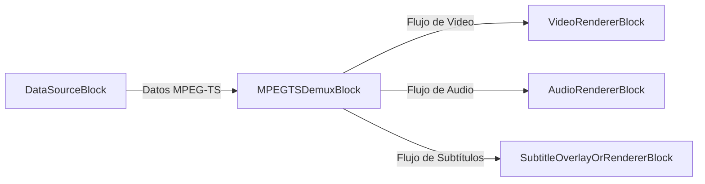
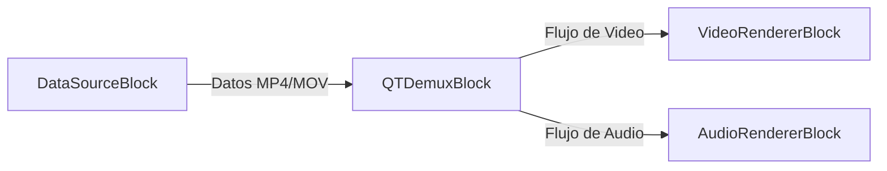
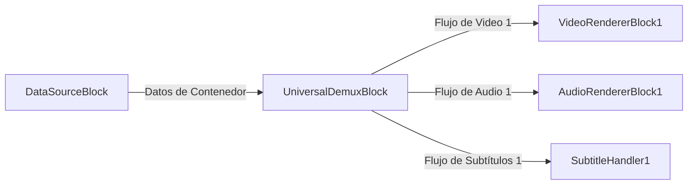

# Bloques Demuxer - VisioForge Media Blocks SDK .Net

[Media Blocks SDK .Net](https://www.visioforge.com/media-blocks-sdk-net){ .md-button .md-button--primary target="_blank" }

Los bloques demuxer son componentes esenciales en pipelines de procesamiento de medios. Toman un flujo multimedia, típicamente de un archivo o fuente de red, y lo separan en sus flujos elementales constituyentes, como video, audio y subtítulos. Esto permite el procesamiento o renderizado individual de cada flujo. VisioForge Media Blocks SDK .Net proporciona varios bloques demuxer para manejar varios formatos de contenedor.

## Bloque MPEG-TS Demux

El `MPEGTSDemuxBlock` se usa para demultiplexar MPEG Transport Streams (MPEG-TS). MPEG-TS es un formato estándar para transmisión y almacenamiento de datos de audio, video y Program and System Information Protocol (PSIP). Se usa comúnmente en transmisión de televisión digital y streaming.

### Información del bloque

Nombre: `MPEGTSDemuxBlock`.

| Dirección del pin | Tipo de medio | Cantidad de pines |
| --- | :---: | :---: |
| Entrada         | Datos MPEG-TS | 1     |
| Salida de video  | Depende del contenido del flujo | 0 o 1+ |
| Salida de audio  | Depende del contenido del flujo | 0 o 1+ |
| Salida de subtítulos | Depende del contenido del flujo | 0 o 1+ |
| Salida de metadatos | Depende del contenido del flujo | 0 o 1+ |

### Configuraciones

El `MPEGTSDemuxBlock` se configura usando `MPEGTSDemuxSettings`.

Propiedades principales de `MPEGTSDemuxSettings`:

- `Latency` (`TimeSpan`): Obtiene o establece la latencia. El predeterminado es 700 milisegundos.
- `ProgramNumber` (int): Obtiene o establece el número de programa. Use -1 para selección predeterminada/automática.

### Pipeline de ejemplo

Este ejemplo muestra cómo conectar una fuente (como `HTTPSourceBlock` para un flujo de red o `UniversalSourceBlock` para un archivo local que emite datos MPEG-TS sin procesar) a `MPEGTSDemuxBlock`, y luego conectar sus salidas a los bloques renderizadores respectivos.



### Código de ejemplo

```csharp
var pipeline = new MediaBlocksPipeline();

// Asuma que 'dataSourceBlock' es un bloque fuente que proporciona datos MPEG-TS
// Por ejemplo, un UniversalSourceBlock leyendo un archivo .ts o una fuente HTTP.
// var dataSourceBlock = new UniversalSourceBlock(await UniversalSourceSettings.CreateAsync("input.ts"));
// Para este ejemplo, asumamos que dataSourceBlock.Output proporciona el flujo MPEG-TS.

var mpegTSDemuxSettings = new MPEGTSDemuxSettings();
// mpegTSDemuxSettings.ProgramNumber = 1; // Opcionalmente seleccionar un programa específico

// Crear Bloque Demuxer MPEG-TS
// Los parámetros del constructor controlan qué flujos intentar renderizar
var mpegTSDemuxBlock = new MPEGTSDemuxBlock(
    renderVideo: true, 
    renderAudio: true, 
    renderSubtitle: true, 
    renderMetadata: false); 

// Conectar la fuente de datos a la entrada del demuxer
// pipeline.Connect(dataSourceBlock.Output, mpegTSDemuxBlock.Input); // Asumiendo que dataSourceBlock está definido

// Crear renderizadores
var videoRenderer = new VideoRendererBlock(pipeline, VideoView1); // Asumiendo que VideoView1 es su control de visualización
var audioRenderer = new AudioRendererBlock();
// var subtitleRenderer = ... ; // Un bloque para manejar renderizado de subtítulos u overlay

// Conectar salidas del demuxer
if (mpegTSDemuxBlock.VideoOutput != null)
{
    pipeline.Connect(mpegTSDemuxBlock.VideoOutput, videoRenderer.Input);
}

if (mpegTSDemuxBlock.AudioOutput != null)
{
    pipeline.Connect(mpegTSDemuxBlock.AudioOutput, audioRenderer.Input);
}

if (mpegTSDemuxBlock.SubtitleOutput != null)
{
    // pipeline.Connect(mpegTSDemuxBlock.SubtitleOutput, subtitleRenderer.Input); // Conectar a un manejador de subtítulos
}

// Iniciar pipeline
// await pipeline.StartAsync(); // Iniciar una vez que dataSourceBlock esté conectado
```

### Observaciones

- Asegúrese de que la entrada a `MPEGTSDemuxBlock` sean datos MPEG-TS sin procesar. Si está usando un `UniversalSourceBlock` con un archivo `.ts`, podría ya demultiplexar el flujo. En tales casos, `MPEGTSDemuxBlock` podría usarse si `UniversalSourceBlock` está configurado para emitir el flujo del contenedor sin procesar o si el flujo viene de una fuente como `SRTRAWSourceBlock`.
- La disponibilidad de salidas de video, audio o subtítulos depende del contenido del flujo MPEG-TS.

### Plataformas

Windows, macOS, Linux, iOS, Android.

## Bloque QT Demux (MP4/MOV)

El `QTDemuxBlock` está diseñado para demultiplexar formatos de contenedor QuickTime (QT), que incluyen archivos MP4 y MOV. Estos formatos son ampliamente usados para almacenar video, audio y otro contenido multimedia.

### Información del bloque

Nombre: `QTDemuxBlock`.

| Dirección del pin | Tipo de medio | Cantidad de pines |
| --- | :---: | :---: |
| Entrada         | Datos MP4/MOV | 1     |
| Salida de video  | Depende del contenido del flujo | 0 o 1+ |
| Salida de audio  | Depende del contenido del flujo | 0 o 1+ |
| Salida de subtítulos | Depende del contenido del flujo | 0 o 1+ |
| Salida de metadatos | Depende del contenido del flujo | 0 o 1+ |

### Configuraciones

El `QTDemuxBlock` no tiene una clase de configuraciones específica más allá de la configuración implícita a través de sus parámetros de constructor (`renderVideo`, `renderAudio`, etc.). El elemento GStreamer subyacente `qtdemux` maneja la demultiplexación automáticamente.

### Pipeline de ejemplo

Este ejemplo muestra cómo conectar un bloque fuente que emite datos MP4/MOV sin procesar a `QTDemuxBlock`, y luego conectar sus salidas a los bloques renderizadores respectivos.



### Código de ejemplo

```csharp
var pipeline = new MediaBlocksPipeline();

// Asuma que 'dataSourceBlock' es un bloque fuente que proporciona datos MP4/MOV.
// Esto podría ser un StreamSourceBlock alimentando datos MP4 sin procesar, o una fuente personalizada.
// Para reproducción típica de archivos, UniversalSourceBlock proporciona directamente flujos decodificados.
// QTDemuxBlock se usa cuando tiene los datos del contenedor y necesita demultiplexarlos dentro del pipeline.
// Ejemplo: var fileStream = File.OpenRead("myvideo.mp4");
// var streamSource = new StreamSourceBlock(fileStream); // StreamSourceBlock proporciona datos sin procesar

// Crear Bloque Demuxer QT
// Los parámetros del constructor controlan qué flujos intentar renderizar
var qtDemuxBlock = new QTDemuxBlock(
    renderVideo: true, 
    renderAudio: true, 
    renderSubtitle: false, 
    renderMetadata: false);

// Conectar la fuente de datos a la entrada del demuxer
// pipeline.Connect(streamSource.Output, qtDemuxBlock.Input); // Asumiendo que streamSource está definido

// Crear renderizadores
var videoRenderer = new VideoRendererBlock(pipeline, VideoView1); // Asumiendo VideoView1
var audioRenderer = new AudioRendererBlock();

// Conectar salidas del demuxer
if (qtDemuxBlock.VideoOutput != null)
{
    pipeline.Connect(qtDemuxBlock.VideoOutput, videoRenderer.Input);
}

if (qtDemuxBlock.AudioOutput != null)
{
    pipeline.Connect(qtDemuxBlock.AudioOutput, audioRenderer.Input);
}

// Iniciar pipeline
// await pipeline.StartAsync(); // Iniciar una vez que dataSourceBlock esté conectado y el pipeline esté construido
```

### Observaciones

- `QTDemuxBlock` se usa típicamente cuando tiene un flujo de datos de contenedor MP4/MOV que necesita ser demultiplexado dentro del pipeline (ej., desde un `StreamSourceBlock` o una fuente de datos personalizada).
- Para reproducir archivos MP4/MOV locales, `UniversalSourceBlock` es frecuentemente más conveniente ya que maneja tanto demultiplexación como decodificación.
- La disponibilidad de salidas depende de los flujos reales presentes en el archivo MP4/MOV.

### Plataformas

Windows, macOS, Linux, iOS, Android.

## Bloque Universal Demux

El `UniversalDemuxBlock` proporciona una forma flexible de demultiplexar varios formatos de contenedor de medios basándose en las configuraciones proporcionadas o inferidas del flujo de entrada. Puede manejar formatos como AVI, MKV, MP4, MPEG-TS, FLV, OGG y WebM.

Este bloque requiere que `MediaFileInfo` sea proporcionado para la inicialización correcta de sus pads de salida, ya que el número y tipo de flujos puede variar enormemente entre archivos.

### Información del bloque

Nombre: `UniversalDemuxBlock`.

| Dirección del pin | Tipo de medio | Cantidad de pines |
| --- | :---: | :---: |
| Entrada         | Varios Datos de Contenedor | 1     |
| Salida de video  | Depende del contenido del flujo y bandera `renderVideo` | 0 a N |
| Salida de audio  | Depende del contenido del flujo y bandera `renderAudio` | 0 a N |
| Salida de subtítulos | Depende del contenido del flujo y bandera `renderSubtitle` | 0 a N |
| Salida de metadatos | Depende del contenido del flujo y bandera `renderMetadata` | 0 o 1 |

(N es el número de flujos respectivos en el archivo de medios)

### Configuraciones

El `UniversalDemuxBlock` se configura usando una implementación de `IUniversalDemuxSettings`. La clase de configuraciones específica depende del formato de contenedor que pretende demultiplexar.

- `UniversalDemuxerType` (enum): Especifica el tipo de demuxer a usar. Puede ser `Auto`, `MKV`, `MP4`, `AVI`, `MPEGTS`, `MPEGPS`, `FLV`, `OGG`, `WebM`.
- Basándose en el `UniversalDemuxerType`, crearía un objeto de configuraciones correspondiente:
  - `AVIDemuxSettings`
  - `FLVDemuxSettings`
  - `MKVDemuxSettings`
  - `MP4DemuxSettings`
  - `MPEGPSDemuxSettings`
  - `MPEGTSDemuxSettings` (incluye propiedades `Latency` y `ProgramNumber`)
  - `OGGDemuxSettings`
  - `WebMDemuxSettings`
  - `UniversalDemuxSettings` (para tipo `Auto`)

El método `UniversalDemuxerTypeHelper.CreateSettings(UniversalDemuxerType type)` puede usarse para crear el objeto de configuraciones apropiado.

### Constructor

`UniversalDemuxBlock(IUniversalDemuxSettings settings, MediaFileInfo info, bool renderVideo = true, bool renderAudio = true, bool renderSubtitle = false, bool renderMetadata = false)`
`UniversalDemuxBlock(MediaFileInfo info, bool renderVideo = true, bool renderAudio = true, bool renderSubtitle = false, bool renderMetadata = false)` (usa `UniversalDemuxSettings` para detección automática de tipo)

**Crucialmente, `MediaFileInfo` debe proporcionarse al constructor.** Este objeto, típicamente obtenido analizando el archivo de medios de antemano (ej., usando `MediaInfoReader`), informa al bloque sobre el número y tipos de flujos, permitiéndole crear el número correcto de pads de salida.

### Pipeline de ejemplo

Este ejemplo demuestra usar `UniversalDemuxBlock` para demultiplexar un archivo. Note que un bloque fuente de datos proporcionando los datos sin procesar del archivo al `UniversalDemuxBlock` está implícito.



### Código de ejemplo

```csharp
var pipeline = new MediaBlocksPipeline();

// 1. Obtener MediaFileInfo para su archivo de medios
var mediaInfoReader = new MediaInfoReader(Context); // Asumiendo que Context es su contexto de logging
MediaFileInfo mediaInfo = await mediaInfoReader.GetInfoAsync("ruta/a/su/video.mkv");
if (mediaInfo == null)
{
    Console.WriteLine("Error al obtener información del medio.");
    return;
}

// 2. Elegir o crear Configuraciones de Demuxer
// Ejemplo: Auto-detectar tipo de demuxer
IUniversalDemuxSettings demuxSettings = new UniversalDemuxSettings(); 
// O, especificar un tipo, ej., para un archivo MKV:
// IUniversalDemuxSettings demuxSettings = new MKVDemuxSettings(); 
// O, para MPEG-TS con programa específico:
// var mpegTsSettings = new MPEGTSDemuxSettings { ProgramNumber = 1 };
// IUniversalDemuxSettings demuxSettings = mpegTsSettings;


// 3. Crear UniversalDemuxBlock
var universalDemuxBlock = new UniversalDemuxBlock(
    demuxSettings, 
    mediaInfo,
    renderVideo: true,  // Procesar flujos de video
    renderAudio: true,  // Procesar flujos de audio
    renderSubtitle: true // Procesar flujos de subtítulos
    );

// 4. Conectar una fuente de datos que proporcione el flujo de archivo sin procesar a la entrada de UniversalDemuxBlock.
// Este paso es crucial y depende de cómo obtiene los datos del archivo.
// Por ejemplo, usando un FileSource configurado para emitir datos sin procesar, o un StreamSourceBlock.
// Ejemplo con un hipotético RawFileSourceBlock (no es un bloque estándar, para ilustración):
// var rawFileSource = new RawFileSourceBlock("ruta/a/su/video.mkv"); 
// pipeline.Connect(rawFileSource.Output, universalDemuxBlock.Input);


// 5. Conectar salidas
// Salidas de video (MediaBlockPad[])
var videoOutputs = universalDemuxBlock.VideoOutputs;
if (videoOutputs.Length > 0)
{
    // Ejemplo: conectar el primer flujo de video
    var videoRenderer = new VideoRendererBlock(pipeline, VideoView1); // Asumiendo VideoView1
    pipeline.Connect(videoOutputs[0], videoRenderer.Input);
}

// Salidas de audio (MediaBlockPad[])
var audioOutputs = universalDemuxBlock.AudioOutputs;
if (audioOutputs.Length > 0)
{
    // Ejemplo: conectar el primer flujo de audio
    var audioRenderer = new AudioRendererBlock();
    pipeline.Connect(audioOutputs[0], audioRenderer.Input);
}

// Salidas de subtítulos (MediaBlockPad[])
var subtitleOutputs = universalDemuxBlock.SubtitleOutputs;
if (subtitleOutputs.Length > 0)
{
    // Ejemplo: conectar el primer flujo de subtítulos a un manejador conceptual
    // var subtitleHandler = new MySubtitleHandlerBlock(); 
    // pipeline.Connect(subtitleOutputs[0], subtitleHandler.Input);
}

// Salida de metadatos (si renderMetadata era true y existe flujo de metadatos)
var metadataOutputs = universalDemuxBlock.MetadataOutputs;
if (metadataOutputs.Length > 0 && metadataOutputs[0] != null)
{
    // Manejar flujo de metadatos
}

// Iniciar pipeline después de que todas las conexiones estén hechas
// await pipeline.StartAsync();
```

### Observaciones

- **`MediaFileInfo` es obligatorio** para que `UniversalDemuxBlock` inicialice correctamente sus pads de salida basándose en los flujos presentes en el archivo.
- Las banderas `renderVideo`, `renderAudio` y `renderSubtitle` en el constructor determinan si se crearán y procesarán salidas para estos tipos de flujos. Si se establece en `false`, los flujos respectivos serán ignorados (o enviados a renderizadores nulos internos si están presentes en el archivo pero no renderizados).
- El `UniversalDemuxBlock` es potente para escenarios donde necesita gestionar explícitamente el proceso de demultiplexación para varios formatos o seleccionar flujos específicos de archivos con múltiples pistas.
- Para reproducción simple de formatos de archivo comunes, `UniversalSourceBlock` frecuentemente proporciona una solución más directa ya que integra demultiplexación y decodificación. `UniversalDemuxBlock` ofrece control más granular.

### Plataformas

Windows, macOS, Linux, iOS, Android. (El soporte de plataforma para formatos específicos puede depender de los plugins GStreamer subyacentes.)
