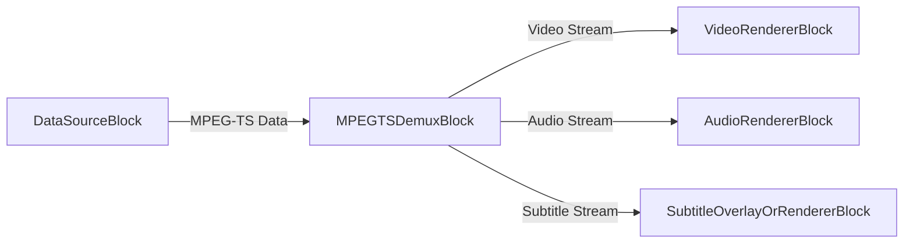
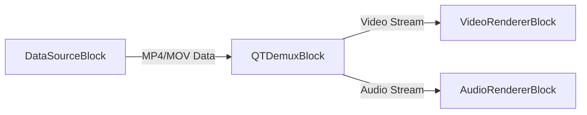
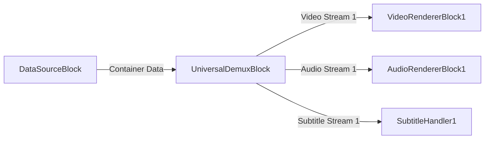

# Blocs démultiplexeurs - VisioForge Media Blocks SDK .Net

[Media Blocks SDK .Net](https://www.visioforge.com/media-blocks-sdk-net){ .md-button .md-button--primary target="_blank" }

Les blocs démultiplexeurs sont des composants essentiels des pipelines de traitement multimédia. Ils prennent un flux multimédia, généralement issu d'un fichier ou d'une source réseau, et le séparent en flux élémentaires constitutifs : vidéo, audio et sous-titres. Cela permet le traitement ou le rendu individuel de chaque flux. VisioForge Media Blocks SDK .Net fournit plusieurs blocs démultiplexeurs pour gérer divers formats de conteneurs.

## Bloc MPEG-TS Demux

Le `MPEGTSDemuxBlock` sert à démultiplexer les flux de transport MPEG (MPEG-TS). MPEG-TS est un format standard pour la transmission et le stockage de données audio, vidéo et PSIP (Program and System Information Protocol). Il est couramment utilisé dans la diffusion de télévision numérique et le streaming.

### Informations sur le bloc

Nom : `MPEGTSDemuxBlock`.

| Direction du pin | Type de média | Nombre de pins |
| --- | :---: | :---: |
| Entrée         | Données MPEG-TS | 1     |
| Sortie vidéo  | Dépend du contenu du flux | 0 ou 1+ |
| Sortie audio  | Dépend du contenu du flux | 0 ou 1+ |
| Sortie sous-titres | Dépend du contenu du flux | 0 ou 1+ |
| Sortie métadonnées | Dépend du contenu du flux | 0 ou 1+ |

### Paramètres

Le `MPEGTSDemuxBlock` est configuré via `MPEGTSDemuxSettings`.

Propriétés clés de `MPEGTSDemuxSettings` :

- `Latency` (`TimeSpan`) : obtient ou définit la latence. Par défaut 700 millisecondes.
- `ProgramNumber` (int) : obtient ou définit le numéro de programme. Utilisez -1 pour la sélection automatique/par défaut.

### Pipeline d'exemple

Cet exemple montre comment connecter une source (telle que `HTTPSourceBlock` pour un flux réseau ou `UniversalSourceBlock` pour un fichier local qui émet des données MPEG-TS brutes) à `MPEGTSDemuxBlock`, puis connecter ses sorties aux blocs moteurs de rendu correspondants.



### Exemple de code

```csharp
var pipeline = new MediaBlocksPipeline();

// On suppose que « dataSourceBlock » est un bloc source fournissant des données MPEG-TS
// Par exemple, un UniversalSourceBlock lisant un fichier .ts ou une source HTTP.
// var dataSourceBlock = new UniversalSourceBlock(await UniversalSourceSettings.CreateAsync("input.ts"));
// Pour cet exemple, on suppose que dataSourceBlock.Output fournit le flux MPEG-TS.

var mpegTSDemuxSettings = new MPEGTSDemuxSettings();
// mpegTSDemuxSettings.ProgramNumber = 1; // Sélectionner facultativement un programme spécifique

// Créer le bloc démultiplexeur MPEG-TS
// Les paramètres du constructeur contrôlent quels flux tenter de restituer
var mpegTSDemuxBlock = new MPEGTSDemuxBlock(
    renderVideo: true, 
    renderAudio: true, 
    renderSubtitle: true, 
    renderMetadata: false); 

// Connecter la source de données à l'entrée du démultiplexeur
// pipeline.Connect(dataSourceBlock.Output, mpegTSDemuxBlock.Input); // En supposant que dataSourceBlock est défini

// Créer les moteurs de rendu
var videoRenderer = new VideoRendererBlock(pipeline, VideoView1); // En supposant que VideoView1 est votre contrôle d'affichage
var audioRenderer = new AudioRendererBlock();
// var subtitleRenderer = ... ; // Un bloc pour gérer le rendu ou la superposition des sous-titres

// Connecter les sorties du démultiplexeur
if (mpegTSDemuxBlock.VideoOutput != null)
{
    pipeline.Connect(mpegTSDemuxBlock.VideoOutput, videoRenderer.Input);
}

if (mpegTSDemuxBlock.AudioOutput != null)
{
    pipeline.Connect(mpegTSDemuxBlock.AudioOutput, audioRenderer.Input);
}

if (mpegTSDemuxBlock.SubtitleOutput != null)
{
    // pipeline.Connect(mpegTSDemuxBlock.SubtitleOutput, subtitleRenderer.Input); // Connecter à un gestionnaire de sous-titres
}

// Démarrer le pipeline
// await pipeline.StartAsync(); // Démarrer une fois dataSourceBlock connecté
```

### Remarques

- Assurez-vous que l'entrée de `MPEGTSDemuxBlock` est constituée de données MPEG-TS brutes. Si vous utilisez un `UniversalSourceBlock` avec un fichier `.ts`, il peut déjà démultiplexer le flux. Dans ce cas, `MPEGTSDemuxBlock` n'est utile que si `UniversalSourceBlock` est configuré pour émettre le flux conteneur brut, ou si le flux provient d'une source comme `SRTRAWSourceBlock`.
- La disponibilité des sorties vidéo, audio ou de sous-titres dépend du contenu du flux MPEG-TS.

### Plateformes

Windows, macOS, Linux, iOS, Android.

## Bloc QT Demux (MP4/MOV)

Le `QTDemuxBlock` est conçu pour démultiplexer les formats de conteneur QuickTime (QT), qui incluent les fichiers MP4 et MOV. Ces formats sont largement utilisés pour stocker vidéo, audio et autres contenus multimédias.

### Informations sur le bloc

Nom : `QTDemuxBlock`.

| Direction du pin | Type de média | Nombre de pins |
| --- | :---: | :---: |
| Entrée         | Données MP4/MOV | 1     |
| Sortie vidéo  | Dépend du contenu du flux | 0 ou 1+ |
| Sortie audio  | Dépend du contenu du flux | 0 ou 1+ |
| Sortie sous-titres | Dépend du contenu du flux | 0 ou 1+ |
| Sortie métadonnées | Dépend du contenu du flux | 0 ou 1+ |

### Paramètres

Le `QTDemuxBlock` ne dispose pas d'une classe de paramètres spécifique au-delà de la configuration implicite fournie par les paramètres de son constructeur (`renderVideo`, `renderAudio`, etc.). L'élément GStreamer sous-jacent `qtdemux` gère automatiquement le démultiplexage.

### Pipeline d'exemple

Cet exemple montre comment connecter un bloc source émettant des données MP4/MOV brutes à `QTDemuxBlock`, puis connecter ses sorties aux blocs moteurs de rendu correspondants.



### Exemple de code

```csharp
var pipeline = new MediaBlocksPipeline();

// On suppose que « dataSourceBlock » est un bloc source fournissant des données MP4/MOV.
// Cela pourrait être un StreamSourceBlock alimenté en données MP4 brutes, ou une source personnalisée.
// Pour la lecture classique de fichiers, UniversalSourceBlock fournit directement des flux décodés.
// QTDemuxBlock est utilisé lorsque vous disposez des données conteneur et que vous devez les démultiplexer dans le pipeline.
// Exemple : var fileStream = File.OpenRead("myvideo.mp4");
// var streamSource = new StreamSourceBlock(fileStream); // StreamSourceBlock fournit les données brutes

// Créer le bloc démultiplexeur QT
// Les paramètres du constructeur contrôlent quels flux tenter de restituer
var qtDemuxBlock = new QTDemuxBlock(
    renderVideo: true, 
    renderAudio: true, 
    renderSubtitle: false, 
    renderMetadata: false);

// Connecter la source de données à l'entrée du démultiplexeur
// pipeline.Connect(streamSource.Output, qtDemuxBlock.Input); // En supposant que streamSource est défini

// Créer les moteurs de rendu
var videoRenderer = new VideoRendererBlock(pipeline, VideoView1); // En supposant VideoView1
var audioRenderer = new AudioRendererBlock();

// Connecter les sorties du démultiplexeur
if (qtDemuxBlock.VideoOutput != null)
{
    pipeline.Connect(qtDemuxBlock.VideoOutput, videoRenderer.Input);
}

if (qtDemuxBlock.AudioOutput != null)
{
    pipeline.Connect(qtDemuxBlock.AudioOutput, audioRenderer.Input);
}

// Démarrer le pipeline
// await pipeline.StartAsync(); // Démarrer une fois dataSourceBlock connecté et le pipeline construit
```

### Remarques

- `QTDemuxBlock` est généralement utilisé lorsque vous disposez d'un flux de données conteneur MP4/MOV à démultiplexer dans le pipeline (par ex. depuis un `StreamSourceBlock` ou une source de données personnalisée).
- Pour la lecture de fichiers MP4/MOV locaux, `UniversalSourceBlock` est souvent plus pratique car il gère à la fois le démultiplexage et le décodage.
- La disponibilité des sorties dépend des flux réellement présents dans le fichier MP4/MOV.

### Plateformes

Windows, macOS, Linux, iOS, Android.

## Bloc Universal Demux

Le `UniversalDemuxBlock` offre un moyen flexible de démultiplexer divers formats de conteneur multimédia en se basant sur des paramètres fournis ou déduits du flux d'entrée. Il peut gérer des formats tels que AVI, MKV, MP4, MPEG-TS, FLV, OGG et WebM.

Ce bloc nécessite la fourniture de `MediaFileInfo` pour l'initialisation correcte de ses pads de sortie, le nombre et le type de flux pouvant varier considérablement d'un fichier à l'autre.

### Informations sur le bloc

Nom : `UniversalDemuxBlock`.

| Direction du pin | Type de média | Nombre de pins |
| --- | :---: | :---: |
| Entrée         | Données conteneur diverses | 1     |
| Sortie vidéo  | Dépend du contenu du flux et de l'indicateur `renderVideo` | 0 à N |
| Sortie audio  | Dépend du contenu du flux et de l'indicateur `renderAudio` | 0 à N |
| Sortie sous-titres | Dépend du contenu du flux et de l'indicateur `renderSubtitle` | 0 à N |
| Sortie métadonnées | Dépend du contenu du flux et de l'indicateur `renderMetadata` | 0 ou 1 |

(N est le nombre de flux respectifs dans le fichier multimédia)

### Paramètres

Le `UniversalDemuxBlock` est configuré au moyen d'une implémentation de `IUniversalDemuxSettings`. La classe de paramètres spécifique dépend du format de conteneur que vous prévoyez de démultiplexer.

- `UniversalDemuxerType` (enum) : spécifie le type de démultiplexeur à utiliser. Peut être `Auto`, `MKV`, `MP4`, `AVI`, `MPEGTS`, `MPEGPS`, `FLV`, `OGG`, `WebM`.
- En fonction du `UniversalDemuxerType`, vous créerez un objet de paramètres correspondant :
  - `AVIDemuxSettings`
  - `FLVDemuxSettings`
  - `MKVDemuxSettings`
  - `MP4DemuxSettings`
  - `MPEGPSDemuxSettings`
  - `MPEGTSDemuxSettings` (inclut les propriétés `Latency` et `ProgramNumber`)
  - `OGGDemuxSettings`
  - `WebMDemuxSettings`
  - `UniversalDemuxSettings` (pour le type `Auto`)

La méthode `UniversalDemuxerTypeHelper.CreateSettings(UniversalDemuxerType type)` peut être utilisée pour créer l'objet de paramètres approprié.

### Constructeur

`UniversalDemuxBlock(IUniversalDemuxSettings settings, MediaFileInfo info, bool renderVideo = true, bool renderAudio = true, bool renderSubtitle = false, bool renderMetadata = false)`
`UniversalDemuxBlock(MediaFileInfo info, bool renderVideo = true, bool renderAudio = true, bool renderSubtitle = false, bool renderMetadata = false)` (utilise `UniversalDemuxSettings` pour la détection automatique du type)

**Surtout, `MediaFileInfo` doit être fourni au constructeur.** Cet objet, généralement obtenu en analysant le fichier multimédia au préalable (par ex. via `MediaInfoReader`), informe le bloc du nombre et des types de flux, lui permettant de créer le bon nombre de pads de sortie.

### Pipeline d'exemple

Cet exemple illustre l'utilisation de `UniversalDemuxBlock` pour démultiplexer un fichier. Notez qu'un bloc source de données fournissant les données brutes du fichier à `UniversalDemuxBlock` est implicite.



### Exemple de code

```csharp
var pipeline = new MediaBlocksPipeline();

// 1. Obtenir les informations sur votre fichier multimédia (lecteur multiplateforme)
var mediaInfoReader = new MediaInfoReaderX();
if (!await mediaInfoReader.OpenAsync("path/to/your/video.mkv"))
{
    Console.WriteLine("Échec de la récupération des informations multimédias.");
    return;
}
var mediaInfo = mediaInfoReader.Info;

// 2. Choisir ou créer les paramètres de démultiplexeur
// Exemple : détection automatique du type de démultiplexeur
IUniversalDemuxSettings demuxSettings = new UniversalDemuxSettings(); 
// Ou bien, spécifier un type, par ex. pour un fichier MKV :
// IUniversalDemuxSettings demuxSettings = new MKVDemuxSettings(); 
// Ou bien, pour MPEG-TS avec un programme spécifique :
// var mpegTsSettings = new MPEGTSDemuxSettings { ProgramNumber = 1 };
// IUniversalDemuxSettings demuxSettings = mpegTsSettings;


// 3. Créer UniversalDemuxBlock
var universalDemuxBlock = new UniversalDemuxBlock(
    demuxSettings, 
    mediaInfo,
    renderVideo: true,  // Traiter les flux vidéo
    renderAudio: true,  // Traiter les flux audio
    renderSubtitle: true // Traiter les flux de sous-titres
    );

// 4. Connecter une source de données fournissant le flux brut du fichier à l'entrée de UniversalDemuxBlock.
// Cette étape est cruciale et dépend de la manière dont vous obtenez les données du fichier.
// Par exemple, en utilisant un FileSource configuré pour émettre des données brutes, ou un StreamSourceBlock.
// Exemple avec un RawFileSourceBlock hypothétique (ce n'est pas un bloc standard, à titre d'illustration) :
// var rawFileSource = new RawFileSourceBlock("path/to/your/video.mkv"); 
// pipeline.Connect(rawFileSource.Output, universalDemuxBlock.Input);


// 5. Connecter les sorties
// Sorties vidéo (MediaBlockPad[])
var videoOutputs = universalDemuxBlock.VideoOutputs;
if (videoOutputs.Length > 0)
{
    // Exemple : connecter le premier flux vidéo
    var videoRenderer = new VideoRendererBlock(pipeline, VideoView1); // En supposant VideoView1
    pipeline.Connect(videoOutputs[0], videoRenderer.Input);
}

// Sorties audio (MediaBlockPad[])
var audioOutputs = universalDemuxBlock.AudioOutputs;
if (audioOutputs.Length > 0)
{
    // Exemple : connecter le premier flux audio
    var audioRenderer = new AudioRendererBlock();
    pipeline.Connect(audioOutputs[0], audioRenderer.Input);
}

// Sorties de sous-titres (MediaBlockPad[])
var subtitleOutputs = universalDemuxBlock.SubtitleOutputs;
if (subtitleOutputs.Length > 0)
{
    // Exemple : connecter le premier flux de sous-titres à un gestionnaire conceptuel
    // var subtitleHandler = new MySubtitleHandlerBlock(); 
    // pipeline.Connect(subtitleOutputs[0], subtitleHandler.Input);
}

// Sortie de métadonnées (si renderMetadata vaut true et qu'un flux de métadonnées existe)
var metadataOutputs = universalDemuxBlock.MetadataOutputs;
if (metadataOutputs.Length > 0 && metadataOutputs[0] != null)
{
    // Gérer le flux de métadonnées
}

// Démarrer le pipeline une fois toutes les connexions établies
// await pipeline.StartAsync();
```

### Remarques

- **`MediaFileInfo` est obligatoire** pour que `UniversalDemuxBlock` initialise correctement ses pads de sortie en fonction des flux présents dans le fichier.
- Les indicateurs `renderVideo`, `renderAudio` et `renderSubtitle` du constructeur déterminent si des sorties pour ces types de flux seront créées et traitées. Lorsqu'ils sont définis à `false`, les flux concernés seront ignorés (ou envoyés vers des moteurs de rendu null internes s'ils sont présents dans le fichier sans être restitués).
- Le `UniversalDemuxBlock` est puissant dans les scénarios où vous devez gérer explicitement le démultiplexage pour divers formats ou sélectionner des flux spécifiques dans des fichiers à pistes multiples.
- Pour la lecture simple de formats de fichier courants, `UniversalSourceBlock` est souvent une solution plus directe car il intègre démultiplexage et décodage. `UniversalDemuxBlock` offre un contrôle plus fin.

### Plateformes

Windows, macOS, Linux, iOS, Android. (La prise en charge des formats spécifiques selon la plateforme peut dépendre des plugins GStreamer sous-jacents.)
