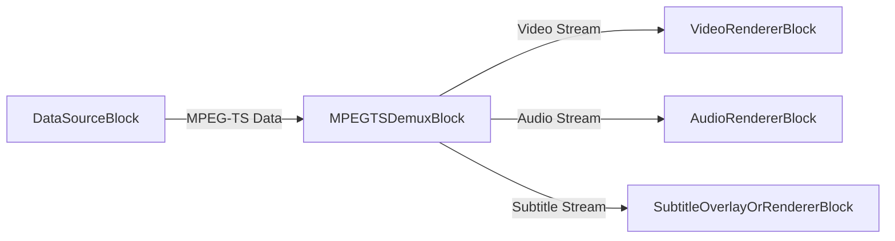
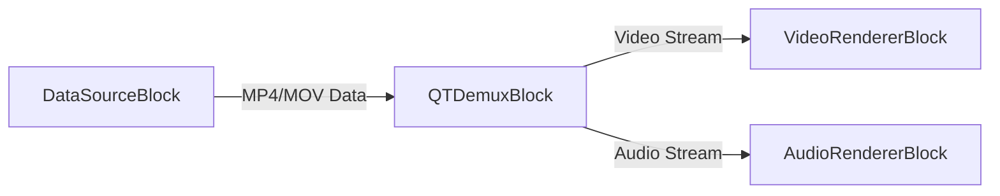
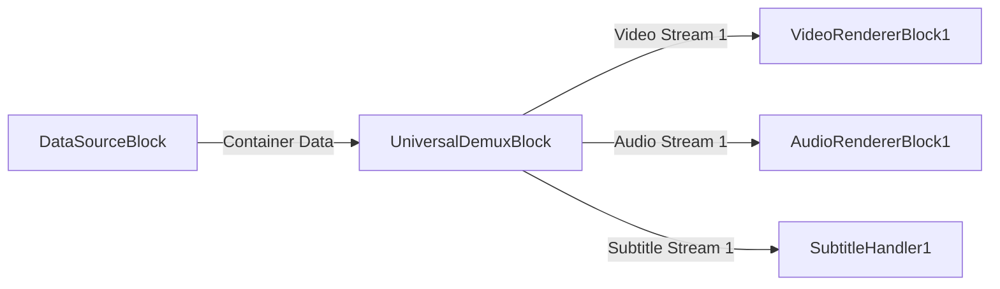

# Demuxer Blocks - VisioForge Media Blocks SDK .Net

[!badge size="xl" target="blank" variant="info" text="Media Blocks SDK .Net"](https://www.visioforge.com/media-blocks-sdk-net)

Demuxer blocks are essential components in media processing pipelines. They take a multimedia stream, typically from a file or network source, and separate it into its constituent elementary streams, such as video, audio, and subtitles. This allows for individual processing or rendering of each stream. VisioForge Media Blocks SDK .Net provides several demuxer blocks to handle various container formats.

## MPEG-TS Demux Block

The `MPEGTSDemuxBlock` is used to demultiplex MPEG Transport Streams (MPEG-TS). MPEG-TS is a standard format for transmission and storage of audio, video, and Program and System Information Protocol (PSIP) data. It is commonly used in digital television broadcasting and streaming.

### Block info

Name: `MPEGTSDemuxBlock`.

| Pin direction | Media type | Pins count |
| --- | :---: | :---: |
| Input         | MPEG-TS Data | 1     |
| Output video  | Depends on stream content | 0 or 1+ |
| Output audio  | Depends on stream content | 0 or 1+ |
| Output subtitle | Depends on stream content | 0 or 1+ |
| Output metadata | Depends on stream content | 0 or 1+ |

### Settings

The `MPEGTSDemuxBlock` is configured using `MPEGTSDemuxSettings`.

Key properties of `MPEGTSDemuxSettings`:

- `Latency` (`TimeSpan`): Gets or sets the latency. Default is 700 milliseconds.
- `ProgramNumber` (int): Gets or sets the program number. Use -1 for default/automatic selection.

### The sample pipeline

This example shows how to connect a source (like `HTTPSourceBlock` for a network stream or `UniversalSourceBlock` for a local file that outputs raw MPEG-TS data) to `MPEGTSDemuxBlock`, and then connect its outputs to respective renderer blocks.



### Sample code

```csharp
var pipeline = new MediaBlocksPipeline();

// Assume 'dataSourceBlock' is a source block providing MPEG-TS data
// For example, a UniversalSourceBlock reading a .ts file or an HTTP source.
// var dataSourceBlock = new UniversalSourceBlock(await UniversalSourceSettings.CreateAsync("input.ts"));
// For this example, let's assume dataSourceBlock.Output provides the MPEG-TS stream.

var mpegTSDemuxSettings = new MPEGTSDemuxSettings();
// mpegTSDemuxSettings.ProgramNumber = 1; // Optionally select a specific program

// Create MPEG-TS Demuxer Block
// Constructor parameters control which streams to attempt to render
var mpegTSDemuxBlock = new MPEGTSDemuxBlock(
    renderVideo: true, 
    renderAudio: true, 
    renderSubtitle: true, 
    renderMetadata: false); 

// Connect the data source to the demuxer's input
// pipeline.Connect(dataSourceBlock.Output, mpegTSDemuxBlock.Input); // Assuming dataSourceBlock is defined

// Create renderers
var videoRenderer = new VideoRendererBlock(pipeline, VideoView1); // Assuming VideoView1 is your display control
var audioRenderer = new AudioRendererBlock();
// var subtitleRenderer = ... ; // A block to handle subtitle rendering or overlay

// Connect demuxer outputs
if (mpegTSDemuxBlock.VideoOutput != null)
{
    pipeline.Connect(mpegTSDemuxBlock.VideoOutput, videoRenderer.Input);
}

if (mpegTSDemuxBlock.AudioOutput != null)
{
    pipeline.Connect(mpegTSDemuxBlock.AudioOutput, audioRenderer.Input);
}

if (mpegTSDemuxBlock.SubtitleOutput != null)
{
    // pipeline.Connect(mpegTSDemuxBlock.SubtitleOutput, subtitleRenderer.Input); // Connect to a subtitle handler
}

// Start pipeline
// await pipeline.StartAsync(); // Start once dataSourceBlock is connected
```

### Remarks

- Ensure that the input to `MPEGTSDemuxBlock` is raw MPEG-TS data. If you are using a `UniversalSourceBlock` with a `.ts` file, it might already demultiplex the stream. In such cases, `MPEGTSDemuxBlock` might be used if `UniversalSourceBlock` is configured to output the raw container stream or if the stream comes from a source like `SRTRAWSourceBlock`.
- The availability of video, audio, or subtitle outputs depends on the content of the MPEG-TS stream.

### Platforms

Windows, macOS, Linux, iOS, Android.

## QT Demux Block (MP4/MOV)

The `QTDemuxBlock` is designed to demultiplex QuickTime (QT) container formats, which include MP4 and MOV files. These formats are widely used for storing video, audio, and other multimedia content.

### Block info

Name: `QTDemuxBlock`.

| Pin direction | Media type | Pins count |
| --- | :---: | :---: |
| Input         | MP4/MOV Data | 1     |
| Output video  | Depends on stream content | 0 or 1+ |
| Output audio  | Depends on stream content | 0 or 1+ |
| Output subtitle | Depends on stream content | 0 or 1+ |
| Output metadata | Depends on stream content | 0 or 1+ |

### Settings

The `QTDemuxBlock` does not have specific settings class beyond the implicit configuration through its constructor parameters (`renderVideo`, `renderAudio`, etc.). The underlying GStreamer element `qtdemux` handles the demultiplexing automatically.

### The sample pipeline

This example shows how to connect a source block that outputs raw MP4/MOV data to `QTDemuxBlock`, and then connect its outputs to respective renderer blocks.



### Sample code

```csharp
var pipeline = new MediaBlocksPipeline();

// Assume 'dataSourceBlock' is a source block providing MP4/MOV data.
// This could be a StreamSourceBlock feeding raw MP4 data, or a custom source.
// For typical file playback, UniversalSourceBlock directly provides decoded streams.
// QTDemuxBlock is used when you have the container data and need to demux it within the pipeline.
// Example: var fileStream = File.OpenRead("myvideo.mp4");
// var streamSource = new StreamSourceBlock(fileStream); // StreamSourceBlock provides raw data

// Create QT Demuxer Block
// Constructor parameters control which streams to attempt to render
var qtDemuxBlock = new QTDemuxBlock(
    renderVideo: true, 
    renderAudio: true, 
    renderSubtitle: false, 
    renderMetadata: false);

// Connect the data source to the demuxer's input
// pipeline.Connect(streamSource.Output, qtDemuxBlock.Input); // Assuming streamSource is defined

// Create renderers
var videoRenderer = new VideoRendererBlock(pipeline, VideoView1); // Assuming VideoView1
var audioRenderer = new AudioRendererBlock();

// Connect demuxer outputs
if (qtDemuxBlock.VideoOutput != null)
{
    pipeline.Connect(qtDemuxBlock.VideoOutput, videoRenderer.Input);
}

if (qtDemuxBlock.AudioOutput != null)
{
    pipeline.Connect(qtDemuxBlock.AudioOutput, audioRenderer.Input);
}

// Start pipeline
// await pipeline.StartAsync(); // Start once dataSourceBlock is connected and pipeline is built
```

### Remarks

- `QTDemuxBlock` is typically used when you have a stream of MP4/MOV container data that needs to be demultiplexed within the pipeline (e.g., from a `StreamSourceBlock` or a custom data source).
- For playing local MP4/MOV files, `UniversalSourceBlock` is often more convenient as it handles both demuxing and decoding.
- The availability of outputs depends on the actual streams present in the MP4/MOV file.

### Platforms

Windows, macOS, Linux, iOS, Android.

## Universal Demux Block

The `UniversalDemuxBlock` provides a flexible way to demultiplex various media container formats based on provided settings or inferred from the input stream. It can handle formats like AVI, MKV, MP4, MPEG-TS, FLV, OGG, and WebM.

This block requires `MediaFileInfo` to be provided for proper initialization of its output pads, as the number and type of streams can vary greatly between files.

### Block info

Name: `UniversalDemuxBlock`.

| Pin direction | Media type | Pins count |
| --- | :---: | :---: |
| Input         | Various Container Data | 1     |
| Output video  | Depends on stream content and `renderVideo` flag | 0 to N |
| Output audio  | Depends on stream content and `renderAudio` flag | 0 to N |
| Output subtitle | Depends on stream content and `renderSubtitle` flag | 0 to N |
| Output metadata | Depends on stream content and `renderMetadata` flag | 0 or 1 |

(N is the number of respective streams in the media file)

### Settings

The `UniversalDemuxBlock` is configured using an implementation of `IUniversalDemuxSettings`. The specific settings class depends on the container format you intend to demultiplex.

- `UniversalDemuxerType` (enum): Specifies the type of demuxer to use. Can be `Auto`, `MKV`, `MP4`, `AVI`, `MPEGTS`, `MPEGPS`, `FLV`, `OGG`, `WebM`.
- Based on the `UniversalDemuxerType`, you would create a corresponding settings object:
  - `AVIDemuxSettings`
  - `FLVDemuxSettings`
  - `MKVDemuxSettings`
  - `MP4DemuxSettings`
  - `MPEGPSDemuxSettings`
  - `MPEGTSDemuxSettings` (includes `Latency` and `ProgramNumber` properties)
  - `OGGDemuxSettings`
  - `WebMDemuxSettings`
  - `UniversalDemuxSettings` (for `Auto` type)

The `UniversalDemuxerTypeHelper.CreateSettings(UniversalDemuxerType type)` method can be used to create the appropriate settings object.

### Constructor

`UniversalDemuxBlock(IUniversalDemuxSettings settings, MediaFileInfo info, bool renderVideo = true, bool renderAudio = true, bool renderSubtitle = false, bool renderMetadata = false)`
`UniversalDemuxBlock(MediaFileInfo info, bool renderVideo = true, bool renderAudio = true, bool renderSubtitle = false, bool renderMetadata = false)` (uses `UniversalDemuxSettings` for auto type detection)

**Crucially, `MediaFileInfo` must be provided to the constructor.** This object, typically obtained by analyzing the media file beforehand (e.g., using `MediaInfoReader`), informs the block about the number and types of streams, allowing it to create the correct number of output pads.

### The sample pipeline

This example demonstrates using `UniversalDemuxBlock` to demultiplex a file. Note that a data source block providing the raw file data to the `UniversalDemuxBlock` is implied.



### Sample code

```csharp
var pipeline = new MediaBlocksPipeline();

// 1. Obtain MediaFileInfo for your media file
var mediaInfoReader = new MediaInfoReader(Context); // Assuming Context is your logging context
MediaFileInfo mediaInfo = await mediaInfoReader.GetInfoAsync("path/to/your/video.mkv");
if (mediaInfo == null)
{
    Console.WriteLine("Failed to get media info.");
    return;
}

// 2. Choose or create Demuxer Settings
// Example: Auto-detect demuxer type
IUniversalDemuxSettings demuxSettings = new UniversalDemuxSettings(); 
// Or, specify a type, e.g., for an MKV file:
// IUniversalDemuxSettings demuxSettings = new MKVDemuxSettings(); 
// Or, for MPEG-TS with specific program:
// var mpegTsSettings = new MPEGTSDemuxSettings { ProgramNumber = 1 };
// IUniversalDemuxSettings demuxSettings = mpegTsSettings;


// 3. Create UniversalDemuxBlock
var universalDemuxBlock = new UniversalDemuxBlock(
    demuxSettings, 
    mediaInfo,
    renderVideo: true,  // Process video streams
    renderAudio: true,  // Process audio streams
    renderSubtitle: true // Process subtitle streams
    );

// 4. Connect a data source that provides the raw file stream to UniversalDemuxBlock's input.
// This step is crucial and depends on how you get the file data.
// For instance, using a FileSource configured to output raw data, or a StreamSourceBlock.
// Example with a hypothetical RawFileSourceBlock (not a standard block, for illustration):
// var rawFileSource = new RawFileSourceBlock("path/to/your/video.mkv"); 
// pipeline.Connect(rawFileSource.Output, universalDemuxBlock.Input);


// 5. Connect outputs
// Video outputs (MediaBlockPad[])
var videoOutputs = universalDemuxBlock.VideoOutputs;
if (videoOutputs.Length > 0)
{
    // Example: connect the first video stream
    var videoRenderer = new VideoRendererBlock(pipeline, VideoView1); // Assuming VideoView1
    pipeline.Connect(videoOutputs[0], videoRenderer.Input);
}

// Audio outputs (MediaBlockPad[])
var audioOutputs = universalDemuxBlock.AudioOutputs;
if (audioOutputs.Length > 0)
{
    // Example: connect the first audio stream
    var audioRenderer = new AudioRendererBlock();
    pipeline.Connect(audioOutputs[0], audioRenderer.Input);
}

// Subtitle outputs (MediaBlockPad[])
var subtitleOutputs = universalDemuxBlock.SubtitleOutputs;
if (subtitleOutputs.Length > 0)
{
    // Example: connect the first subtitle stream to a conceptual handler
    // var subtitleHandler = new MySubtitleHandlerBlock(); 
    // pipeline.Connect(subtitleOutputs[0], subtitleHandler.Input);
}

// Metadata output (if renderMetadata was true and metadata stream exists)
var metadataOutputs = universalDemuxBlock.MetadataOutputs;
if (metadataOutputs.Length > 0 && metadataOutputs[0] != null)
{
    // Handle metadata stream
}

// Start pipeline after all connections are made
// await pipeline.StartAsync();
```

### Remarks

- **`MediaFileInfo` is mandatory** for `UniversalDemuxBlock` to correctly initialize its output pads based on the streams present in the file.
- The `renderVideo`, `renderAudio`, and `renderSubtitle` flags in the constructor determine if outputs for these stream types will be created and processed. If set to `false`, respective streams will be ignored (or sent to internal null renderers if present in the file but not rendered).
- The `UniversalDemuxBlock` is powerful for scenarios where you need to explicitly manage the demuxing process for various formats or select specific streams from files with multiple tracks.
- For simple playback of common file formats, `UniversalSourceBlock` often provides a more straightforward solution as it integrates demuxing and decoding. `UniversalDemuxBlock` offers more granular control.

### Platforms

Windows, macOS, Linux, iOS, Android. (Platform support for specific formats may depend on underlying GStreamer plugins.)
