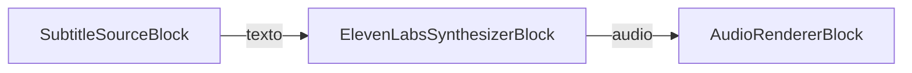
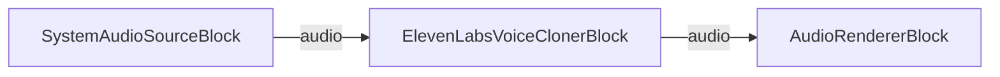

# Bloques de ElevenLabs

[Media Blocks SDK .Net](https://www.visioforge.com/media-blocks-sdk-net){ .md-button .md-button--primary target="_blank" }

## Resumen

Los bloques de ElevenLabs incorporan el audio con IA de [ElevenLabs](https://elevenlabs.io/) directamente en sus pipelines de [Media Blocks SDK .NET](https://www.visioforge.com/media-blocks-sdk-net). Hay dos bloques respaldados por la nube disponibles:

- [`ElevenLabsSynthesizerBlock`](#sintetizador-de-elevenlabs) — texto a voz: toma una entrada de texto y produce audio de voz.
- [`ElevenLabsVoiceClonerBlock`](#clonador-de-voz-de-elevenlabs) — clonación de voz: toma una entrada de audio y la vuelve a renderizar con una voz clonada.

Ambos bloques llaman a la API en la nube de ElevenLabs, por lo que requieren una **clave de API de ElevenLabs** válida y acceso a la red. Obtenga una clave desde el [panel de ElevenLabs](https://elevenlabs.io/app). Cada bloque expone un método estático `IsAvailable()` para que pueda verificar que el plugin subyacente de ElevenLabs para GStreamer esté presente antes de crear una instancia.

## Sintetizador de ElevenLabs

El `ElevenLabsSynthesizerBlock` convierte un flujo de texto en audio hablado usando la API de texto a voz de ElevenLabs. Tiene un pad de entrada de texto y un pad de salida de audio, de modo que puede dirigir la voz sintetizada hacia un codificador, un renderizador o un mezclador.

Configúrelo con `ElevenLabsSynthesizerSettings`. El constructor toma la clave de API; los ajustes adicionales más comunes son el `VoiceId` (qué voz de ElevenLabs usar), el `ModelId` y un `LanguageCode` ISO 639-1 opcional.

### Información del bloque

Nombre: ElevenLabsSynthesizerBlock.

| Dirección del pin | Tipo de medio | Número de pines |
| --- | :---: | :---: |
| Entrada | text | uno |
| Salida de audio | audio/x-raw | uno |

### Ajustes

| Propiedad | Tipo | Predeterminado | Descripción |
| --- | --- | --- | --- |
| `ApiKey` | `string` | — | Clave de API de ElevenLabs (se establece mediante el constructor). |
| `VoiceId` | `string` | `"9BWtsMINqrJLrRacOk9x"` | ID de voz de ElevenLabs. Consulte la [biblioteca de voces](https://elevenlabs.io/app/voice-library). |
| `ModelId` | `string` | `"eleven_flash_v2_5"` | ID de modelo de ElevenLabs. |
| `LanguageCode` | `string` | `null` | Código de idioma ISO 639-1 opcional, útil con ciertos modelos. |
| `Latency` | `uint` | `2000` | Milisegundos de latencia que se permiten a ElevenLabs. |
| `MaxOverflow` | `uint` | `2000` | Milisegundos que una entrada de texto puede exceder su duración (modo de compresión). |
| `MaxPreviousRequests` | `uint` | `0` | Cuántos ID de solicitudes anteriores rastrear para mantener la continuidad. |
| `Overflow` | `ElevenLabsOverflow` | `Clip` | Cómo se gestiona el audio más largo que el texto de entrada: `Clip`, `Overlap` o `Shift`. |
| `RetryWithSpeed` | `bool` | `true` | Reintentar con mayor velocidad cuando la síntesis produce una duración más larga. |
| `UseVoiceIdEvents` | `bool` | `true` | Usar los eventos `elevenlabs/speaker-voice` recibidos para elegir la voz actual. |

### El pipeline de ejemplo



### Código de ejemplo

```csharp
using VisioForge.Core.MediaBlocks;
using VisioForge.Core.MediaBlocks.AudioRendering;
using VisioForge.Core.MediaBlocks.ElevenLabs;
using VisioForge.Core.MediaBlocks.Sources;
using VisioForge.Core.Types.X.ElevenLabs;
using VisioForge.Core.Types.X.Sources;

var pipeline = new MediaBlocksPipeline();

// Ajustes de texto a voz. Reemplace con su clave de API de ElevenLabs.
var ttsSettings = new ElevenLabsSynthesizerSettings("YOUR_ELEVENLABS_API_KEY")
{
    VoiceId = "9BWtsMINqrJLrRacOk9x",
    ModelId = "eleven_flash_v2_5",
    Overflow = ElevenLabsOverflow.Clip
};

var synthesizer = new ElevenLabsSynthesizerBlock(ttsSettings);

// Fuente del texto a hablar (p. ej. un archivo de subtítulos/texto).
var textSource = new SubtitleSourceBlock(new SubtitleSourceSettings("script.srt"));

// Renderizar la voz sintetizada en el dispositivo de salida de audio predeterminado.
var audioRenderer = new AudioRendererBlock();

pipeline.Connect(textSource.Output, synthesizer.Input);
pipeline.Connect(synthesizer.Output, audioRenderer.Input);

await pipeline.StartAsync();
```

## Clonador de Voz de ElevenLabs

El `ElevenLabsVoiceClonerBlock` toma un flujo de audio, clona la voz del hablante con la API de ElevenLabs y produce audio vuelto a renderizar con esa voz clonada. Tiene un pad de entrada de audio y un pad de salida de audio, por lo que se inserta en un pipeline entre una fuente de audio y un destino o codificador.

Configúrelo con `ElevenLabsVoiceClonerSettings`. El constructor toma la clave de API. De forma predeterminada, el bloque pide a ElevenLabs que elimine el ruido de fondo y almacena 10 segundos de audio por cada actualización de voz; establezca `Speaker` para tratar todo el audio entrante como un único hablante y omitir la diarización.

### Información del bloque

Nombre: ElevenLabsVoiceClonerBlock.

| Dirección del pin | Tipo de medio | Número de pines |
| --- | :---: | :---: |
| Entrada de audio | audio/x-raw | uno |
| Salida de audio | audio/x-raw | uno |

### Ajustes

| Propiedad | Tipo | Predeterminado | Descripción |
| --- | --- | --- | --- |
| `ApiKey` | `string` | — | Clave de API de ElevenLabs (se establece mediante el constructor). |
| `RemoveBackgroundNoise` | `bool` | `true` | Pedir a ElevenLabs que elimine el ruido de fondo. |
| `SegmentDuration` | `uint` | `10000` | Milisegundos de audio a almacenar antes de crear/actualizar una voz. |
| `Speaker` | `string` | `null` | Nombre del hablante opcional. Cuando se establece, todo el audio se trata como un único hablante (sin diarización). |

### El pipeline de ejemplo



### Código de ejemplo

```csharp
using VisioForge.Core.MediaBlocks;
using VisioForge.Core.MediaBlocks.AudioRendering;
using VisioForge.Core.MediaBlocks.ElevenLabs;
using VisioForge.Core.MediaBlocks.Sources;
using VisioForge.Core.Types.X.ElevenLabs;

var pipeline = new MediaBlocksPipeline();

// Ajustes de clonación de voz. Reemplace con su clave de API de ElevenLabs.
var clonerSettings = new ElevenLabsVoiceClonerSettings("YOUR_ELEVENLABS_API_KEY")
{
    RemoveBackgroundNoise = true,
    SegmentDuration = 10000,
    Speaker = "narrator"
};

var cloner = new ElevenLabsVoiceClonerBlock(clonerSettings);

// Fuente de audio a clonar (captura de audio del sistema en este ejemplo).
var audioSource = new SystemAudioSourceBlock();

// Renderizar la voz clonada en el dispositivo de salida de audio predeterminado.
var audioRenderer = new AudioRendererBlock();

pipeline.Connect(audioSource.Output, cloner.Input);
pipeline.Connect(cloner.Output, audioRenderer.Input);

await pipeline.StartAsync();
```

## Disponibilidad

Llame a `ElevenLabsSynthesizerBlock.IsAvailable()` o `ElevenLabsVoiceClonerBlock.IsAvailable()` para verificar que los bloques de ElevenLabs estén disponibles en el entorno actual antes de crear una instancia.

## Plataformas

Windows, macOS, Linux, iOS, Android.
