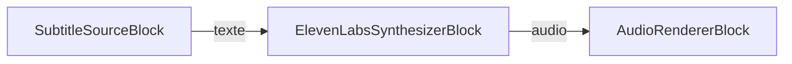
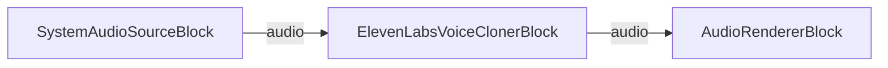

# Blocs ElevenLabs

[Media Blocks SDK .Net](https://www.visioforge.com/media-blocks-sdk-net){ .md-button .md-button--primary target="_blank" }

## Vue d'ensemble

Les blocs ElevenLabs intègrent l'audio IA d'[ElevenLabs](https://elevenlabs.io/) directement dans vos pipelines [Media Blocks SDK .NET](https://www.visioforge.com/media-blocks-sdk-net). Deux blocs reposant sur le cloud sont disponibles :

- [`ElevenLabsSynthesizerBlock`](#synthetiseur-elevenlabs) — synthèse vocale : reçoit du texte en entrée et produit de l'audio vocal.
- [`ElevenLabsVoiceClonerBlock`](#cloneur-de-voix-elevenlabs) — clonage de voix : reçoit de l'audio en entrée et le restitue dans une voix clonée.

Les deux blocs appellent l'API cloud d'ElevenLabs : ils nécessitent donc une **clé d'API ElevenLabs** valide et un accès réseau. Obtenez une clé depuis le [tableau de bord ElevenLabs](https://elevenlabs.io/app). Chaque bloc expose une méthode statique `IsAvailable()` qui vous permet de vérifier que le plugin GStreamer ElevenLabs sous-jacent est présent avant de créer une instance.

## Synthétiseur ElevenLabs

Le bloc `ElevenLabsSynthesizerBlock` convertit un flux de texte en audio parlé à l'aide de l'API de synthèse vocale d'ElevenLabs. Il possède un pad d'entrée de texte et un pad de sortie audio, ce qui vous permet d'acheminer la parole synthétisée vers un encodeur, un moteur de rendu ou un mélangeur.

Configurez-le avec `ElevenLabsSynthesizerSettings`. Le constructeur prend la clé d'API ; les paramètres supplémentaires les plus courants sont le `VoiceId` (la voix ElevenLabs à utiliser), le `ModelId` et un `LanguageCode` ISO 639-1 facultatif.

### Informations sur le bloc

Nom : ElevenLabsSynthesizerBlock.

| Direction du pad | Type de média | Nombre de pads |
| --- | :---: | :---: |
| Entrée | text | un |
| Sortie audio | audio/x-raw | un |

### Paramètres

| Propriété | Type | Valeur par défaut | Description |
| --- | --- | --- | --- |
| `ApiKey` | `string` | — | Clé d'API ElevenLabs (définie via le constructeur). |
| `VoiceId` | `string` | `"9BWtsMINqrJLrRacOk9x"` | ID de voix ElevenLabs. Voir la [bibliothèque de voix](https://elevenlabs.io/app/voice-library). |
| `ModelId` | `string` | `"eleven_flash_v2_5"` | ID de modèle ElevenLabs. |
| `LanguageCode` | `string` | `null` | Code de langue ISO 639-1 facultatif, utile avec certains modèles. |
| `Latency` | `uint` | `2000` | Millisecondes de latence à autoriser pour ElevenLabs. |
| `MaxOverflow` | `uint` | `2000` | Millisecondes pendant lesquelles un repère textuel peut dépasser sa durée (mode compression). |
| `MaxPreviousRequests` | `uint` | `0` | Nombre d'identifiants de requêtes précédentes à suivre pour la continuité. |
| `Overflow` | `ElevenLabsOverflow` | `Clip` | Traitement de l'audio plus long que le texte d'entrée : `Clip`, `Overlap` ou `Shift`. |
| `RetryWithSpeed` | `bool` | `true` | Réessayer avec une vitesse plus élevée lorsque la synthèse produit une durée plus longue. |
| `UseVoiceIdEvents` | `bool` | `true` | Utiliser les événements `elevenlabs/speaker-voice` reçus pour choisir la voix actuelle. |

### Le pipeline d'exemple



### Exemple de code

```csharp
using VisioForge.Core.MediaBlocks;
using VisioForge.Core.MediaBlocks.AudioRendering;
using VisioForge.Core.MediaBlocks.ElevenLabs;
using VisioForge.Core.MediaBlocks.Sources;
using VisioForge.Core.Types.X.ElevenLabs;
using VisioForge.Core.Types.X.Sources;

var pipeline = new MediaBlocksPipeline();

// Paramètres de synthèse vocale. Remplacez par votre clé d'API ElevenLabs.
var ttsSettings = new ElevenLabsSynthesizerSettings("YOUR_ELEVENLABS_API_KEY")
{
    VoiceId = "9BWtsMINqrJLrRacOk9x",
    ModelId = "eleven_flash_v2_5",
    Overflow = ElevenLabsOverflow.Clip
};

var synthesizer = new ElevenLabsSynthesizerBlock(ttsSettings);

// Source du texte à énoncer (par ex. un fichier de sous-titres/texte).
var textSource = new SubtitleSourceBlock(new SubtitleSourceSettings("script.srt"));

// Restitue la parole synthétisée vers le périphérique de sortie audio par défaut.
var audioRenderer = new AudioRendererBlock();

pipeline.Connect(textSource.Output, synthesizer.Input);
pipeline.Connect(synthesizer.Output, audioRenderer.Input);

await pipeline.StartAsync();
```

## Cloneur de voix ElevenLabs

Le bloc `ElevenLabsVoiceClonerBlock` reçoit un flux audio, clone la voix du locuteur avec l'API ElevenLabs et produit de l'audio restitué dans cette voix clonée. Il possède un pad d'entrée audio et un pad de sortie audio, ce qui lui permet de s'insérer dans un pipeline entre une source audio et un puits ou un encodeur.

Configurez-le avec `ElevenLabsVoiceClonerSettings`. Le constructeur prend la clé d'API. Par défaut, le bloc demande à ElevenLabs de supprimer le bruit de fond et stocke 10 secondes d'audio par mise à jour de voix ; définissez `Speaker` pour traiter tout l'audio entrant comme un seul locuteur et ignorer la diarisation.

### Informations sur le bloc

Nom : ElevenLabsVoiceClonerBlock.

| Direction du pad | Type de média | Nombre de pads |
| --- | :---: | :---: |
| Entrée audio | audio/x-raw | un |
| Sortie audio | audio/x-raw | un |

### Paramètres

| Propriété | Type | Valeur par défaut | Description |
| --- | --- | --- | --- |
| `ApiKey` | `string` | — | Clé d'API ElevenLabs (définie via le constructeur). |
| `RemoveBackgroundNoise` | `bool` | `true` | Demander à ElevenLabs de supprimer le bruit de fond. |
| `SegmentDuration` | `uint` | `10000` | Millisecondes d'audio à stocker avant de créer/mettre à jour une voix. |
| `Speaker` | `string` | `null` | Nom de locuteur facultatif. Lorsqu'il est défini, tout l'audio est traité comme un seul locuteur (pas de diarisation). |

### Le pipeline d'exemple



### Exemple de code

```csharp
using VisioForge.Core.MediaBlocks;
using VisioForge.Core.MediaBlocks.AudioRendering;
using VisioForge.Core.MediaBlocks.ElevenLabs;
using VisioForge.Core.MediaBlocks.Sources;
using VisioForge.Core.Types.X.ElevenLabs;

var pipeline = new MediaBlocksPipeline();

// Paramètres de clonage de voix. Remplacez par votre clé d'API ElevenLabs.
var clonerSettings = new ElevenLabsVoiceClonerSettings("YOUR_ELEVENLABS_API_KEY")
{
    RemoveBackgroundNoise = true,
    SegmentDuration = 10000,
    Speaker = "narrator"
};

var cloner = new ElevenLabsVoiceClonerBlock(clonerSettings);

// Source audio à cloner (capture de l'audio système dans cet exemple).
var audioSource = new SystemAudioSourceBlock();

// Restitue la voix clonée vers le périphérique de sortie audio par défaut.
var audioRenderer = new AudioRendererBlock();

pipeline.Connect(audioSource.Output, cloner.Input);
pipeline.Connect(cloner.Output, audioRenderer.Input);

await pipeline.StartAsync();
```

## Disponibilité

Appelez `ElevenLabsSynthesizerBlock.IsAvailable()` ou `ElevenLabsVoiceClonerBlock.IsAvailable()` pour vérifier que les blocs ElevenLabs sont disponibles dans l'environnement actuel avant de créer une instance.

## Plateformes

Windows, macOS, Linux, iOS, Android.
