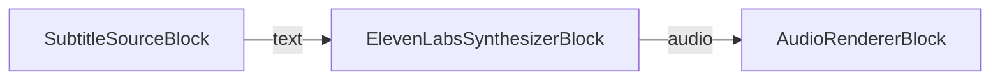
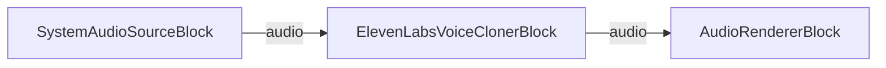

# ElevenLabs Blocks

[Media Blocks SDK .Net](https://www.visioforge.com/media-blocks-sdk-net){ .md-button .md-button--primary target="_blank" }

## Overview

The ElevenLabs blocks bring [ElevenLabs](https://elevenlabs.io/) AI audio directly into your [Media Blocks SDK .NET](https://www.visioforge.com/media-blocks-sdk-net) pipelines. Two cloud-backed blocks are available:

- [`ElevenLabsSynthesizerBlock`](#elevenlabs-synthesizer) — text-to-speech: takes text input and produces speech audio.
- [`ElevenLabsVoiceClonerBlock`](#elevenlabs-voice-cloner) — voice cloning: takes audio input and re-renders it in a cloned voice.

Both blocks call the ElevenLabs cloud API, so they require a valid **ElevenLabs API key** and network access. Get a key from the [ElevenLabs dashboard](https://elevenlabs.io/app). Each block exposes a static `IsAvailable()` method so you can verify the underlying GStreamer ElevenLabs plugin is present before creating an instance.

## ElevenLabs Synthesizer

The `ElevenLabsSynthesizerBlock` converts a text stream into spoken audio using the ElevenLabs text-to-speech API. It has a text input pad and an audio output pad, so you can route the synthesized speech into an encoder, a renderer, or a mixer.

Configure it with `ElevenLabsSynthesizerSettings`. The constructor takes the API key; the most common extra settings are the `VoiceId` (which ElevenLabs voice to use), the `ModelId`, and an optional ISO 639-1 `LanguageCode`.

### Block info

Name: ElevenLabsSynthesizerBlock.

| Pin direction | Media type | Pins count |
| --- | :---: | :---: |
| Input | text | one |
| Output audio | audio/x-raw | one |

### Settings

| Property | Type | Default | Description |
| --- | --- | --- | --- |
| `ApiKey` | `string` | — | ElevenLabs API key (set via the constructor). |
| `VoiceId` | `string` | `"9BWtsMINqrJLrRacOk9x"` | ElevenLabs Voice ID. See the [voice library](https://elevenlabs.io/app/voice-library). |
| `ModelId` | `string` | `"eleven_flash_v2_5"` | ElevenLabs Model ID. |
| `LanguageCode` | `string` | `null` | Optional ISO 639-1 language code, useful with certain models. |
| `Latency` | `uint` | `2000` | Milliseconds of latency to allow ElevenLabs. |
| `MaxOverflow` | `uint` | `2000` | Milliseconds a text cue may overflow its duration (compress mode). |
| `MaxPreviousRequests` | `uint` | `0` | How many previous request IDs to track for continuity. |
| `Overflow` | `ElevenLabsOverflow` | `Clip` | How audio longer than the input text is handled: `Clip`, `Overlap`, or `Shift`. |
| `RetryWithSpeed` | `bool` | `true` | Retry with higher speed when synthesis produces a longer duration. |
| `UseVoiceIdEvents` | `bool` | `true` | Use received `elevenlabs/speaker-voice` events to pick the current voice. |

### The sample pipeline



### Sample code

```csharp
using VisioForge.Core.MediaBlocks;
using VisioForge.Core.MediaBlocks.AudioRendering;
using VisioForge.Core.MediaBlocks.ElevenLabs;
using VisioForge.Core.MediaBlocks.Sources;
using VisioForge.Core.Types.X.ElevenLabs;
using VisioForge.Core.Types.X.Sources;

var pipeline = new MediaBlocksPipeline();

// Text-to-speech settings. Replace with your ElevenLabs API key.
var ttsSettings = new ElevenLabsSynthesizerSettings("YOUR_ELEVENLABS_API_KEY")
{
    VoiceId = "9BWtsMINqrJLrRacOk9x",
    ModelId = "eleven_flash_v2_5",
    Overflow = ElevenLabsOverflow.Clip
};

var synthesizer = new ElevenLabsSynthesizerBlock(ttsSettings);

// Source of text to speak (e.g. a subtitle/text file).
var textSource = new SubtitleSourceBlock(new SubtitleSourceSettings("script.srt"));

// Render the synthesized speech to the default audio output device.
var audioRenderer = new AudioRendererBlock();

pipeline.Connect(textSource.Output, synthesizer.Input);
pipeline.Connect(synthesizer.Output, audioRenderer.Input);

await pipeline.StartAsync();
```

## ElevenLabs Voice Cloner

The `ElevenLabsVoiceClonerBlock` takes an audio stream, clones the speaker's voice with the ElevenLabs API, and produces audio re-rendered in that cloned voice. It has an audio input pad and an audio output pad, so it slots into a pipeline between an audio source and a sink or encoder.

Configure it with `ElevenLabsVoiceClonerSettings`. The constructor takes the API key. By default the block asks ElevenLabs to remove background noise and stores 10 seconds of audio per voice update; set `Speaker` to treat all incoming audio as a single speaker and skip diarization.

### Block info

Name: ElevenLabsVoiceClonerBlock.

| Pin direction | Media type | Pins count |
| --- | :---: | :---: |
| Input audio | audio/x-raw | one |
| Output audio | audio/x-raw | one |

### Settings

| Property | Type | Default | Description |
| --- | --- | --- | --- |
| `ApiKey` | `string` | — | ElevenLabs API key (set via the constructor). |
| `RemoveBackgroundNoise` | `bool` | `true` | Ask ElevenLabs to remove background noise. |
| `SegmentDuration` | `uint` | `10000` | Milliseconds of audio to store before creating/updating a voice. |
| `Speaker` | `string` | `null` | Optional speaker name. When set, all audio is treated as one speaker (no diarization). |

### The sample pipeline



### Sample code

```csharp
using VisioForge.Core.MediaBlocks;
using VisioForge.Core.MediaBlocks.AudioRendering;
using VisioForge.Core.MediaBlocks.ElevenLabs;
using VisioForge.Core.MediaBlocks.Sources;
using VisioForge.Core.Types.X.ElevenLabs;

var pipeline = new MediaBlocksPipeline();

// Voice cloning settings. Replace with your ElevenLabs API key.
var clonerSettings = new ElevenLabsVoiceClonerSettings("YOUR_ELEVENLABS_API_KEY")
{
    RemoveBackgroundNoise = true,
    SegmentDuration = 10000,
    Speaker = "narrator"
};

var cloner = new ElevenLabsVoiceClonerBlock(clonerSettings);

// Audio source to clone (system audio capture in this example).
var audioSource = new SystemAudioSourceBlock();

// Render the cloned voice to the default audio output device.
var audioRenderer = new AudioRendererBlock();

pipeline.Connect(audioSource.Output, cloner.Input);
pipeline.Connect(cloner.Output, audioRenderer.Input);

await pipeline.StartAsync();
```

## Availability

Call `ElevenLabsSynthesizerBlock.IsAvailable()` or `ElevenLabsVoiceClonerBlock.IsAvailable()` to verify the ElevenLabs blocks are available in the current environment before creating an instance.

## Platforms

Windows, macOS, Linux, iOS, Android.
