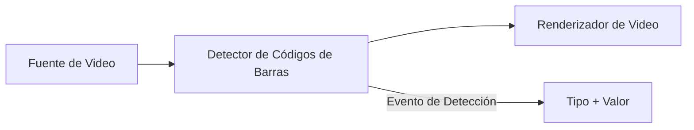

# Cómo Crear un Escáner de Códigos de Barras y Lector de Códigos QR en C# .NET

[SDK de Media Blocks .Net](https://www.visioforge.com/media-blocks-sdk-net){ .md-button .md-button--primary target="_blank" }

## Introducción

¿Necesita leer códigos de barras o escanear códigos QR desde una cámara en vivo en C#? A diferencia de las bibliotecas de códigos de barras que solo procesan imágenes, VisioForge Media Blocks SDK escanea códigos de barras directamente desde streams de video en tiempo real — [webcams](../../videocapture/guides/save-webcam-video.md), [cámaras IP](../../videocapture/video-sources/ip-cameras/index.md), [fuentes RTSP](../../general/network-streaming/rtsp.md), archivos de video y captura de pantalla. Esto lo convierte en el SDK ideal de escáner de códigos de barras .NET para aplicaciones de vigilancia, inventario y automatización que procesan video en vivo.

Esta guía le muestra cómo construir un lector de códigos de barras y escáner de códigos QR multiplataforma en C# que funciona en Windows, Android, iOS, macOS y Linux usando .NET MAUI, Avalonia o WPF.

## ¿Por Qué Usar Escaneo de Códigos de Barras Basado en Video?

### Ventajas Clave sobre las Bibliotecas Solo de Imágenes

- **Escaneo de streams de video en tiempo real**: Detectar códigos de barras continuamente desde webcam, cámara IP o feeds RTSP — no solo imágenes estáticas
- **Soporte .NET multiplataforma**: Un solo código fuente para Windows, Android, iOS, macOS y Linux con MAUI, Avalonia, WPF, WinForms, Blazor y aplicaciones de consola
- **Arquitectura de pipeline**: Combinar detección de códigos de barras con vista previa de video, grabación y otro procesamiento en un solo pipeline
- **Múltiples fuentes de entrada**: Escanear desde cámaras, archivos de video, captura de pantalla o [streams de red](../../general/network-streaming/rtsp.md)
- **Soporte completo de formatos**: Códigos QR, DataMatrix, Code128, Code39, EAN-13, UPC-A, PDF417, Aztec y muchos otros formatos de códigos de barras 1D/2D
- **API basada en eventos**: Evento simple `OnBarcodeDetected` que entrega tipo de código de barras, valor y marca de tiempo

## Formatos de Códigos de Barras y QR Soportados

El escáner de códigos de barras en C# soporta una amplia gama de formatos de códigos de barras 1D y 2D:

### Códigos de Barras 2D

- **QR Code**: Formato de código de barras 2D más popular, ampliamente usado en aplicaciones móviles
- **DataMatrix**: Formato compacto ideal para artículos pequeños
- **PDF417**: Usado en licencias de conducir y tarjetas de embarque
- **Aztec**: Formato compacto usado en boletos de transporte

### Códigos de Barras 1D

- **Code 128**: Formato de alta densidad para datos alfanuméricos
- **Code 39**: Formato alfanumérico simple
- **EAN-13/EAN-8**: Número de Artículo Europeo para productos minoristas
- **UPC-A/UPC-E**: Código Universal de Producto para minoristas
- **Codabar**: Usado en bibliotecas y bancos de sangre
- **ITF**: Intercalado 2 de 5 para envío y distribución

## Arquitectura del Pipeline del Escáner de Códigos de Barras

El SDK de Media Blocks utiliza una arquitectura basada en pipeline donde los fotogramas de video fluyen a través de bloques conectados para la detección de códigos de barras en tiempo real:



Este enfoque modular le permite:

- Intercambiar fácilmente fuentes de entrada (cámara, archivo, stream)
- Agregar bloques de procesamiento adicionales (filtros, codificadores)
- Dirigir la salida a múltiples destinos simultáneamente

## Cómo Leer Códigos de Barras desde Cámara en C#

Construya un escáner de códigos de barras que lee desde una webcam o dispositivo de cámara en C# paso a paso.

### Paso 1: Configuración del Proyecto

Primero, asegúrese de tener los paquetes NuGet necesarios instalados:

```bash
# Para aplicaciones Windows
dotnet add package VisioForge.CrossPlatform.Core.Windows.x64
dotnet add package VisioForge.CrossPlatform.Libav.Windows.x64

# Para aplicaciones Android
dotnet add package VisioForge.CrossPlatform.Core.Android

# Para aplicaciones iOS
dotnet add package VisioForge.CrossPlatform.Core.iOS

# Para aplicaciones macOS
dotnet add package VisioForge.CrossPlatform.Core.macCatalyst
```

Agregue los espacios de nombres requeridos a su código:

```csharp
using VisioForge.Core;
using VisioForge.Core.MediaBlocks;
using VisioForge.Core.MediaBlocks.Sources;
using VisioForge.Core.MediaBlocks.Special;
using VisioForge.Core.MediaBlocks.VideoRendering;
using VisioForge.Core.Types;
using VisioForge.Core.Types.Events;
using VisioForge.Core.Types.X;
using VisioForge.Core.Types.X.Sources;
```

### Paso 2: Inicialización del SDK

Antes de usar cualquier función del SDK, inicialice el motor de VisioForge:

```csharp
// Inicializar el SDK (requerido en el primer uso)
await VisioForgeX.InitSDKAsync();
```

Este paso de inicialización construye el registro interno y prepara el motor. Solo necesita realizarse una vez cuando su aplicación inicia.

### Paso 3: Enumeración de Fuentes de Video

Antes de capturar video, necesita descubrir las cámaras disponibles:

```csharp
// Iniciar monitoreo de fuentes de video
await DeviceEnumerator.Shared.StartVideoSourceMonitorAsync();

// Obtener lista de cámaras disponibles
var cameras = await DeviceEnumerator.Shared.VideoSourcesAsync();

// Mostrar cámaras disponibles
foreach (var camera in cameras)
{
    Console.WriteLine($"Cámara: {camera.DisplayName}");

    // Listar formatos soportados
    foreach (var format in camera.VideoFormats)
    {
        Console.WriteLine($"  Formato: {format.Name}");
    }
}
```

### Paso 4: Creación del Pipeline

Cree un pipeline y configure los bloques necesarios:

```csharp
// Crear el pipeline
var pipeline = new MediaBlocksPipeline();
pipeline.OnError += Pipeline_OnError;

// Configurar fuente de video
var device = cameras.First();
var formatItem = device.GetHDOrAnyVideoFormatAndFrameRate(out var frameRate);

var videoSourceSettings = new VideoCaptureDeviceSourceSettings(device)
{
    Format = formatItem.ToFormat()
};
videoSourceSettings.Format.FrameRate = frameRate;

// Crear bloque de fuente de video
var videoSource = new SystemVideoSourceBlock(videoSourceSettings);

// Crear bloque detector de códigos de barras
var barcodeDetector = new BarcodeDetectorBlock(BarcodeDetectorMode.InputOutput);
barcodeDetector.OnBarcodeDetected += BarcodeDetector_OnBarcodeDetected;

// Crear bloque renderizador de video (para vista previa)
var videoRenderer = new VideoRendererBlock(pipeline, videoView);

// Conectar los bloques
pipeline.Connect(videoSource.Output, barcodeDetector.Input);
pipeline.Connect(barcodeDetector.Output, videoRenderer.Input);
```

### Paso 5: Manejo de Eventos de Detección de Códigos de Barras

Implemente el manejador de eventos para procesar códigos de barras detectados:

```csharp
private void BarcodeDetector_OnBarcodeDetected(object sender, BarcodeDetectorEventArgs e)
{
    // Este evento se llama cuando se detecta un código de barras
    Console.WriteLine($"Detectado: {e.BarcodeType} = {e.Value}");

    // Actualizar UI (usar dispatcher para seguridad de hilos)
    Dispatcher.Invoke(() =>
    {
        BarcodeTypeLabel.Text = e.BarcodeType;
        BarcodeValueLabel.Text = e.Value;
        LastDetectionTime.Text = DateTime.Now.ToString("HH:mm:ss.fff");
    });
}
```

### Paso 6: Inicio y Detención del Pipeline

Controle el ciclo de vida del pipeline:

```csharp
// Iniciar escaneo
await pipeline.StartAsync();

// Detener escaneo
await pipeline.StopAsync();

// Pausar escaneo
await pipeline.PauseAsync();

// Reanudar escaneo
await pipeline.ResumeAsync();
```

### Paso 7: Limpieza

Libere los recursos correctamente cuando termine:

```csharp
// Eliminar manejadores de eventos
barcodeDetector.OnBarcodeDetected -= BarcodeDetector_OnBarcodeDetected;
pipeline.OnError -= Pipeline_OnError;

// Detener y limpiar
await pipeline.StopAsync();
pipeline.ClearBlocks();
pipeline.Dispose();

// Destruir SDK (al salir de la aplicación)
VisioForgeX.DestroySDK();
```

## Funciones Avanzadas de Lectura de Códigos de Barras

### Prevención de Detección de Duplicados {#prevencion-de-deteccion-de-duplicados}

Para prevenir múltiples detecciones del mismo código de barras:

```csharp
private Dictionary<string, DateTime> _recentDetections = new();
private TimeSpan _deduplicationWindow = TimeSpan.FromSeconds(2);

private void BarcodeDetector_OnBarcodeDetected(object sender, BarcodeDetectorEventArgs e)
{
    string key = $"{e.BarcodeType}:{e.Value}";

    // Verificar si este código de barras fue detectado recientemente
    if (_recentDetections.TryGetValue(key, out var lastTime))
    {
        if (DateTime.Now - lastTime < _deduplicationWindow)
        {
            return; // Omitir duplicado
        }
    }

    // Registrar esta detección
    _recentDetections[key] = DateTime.Now;

    // Procesar el código de barras
    ProcessBarcode(e.BarcodeType, e.Value);
}
```

### Escanear Códigos de Barras desde Archivos de Video, Captura de Pantalla y Streams RTSP

El SDK soporta varias fuentes de entrada además de cámaras locales:

#### Leer Códigos de Barras desde Archivo de Video

```csharp
var fileSettings = await UniversalSourceSettings.CreateAsync(
    new Uri(@"C:\Videos\barcode-video.mp4"));
var fileSource = new UniversalSourceBlock(fileSettings);

pipeline.Connect(fileSource.VideoOutput, barcodeDetector.Input);
```

#### Escanear Códigos de Barras desde Captura de Pantalla

```csharp
var screenSource = new ScreenSourceBlock(
    new ScreenCaptureSourceSettings()
    {
        DisplayIndex = 0, // Monitor principal
        FrameRate = new VideoFrameRate(10) // 10 FPS
    });

pipeline.Connect(screenSource.Output, barcodeDetector.Input);
```

#### Escanear Códigos de Barras desde Stream RTSP de Cámara IP

```csharp
var streamSettings = await UniversalSourceSettings.CreateAsync(
    new Uri("rtsp://camera-ip:554/stream"));
var streamSource = new UniversalSourceBlock(streamSettings);

pipeline.Connect(streamSource.VideoOutput, barcodeDetector.Input);
```

### Seguimiento del Historial de Detecciones

Mantener un historial de códigos de barras detectados:

```csharp
public class BarcodeDetection
{
    public string Type { get; set; }
    public string Value { get; set; }
    public DateTime Timestamp { get; set; }
}

private ObservableCollection<BarcodeDetection> _detectionHistory = new();
private int _maxHistorySize = 100;

private void BarcodeDetector_OnBarcodeDetected(object sender, BarcodeDetectorEventArgs e)
{
    var detection = new BarcodeDetection
    {
        Type = e.BarcodeType,
        Value = e.Value,
        Timestamp = DateTime.Now
    };

    // Agregar al inicio de la lista
    _detectionHistory.Insert(0, detection);

    // Mantener tamaño máximo
    while (_detectionHistory.Count > _maxHistorySize)
    {
        _detectionHistory.RemoveAt(_detectionHistory.Count - 1);
    }
}
```

### Manejo de Errores

Implementar manejo robusto de errores:

```csharp
private void Pipeline_OnError(object sender, ErrorsEventArgs e)
{
    Debug.WriteLine($"Error del Pipeline: {e.Message}");

    // Mostrar mensaje amigable al usuario
    Dispatcher.Invoke(() =>
    {
        mmLog.Text += e.Message + Environment.NewLine;
    });
}
```

## Configuración de Plataforma: Escaneo de Códigos de Barras en Android, iOS y macOS

### Permisos de Cámara en Android

En Android, debe solicitar permisos de cámara antes de escanear códigos de barras:

```csharp
private async Task<bool> RequestCameraPermissionAsync()
{
    var status = await Permissions.CheckStatusAsync<Permissions.Camera>();

    if (status != PermissionStatus.Granted)
    {
        status = await Permissions.RequestAsync<Permissions.Camera>();
    }

    return status == PermissionStatus.Granted;
}
```

Agregar al AndroidManifest.xml:

```xml
<uses-permission android:name="android.permission.CAMERA" />
<uses-feature android:name="android.hardware.camera" />
<uses-feature android:name="android.hardware.camera.autofocus" />
```

### Permisos de Cámara en iOS

Agregar al Info.plist:

```xml
<key>NSCameraUsageDescription</key>
<string>Esta aplicación necesita acceso a la cámara para escanear códigos de barras y códigos QR</string>
```

### Permisos de Cámara en macOS

Para macOS y Mac Catalyst, agregar al Entitlements.plist:

```xml
<key>com.apple.security.device.camera</key>
<true/>
```

## Optimización del Rendimiento del Escáner de Códigos de Barras en .NET

### Optimización de Tasa de Fotogramas

Equilibrar la velocidad de detección de códigos de barras y el uso de CPU:

```csharp
// Tasa de fotogramas más baja para mejor rendimiento
videoSourceSettings.Format.FrameRate = new VideoFrameRate(15); // 15 FPS en lugar de 30

// Para captura de pantalla, usar tasas de fotogramas aún más bajas
screenSourceSettings.FrameRate = new VideoFrameRate(5); // 5 FPS
```

### Consideraciones de Resolución

Una resolución más baja puede mejorar el rendimiento sin afectar significativamente la detección:

```csharp
// Elegir un formato de menor resolución
var format = device.VideoFormats
    .Where(f => f.Width <= 1280 && f.Height <= 720)
    .OrderByDescending(f => f.Width * f.Height)
    .FirstOrDefault();
```

### Selección del Modo del Detector

El `BarcodeDetectorBlock` soporta diferentes modos:

```csharp
// Modo InputOutput: Pasa el video a través para vista previa (predeterminado)
var detector = new BarcodeDetectorBlock(BarcodeDetectorMode.InputOutput);

// Modo InputOnly: Sin salida de video, mejor rendimiento
var detector = new BarcodeDetectorBlock(BarcodeDetectorMode.InputOnly);
```

## Escáner de Códigos de Barras para .NET MAUI, Avalonia y WPF

### Escáner de Códigos de Barras en .NET MAUI

```csharp
public partial class MainPage : ContentPage
{
    private MediaBlocksPipeline _pipeline;
    private BarcodeDetectorBlock _barcodeDetector;

    public MainPage()
    {
        InitializeComponent();
        Loaded += MainPage_Loaded;
    }

    private async void MainPage_Loaded(object sender, EventArgs e)
    {
        await VisioForgeX.InitSDKAsync();

        #if __ANDROID__ || __IOS__ || __MACCATALYST__
        await RequestCameraPermissionAsync();
        #endif

        _pipeline = new MediaBlocksPipeline();
        // ... configurar pipeline
    }
}
```

### Escáner de Códigos de Barras en Avalonia

```csharp
public partial class MainWindow : Window
{
    private MediaBlocksPipeline _pipeline;
    private BarcodeDetectorBlock _barcodeDetector;

    public MainWindow()
    {
        InitializeComponent();
        Loaded += MainWindow_Loaded;
    }

    private async void MainWindow_Loaded(object sender, RoutedEventArgs e)
    {
        await VisioForgeX.InitSDKAsync();

        _pipeline = new MediaBlocksPipeline();
        // ... configurar pipeline
    }
}
```

## Casos de Uso del Escáner de Códigos de Barras: Inventario, Boletos y Pagos

### Gestión de Inventario con Escaneo de Códigos de Barras

Rastrear productos en almacenes usando escaneo de códigos de barras:

```csharp
private async void ProcessInventoryBarcode(string barcodeValue)
{
    // Buscar producto en la base de datos
    var product = await _database.GetProductByBarcodeAsync(barcodeValue);

    if (product != null)
    {
        // Actualizar cantidad de inventario
        product.Quantity++;
        await _database.SaveChangesAsync();

        // Mostrar confirmación
        StatusLabel.Text = $"Agregado: {product.Name}";
    }
    else
    {
        StatusLabel.Text = "Producto no encontrado";
    }
}
```

### Escaneo de Boletos QR para Eventos

Escanear boletos con códigos QR en entradas de eventos:

```csharp
private async void ProcessTicketBarcode(string ticketCode)
{
    var ticket = await _ticketService.ValidateTicketAsync(ticketCode);

    if (ticket.IsValid && !ticket.IsUsed)
    {
        await _ticketService.MarkAsUsedAsync(ticketCode);
        PlaySuccessSound();
        ShowGreenLight();
    }
    else
    {
        PlayErrorSound();
        ShowRedLight();
        StatusLabel.Text = ticket.IsUsed ? "Ya utilizado" : "Boleto inválido";
    }
}
```

### Procesamiento de Pagos con Códigos QR

Escanear códigos QR para pagos móviles:

```csharp
private async void ProcessPaymentQRCode(string qrData)
{
    if (IsPaymentQRCode(qrData))
    {
        var paymentInfo = ParsePaymentData(qrData);

        // Mostrar diálogo de confirmación de pago
        var result = await DisplayAlert(
            "Confirmar Pago",
            $"¿Pagar ${paymentInfo.Amount} a {paymentInfo.Recipient}?",
            "Pagar",
            "Cancelar");

        if (result)
        {
            await ProcessPaymentAsync(paymentInfo);
        }
    }
}
```

## Solución de Problemas del Escáner de Códigos de Barras en C#

### Problema: No se Detectan Códigos de Barras

**Soluciones:**

1. Asegurar iluminación adecuada — los códigos de barras necesitan visibilidad clara
2. Verificar el enfoque de la cámara — algunas cámaras necesitan tiempo para enfocar
3. Verificar que el código de barras esté dentro del campo de visión de la cámara
4. Intentar ajustar la distancia de la cámara (15-30cm típicamente óptimo)
5. Verificar que el formato del código de barras sea soportado

### Problema: Múltiples Detecciones del Mismo Código de Barras

**Solución:** Implementar prevención de detección de duplicados (mostrado anteriormente)

### Problema: Rendimiento Bajo

**Soluciones:**

1. Reducir la resolución del video
2. Reducir la tasa de fotogramas
3. Usar `BarcodeDetectorMode.InputOnly` si no se necesita vista previa
4. Cerrar otras aplicaciones para liberar recursos del sistema

### Problema: Cámara No Encontrada

**Soluciones:**

1. Verificar que los permisos de cámara estén otorgados
2. Verificar que la cámara no esté en uso por otra aplicación
3. Reiniciar el dispositivo
4. Intentar enumerar dispositivos después de un breve retraso

## Mejores Prácticas

1. **Siempre Inicializar el SDK Temprano**: Llamar a `InitSDKAsync()` durante el inicio de la aplicación
2. **Solicitar Permisos Primero**: Verificar y solicitar permisos de cámara antes de acceder a la cámara
3. **Manejar Errores con Gracia**: Implementar manejo adecuado de errores para todas las operaciones del pipeline
4. **Liberar Recursos Correctamente**: Siempre limpiar el pipeline y los bloques cuando termine
5. **Probar en Dispositivos Objetivo**: El rendimiento varía según el dispositivo — probar en hardware real
6. **Proporcionar Retroalimentación Visual**: Mostrar a los usuarios cuando se detectan códigos de barras exitosamente
7. **Considerar Escenarios Sin Conexión**: Almacenar en caché datos necesarios para procesamiento de códigos de barras sin conexión
8. **Implementar Registro de Eventos**: Registrar eventos de detección para depuración y análisis

## Proyectos de Ejemplo

Proyectos de ejemplo completos están disponibles en el SDK:

- **Lector de Códigos de Barras MAUI**: [Demo BarcodeReaderMB MAUI](https://github.com/visioforge/.Net-SDK-s-samples/tree/master/Media%20Blocks%20SDK/MAUI/BarcodeReaderMB)
- **Lector de Códigos de Barras Avalonia**: [Demo BarcodeReaderMB Avalonia](https://github.com/visioforge/.Net-SDK-s-samples/tree/master/Media%20Blocks%20SDK/Avalonia/BarcodeReaderMB)
- **Detección de Códigos de Barras WPF**: [Demo Detección de Códigos de Barras WPF](https://github.com/visioforge/.Net-SDK-s-samples/tree/master/Media%20Blocks%20SDK/WPF/CSharp/Barcode%20Detection%20Demo)

Estos ejemplos demuestran:

- Implementación completa de UI
- Selección y configuración de cámara
- Detección de códigos de barras en tiempo real
- Seguimiento del historial de detecciones
- Manejo de errores
- Compatibilidad multiplataforma

## Preguntas Frecuentes

### ¿Qué formatos de códigos de barras puedo escanear desde una cámara en C#?

El SDK soporta todos los formatos principales de códigos de barras 1D y 2D incluyendo QR Code, DataMatrix, PDF417, Aztec, Code 128, Code 39, EAN-13, EAN-8, UPC-A, UPC-E, Codabar e ITF. Todos los formatos pueden escanearse en tiempo real desde cualquier fuente de video — webcam, cámara IP, stream RTSP o archivo de video.

### ¿Puedo escanear códigos QR desde una cámara IP o stream RTSP?

Sí. Use `UniversalSourceBlock` con una URI RTSP para conectarse a cualquier cámara IP y escanear códigos de barras desde el stream de video en vivo. El pipeline maneja la decodificación, el buffering y la entrega de frames automáticamente. Consulte la [guía de streaming RTSP](../../general/network-streaming/rtsp.md) para detalles de conexión.

### ¿El escáner de códigos de barras funciona en Android, iOS y macOS?

Sí. El `BarcodeDetectorBlock` es completamente multiplataforma. Las aplicaciones .NET MAUI se ejecutan en Android e iOS; las aplicaciones Avalonia se ejecutan en macOS y Linux. Cada plataforma requiere permisos de cámara — consulte la sección de [Configuración de Plataforma](#configuracion-de-plataforma-escaneo-de-codigos-de-barras-en-android-ios-y-macos) para más detalles.

### ¿Cómo evito detecciones duplicadas de códigos de barras?

Implemente una ventana de deduplicación basada en tiempo. Almacene cada valor de código de barras detectado con una marca de tiempo y omita las detecciones que coincidan con una entrada reciente dentro de un intervalo configurable (típicamente 2 segundos). Vea el ejemplo de código de [Prevención de Detección de Duplicados](#prevencion-de-deteccion-de-duplicados) arriba.

### ¿Qué tasa de frames necesito para un escaneo confiable de códigos de barras?

Para la mayoría de los casos de uso, 10–15 FPS proporciona detección confiable con bajo uso de CPU. Los códigos de barras estáticos (etiquetas de almacén, estantes de productos) funcionan bien a 5 FPS. Los códigos de barras en movimiento rápido en una cinta transportadora pueden necesitar 25–30 FPS. Use la tasa de frames más baja que brinde resultados confiables para minimizar el consumo de recursos.

## Ver También

- [Captura de Video de Webcam en C#](../../videocapture/guides/save-webcam-video.md) — capturar y grabar video de webcam usando el mismo SDK
- [Streaming RTSP y Captura de Cámara IP](../../general/network-streaming/rtsp.md) — conectar a cámaras IP para escaneo de códigos de barras desde streams de red
- [Fuentes de Cámaras IP](../../videocapture/video-sources/ip-cameras/index.md) — configurar fuentes de cámaras ONVIF y RTSP
- [Grabación Pre-Evento](pre-event-recording.es.md) — combinar detección de códigos de barras con grabación activada por movimiento
- [Referencia de Bloques Especiales](../Special/index.es.md) — referencia API de BarcodeDetectorBlock
- [Primeros Pasos con Media Blocks](../GettingStarted/index.md) — fundamentos del pipeline
- [Despliegue Específico por Plataforma](../../deployment-x/index.md) — paquetes de dependencias nativas para todas las plataformas
