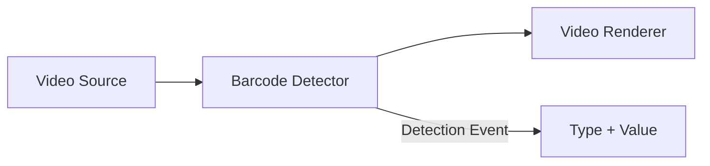

# Construire un lecteur de codes-barres et QR codes en C# .NET

[Media Blocks SDK .Net](https://www.visioforge.com/media-blocks-sdk-net){ .md-button .md-button--primary target="_blank" }

## Introduction

Vous devez lire des codes-barres ou scanner des QR codes depuis un flux caméra en direct en C# ? Contrairement aux bibliothèques de codes-barres limitées aux images, le VisioForge Media Blocks SDK scanne les codes-barres directement depuis des flux vidéo temps réel — [webcams](../../videocapture/guides/save-webcam-video.md), [caméras IP](../../videocapture/video-sources/ip-cameras/index.md), [sources RTSP](../../general/network-streaming/rtsp.md), fichiers vidéo et capture d'écran. C'est le SDK lecteur de codes-barres .NET idéal pour les applications de vidéosurveillance, d'inventaire et d'automatisation qui traitent de la vidéo en direct.

Ce guide vous accompagne dans la création d'un lecteur de codes-barres et de QR codes C# multiplateforme fonctionnant sous Windows, Android, iOS, macOS et Linux avec .NET MAUI, Avalonia ou WPF.

## Pourquoi utiliser la lecture de codes-barres basée sur la vidéo ?

### Avantages clés par rapport aux bibliothèques limitées aux images

- **Lecture en flux vidéo temps réel** : détectez les codes-barres en continu depuis une webcam, une caméra IP ou un flux RTSP — pas uniquement depuis des images statiques
- **Prise en charge multiplateforme .NET** : une base de code unique pour Windows, Android, iOS, macOS et Linux avec MAUI, Avalonia, WPF, WinForms, Blazor et applications console
- **Architecture en pipeline** : combinez la détection de codes-barres avec l'aperçu vidéo, l'enregistrement et d'autres traitements dans un même pipeline
- **Sources d'entrée multiples** : scannez depuis des caméras, fichiers vidéo, capture d'écran ou [flux réseau](../../general/network-streaming/rtsp.md)
- **Prise en charge complète des formats** : QR codes, DataMatrix, Code128, Code39, EAN-13, UPC-A, PDF417, Aztec et bien d'autres formats 1D/2D
- **API événementielle** : un simple événement `OnBarcodeDetected` fournit le type, la valeur et l'horodatage du code-barres

## Formats de codes-barres et QR codes pris en charge

Le lecteur de codes-barres C# prend en charge un large éventail de formats 1D et 2D :

### Codes-barres 2D

- **QR Code** : format 2D le plus populaire, largement utilisé dans les applications mobiles
- **DataMatrix** : format compact idéal pour les petits articles
- **PDF417** : utilisé dans les permis de conduire et les cartes d'embarquement
- **Aztec** : format compact utilisé dans les billets de transport

### Codes-barres 1D

- **Code 128** : format haute densité pour données alphanumériques
- **Code 39** : format alphanumérique simple
- **EAN-13/EAN-8** : European Article Number pour les produits de détail
- **UPC-A/UPC-E** : Universal Product Code pour le retail
- **Codabar** : utilisé dans les bibliothèques et banques de sang
- **ITF** : Interleaved 2 of 5 pour l'expédition et la distribution

## Architecture du pipeline de lecteur de codes-barres

Le Media Blocks SDK utilise une architecture basée sur des pipelines où les images vidéo circulent à travers des blocs connectés pour la détection temps réel des codes-barres :



Cette approche modulaire vous permet de :

- Permuter facilement les sources d'entrée (caméra, fichier, flux)
- Ajouter d'autres blocs de traitement (filtres, encodeurs)
- Acheminer la sortie vers plusieurs destinations simultanément

## Lire des codes-barres depuis une caméra en C#

Construisez pas à pas un lecteur de codes-barres qui lit depuis une webcam ou un périphérique caméra en C#.

### Étape 1 : configuration du projet

D'abord, assurez-vous que les paquets NuGet nécessaires sont installés :

```bash
# Pour les applications Windows
dotnet add package VisioForge.CrossPlatform.Core.Windows.x64
dotnet add package VisioForge.CrossPlatform.Libav.Windows.x64

# Pour les applications Android
dotnet add package VisioForge.CrossPlatform.Core.Android

# Pour les applications iOS
dotnet add package VisioForge.CrossPlatform.Core.iOS

# Pour les applications macOS
dotnet add package VisioForge.CrossPlatform.Core.macCatalyst
```

Ajoutez les espaces de noms requis dans votre code :

```csharp
using VisioForge.Core;
using VisioForge.Core.MediaBlocks;
using VisioForge.Core.MediaBlocks.Sources;
using VisioForge.Core.MediaBlocks.Special;
using VisioForge.Core.MediaBlocks.VideoRendering;
using VisioForge.Core.Types;
using VisioForge.Core.Types.Events;
using VisioForge.Core.Types.X;
using VisioForge.Core.Types.X.Sources;
```

### Étape 2 : initialisation du SDK

Avant d'utiliser une fonctionnalité du SDK, initialisez le moteur VisioForge :

```csharp
// Initialiser le SDK (obligatoire à la première utilisation)
await VisioForgeX.InitSDKAsync();
```

Cette étape d'initialisation construit le registre interne et prépare le moteur. Elle ne doit être effectuée qu'une seule fois au démarrage de votre application.

### Étape 3 : énumération des sources vidéo

Avant de capturer la vidéo, vous devez découvrir les caméras disponibles :

```csharp
// Démarrer la surveillance des sources vidéo
await DeviceEnumerator.Shared.StartVideoSourceMonitorAsync();

// Obtenir la liste des caméras disponibles
var cameras = await DeviceEnumerator.Shared.VideoSourcesAsync();

// Afficher les caméras disponibles
foreach (var camera in cameras)
{
    Console.WriteLine($"Camera: {camera.DisplayName}");

    // Lister les formats pris en charge
    foreach (var format in camera.VideoFormats)
    {
        Console.WriteLine($"  Format: {format.Name}");
    }
}
```

### Étape 4 : création du pipeline

Créez un pipeline et configurez les blocs nécessaires :

```csharp
// Créer le pipeline
var pipeline = new MediaBlocksPipeline();
pipeline.OnError += Pipeline_OnError;

// Configurer la source vidéo
var device = cameras.First();
var formatItem = device.GetHDOrAnyVideoFormatAndFrameRate(out var frameRate);

var videoSourceSettings = new VideoCaptureDeviceSourceSettings(device)
{
    Format = formatItem.ToFormat()
};
videoSourceSettings.Format.FrameRate = frameRate;

// Créer le bloc source vidéo
var videoSource = new SystemVideoSourceBlock(videoSourceSettings);

// Créer le bloc détecteur de codes-barres
var barcodeDetector = new BarcodeDetectorBlock(BarcodeDetectorMode.InputOutput);
barcodeDetector.OnBarcodeDetected += BarcodeDetector_OnBarcodeDetected;

// Créer le bloc moteur de rendu vidéo (pour l'aperçu)
var videoRenderer = new VideoRendererBlock(pipeline, videoView);

// Connecter les blocs
pipeline.Connect(videoSource.Output, barcodeDetector.Input);
pipeline.Connect(barcodeDetector.Output, videoRenderer.Input);
```

### Étape 5 : gestion des événements de détection de code-barres

Implémentez le gestionnaire d'événements pour traiter les codes-barres détectés :

```csharp
private void BarcodeDetector_OnBarcodeDetected(object sender, BarcodeDetectorEventArgs e)
{
    // Cet événement est appelé lorsqu'un code-barres est détecté
    Console.WriteLine($"Detected: {e.BarcodeType} = {e.Value}");

    // Mettre à jour l'interface utilisateur (utiliser le dispatcher pour la sécurité des threads)
    Dispatcher.Invoke(() =>
    {
        BarcodeTypeLabel.Text = e.BarcodeType;
        BarcodeValueLabel.Text = e.Value;
        LastDetectionTime.Text = DateTime.Now.ToString("HH:mm:ss.fff");
    });
}
```

### Étape 6 : démarrage et arrêt du pipeline

Contrôlez le cycle de vie du pipeline :

```csharp
// Démarrer la lecture
await pipeline.StartAsync();

// Arrêter la lecture
await pipeline.StopAsync();

// Mettre la lecture en pause
await pipeline.PauseAsync();

// Reprendre la lecture
await pipeline.ResumeAsync();
```

### Étape 7 : nettoyage

Libérez correctement les ressources une fois terminé :

```csharp
// Supprimer les gestionnaires d'événements
barcodeDetector.OnBarcodeDetected -= BarcodeDetector_OnBarcodeDetected;
pipeline.OnError -= Pipeline_OnError;

// Arrêter et nettoyer
await pipeline.StopAsync();
pipeline.ClearBlocks();
pipeline.Dispose();

// Détruire le SDK (à la fermeture de l'application)
VisioForgeX.DestroySDK();
```

## Fonctionnalités avancées de lecture de codes-barres

### Prévention de la détection en double

Pour éviter les détections multiples du même code-barres :

```csharp
private Dictionary<string, DateTime> _recentDetections = new();
private TimeSpan _deduplicationWindow = TimeSpan.FromSeconds(2);

private void BarcodeDetector_OnBarcodeDetected(object sender, BarcodeDetectorEventArgs e)
{
    string key = $"{e.BarcodeType}:{e.Value}";

    // Vérifier si ce code-barres a été récemment détecté
    if (_recentDetections.TryGetValue(key, out var lastTime))
    {
        if (DateTime.Now - lastTime < _deduplicationWindow)
        {
            return; // Ignorer le doublon
        }
    }

    // Enregistrer cette détection
    _recentDetections[key] = DateTime.Now;

    // Traiter le code-barres
    ProcessBarcode(e.BarcodeType, e.Value);
}
```

### Lire des codes-barres depuis fichiers vidéo, capture d'écran et flux RTSP

Le SDK prend en charge diverses sources d'entrée au-delà des caméras locales :

#### Lire des codes-barres depuis un fichier vidéo

```csharp
var fileSettings = await UniversalSourceSettings.CreateAsync(
    new Uri(@"C:\Videos\barcode-video.mp4"));
var fileSource = new UniversalSourceBlock(fileSettings);

pipeline.Connect(fileSource.VideoOutput, barcodeDetector.Input);
```

#### Scanner des codes-barres depuis la capture d'écran

```csharp
// ScreenSourceBlock prend un IScreenCaptureSourceSettings — sous Windows
// utilisez ScreenCaptureD3D11SourceSettings (Windows 8+). MonitorIndex sélectionne le moniteur.
var screenSource = new ScreenSourceBlock(
    new ScreenCaptureD3D11SourceSettings
    {
        MonitorIndex = 0, // Moniteur principal
        FrameRate = new VideoFrameRate(10), // 10 i/s
        CaptureCursor = false
    });

pipeline.Connect(screenSource.Output, barcodeDetector.Input);
```

#### Scanner des codes-barres depuis un flux RTSP de caméra IP

```csharp
var streamSettings = await UniversalSourceSettings.CreateAsync(
    new Uri("rtsp://camera-ip:554/stream"));
var streamSource = new UniversalSourceBlock(streamSettings);

pipeline.Connect(streamSource.VideoOutput, barcodeDetector.Input);
```

### Suivi de l'historique des détections

Maintenez un historique des codes-barres détectés :

```csharp
public class BarcodeDetection
{
    public string Type { get; set; }
    public string Value { get; set; }
    public DateTime Timestamp { get; set; }
}

private ObservableCollection<BarcodeDetection> _detectionHistory = new();
private int _maxHistorySize = 100;

private void BarcodeDetector_OnBarcodeDetected(object sender, BarcodeDetectorEventArgs e)
{
    var detection = new BarcodeDetection
    {
        Type = e.BarcodeType,
        Value = e.Value,
        Timestamp = DateTime.Now
    };

    // Ajouter au début de la liste
    _detectionHistory.Insert(0, detection);

    // Maintenir la taille maximale
    while (_detectionHistory.Count > _maxHistorySize)
    {
        _detectionHistory.RemoveAt(_detectionHistory.Count - 1);
    }
}
```

### Gestion des erreurs

Implémentez une gestion d'erreurs robuste :

```csharp
private void Pipeline_OnError(object sender, ErrorsEventArgs e)
{
    Debug.WriteLine($"Pipeline Error: {e.Message}");

    // Afficher un message convivial à l'utilisateur
    Dispatcher.Invoke(() =>
    {
        mmLog.Text += e.Message + Environment.NewLine;
    });
}
```

## Configuration des plateformes : lecture de codes-barres Android, iOS et macOS

### Permissions caméra Android

Sur Android, vous devez demander les permissions caméra avant de scanner les codes-barres :

```csharp
private async Task<bool> RequestCameraPermissionAsync()
{
    var status = await Permissions.CheckStatusAsync<Permissions.Camera>();

    if (status != PermissionStatus.Granted)
    {
        status = await Permissions.RequestAsync<Permissions.Camera>();
    }

    return status == PermissionStatus.Granted;
}
```

Ajoutez à AndroidManifest.xml :

```xml
<uses-permission android:name="android.permission.CAMERA" />
<uses-feature android:name="android.hardware.camera" />
<uses-feature android:name="android.hardware.camera.autofocus" />
```

### Permissions caméra iOS

Ajoutez à Info.plist :

```xml
<key>NSCameraUsageDescription</key>
<string>This app needs camera access to scan barcodes and QR codes</string>
```

### Permissions caméra macOS

Pour macOS et Mac Catalyst, ajoutez à Entitlements.plist :

```xml
<key>com.apple.security.device.camera</key>
<true/>
```

## Optimisation des performances du lecteur de codes-barres en .NET

### Optimisation de la fréquence d'images

Équilibrez la vitesse de détection et la consommation CPU :

```csharp
// Fréquence d'images réduite pour de meilleures performances
videoSourceSettings.Format.FrameRate = new VideoFrameRate(15); // 15 i/s au lieu de 30

// Pour la capture d'écran, utilisez des fréquences encore plus basses
screenSourceSettings.FrameRate = new VideoFrameRate(5); // 5 i/s
```

### Considérations de résolution

Une résolution plus faible peut améliorer les performances sans affecter significativement la détection :

```csharp
// Choisir un format de résolution inférieure
var format = device.VideoFormats
    .Where(f => f.Width <= 1280 && f.Height <= 720)
    .OrderByDescending(f => f.Width * f.Height)
    .FirstOrDefault();
```

### Sélection du mode de détecteur

Le `BarcodeDetectorBlock` prend en charge différents modes :

```csharp
// Mode InputOutput : transmet la vidéo pour l'aperçu (par défaut)
var detector = new BarcodeDetectorBlock(BarcodeDetectorMode.InputOutput);

// Mode InputOnly : pas de sortie vidéo, meilleures performances
var detector = new BarcodeDetectorBlock(BarcodeDetectorMode.InputOnly);
```

## Lecteur de codes-barres pour .NET MAUI, Avalonia et WPF

### Lecteur de codes-barres .NET MAUI

```csharp
public partial class MainPage : ContentPage
{
    private MediaBlocksPipeline _pipeline;
    private BarcodeDetectorBlock _barcodeDetector;

    public MainPage()
    {
        InitializeComponent();
        Loaded += MainPage_Loaded;
    }

    private async void MainPage_Loaded(object sender, EventArgs e)
    {
        await VisioForgeX.InitSDKAsync();

        #if __ANDROID__ || __IOS__ || __MACCATALYST__
        await RequestCameraPermissionAsync();
        #endif

        _pipeline = new MediaBlocksPipeline();
        // ... configuration du pipeline
    }
}
```

### Lecteur de codes-barres Avalonia

```csharp
public partial class MainWindow : Window
{
    private MediaBlocksPipeline _pipeline;
    private BarcodeDetectorBlock _barcodeDetector;

    public MainWindow()
    {
        InitializeComponent();
        Loaded += MainWindow_Loaded;
    }

    private async void MainWindow_Loaded(object sender, RoutedEventArgs e)
    {
        await VisioForgeX.InitSDKAsync();

        _pipeline = new MediaBlocksPipeline();
        // ... configuration du pipeline
    }
}
```

## Cas d'usage du lecteur de codes-barres : inventaire, billetterie et paiements

### Gestion d'inventaire avec lecture de codes-barres

Suivez les produits dans les entrepôts via la lecture de codes-barres :

```csharp
private async void ProcessInventoryBarcode(string barcodeValue)
{
    // Rechercher le produit dans la base de données
    var product = await _database.GetProductByBarcodeAsync(barcodeValue);

    if (product != null)
    {
        // Mettre à jour le compteur d'inventaire
        product.Quantity++;
        await _database.SaveChangesAsync();

        // Afficher la confirmation
        StatusLabel.Text = $"Added: {product.Name}";
    }
    else
    {
        StatusLabel.Text = "Product not found";
    }
}
```

### Lecture de billets QR pour les événements

Scannez les billets QR aux entrées d'événements :

```csharp
private async void ProcessTicketBarcode(string ticketCode)
{
    var ticket = await _ticketService.ValidateTicketAsync(ticketCode);

    if (ticket.IsValid && !ticket.IsUsed)
    {
        await _ticketService.MarkAsUsedAsync(ticketCode);
        PlaySuccessSound();
        ShowGreenLight();
    }
    else
    {
        PlayErrorSound();
        ShowRedLight();
        StatusLabel.Text = ticket.IsUsed ? "Already used" : "Invalid ticket";
    }
}
```

### Traitement des paiements par QR code

Scannez les QR codes pour les paiements mobiles :

```csharp
private async void ProcessPaymentQRCode(string qrData)
{
    if (IsPaymentQRCode(qrData))
    {
        var paymentInfo = ParsePaymentData(qrData);

        // Afficher la boîte de dialogue de confirmation de paiement
        var result = await DisplayAlert(
            "Confirm Payment",
            $"Pay ${paymentInfo.Amount} to {paymentInfo.Recipient}?",
            "Pay",
            "Cancel");

        if (result)
        {
            await ProcessPaymentAsync(paymentInfo);
        }
    }
}
```

## Dépannage des problèmes du lecteur de codes-barres en C#

### Problème : aucun code-barres détecté

**Solutions :**

1. Assurez-vous d'avoir un éclairage adéquat — les codes-barres ont besoin d'une bonne visibilité
2. Vérifiez la mise au point de la caméra — certaines ont besoin de temps pour faire la mise au point
3. Vérifiez que le code-barres est dans le champ de vision de la caméra
4. Ajustez la distance caméra (15 à 30 cm en général)
5. Vérifiez que le format du code-barres est pris en charge

### Problème : détections multiples du même code-barres

**Solution :** implémentez la prévention des doublons (vue précédemment)

### Problème : performances médiocres

**Solutions :**

1. Réduisez la résolution vidéo
2. Réduisez la fréquence d'images
3. Utilisez `BarcodeDetectorMode.InputOnly` si l'aperçu n'est pas nécessaire
4. Fermez les autres applications pour libérer des ressources système

### Problème : caméra introuvable

**Solutions :**

1. Vérifiez que les permissions caméra sont accordées
2. Vérifiez que la caméra n'est pas utilisée par une autre application
3. Redémarrez l'appareil
4. Essayez d'énumérer les périphériques après un court délai

## Bonnes pratiques

1. **Initialisez toujours le SDK tôt** : appelez `InitSDKAsync()` au démarrage de l'application
2. **Demandez les permissions d'abord** : vérifiez et demandez les permissions caméra avant l'accès
3. **Gérez les erreurs avec élégance** : implémentez une gestion d'erreurs correcte pour toutes les opérations de pipeline
4. **Libérez les ressources correctement** : nettoyez toujours le pipeline et les blocs en fin d'utilisation
5. **Testez sur les appareils cibles** : les performances varient selon l'appareil — testez sur du vrai matériel
6. **Fournissez un retour visuel** : montrez aux utilisateurs quand les codes-barres sont détectés avec succès
7. **Considérez les scénarios hors ligne** : mettez en cache les données nécessaires au traitement hors ligne
8. **Implémentez la journalisation** : journalisez les événements de détection pour le débogage et l'analyse

## Exemples de projets

Des exemples de projets complets sont disponibles dans le SDK :

- **Détection de codes-barres WPF** : [Démo Barcode Detection WPF](https://github.com/visioforge/.Net-SDK-s-samples/tree/master/Media%20Blocks%20SDK/WPF/CSharp/Barcode%20Detection%20Demo)
- **Détection DataMatrix WPF** : [Démo DataMatrix Detection WPF](https://github.com/visioforge/.Net-SDK-s-samples/tree/master/Media%20Blocks%20SDK/WPF/CSharp/DataMatrix%20Detection%20Demo)

Ces exemples illustrent :

- L'implémentation complète de l'interface utilisateur
- La sélection et la configuration de la caméra
- La détection de codes-barres en temps réel
- Le suivi de l'historique des détections
- La gestion des erreurs
- La compatibilité multiplateforme

## Foire aux questions

### Quels formats de codes-barres puis-je scanner depuis une caméra en C# ?

Le SDK prend en charge tous les principaux formats 1D et 2D, dont QR Code, DataMatrix, PDF417, Aztec, Code 128, Code 39, EAN-13, EAN-8, UPC-A, UPC-E, Codabar et ITF. Tous les formats peuvent être scannés en temps réel depuis toute source vidéo — webcam, caméra IP, flux RTSP ou fichier vidéo.

### Puis-je scanner des QR codes depuis une caméra IP ou un flux RTSP ?

Oui. Utilisez `UniversalSourceBlock` avec une URI RTSP pour vous connecter à toute caméra IP et scanner les codes-barres depuis le flux vidéo en direct. Le pipeline gère le décodage, la mise en tampon et la livraison des images automatiquement. Consultez le [guide de streaming RTSP](../../general/network-streaming/rtsp.md) pour les détails de connexion.

### Le lecteur de codes-barres fonctionne-t-il sous Android, iOS et macOS ?

Oui. Le `BarcodeDetectorBlock` est entièrement multiplateforme. Les applications .NET MAUI fonctionnent sous Android et iOS ; les applications Avalonia fonctionnent sous macOS et Linux. Chaque plateforme nécessite des permissions caméra — consultez la section [Configuration des plateformes](#configuration-des-plateformes-lecture-de-codes-barres-android-ios-et-macos).

### Comment éviter les détections de codes-barres en double ?

Implémentez une fenêtre de déduplication temporelle. Stockez chaque valeur de code-barres détectée avec un horodatage et ignorez les détections correspondant à une entrée récente dans un intervalle configurable (typiquement 2 secondes). Voir l'exemple de code [Prévention de la détection en double](#prevention-de-la-detection-en-double) ci-dessus.

### Quelle fréquence d'images est nécessaire pour une lecture fiable ?

Pour la plupart des cas d'usage, 10 à 15 i/s offrent une détection fiable avec une faible consommation CPU. Les codes-barres statiques (étiquettes d'entrepôt, rayons de produits) fonctionnent bien à 5 i/s. Les codes-barres en mouvement rapide sur un tapis convoyeur peuvent nécessiter 25 à 30 i/s. Utilisez la fréquence la plus basse donnant des résultats fiables pour minimiser la consommation de ressources.

## Voir aussi

- [Capture vidéo webcam en C#](../../videocapture/guides/save-webcam-video.md) — capturez et enregistrez la vidéo webcam avec le même SDK
- [Streaming RTSP et capture caméra IP](../../general/network-streaming/rtsp.md) — connectez-vous aux caméras IP pour la lecture de codes-barres depuis des flux réseau
- [Sources caméra IP](../../videocapture/video-sources/ip-cameras/index.md) — configurez les sources caméra ONVIF et RTSP
- [Enregistrement pré-événement](pre-event-recording.md) — combinez la détection de codes-barres avec l'enregistrement déclenché par mouvement
- [Référence des blocs spéciaux](../Special/index.md) — référence API de BarcodeDetectorBlock
- [Prise en main de Media Blocks](../GettingStarted/index.md) — fondamentaux des pipelines
- [Déploiement spécifique à la plateforme](../../deployment-x/index.md) — paquets de dépendances natives pour toutes les plateformes
