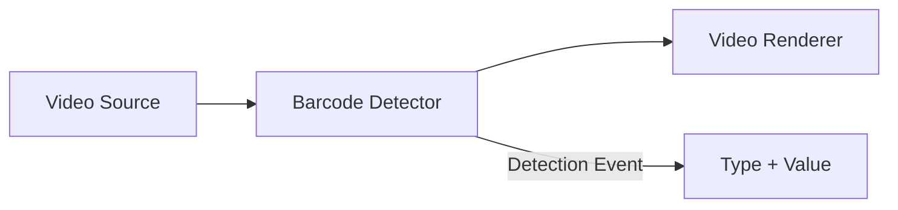

# How to Build a C# Barcode Scanner and QR Code Reader in .NET

[Media Blocks SDK .Net](https://www.visioforge.com/media-blocks-sdk-net){ .md-button .md-button--primary target="_blank" }

## Introduction

Need to read barcodes or scan QR codes from a live camera feed in C#? Unlike image-only barcode libraries, VisioForge Media Blocks SDK scans barcodes directly from real-time video streams — [webcams](../../videocapture/guides/save-webcam-video.md), [IP cameras](../../videocapture/video-sources/ip-cameras/index.md), [RTSP sources](../../general/network-streaming/rtsp.md), video files, and screen capture. This makes it the ideal .NET barcode scanner SDK for surveillance, inventory, and automation applications that process live video.

This guide walks you through building a cross-platform C# barcode reader and QR code scanner that runs on Windows, Android, iOS, macOS, and Linux using .NET MAUI, Avalonia, or WPF.

## Why Use Video-Based Barcode Scanning?

### Key Advantages over Image-Only Libraries

- **Real-time video stream scanning**: Detect barcodes continuously from webcam, IP camera, or RTSP feeds — not just static images
- **Cross-platform .NET support**: Single codebase for Windows, Android, iOS, macOS, and Linux with MAUI, Avalonia, WPF, WinForms, Blazor, and console apps
- **Pipeline architecture**: Combine barcode detection with video preview, recording, and other processing in one pipeline
- **Multiple input sources**: Scan from cameras, video files, screen capture, or [network streams](../../general/network-streaming/rtsp.md)
- **Comprehensive format support**: QR codes, DataMatrix, Code128, Code39, EAN-13, UPC-A, PDF417, Aztec, and many other 1D/2D barcode formats
- **Event-driven API**: Simple `OnBarcodeDetected` event delivers barcode type, value, and timestamp

## Supported Barcode and QR Code Formats

The C# barcode scanner supports a wide range of 1D and 2D barcode formats:

### 2D Barcodes

- **QR Code**: Most popular 2D barcode format, widely used in mobile applications
- **DataMatrix**: Compact format ideal for small items
- **PDF417**: Used in driver's licenses and boarding passes
- **Aztec**: Compact format used in transportation tickets

### 1D Barcodes

- **Code 128**: High-density format for alphanumeric data
- **Code 39**: Simple alphanumeric format
- **EAN-13/EAN-8**: European Article Number for retail products
- **UPC-A/UPC-E**: Universal Product Code for retail
- **Codabar**: Used in libraries and blood banks
- **ITF**: Interleaved 2 of 5 for shipping and distribution

## Barcode Scanner Pipeline Architecture

The Media Blocks SDK uses a pipeline-based architecture where video frames flow through connected blocks for real-time barcode detection:



This modular approach allows you to:

- Easily swap input sources (camera, file, stream)
- Add additional processing blocks (filters, encoders)
- Route output to multiple destinations simultaneously

## How to Read Barcodes from Camera in C#

Build a barcode scanner that reads from a webcam or camera device in C# step by step.

### Step 1: Setting Up the Project

First, ensure you have the necessary NuGet packages installed:

```bash
# For Windows applications
dotnet add package VisioForge.CrossPlatform.Core.Windows.x64
dotnet add package VisioForge.CrossPlatform.Libav.Windows.x64

# For Android applications
dotnet add package VisioForge.CrossPlatform.Core.Android

# For iOS applications
dotnet add package VisioForge.CrossPlatform.Core.iOS

# For macOS applications
dotnet add package VisioForge.CrossPlatform.Core.macCatalyst
```

Add the required namespaces to your code:

```csharp
using VisioForge.Core;
using VisioForge.Core.MediaBlocks;
using VisioForge.Core.MediaBlocks.Sources;
using VisioForge.Core.MediaBlocks.Special;
using VisioForge.Core.MediaBlocks.VideoRendering;
using VisioForge.Core.Types;
using VisioForge.Core.Types.Events;
using VisioForge.Core.Types.X;
using VisioForge.Core.Types.X.Sources;
```

### Step 2: Initializing the SDK

Before using any SDK features, initialize the VisioForge engine:

```csharp
// Initialize the SDK (required on first use)
await VisioForgeX.InitSDKAsync();
```

This initialization step builds the internal registry and prepares the engine. It only needs to be done once when your application starts.

### Step 3: Enumerating Video Sources

Before capturing video, you need to discover available cameras:

```csharp
// Start monitoring for video sources
await DeviceEnumerator.Shared.StartVideoSourceMonitorAsync();

// Get list of available cameras
var cameras = await DeviceEnumerator.Shared.VideoSourcesAsync();

// Display available cameras
foreach (var camera in cameras)
{
    Console.WriteLine($"Camera: {camera.DisplayName}");

    // List supported formats
    foreach (var format in camera.VideoFormats)
    {
        Console.WriteLine($"  Format: {format.Name}");
    }
}
```

### Step 4: Creating the Pipeline

Create a pipeline and configure the necessary blocks:

```csharp
// Create the pipeline
var pipeline = new MediaBlocksPipeline();
pipeline.OnError += Pipeline_OnError;

// Configure video source
var device = cameras.First();
var formatItem = device.GetHDOrAnyVideoFormatAndFrameRate(out var frameRate);

var videoSourceSettings = new VideoCaptureDeviceSourceSettings(device)
{
    Format = formatItem.ToFormat()
};
videoSourceSettings.Format.FrameRate = frameRate;

// Create video source block
var videoSource = new SystemVideoSourceBlock(videoSourceSettings);

// Create barcode detector block
var barcodeDetector = new BarcodeDetectorBlock(BarcodeDetectorMode.InputOutput);
barcodeDetector.OnBarcodeDetected += BarcodeDetector_OnBarcodeDetected;

// Create video renderer block (for preview)
var videoRenderer = new VideoRendererBlock(pipeline, videoView);

// Connect the blocks
pipeline.Connect(videoSource.Output, barcodeDetector.Input);
pipeline.Connect(barcodeDetector.Output, videoRenderer.Input);
```

### Step 5: Handling Barcode Detection Events

Implement the event handler to process detected barcodes:

```csharp
private void BarcodeDetector_OnBarcodeDetected(object sender, BarcodeDetectorEventArgs e)
{
    // This event is called when a barcode is detected
    Console.WriteLine($"Detected: {e.BarcodeType} = {e.Value}");

    // Update UI (use dispatcher for thread safety)
    Dispatcher.Invoke(() =>
    {
        BarcodeTypeLabel.Text = e.BarcodeType;
        BarcodeValueLabel.Text = e.Value;
        LastDetectionTime.Text = DateTime.Now.ToString("HH:mm:ss.fff");
    });
}
```

### Step 6: Starting and Stopping the Pipeline

Control the pipeline lifecycle:

```csharp
// Start scanning
await pipeline.StartAsync();

// Stop scanning
await pipeline.StopAsync();

// Pause scanning
await pipeline.PauseAsync();

// Resume scanning
await pipeline.ResumeAsync();
```

### Step 7: Cleanup

Properly dispose of resources when done:

```csharp
// Remove event handlers
barcodeDetector.OnBarcodeDetected -= BarcodeDetector_OnBarcodeDetected;
pipeline.OnError -= Pipeline_OnError;

// Stop and cleanup
await pipeline.StopAsync();
pipeline.ClearBlocks();
pipeline.Dispose();

// Destroy SDK (on application exit)
VisioForgeX.DestroySDK();
```

## Advanced Barcode Reading Features

### Duplicate Detection Prevention

To prevent multiple detections of the same barcode:

```csharp
private Dictionary<string, DateTime> _recentDetections = new();
private TimeSpan _deduplicationWindow = TimeSpan.FromSeconds(2);

private void BarcodeDetector_OnBarcodeDetected(object sender, BarcodeDetectorEventArgs e)
{
    string key = $"{e.BarcodeType}:{e.Value}";

    // Check if this barcode was recently detected
    if (_recentDetections.TryGetValue(key, out var lastTime))
    {
        if (DateTime.Now - lastTime < _deduplicationWindow)
        {
            return; // Skip duplicate
        }
    }

    // Record this detection
    _recentDetections[key] = DateTime.Now;

    // Process the barcode
    ProcessBarcode(e.BarcodeType, e.Value);
}
```

### Scan Barcodes from Video Files, Screen Capture, and RTSP Streams

The SDK supports various input sources beyond local cameras:

#### Read Barcodes from Video File

```csharp
var fileSettings = await UniversalSourceSettings.CreateAsync(
    new Uri(@"C:\Videos\barcode-video.mp4"));
var fileSource = new UniversalSourceBlock(fileSettings);

pipeline.Connect(fileSource.VideoOutput, barcodeDetector.Input);
```

#### Scan Barcodes from Screen Capture

```csharp
var screenSource = new ScreenSourceBlock(
    new ScreenCaptureSourceSettings()
    {
        DisplayIndex = 0, // Primary monitor
        FrameRate = new VideoFrameRate(10) // 10 FPS
    });

pipeline.Connect(screenSource.Output, barcodeDetector.Input);
```

#### Scan Barcodes from RTSP IP Camera Stream

```csharp
var streamSettings = await UniversalSourceSettings.CreateAsync(
    new Uri("rtsp://camera-ip:554/stream"));
var streamSource = new UniversalSourceBlock(streamSettings);

pipeline.Connect(streamSource.VideoOutput, barcodeDetector.Input);
```

### Detection History Tracking

Maintain a history of detected barcodes:

```csharp
public class BarcodeDetection
{
    public string Type { get; set; }
    public string Value { get; set; }
    public DateTime Timestamp { get; set; }
}

private ObservableCollection<BarcodeDetection> _detectionHistory = new();
private int _maxHistorySize = 100;

private void BarcodeDetector_OnBarcodeDetected(object sender, BarcodeDetectorEventArgs e)
{
    var detection = new BarcodeDetection
    {
        Type = e.BarcodeType,
        Value = e.Value,
        Timestamp = DateTime.Now
    };

    // Add to beginning of list
    _detectionHistory.Insert(0, detection);

    // Maintain maximum size
    while (_detectionHistory.Count > _maxHistorySize)
    {
        _detectionHistory.RemoveAt(_detectionHistory.Count - 1);
    }
}
```

### Error Handling

Implement robust error handling:

```csharp
private void Pipeline_OnError(object sender, ErrorsEventArgs e)
{
    Debug.WriteLine($"Pipeline Error: {e.Message}");

    // Show user-friendly message
    Dispatcher.Invoke(() =>
    {
        mmLog.Text += e.Message + Environment.NewLine;
    });
}
```

## Platform Setup: Android, iOS, and macOS Barcode Scanning

### Android Camera Permissions

On Android, you must request camera permissions before scanning barcodes:

```csharp
private async Task<bool> RequestCameraPermissionAsync()
{
    var status = await Permissions.CheckStatusAsync<Permissions.Camera>();

    if (status != PermissionStatus.Granted)
    {
        status = await Permissions.RequestAsync<Permissions.Camera>();
    }

    return status == PermissionStatus.Granted;
}
```

Add to AndroidManifest.xml:

```xml
<uses-permission android:name="android.permission.CAMERA" />
<uses-feature android:name="android.hardware.camera" />
<uses-feature android:name="android.hardware.camera.autofocus" />
```

### iOS Camera Permissions

Add to Info.plist:

```xml
<key>NSCameraUsageDescription</key>
<string>This app needs camera access to scan barcodes and QR codes</string>
```

### macOS Camera Permissions

For macOS and Mac Catalyst, add to Entitlements.plist:

```xml
<key>com.apple.security.device.camera</key>
<true/>
```

## Optimizing Barcode Scanner Performance in .NET

### Frame Rate Optimization

Balance barcode detection speed and CPU usage:

```csharp
// Lower frame rate for better performance
videoSourceSettings.Format.FrameRate = new VideoFrameRate(15); // 15 FPS instead of 30

// For screen capture, use even lower frame rates
screenSourceSettings.FrameRate = new VideoFrameRate(5); // 5 FPS
```

### Resolution Considerations

Lower resolution can improve performance without significantly affecting detection:

```csharp
// Choose a lower resolution format
var format = device.VideoFormats
    .Where(f => f.Width <= 1280 && f.Height <= 720)
    .OrderByDescending(f => f.Width * f.Height)
    .FirstOrDefault();
```

### Detector Mode Selection

The `BarcodeDetectorBlock` supports different modes:

```csharp
// InputOutput mode: Passes video through for preview (default)
var detector = new BarcodeDetectorBlock(BarcodeDetectorMode.InputOutput);

// InputOnly mode: No video output, better performance
var detector = new BarcodeDetectorBlock(BarcodeDetectorMode.InputOnly);
```

## Barcode Scanner for .NET MAUI, Avalonia, and WPF

### .NET MAUI Barcode Scanner

```csharp
public partial class MainPage : ContentPage
{
    private MediaBlocksPipeline _pipeline;
    private BarcodeDetectorBlock _barcodeDetector;

    public MainPage()
    {
        InitializeComponent();
        Loaded += MainPage_Loaded;
    }

    private async void MainPage_Loaded(object sender, EventArgs e)
    {
        await VisioForgeX.InitSDKAsync();

        #if __ANDROID__ || __IOS__ || __MACCATALYST__
        await RequestCameraPermissionAsync();
        #endif

        _pipeline = new MediaBlocksPipeline();
        // ... setup pipeline
    }
}
```

### Avalonia Barcode Scanner

```csharp
public partial class MainWindow : Window
{
    private MediaBlocksPipeline _pipeline;
    private BarcodeDetectorBlock _barcodeDetector;

    public MainWindow()
    {
        InitializeComponent();
        Loaded += MainWindow_Loaded;
    }

    private async void MainWindow_Loaded(object sender, RoutedEventArgs e)
    {
        await VisioForgeX.InitSDKAsync();

        _pipeline = new MediaBlocksPipeline();
        // ... setup pipeline
    }
}
```

## Barcode Scanner Use Cases: Inventory, Ticketing, and Payments

### Inventory Management with Barcode Scanning

Track products in warehouses using barcode scanning:

```csharp
private async void ProcessInventoryBarcode(string barcodeValue)
{
    // Look up product in database
    var product = await _database.GetProductByBarcodeAsync(barcodeValue);

    if (product != null)
    {
        // Update inventory count
        product.Quantity++;
        await _database.SaveChangesAsync();

        // Show confirmation
        StatusLabel.Text = $"Added: {product.Name}";
    }
    else
    {
        StatusLabel.Text = "Product not found";
    }
}
```

### QR Code Ticket Scanning for Events

Scan QR code tickets at event entrances:

```csharp
private async void ProcessTicketBarcode(string ticketCode)
{
    var ticket = await _ticketService.ValidateTicketAsync(ticketCode);

    if (ticket.IsValid && !ticket.IsUsed)
    {
        await _ticketService.MarkAsUsedAsync(ticketCode);
        PlaySuccessSound();
        ShowGreenLight();
    }
    else
    {
        PlayErrorSound();
        ShowRedLight();
        StatusLabel.Text = ticket.IsUsed ? "Already used" : "Invalid ticket";
    }
}
```

### QR Code Payment Processing

Scan QR codes for mobile payments:

```csharp
private async void ProcessPaymentQRCode(string qrData)
{
    if (IsPaymentQRCode(qrData))
    {
        var paymentInfo = ParsePaymentData(qrData);

        // Show payment confirmation dialog
        var result = await DisplayAlert(
            "Confirm Payment",
            $"Pay ${paymentInfo.Amount} to {paymentInfo.Recipient}?",
            "Pay",
            "Cancel");

        if (result)
        {
            await ProcessPaymentAsync(paymentInfo);
        }
    }
}
```

## Troubleshooting C# Barcode Scanner Issues

### Issue: No Barcodes Detected

**Solutions:**

1. Ensure adequate lighting - barcodes need clear visibility
2. Check camera focus - some cameras need time to focus
3. Verify barcode is within camera field of view
4. Try adjusting camera distance (15-30cm typically optimal)
5. Check that the barcode format is supported

### Issue: Multiple Detections of Same Barcode

**Solution:** Implement duplicate detection prevention (shown earlier)

### Issue: Poor Performance

**Solutions:**

1. Lower video resolution
2. Reduce frame rate
3. Use `BarcodeDetectorMode.InputOnly` if preview isn't needed
4. Close other applications to free system resources

### Issue: Camera Not Found

**Solutions:**

1. Verify camera permissions are granted
2. Check that camera is not in use by another application
3. Restart the device
4. Try enumerating devices after a short delay

## Best Practices

1. **Always Initialize SDK Early**: Call `InitSDKAsync()` during application startup
2. **Request Permissions First**: Check and request camera permissions before accessing camera
3. **Handle Errors Gracefully**: Implement proper error handling for all pipeline operations
4. **Dispose Resources Properly**: Always clean up pipeline and blocks when done
5. **Test on Target Devices**: Performance varies by device - test on actual hardware
6. **Provide Visual Feedback**: Show users when barcodes are detected successfully
7. **Consider Offline Scenarios**: Cache necessary data for offline barcode processing
8. **Implement Logging**: Log detection events for debugging and analytics

## Sample Projects

Complete sample projects are available in the SDK:

- **MAUI Barcode Reader**: [BarcodeReaderMB MAUI Demo](https://github.com/visioforge/.Net-SDK-s-samples/tree/master/Media%20Blocks%20SDK/MAUI/BarcodeReaderMB)
- **Avalonia Barcode Reader**: [BarcodeReaderMB Avalonia Demo](https://github.com/visioforge/.Net-SDK-s-samples/tree/master/Media%20Blocks%20SDK/Avalonia/BarcodeReaderMB)
- **WPF Barcode Detection**: [Barcode Detection WPF Demo](https://github.com/visioforge/.Net-SDK-s-samples/tree/master/Media%20Blocks%20SDK/WPF/CSharp/Barcode%20Detection%20Demo)

These samples demonstrate:

- Complete UI implementation
- Camera selection and configuration
- Real-time barcode detection
- Detection history tracking
- Error handling
- Cross-platform compatibility

## Frequently Asked Questions

### What barcode formats can I scan from a camera in C#?

The SDK supports all major 1D and 2D barcode formats including QR Code, DataMatrix, PDF417, Aztec, Code 128, Code 39, EAN-13, EAN-8, UPC-A, UPC-E, Codabar, and ITF. All formats can be scanned in real time from any video source — webcam, IP camera, RTSP stream, or video file.

### Can I scan QR codes from an IP camera or RTSP stream?

Yes. Use `UniversalSourceBlock` with an RTSP URI to connect to any IP camera and scan barcodes from the live video stream. The pipeline handles decoding, buffering, and frame delivery automatically. See the [RTSP streaming guide](../../general/network-streaming/rtsp.md) for connection details.

### Does the barcode scanner work on Android, iOS, and macOS?

Yes. The `BarcodeDetectorBlock` is fully cross-platform. .NET MAUI apps run on Android and iOS; Avalonia apps run on macOS and Linux. Each platform requires camera permissions — see the [Platform Setup](#platform-setup-android-ios-and-macos-barcode-scanning) section for details.

### How do I prevent duplicate barcode detections?

Implement a time-based deduplication window. Store each detected barcode value with a timestamp and skip detections that match a recent entry within a configurable interval (typically 2 seconds). See the [Duplicate Detection Prevention](#duplicate-detection-prevention) code example above.

### What frame rate do I need for reliable barcode scanning?

For most use cases, 10–15 FPS provides reliable detection with low CPU usage. Static barcodes (warehouse labels, product shelves) work well at 5 FPS. Fast-moving barcodes on a conveyor belt may need 25–30 FPS. Use the lowest frame rate that gives reliable results to minimize resource consumption.

## See Also

- [Webcam Video Capture in C#](../../videocapture/guides/save-webcam-video.md) — capture and record webcam video using the same SDK
- [RTSP Streaming and IP Camera Capture](../../general/network-streaming/rtsp.md) — connect to IP cameras for barcode scanning from network streams
- [IP Camera Sources](../../videocapture/video-sources/ip-cameras/index.md) — configure ONVIF and RTSP camera sources
- [Pre-Event Recording](pre-event-recording.md) — combine barcode detection with motion-triggered recording
- [Special Blocks Reference](../Special/index.md) — BarcodeDetectorBlock API reference
- [Getting Started with Media Blocks](../GettingStarted/index.md) — pipeline fundamentals
- [Platform-Specific Deployment](../../deployment-x/index.md) — native dependency packages for all platforms
