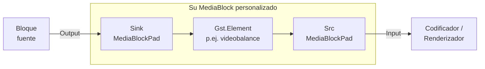

# Crear su propio MediaBlock a partir de un elemento GStreamer en C# .NET

[Media Blocks SDK .Net](https://www.visioforge.com/media-blocks-sdk-net){ .md-button .md-button--primary target="_blank" }

El Media Blocks SDK ya incluye más de 70 bloques tipados para tareas
comunes de video, audio, codificación y streaming. Sin embargo, a veces
necesita un elemento GStreamer que el SDK todavía no envuelve — un plugin
de terceros, un elemento experimental de `gst-plugins-bad`, o
simplemente algo que usted mismo escribió. Esta guía muestra cómo
integrar cualquier elemento GStreamer único en un `MediaBlocksPipeline`
como un bloque de primera clase.

!!! note "¿Por qué escala de grises?"
    El ejemplo práctico envuelve `videobalance` con `saturation = 0` para
    convertir el video a escala de grises. **El SDK ya incluye
    `GrayscaleBlock` y `VideoBalanceBlock`** construidos sobre el mismo
    elemento — no necesita recrearlos en código de producción. Usamos
    escala de grises porque es el ejemplo más pequeño posible que ejercita
    todo el patrón: un elemento, una propiedad, pads sink/src. Una vez
    que entienda esto, podrá envolver cualquier elemento GStreamer de la
    misma forma.

## Dos enfoques

| Enfoque | Cuándo usarlo |
|---|---|
| **A.** Usar el `CustomMediaBlock` integrado — pase el nombre del elemento y las propiedades como datos. | Uso puntual, prototipado, o cuando necesita envolver cualquier elemento desde cualquier parte del código. Sin subclases, sin tipos nuevos. |
| **B.** Escribir una subclase `MediaBlock` tipada. | Quiere un bloque reutilizable y fuertemente tipado con un `IsAvailable()` estático, una clase de configuración, IntelliSense, y la misma sensación que los bloques integrados. |

Ambos enfoques comparten la misma idea: un MediaBlock posee un
`Gst.Element`, lo coloca dentro del `Gst.Pipeline` de la canalización y
expone los pads estáticos `sink` y `src` del elemento como instancias de
`MediaBlockPad` que `MediaBlocksPipeline.Connect(...)` puede conectar.



## Enfoque A — `CustomMediaBlock` (sin subclases)

`CustomMediaBlock` es el envoltorio público y genérico que hace todo lo
descrito arriba sin que usted tenga que escribir una clase. Pásele el
nombre del elemento GStreamer y una lista de pads, configure propiedades
mediante un diccionario con claves de tipo cadena, añádalo al pipeline y
conéctelo.

```csharp
using VisioForge.Core.MediaBlocks;
using VisioForge.Core.MediaBlocks.Special;
using VisioForge.Core.Types.X.Special;

var settings = new CustomMediaBlockSettings("videobalance");
settings.Pads.Add(new CustomMediaBlockPad(MediaBlockPadDirection.In,  MediaBlockPadMediaType.Video));
settings.Pads.Add(new CustomMediaBlockPad(MediaBlockPadDirection.Out, MediaBlockPadMediaType.Video));
settings.ElementParams["saturation"] = 0.0;          // videobalance.saturation es double

var grayscale = new CustomMediaBlock(settings);

pipeline.AddBlock(grayscale);
pipeline.Connect(source.Output,    grayscale.Input);
pipeline.Connect(grayscale.Output, encoder.Input);
```

Ese es todo el bloque. `CustomMediaBlock.Build()` es invocado por la
canalización durante `StartAsync` y hace el trabajo: crea el elemento
`videobalance` mediante `Gst.ElementFactory.Make`, aplica cada entrada
en `ElementParams` con `SetProperty`, añade el elemento al pipeline y
vincula los pads sink/src.

### Tipos de propiedades admitidos

`ElementParams` acepta los siguientes tipos CLR y los mapea al `GLib.Value`
correspondiente:

| Tipo CLR | Tipo de propiedad GStreamer |
|---|---|
| `int` | `gint`, `enum` |
| `uint` | `guint`, `flags` |
| `long` | `gint64` |
| `ulong` | `guint64` |
| `float` | `gfloat` |
| `double` | `gdouble` (la mayoría de propiedades de `videobalance`, `gamma`, volúmenes de audio, etc.) |
| `string` | `gchararray` |
| `bool` | implícito vía `GLib.Value` |
| `Enum` | convertido a `int` |

Respete el tipo de propiedad GStreamer **exactamente**.
`videobalance.saturation` es un `gdouble` — pase `0.0`, no `0` (int) y no
`0.0f` (float). Las propiedades con tipo incorrecto se ignoran
silenciosamente.

### Envolver cadenas de varios elementos: sintaxis de bin

Si su transformación necesita más de un elemento GStreamer, puede pasar
una descripción de bin en `[ ... ]` en lugar del nombre de un único
elemento. El bloque la analiza con `Gst.Parse.BinFromDescription` y añade
el bin resultante:

```csharp
var settings = new CustomMediaBlockSettings("[ videoconvert ! videobalance saturation=0 ! videoconvert ]");
settings.Pads.Add(new CustomMediaBlockPad(MediaBlockPadDirection.In,  MediaBlockPadMediaType.Video));
settings.Pads.Add(new CustomMediaBlockPad(MediaBlockPadDirection.Out, MediaBlockPadMediaType.Video));
var block = new CustomMediaBlock(settings);
```

### Pads dinámicos (elementos tipo demuxer)

Para elementos que crean sus pads src en tiempo de ejecución
(p.ej. `decodebin`, `tsdemux`), active `UsePadAddedEvent = true` en la
configuración. `CustomMediaBlock` inserta un `identity` por cada pad de
salida declarado y los enlaza cuando el elemento emite `pad-added`.

### Ajustes tardíos mediante `OnElementAdded`

Si necesita acceder al `Gst.Element` crudo tras la creación pero antes de
que la canalización arranque (manejadores de señales, caps con
estructuras, propiedades que no encajan en el mapa de `ElementParams`),
suscríbase a `OnElementAdded`:

```csharp
var block = new CustomMediaBlock(settings);
block.OnElementAdded += (s, element) =>
{
    element.SetProperty("brightness", new GLib.Value(0.1));
    // … cualquier otro ajuste
};
```

### Cuándo `CustomMediaBlock` no es suficiente

Quiere un bloque tipado cuando:

- Lo usará en muchos lugares y desea IntelliSense para las propiedades.
- Necesita un `IsAvailable()` estático que falle rápidamente en sistemas
  donde el plugin no está disponible.
- Quiere una clase de configuración con validación, valores por defecto y
  documentación XML.
- Quiere que el bloque se vea y se sienta como cualquier otro bloque del
  SDK cuando otra persona revise el código.

Eso es el **Enfoque B**.

## Enfoque B — una subclase `MediaBlock` tipada

Un bloque personalizado es `MediaBlock` + `IMediaBlockInternals` + dos
`MediaBlockPad`. El patrón es lo suficientemente pequeño para
memorizarlo. A continuación está el `MyGrayscaleBlock` completo del
[ejemplo de consola `CustomGrayscaleBlock`](#aplicacion-de-ejemplo);
léalo una vez y luego revise el desglose paso a paso que sigue.

```csharp
using System;
using Gst;
using VisioForge.Core.MediaBlocks;

public class MyGrayscaleBlock : MediaBlock, IMediaBlockInternals
{
    private const string TAG = "MyGrayscaleBlock";

    private Element _element;
    private readonly MediaBlockPad _inputPad;
    private readonly MediaBlockPad _outputPad;

    public override MediaBlockType Type => MediaBlockType.Custom;
    public override MediaBlockPad Input => _inputPad;
    public override MediaBlockPad[] Inputs => new[] { _inputPad };
    public override MediaBlockPad Output => _outputPad;
    public override MediaBlockPad[] Outputs => new[] { _outputPad };

    public MyGrayscaleBlock()
    {
        Name = "MyGrayscale";
        _inputPad  = new MediaBlockPad(this, MediaBlockPadDirection.In,  MediaBlockPadMediaType.Video);
        _outputPad = new MediaBlockPad(this, MediaBlockPadDirection.Out, MediaBlockPadMediaType.Video);
    }

    public static bool IsAvailable()
    {
        var factory = ElementFactory.Find("videobalance");
        if (factory == null) return false;
        factory.Dispose();
        return true;
    }

    public override bool Build()
    {
        if (_isBuilt) return true;

        _element = ElementFactory.Make("videobalance", $"videobalance_{Guid.NewGuid():N}");
        if (_element == null)
        {
            Context?.Error(TAG, "Build", "Unable to create videobalance element.");
            return false;
        }

        _element.SetProperty("saturation", new GLib.Value(0.0));
        _pipelineCtx.Pipeline.Add(_element);

        var sink = _element.GetStaticPad("sink");
        var src  = _element.GetStaticPad("src");
        if (sink == null || src == null)
        {
            Context?.Error(TAG, "Build", "Unable to retrieve videobalance static pads.");
            _pipelineCtx.Pipeline.Remove(_element);
            _element.Dispose();
            _element = null;
            return false;
        }

        _inputPad.SetInternalPad(sink);
        _outputPad.SetInternalPad(src);

        _isBuilt = true;
        return true;
    }

    void IMediaBlockInternals.SetContext(MediaBlocksPipeline pipeline)
    {
        SetPipeline(pipeline);
        Context = pipeline.GetContext();
    }

    bool IMediaBlockInternals.Build() => Build();
    Gst.Element IMediaBlockInternals.GetElement() => _element;
    VisioForge.Core.GStreamer.Base.BaseElement IMediaBlockInternals.GetCore() => null;

    public void CleanUp()
    {
        _element?.Dispose();
        _element = null;
    }

    protected override void Dispose(bool disposing)
    {
        if (disposing) CleanUp();
        base.Dispose(disposing);
    }
}
```

### Paso a paso

#### 1. Heredar de `MediaBlock`, implementar `IMediaBlockInternals`

`MediaBlock` es la clase base pública y no abstracta. `IMediaBlockInternals`
es la interfaz pública a la que la canalización llama durante preload,
build y teardown. Usted implementa ambos.

#### 2. Declarar los pads en el constructor

Un `MediaBlockPad` es el pad a nivel de MediaBlocks. La canalización
conecta dos `MediaBlockPad` con `pipeline.Connect(a, b)`; por debajo,
cada uno reenvía a un pad GStreamer subyacente que usted asigna en
`Build()` vía `SetInternalPad`.

```csharp
_inputPad  = new MediaBlockPad(this, MediaBlockPadDirection.In,  MediaBlockPadMediaType.Video);
_outputPad = new MediaBlockPad(this, MediaBlockPadDirection.Out, MediaBlockPadMediaType.Video);
```

Use `MediaBlockPadMediaType.Audio` para elementos de audio (p.ej.
`audioconvert`, `volume`), o un pad de cada tipo para elementos que
afectan ambos flujos.

#### 3. Sobrescribir `Type`, `Input/Inputs`, `Output/Outputs`

`MediaBlockType.Custom` es el valor de enumeración genérico para bloques
escritos por el usuario. Las cuatro propiedades de pad devuelven sus
pads individuales (singular) o arreglos de un solo elemento (plural) —
el SDK usa uno u otro según cómo esté enumerando los bloques.

#### 4. Implementar `Build()`

Aquí es donde cobra vida el lado GStreamer. `Build()` se ejecuta durante
`pipeline.StartAsync(...)` (o `StartAsync(onlyPreload: true)`), **no en
su constructor**. Dentro de él:

1. Proteja con `_isBuilt` para que llamadas repetidas no hagan nada.
2. Cree el elemento con `ElementFactory.Make(name, uniqueInstanceName)`.
   Pase un nombre de instancia único (`Guid.NewGuid().ToString("N")`
   funciona) — GStreamer requiere nombres únicos de elemento dentro de
   un pipeline.
3. Compruebe que el elemento no sea `null`. `null` significa que el
   plugin falta o que la factoría no está disponible en esta plataforma.
4. Aplique propiedades con `element.SetProperty("name", new GLib.Value(...))`.
   Respete el tipo GStreamer exacto (vea la tabla de tipos arriba).
5. **Añada el elemento al pipeline antes de recuperar sus pads.** La
   referencia al pipeline se expone mediante el campo protegido
   `_pipelineCtx.Pipeline`.
6. Recupere los pads estáticos del elemento con
   `element.GetStaticPad("sink")` / `GetStaticPad("src")` y vincúlelos con
   `MediaBlockPad.SetInternalPad(...)`.

#### 5. `IsAvailable()` estático

Por convención, cada bloque del SDK expone un `IsAvailable()` estático
que verifica el registro para el elemento subyacente. Los llamadores lo
usan para elegir entre alternativas o fallar rápido con un diagnóstico
útil.

```csharp
public static bool IsAvailable()
{
    var factory = ElementFactory.Find("videobalance");
    if (factory == null) return false;
    factory.Dispose();
    return true;
}
```

#### 6. `IMediaBlockInternals.SetContext`

La canalización llama a esto cuando se añade el bloque. Conecta el
bloque a su pipeline padre y guarda el `Context` a nivel GStreamer para
reportar errores:

```csharp
void IMediaBlockInternals.SetContext(MediaBlocksPipeline pipeline)
{
    SetPipeline(pipeline);
    Context = pipeline.GetContext();
}
```

`SetPipeline` es un método protegido de `MediaBlock` que almacena una
referencia débil a la canalización y rellena el campo protegido
`_pipelineCtx` que su `Build()` utiliza.

#### 7. `CleanUp()` y `Dispose`

`CleanUp()` es llamado por la canalización durante el teardown. Libere
el elemento subyacente y limpie la referencia. Reenvíe `Dispose(bool)`
a `CleanUp` para el ciclo de vida normal de `IDisposable`:

```csharp
public void CleanUp()
{
    _element?.Dispose();
    _element = null;
}

protected override void Dispose(bool disposing)
{
    if (disposing) CleanUp();
    base.Dispose(disposing);
}
```

#### 8. `GetElement` / `GetCore`

`GetElement` expone el `Gst.Element` crudo para inspección avanzada.
`GetCore` expone el envoltorio interno `BaseElement` que usan los
bloques integrados; el código de usuario no tiene uno, así que devuelva
`null`.

### Usar su bloque

Una vez que la clase compile, encaja en un pipeline como cualquier otro
bloque:

```csharp
var grayscale = new MyGrayscaleBlock();

pipeline.AddBlock(source);
pipeline.AddBlock(grayscale);
pipeline.AddBlock(encoder);
pipeline.AddBlock(sink);

pipeline.Connect(source.Output,    grayscale.Input);
pipeline.Connect(grayscale.Output, encoder.Input);
```

## Añadir propiedades y configuración

`MyGrayscaleBlock` codifica `saturation = 0` directamente. Para exponer
propiedades configurables, la convención del SDK es una clase de
configuración independiente que se pasa al constructor del bloque:

```csharp
public class MyVideoBalanceSettings
{
    public double Brightness { get; set; } = 0.0;   // -1.0 a 1.0
    public double Contrast   { get; set; } = 1.0;   // 0.0 a 2.0
    public double Saturation { get; set; } = 1.0;   // 0.0 a 2.0 (0 = grises)
    public double Hue        { get; set; } = 0.0;   // -1.0 a 1.0
}

public class MyVideoBalanceBlock : MediaBlock, IMediaBlockInternals
{
    public MyVideoBalanceSettings Settings { get; }

    public MyVideoBalanceBlock(MyVideoBalanceSettings settings)
    {
        Settings = settings ?? new MyVideoBalanceSettings();
        // … pads como antes
    }

    public override bool Build()
    {
        // … crear el elemento como antes
        _element.SetProperty("brightness", new GLib.Value(Settings.Brightness));
        _element.SetProperty("contrast",   new GLib.Value(Settings.Contrast));
        _element.SetProperty("saturation", new GLib.Value(Settings.Saturation));
        _element.SetProperty("hue",        new GLib.Value(Settings.Hue));
        // … añadir al pipeline, vincular pads
    }
}
```

Para actualizaciones de propiedades en tiempo real, conserve una
referencia a `_element` y exponga `Update(Settings settings)` que llame
a `SetProperty` sobre un elemento vivo. El `VideoBalanceBlock` del SDK
usa un evento `OnUpdate` en su clase de configuración para esto — léalo
para un ejemplo más completo.

## Descubrir elementos y sus propiedades

Use el agent skill `gstreamer-doc` — o, en Windows, el
`gst-inspect-1.0.exe` local en
`C:\gstreamer\1.0\msvc_x86_64x\bin\gst-inspect-1.0.exe` — para
inspeccionar cualquier elemento antes de envolverlo:

```cmd
gst-inspect-1.0.exe videobalance
```

La salida lista cada propiedad (con su tipo GStreamer y rango) y ambas
plantillas de pad (con sus caps). Confirme:

- El elemento existe en la instalación de GStreamer que tendrán sus
  clientes.
- Las propiedades que va a configurar se llaman exactamente como espera.
- Los caps de los pads sink/src aceptan `video/x-raw` o lo que sea que
  produzca su upstream — la mayoría de efectos de video simples negocian
  `video/x-raw` de forma agnóstica y no necesitan un `capsfilter`
  adicional.

## Ciclo de vida y advertencias

- **`Build()` se ejecuta durante el preload de la canalización, no en el
  constructor.** No acceda al elemento subyacente desde el constructor de
  su bloque — todavía no existe.
- **Añada el elemento a `_pipelineCtx.Pipeline` *antes* de llamar a
  `GetStaticPad`.** Los pads existen tan pronto como la factoría crea el
  elemento, pero la canalización gestiona el ciclo de vida desde el
  momento en que se llama a `Add`.
- **Respete exactamente los tipos de propiedad de GStreamer.** Una
  propiedad `gdouble` asignada con un `int` se ignora silenciosamente.
  `gst-inspect-1.0` le dice el tipo.
- **Use nombres de instancia de elemento únicos.** Dos elementos con el
  mismo nombre en un `Gst.Pipeline` es un error.
- **No use `ConfigureAwait(false)` en código adyacente al SDK.**
  Convención del proyecto; el SDK la aplica.
- **Elementos personalizados con pads dinámicos** (decodificadores,
  demuxers) deben usar `CustomMediaBlock` con `UsePadAddedEvent = true`,
  no una subclase escrita a mano — el manejo de `pad-added` no es
  trivial.

## Cuándo preferir otro tipo de bloque

`MediaBlock` es la base adecuada cuando quiere **envolver un elemento
GStreamer**. El SDK tiene dos bloques públicos relacionados para
distintos casos de uso:

| Bloque | Úselo cuando |
|---|---|
| [`CustomMediaBlock`](../Special/index.md) | Quiere el Enfoque A de esta guía — envolver un único elemento o una descripción de bin sin subclasear. |
| `CustomTransformBlock` | Quiere una transformación a nivel de código administrado: las muestras de entrada llegan a su código vía un evento, y usted publica muestras de salida. Sin elemento de transformación a nivel GStreamer. |
| `DataProcessorBlock` | Quiere leer o modificar buffers crudos de video/audio en código administrado sin producir una salida diferente (inspección pura, conteo de frames, extracción de metadatos). |
| `SuperMediaBlock` | Quiere agrupar varios bloques existentes en un único bloque compuesto con ciclo de vida compartido. |

## Aplicación de ejemplo

El ejemplo `CustomGrayscaleBlock` que acompaña esta guía vive en el árbol
de ejemplos del SDK en
`_DEMOS/Media Blocks SDK/Console/CustomGrayscaleBlock/`. Ejecuta ambos
enfoques uno tras otro y escribe un MP4 por enfoque para que pueda
compararlos.

Archivos:

- `Program.cs` — construye ambas canalizaciones.
- `MyGrayscaleBlock.cs` — la subclase tipada de esta guía.
- `CustomGrayscaleBlock.csproj` — proyecto de consola multiplataforma.

## Vea también

- [Efectos de Video Personalizados y Shaders OpenGL](custom-video-effects-csharp.md) —
  el catálogo del SDK de bloques de efectos integrados, incluyendo
  `GrayscaleBlock` y `VideoBalanceBlock` de producción.
- [Bloques Especiales](../Special/index.md) — `CustomMediaBlock`,
  `CustomTransformBlock`, `DataProcessorBlock`, `SuperMediaBlock`.
- [Bloques de Procesamiento de Video](../VideoProcessing/index.md) — el
  conjunto completo de bloques de efectos tipados.
