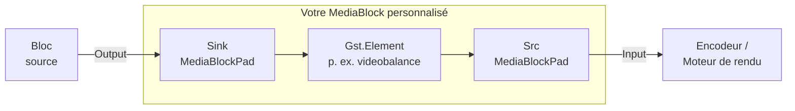

# Créer son propre MediaBlock à partir d'un élément GStreamer en C# .NET

[Media Blocks SDK .Net](https://www.visioforge.com/media-blocks-sdk-net){ .md-button .md-button--primary target="_blank" }

Le Media Blocks SDK fournit déjà plus de 70 blocs typés pour les tâches
courantes de vidéo, d'audio, d'encodage et de streaming. Toutefois, il
arrive que vous ayez besoin d'un élément GStreamer que le SDK n'encapsule
pas encore — un plugin tiers, un élément expérimental de
`gst-plugins-bad`, ou simplement quelque chose que vous avez écrit
vous-même. Ce guide montre comment intégrer n'importe quel élément
GStreamer unique dans un `MediaBlocksPipeline` en tant que bloc de
première classe.

!!! note "Pourquoi le niveau de gris ?"
    L'exemple pratique encapsule `videobalance` avec `saturation = 0` pour
    convertir la vidéo en niveau de gris. **Le SDK fournit déjà
    `GrayscaleBlock` et `VideoBalanceBlock`** construits sur le même
    élément — vous n'avez pas besoin de les recréer dans du code de
    production. Nous utilisons le niveau de gris parce que c'est l'exemple
    le plus petit possible qui couvre l'intégralité du motif : un
    élément, une propriété, des pads sink/src. Une fois que vous
    comprenez ce motif, vous pouvez encapsuler n'importe quel élément
    GStreamer de la même façon.

## Deux approches

| Approche | Quand l'utiliser |
|---|---|
| **A.** Utiliser le `CustomMediaBlock` intégré — passez le nom de l'élément et les propriétés sous forme de données. | Usage ponctuel, prototypage, ou encapsulation de n'importe quel élément depuis n'importe quel point de la chaîne d'appels. Pas de sous-classement, pas de nouveaux types. |
| **B.** Écrire une sous-classe `MediaBlock` typée. | Vous voulez un bloc réutilisable et fortement typé, avec un `IsAvailable()` statique, une classe de paramètres, IntelliSense, et la même ergonomie que les blocs intégrés. |

Les deux approches partagent la même idée : un MediaBlock possède un
`Gst.Element`, le place dans le `Gst.Pipeline` du pipeline et expose les
pads statiques `sink` et `src` de l'élément sous forme d'instances
`MediaBlockPad` que `MediaBlocksPipeline.Connect(...)` peut câbler
ensemble.



## Approche A — `CustomMediaBlock` (sans sous-classement)

`CustomMediaBlock` est l'enveloppe publique et générique qui fait tout
ce qui est décrit ci-dessus, sans que vous ayez à écrire une classe.
Passez-lui le nom de l'élément GStreamer et une liste de pads,
définissez les propriétés via un dictionnaire à clés de type chaîne,
ajoutez-le au pipeline, et connectez-le.

```csharp
using VisioForge.Core.MediaBlocks;
using VisioForge.Core.MediaBlocks.Special;
using VisioForge.Core.Types.X.Special;

var settings = new CustomMediaBlockSettings("videobalance");
settings.Pads.Add(new CustomMediaBlockPad(MediaBlockPadDirection.In,  MediaBlockPadMediaType.Video));
settings.Pads.Add(new CustomMediaBlockPad(MediaBlockPadDirection.Out, MediaBlockPadMediaType.Video));
settings.ElementParams["saturation"] = 0.0;          // videobalance.saturation est un double

var grayscale = new CustomMediaBlock(settings);

pipeline.AddBlock(grayscale);
pipeline.Connect(source.Output,    grayscale.Input);
pipeline.Connect(grayscale.Output, encoder.Input);
```

C'est tout le bloc. `CustomMediaBlock.Build()` est invoqué par le
pipeline pendant `StartAsync` et fait le travail : il crée l'élément
`videobalance` via `Gst.ElementFactory.Make`, applique chaque entrée de
`ElementParams` avec `SetProperty`, ajoute l'élément au pipeline, et lie
les pads sink/src.

### Types de propriétés pris en charge

`ElementParams` accepte les types CLR suivants et les associe à la
`GLib.Value` correspondante :

| Type CLR | Type de propriété GStreamer |
|---|---|
| `int` | `gint`, `enum` |
| `uint` | `guint`, `flags` |
| `long` | `gint64` |
| `ulong` | `guint64` |
| `float` | `gfloat` |
| `double` | `gdouble` (la plupart des propriétés de `videobalance`, `gamma`, volumes audio, etc.) |
| `string` | `gchararray` |
| `bool` | implicite via `GLib.Value` |
| `Enum` | converti en `int` |

Faites correspondre **exactement** le type de propriété GStreamer.
`videobalance.saturation` est un `gdouble` — passez `0.0`, pas `0` (int)
ni `0.0f` (float). Une propriété au mauvais type est silencieusement
ignorée.

### Encapsuler des chaînes multi-éléments : syntaxe de bin

Si votre transformation nécessite plus d'un élément GStreamer, vous
pouvez passer une description de bin dans `[ ... ]` à la place d'un nom
d'élément unique. Le bloc l'analyse avec `Gst.Parse.BinFromDescription`
et ajoute le bin résultant :

```csharp
var settings = new CustomMediaBlockSettings("[ videoconvert ! videobalance saturation=0 ! videoconvert ]");
settings.Pads.Add(new CustomMediaBlockPad(MediaBlockPadDirection.In,  MediaBlockPadMediaType.Video));
settings.Pads.Add(new CustomMediaBlockPad(MediaBlockPadDirection.Out, MediaBlockPadMediaType.Video));
var block = new CustomMediaBlock(settings);
```

### Pads dynamiques (éléments de type démultiplexeur)

Pour les éléments qui créent leurs pads src à l'exécution (p. ex.
`decodebin`, `tsdemux`), positionnez `UsePadAddedEvent = true` sur les
paramètres. `CustomMediaBlock` insère un `identity` par pad de sortie
déclaré et les lie lorsque l'élément déclenche `pad-added`.

### Ajustements tardifs via `OnElementAdded`

Si vous devez toucher le `Gst.Element` brut après sa création mais avant
le démarrage du pipeline (gestionnaires de signaux, caps structurées,
propriétés qui ne rentrent pas dans la map `ElementParams`), abonnez-vous
à `OnElementAdded` :

```csharp
var block = new CustomMediaBlock(settings);
block.OnElementAdded += (s, element) =>
{
    element.SetProperty("brightness", new GLib.Value(0.1));
    // … tout autre ajustement
};
```

### Lorsque `CustomMediaBlock` ne suffit pas

Vous voulez un bloc typé quand :

- Vous l'utiliserez à plusieurs endroits et souhaitez IntelliSense pour
  les propriétés.
- Vous voulez un `IsAvailable()` statique qui échoue rapidement sur les
  systèmes où le plugin est absent.
- Vous voulez une classe de paramètres avec validation, valeurs par
  défaut et documentation XML.
- Vous voulez que le bloc ait la même apparence et la même ergonomie que
  tous les autres blocs du SDK lors d'une revue de code par un tiers.

C'est l'**Approche B**.

## Approche B — une sous-classe `MediaBlock` typée

Un bloc personnalisé, c'est `MediaBlock` + `IMediaBlockInternals` + deux
`MediaBlockPad`. Le motif est suffisamment petit pour être mémorisé.
Ci-dessous figure la classe complète `MyGrayscaleBlock` issue de
l'[exemple console `CustomGrayscaleBlock`](#exemple-dapplication) ; lisez-la une
fois, puis la décomposition étape par étape qui suit.

```csharp
using System;
using Gst;
using VisioForge.Core.MediaBlocks;

public class MyGrayscaleBlock : MediaBlock, IMediaBlockInternals
{
    private const string TAG = "MyGrayscaleBlock";

    private Element _element;
    private readonly MediaBlockPad _inputPad;
    private readonly MediaBlockPad _outputPad;

    public override MediaBlockType Type => MediaBlockType.Custom;
    public override MediaBlockPad Input => _inputPad;
    public override MediaBlockPad[] Inputs => new[] { _inputPad };
    public override MediaBlockPad Output => _outputPad;
    public override MediaBlockPad[] Outputs => new[] { _outputPad };

    public MyGrayscaleBlock()
    {
        Name = "MyGrayscale";
        _inputPad  = new MediaBlockPad(this, MediaBlockPadDirection.In,  MediaBlockPadMediaType.Video);
        _outputPad = new MediaBlockPad(this, MediaBlockPadDirection.Out, MediaBlockPadMediaType.Video);
    }

    public static bool IsAvailable()
    {
        var factory = ElementFactory.Find("videobalance");
        if (factory == null) return false;
        factory.Dispose();
        return true;
    }

    public override bool Build()
    {
        if (_isBuilt) return true;

        _element = ElementFactory.Make("videobalance", $"videobalance_{Guid.NewGuid():N}");
        if (_element == null)
        {
            Context?.Error(TAG, "Build", "Unable to create videobalance element.");
            return false;
        }

        _element.SetProperty("saturation", new GLib.Value(0.0));
        _pipelineCtx.Pipeline.Add(_element);

        var sink = _element.GetStaticPad("sink");
        var src  = _element.GetStaticPad("src");
        if (sink == null || src == null)
        {
            Context?.Error(TAG, "Build", "Unable to retrieve videobalance static pads.");
            _pipelineCtx.Pipeline.Remove(_element);
            _element.Dispose();
            _element = null;
            return false;
        }

        _inputPad.SetInternalPad(sink);
        _outputPad.SetInternalPad(src);

        _isBuilt = true;
        return true;
    }

    void IMediaBlockInternals.SetContext(MediaBlocksPipeline pipeline)
    {
        SetPipeline(pipeline);
        Context = pipeline.GetContext();
    }

    bool IMediaBlockInternals.Build() => Build();
    Gst.Element IMediaBlockInternals.GetElement() => _element;
    VisioForge.Core.GStreamer.Base.BaseElement IMediaBlockInternals.GetCore() => null;

    public void CleanUp()
    {
        _element?.Dispose();
        _element = null;
    }

    protected override void Dispose(bool disposing)
    {
        if (disposing) CleanUp();
        base.Dispose(disposing);
    }
}
```

### Étape par étape

#### 1. Hériter de `MediaBlock`, implémenter `IMediaBlockInternals`

`MediaBlock` est la classe de base publique et non abstraite.
`IMediaBlockInternals` est l'interface publique que le pipeline appelle
pendant le préchargement, la construction et le démontage. Vous
implémentez les deux.

#### 2. Déclarer les pads dans le constructeur

Un `MediaBlockPad` est le pad au niveau MediaBlocks. Le pipeline
connecte deux `MediaBlockPad` avec `pipeline.Connect(a, b)` ; en
coulisses, chacun renvoie vers un pad GStreamer sous-jacent que vous
assignez dans `Build()` via `SetInternalPad`.

```csharp
_inputPad  = new MediaBlockPad(this, MediaBlockPadDirection.In,  MediaBlockPadMediaType.Video);
_outputPad = new MediaBlockPad(this, MediaBlockPadDirection.Out, MediaBlockPadMediaType.Video);
```

Utilisez `MediaBlockPadMediaType.Audio` pour les éléments audio
(p. ex. `audioconvert`, `volume`), ou un pad de chaque type pour les
éléments qui touchent aux deux flux.

#### 3. Remplacer `Type`, `Input/Inputs`, `Output/Outputs`

`MediaBlockType.Custom` est la valeur d'énumération fourre-tout pour les
blocs écrits par l'utilisateur. Les quatre propriétés de pads renvoient
soit vos pads uniques (singulier), soit des tableaux à un seul élément
(pluriel) — le SDK utilise l'une ou l'autre forme selon la manière dont
il énumère les blocs.

#### 4. Implémenter `Build()`

C'est là que le côté GStreamer prend vie. `Build()` s'exécute pendant
`pipeline.StartAsync(...)` (ou `StartAsync(onlyPreload: true)`), **pas
dans votre constructeur**. À l'intérieur :

1. Protégez `_isBuilt` pour qu'un appel répété soit une non-opération.
2. Créez l'élément avec `ElementFactory.Make(name, uniqueInstanceName)`.
   Passez un nom d'instance unique (`Guid.NewGuid().ToString("N")`
   convient) — GStreamer exige des noms d'éléments uniques au sein d'un
   pipeline.
3. Vérifiez la nullité de l'élément. `null` signifie que le plugin est
   absent ou que la factory n'est pas disponible sur cette plateforme.
4. Appliquez les propriétés avec
   `element.SetProperty("name", new GLib.Value(...))`. Faites
   correspondre exactement le type GStreamer de la propriété (voir le
   tableau des types pris en charge ci-dessus).
5. **Ajoutez l'élément au pipeline avant de récupérer ses pads.** La
   référence du pipeline est exposée via le champ protégé
   `_pipelineCtx.Pipeline`.
6. Récupérez les pads statiques de l'élément avec
   `element.GetStaticPad("sink")` / `GetStaticPad("src")` et liez-les
   avec `MediaBlockPad.SetInternalPad(...)`.

#### 5. `IsAvailable()` statique

Par convention, chaque bloc du SDK expose une méthode statique
`IsAvailable()` qui vérifie le registre pour l'élément sous-jacent. Les
appelants l'utilisent pour choisir entre plusieurs alternatives ou pour
échouer rapidement avec un diagnostic utile.

```csharp
public static bool IsAvailable()
{
    var factory = ElementFactory.Find("videobalance");
    if (factory == null) return false;
    factory.Dispose();
    return true;
}
```

#### 6. `IMediaBlockInternals.SetContext`

Le pipeline appelle cette méthode lorsque le bloc est ajouté. Elle
relie le bloc au pipeline parent et stocke le `Context` GStreamer
utilisé pour le rapport d'erreurs :

```csharp
void IMediaBlockInternals.SetContext(MediaBlocksPipeline pipeline)
{
    SetPipeline(pipeline);
    Context = pipeline.GetContext();
}
```

`SetPipeline` est une méthode protégée de `MediaBlock` qui stocke une
référence faible vers le pipeline et alimente le champ protégé
`_pipelineCtx` utilisé par votre `Build()`.

#### 7. `CleanUp()` et `Dispose`

`CleanUp()` est appelée par le pipeline pendant le démontage. Libérez
l'élément sous-jacent et effacez la référence. Faites suivre
`Dispose(bool)` vers `CleanUp` pour le cycle de vie IDisposable
classique :

```csharp
public void CleanUp()
{
    _element?.Dispose();
    _element = null;
}

protected override void Dispose(bool disposing)
{
    if (disposing) CleanUp();
    base.Dispose(disposing);
}
```

#### 8. `GetElement` / `GetCore`

`GetElement` expose le `Gst.Element` brut pour une inspection avancée.
`GetCore` expose l'enveloppe interne `BaseElement` utilisée par les
blocs intégrés ; le code utilisateur n'en a pas, donc retournez `null`.

### Utilisation de votre bloc

Une fois la classe compilée, elle s'insère dans un pipeline comme
n'importe quel autre bloc :

```csharp
var grayscale = new MyGrayscaleBlock();

pipeline.AddBlock(source);
pipeline.AddBlock(grayscale);
pipeline.AddBlock(encoder);
pipeline.AddBlock(sink);

pipeline.Connect(source.Output,    grayscale.Input);
pipeline.Connect(grayscale.Output, encoder.Input);
```

## Ajout de propriétés et de paramètres

`MyGrayscaleBlock` code en dur `saturation = 0`. Pour exposer des
propriétés configurables, la convention du SDK est une classe de
paramètres séparée, passée au constructeur du bloc :

```csharp
public class MyVideoBalanceSettings
{
    public double Brightness { get; set; } = 0.0;   // -1.0 à 1.0
    public double Contrast   { get; set; } = 1.0;   // 0.0 à 2.0
    public double Saturation { get; set; } = 1.0;   // 0.0 à 2.0 (0 = niveau de gris)
    public double Hue        { get; set; } = 0.0;   // -1.0 à 1.0
}

public class MyVideoBalanceBlock : MediaBlock, IMediaBlockInternals
{
    public MyVideoBalanceSettings Settings { get; }

    public MyVideoBalanceBlock(MyVideoBalanceSettings settings)
    {
        Settings = settings ?? new MyVideoBalanceSettings();
        // … pads comme précédemment
    }

    public override bool Build()
    {
        // … créer l'élément comme précédemment
        _element.SetProperty("brightness", new GLib.Value(Settings.Brightness));
        _element.SetProperty("contrast",   new GLib.Value(Settings.Contrast));
        _element.SetProperty("saturation", new GLib.Value(Settings.Saturation));
        _element.SetProperty("hue",        new GLib.Value(Settings.Hue));
        // … ajouter au pipeline, lier les pads
    }
}
```

Pour des mises à jour de propriétés en temps réel, stockez une référence
vers `_element` et exposez `Update(Settings settings)` qui appelle
`SetProperty` sur l'élément en cours d'exécution. Le `VideoBalanceBlock`
du SDK utilise un événement `OnUpdate` sur sa classe de paramètres pour
cela — lisez-le pour un exemple plus complet.

## Découvrir les éléments et leurs propriétés

Utilisez le skill agent `gstreamer-doc` — ou, sur Windows, le
`gst-inspect-1.0.exe` local à
`C:\gstreamer\1.0\msvc_x86_64x\bin\gst-inspect-1.0.exe` — pour
inspecter n'importe quel élément avant de l'encapsuler :

```cmd
gst-inspect-1.0.exe videobalance
```

La sortie liste chaque propriété (avec son type GStreamer et sa plage)
ainsi que les deux modèles de pads (avec leurs caps). Vérifiez :

- L'élément existe dans l'installation GStreamer que vos clients
  auront.
- Les propriétés que vous comptez définir portent exactement le nom que
  vous croyez.
- Les caps des pads sink/src acceptent `video/x-raw` ou ce que produit
  votre amont — la plupart des effets vidéo simples négocient
  `video/x-raw` de manière agnostique et n'ont pas besoin d'un
  `capsfilter` supplémentaire.

## Cycle de vie et points d'attention

- **`Build()` s'exécute pendant le préchargement du pipeline, pas dans
  le constructeur.** Ne touchez pas à l'élément sous-jacent depuis le
  constructeur de votre bloc — il n'existe pas encore.
- **Ajoutez l'élément à `_pipelineCtx.Pipeline` *avant* d'appeler
  `GetStaticPad`.** Les pads existent dès que la factory crée
  l'élément, mais le pipeline gère le cycle de vie à partir du moment
  où `Add` est appelé.
- **Faites correspondre exactement les types de propriétés GStreamer.**
  Une propriété `gdouble` définie avec une valeur `int` est
  silencieusement ignorée. `gst-inspect-1.0` vous donne le type.
- **Utilisez des noms d'instance d'élément uniques.** Deux éléments
  portant le même nom dans un même `Gst.Pipeline` constituent une
  erreur.
- **N'utilisez pas `ConfigureAwait(false)` dans le code adjacent au
  SDK.** Convention projet ; le SDK l'applique.
- **Les éléments personnalisés à pads dynamiques** (décodeurs,
  démultiplexeurs) doivent être encapsulés dans `CustomMediaBlock` avec
  `UsePadAddedEvent = true`, pas dans une sous-classe écrite à la main —
  la gestion de `pad-added` est non triviale.

## Quand préférer un autre type de bloc

`MediaBlock` est la bonne base lorsque vous voulez **encapsuler un
élément GStreamer**. Le SDK fournit deux blocs publics apparentés pour
d'autres cas d'usage :

| Bloc | À utiliser quand |
|---|---|
| [`CustomMediaBlock`](../Special/index.md) | Vous voulez l'Approche A de ce guide — encapsuler un seul élément ou une description de bin sans sous-classement. |
| `CustomTransformBlock` | Vous voulez une transformation côté managé : les échantillons d'entrée arrivent dans votre code via un événement, et vous renvoyez les échantillons de sortie. Pas d'élément de transformation au niveau GStreamer. |
| `DataProcessorBlock` | Vous voulez lire ou modifier des tampons vidéo/audio bruts en code managé sans produire de sortie différente (inspection pure, comptage d'images, extraction de métadonnées). |
| `SuperMediaBlock` | Vous voulez regrouper plusieurs blocs existants dans un bloc composite unique partageant un même cycle de vie. |

## Exemple d'application

L'exemple compagnon `CustomGrayscaleBlock` se trouve dans l'arborescence
des exemples du SDK sous
[`Media Blocks SDK/Console/CustomGrayscaleBlock`](https://github.com/visioforge/.Net-SDK-s-samples/tree/master/Media%20Blocks%20SDK/Console/CustomGrayscaleBlock). Il exécute les
deux approches dos à dos et écrit un MP4 par approche pour que vous
puissiez les comparer.

Fichiers :

- `Program.cs` — construit les deux pipelines.
- `MyGrayscaleBlock.cs` — la sous-classe typée de ce guide.
- `CustomGrayscaleBlock.csproj` — projet console multiplateforme.

## Voir aussi

- [Effets vidéo personnalisés et shaders OpenGL](custom-video-effects-csharp.md) —
  le catalogue du SDK des blocs d'effets intégrés, dont les blocs de
  production `GrayscaleBlock` et `VideoBalanceBlock`.
- [Blocs spéciaux](../Special/index.md) — `CustomMediaBlock`,
  `CustomTransformBlock`, `DataProcessorBlock`, `SuperMediaBlock`.
- [Blocs de traitement vidéo](../VideoProcessing/index.md) — l'ensemble
  complet des blocs d'effets typés.
