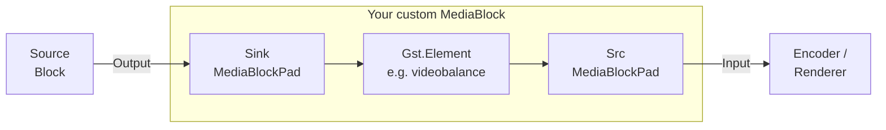

# Build your own MediaBlock from a GStreamer element in C# .NET

[Media Blocks SDK .Net](https://www.visioforge.com/media-blocks-sdk-net){ .md-button .md-button--primary target="_blank" }

The Media Blocks SDK already ships 70+ typed blocks for common video, audio,
encoding, and streaming tasks. Sometimes, though, you need a GStreamer
element that the SDK does not wrap yet — a third-party plugin, an
experimental element from `gst-plugins-bad`, or simply something you wrote
yourself. This guide shows how to integrate any single GStreamer element
into a `MediaBlocksPipeline` as a first-class block.

!!! note "Why grayscale?"
    The worked example wraps `videobalance` with `saturation = 0` to convert
    video to grayscale. **The SDK already ships `GrayscaleBlock` and
    `VideoBalanceBlock`** built on the same element — you don't need to
    re-create them in production code. We use grayscale because it is the
    smallest possible example that exercises the full pattern: one element,
    one property, sink/src pads. Once you understand it, you can wrap any
    GStreamer element the same way.

## Two approaches

| Approach | When to use it |
|---|---|
| **A.** Use the built-in `CustomMediaBlock` — pass the element name and properties as data. | One-off use, prototyping, or wrapping any element from anywhere in the call chain. No subclassing, no new types. |
| **B.** Write a typed `MediaBlock` subclass. | You want a reusable, strongly typed block with a static `IsAvailable()` check, a settings class, IntelliSense, and the same feel as built-in blocks. |

Both approaches share the same idea: a MediaBlock owns a `Gst.Element`,
puts it into the pipeline's `Gst.Pipeline`, and exposes the element's
static `sink` and `src` pads as `MediaBlockPad` instances that
`MediaBlocksPipeline.Connect(...)` can wire together.



## Approach A — `CustomMediaBlock` (no subclassing)

`CustomMediaBlock` is the public, generic wrapper that does everything
described above without you having to write a class. Pass it the GStreamer
element name and a list of pads, set properties via a string-keyed
dictionary, add it to the pipeline, and connect it.

```csharp
using VisioForge.Core.MediaBlocks;
using VisioForge.Core.MediaBlocks.Special;
using VisioForge.Core.Types.X.Special;

var settings = new CustomMediaBlockSettings("videobalance");
settings.Pads.Add(new CustomMediaBlockPad(MediaBlockPadDirection.In,  MediaBlockPadMediaType.Video));
settings.Pads.Add(new CustomMediaBlockPad(MediaBlockPadDirection.Out, MediaBlockPadMediaType.Video));
settings.ElementParams["saturation"] = 0.0;          // videobalance.saturation is a double

var grayscale = new CustomMediaBlock(settings);

pipeline.AddBlock(grayscale);
pipeline.Connect(source.Output,    grayscale.Input);
pipeline.Connect(grayscale.Output, encoder.Input);
```

That is the whole block. `CustomMediaBlock.Build()` is invoked by the
pipeline during `StartAsync` and does the work: creates the
`videobalance` element via `Gst.ElementFactory.Make`, applies every entry
in `ElementParams` with `SetProperty`, adds the element to the pipeline,
and binds the sink/src pads.

### Supported property types

`ElementParams` accepts the following CLR types and maps them to the
matching `GLib.Value`:

| CLR type | GStreamer property kind |
|---|---|
| `int` | `gint`, `enum` |
| `uint` | `guint`, `flags` |
| `long` | `gint64` |
| `ulong` | `guint64` |
| `float` | `gfloat` |
| `double` | `gdouble` (most of `videobalance`, `gamma`, audio volumes, etc.) |
| `string` | `gchararray` |
| `bool` | implicit via `GLib.Value` |
| `Enum` | converted to `int` |

Match the GStreamer property type **exactly**. `videobalance.saturation`
is a `gdouble` — pass `0.0`, not `0` (int) and not `0.0f` (float).
Mis-typed properties are a silent no-op.

### Wrapping multi-element chains: bin syntax

If your transformation needs more than one GStreamer element, you can pass
a bin description in `[ ... ]` instead of a single element name. The block
parses it with `Gst.Parse.BinFromDescription` and adds the resulting bin:

```csharp
var settings = new CustomMediaBlockSettings("[ videoconvert ! videobalance saturation=0 ! videoconvert ]");
settings.Pads.Add(new CustomMediaBlockPad(MediaBlockPadDirection.In,  MediaBlockPadMediaType.Video));
settings.Pads.Add(new CustomMediaBlockPad(MediaBlockPadDirection.Out, MediaBlockPadMediaType.Video));
var block = new CustomMediaBlock(settings);
```

### Dynamic pads (demuxer-like elements)

For elements that create their src pads at runtime (e.g. `decodebin`,
`tsdemux`), set `UsePadAddedEvent = true` on the settings. `CustomMediaBlock`
inserts an `identity` per declared output pad and links them as the
element fires `pad-added`.

### Late tweaks via `OnElementAdded`

If you need to touch the raw `Gst.Element` after creation but before the
pipeline starts (signal handlers, structure caps, properties that don't
fit the `ElementParams` map), subscribe to `OnElementAdded`:

```csharp
var block = new CustomMediaBlock(settings);
block.OnElementAdded += (s, element) =>
{
    element.SetProperty("brightness", new GLib.Value(0.1));
    // … any other tweak
};
```

### When `CustomMediaBlock` is not enough

You want a typed block when:

- You will use it in many places and want IntelliSense for properties.
- You want a static `IsAvailable()` to fail fast on systems where the
  plugin is missing.
- You want a settings class with validation, defaults, and XML docs.
- You want the block to look and feel like every other SDK block in
  someone else's code review.

That is **Approach B**.

## Approach B — a typed `MediaBlock` subclass

A custom block is `MediaBlock` + `IMediaBlockInternals` + two
`MediaBlockPad`s. The pattern is small enough to memorise. Below is the
complete `MyGrayscaleBlock` from the
[`CustomGrayscaleBlock` console sample](#sample-app); read it once, then
the step-by-step breakdown after it.

```csharp
using System;
using Gst;
using VisioForge.Core.MediaBlocks;

public class MyGrayscaleBlock : MediaBlock, IMediaBlockInternals
{
    private const string TAG = "MyGrayscaleBlock";

    private Element _element;
    private readonly MediaBlockPad _inputPad;
    private readonly MediaBlockPad _outputPad;

    public override MediaBlockType Type => MediaBlockType.Custom;
    public override MediaBlockPad Input => _inputPad;
    public override MediaBlockPad[] Inputs => new[] { _inputPad };
    public override MediaBlockPad Output => _outputPad;
    public override MediaBlockPad[] Outputs => new[] { _outputPad };

    public MyGrayscaleBlock()
    {
        Name = "MyGrayscale";
        _inputPad  = new MediaBlockPad(this, MediaBlockPadDirection.In,  MediaBlockPadMediaType.Video);
        _outputPad = new MediaBlockPad(this, MediaBlockPadDirection.Out, MediaBlockPadMediaType.Video);
    }

    public static bool IsAvailable()
    {
        var factory = ElementFactory.Find("videobalance");
        if (factory == null) return false;
        factory.Dispose();
        return true;
    }

    public override bool Build()
    {
        if (_isBuilt) return true;

        _element = ElementFactory.Make("videobalance", $"videobalance_{Guid.NewGuid():N}");
        if (_element == null)
        {
            Context?.Error(TAG, "Build", "Unable to create videobalance element.");
            return false;
        }

        _element.SetProperty("saturation", new GLib.Value(0.0));
        _pipelineCtx.Pipeline.Add(_element);

        var sink = _element.GetStaticPad("sink");
        var src  = _element.GetStaticPad("src");
        if (sink == null || src == null)
        {
            Context?.Error(TAG, "Build", "Unable to retrieve videobalance static pads.");
            _pipelineCtx.Pipeline.Remove(_element);
            _element.Dispose();
            _element = null;
            return false;
        }

        _inputPad.SetInternalPad(sink);
        _outputPad.SetInternalPad(src);

        _isBuilt = true;
        return true;
    }

    void IMediaBlockInternals.SetContext(MediaBlocksPipeline pipeline)
    {
        SetPipeline(pipeline);
        Context = pipeline.GetContext();
    }

    bool IMediaBlockInternals.Build() => Build();
    Gst.Element IMediaBlockInternals.GetElement() => _element;
    VisioForge.Core.GStreamer.Base.BaseElement IMediaBlockInternals.GetCore() => null;

    public void CleanUp()
    {
        _element?.Dispose();
        _element = null;
    }

    protected override void Dispose(bool disposing)
    {
        if (disposing) CleanUp();
        base.Dispose(disposing);
    }
}
```

### Step by step

#### 1. Inherit `MediaBlock`, implement `IMediaBlockInternals`

`MediaBlock` is the public, non-abstract base class. `IMediaBlockInternals`
is the public interface the pipeline calls into during preload, build,
and teardown. You implement both.

#### 2. Declare the pads in the constructor

A `MediaBlockPad` is the MediaBlocks-level pad. The pipeline connects two
`MediaBlockPad`s with `pipeline.Connect(a, b)`; under the covers each one
forwards to an underlying GStreamer pad you assign in `Build()` via
`SetInternalPad`.

```csharp
_inputPad  = new MediaBlockPad(this, MediaBlockPadDirection.In,  MediaBlockPadMediaType.Video);
_outputPad = new MediaBlockPad(this, MediaBlockPadDirection.Out, MediaBlockPadMediaType.Video);
```

Use `MediaBlockPadMediaType.Audio` for audio elements (e.g. `audioconvert`,
`volume`), or one pad of each kind for elements that touch both streams.

#### 3. Override `Type`, `Input/Inputs`, `Output/Outputs`

`MediaBlockType.Custom` is the catch-all enum value for user-authored
blocks. The four pad properties return your single pads (singular) or
single-element arrays (plural) — the SDK uses one or the other depending
on how it is enumerating blocks.

#### 4. Implement `Build()`

This is where the GStreamer side comes alive. `Build()` runs during
`pipeline.StartAsync(...)` (or `StartAsync(onlyPreload: true)`), **not in
your constructor**. Inside it:

1. Guard `_isBuilt` to make repeat calls a no-op.
2. Create the element with `ElementFactory.Make(name, uniqueInstanceName)`.
   Pass a unique instance name (`Guid.NewGuid().ToString("N")` works) —
   GStreamer requires unique element names within a pipeline.
3. Null-check the element. `null` means the plugin is missing or the
   factory is unavailable on this platform.
4. Apply properties with `element.SetProperty("name", new GLib.Value(...))`.
   Match the property's GStreamer type exactly (see the supported types
   table above).
5. **Add the element to the pipeline before retrieving its pads.** The
   pipeline reference is exposed via the protected field `_pipelineCtx.Pipeline`.
6. Retrieve the element's static pads with `element.GetStaticPad("sink")` /
   `GetStaticPad("src")` and bind them with `MediaBlockPad.SetInternalPad(...)`.

#### 5. Static `IsAvailable()`

Conventionally every SDK block exposes a static `IsAvailable()` that
checks the registry for the underlying element. Callers use this to
decide between alternatives or fail fast with a useful diagnostic.

```csharp
public static bool IsAvailable()
{
    var factory = ElementFactory.Find("videobalance");
    if (factory == null) return false;
    factory.Dispose();
    return true;
}
```

#### 6. `IMediaBlockInternals.SetContext`

The pipeline calls this when the block is added. It wires the block to
its parent pipeline and stores the GStreamer-level `Context` for error
reporting:

```csharp
void IMediaBlockInternals.SetContext(MediaBlocksPipeline pipeline)
{
    SetPipeline(pipeline);
    Context = pipeline.GetContext();
}
```

`SetPipeline` is a protected method on `MediaBlock` that stores a weak
reference to the pipeline and populates the protected `_pipelineCtx`
field your `Build()` uses.

#### 7. `CleanUp()` and `Dispose`

`CleanUp()` is called by the pipeline during teardown. Dispose the
underlying element and clear the reference. Forward `Dispose(bool)` to
`CleanUp` for normal IDisposable lifecycle:

```csharp
public void CleanUp()
{
    _element?.Dispose();
    _element = null;
}

protected override void Dispose(bool disposing)
{
    if (disposing) CleanUp();
    base.Dispose(disposing);
}
```

#### 8. `GetElement` / `GetCore`

`GetElement` exposes the raw `Gst.Element` for advanced inspection.
`GetCore` exposes the internal `BaseElement` wrapper used by built-in
blocks; user code does not have one, so return `null`.

### Using your block

Once the class compiles, it slots into a pipeline like any other block:

```csharp
var grayscale = new MyGrayscaleBlock();

pipeline.AddBlock(source);
pipeline.AddBlock(grayscale);
pipeline.AddBlock(encoder);
pipeline.AddBlock(sink);

pipeline.Connect(source.Output,    grayscale.Input);
pipeline.Connect(grayscale.Output, encoder.Input);
```

## Adding properties and settings

`MyGrayscaleBlock` hardcodes `saturation = 0`. To expose configurable
properties, the SDK convention is a separate settings class passed to
the block's constructor:

```csharp
public class MyVideoBalanceSettings
{
    public double Brightness { get; set; } = 0.0;   // -1.0 to 1.0
    public double Contrast   { get; set; } = 1.0;   // 0.0 to 2.0
    public double Saturation { get; set; } = 1.0;   // 0.0 to 2.0 (0 = grayscale)
    public double Hue        { get; set; } = 0.0;   // -1.0 to 1.0
}

public class MyVideoBalanceBlock : MediaBlock, IMediaBlockInternals
{
    public MyVideoBalanceSettings Settings { get; }

    public MyVideoBalanceBlock(MyVideoBalanceSettings settings)
    {
        Settings = settings ?? new MyVideoBalanceSettings();
        // … pads as before
    }

    public override bool Build()
    {
        // … create element as before
        _element.SetProperty("brightness", new GLib.Value(Settings.Brightness));
        _element.SetProperty("contrast",   new GLib.Value(Settings.Contrast));
        _element.SetProperty("saturation", new GLib.Value(Settings.Saturation));
        _element.SetProperty("hue",        new GLib.Value(Settings.Hue));
        // … add to pipeline, bind pads
    }
}
```

For real-time property updates, store a reference to `_element` and
expose `Update(Settings settings)` that calls `SetProperty` on a live
element. The SDK's `VideoBalanceBlock` uses an `OnUpdate` event on its
settings class for this — read it for a fuller example.

## Discovering elements and their properties

Use the `gstreamer-doc` agent skill — or, on Windows, the local
`gst-inspect-1.0.exe` at
`C:\gstreamer\1.0\msvc_x86_64x\bin\gst-inspect-1.0.exe` — to inspect any
element before wrapping it:

```cmd
gst-inspect-1.0.exe videobalance
```

The output lists every property (with its GStreamer type and range) and
both pad templates (with their caps). Confirm:

- The element exists in the GStreamer install your customers will have.
- The properties you intend to set are named exactly what you think.
- The sink/src pad caps accept `video/x-raw` or whatever your upstream
  produces — most simple video effects negotiate `video/x-raw` agnostically
  and need no extra `capsfilter`.

## Lifecycle and caveats

- **`Build()` runs during pipeline preload, not in the constructor.** Do
  not touch the underlying element from your block's constructor — it
  doesn't exist yet.
- **Add the element to `_pipelineCtx.Pipeline` *before* you call
  `GetStaticPad`.** Pads exist as soon as the factory creates the element,
  but the pipeline manages lifecycle from the moment `Add` is called.
- **Match GStreamer property types exactly.** A `gdouble` property set
  with an `int` value is a silent no-op. `gst-inspect-1.0` tells you the
  type.
- **Use unique element instance names.** Two elements with the same name
  in one `Gst.Pipeline` is an error.
- **Don't use `ConfigureAwait(false)` in SDK-adjacent code.** Project
  convention; the SDK enforces it.
- **Custom elements with dynamic pads** (decoders, demuxers) belong in
  `CustomMediaBlock` with `UsePadAddedEvent = true`, not in a hand-written
  subclass — the bookkeeping for `pad-added` is non-trivial.

## When to prefer a different block type

`MediaBlock` is the right base when you want to **wrap a GStreamer
element**. The SDK has two related public blocks for different use cases:

| Block | Use it when |
|---|---|
| [`CustomMediaBlock`](../Special/index.md) | You want Approach A from this guide — wrap a single element or a bin description without subclassing. |
| `CustomTransformBlock` | You want a managed-side transform: input samples arrive in your code via an event, and you push output samples back. No GStreamer-level transformation element. |
| `DataProcessorBlock` | You want to read or modify raw video/audio buffers in managed code without producing different output (pure inspection, frame counting, metadata extraction). |
| `SuperMediaBlock` | You want to group several existing blocks into a single composite block with shared lifecycle. |

## Sample app

The companion sample `CustomGrayscaleBlock` lives in the SDK samples tree
under [`Media Blocks SDK/Console/CustomGrayscaleBlock`](https://github.com/visioforge/.Net-SDK-s-samples/tree/master/Media%20Blocks%20SDK/Console/CustomGrayscaleBlock). It runs
both approaches back-to-back and writes one MP4 per approach so you can
compare them.

Files:

- `Program.cs` — builds both pipelines.
- `MyGrayscaleBlock.cs` — the typed subclass from this guide.
- `CustomGrayscaleBlock.csproj` — cross-platform console project.

## See also

- [Custom Video Effects and OpenGL Shaders](custom-video-effects-csharp.md) —
  the SDK's catalog of built-in effect blocks, including the production
  `GrayscaleBlock` and `VideoBalanceBlock`.
- [Special blocks](../Special/index.md) — `CustomMediaBlock`,
  `CustomTransformBlock`, `DataProcessorBlock`, `SuperMediaBlock`.
- [Video Processing blocks](../VideoProcessing/index.md) — the full set
  of typed effect blocks.
