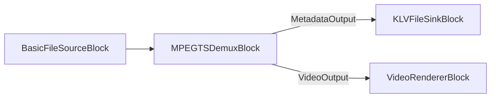

# Metadatos KLV / MISB en MPEG-TS con C# .NET

[Media Blocks SDK .Net](https://www.visioforge.com/media-blocks-sdk-net){ .md-button .md-button--primary target="_blank" }

## Resumen

KLV (Key-Length-Value) es la codificación de metadatos binarios que usan los flujos MPEG-TS MISB / STANAG 4609 para transportar
telemetría geoespacial y de sensores junto con el video — feeds de UAV/dron, ISR y vigilancia. El Media Blocks
SDK .NET le permite:

1. **Extraer** el flujo de metadatos KLV de un archivo MPEG-TS.
2. **Analizar** elementos MISB ST 0601 (o leer elementos clave/valor en bruto).
3. **Incrustar** una carga KLV en una salida MPEG-TS.



Los bloques KLV residen en `VisioForge.Core.MediaBlocks.Sinks` / `VisioForge.Core.MediaBlocks.Sources`; los
decodificadores residen en `VisioForge.Core.Metadata` y `VisioForge.Core.Metadata.KLV`. La demultiplexación/extracción de KLV funciona en
Windows, Linux y macOS.

## Requisitos previos

Instale el paquete NuGet de Media Blocks SDK y el paquete de runtime de la plataforma (por ejemplo
`VisioForge.CrossPlatform.Core.Windows.x64`). Llame a `VisioForgeX.InitSDKAsync()` una vez al iniciar.

## Extraer KLV de un archivo MPEG-TS

Demultiplexe el flujo de transporte y enrute su **pad de metadatos** a un `KLVFileSinkBlock`, que escribe los
paquetes `meta/x-klv` en un archivo `.klv`. Pase `renderMetadata: true` para que el demultiplexor exponga su
pad `MetadataOutput`.

```csharp
using VisioForge.Core;
using VisioForge.Core.MediaBlocks;
using VisioForge.Core.MediaBlocks.Sinks;
using VisioForge.Core.MediaBlocks.Sources;

await VisioForgeX.InitSDKAsync();

var pipeline = new MediaBlocksPipeline();

var fileSource = new BasicFileSourceBlock("mission.ts");

// renderVideo: false, renderMetadata: true -> solo queremos el pad de metadatos KLV.
var demux = new MPEGTSDemuxBlock(false, renderMetadata: true);

var klvSink = new KLVFileSinkBlock("mission_metadata.klv");

pipeline.Connect(fileSource.Output, demux.Input);
pipeline.Connect(demux.MetadataOutput, klvSink.Input);

await pipeline.StartAsync();
```

Para previsualizar el video al mismo tiempo, conecte también `demux.VideoOutput` a un `VideoRendererBlock`
(construya el demultiplexor con `renderVideo: true`).

## Analizar el KLV extraído

Para el **KLV MISB estándar** extraído de un flujo MPEG-TS, use `KLVParser`. Decodifica los elementos del
conjunto local MISB ST 0601 (marca de tiempo de precisión, posición y orientación de la plataforma/sensor,
geolocalización del centro del fotograma, ubicación del objetivo y más de 100 elementos) y maneja las
**longitudes codificadas en BER** que usan los paquetes MISB:

```csharp
using VisioForge.Core.Metadata.KLV;

var klv = new KLVParser("mission_metadata.klv"); // también acepta un Stream
foreach (var element in klv.Elements)
{
    Console.WriteLine(element.ToString());
}
```

`KLVDecoder` es un lector en bruto más simple que recorre claves de 16 bytes, cada una seguida de una
**longitud fija de 4 bytes little-endian**. NO decodifica longitudes BER, así que úselo solo para KLV
almacenado en ese formato de longitud fija — no para el KLV MISB estándar de un flujo de transporte (use
`KLVParser` para eso):

```csharp
using VisioForge.Core.Metadata;

// DecodeFromBytes(byte[]) es el equivalente en memoria de DecodeFromFile.
foreach (KLVItem item in KLVDecoder.DecodeFromFile("fixed_length.klv"))
{
    // item.Key   - clave universal de 16 bytes como cadena hexadecimal
    // item.Value - bytes de valor en bruto
    Console.WriteLine($"{item.Key} ({item.Value.Length} bytes)");
}
```

## Incrustar una carga KLV en una salida MPEG-TS

Para adjuntar una carga KLV a un archivo MPEG-TS, establezca la propiedad `MPEGTSSinkSettings.Metadata` en una
fuente `KLVMetadata`. `KLVMetadata` acepta una ruta de archivo `.klv` o un `byte[]`.

```csharp
using VisioForge.Core.MediaBlocks.Sinks;
using VisioForge.Core.Types.X.Metadata;
using VisioForge.Core.Types.X.Sinks;

var tsSettings = new MPEGTSSinkSettings("output.ts")
{
    Metadata = new KLVMetadata("mission_metadata.klv"),
};

var tsSink = new MPEGTSSinkBlock(tsSettings);
// Conecte sus productores de video (y audio) a tsSink y luego inicie el pipeline.
```

!!! note "Carga estática, no una pista de metadatos re-temporizada"
    `KLVMetadata` carga todo el `.klv` como un único `byte[]`, y el muxer lo incrusta sin marcas de tiempo por
    paquete. Esto adjunta una carga KLV **estática** a la salida — no reconstruye la pista de metadatos original
    sincronizada por PCR/PTS con precisión de fotograma. Para aplicaciones que necesiten KLV por fotograma
    sincronizado con el video, alimente el KLV desde una fuente en vivo a medida que se produce, en lugar de
    re-incrustar un archivo plano.

## Grabar KLV en vivo durante la captura (Video Capture SDK)

Al capturar un feed MISB de cámara IP/UAV con el motor `VideoCaptureCore` del
[Video Capture SDK .NET](https://www.visioforge.com/video-capture-sdk-net),
habilite KLV en la salida MPEG-TS para pasar los metadatos a la grabación:

```csharp
// Salida del multiplexor MF en proceso:
videoCapture.Output_Format = new MPEGTSOutput { KLVEnabled = true };

// O salida mediante pipe a ffmpeg.exe externo:
videoCapture.Network_Streaming_Output = new FFMPEGEXEOutput
{
    OutputMuxer = OutputMuxer.MPEGTS,
    KLVEnabled = true,
    UsePipe = true,
};
```

Suscríbase a `VideoCaptureCore.OnDataFrameBuffer` y filtre por `DataFrameType.KLV` para leer los paquetes KLV
en vivo a medida que llegan. Consulte el code snippet `ip-camera-klv-mpegts-recorder` en
[`Video Capture SDK/_CodeSnippets`](https://github.com/visioforge/.Net-SDK-s-samples/tree/master/Video%20Capture%20SDK/_CodeSnippets).

## Demos

- **KLV Demo** (WPF) — [KLV Demo](https://github.com/visioforge/.Net-SDK-s-samples/tree/master/Media%20Blocks%20SDK/WPF/CSharp/KLV%20Demo) — extraer KLV de un archivo MPEG-TS y analizar elementos MISB 0601 en un visor.
- **ip-camera-klv-mpegts-recorder** (code snippet) — [ip-camera-klv-mpegts-recorder](https://github.com/visioforge/.Net-SDK-s-samples/tree/master/Video%20Capture%20SDK/_CodeSnippets/ip-camera-klv-mpegts-recorder) — capturar una cámara IP MISB y grabar/retransmitir KLV en MPEG-TS.

## Véase también

- [MPEG-TS Stream Analyzer Block](../Special/TSAnalyzerBlock.md) — PAT/PMT/PCR, tasa de bits por PID y conformidad TR 101 290.
- [Grabar un flujo UDP MPEG-TS sin recodificar](udp-mpegts-record-without-reencoding.md)
- [Bloques demultiplexores de medios](../Demuxers/index.md)
- [Destinos — KLV File Sink](../Sinks/index.md#sink-de-archivo-klv)
