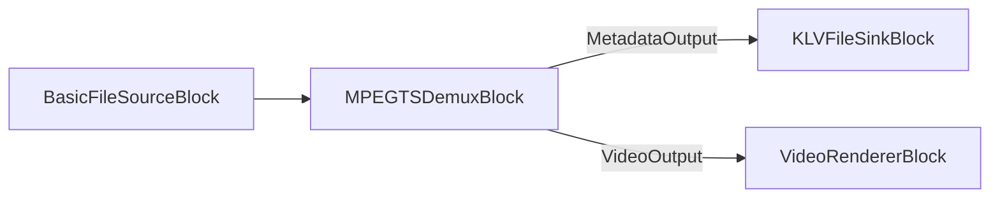

# Métadonnées KLV / MISB en MPEG-TS avec C# .NET

[Media Blocks SDK .Net](https://www.visioforge.com/media-blocks-sdk-net){ .md-button .md-button--primary target="_blank" }

## Vue d'ensemble

KLV (Key-Length-Value) est l'encodage de métadonnées binaires utilisé par les flux MPEG-TS MISB / STANAG 4609 pour transporter
la télémétrie géospatiale et capteur aux côtés de la vidéo — flux UAV/drone, ISR et surveillance. Le Media Blocks
SDK .NET vous permet de :

1. **Extraire** le flux de métadonnées KLV d'un fichier MPEG-TS.
2. **Analyser** les éléments MISB ST 0601 (ou lire les éléments clé/valeur bruts).
3. **Intégrer** une charge KLV dans une sortie MPEG-TS.



Les blocs KLV se trouvent dans `VisioForge.Core.MediaBlocks.Sinks` / `VisioForge.Core.MediaBlocks.Sources` ; les
décodeurs se trouvent dans `VisioForge.Core.Metadata` et `VisioForge.Core.Metadata.KLV`. Le démultiplexage/l'extraction KLV fonctionne sous
Windows, Linux et macOS.

## Prérequis

Installez le paquet NuGet Media Blocks SDK et le paquet de runtime de la plateforme (par exemple
`VisioForge.CrossPlatform.Core.Windows.x64`). Appelez `VisioForgeX.InitSDKAsync()` une fois au démarrage.

## Extraire le KLV d'un fichier MPEG-TS

Démultiplexez le flux de transport et routez son **pad de métadonnées** vers un `KLVFileSinkBlock`, qui écrit les
paquets `meta/x-klv` dans un fichier `.klv`. Passez `renderMetadata: true` pour que le démultiplexeur expose son
pad `MetadataOutput`.

```csharp
using VisioForge.Core;
using VisioForge.Core.MediaBlocks;
using VisioForge.Core.MediaBlocks.Sinks;
using VisioForge.Core.MediaBlocks.Sources;

await VisioForgeX.InitSDKAsync();

var pipeline = new MediaBlocksPipeline();

var fileSource = new BasicFileSourceBlock("mission.ts");

// renderVideo: false, renderMetadata: true -> nous ne voulons que le pad de métadonnées KLV.
var demux = new MPEGTSDemuxBlock(false, renderMetadata: true);

var klvSink = new KLVFileSinkBlock("mission_metadata.klv");

pipeline.Connect(fileSource.Output, demux.Input);
pipeline.Connect(demux.MetadataOutput, klvSink.Input);

await pipeline.StartAsync();
```

Pour prévisualiser la vidéo en même temps, connectez aussi `demux.VideoOutput` à un `VideoRendererBlock`
(construisez le démultiplexeur avec `renderVideo: true`).

## Analyser le KLV extrait

Pour le **KLV MISB standard** extrait d'un flux MPEG-TS, utilisez `KLVParser`. Il décode les éléments du jeu
local MISB ST 0601 (horodatage de précision, position et orientation de la plateforme/du capteur,
géolocalisation du centre de l'image, position de la cible, et plus de 100 autres) et gère les **longueurs
encodées en BER** qu'utilisent les paquets MISB :

```csharp
using VisioForge.Core.Metadata.KLV;

var klv = new KLVParser("mission_metadata.klv"); // accepte aussi un Stream
foreach (var element in klv.Elements)
{
    Console.WriteLine(element.ToString());
}
```

`KLVDecoder` est un lecteur brut plus simple qui parcourt des clés de 16 octets, chacune suivie d'une
**longueur fixe de 4 octets little-endian**. Il ne décode PAS les longueurs BER ; utilisez-le donc uniquement
pour du KLV stocké dans ce format à longueur fixe — pas pour le KLV MISB standard d'un flux de transport
(utilisez `KLVParser` dans ce cas) :

```csharp
using VisioForge.Core.Metadata;

// DecodeFromBytes(byte[]) est l'équivalent en mémoire de DecodeFromFile.
foreach (KLVItem item in KLVDecoder.DecodeFromFile("fixed_length.klv"))
{
    // item.Key   - clé universelle de 16 octets sous forme de chaîne hexadécimale
    // item.Value - octets de valeur bruts
    Console.WriteLine($"{item.Key} ({item.Value.Length} bytes)");
}
```

## Intégrer une charge KLV dans une sortie MPEG-TS

Pour joindre une charge KLV à un fichier MPEG-TS, affectez la propriété `MPEGTSSinkSettings.Metadata` à une
source `KLVMetadata`. `KLVMetadata` accepte un chemin de fichier `.klv` ou un `byte[]`.

```csharp
using VisioForge.Core.MediaBlocks.Sinks;
using VisioForge.Core.Types.X.Metadata;
using VisioForge.Core.Types.X.Sinks;

var tsSettings = new MPEGTSSinkSettings("output.ts")
{
    Metadata = new KLVMetadata("mission_metadata.klv"),
};

var tsSink = new MPEGTSSinkBlock(tsSettings);
// Connectez vos producteurs vidéo (et audio) à tsSink, puis démarrez le pipeline.
```

!!! note "Charge statique, pas une piste de métadonnées re-synchronisée"
    `KLVMetadata` charge l'intégralité du `.klv` en un seul `byte[]`, et le multiplexeur l'intègre sans
    horodatage par paquet. Cela joint une charge KLV **statique** à la sortie — il ne reconstitue pas la piste
    de métadonnées d'origine synchronisée par PCR/PTS à l'image près. Pour les applications nécessitant du KLV
    par image synchronisé avec la vidéo, alimentez le KLV depuis une source en direct au fur et à mesure de sa
    production, au lieu de ré-intégrer un fichier plat.

## Enregistrer le KLV en direct pendant la capture (Video Capture SDK)

Lors de la capture d'un flux MISB caméra IP/UAV avec le moteur `VideoCaptureCore` du
[Video Capture SDK .NET](https://www.visioforge.com/video-capture-sdk-net),
activez le KLV sur la sortie MPEG-TS pour transmettre les métadonnées à l'enregistrement :

```csharp
// Sortie du multiplexeur MF en cours de processus :
videoCapture.Output_Format = new MPEGTSOutput { KLVEnabled = true };

// Ou sortie via pipe vers ffmpeg.exe externe :
videoCapture.Network_Streaming_Output = new FFMPEGEXEOutput
{
    OutputMuxer = OutputMuxer.MPEGTS,
    KLVEnabled = true,
    UsePipe = true,
};
```

Abonnez-vous à `VideoCaptureCore.OnDataFrameBuffer` et filtrez sur `DataFrameType.KLV` pour lire les paquets KLV
en direct à mesure qu'ils arrivent. Voir le code snippet `ip-camera-klv-mpegts-recorder` sous
[`Video Capture SDK/_CodeSnippets`](https://github.com/visioforge/.Net-SDK-s-samples/tree/master/Video%20Capture%20SDK/_CodeSnippets).

## Démos

- **KLV Demo** (WPF) — [KLV Demo](https://github.com/visioforge/.Net-SDK-s-samples/tree/master/Media%20Blocks%20SDK/WPF/CSharp/KLV%20Demo) — extraire le KLV d'un fichier MPEG-TS et analyser les éléments MISB 0601 dans une visionneuse.
- **ip-camera-klv-mpegts-recorder** (code snippet) — [ip-camera-klv-mpegts-recorder](https://github.com/visioforge/.Net-SDK-s-samples/tree/master/Video%20Capture%20SDK/_CodeSnippets/ip-camera-klv-mpegts-recorder) — capturer une caméra IP MISB et enregistrer/rediffuser le KLV en MPEG-TS.

## Voir aussi

- [MPEG-TS Stream Analyzer Block](../Special/TSAnalyzerBlock.md) — PAT/PMT/PCR, débit par PID et conformité TR 101 290.
- [Enregistrer un flux UDP MPEG-TS sans réencodage](udp-mpegts-record-without-reencoding.md)
- [Blocs démultiplexeurs de médias](../Demuxers/index.md)
- [Puits — KLV File Sink](../Sinks/index.md#klv-file-sink)
