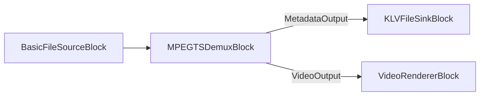

# KLV / MISB Metadata in MPEG-TS with C# .NET

[Media Blocks SDK .Net](https://www.visioforge.com/media-blocks-sdk-net){ .md-button .md-button--primary target="_blank" }

## Overview

KLV (Key-Length-Value) is the binary metadata encoding used by MISB / STANAG 4609 MPEG-TS streams to carry
geospatial and sensor telemetry alongside video — UAV/drone, ISR, and surveillance feeds. The Media Blocks
SDK .NET lets you:

1. **Extract** the KLV metadata stream from an MPEG-TS file.
2. **Parse** MISB ST 0601 elements (or read raw key/value items).
3. **Embed** a KLV payload into an MPEG-TS output.



The KLV blocks live in `VisioForge.Core.MediaBlocks.Sinks` / `VisioForge.Core.MediaBlocks.Sources`; the
decoders live in `VisioForge.Core.Metadata` and `VisioForge.Core.Metadata.KLV`. KLV demux/extract works on
Windows, Linux, and macOS.

## Prerequisites

Install the Media Blocks SDK NuGet package and the platform runtime package (for example
`VisioForge.CrossPlatform.Core.Windows.x64`). Call `VisioForgeX.InitSDKAsync()` once at startup.

## Extract KLV from an MPEG-TS file

Demux the transport stream and route its **metadata pad** to a `KLVFileSinkBlock`, which writes the
`meta/x-klv` packets to a `.klv` file. Pass `renderMetadata: true` so the demuxer exposes its
`MetadataOutput` pad.

```csharp
using VisioForge.Core;
using VisioForge.Core.MediaBlocks;
using VisioForge.Core.MediaBlocks.Sinks;
using VisioForge.Core.MediaBlocks.Sources;

await VisioForgeX.InitSDKAsync();

var pipeline = new MediaBlocksPipeline();

var fileSource = new BasicFileSourceBlock("mission.ts");

// renderVideo: false, renderMetadata: true -> we only want the KLV metadata pad.
var demux = new MPEGTSDemuxBlock(false, renderMetadata: true);

var klvSink = new KLVFileSinkBlock("mission_metadata.klv");

pipeline.Connect(fileSource.Output, demux.Input);
pipeline.Connect(demux.MetadataOutput, klvSink.Input);

await pipeline.StartAsync();
```

To preview the video at the same time, also connect `demux.VideoOutput` to a `VideoRendererBlock`
(build the demuxer with `renderVideo: true`).

## Parse the extracted KLV

For **standard MISB KLV** extracted from an MPEG-TS stream, use `KLVParser`. It decodes MISB ST 0601
local-set elements (precision time stamp, platform/sensor position and orientation, frame-center
geolocation, target location, and 100+ more) and handles the **BER-encoded lengths** that MISB packets use:

```csharp
using VisioForge.Core.Metadata.KLV;

var klv = new KLVParser("mission_metadata.klv"); // also accepts a Stream
foreach (var element in klv.Elements)
{
    Console.WriteLine(element.ToString());
}
```

`KLVDecoder` is a lighter raw reader that walks 16-byte keys each followed by a **fixed 4-byte
little-endian length**. It does NOT decode BER lengths, so use it only for KLV stored in that fixed-length
layout — not for standard MISB transport-stream KLV (use `KLVParser` for that):

```csharp
using VisioForge.Core.Metadata;

// DecodeFromBytes(byte[]) is the in-memory equivalent of DecodeFromFile.
foreach (KLVItem item in KLVDecoder.DecodeFromFile("fixed_length.klv"))
{
    // item.Key   - 16-byte universal key as a hex string
    // item.Value - raw value bytes
    Console.WriteLine($"{item.Key} ({item.Value.Length} bytes)");
}
```

## Embed a KLV payload into an MPEG-TS output

To attach a KLV payload to an MPEG-TS file, set the `MPEGTSSinkSettings.Metadata` property to a
`KLVMetadata` source. `KLVMetadata` accepts a `.klv` file path or a `byte[]`.

```csharp
using VisioForge.Core.MediaBlocks.Sinks;
using VisioForge.Core.Types.X.Metadata;
using VisioForge.Core.Types.X.Sinks;

var tsSettings = new MPEGTSSinkSettings("output.ts")
{
    Metadata = new KLVMetadata("mission_metadata.klv"),
};

var tsSink = new MPEGTSSinkBlock(tsSettings);
// Connect your video (and audio) producers to tsSink, then start the pipeline.
```

!!! note "Static payload, not a re-timed metadata track"
    `KLVMetadata` loads the whole `.klv` as a single `byte[]`, and the muxer embeds it without per-packet
    timestamps. This attaches a **static** KLV payload to the output — it does not reconstruct the original
    frame-accurate, PCR/PTS-synchronized metadata track. For applications that need per-frame KLV synchronized
    to the video, drive the KLV from a live source as it is produced rather than re-embedding a flat file.

## Record live KLV while capturing (Video Capture SDK)

When capturing a MISB IP-camera/UAV feed with the [Video Capture SDK .NET](https://www.visioforge.com/video-capture-sdk-net)
`VideoCaptureCore` engine, enable KLV on the MPEG-TS output to pass the metadata through to the recording:

```csharp
// In-process MF muxer output:
videoCapture.Output_Format = new MPEGTSOutput { KLVEnabled = true };

// Or external ffmpeg.exe pipe output:
videoCapture.Network_Streaming_Output = new FFMPEGEXEOutput
{
    OutputMuxer = OutputMuxer.MPEGTS,
    KLVEnabled = true,
    UsePipe = true,
};
```

Subscribe to `VideoCaptureCore.OnDataFrameBuffer` and filter for `DataFrameType.KLV` to read the live KLV
packets as they arrive. See the `ip-camera-klv-mpegts-recorder` code snippet under
`_DEMOS/Video Capture SDK/_CodeSnippets/`.

## Demos

- **KLV Demo** (WPF) — `_DEMOS/Media Blocks SDK/WPF/CSharp/KLV Demo` — extract KLV from an MPEG-TS file and parse MISB 0601 elements in a viewer.
- **ip-camera-klv-mpegts-recorder** (code snippet) — `_DEMOS/Video Capture SDK/_CodeSnippets/ip-camera-klv-mpegts-recorder` — capture a MISB IP camera and record/restream KLV in MPEG-TS.

## See also

- [MPEG-TS Stream Analyzer Block](../Special/TSAnalyzerBlock.md) — PAT/PMT/PCR, per-PID bitrate, and TR 101 290 compliance.
- [Record a UDP MPEG-TS Stream Without Re-encoding](udp-mpegts-record-without-reencoding.md)
- [Media Demuxer Blocks](../Demuxers/index.md)
- [Sinks — KLV File Sink](../Sinks/index.md#klv-file-sink)
