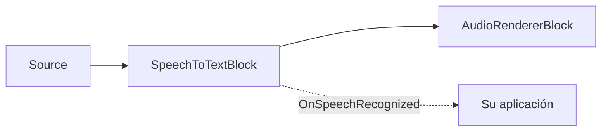

# Subtítulos en vivo y voz a texto en C# .NET

[Media Blocks SDK .Net](https://www.visioforge.com/media-blocks-sdk-net){ .md-button .md-button--primary target="_blank" }

## Resumen

`SpeechToTextBlock` añade **reconocimiento de voz local y sin conexión** a cualquier pipeline de Media Blocks. Ejecuta el modelo ASR
[Whisper](https://github.com/openai/whisper) (a través de [Whisper.net](https://github.com/sandrohanea/whisper.net),
el backend whisper.cpp / GGML) en la CPU o en una GPU NVIDIA (CUDA), con detección de actividad de voz
[Silero VAD](https://github.com/snakers4/silero-vad) opcional para dividir el habla en segmentos limpios.
No se envía nada a la nube.

El bloque se sitúa **en línea** en la ruta de audio — el audio pasa sin cambios — y emite un
evento `OnSpeechRecognized` con segmentos de texto con marcas de tiempo. Úselo para:

1. **Transcribir un archivo multimedia** a texto, SRT o VTT (sin pérdidas, al ritmo del transcriptor).
2. **Subtitular una fuente en vivo** (micrófono, tarjeta de captura, cámara RTSP) en tiempo real.



El bloque reside en el espacio de nombres `VisioForge.Core.MediaBlocks.AI` y se incluye en el complemento **VisioForge AI Whisper**
— paquete NuGet `VisioForge.DotNet.Core.AI.Whisper` (ensamblado `VisioForge.Core.AI.Whisper`),
construido sobre `Whisper.net`. Necesita el paquete de runtime habitual de la plataforma
(por ejemplo `VisioForge.CrossPlatform.Core.Windows.x64`) y funciona en Windows, Linux y macOS.

## Modelos

Los pesos GGML de Whisper y el modelo Silero VAD se **descargan en tiempo de ejecución** — ninguno se incluye dentro
de los paquetes NuGet. Descárguelos una vez y reutilice los archivos locales:

- **Modelo GGML de Whisper** (`ggml-*.bin`): descárguelo con `WhisperGgmlDownloader` de Whisper.net, o tome un
  `ggml-*.bin` del repositorio de modelos de whisper.cpp.
- **Modelo Silero VAD** (`silero_vad.onnx`, MIT): del repositorio
  [silero-vad](https://github.com/snakers4/silero-vad).

```csharp
using Whisper.net.Ggml;

// Descargar el modelo "base" de Whisper a una caché local la primera vez y luego reutilizarlo.
var modelsDir = Path.Combine(
    Environment.GetFolderPath(Environment.SpecialFolder.UserProfile), "VisioForge", "models");
Directory.CreateDirectory(modelsDir);

var whisperModelPath = Path.Combine(modelsDir, "ggml-base.bin");
if (!File.Exists(whisperModelPath))
{
    using var modelStream = await WhisperGgmlDownloader.Default.GetGgmlModelAsync(GgmlType.Base);
    using var fileStream = File.Create(whisperModelPath);
    await modelStream.CopyToAsync(fileStream);
}

// Modelo Silero VAD — descargue silero_vad.onnx en la misma caché (vea «Modelos» arriba).
var sileroModelPath = Path.Combine(modelsDir, "silero_vad.onnx");
```

Elija el tamaño del modelo según el equilibrio precisión/velocidad/RAM que necesite. `SpeechToTextSettings.ModelSize` es
informativo (permite a su aplicación etiquetar o elegir una descarga); el archivo que realmente se carga es siempre
`WhisperModelPath`.

| `WhisperModelSize` | Notas |
| --- | --- |
| `Tiny` / `TinyQuantized` | El más rápido, menor precisión. |
| `Base` | Buen valor predeterminado para CPU en tiempo real. |
| `Small` / `Medium` | Mayor precisión, más pesado. |
| `LargeV3` / `LargeV3Turbo` | Máxima precisión; se recomienda GPU. |

## Transcribir un archivo multimedia

La transcripción es sin pérdidas: el bloque ajusta la fuente al rendimiento exacto de la transcripción, por lo que no se descarta nada
y el pipeline corre tan rápido como Whisper pueda seguir. Combínelo con un destino no sincronizado para que ningún reloj en tiempo
real limite la velocidad.

```csharp
using VisioForge.Core;
using VisioForge.Core.MediaBlocks;
using VisioForge.Core.MediaBlocks.AI;
using VisioForge.Core.MediaBlocks.Sources;
using VisioForge.Core.MediaBlocks.Special; // NullRendererBlock
using VisioForge.Core.Types;
using VisioForge.Core.Types.Events;
using VisioForge.Core.Types.X.AI;
using VisioForge.Core.Types.X.Sources;

await VisioForgeX.InitSDKAsync();

var pipeline = new MediaBlocksPipeline();

var settings = new SpeechToTextSettings(whisperModelPath)
{
    Language = "auto",                          // código ISO 639-1 ("en", "es", "fr") o "auto"
    Provider = OnnxExecutionProvider.Auto,      // CUDA cuando esté disponible, si no CPU
    EnableVad = true,                           // segmentar el habla con Silero VAD
    OutputSrtPath = "subtitles.srt",            // SRT lateral opcional (VTT con OutputVttPath)
};
settings.Vad.ModelPath = sileroModelPath;       // ruta a silero_vad.onnx

// Fuente solo de audio desde un archivo.
var source = new UniversalSourceBlock(
    await UniversalSourceSettings.CreateAsync("input.mp4", renderVideo: false, renderAudio: true));

var stt = new SpeechToTextBlock(settings);
stt.OnSpeechRecognized += (s, e) =>
{
    foreach (var seg in e.Segments)
    {
        if (!string.IsNullOrWhiteSpace(seg.Text))
        {
            Console.WriteLine($"[{seg.StartTime:hh\\:mm\\:ss}] {seg.Text.Trim()}");
        }
    }
};

// Destino nulo no sincronizado: sin reloj en tiempo real, la ejecución solo la limita la velocidad de transcripción.
var sink = new NullRendererBlock(MediaBlockPadMediaType.Audio) { IsSync = false };

pipeline.Connect(source.AudioOutput, stt.Input);
pipeline.Connect(stt.Output, sink.Input);

await pipeline.StartAsync();
```

Establecer `OutputSrtPath` (o `OutputVttPath`) hace que el bloque escriba un archivo de subtítulos directamente a medida que los segmentos finales
se reconocen — sin código adicional.

## Subtitular una fuente en vivo

El mismo bloque subtitula un dispositivo de captura en vivo — conecte una fuente de micrófono en lugar de un archivo. El bloque
transcribe en línea y nunca descarta audio: ajusta la fuente al ritmo de Whisper. Whisper Base se ejecuta muy por encima del tiempo
real, por lo que un micrófono típico no se ve limitado; si el modelo es más lento que el tiempo real, la fuente se frena hasta la
velocidad de transcripción en lugar de perder muestras.

```csharp
using VisioForge.Core.MediaBlocks.AudioRendering;
using VisioForge.Core.MediaBlocks.Sources;

// Elegir el primer micrófono del sistema.
var audioDevices = await SystemAudioSourceBlock.GetDevicesAsync();
var mic = new SystemAudioSourceBlock(audioDevices[0].CreateSourceSettings());

var settings = new SpeechToTextSettings(whisperModelPath)
{
    Language = "en",
    Provider = OnnxExecutionProvider.Auto,
    EnableVad = true,
};
settings.Vad.ModelPath = sileroModelPath;

var stt = new SpeechToTextBlock(settings);
stt.OnSpeechRecognized += (s, e) =>
{
    // Se emite en el hilo de streaming de GStreamer — sincronícelo con el hilo de la interfaz antes de tocar la UI.
    foreach (var seg in e.Segments)
    {
        Console.WriteLine(seg.Text);
    }
};

var audioRenderer = new AudioRendererBlock();

pipeline.Connect(mic.Output, stt.Input);          // el audio pasa por el bloque sin cambios
pipeline.Connect(stt.Output, audioRenderer.Input);

await pipeline.StartAsync();
```

## Renderizar subtítulos en vivo sobre el video

`SpeechToTextBlock` es solo de audio, por lo que no dibuja subtítulos por sí mismo. Para subtítulos
en pantalla, agregue un `OverlayManagerBlock` a la rama de video y conecte
`SpeechToTextBlock.OnSpeechRecognized` a `SubtitleRenderer.OnSpeechRecognized`.

```csharp
using SkiaSharp;
using VisioForge.Core.AI.Whisper.Subtitles;
using VisioForge.Core.MediaBlocks.VideoProcessing;
using VisioForge.Core.MediaBlocks.VideoRendering;

var overlay = new OverlayManagerBlock();
var videoRenderer = new VideoRendererBlock(pipeline, videoView) { IsSync = false };

var subtitleRenderer = new SubtitleRenderer(
    overlay,
    new SubtitleStyle
    {
        X = 40,
        Y = 380,
        FontName = "Arial",
        FontSize = 30,
        Color = SKColors.White,
        MinDisplay = TimeSpan.FromSeconds(1.5),
        MaxDisplay = TimeSpan.FromSeconds(6),
    });

stt.OnSpeechRecognized += subtitleRenderer.OnSpeechRecognized;

pipeline.Connect(source.VideoOutput, overlay.Input);
pipeline.Connect(overlay.Output, videoRenderer.Input);
```

`SubtitleRenderer` controla un único overlay de texto, muestra el último subtítulo reconocido y lo
oculta automáticamente tras la duración del segmento limitada a `MinDisplay..MaxDisplay`.
`OnSpeechRecognized` se emite en el hilo de streaming de GStreamer; haga marshal al hilo UI antes de tocar
objetos estrictamente UI si su plataforma lo requiere. Deseche el renderer al detener el pipeline
para quitar el overlay y el temporizador.

| Propiedad de `SubtitleStyle` | Predeterminado | Descripción |
| --- | --- | --- |
| `FontName` / `FontSize` | `Arial` / `32` | Fuente del texto. |
| `Color` | `White` | Color del texto. |
| `X` / `Y` | `50` / `50` | Posición del overlay en píxeles. |
| `MinDisplay` / `MaxDisplay` | `1.5 s` / `6 s` | Tiempo mínimo y máximo en pantalla para cada subtítulo. |

## Resultados del reconocimiento

`OnSpeechRecognized` se emite en el **hilo de streaming de GStreamer** y lleva un `SpeechRecognizedEventArgs`:

- `Segments` — un `SpeechSegment[]` (un evento puede llevar varios segmentos).
- `Timestamp` — el tiempo multimedia al que pertenecen los segmentos.

Cada `SpeechSegment` tiene:

| Propiedad | Descripción |
| --- | --- |
| `Text` | El texto reconocido. |
| `StartTime` / `EndTime` | Intervalo en la línea de tiempo multimedia (listo para SRT/VTT o la programación de una superposición). |
| `Language` | Idioma detectado/usado (ISO 639-1), o `null`. |
| `Confidence` | Confianza media de los tokens (0..1), o 0 cuando el modelo no la reporta. |
| `IsFinal` | Siempre `true` hoy (reservado para futuras hipótesis interinas). |

## Ajustes clave

| Propiedad | Predeterminado | Descripción |
| --- | --- | --- |
| `WhisperModelPath` | — | Ruta absoluta al modelo GGML de Whisper (`ggml-*.bin`). Obligatorio. |
| `Language` | `"auto"` | Código ISO 639-1 o `"auto"` para detección. |
| `Task` | `Transcribe` | `Transcribe` (idioma de origen) o `Translate` (al inglés). |
| `Provider` | `Auto` | `CPU` o `CUDA` son significativos (GGML no tiene DirectML); `Auto` elige CUDA si está presente, si no CPU. |
| `DeviceId` | `0` | Id del dispositivo GPU cuando se usa un proveedor de GPU. |
| `Threads` | `0` | Hilos de CPU; `0` deja que Whisper.net elija. |
| `EnableVad` | `true` | Usar Silero VAD para segmentar el habla. Desactívelo para fragmentación de ventana fija. |
| `Vad` | (predeterminados) | `SileroVadSettings` — establezca `Vad.ModelPath` en `silero_vad.onnx`. |
| `FixedWindowSeconds` | `5` | Longitud de la ventana cuando `EnableVad = false` (limitada a 1–30 s). |
| `OutputSrtPath` | `null` | Archivo `.srt` lateral opcional escrito a medida que los segmentos finalizan. |
| `OutputVttPath` | `null` | Archivo `.vtt` (WebVTT) lateral opcional. |

`SileroVadSettings` expone `SpeechThreshold` (0.5), `MinSilenceMs` (100), `MinSpeechMs` (250),
`SpeechPadMs` (30) y `MaxSpeechMs` (15000) para ajustar la segmentación, además de su propio `Provider`/`DeviceId`.

Llame al método estático `SpeechToTextBlock.IsAvailable()` para verificar que el redistribuible de AI Whisper esté presente antes de
construir un pipeline.

## Archivos de subtítulos

La forma más sencilla de crear subtítulos laterales es establecer `OutputSrtPath` u `OutputVttPath`
en `SpeechToTextSettings`. El bloque crea un `SubtitleWriter` internamente y escribe los segmentos
finales a medida que se reconocen.

Use `SubtitleWriter` directamente cuando quiera enrutar el texto reconocido por su cuenta:

```csharp
using VisioForge.Core.AI.Whisper.Subtitles;

// Mantenga la instancia de SubtitleWriter activa durante toda la ejecución del pipeline; libérela al detener el pipeline.
var writer = new SubtitleWriter("captions.vtt", SubtitleFormat.Vtt);

stt.OnSpeechRecognized += (sender, e) =>
{
    foreach (var segment in e.Segments)
    {
        writer.Add(segment);
    }
};
```

`SubtitleFormat.Srt` escribe cues SubRip numerados con timestamps `HH:MM:SS,mmm`.
`SubtitleFormat.Vtt` escribe una cabecera `WEBVTT` y timestamps `HH:MM:SS.mmm`.
`SubtitleWriter.Add()` ignora segmentos vacíos y no finales. `FormatSrtTimestamp()` y
`FormatVttTimestamp()` son helpers públicos para writers personalizados.

## Demos

- **Live Subtitles** (Consola) — [Live Subtitles](https://github.com/visioforge/.Net-SDK-s-samples/tree/master/Media%20Blocks%20SDK/Console/Live%20Subtitles) — transcripción de archivos sin pérdidas e informe de progreso.
- **Live Subtitles Demo** (WPF) — [Live Subtitles Demo](https://github.com/visioforge/.Net-SDK-s-samples/tree/master/Media%20Blocks%20SDK/WPF/CSharp/Live%20Subtitles%20Demo) — subtitulado en vivo de micrófono/cámara con una superposición en pantalla.
- **Live Subtitles MB** (MAUI) — [Live Subtitles MB](https://github.com/visioforge/.Net-SDK-s-samples/tree/master/Media%20Blocks%20SDK/MAUI/Live%20Subtitles%20MB).

## Véase también

- [IA en VisioForge .NET SDK](../../general/ai/index.md)
- [ElevenLabs: texto a voz y clonación de voz](../ElevenLabs/index.md)
