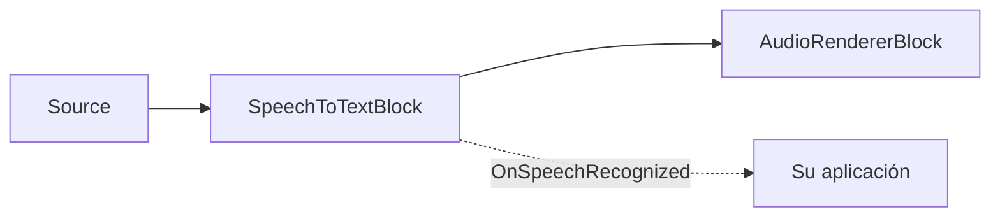

# Subtítulos en vivo y voz a texto en C# .NET

[Media Blocks SDK .Net](https://www.visioforge.com/media-blocks-sdk-net){ .md-button .md-button--primary target="_blank" }

## Resumen

`SpeechToTextBlock` añade **reconocimiento de voz local y sin conexión** a cualquier pipeline de Media Blocks. Ejecuta el modelo ASR
[Whisper](https://github.com/openai/whisper) (a través de [Whisper.net](https://github.com/sandrohanea/whisper.net),
el backend whisper.cpp / GGML) en la CPU o en una GPU NVIDIA (CUDA), con detección de actividad de voz
[Silero VAD](https://github.com/snakers4/silero-vad) opcional para dividir el habla en segmentos limpios.
No se envía nada a la nube.

El bloque se sitúa **en línea** en la ruta de audio — el audio pasa sin cambios — y emite un
evento `OnSpeechRecognized` con segmentos de texto con marcas de tiempo. Úselo para:

1. **Transcribir un archivo multimedia** a texto, SRT o VTT (sin pérdidas, al ritmo del transcriptor).
2. **Subtitular una fuente en vivo** (micrófono, tarjeta de captura, cámara RTSP) en tiempo real.



El bloque reside en el espacio de nombres `VisioForge.Core.MediaBlocks.AI` y se incluye en el complemento **VisioForge AI Whisper**
— paquete NuGet `VisioForge.DotNet.Core.AI.Whisper` (ensamblado `VisioForge.Core.AI.Whisper`),
construido sobre `Whisper.net`. Necesita el paquete de runtime habitual de la plataforma
(por ejemplo `VisioForge.CrossPlatform.Core.Windows.x64`) y funciona en Windows, Linux y macOS.

## Modelos

Los pesos GGML de Whisper y el modelo Silero VAD se **descargan en tiempo de ejecución** — ninguno se incluye dentro
de los paquetes NuGet. Descárguelos una vez y reutilice los archivos locales:

- **Modelo GGML de Whisper** (`ggml-*.bin`): descárguelo con `WhisperGgmlDownloader` de Whisper.net, o tome un
  `ggml-*.bin` del repositorio de modelos de whisper.cpp.
- **Modelo Silero VAD** (`silero_vad.onnx`, MIT): del repositorio
  [silero-vad](https://github.com/snakers4/silero-vad).

```csharp
using Whisper.net.Ggml;

// Descargar el modelo "base" de Whisper a una caché local la primera vez y luego reutilizarlo.
var modelsDir = Path.Combine(
    Environment.GetFolderPath(Environment.SpecialFolder.UserProfile), "VisioForge", "models");
Directory.CreateDirectory(modelsDir);

var whisperModelPath = Path.Combine(modelsDir, "ggml-base.bin");
if (!File.Exists(whisperModelPath))
{
    using var modelStream = await WhisperGgmlDownloader.Default.GetGgmlModelAsync(GgmlType.Base);
    using var fileStream = File.Create(whisperModelPath);
    await modelStream.CopyToAsync(fileStream);
}

// Modelo Silero VAD — descargue silero_vad.onnx en la misma caché (vea «Modelos» arriba).
var sileroModelPath = Path.Combine(modelsDir, "silero_vad.onnx");
```

Elija el tamaño del modelo según el equilibrio precisión/velocidad/RAM que necesite. `SpeechToTextSettings.ModelSize` es
informativo (permite a su aplicación etiquetar o elegir una descarga); el archivo que realmente se carga es siempre
`WhisperModelPath`.

| `WhisperModelSize` | Notas |
| --- | --- |
| `Tiny` / `TinyQuantized` | El más rápido, menor precisión. |
| `Base` | Buen valor predeterminado para CPU en tiempo real. |
| `Small` / `Medium` | Mayor precisión, más pesado. |
| `LargeV3` / `LargeV3Turbo` | Máxima precisión; se recomienda GPU. |

## Transcribir un archivo multimedia

Para la transcripción de archivos, habilite la **contrapresión** (backpressure) para no descartar nada: el bloque ajusta la fuente al
rendimiento exacto de la transcripción (sin pérdidas) y el pipeline corre tan rápido como Whisper pueda seguir. Combínelo con un
destino no sincronizado para que ningún reloj en tiempo real limite la velocidad.

```csharp
using VisioForge.Core;
using VisioForge.Core.MediaBlocks;
using VisioForge.Core.MediaBlocks.AI;
using VisioForge.Core.MediaBlocks.Sources;
using VisioForge.Core.MediaBlocks.Special; // NullRendererBlock
using VisioForge.Core.Types;
using VisioForge.Core.Types.Events;
using VisioForge.Core.Types.X.AI;
using VisioForge.Core.Types.X.Sources;

await VisioForgeX.InitSDKAsync();

var pipeline = new MediaBlocksPipeline();

var settings = new SpeechToTextSettings(whisperModelPath)
{
    Language = "auto",                          // código ISO 639-1 ("en", "es", "fr") o "auto"
    Provider = OnnxExecutionProvider.Auto,      // CUDA cuando esté disponible, si no CPU
    EnableVad = true,                           // segmentar el habla con Silero VAD
    BackpressureWhenBusy = true,                // sin pérdidas: ajustar la fuente a Whisper
    OutputSrtPath = "subtitles.srt",            // SRT lateral opcional (VTT con OutputVttPath)
};
settings.Vad.ModelPath = sileroModelPath;       // ruta a silero_vad.onnx

// Fuente solo de audio desde un archivo.
var source = new UniversalSourceBlock(
    await UniversalSourceSettings.CreateAsync("input.mp4", renderVideo: false, renderAudio: true));

var stt = new SpeechToTextBlock(settings);
stt.OnSpeechRecognized += (s, e) =>
{
    foreach (var seg in e.Segments)
    {
        if (!string.IsNullOrWhiteSpace(seg.Text))
        {
            Console.WriteLine($"[{seg.StartTime:hh\\:mm\\:ss}] {seg.Text.Trim()}");
        }
    }
};

// Destino nulo no sincronizado: sin reloj en tiempo real, la ejecución solo la limita la velocidad de transcripción.
var sink = new NullRendererBlock(MediaBlockPadMediaType.Audio) { IsSync = false };

pipeline.Connect(source.AudioOutput, stt.Input);
pipeline.Connect(stt.Output, sink.Input);

await pipeline.StartAsync();
```

Establecer `OutputSrtPath` (o `OutputVttPath`) hace que el bloque escriba un archivo de subtítulos directamente a medida que los segmentos finales
se reconocen — sin código adicional.

## Subtitular una fuente en vivo

Para un dispositivo de captura en vivo, mantenga `BackpressureWhenBusy = false` (el valor predeterminado). Un dispositivo en vivo no puede frenar,
por lo que el anillo de audio interno del bloque sobrescribe las muestras más antiguas en caso de sobrecarga en lugar de detener la fuente —
los subtítulos se mantienen cerca del tiempo real a costa de descartar audio cuando el transcriptor se queda atrás.

```csharp
using VisioForge.Core.MediaBlocks.AudioRendering;
using VisioForge.Core.MediaBlocks.Sources;

// Elegir el primer micrófono del sistema.
var audioDevices = await SystemAudioSourceBlock.GetDevicesAsync();
var mic = new SystemAudioSourceBlock(audioDevices[0].CreateSourceSettings());

var settings = new SpeechToTextSettings(whisperModelPath)
{
    Language = "en",
    Provider = OnnxExecutionProvider.Auto,
    EnableVad = true,
    BackpressureWhenBusy = false, // en vivo: nunca detener el dispositivo; descartar el audio más antiguo en sobrecarga
};
settings.Vad.ModelPath = sileroModelPath;

var stt = new SpeechToTextBlock(settings);
stt.OnSpeechRecognized += (s, e) =>
{
    // Se emite en un hilo de trabajo en segundo plano — sincronícelo con el hilo de la interfaz antes de tocar la UI.
    foreach (var seg in e.Segments)
    {
        Console.WriteLine(seg.Text);
    }
};

var audioRenderer = new AudioRendererBlock();

pipeline.Connect(mic.Output, stt.Input);          // el audio pasa por el bloque sin cambios
pipeline.Connect(stt.Output, audioRenderer.Input);

await pipeline.StartAsync();
```

!!! warning "Contrapresión y fuentes en vivo"
    Nunca establezca `BackpressureWhenBusy = true` en una fuente de captura en vivo — un micrófono o una cámara no pueden frenar
    para absorber la contrapresión. Use la contrapresión solo para fuentes de archivo/con búsqueda, y combínela con un destino no
    sincronizado (`NullRendererBlock { IsSync = false }`).

## Resultados del reconocimiento

`OnSpeechRecognized` se emite en un **hilo de trabajo en segundo plano** y lleva un `SpeechRecognizedEventArgs`:

- `Segments` — un `SpeechSegment[]` (un evento puede llevar varios segmentos).
- `Timestamp` — el tiempo multimedia al que pertenecen los segmentos.

Cada `SpeechSegment` tiene:

| Propiedad | Descripción |
| --- | --- |
| `Text` | El texto reconocido. |
| `StartTime` / `EndTime` | Intervalo en la línea de tiempo multimedia (listo para SRT/VTT o la programación de una superposición). |
| `Language` | Idioma detectado/usado (ISO 639-1), o `null`. |
| `Confidence` | Confianza media de los tokens (0..1), o 0 cuando el modelo no la reporta. |
| `IsFinal` | Siempre `true` hoy (reservado para futuras hipótesis interinas). |

## Ajustes clave

| Propiedad | Predeterminado | Descripción |
| --- | --- | --- |
| `WhisperModelPath` | — | Ruta absoluta al modelo GGML de Whisper (`ggml-*.bin`). Obligatorio. |
| `Language` | `"auto"` | Código ISO 639-1 o `"auto"` para detección. |
| `Task` | `Transcribe` | `Transcribe` (idioma de origen) o `Translate` (al inglés). |
| `Provider` | `Auto` | `CPU` o `CUDA` son significativos (GGML no tiene DirectML); `Auto` elige CUDA si está presente, si no CPU. |
| `DeviceId` | `0` | Id del dispositivo GPU cuando se usa un proveedor de GPU. |
| `Threads` | `0` | Hilos de CPU; `0` deja que Whisper.net elija. |
| `EnableVad` | `true` | Usar Silero VAD para segmentar el habla. Desactívelo para fragmentación de ventana fija. |
| `Vad` | (predeterminados) | `SileroVadSettings` — establezca `Vad.ModelPath` en `silero_vad.onnx`. |
| `FixedWindowSeconds` | `5` | Longitud de la ventana cuando `EnableVad = false` (limitada a 1–30 s). |
| `BackpressureWhenBusy` | `false` | `false` = en vivo (descartar lo más antiguo); `true` = archivo (sin pérdidas, al ritmo). |
| `OutputSrtPath` | `null` | Archivo `.srt` lateral opcional escrito a medida que los segmentos finalizan. |
| `OutputVttPath` | `null` | Archivo `.vtt` (WebVTT) lateral opcional. |

`SileroVadSettings` expone `SpeechThreshold` (0.5), `MinSilenceMs` (100), `MinSpeechMs` (250),
`SpeechPadMs` (30) y `MaxSpeechMs` (15000) para ajustar la segmentación, además de su propio `Provider`/`DeviceId`.

Llame al método estático `SpeechToTextBlock.IsAvailable()` para verificar que el redistribuible de AI Whisper esté presente antes de
construir un pipeline.

## Demos

- **Live Subtitles** (Consola) — `_DEMOS/Media Blocks SDK/Console/Live Subtitles` — transcripción de archivos con contrapresión e informe de progreso.
- **Live Subtitles Demo** (WPF) — `_DEMOS/Media Blocks SDK/WPF/CSharp/Live Subtitles Demo` — subtitulado en vivo de micrófono/cámara con una superposición en pantalla.
- **Live Subtitles MB** (MAUI) — `_DEMOS/Media Blocks SDK/MAUI/Live Subtitles MB`.

## Véase también

- [Bloques IA: OCR, reconocimiento de matrículas y analítica de objetos](../AI/index.md)
- [ElevenLabs: texto a voz y clonación de voz](../ElevenLabs/index.md)
