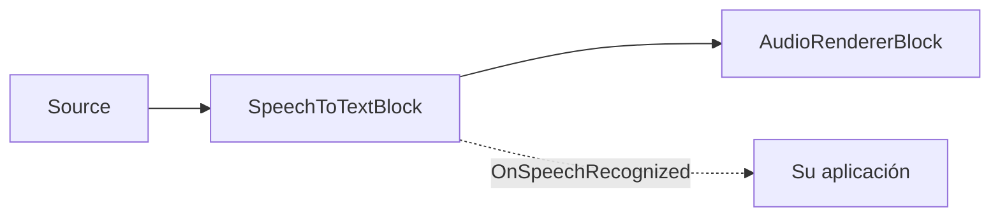
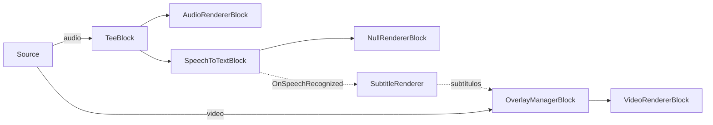

# Subtítulos en vivo y voz a texto en C# .NET

[Media Blocks SDK .Net](https://www.visioforge.com/media-blocks-sdk-net){ .md-button .md-button--primary target="_blank" }

## Resumen

`SpeechToTextBlock` añade **reconocimiento de voz local y sin conexión** a cualquier pipeline de Media Blocks. Ejecuta el modelo ASR
[Whisper](https://github.com/openai/whisper) (a través de [Whisper.net](https://github.com/sandrohanea/whisper.net),
el backend whisper.cpp / GGML) en la CPU o en una GPU NVIDIA (CUDA), con detección de actividad de voz
[Silero VAD](https://github.com/snakers4/silero-vad) opcional para dividir el habla en segmentos limpios.
No se envía nada a la nube.

El bloque se sitúa **en línea** en la ruta de audio — el audio pasa sin cambios — y emite un
evento `OnSpeechRecognized` con segmentos de texto con marcas de tiempo. Úselo para:

1. **Transcribir un archivo multimedia** a texto, SRT o VTT (sin pérdidas, al ritmo del transcriptor).
2. **Subtitular una fuente en vivo** (micrófono, tarjeta de captura, cámara RTSP) en tiempo real.


```mermaid
graph LR;
    Source-->SpeechToTextBlock;
    SpeechToTextBlock-->AudioRendererBlock;
    SpeechToTextBlock-. OnSpeechRecognized .->App[Su aplicación];
```

El bloque reside en el espacio de nombres `VisioForge.Core.MediaBlocks.AI` y se incluye en el complemento **VisioForge AI Whisper**
— paquete NuGet `VisioForge.DotNet.Core.AI.Whisper` (ensamblado `VisioForge.Core.AI.Whisper`),
construido sobre `Whisper.net`. Necesita el paquete de runtime habitual de la plataforma
(por ejemplo `VisioForge.CrossPlatform.Core.Windows.x64`) y funciona en Windows, Linux y macOS.

## Modelos

Los pesos GGML de Whisper y el modelo Silero VAD se **descargan en tiempo de ejecución** — ninguno se incluye dentro
de los paquetes NuGet. Descárguelos una vez y reutilice los archivos locales:

- **Modelo GGML de Whisper** (`ggml-*.bin`): descárguelo con `WhisperGgmlDownloader` de Whisper.net, o tome un
  `ggml-*.bin` del repositorio de modelos de whisper.cpp.
- **Modelo Silero VAD** (`silero_vad.onnx`, MIT): del repositorio
  [silero-vad](https://github.com/snakers4/silero-vad).

```csharp
using Whisper.net.Ggml;

// Descargar el modelo "base" de Whisper a una caché local la primera vez y luego reutilizarlo.
var modelsDir = Path.Combine(
    Environment.GetFolderPath(Environment.SpecialFolder.UserProfile), "VisioForge", "models");
Directory.CreateDirectory(modelsDir);

var whisperModelPath = Path.Combine(modelsDir, "ggml-base.bin");
if (!File.Exists(whisperModelPath))
{
    using var modelStream = await WhisperGgmlDownloader.Default.GetGgmlModelAsync(GgmlType.Base);
    using var fileStream = File.Create(whisperModelPath);
    await modelStream.CopyToAsync(fileStream);
}

// Modelo Silero VAD — descargue silero_vad.onnx en la misma caché (vea «Modelos» arriba).
var sileroModelPath = Path.Combine(modelsDir, "silero_vad.onnx");
```

Elija el tamaño del modelo según el equilibrio precisión/velocidad/RAM que necesite. `SpeechToTextSettings.ModelSize` es
informativo (permite a su aplicación etiquetar o elegir una descarga); el archivo que realmente se carga es siempre
`WhisperModelPath`.

| `WhisperModelSize` | Notas |
| --- | --- |
| `Tiny` / `TinyQuantized` | El más rápido, menor precisión. |
| `Base` | Buen valor predeterminado para CPU en tiempo real. |
| `Small` / `Medium` | Mayor precisión, más pesado. |
| `LargeV3` / `LargeV3Turbo` | Máxima precisión; se recomienda GPU. |

## Dos formas de ejecutarlo

El destino con el que termina la rama de audio decide el ritmo de todo el pipeline. Elija la receta que
corresponda al trabajo; ambas usan el mismo `SpeechToTextBlock`:

| Receta | Cómo se conecta | Úsela para |
| --- | --- | --- |
| **Velocidad máxima** | La rama de audio termina en un `NullRendererBlock` con `IsSync = false`, así que ningún reloj limita la ejecución. | Transcripción sin conexión, generación de SRT/VTT, procesos por lotes: terminar un archivo tan rápido como Whisper pueda. |
| **Reproducción en tiempo real** | Un `AudioRendererBlock` audible marca el ritmo del pipeline a 1x y el transcriptor corre en su propia rama desacoplada. | Ver un archivo o una fuente en vivo con los subtítulos apareciendo junto a las palabras. |

Las secciones siguientes cubren primero la receta de velocidad máxima y luego la de tiempo real.

## Transcribir un archivo multimedia

La transcripción es sin pérdidas: el bloque ajusta la fuente al rendimiento exacto de la transcripción, por lo que no se descarta nada
y el pipeline corre tan rápido como Whisper pueda seguir. Combínelo con un destino no sincronizado para que ningún reloj en tiempo
real limite la velocidad.

```csharp
using VisioForge.Core;
using VisioForge.Core.MediaBlocks;
using VisioForge.Core.MediaBlocks.AI;
using VisioForge.Core.MediaBlocks.Sources;
using VisioForge.Core.MediaBlocks.Special; // NullRendererBlock
using VisioForge.Core.Types;
using VisioForge.Core.Types.Events;
using VisioForge.Core.Types.X.AI;
using VisioForge.Core.Types.X.Sources;

await VisioForgeX.InitSDKAsync();

var pipeline = new MediaBlocksPipeline();

var settings = new SpeechToTextSettings(whisperModelPath)
{
    Language = "auto",                          // código ISO 639-1 ("en", "es", "fr") o "auto"
    Provider = OnnxExecutionProvider.Auto,      // CUDA cuando esté disponible, si no CPU
    EnableVad = true,                           // segmentar el habla con Silero VAD
    OutputSrtPath = "subtitles.srt",            // SRT lateral opcional (VTT con OutputVttPath)
};
settings.Vad.ModelPath = sileroModelPath;       // ruta a silero_vad.onnx

// Fuente solo de audio desde un archivo.
var source = new UniversalSourceBlock(
    await UniversalSourceSettings.CreateAsync("input.mp4", renderVideo: false, renderAudio: true));

var stt = new SpeechToTextBlock(settings);
stt.OnSpeechRecognized += (s, e) =>
{
    foreach (var seg in e.Segments)
    {
        if (!string.IsNullOrWhiteSpace(seg.Text))
        {
            Console.WriteLine($"[{seg.StartTime:hh\\:mm\\:ss}] {seg.Text.Trim()}");
        }
    }
};

// Destino nulo no sincronizado: sin reloj en tiempo real, la ejecución solo la limita la velocidad de transcripción.
var sink = new NullRendererBlock(MediaBlockPadMediaType.Audio) { IsSync = false };

pipeline.Connect(source.AudioOutput, stt.Input);
pipeline.Connect(stt.Output, sink.Input);

await pipeline.StartAsync();
```

Establecer `OutputSrtPath` (o `OutputVttPath`) hace que el bloque escriba un archivo de subtítulos directamente a medida que los segmentos finales
se reconocen — sin código adicional.

## Subtitular una fuente en vivo

El mismo bloque subtitula un dispositivo de captura en vivo — conecte una fuente de micrófono en lugar de un archivo. El bloque
transcribe en línea y nunca descarta audio: ajusta la fuente al ritmo de Whisper. Whisper Base se ejecuta muy por encima del tiempo
real, por lo que un micrófono típico no se ve limitado; si el modelo es más lento que el tiempo real, la fuente se frena hasta la
velocidad de transcripción en lugar de perder muestras.

```csharp
using VisioForge.Core.MediaBlocks.AudioRendering;
using VisioForge.Core.MediaBlocks.Sources;

// Elegir el primer micrófono del sistema.
var audioDevices = await SystemAudioSourceBlock.GetDevicesAsync();
var mic = new SystemAudioSourceBlock(audioDevices[0].CreateSourceSettings());

var settings = new SpeechToTextSettings(whisperModelPath)
{
    Language = "en",
    Provider = OnnxExecutionProvider.Auto,
    EnableVad = true,
};
settings.Vad.ModelPath = sileroModelPath;

var stt = new SpeechToTextBlock(settings);
stt.OnSpeechRecognized += (s, e) =>
{
    // Se emite en el hilo de streaming de GStreamer — sincronícelo con el hilo de la interfaz antes de tocar la UI.
    foreach (var seg in e.Segments)
    {
        Console.WriteLine(seg.Text);
    }
};

var audioRenderer = new AudioRendererBlock();

pipeline.Connect(mic.Output, stt.Input);          // el audio pasa por el bloque sin cambios
pipeline.Connect(stt.Output, audioRenderer.Input);

await pipeline.StartAsync();
```

Aquí el transcriptor está en línea, por lo que marca el ritmo de la fuente: la salida audible se mantiene
fluida solo mientras el modelo aguante. Colóquelo en su propia rama de un tee cuando el audio deba oírse
haga lo que haga el modelo — vea «Reproducción en tiempo real con subtítulos en vivo» más abajo.

## Renderizar subtítulos en vivo sobre el video

`SpeechToTextBlock` es solo de audio, por lo que no dibuja subtítulos por sí mismo. Para subtítulos
en pantalla, agregue un `OverlayManagerBlock` a la rama de video y conecte
`SpeechToTextBlock.OnSpeechRecognized` a `SubtitleRenderer.OnSpeechRecognized`.

```csharp
using SkiaSharp;
using VisioForge.Core.AI.Whisper.Subtitles;
using VisioForge.Core.MediaBlocks.VideoProcessing;
using VisioForge.Core.MediaBlocks.VideoRendering;

var overlay = new OverlayManagerBlock();
var videoRenderer = new VideoRendererBlock(pipeline, videoView) { IsSync = false }; // receta de velocidad máxima

var subtitleRenderer = new SubtitleRenderer(
    overlay,
    new SubtitleStyle
    {
        X = 40,
        Y = 380,
        FontName = "Arial",
        FontSize = 30,
        Color = SKColors.White,
        MinDisplay = TimeSpan.FromSeconds(1.5),
        MaxDisplay = TimeSpan.FromSeconds(6),
    });

stt.OnSpeechRecognized += subtitleRenderer.OnSpeechRecognized;

pipeline.Connect(source.VideoOutput, overlay.Input);
pipeline.Connect(overlay.Output, videoRenderer.Input);
```

`SubtitleRenderer` controla un único overlay de texto y sincroniza los subtítulos con el reloj del video:
almacena los segmentos reconocidos en un `CaptionTimeline` y el overlay elige el subtítulo de cada
fotograma a partir de la marca de tiempo de ese mismo fotograma. Así el subtítulo aparece cuando la imagen
llega a las palabras — tanto si el reconocimiento va por delante de la reproducción como si va por detrás —
y no interviene ningún temporizador. `OnSpeechRecognized` se emite en el hilo de streaming de GStreamer y
el renderer solo almacena ahí, por lo que el overlay no necesita marshal al hilo UI (una lista de
transcripción en su propia interfaz sí lo necesita). Deseche el renderer al detener el pipeline para quitar
el overlay.

Cada segmento se convierte en su propio subtítulo, mostrado desde su `StartTime` durante la duración del
segmento limitada a `MinDisplay..MaxDisplay`. Un subtítulo que llega cuando la reproducción ya pasó su
ventana no se descarta: comienza en la posición actual y se encola detrás de cualquier otro subtítulo
atrasado, que es lo que mantiene los subtítulos en pantalla en la receta de velocidad máxima.

El `IsSync = false` del renderer de video de arriba pertenece a esa receta: la imagen corre tan rápido como
el transcriptor. Para reproducción en tiempo real ponga `IsSync = true`, como en la sección siguiente.

| Propiedad de `SubtitleStyle` | Predeterminado | Descripción |
| --- | --- | --- |
| `FontName` / `FontSize` | `Arial` / `32` | Fuente del texto. |
| `Color` | `White` | Color del texto. |
| `X` / `Y` | `50` / `50` | Posición del overlay en píxeles. |
| `MinDisplay` / `MaxDisplay` | `1.5 s` / `6 s` | Tiempo mínimo y máximo en pantalla para cada subtítulo. |

## Reproducción en tiempo real con subtítulos en vivo

La reproducción y la transcripción quieren ramas separadas, así que divida el audio con un `TeeBlock`: una
rama se reproduce por un `AudioRendererBlock` audible — eso es lo que mantiene el pipeline a 1x — y la otra
alimenta a Whisper a través de un búfer lo bastante profundo para absorber una ráfaga de inferencia. Ambas
ramas quedan sujetas al reloj; la nota tras el código explica por qué la del transcriptor también.


```mermaid
graph LR;
    Source-- audio -->TeeBlock;
    TeeBlock-->AudioRendererBlock;
    TeeBlock-->SpeechToTextBlock;
    SpeechToTextBlock-->NullRendererBlock;
    Source-- video -->OverlayManagerBlock;
    OverlayManagerBlock-->VideoRendererBlock;
    SpeechToTextBlock-. OnSpeechRecognized .->SubtitleRenderer;
    SubtitleRenderer-. subtítulos .->OverlayManagerBlock;
```

```csharp
using VisioForge.Core.AI.Whisper.Subtitles;
using VisioForge.Core.MediaBlocks.AudioRendering;
using VisioForge.Core.MediaBlocks.Special;      // TeeBlock, NullRendererBlock
using VisioForge.Core.MediaBlocks.VideoProcessing;
using VisioForge.Core.MediaBlocks.VideoRendering;
using VisioForge.Core.Types.X.Special;          // TeeQueueSettings

// Un buffer de 10 segundos en la rama del transcriptor absorbe una ráfaga de inferencia de Whisper para que
// no frene al renderer. NO lo pongas a descartar: los tiempos de los segmentos vienen de un contador de
// muestras, no de las marcas de tiempo de los búferes, así que un búfer descartado adelanta todos los
// subtítulos y líneas SRT posteriores, durante el resto del archivo.
var queueSettings = new TeeQueueSettings
{
    MaxSizeBuffers = 0,
    MaxSizeBytes = 0,
    MaxSizeTime = (ulong)TimeSpan.FromSeconds(10).TotalMilliseconds * 1000000,   // 10 s, en nanosegundos
    Leaky = TeeQueueLeaky.No,
};

var audioTee = new TeeBlock(2, MediaBlockPadMediaType.Audio, queueSettings);
var audioRenderer = new AudioRendererBlock();                                        // audible: marca el ritmo a 1x
var sttSink = new NullRendererBlock(MediaBlockPadMediaType.Audio);   // sujeto al reloj: vea la nota de abajo

var overlay = new OverlayManagerBlock();
var videoRenderer = new VideoRendererBlock(pipeline, videoView) { IsSync = true };    // imagen sujeta al reloj

var subtitleRenderer = new SubtitleRenderer(overlay, new SubtitleStyle { X = 40, Y = 380 });
stt.OnSpeechRecognized += subtitleRenderer.OnSpeechRecognized;

pipeline.Connect(source.AudioOutput, audioTee.Input);
pipeline.Connect(audioTee.Outputs[0], audioRenderer.Input);   // altavoces
pipeline.Connect(audioTee.Outputs[1], stt.Input);             // transcriptor
pipeline.Connect(stt.Output, sttSink.Input);

pipeline.Connect(source.VideoOutput, overlay.Input);
pipeline.Connect(overlay.Output, videoRenderer.Input);

await pipeline.StartAsync();
```

`TeeBlock.Outputs[i]` son los pads src de las propias colas por salida del tee, así que cada rama ya está
desacoplada: no hay que añadir ningún bloque de cola aparte. Tenga en cuenta que **en este modo todos los
sumideros están sujetos al reloj, incluido el del transcriptor**: una consulta de posición del pipeline la
responde el sumidero más avanzado, así que dejar ese libre informaría del frente del transcriptor en lugar de
la posición de reproducción - segundos por delante del audio, que es justo lo que hace que los subtítulos
aparezcan antes de tiempo.
 Diez segundos de buffer absorben las ráfagas
que produce un transcriptor que trabaja por segmentos; una máquina que no alcanza el tiempo real durante un
tramo largo llena esa cola y la reproducción se entrecorta. Ese es el fallo honesto aquí, y la razón para no
recurrir a `TeeQueueLeaky.Downstream`: descartar búferes mantendría la imagen fluida mientras desplaza en
silencio todos los subtítulos posteriores fuera de sincronía.

### Con MediaPlayerCoreX y VideoCaptureCoreX

En los motores X el bloque entra en la propia cadena de audio del motor mediante
`Audio_Processing_AddBlock`, por lo que queda **en serie** entre el decodificador y la salida de audio: una
salida real de altavoz sufriría cortes con una inferencia larga. Termine la cadena con un renderer nulo y
deje que `IsSync` elija el modo:

```csharp
// Renderer nulo sincronizado: ritmo 1x, en silencio. Con IsSync = false transcribe a velocidad máxima.
player.Audio_OutputBlock = new NullRendererBlock(MediaBlockPadMediaType.Audio) { IsSync = true };
player.Audio_Processing_AddBlock(stt);
```

En esa ruta no hay bloque de overlay, así que alimente una etiqueta de subtítulos de la interfaz con un
`CaptionTimeline` propio y pregúntele qué corresponde a la posición actual de reproducción:

```csharp
var captions = new CaptionTimeline();
stt.OnSpeechRecognized += (s, e) => captions.Add(e);   // seguro desde el hilo de streaming

// Un temporizador de UI de 200 ms basta; el timeline decide qué subtítulo corresponde a esa posición.
timer.Tick += async (s, e) => subtitleLabel.Text = captions.TextAt(await player.Position_GetAsync());
```

Llame a `CaptionTimeline.Clear()` antes de empezar un archivo nuevo y después de un salto: las posiciones se
leen como puntos en la línea de tiempo del flujo actual. `SubtitleRenderer` expone el mismo `Clear()`.

## Resultados del reconocimiento

`OnSpeechRecognized` se emite en el **hilo de streaming de GStreamer** y lleva un `SpeechRecognizedEventArgs`:

- `Segments` — un `SpeechSegment[]` (un evento puede llevar varios segmentos).
- `Timestamp` — el tiempo multimedia al que pertenecen los segmentos.

Cada `SpeechSegment` tiene:

| Propiedad | Descripción |
| --- | --- |
| `Text` | El texto reconocido. |
| `StartTime` / `EndTime` | Intervalo en la línea de tiempo multimedia (listo para SRT/VTT o la programación de una superposición). |
| `Language` | Idioma detectado/usado (ISO 639-1), o `null`. |
| `Confidence` | Confianza media de los tokens (0..1), o 0 cuando el modelo no la reporta. |
| `IsFinal` | Siempre `true` hoy (reservado para futuras hipótesis interinas). |

## Ajustes clave

| Propiedad | Predeterminado | Descripción |
| --- | --- | --- |
| `WhisperModelPath` | — | Ruta absoluta al modelo GGML de Whisper (`ggml-*.bin`). Obligatorio. |
| `Language` | `"auto"` | Código ISO 639-1 o `"auto"` para detección. |
| `Task` | `Transcribe` | `Transcribe` (idioma de origen) o `Translate` (al inglés). |
| `Provider` | `Auto` | `CPU` o `CUDA` son significativos (GGML no tiene DirectML); `Auto` elige CUDA si está presente, si no CPU. |
| `DeviceId` | `0` | Id del dispositivo GPU cuando se usa un proveedor de GPU. |
| `Threads` | `0` | Hilos de CPU; `0` deja que Whisper.net elija. |
| `EnableVad` | `true` | Usar Silero VAD para segmentar el habla. Desactívelo para fragmentación de ventana fija. |
| `Vad` | (predeterminados) | `SileroVadSettings` — establezca `Vad.ModelPath` en `silero_vad.onnx`. |
| `FixedWindowSeconds` | `5` | Longitud de la ventana cuando `EnableVad = false` (limitada a 1–30 s). |
| `OutputSrtPath` | `null` | Archivo `.srt` lateral opcional escrito a medida que los segmentos finalizan. |
| `OutputVttPath` | `null` | Archivo `.vtt` (WebVTT) lateral opcional. |

`SileroVadSettings` expone `SpeechThreshold` (0.5), `MinSilenceMs` (100), `MinSpeechMs` (250),
`SpeechPadMs` (30) y `MaxSpeechMs` (15000) para ajustar la segmentación, además de su propio `Provider`/`DeviceId`.

Llame al método estático `SpeechToTextBlock.IsAvailable()` para verificar que el redistribuible de AI Whisper esté presente antes de
construir un pipeline.

## Archivos de subtítulos

La forma más sencilla de crear subtítulos laterales es establecer `OutputSrtPath` u `OutputVttPath`
en `SpeechToTextSettings`. El bloque crea un `SubtitleWriter` internamente y escribe los segmentos
finales a medida que se reconocen.

Use `SubtitleWriter` directamente cuando quiera enrutar el texto reconocido por su cuenta:

```csharp
using VisioForge.Core.AI.Whisper.Subtitles;

// Mantenga la instancia de SubtitleWriter activa durante toda la ejecución del pipeline; libérela al detener el pipeline.
var writer = new SubtitleWriter("captions.vtt", SubtitleFormat.Vtt);

stt.OnSpeechRecognized += (sender, e) =>
{
    foreach (var segment in e.Segments)
    {
        writer.Add(segment);
    }
};
```

`SubtitleFormat.Srt` escribe cues SubRip numerados con timestamps `HH:MM:SS,mmm`.
`SubtitleFormat.Vtt` escribe una cabecera `WEBVTT` y timestamps `HH:MM:SS.mmm`.
`SubtitleWriter.Add()` ignora segmentos vacíos y no finales. `FormatSrtTimestamp()` y
`FormatVttTimestamp()` son helpers públicos para writers personalizados.

## Demos

- **Live Subtitles** (Consola) — [Live Subtitles](https://github.com/visioforge/.Net-SDK-s-samples/tree/master/Media%20Blocks%20SDK/Console/Live%20Subtitles) — transcripción de archivos sin pérdidas e informe de progreso.
- **Live Subtitles Demo** (WPF) — [Live Subtitles Demo](https://github.com/visioforge/.Net-SDK-s-samples/tree/master/Media%20Blocks%20SDK/WPF/CSharp/Live%20Subtitles%20Demo) — subtitulado en vivo de micrófono/cámara con una superposición en pantalla.
- **Live Subtitles MB** (MAUI) — [Live Subtitles MB](https://github.com/visioforge/.Net-SDK-s-samples/tree/master/Media%20Blocks%20SDK/MAUI/Live%20Subtitles%20MB).

Cada demo incluye un interruptor **Real-time playback** que alterna entre las dos recetas anteriores.

## Véase también

- [IA en VisioForge .NET SDK](../../general/ai/index.md)
- [ElevenLabs: texto a voz y clonación de voz](../ElevenLabs/index.md)
