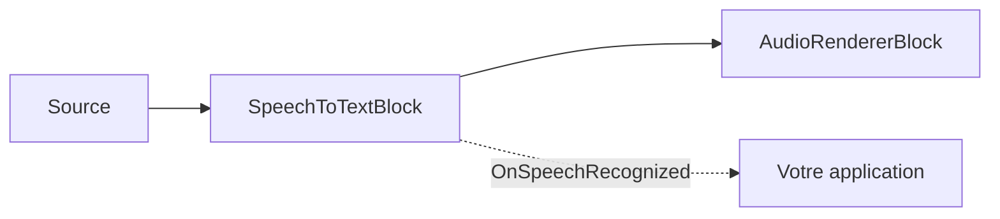

# Sous-titres en direct et reconnaissance vocale en C# .NET

[Media Blocks SDK .Net](https://www.visioforge.com/media-blocks-sdk-net){ .md-button .md-button--primary target="_blank" }

## Vue d'ensemble

`SpeechToTextBlock` ajoute une **reconnaissance vocale locale et hors ligne** à tout pipeline Media Blocks. Il exécute le modèle ASR
[Whisper](https://github.com/openai/whisper) (via [Whisper.net](https://github.com/sandrohanea/whisper.net),
le backend whisper.cpp / GGML) sur le CPU ou un GPU NVIDIA (CUDA), avec une détection d'activité vocale
[Silero VAD](https://github.com/snakers4/silero-vad) optionnelle pour découper la parole en segments propres.
Rien n'est envoyé vers le cloud.

Le bloc se place **en ligne** dans le chemin audio — l'audio passe sans modification — et émet un
événement `OnSpeechRecognized` avec des segments de texte horodatés. Utilisez-le pour :

1. **Transcrire un fichier multimédia** en texte, SRT ou VTT (sans perte, au rythme du transcripteur).
2. **Sous-titrer une source en direct** (microphone, carte d'acquisition, caméra RTSP) en temps réel.



Le bloc se trouve dans l'espace de noms `VisioForge.Core.MediaBlocks.AI` et est fourni dans le module complémentaire **VisioForge AI Whisper**
— paquet NuGet `VisioForge.DotNet.Core.AI.Whisper` (assembly `VisioForge.Core.AI.Whisper`),
construit sur `Whisper.net`. Il nécessite le paquet de runtime habituel de la plateforme
(par exemple `VisioForge.CrossPlatform.Core.Windows.x64`) et fonctionne sous Windows, Linux et macOS.

## Modèles

Les poids GGML de Whisper et le modèle Silero VAD sont **téléchargés à l'exécution** — aucun n'est inclus dans
les paquets NuGet. Téléchargez-les une fois et réutilisez les fichiers locaux :

- **Modèle GGML de Whisper** (`ggml-*.bin`) : téléchargez-le avec `WhisperGgmlDownloader` de Whisper.net, ou récupérez un
  `ggml-*.bin` depuis le dépôt de modèles de whisper.cpp.
- **Modèle Silero VAD** (`silero_vad.onnx`, MIT) : depuis le dépôt
  [silero-vad](https://github.com/snakers4/silero-vad).

```csharp
using Whisper.net.Ggml;

// Télécharger le modèle « base » de Whisper dans un cache local la première fois, puis le réutiliser.
var modelsDir = Path.Combine(
    Environment.GetFolderPath(Environment.SpecialFolder.UserProfile), "VisioForge", "models");
Directory.CreateDirectory(modelsDir);

var whisperModelPath = Path.Combine(modelsDir, "ggml-base.bin");
if (!File.Exists(whisperModelPath))
{
    using var modelStream = await WhisperGgmlDownloader.Default.GetGgmlModelAsync(GgmlType.Base);
    using var fileStream = File.Create(whisperModelPath);
    await modelStream.CopyToAsync(fileStream);
}

// Modèle Silero VAD — téléchargez silero_vad.onnx dans le même cache (voir « Modèles » ci-dessus).
var sileroModelPath = Path.Combine(modelsDir, "silero_vad.onnx");
```

Choisissez la taille du modèle selon le compromis précision/vitesse/RAM dont vous avez besoin. `SpeechToTextSettings.ModelSize` est
informatif (il permet à votre application d'étiqueter ou de choisir un téléchargement) ; le fichier réellement chargé est toujours
`WhisperModelPath`.

| `WhisperModelSize` | Remarques |
| --- | --- |
| `Tiny` / `TinyQuantized` | Le plus rapide, précision la plus faible. |
| `Base` | Bon réglage par défaut pour le CPU en temps réel. |
| `Small` / `Medium` | Meilleure précision, plus lourd. |
| `LargeV3` / `LargeV3Turbo` | Précision maximale ; GPU recommandé. |

## Transcrire un fichier multimédia

Pour la transcription de fichiers, activez la **contre-pression** (backpressure) afin de ne rien perdre : le bloc cale la source sur le
débit exact de la transcription (sans perte) et le pipeline s'exécute aussi vite que Whisper peut suivre. Associez-le à un
puits non synchronisé pour qu'aucune horloge temps réel ne limite la vitesse.

```csharp
using VisioForge.Core;
using VisioForge.Core.MediaBlocks;
using VisioForge.Core.MediaBlocks.AI;
using VisioForge.Core.MediaBlocks.Sources;
using VisioForge.Core.MediaBlocks.Special; // NullRendererBlock
using VisioForge.Core.Types;
using VisioForge.Core.Types.Events;
using VisioForge.Core.Types.X.AI;
using VisioForge.Core.Types.X.Sources;

await VisioForgeX.InitSDKAsync();

var pipeline = new MediaBlocksPipeline();

var settings = new SpeechToTextSettings(whisperModelPath)
{
    Language = "auto",                          // code ISO 639-1 (« en », « es », « fr ») ou « auto »
    Provider = OnnxExecutionProvider.Auto,      // CUDA si disponible, sinon CPU
    EnableVad = true,                           // segmenter la parole avec Silero VAD
    BackpressureWhenBusy = true,                // sans perte : caler la source sur Whisper
    OutputSrtPath = "subtitles.srt",            // SRT annexe optionnel (VTT via OutputVttPath)
};
settings.Vad.ModelPath = sileroModelPath;       // chemin vers silero_vad.onnx

// Source audio seule à partir d'un fichier.
var source = new UniversalSourceBlock(
    await UniversalSourceSettings.CreateAsync("input.mp4", renderVideo: false, renderAudio: true));

var stt = new SpeechToTextBlock(settings);
stt.OnSpeechRecognized += (s, e) =>
{
    foreach (var seg in e.Segments)
    {
        if (!string.IsNullOrWhiteSpace(seg.Text))
        {
            Console.WriteLine($"[{seg.StartTime:hh\\:mm\\:ss}] {seg.Text.Trim()}");
        }
    }
};

// Puits nul non synchronisé : sans horloge temps réel, l'exécution n'est limitée que par la vitesse de transcription.
var sink = new NullRendererBlock(MediaBlockPadMediaType.Audio) { IsSync = false };

pipeline.Connect(source.AudioOutput, stt.Input);
pipeline.Connect(stt.Output, sink.Input);

await pipeline.StartAsync();
```

Définir `OutputSrtPath` (ou `OutputVttPath`) fait écrire au bloc un fichier de sous-titres directement à mesure que les segments finaux
sont reconnus — sans code supplémentaire.

## Sous-titrer une source en direct

Pour un périphérique d'acquisition en direct, conservez `BackpressureWhenBusy = false` (la valeur par défaut). Un périphérique en direct ne peut pas ralentir,
de sorte que l'anneau audio interne du bloc écrase les échantillons les plus anciens en cas de surcharge au lieu de bloquer la source —
les sous-titres restent proches du temps réel au prix de la perte d'audio lorsque le transcripteur prend du retard.

```csharp
using VisioForge.Core.MediaBlocks.AudioRendering;
using VisioForge.Core.MediaBlocks.Sources;

// Choisir le premier microphone du système.
var audioDevices = await SystemAudioSourceBlock.GetDevicesAsync();
var mic = new SystemAudioSourceBlock(audioDevices[0].CreateSourceSettings());

var settings = new SpeechToTextSettings(whisperModelPath)
{
    Language = "en",
    Provider = OnnxExecutionProvider.Auto,
    EnableVad = true,
    BackpressureWhenBusy = false, // en direct : ne jamais bloquer le périphérique ; abandonner l'audio le plus ancien en surcharge
};
settings.Vad.ModelPath = sileroModelPath;

var stt = new SpeechToTextBlock(settings);
stt.OnSpeechRecognized += (s, e) =>
{
    // Émis sur un thread de travail en arrière-plan — repassez sur le thread UI avant de toucher à l'interface.
    foreach (var seg in e.Segments)
    {
        Console.WriteLine(seg.Text);
    }
};

var audioRenderer = new AudioRendererBlock();

pipeline.Connect(mic.Output, stt.Input);          // l'audio traverse le bloc sans modification
pipeline.Connect(stt.Output, audioRenderer.Input);

await pipeline.StartAsync();
```

!!! warning "Contre-pression et sources en direct"
    Ne définissez jamais `BackpressureWhenBusy = true` sur une source d'acquisition en direct — un microphone ou une caméra ne peuvent pas ralentir
    pour absorber la contre-pression. Utilisez la contre-pression uniquement pour des sources fichier/avec recherche, et associez-la à un puits non
    synchronisé (`NullRendererBlock { IsSync = false }`).

## Résultats de la reconnaissance

`OnSpeechRecognized` est émis sur un **thread de travail en arrière-plan** et porte un `SpeechRecognizedEventArgs` :

- `Segments` — un `SpeechSegment[]` (un événement peut porter plusieurs segments).
- `Timestamp` — le temps multimédia auquel appartiennent les segments.

Chaque `SpeechSegment` possède :

| Propriété | Description |
| --- | --- |
| `Text` | Le texte reconnu. |
| `StartTime` / `EndTime` | Intervalle sur la timeline multimédia (prêt pour SRT/VTT ou la planification d'une superposition). |
| `Language` | Langue détectée/utilisée (ISO 639-1), ou `null`. |
| `Confidence` | Confiance moyenne des tokens (0..1), ou 0 lorsque le modèle ne la fournit pas. |
| `IsFinal` | Toujours `true` aujourd'hui (réservé aux futures hypothèses intermédiaires). |

## Réglages clés

| Propriété | Par défaut | Description |
| --- | --- | --- |
| `WhisperModelPath` | — | Chemin absolu vers le modèle GGML de Whisper (`ggml-*.bin`). Obligatoire. |
| `Language` | `"auto"` | Code ISO 639-1 ou `"auto"` pour la détection. |
| `Task` | `Transcribe` | `Transcribe` (langue source) ou `Translate` (vers l'anglais). |
| `Provider` | `Auto` | `CPU` ou `CUDA` sont pertinents (GGML n'a pas de DirectML) ; `Auto` choisit CUDA si présent, sinon CPU. |
| `DeviceId` | `0` | Id du périphérique GPU lorsqu'un fournisseur GPU est utilisé. |
| `Threads` | `0` | Threads CPU ; `0` laisse Whisper.net choisir. |
| `EnableVad` | `true` | Utiliser Silero VAD pour segmenter la parole. Désactivez-le pour un découpage à fenêtre fixe. |
| `Vad` | (par défaut) | `SileroVadSettings` — définissez `Vad.ModelPath` sur `silero_vad.onnx`. |
| `FixedWindowSeconds` | `5` | Longueur de la fenêtre quand `EnableVad = false` (bornée à 1–30 s). |
| `BackpressureWhenBusy` | `false` | `false` = direct (abandonner le plus ancien) ; `true` = fichier (sans perte, au rythme). |
| `OutputSrtPath` | `null` | Fichier `.srt` annexe optionnel écrit à mesure que les segments se finalisent. |
| `OutputVttPath` | `null` | Fichier `.vtt` (WebVTT) annexe optionnel. |

`SileroVadSettings` expose `SpeechThreshold` (0.5), `MinSilenceMs` (100), `MinSpeechMs` (250),
`SpeechPadMs` (30) et `MaxSpeechMs` (15000) pour régler la segmentation, ainsi que ses propres `Provider`/`DeviceId`.

Appelez la méthode statique `SpeechToTextBlock.IsAvailable()` pour vérifier que le redistribuable AI Whisper est présent avant de
construire un pipeline.

## Démos

- **Live Subtitles** (Console) — `_DEMOS/Media Blocks SDK/Console/Live Subtitles` — transcription de fichier avec contre-pression et rapport de progression.
- **Live Subtitles Demo** (WPF) — `_DEMOS/Media Blocks SDK/WPF/CSharp/Live Subtitles Demo` — sous-titrage en direct micro/caméra avec une superposition à l'écran.
- **Live Subtitles MB** (MAUI) — `_DEMOS/Media Blocks SDK/MAUI/Live Subtitles MB`.

## Voir aussi

- [Blocs IA : OCR, reconnaissance de plaques et analytique d'objets](../AI/index.md)
- [ElevenLabs : synthèse vocale et clonage de voix](../ElevenLabs/index.md)
