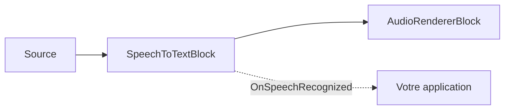
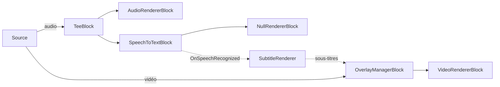

# Sous-titres en direct et reconnaissance vocale en C# .NET

[Media Blocks SDK .Net](https://www.visioforge.com/media-blocks-sdk-net){ .md-button .md-button--primary target="_blank" }

## Vue d'ensemble

`SpeechToTextBlock` ajoute une **reconnaissance vocale locale et hors ligne** à tout pipeline Media Blocks. Il exécute le modèle ASR
[Whisper](https://github.com/openai/whisper) (via [Whisper.net](https://github.com/sandrohanea/whisper.net),
le backend whisper.cpp / GGML) sur le CPU ou un GPU NVIDIA (CUDA), avec une détection d'activité vocale
[Silero VAD](https://github.com/snakers4/silero-vad) optionnelle pour découper la parole en segments propres.
Rien n'est envoyé vers le cloud.

Le bloc se place **en ligne** dans le chemin audio — l'audio passe sans modification — et émet un
événement `OnSpeechRecognized` avec des segments de texte horodatés. Utilisez-le pour :

1. **Transcrire un fichier multimédia** en texte, SRT ou VTT (sans perte, au rythme du transcripteur).
2. **Sous-titrer une source en direct** (microphone, carte d'acquisition, caméra RTSP) en temps réel.


```mermaid
graph LR;
    Source-->SpeechToTextBlock;
    SpeechToTextBlock-->AudioRendererBlock;
    SpeechToTextBlock-. OnSpeechRecognized .->App[Votre application];
```

Le bloc se trouve dans l'espace de noms `VisioForge.Core.MediaBlocks.AI` et est fourni dans le module complémentaire **VisioForge AI Whisper**
— paquet NuGet `VisioForge.DotNet.Core.AI.Whisper` (assembly `VisioForge.Core.AI.Whisper`),
construit sur `Whisper.net`. Il nécessite le paquet de runtime habituel de la plateforme
(par exemple `VisioForge.CrossPlatform.Core.Windows.x64`) et fonctionne sous Windows, Linux et macOS.

## Modèles

Les poids GGML de Whisper et le modèle Silero VAD sont **téléchargés à l'exécution** — aucun n'est inclus dans
les paquets NuGet. Téléchargez-les une fois et réutilisez les fichiers locaux :

- **Modèle GGML de Whisper** (`ggml-*.bin`) : téléchargez-le avec `WhisperGgmlDownloader` de Whisper.net, ou récupérez un
  `ggml-*.bin` depuis le dépôt de modèles de whisper.cpp.
- **Modèle Silero VAD** (`silero_vad.onnx`, MIT) : depuis le dépôt
  [silero-vad](https://github.com/snakers4/silero-vad).

```csharp
using Whisper.net.Ggml;

// Télécharger le modèle « base » de Whisper dans un cache local la première fois, puis le réutiliser.
var modelsDir = Path.Combine(
    Environment.GetFolderPath(Environment.SpecialFolder.UserProfile), "VisioForge", "models");
Directory.CreateDirectory(modelsDir);

var whisperModelPath = Path.Combine(modelsDir, "ggml-base.bin");
if (!File.Exists(whisperModelPath))
{
    using var modelStream = await WhisperGgmlDownloader.Default.GetGgmlModelAsync(GgmlType.Base);
    using var fileStream = File.Create(whisperModelPath);
    await modelStream.CopyToAsync(fileStream);
}

// Modèle Silero VAD — téléchargez silero_vad.onnx dans le même cache (voir « Modèles » ci-dessus).
var sileroModelPath = Path.Combine(modelsDir, "silero_vad.onnx");
```

Choisissez la taille du modèle selon le compromis précision/vitesse/RAM dont vous avez besoin. `SpeechToTextSettings.ModelSize` est
informatif (il permet à votre application d'étiqueter ou de choisir un téléchargement) ; le fichier réellement chargé est toujours
`WhisperModelPath`.

| `WhisperModelSize` | Remarques |
| --- | --- |
| `Tiny` / `TinyQuantized` | Le plus rapide, précision la plus faible. |
| `Base` | Bon réglage par défaut pour le CPU en temps réel. |
| `Small` / `Medium` | Meilleure précision, plus lourd. |
| `LargeV3` / `LargeV3Turbo` | Précision maximale ; GPU recommandé. |

## Deux façons de l'exécuter

Le puits qui termine la branche audio décide du rythme de tout le pipeline. Choisissez la recette adaptée
au travail : les deux utilisent le même `SpeechToTextBlock`.

| Recette | Câblage | À utiliser pour |
| --- | --- | --- |
| **Vitesse maximale** | La branche audio se termine par un `NullRendererBlock` avec `IsSync = false` : aucune horloge ne plafonne l'exécution. | Transcription hors ligne, génération de SRT/VTT, traitements par lots : terminer un fichier aussi vite que Whisper le permet. |
| **Lecture en temps réel** | Un `AudioRendererBlock` audible cadence le pipeline à 1x et le transcripteur tourne sur sa propre branche découplée. | Regarder un fichier ou une source en direct avec les sous-titres qui arrivent sur les mots. |

Les sections ci-dessous traitent d'abord la recette vitesse maximale, puis celle en temps réel.

## Transcrire un fichier multimédia

La transcription est sans perte : le bloc cale la source sur le débit exact de la transcription, de sorte que rien n'est perdu et que
le pipeline s'exécute aussi vite que Whisper peut suivre. Associez-le à un puits non synchronisé pour qu'aucune horloge temps réel
ne limite la vitesse.

```csharp
using VisioForge.Core;
using VisioForge.Core.MediaBlocks;
using VisioForge.Core.MediaBlocks.AI;
using VisioForge.Core.MediaBlocks.Sources;
using VisioForge.Core.MediaBlocks.Special; // NullRendererBlock
using VisioForge.Core.Types;
using VisioForge.Core.Types.Events;
using VisioForge.Core.Types.X.AI;
using VisioForge.Core.Types.X.Sources;

await VisioForgeX.InitSDKAsync();

var pipeline = new MediaBlocksPipeline();

var settings = new SpeechToTextSettings(whisperModelPath)
{
    Language = "auto",                          // code ISO 639-1 (« en », « es », « fr ») ou « auto »
    Provider = OnnxExecutionProvider.Auto,      // CUDA si disponible, sinon CPU
    EnableVad = true,                           // segmenter la parole avec Silero VAD
    OutputSrtPath = "subtitles.srt",            // SRT annexe optionnel (VTT via OutputVttPath)
};
settings.Vad.ModelPath = sileroModelPath;       // chemin vers silero_vad.onnx

// Source audio seule à partir d'un fichier.
var source = new UniversalSourceBlock(
    await UniversalSourceSettings.CreateAsync("input.mp4", renderVideo: false, renderAudio: true));

var stt = new SpeechToTextBlock(settings);
stt.OnSpeechRecognized += (s, e) =>
{
    foreach (var seg in e.Segments)
    {
        if (!string.IsNullOrWhiteSpace(seg.Text))
        {
            Console.WriteLine($"[{seg.StartTime:hh\\:mm\\:ss}] {seg.Text.Trim()}");
        }
    }
};

// Puits nul non synchronisé : sans horloge temps réel, l'exécution n'est limitée que par la vitesse de transcription.
var sink = new NullRendererBlock(MediaBlockPadMediaType.Audio) { IsSync = false };

pipeline.Connect(source.AudioOutput, stt.Input);
pipeline.Connect(stt.Output, sink.Input);

await pipeline.StartAsync();
```

Définir `OutputSrtPath` (ou `OutputVttPath`) fait écrire au bloc un fichier de sous-titres directement à mesure que les segments finaux
sont reconnus — sans code supplémentaire.

## Sous-titrer une source en direct

Le même bloc sous-titre un périphérique d'acquisition en direct — connectez une source microphone au lieu d'un fichier. Le bloc
transcrit en ligne et ne perd jamais d'audio : il cale la source sur Whisper. Whisper Base s'exécute bien au-dessus du temps réel,
de sorte qu'un microphone classique n'est pas ralenti ; si le modèle est plus lent que le temps réel, la source est retenue à la
vitesse de transcription plutôt que de perdre des échantillons.

```csharp
using VisioForge.Core.MediaBlocks.AudioRendering;
using VisioForge.Core.MediaBlocks.Sources;

// Choisir le premier microphone du système.
var audioDevices = await SystemAudioSourceBlock.GetDevicesAsync();
var mic = new SystemAudioSourceBlock(audioDevices[0].CreateSourceSettings());

var settings = new SpeechToTextSettings(whisperModelPath)
{
    Language = "en",
    Provider = OnnxExecutionProvider.Auto,
    EnableVad = true,
};
settings.Vad.ModelPath = sileroModelPath;

var stt = new SpeechToTextBlock(settings);
stt.OnSpeechRecognized += (s, e) =>
{
    // Émis sur le thread de streaming GStreamer — repassez sur le thread UI avant de toucher à l'interface.
    foreach (var seg in e.Segments)
    {
        Console.WriteLine(seg.Text);
    }
};

var audioRenderer = new AudioRendererBlock();

pipeline.Connect(mic.Output, stt.Input);          // l'audio traverse le bloc sans modification
pipeline.Connect(stt.Output, audioRenderer.Input);

await pipeline.StartAsync();
```

Ici le transcripteur est en ligne : c'est lui qui cadence la source, et la sortie audible ne reste fluide
que tant que le modèle suit. Placez-le plutôt sur sa propre branche de tee lorsque l'audio doit s'entendre
quoi que fasse le modèle — voir « Lecture en temps réel avec sous-titres en direct » ci-dessous.

## Rendre des sous-titres live sur la vidéo

`SpeechToTextBlock` est audio-only ; il ne dessine donc pas les sous-titres lui-même. Pour afficher
des sous-titres à l'écran, ajoutez un `OverlayManagerBlock` sur la branche vidéo et connectez
`SpeechToTextBlock.OnSpeechRecognized` à `SubtitleRenderer.OnSpeechRecognized`.

```csharp
using SkiaSharp;
using VisioForge.Core.AI.Whisper.Subtitles;
using VisioForge.Core.MediaBlocks.VideoProcessing;
using VisioForge.Core.MediaBlocks.VideoRendering;

var overlay = new OverlayManagerBlock();
var videoRenderer = new VideoRendererBlock(pipeline, videoView) { IsSync = false }; // recette vitesse maximale

var subtitleRenderer = new SubtitleRenderer(
    overlay,
    new SubtitleStyle
    {
        X = 40,
        Y = 380,
        FontName = "Arial",
        FontSize = 30,
        Color = SKColors.White,
        MinDisplay = TimeSpan.FromSeconds(1.5),
        MaxDisplay = TimeSpan.FromSeconds(6),
    });

stt.OnSpeechRecognized += subtitleRenderer.OnSpeechRecognized;

pipeline.Connect(source.VideoOutput, overlay.Input);
pipeline.Connect(overlay.Output, videoRenderer.Input);
```

`SubtitleRenderer` pilote un seul overlay texte et cale les sous-titres sur l'horloge vidéo : il met les
segments reconnus en mémoire dans un `CaptionTimeline`, et l'overlay choisit le sous-titre de chaque image
à partir de l'horodatage de cette image. Un sous-titre apparaît donc quand l'image atteint les mots — que
la reconnaissance soit en avance ou en retard sur la lecture — et aucun timer n'intervient.
`OnSpeechRecognized` est émis sur le thread de streaming GStreamer et le renderer se contente d'y
mémoriser : l'overlay n'a donc besoin d'aucun marshal vers le thread UI (une liste de transcription dans
votre propre interface, si). Disposez le renderer à l'arrêt du pipeline afin de supprimer l'overlay.

Chaque segment devient son propre sous-titre, affiché à partir de son `StartTime` pendant la durée du
segment bornée par `MinDisplay..MaxDisplay`. Un sous-titre qui arrive alors que la lecture a déjà dépassé
sa fenêtre n'est pas abandonné : il démarre à la position courante et se met à la file derrière les autres
sous-titres en retard, ce qui est précisément ce qui garde des sous-titres à l'écran dans la recette
vitesse maximale.

Le `IsSync = false` du renderer vidéo ci-dessus appartient à cette recette : l'image défile aussi vite que
le transcripteur. Pour la lecture en temps réel, mettez `IsSync = true`, comme dans la section suivante.

| Propriété `SubtitleStyle` | Par défaut | Description |
| --- | --- | --- |
| `FontName` / `FontSize` | `Arial` / `32` | Police du texte. |
| `Color` | `White` | Couleur du texte. |
| `X` / `Y` | `50` / `50` | Position de l'overlay en pixels. |
| `MinDisplay` / `MaxDisplay` | `1.5 s` / `6 s` | Temps d'affichage minimum et maximum de chaque sous-titre. |

## Lecture en temps réel avec sous-titres en direct

La lecture et la transcription veulent des branches séparées : séparez l'audio avec un `TeeBlock` — une
branche passe par un `AudioRendererBlock` audible, c'est elle qui tient le pipeline à 1x, l'autre alimente
Whisper à travers un tampon assez profond pour absorber une salve d'inférence. Les deux branches restent
cadencées sur l'horloge ; la note après le code explique pourquoi celle du transcripteur aussi.


```mermaid
graph LR;
    Source-- audio -->TeeBlock;
    TeeBlock-->AudioRendererBlock;
    TeeBlock-->SpeechToTextBlock;
    SpeechToTextBlock-->NullRendererBlock;
    Source-- vidéo -->OverlayManagerBlock;
    OverlayManagerBlock-->VideoRendererBlock;
    SpeechToTextBlock-. OnSpeechRecognized .->SubtitleRenderer;
    SubtitleRenderer-. sous-titres .->OverlayManagerBlock;
```

```csharp
using VisioForge.Core.AI.Whisper.Subtitles;
using VisioForge.Core.MediaBlocks.AudioRendering;
using VisioForge.Core.MediaBlocks.Special;      // TeeBlock, NullRendererBlock
using VisioForge.Core.MediaBlocks.VideoProcessing;
using VisioForge.Core.MediaBlocks.VideoRendering;
using VisioForge.Core.Types.X.Special;          // TeeQueueSettings

// Un tampon de 10 secondes sur la branche du transcripteur absorbe une salve d'inférence Whisper pour
// qu'elle ne bloque pas le renderer. Ne la rendez PAS « leaky » : les horodatages des segments viennent d'un
// compteur d'échantillons, pas des marqueurs temporels des tampons, donc un tampon perdu avance tous les
// sous-titres et toutes les lignes SRT suivants, jusqu'à la fin du fichier.
var queueSettings = new TeeQueueSettings
{
    MaxSizeBuffers = 0,
    MaxSizeBytes = 0,
    MaxSizeTime = (ulong)TimeSpan.FromSeconds(10).TotalMilliseconds * 1000000,   // 10 s, en nanosecondes
    Leaky = TeeQueueLeaky.No,
};

var audioTee = new TeeBlock(2, MediaBlockPadMediaType.Audio, queueSettings);
var audioRenderer = new AudioRendererBlock();                                        // audible : cadence à 1x
var sttSink = new NullRendererBlock(MediaBlockPadMediaType.Audio);   // sur l'horloge : voir la note ci-dessous

var overlay = new OverlayManagerBlock();
var videoRenderer = new VideoRendererBlock(pipeline, videoView) { IsSync = true };    // image sur l'horloge

var subtitleRenderer = new SubtitleRenderer(overlay, new SubtitleStyle { X = 40, Y = 380 });
stt.OnSpeechRecognized += subtitleRenderer.OnSpeechRecognized;

pipeline.Connect(source.AudioOutput, audioTee.Input);
pipeline.Connect(audioTee.Outputs[0], audioRenderer.Input);   // haut-parleurs
pipeline.Connect(audioTee.Outputs[1], stt.Input);             // transcripteur
pipeline.Connect(stt.Output, sttSink.Input);

pipeline.Connect(source.VideoOutput, overlay.Input);
pipeline.Connect(overlay.Output, videoRenderer.Input);

await pipeline.StartAsync();
```

`TeeBlock.Outputs[i]` sont les pads src des files d'attente propres à chaque sortie du tee : chaque branche
est donc déjà découplée, aucun bloc de file supplémentaire à ajouter. Notez que **dans ce mode tous les puits
sont cadencés sur l'horloge, y compris celui du transcripteur** : une requête de position du pipeline est
satisfaite par le puits le plus avancé, donc en laisser un libre remonterait le front du transcripteur au lieu
de la position de lecture - plusieurs secondes devant l'audio, ce qui fait précisément apparaître les
sous-titres trop tôt.
 Dix secondes de tampon absorbent les
salves que produit un transcripteur travaillant par segments ; une machine incapable de tenir le temps réel
sur une durée plus longue remplit cette file et la lecture saccade. C'est l'échec honnête ici, et la raison
de ne pas recourir à `TeeQueueLeaky.Downstream` : abandonner des tampons garderait l'image fluide tout en
décalant silencieusement tous les sous-titres suivants.

### Avec MediaPlayerCoreX et VideoCaptureCoreX

Dans les moteurs X, le bloc rejoint la chaîne audio du moteur via `Audio_Processing_AddBlock` : il se
retrouve **en série** entre le décodeur et la sortie audio, et une vraie sortie haut-parleur se mettrait en
sous-alimentation sur une inférence longue. Terminez plutôt la chaîne par un renderer nul et laissez
`IsSync` choisir le mode :

```csharp
// Renderer nul synchronisé : cadence 1x, silencieux. Avec IsSync = false, transcription à vitesse maximale.
player.Audio_OutputBlock = new NullRendererBlock(MediaBlockPadMediaType.Audio) { IsSync = true };
player.Audio_Processing_AddBlock(stt);
```

Ce chemin n'a pas de bloc d'overlay : alimentez un libellé de sous-titres de votre interface avec votre
propre `CaptionTimeline` et demandez-lui ce qui est dû à la position de lecture courante.

```csharp
var captions = new CaptionTimeline();
stt.OnSpeechRecognized += (s, e) => captions.Add(e);   // sûr depuis le thread de streaming

// Un timer UI de 200 ms suffit ; la timeline décide du sous-titre qui correspond à cette position.
timer.Tick += async (s, e) => subtitleLabel.Text = captions.TextAt(await player.Position_GetAsync());
```

Appelez `CaptionTimeline.Clear()` avant de démarrer un nouveau fichier et après un saut : les positions sont
lues comme des points sur la chronologie du flux courant. `SubtitleRenderer` expose le même `Clear()`.

## Résultats de la reconnaissance

`OnSpeechRecognized` est émis sur le **thread de streaming GStreamer** et porte un `SpeechRecognizedEventArgs` :

- `Segments` — un `SpeechSegment[]` (un événement peut porter plusieurs segments).
- `Timestamp` — le temps multimédia auquel appartiennent les segments.

Chaque `SpeechSegment` possède :

| Propriété | Description |
| --- | --- |
| `Text` | Le texte reconnu. |
| `StartTime` / `EndTime` | Intervalle sur la timeline multimédia (prêt pour SRT/VTT ou la planification d'une superposition). |
| `Language` | Langue détectée/utilisée (ISO 639-1), ou `null`. |
| `Confidence` | Confiance moyenne des tokens (0..1), ou 0 lorsque le modèle ne la fournit pas. |
| `IsFinal` | Toujours `true` aujourd'hui (réservé aux futures hypothèses intermédiaires). |

## Réglages clés

| Propriété | Par défaut | Description |
| --- | --- | --- |
| `WhisperModelPath` | — | Chemin absolu vers le modèle GGML de Whisper (`ggml-*.bin`). Obligatoire. |
| `Language` | `"auto"` | Code ISO 639-1 ou `"auto"` pour la détection. |
| `Task` | `Transcribe` | `Transcribe` (langue source) ou `Translate` (vers l'anglais). |
| `Provider` | `Auto` | `CPU` ou `CUDA` sont pertinents (GGML n'a pas de DirectML) ; `Auto` choisit CUDA si présent, sinon CPU. |
| `DeviceId` | `0` | Id du périphérique GPU lorsqu'un fournisseur GPU est utilisé. |
| `Threads` | `0` | Threads CPU ; `0` laisse Whisper.net choisir. |
| `EnableVad` | `true` | Utiliser Silero VAD pour segmenter la parole. Désactivez-le pour un découpage à fenêtre fixe. |
| `Vad` | (par défaut) | `SileroVadSettings` — définissez `Vad.ModelPath` sur `silero_vad.onnx`. |
| `FixedWindowSeconds` | `5` | Longueur de la fenêtre quand `EnableVad = false` (bornée à 1–30 s). |
| `OutputSrtPath` | `null` | Fichier `.srt` annexe optionnel écrit à mesure que les segments se finalisent. |
| `OutputVttPath` | `null` | Fichier `.vtt` (WebVTT) annexe optionnel. |

`SileroVadSettings` expose `SpeechThreshold` (0.5), `MinSilenceMs` (100), `MinSpeechMs` (250),
`SpeechPadMs` (30) et `MaxSpeechMs` (15000) pour régler la segmentation, ainsi que ses propres `Provider`/`DeviceId`.

Appelez la méthode statique `SpeechToTextBlock.IsAvailable()` pour vérifier que le redistribuable AI Whisper est présent avant de
construire un pipeline.

## Fichiers de sous-titres

Le moyen le plus simple de créer des sous-titres annexes est de définir `OutputSrtPath` ou
`OutputVttPath` dans `SpeechToTextSettings`. Le bloc crée un `SubtitleWriter` en interne et écrit les
segments finaux à mesure qu'ils sont reconnus.

Utilisez `SubtitleWriter` directement lorsque vous voulez router vous-même le texte reconnu :

```csharp
using VisioForge.Core.AI.Whisper.Subtitles;

// Gardez l'instance de SubtitleWriter en vie pendant toute l'exécution du pipeline ; libérez-la à l'arrêt du pipeline.
var writer = new SubtitleWriter("captions.vtt", SubtitleFormat.Vtt);

stt.OnSpeechRecognized += (sender, e) =>
{
    foreach (var segment in e.Segments)
    {
        writer.Add(segment);
    }
};
```

`SubtitleFormat.Srt` écrit des cues SubRip numérotés avec des timestamps `HH:MM:SS,mmm`.
`SubtitleFormat.Vtt` écrit un en-tête `WEBVTT` et des timestamps `HH:MM:SS.mmm`.
`SubtitleWriter.Add()` ignore les segments vides et non finaux. `FormatSrtTimestamp()` et
`FormatVttTimestamp()` sont des helpers publics pour les writers personnalisés.

## Démos

- **Live Subtitles** (Console) — [Live Subtitles](https://github.com/visioforge/.Net-SDK-s-samples/tree/master/Media%20Blocks%20SDK/Console/Live%20Subtitles) — transcription de fichier sans perte avec rapport de progression.
- **Live Subtitles Demo** (WPF) — [Live Subtitles Demo](https://github.com/visioforge/.Net-SDK-s-samples/tree/master/Media%20Blocks%20SDK/WPF/CSharp/Live%20Subtitles%20Demo) — sous-titrage en direct micro/caméra avec une superposition à l'écran.
- **Live Subtitles MB** (MAUI) — [Live Subtitles MB](https://github.com/visioforge/.Net-SDK-s-samples/tree/master/Media%20Blocks%20SDK/MAUI/Live%20Subtitles%20MB).

Chaque démo comporte un interrupteur **Real-time playback** qui bascule entre les deux recettes ci-dessus.

## Voir aussi

- [IA dans VisioForge .NET SDK](../../general/ai/index.md)
- [ElevenLabs : synthèse vocale et clonage de voix](../ElevenLabs/index.md)
