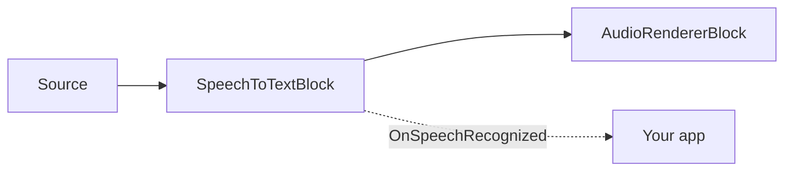

# Live Subtitles and Speech-to-Text in C# .NET

[Media Blocks SDK .Net](https://www.visioforge.com/media-blocks-sdk-net){ .md-button .md-button--primary target="_blank" }

## Overview

`SpeechToTextBlock` adds **local, offline speech recognition** to any Media Blocks pipeline. It runs the
[Whisper](https://github.com/openai/whisper) ASR model (through [Whisper.net](https://github.com/sandrohanea/whisper.net),
the whisper.cpp / GGML backend) on the CPU or an NVIDIA GPU (CUDA), with optional
[Silero VAD](https://github.com/snakers4/silero-vad) voice-activity detection to split speech into clean
segments. Nothing is sent to the cloud.

The block sits **inline** in the audio path — audio passes through unchanged — and raises an
`OnSpeechRecognized` event with timed text segments. Use it to:

1. **Transcribe a media file** to text, SRT, or VTT (lossless, paced to the transcriber).
2. **Caption a live source** (microphone, capture card, RTSP camera) in real time.



The block lives in the `VisioForge.Core.MediaBlocks.AI` namespace and ships in the **VisioForge AI Whisper**
add-on — NuGet package `VisioForge.DotNet.Core.AI.Whisper` (assembly `VisioForge.Core.AI.Whisper`),
built on `Whisper.net`. It needs the usual platform runtime package (for example
`VisioForge.CrossPlatform.Core.Windows.x64`) and works on Windows, Linux, and macOS.

## Models

The Whisper GGML weights and the Silero VAD model are **downloaded at runtime** — neither is shipped inside
the NuGet packages. Cache them once and reuse the local files:

- **Whisper GGML model** (`ggml-*.bin`): download with Whisper.net's `WhisperGgmlDownloader`, or fetch a
  `ggml-*.bin` from the whisper.cpp model repository.
- **Silero VAD model** (`silero_vad.onnx`, MIT): from the
  [silero-vad](https://github.com/snakers4/silero-vad) repository.

```csharp
using Whisper.net.Ggml;

// Download the "base" Whisper model to a local cache the first time, then reuse it.
var modelsDir = Path.Combine(
    Environment.GetFolderPath(Environment.SpecialFolder.UserProfile), "VisioForge", "models");
Directory.CreateDirectory(modelsDir);

var whisperModelPath = Path.Combine(modelsDir, "ggml-base.bin");
if (!File.Exists(whisperModelPath))
{
    using var modelStream = await WhisperGgmlDownloader.Default.GetGgmlModelAsync(GgmlType.Base);
    using var fileStream = File.Create(whisperModelPath);
    await modelStream.CopyToAsync(fileStream);
}

// Silero VAD model — download silero_vad.onnx into the same cache (see "Models" above).
var sileroModelPath = Path.Combine(modelsDir, "silero_vad.onnx");
```

Pick the model size by the accuracy/speed/RAM trade-off you need. `SpeechToTextSettings.ModelSize` is
informational (it lets your app label or choose a download); the file actually loaded is always
`WhisperModelPath`.

| `WhisperModelSize` | Notes |
| --- | --- |
| `Tiny` / `TinyQuantized` | Fastest, lowest accuracy. |
| `Base` | Good real-time CPU default. |
| `Small` / `Medium` | Higher accuracy, heavier. |
| `LargeV3` / `LargeV3Turbo` | Highest accuracy; GPU recommended. |

## Transcribe a media file

Transcription is lossless: the block paces the source to exactly the transcription throughput, so nothing is
dropped and the pipeline runs as fast as Whisper can keep up. Pair it with a non-synced sink so no real-time
clock caps the speed.

```csharp
using VisioForge.Core;
using VisioForge.Core.MediaBlocks;
using VisioForge.Core.MediaBlocks.AI;
using VisioForge.Core.MediaBlocks.Sources;
using VisioForge.Core.MediaBlocks.Special; // NullRendererBlock
using VisioForge.Core.Types;
using VisioForge.Core.Types.Events;
using VisioForge.Core.Types.X.AI;
using VisioForge.Core.Types.X.Sources;

await VisioForgeX.InitSDKAsync();

var pipeline = new MediaBlocksPipeline();

var settings = new SpeechToTextSettings(whisperModelPath)
{
    Language = "auto",                          // ISO 639-1 code ("en", "es", "fr") or "auto"
    Provider = OnnxExecutionProvider.Auto,      // CUDA when available, else CPU
    EnableVad = true,                           // segment speech with Silero VAD
    OutputSrtPath = "subtitles.srt",            // optional side-car SRT (VTT via OutputVttPath)
};
settings.Vad.ModelPath = sileroModelPath;       // path to silero_vad.onnx

// Audio-only source from a file.
var source = new UniversalSourceBlock(
    await UniversalSourceSettings.CreateAsync("input.mp4", renderVideo: false, renderAudio: true));

var stt = new SpeechToTextBlock(settings);
stt.OnSpeechRecognized += (s, e) =>
{
    foreach (var seg in e.Segments)
    {
        if (!string.IsNullOrWhiteSpace(seg.Text))
        {
            Console.WriteLine($"[{seg.StartTime:hh\\:mm\\:ss}] {seg.Text.Trim()}");
        }
    }
};

// Non-synced null sink: no real-time clock, so the run is bounded only by transcription speed.
var sink = new NullRendererBlock(MediaBlockPadMediaType.Audio) { IsSync = false };

pipeline.Connect(source.AudioOutput, stt.Input);
pipeline.Connect(stt.Output, sink.Input);

await pipeline.StartAsync();
```

Setting `OutputSrtPath` (or `OutputVttPath`) makes the block write a subtitle file directly as final segments
are recognized — no extra code needed.

## Caption a live source

The same block captions a live capture device — connect a microphone source instead of a file. The block
transcribes inline and never drops audio: it paces the source to Whisper. Whisper Base runs well above real
time, so a typical microphone is not throttled; if the model is slower than real time the source is held back
to transcription speed rather than losing samples.

```csharp
using VisioForge.Core.MediaBlocks.AudioRendering;
using VisioForge.Core.MediaBlocks.Sources;

// Pick the first system microphone.
var audioDevices = await SystemAudioSourceBlock.GetDevicesAsync();
var mic = new SystemAudioSourceBlock(audioDevices[0].CreateSourceSettings());

var settings = new SpeechToTextSettings(whisperModelPath)
{
    Language = "en",
    Provider = OnnxExecutionProvider.Auto,
    EnableVad = true,
};
settings.Vad.ModelPath = sileroModelPath;

var stt = new SpeechToTextBlock(settings);
stt.OnSpeechRecognized += (s, e) =>
{
    // Raised on the GStreamer streaming thread — marshal to the UI thread before touching UI.
    foreach (var seg in e.Segments)
    {
        Console.WriteLine(seg.Text);
    }
};

var audioRenderer = new AudioRendererBlock();

pipeline.Connect(mic.Output, stt.Input);          // audio passes through the block unchanged
pipeline.Connect(stt.Output, audioRenderer.Input);

await pipeline.StartAsync();
```

## Render live subtitles on video

`SpeechToTextBlock` is audio-only, so it does not draw captions itself. For on-screen subtitles, add
an `OverlayManagerBlock` to the video branch and connect `SpeechToTextBlock.OnSpeechRecognized` to
`SubtitleRenderer.OnSpeechRecognized`.

```csharp
using SkiaSharp;
using VisioForge.Core.AI.Whisper.Subtitles;
using VisioForge.Core.MediaBlocks.VideoProcessing;
using VisioForge.Core.MediaBlocks.VideoRendering;

var overlay = new OverlayManagerBlock();
var videoRenderer = new VideoRendererBlock(pipeline, videoView) { IsSync = false };

var subtitleRenderer = new SubtitleRenderer(
    overlay,
    new SubtitleStyle
    {
        X = 40,
        Y = 380,
        FontName = "Arial",
        FontSize = 30,
        Color = SKColors.White,
        MinDisplay = TimeSpan.FromSeconds(1.5),
        MaxDisplay = TimeSpan.FromSeconds(6),
    });

stt.OnSpeechRecognized += subtitleRenderer.OnSpeechRecognized;

pipeline.Connect(source.VideoOutput, overlay.Input);
pipeline.Connect(overlay.Output, videoRenderer.Input);
```

`SubtitleRenderer` drives a single text overlay, shows the latest recognized caption, and hides it
automatically after the segment duration clamped to `MinDisplay..MaxDisplay`. `OnSpeechRecognized`
is raised on the GStreamer streaming thread; marshal to the UI thread before touching UI-only objects
if your platform requires it. Dispose the renderer when stopping the pipeline so the overlay and timer
are removed.

| `SubtitleStyle` property | Default | Description |
| --- | --- | --- |
| `FontName` / `FontSize` | `Arial` / `32` | Text font. |
| `Color` | `White` | Text color. |
| `X` / `Y` | `50` / `50` | Overlay position in pixels. |
| `MinDisplay` / `MaxDisplay` | `1.5 s` / `6 s` | Minimum and maximum on-screen time for each caption. |

## Recognition results

`OnSpeechRecognized` is raised on the **GStreamer streaming thread** and carries a `SpeechRecognizedEventArgs`:

- `Segments` — a `SpeechSegment[]` (one event may carry several segments).
- `Timestamp` — the media time the segments belong to.

Each `SpeechSegment` has:

| Property | Description |
| --- | --- |
| `Text` | The recognized text. |
| `StartTime` / `EndTime` | Span on the media timeline (ready for SRT/VTT or an overlay schedule). |
| `Language` | Detected/used language (ISO 639-1), or `null`. |
| `Confidence` | Average token confidence (0..1), or 0 when the model does not report it. |
| `IsFinal` | Always `true` today (reserved for future interim hypotheses). |

## Key settings

| Property | Default | Description |
| --- | --- | --- |
| `WhisperModelPath` | — | Absolute path to the Whisper GGML model (`ggml-*.bin`). Required. |
| `Language` | `"auto"` | ISO 639-1 code or `"auto"` for detection. |
| `Task` | `Transcribe` | `Transcribe` (source language) or `Translate` (to English). |
| `Provider` | `Auto` | `CPU` or `CUDA` are meaningful (GGML has no DirectML); `Auto` picks CUDA when present, else CPU. |
| `DeviceId` | `0` | GPU device id when a GPU provider is used. |
| `Threads` | `0` | CPU threads; `0` lets Whisper.net choose. |
| `EnableVad` | `true` | Use Silero VAD to segment speech. Disable for fixed-window chunking. |
| `Vad` | (defaults) | `SileroVadSettings` — set `Vad.ModelPath` to `silero_vad.onnx`. |
| `FixedWindowSeconds` | `5` | Window length when `EnableVad = false` (clamped to 1–30 s). |
| `OutputSrtPath` | `null` | Optional side-car `.srt` written as segments finalize. |
| `OutputVttPath` | `null` | Optional side-car `.vtt` (WebVTT). |

`SileroVadSettings` exposes `SpeechThreshold` (0.5), `MinSilenceMs` (100), `MinSpeechMs` (250),
`SpeechPadMs` (30), and `MaxSpeechMs` (15000) to tune segmentation, plus its own `Provider`/`DeviceId`.

Call the static `SpeechToTextBlock.IsAvailable()` to verify the AI Whisper redistributable is present before
building a pipeline.

## Subtitle files

The easiest way to create side-car subtitles is to set `OutputSrtPath` or `OutputVttPath` in
`SpeechToTextSettings`. The block creates a `SubtitleWriter` internally and writes final segments as
they are recognized.

Use `SubtitleWriter` directly when you want to route recognized text yourself:

```csharp
using VisioForge.Core.AI.Whisper.Subtitles;

// Keep the writer alive for the whole pipeline run; dispose it when you stop the pipeline.
var writer = new SubtitleWriter("captions.vtt", SubtitleFormat.Vtt);

stt.OnSpeechRecognized += (sender, e) =>
{
    foreach (var segment in e.Segments)
    {
        writer.Add(segment);
    }
};
```

`SubtitleFormat.Srt` writes numbered SubRip cues with `HH:MM:SS,mmm` timestamps. `SubtitleFormat.Vtt`
writes a `WEBVTT` header and `HH:MM:SS.mmm` timestamps. `SubtitleWriter.Add()` ignores empty and
non-final segments. `FormatSrtTimestamp()` and `FormatVttTimestamp()` are public helpers for custom
writers.

## Demos

- **Live Subtitles** (Console) — [Live Subtitles](https://github.com/visioforge/.Net-SDK-s-samples/tree/master/Media%20Blocks%20SDK/Console/Live%20Subtitles) — lossless file transcription with progress reporting.
- **Live Subtitles Demo** (WPF) — [Live Subtitles Demo](https://github.com/visioforge/.Net-SDK-s-samples/tree/master/Media%20Blocks%20SDK/WPF/CSharp/Live%20Subtitles%20Demo) — live microphone/camera captioning with an on-screen overlay.
- **Live Subtitles MB** (MAUI) — [Live Subtitles MB](https://github.com/visioforge/.Net-SDK-s-samples/tree/master/Media%20Blocks%20SDK/MAUI/Live%20Subtitles%20MB).

## See also

- [AI in VisioForge .NET SDK](../../general/ai/index.md)
- [ElevenLabs Text-to-Speech and Voice Cloning](../ElevenLabs/index.md)
