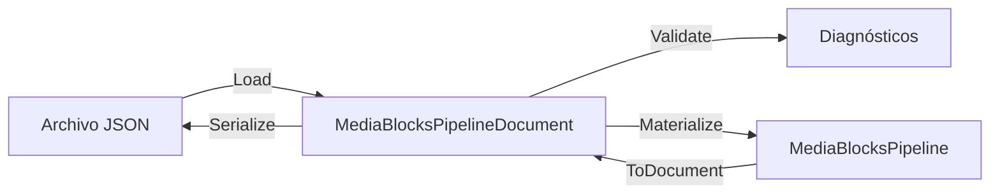

# Guardar y restaurar un pipeline Media Blocks en JSON con C#

[Media Blocks SDK .Net](https://www.visioforge.com/media-blocks-sdk-net){ .md-button .md-button--primary target="_blank" }

## Tabla de contenidos

- [Descripción general](#descripcion-general)
- [El modelo de documento](#el-modelo-de-documento)
- [Construir un pipeline desde JSON](#construir-un-pipeline-desde-json)
- [Validar antes de construir](#validar-antes-de-construir)
- [Capturar un pipeline en ejecución](#capturar-un-pipeline-en-ejecucion)
- [Rutas relativas de recursos](#rutas-relativas-de-recursos)
- [Diagnósticos](#diagnosticos)
- [Descubrir tipos de bloque](#descubrir-tipos-de-bloque)
- [Demos](#demos)

## Descripción general

Normalmente un pipeline Media Blocks se construye en código: usted crea los bloques, conecta sus pads
e inicia el pipeline. La capa de persistencia permite hacer lo mismo con un **documento**: un archivo
JSON corriente que nombra los bloques, sus ajustes y sus conexiones. Ese documento puede escribirlo su
aplicación, editarlo a mano, distribuirlo como preset o generarlo un editor visual.

El trabajo lo hacen tres tipos, cada uno con una única responsabilidad:

| Tipo | Qué hace |
|---|---|
| `MediaBlocksPipelineJsonSerializer` | texto JSON ⇄ `MediaBlocksPipelineDocument` |
| `MediaBlocksPipelineValidator` | comprueba un documento *antes* de construir nada |
| `MediaBlocksPipelineMaterializer` | documento → `MediaBlocksPipeline` en vivo |

La dirección inversa — pipeline en vivo → documento — es `MediaBlocksPipelineSnapshot`, accesible a
través de `MediaBlocksPipeline.ToDocument()`.



## El modelo de documento

`MediaBlocksPipelineDocument` es un árbol de DTO sencillo:

- `SchemaVersion` — la versión del formato del documento. Las versiones antiguas se migran al cargar.
- `Pipeline` — `Id`, `Name` y ajustes opcionales del pipeline.
- `Blocks` — un `MediaBlockDocument` por bloque: `Id` (un `Guid`), `Type` (el valor de `MediaBlockType`), `TypeName`, `Name` y una carga `Settings`.
- `Connections` — un `MediaBlockConnectionDocument` por conexión, con una referencia `From` y una `To` de tipo `MediaBlockPadReference`.

Una referencia de pad es el id de un bloque más un **id de pad**, y el id de pad sigue una única
convención:

| Id de pad | Significado |
|---|---|
| `input` / `output` | el pad principal del bloque |
| `input:N` / `output:N` | el elemento *N* de la lista `Inputs` / `Outputs` del bloque |

La forma indexada es la preferible al generar documentos: sirve para cualquier bloque, mientras que la
forma sin índice necesita un pad principal que no todos los bloques tienen. En un sink multiplexor como
`MP4SinkBlock`, `input:0` e `input:1` son los flujos de vídeo y de audio.

Un documento mínimo:

```json
{
  "schemaVersion": 1,
  "pipeline": { "id": "6f0d1b6e-1f7a-4f1e-9a1a-0a0f3d5f7a11", "name": "Player" },
  "blocks": [
    {
      "id": "10000000-0000-4000-8000-000000000001",
      "type": 3,
      "typeName": "UniversalSource",
      "name": "Media File",
      "settings": { "uri": "clips/sample.mp4", "renderVideo": true, "renderAudio": true }
    },
    {
      "id": "10000000-0000-4000-8000-000000000002",
      "type": 21,
      "typeName": "VideoRenderer",
      "name": "Preview"
    }
  ],
  "connections": [
    {
      "from": { "blockId": "10000000-0000-4000-8000-000000000001", "padId": "output:0" },
      "to":   { "blockId": "10000000-0000-4000-8000-000000000002", "padId": "input" }
    }
  ]
}
```

## Construir un pipeline desde JSON

El camino más corto reemplaza el contenido de un pipeline existente:

```csharp
var pipeline = new MediaBlocksPipeline();

var result = await pipeline.LoadJsonAsync(
    File.ReadAllText("player.json"),
    resolver: null,
    baseDirectory: Path.GetDirectoryName(Path.GetFullPath("player.json")));

if (!result.Success)
{
    foreach (var diagnostic in result.Diagnostics)
    {
        Console.WriteLine(diagnostic);
    }

    return;
}

await pipeline.StartAsync();
```

`LoadJsonAsync` exige que el pipeline esté detenido y nunca deja un grafo a medio construir: si la
materialización falla a mitad de camino, el pipeline se vacía.

Para construir un pipeline sin disponer antes de uno, use el materializador directamente. Devuelve el
pipeline *y* la correspondencia entre los ids del documento y los bloques en vivo, que es lo que
necesita para acceder después a un bloque:

```csharp
var loaded = MediaBlocksPipelineJsonSerializer.Load(json);
var result = MediaBlocksPipelineMaterializer.Materialize(loaded.Document, resolver: null, baseDirectory: folder);

if (result.Success)
{
    var overlay = (TextOverlayBlock)result.Blocks[captionId];
    overlay.Settings.Text = "Live";
}
```

### Las fuentes de red se sondean al iniciar el pipeline

Un documento guarda el punto de conexión de una fuente, nunca su información multimedia: restaurarlo no
contacta con nada. Dos fuentes necesitan esa información antes de poder construirse: `RTSPRAWSourceBlock`
elige su depayloader y su parser a partir de la disposición de los flujos, y el `NDISourceBlock` de
escritorio crea sus conversores a partir del número de flujos. Por eso `StartAsync` las sondea por usted,
una sola vez, antes de construir el grafo. La cámara o el emisor debe estar accesible en ese momento; si
no lo está, `StartAsync` devuelve `false` y registra qué fuente no se pudo leer.

El `Start` síncrono no tiene dónde esperar un sondeo y no hace esto, y tampoco lo hacen los motores
`VideoCaptureCoreX` y `MediaPlayerCoreX`, que construyen su grafo a través de él. Si va a iniciar el
pipeline de esa forma, sustituya esas configuraciones tras la materialización por otras creadas con
`RTSPRAWSourceSettings.CreateAsync` / `NDISourceSettings.CreateAsync`.

### Los dispositivos de audio se vuelven a emparejar con esta máquina

Un documento guarda lo que identifica a un dispositivo de audio —su nombre, la API a la que pertenece,
la ruta del punto de conexión allí donde la plataforma la publica y, en macOS, el `unique-id` estable
de CoreAudio— y nunca el handle activo del enumerador, que no significa nada fuera del proceso que lo
creó. La materialización compara esa identidad con los dispositivos que la máquina tiene ahora y
devuelve al bloque un dispositivo real. Por eso también un pipeline restaurado abre el punto de salida
correcto: el identificador numérico de CoreAudio y la ruta
de dispositivo de WASAPI se reasignan entre ejecuciones, y el emparejamiento vuelve a leer los actuales.

Si el dispositivo ya no está, el pipeline se construye igualmente —sobre otro dispositivo de la misma
API, notificado como una advertencia `MBS063` que nombra a ambos. Si la máquina no tiene ningún
dispositivo de esa API, el bloque conserva la identidad del documento y la materialización notifica
`MBS064`; el bloque no abrirá nada.

El emparejamiento enumera dispositivos, lo que en un proceso recién iniciado arranca un monitor de
dispositivos de GStreamer y puede tardar segundos, así que llame a `Materialize` fuera del hilo de la
interfaz —o enumere una vez antes. Las entradas y las salidas se almacenan en cachés independientes:
`AudioSourcesAsync` calienta los dispositivos de captura y `AudioOutputsAsync` los de reproducción; en
las plataformas Apple, además, la llamada asíncrona de captura es la que solicita el permiso de
micrófono. El emparejamiento síncrono dentro de `Materialize` no hace ninguna de las dos cosas.

## Validar antes de construir

`Validate` responde a las mismas preguntas que respondería la materialización, sin construir nada, de
modo que una interfaz puede mostrar los problemas del documento mientras el usuario lo edita:

```csharp
var diagnostics = MediaBlocksPipelineValidator.Validate(
    document,
    resolver: null,
    baseDirectory: folder);

var errors = diagnostics.Where(d => d.Severity == MediaBlocksDiagnosticSeverity.Error).ToList();
```

Comprueba la estructura del documento, que esta compilación conozca cada tipo de bloque, que cada
bloque tenga una vía de construcción, que las referencias de pad se analicen y apunten a pads que el
bloque realmente tiene, que no exista ningún ciclo de realimentación y —cuando usted pasa un
`baseDirectory`— que estén presentes los archivos que lee una fuente.

Pase `baseDirectory: null` para omitir por completo las comprobaciones del sistema de archivos; ese es
el valor por defecto y conserva el comportamiento de un documento que se valida antes de que sus
recursos estén en su sitio.

## Capturar un pipeline en ejecución

`ToDocument()` recorre el grafo en vivo y produce un documento. Es seguro mientras el pipeline está en
ejecución —la lista de bloques se toma bajo el propio bloqueo del pipeline y no se modifica nada—, lo
que lo convierte en la vía para guardar durante la reproducción:

```csharp
var snapshot = pipeline.ToDocument();

if (!snapshot.Complete)
{
    foreach (var diagnostic in snapshot.Diagnostics)
    {
        Console.WriteLine(diagnostic);
    }
}

await MediaBlocksPipelineJsonSerializer.SaveFileAsync(snapshot.Document, "captured.json");
```

`ToJson()` y `SaveJsonAsync(path)` son las formas de una sola línea; envían los diagnósticos al registro
del SDK en lugar de devolverlos.

!!! warning "El grafo se captura con exactitud; los ajustes no siempre"

    La identidad, el tipo y las conexiones de un bloque pueden leerse de cualquier bloque, así que la
    **forma** de un pipeline siempre completa el viaje de ida y vuelta. Su **configuración** solo puede
    leerse de los bloques que exponen sus ajustes: 153 de los 404 tipos de bloque de este SDK lo hacen.
    Para el resto no hay nada que leer y, en lugar de escribir un documento que parezca completo y
    reconstruya el bloque con sus valores por defecto, la captura informa con un diagnóstico `MBS060` y
    deja vacío el campo `settings` de ese bloque.

    Consulte `MediaBlocksPipelineSnapshotResult.Complete` antes de tratar una captura como una copia
    fiel. Un pipeline construido a partir de un documento completa el viaje entero, porque la
    materialización graba en los bloques que crea los ids del documento.

## Rutas relativas de recursos

Los ajustes que nombran un archivo pueden ser relativos al documento. Pase la carpeta del documento como
`baseDirectory` y tanto la validación como la materialización los resolverán respecto a ella:

```csharp
var folder = Path.GetDirectoryName(Path.GetFullPath(documentPath));
var result = MediaBlocksPipelineMaterializer.Materialize(document, resolver: null, baseDirectory: folder);
```

La reescritura cubre los ajustes de tipo `Uri` y los ajustes de cadena llamados `*Path`, `*File`,
`Filename` o `*Location`. Los valores que nombran un extremo de red en lugar de un archivo se dejan
intactos: cualquiera con un esquema (`rtsp://`, `srt://:8888/`), un literal IPv4 o un primer segmento
que se lea como un nombre de host (`cam.local/stream.m3u8`). Una carpeta cuyo nombre se lea como un host
es ambigua, y el validador lo indica con una advertencia `MBS057`; anteponga `./` a ese valor para
forzar la lectura como carpeta.

## Diagnósticos

Cada punto de entrada devuelve valores `MediaBlocksDiagnostic` en lugar de lanzar excepciones, de modo
que la aplicación anfitriona puede mostrar la lista completa de una vez. Cada uno lleva una `Severity`,
un `Code`, un `Message` y el `BlockId` al que pertenece.

| Código | Significado |
|---|---|
| `MBS031` | tipo de bloque desconocido: el catálogo de esta compilación no lo contiene |
| `MBS032` | el bloque no tiene vía de construcción |
| `MBS040` | el bloque no pudo construirse |
| `MBS048` / `MBS054` | una referencia de pad no pudo resolverse, o un pad se usa dos veces |
| `MBS049` | los ajustes no tienen constructor por defecto y el documento no aporta una carga utilizable |
| `MBS050` | la carga de ajustes no pudo deserializarse |
| `MBS055` | falta un archivo que lee una fuente |
| `MBS056` | una entrada de `resources` no pudo aplicarse |
| `MBS057` | un valor que se lee como extremo de red se dejó tal cual |
| `MBS060` | un bloque no expuso sus ajustes a la captura |
| `MBS061` | un bloque no pudo nombrarse en la captura |
| `MBS062` | una conexión no pudo expresarse en la captura |
| `MBS063` | el dispositivo de audio que nombra un bloque ya no está, y se usa otro de la misma API en su lugar |
| `MBS064` | el dispositivo de audio que nombra un bloque no se pudo asociar: no hay ninguno de esa API, o la búsqueda falló |

## Descubrir tipos de bloque

`MediaBlockCatalog` es el índice sobre el que se apoya la capa de persistencia, y resulta útil por sí
mismo: enumera todos los bloques que incluye esta compilación, con su tipo de ajustes, sus propiedades
editables y una comprobación de disponibilidad.

```csharp
foreach (var descriptor in MediaBlockCatalog.All)
{
    Console.WriteLine($"{descriptor.TypeName} - {descriptor.DisplayName} ({descriptor.Category})");
}

var mp4 = MediaBlockCatalog.Get(MediaBlockType.MP4Sink);
Console.WriteLine(mp4.IsSink);                 // true - termina una rama
Console.WriteLine(mp4.AcceptsDynamicInputs);   // true - un pad de entrada por flujo
```

## Demos

Un ejemplo de consola ejecutable —construir un pipeline en código, guardarlo como JSON, reconstruirlo a
partir de ese JSON y comparar ambos— se distribuye con los ejemplos del SDK en
**[Media Blocks SDK / Console](https://github.com/visioforge/.Net-SDK-s-samples/tree/master/Media%20Blocks%20SDK/Console)**.
