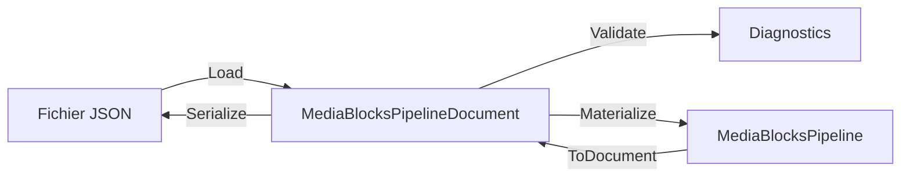

# Enregistrer et restaurer un pipeline Media Blocks en JSON en C#

[Media Blocks SDK .Net](https://www.visioforge.com/media-blocks-sdk-net){ .md-button .md-button--primary target="_blank" }

## Table des matières

- [Vue d'ensemble](#vue-densemble)
- [Le modèle de document](#le-modele-de-document)
- [Construire un pipeline à partir du JSON](#construire-un-pipeline-a-partir-du-json)
- [Valider avant de construire](#valider-avant-de-construire)
- [Capturer un pipeline en cours](#capturer-un-pipeline-en-cours)
- [Chemins de ressources relatifs](#chemins-de-ressources-relatifs)
- [Diagnostics](#diagnostics)
- [Découvrir les types de blocs](#decouvrir-les-types-de-blocs)
- [Démos](#demos)

## Vue d'ensemble

Un pipeline Media Blocks se construit normalement en code : vous créez les blocs, vous connectez leurs
pads et vous démarrez le pipeline. La couche de persistance permet de faire la même chose avec un
**document** — un simple fichier JSON qui nomme les blocs, leurs réglages et leurs connexions. Ce
document peut être écrit par votre application, modifié à la main, livré comme préréglage ou produit par
un éditeur visuel.

Trois types s'en chargent, chacun avec une seule responsabilité :

| Type | Rôle |
|---|---|
| `MediaBlocksPipelineJsonSerializer` | texte JSON ⇄ `MediaBlocksPipelineDocument` |
| `MediaBlocksPipelineValidator` | vérifie un document *avant* toute construction |
| `MediaBlocksPipelineMaterializer` | document → `MediaBlocksPipeline` vivant |

Le sens inverse — pipeline vivant → document — est assuré par `MediaBlocksPipelineSnapshot`, accessible
via `MediaBlocksPipeline.ToDocument()`.



## Le modèle de document

`MediaBlocksPipelineDocument` est un arbre de DTO simple :

- `SchemaVersion` — la version du format du document. Les versions antérieures sont migrées au chargement.
- `Pipeline` — `Id`, `Name` et réglages facultatifs du pipeline.
- `Blocks` — un `MediaBlockDocument` par bloc : `Id` (un `Guid`), `Type` (la valeur `MediaBlockType`), `TypeName`, `Name` et une charge `Settings`.
- `Connections` — un `MediaBlockConnectionDocument` par connexion, avec une référence `From` et une référence `To` de type `MediaBlockPadReference`.

Une référence de pad est un identifiant de bloc plus un **identifiant de pad**, et celui-ci suit une
convention unique :

| Identifiant de pad | Signification |
|---|---|
| `input` / `output` | le pad principal du bloc |
| `input:N` / `output:N` | l'élément *N* de la liste `Inputs` / `Outputs` du bloc |

La forme indexée est à privilégier lorsque vous générez des documents : elle désigne n'importe quel
bloc, alors que la forme sans index exige un pad principal que tous les blocs n'ont pas. Pour un sink
multiplexeur comme `MP4SinkBlock`, `input:0` et `input:1` sont les flux vidéo et audio.

Un document minimal :

```json
{
  "schemaVersion": 1,
  "pipeline": { "id": "6f0d1b6e-1f7a-4f1e-9a1a-0a0f3d5f7a11", "name": "Player" },
  "blocks": [
    {
      "id": "10000000-0000-4000-8000-000000000001",
      "type": 3,
      "typeName": "UniversalSource",
      "name": "Media File",
      "settings": { "uri": "clips/sample.mp4", "renderVideo": true, "renderAudio": true }
    },
    {
      "id": "10000000-0000-4000-8000-000000000002",
      "type": 21,
      "typeName": "VideoRenderer",
      "name": "Preview"
    }
  ],
  "connections": [
    {
      "from": { "blockId": "10000000-0000-4000-8000-000000000001", "padId": "output:0" },
      "to":   { "blockId": "10000000-0000-4000-8000-000000000002", "padId": "input" }
    }
  ]
}
```

## Construire un pipeline à partir du JSON

Le chemin le plus court remplace le contenu d'un pipeline existant :

```csharp
var pipeline = new MediaBlocksPipeline();

var result = await pipeline.LoadJsonAsync(
    File.ReadAllText("player.json"),
    resolver: null,
    baseDirectory: Path.GetDirectoryName(Path.GetFullPath("player.json")));

if (!result.Success)
{
    foreach (var diagnostic in result.Diagnostics)
    {
        Console.WriteLine(diagnostic);
    }

    return;
}

await pipeline.StartAsync();
```

`LoadJsonAsync` exige que le pipeline soit arrêté et ne laisse jamais un graphe à moitié construit : si
la matérialisation échoue en cours de route, le pipeline est vidé.

Pour construire un pipeline sans en posséder un au préalable, utilisez directement le matérialiseur. Il
renvoie le pipeline *et* la correspondance entre les identifiants du document et les blocs vivants, ce
dont vous avez besoin pour atteindre ensuite un bloc :

```csharp
var loaded = MediaBlocksPipelineJsonSerializer.Load(json);
var result = MediaBlocksPipelineMaterializer.Materialize(loaded.Document, resolver: null, baseDirectory: folder);

if (result.Success)
{
    var overlay = (TextOverlayBlock)result.Blocks[captionId];
    overlay.Settings.Text = "Live";
}
```

### Les sources réseau sont sondées au démarrage du pipeline

Un document porte le point de connexion d'une source, jamais ses informations média : le restaurer ne
contacte rien. Deux sources ont besoin de ces informations avant de pouvoir être construites :
`RTSPRAWSourceBlock` choisit son depayloader et son parser d'après la disposition des flux, et le
`NDISourceBlock` de bureau crée ses convertisseurs d'après le nombre de flux. `StartAsync` les sonde donc
pour vous, une seule fois, avant la construction du graphe. La caméra ou l'émetteur doit être joignable à
ce moment-là ; sinon `StartAsync` renvoie `false` et journalise la source qui n'a pas pu être lue.

Le `Start` synchrone n'a nulle part où attendre un sondage et ne fait pas cela, pas plus que les moteurs
`VideoCaptureCoreX` et `MediaPlayerCoreX`, qui construisent leur graphe à travers lui. Si vous démarrez
le pipeline de cette façon, remplacez ces configurations après la matérialisation par des configurations
créées via `RTSPRAWSourceSettings.CreateAsync` / `NDISourceSettings.CreateAsync`.

### Les périphériques audio sont réassociés à cette machine

Un document enregistre ce qui identifie un périphérique audio — son nom, l'API à laquelle il appartient,
le chemin du point de connexion là où la plateforme en publie un et, sur macOS, l'`unique-id` stable de
CoreAudio — et jamais le handle vivant de l'énumérateur, qui ne signifie rien en dehors du processus qui
l'a créé. La matérialisation compare cette identité aux périphériques dont la machine dispose à présent
et redonne au bloc un périphérique réel. C'est aussi pourquoi un pipeline restauré ouvre la bonne
sortie : l'identifiant numérique CoreAudio et le chemin de
périphérique WASAPI sont réattribués d'une exécution à l'autre, et l'association relit les valeurs
actuelles.

Si le périphérique a disparu, le pipeline se construit quand même — sur un autre périphérique de la même
API, signalé par un avertissement `MBS063` qui nomme les deux. Si la machine n'a aucun périphérique de
cette API, le bloc conserve l'identité du document et la matérialisation signale `MBS064` ; le bloc
n'ouvrira rien.

L'association énumère les périphériques, ce qui, dans un processus qui démarre, lance un moniteur de
périphériques GStreamer et peut prendre quelques secondes : appelez donc `Materialize` en dehors du
thread d'interface — ou énumérez une fois auparavant. Les entrées et les sorties ont des caches
distincts : `AudioSourcesAsync` préchauffe les périphériques de capture et `AudioOutputsAsync` ceux de
restitution ; sur les plateformes Apple, l'appel asynchrone de capture est de plus celui qui demande
l'autorisation du microphone. L'association synchrone à l'intérieur de `Materialize` ne fait ni l'un ni
l'autre.

## Valider avant de construire

`Validate` répond aux mêmes questions que la matérialisation, sans rien construire — une interface peut
donc afficher les problèmes d'un document pendant que l'utilisateur le modifie :

```csharp
var diagnostics = MediaBlocksPipelineValidator.Validate(
    document,
    resolver: null,
    baseDirectory: folder);

var errors = diagnostics.Where(d => d.Severity == MediaBlocksDiagnosticSeverity.Error).ToList();
```

Sont vérifiés : la structure du document, le fait que chaque type de bloc soit connu de cette version, que
chaque bloc dispose d'une voie de construction, que les références de pad s'analysent et désignent des
pads que le bloc possède réellement, qu'aucun cycle de rétroaction n'existe et — lorsque vous
transmettez un `baseDirectory` — que les fichiers lus par une source soient présents.

Passez `baseDirectory: null` pour ignorer entièrement les vérifications du système de fichiers ; c'est la
valeur par défaut, et elle préserve le comportement d'un document validé avant que ses ressources ne
soient en place.

## Capturer un pipeline en cours

`ToDocument()` parcourt le graphe vivant et produit un document. L'opération est sûre pendant que le
pipeline tourne — la liste des blocs est prise sous le verrou du pipeline et rien n'est modifié —, ce qui
en fait la voie d'enregistrement pendant la lecture :

```csharp
var snapshot = pipeline.ToDocument();

if (!snapshot.Complete)
{
    foreach (var diagnostic in snapshot.Diagnostics)
    {
        Console.WriteLine(diagnostic);
    }
}

await MediaBlocksPipelineJsonSerializer.SaveFileAsync(snapshot.Document, "captured.json");
```

`ToJson()` et `SaveJsonAsync(path)` sont les formes en une ligne ; elles envoient les diagnostics au
journal du SDK au lieu de les renvoyer.

!!! warning "Le graphe est capturé exactement ; les réglages pas toujours"

    L'identité, le type et les connexions d'un bloc se lisent sur n'importe quel bloc : la **forme** d'un
    pipeline fait donc toujours l'aller-retour. Sa **configuration** ne se lit que sur les blocs qui
    exposent leurs réglages — 153 des 404 types de blocs de ce SDK le font. Pour les autres il n'y a rien
    à lire et, plutôt que d'écrire un document qui paraîtrait complet et reconstruirait le bloc sur ses
    valeurs par défaut, la capture signale un diagnostic `MBS060` et laisse le champ `settings` de ce bloc
    vide.

    Consultez `MediaBlocksPipelineSnapshotResult.Complete` avant de considérer une capture comme une copie
    fidèle. Un pipeline lui-même construit à partir d'un document fait l'aller-retour complet, car la
    matérialisation inscrit sur les blocs qu'elle crée les identifiants du document.

## Chemins de ressources relatifs

Les réglages qui nomment un fichier peuvent être relatifs au document. Transmettez le dossier du document
comme `baseDirectory` : la validation comme la matérialisation les résolvent par rapport à lui.

```csharp
var folder = Path.GetDirectoryName(Path.GetFullPath(documentPath));
var result = MediaBlocksPipelineMaterializer.Materialize(document, resolver: null, baseDirectory: folder);
```

La réécriture couvre les réglages de type `Uri` et les réglages de type chaîne nommés `*Path`, `*File`,
`Filename` ou `*Location`. Les valeurs qui désignent un point de terminaison réseau plutôt qu'un fichier
sont laissées telles quelles : toute valeur avec un schéma (`rtsp://`, `srt://:8888/`), un littéral IPv4,
ou un premier segment qui se lit comme un nom d'hôte (`cam.local/stream.m3u8`). Un dossier dont le nom se
lit comme un hôte est ambigu, et le validateur le signale par un avertissement `MBS057` ; préfixez cette
valeur par `./` pour imposer la lecture « dossier ».

## Diagnostics

Chaque point d'entrée renvoie des valeurs `MediaBlocksDiagnostic` au lieu de lever une exception, si bien
qu'une application hôte peut afficher toute la liste d'un coup. Chacune porte une `Severity`, un `Code`,
un `Message` et le `BlockId` auquel elle se rapporte.

| Code | Signification |
|---|---|
| `MBS031` | type de bloc inconnu — le catalogue de cette version ne le contient pas |
| `MBS032` | le bloc n'a aucune voie de construction |
| `MBS040` | le bloc n'a pas pu être construit |
| `MBS048` / `MBS054` | une référence de pad n'a pas pu être résolue, ou un pad est utilisé deux fois |
| `MBS049` | les réglages n'ont pas de constructeur par défaut et le document n'apporte aucune charge utilisable |
| `MBS050` | la charge de réglages n'a pas pu être désérialisée |
| `MBS055` | un fichier lu par une source est absent |
| `MBS056` | une entrée `resources` n'a pas pu être appliquée |
| `MBS057` | une valeur qui se lit comme un point de terminaison réseau a été laissée telle quelle |
| `MBS060` | un bloc n'a pas exposé ses réglages à la capture |
| `MBS061` | un bloc n'a pas pu être nommé dans la capture |
| `MBS062` | une connexion n'a pas pu être exprimée dans la capture |
| `MBS063` | le périphérique audio nommé par un bloc a disparu, un autre de la même API est utilisé à la place |
| `MBS064` | le périphérique audio nommé par un bloc n'a pas pu être associé : aucun de cette API n'est présent, ou la recherche a échoué |

## Découvrir les types de blocs

`MediaBlockCatalog` est l'index sur lequel repose la couche de persistance, et il est utile en lui-même :
il énumère tous les blocs livrés par cette version, avec leur type de réglages, leurs propriétés
modifiables et une sonde de disponibilité.

```csharp
foreach (var descriptor in MediaBlockCatalog.All)
{
    Console.WriteLine($"{descriptor.TypeName} - {descriptor.DisplayName} ({descriptor.Category})");
}

var mp4 = MediaBlockCatalog.Get(MediaBlockType.MP4Sink);
Console.WriteLine(mp4.IsSink);                 // true - il termine une branche
Console.WriteLine(mp4.AcceptsDynamicInputs);   // true - un pad d'entrée par flux
```

## Démos

Un exemple console exécutable — construire un pipeline en code, l'enregistrer en JSON, le reconstruire à
partir de ce JSON et comparer les deux — est livré avec les exemples du SDK sous
**[Media Blocks SDK / Console](https://github.com/visioforge/.Net-SDK-s-samples/tree/master/Media%20Blocks%20SDK/Console)**.
