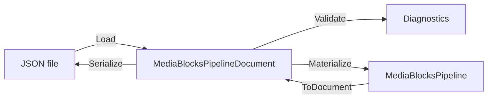

# Save and Restore a Media Blocks Pipeline as JSON in C#

[Media Blocks SDK .Net](https://www.visioforge.com/media-blocks-sdk-net){ .md-button .md-button--primary target="_blank" }

## Table of Contents

- [Overview](#overview)
- [The document model](#the-document-model)
- [Building a pipeline from JSON](#building-a-pipeline-from-json)
- [Validating before you build](#validating-before-you-build)
- [Capturing a live pipeline](#capturing-a-live-pipeline)
- [Relative asset paths](#relative-asset-paths)
- [Diagnostics](#diagnostics)
- [Discovering block types](#discovering-block-types)
- [Demos](#demos)

## Overview

A Media Blocks pipeline is normally built in code: you construct blocks, connect their pads, and start
the pipeline. The persistence layer lets you do the same thing with a **document** — an ordinary JSON
file that names the blocks, their settings and their connections. That document can be written by your
application, edited by hand, shipped as a preset, or produced by a visual editor.

Three types do the work, and each has a single responsibility:

| Type | What it does |
|---|---|
| `MediaBlocksPipelineJsonSerializer` | JSON text ⇄ `MediaBlocksPipelineDocument` |
| `MediaBlocksPipelineValidator` | checks a document *before* anything is built |
| `MediaBlocksPipelineMaterializer` | document → live `MediaBlocksPipeline` |

The reverse direction — live pipeline → document — is `MediaBlocksPipelineSnapshot`, reached through
`MediaBlocksPipeline.ToDocument()`.



## The document model

`MediaBlocksPipelineDocument` is a plain DTO tree:

- `SchemaVersion` — the document format version. Older versions are migrated on load.
- `Pipeline` — `Id`, `Name` and optional pipeline-level settings.
- `Blocks` — a `MediaBlockDocument` each: `Id` (a `Guid`), `Type` (the `MediaBlockType` value), `TypeName`, `Name`, and a `Settings` payload.
- `Connections` — a `MediaBlockConnectionDocument` each, with a `From` and a `To` `MediaBlockPadReference`.

A pad reference is a block id plus a **pad id**, and the pad id follows one convention:

| Pad id | Meaning |
|---|---|
| `input` / `output` | the block's main pad |
| `input:N` / `output:N` | element *N* of the block's `Inputs` / `Outputs` list |

The indexed form is the one to prefer when you generate documents: it addresses any block, while the
unindexed form needs a main pad that not every block has. For a muxing sink such as `MP4SinkBlock`,
`input:0` and `input:1` are the video and audio streams.

A minimal document:

```json
{
  "schemaVersion": 1,
  "pipeline": { "id": "6f0d1b6e-1f7a-4f1e-9a1a-0a0f3d5f7a11", "name": "Player" },
  "blocks": [
    {
      "id": "10000000-0000-4000-8000-000000000001",
      "type": 3,
      "typeName": "UniversalSource",
      "name": "Media File",
      "settings": { "uri": "clips/sample.mp4", "renderVideo": true, "renderAudio": true }
    },
    {
      "id": "10000000-0000-4000-8000-000000000002",
      "type": 21,
      "typeName": "VideoRenderer",
      "name": "Preview"
    }
  ],
  "connections": [
    {
      "from": { "blockId": "10000000-0000-4000-8000-000000000001", "padId": "output:0" },
      "to":   { "blockId": "10000000-0000-4000-8000-000000000002", "padId": "input" }
    }
  ]
}
```

## Building a pipeline from JSON

The shortest path replaces an existing pipeline's contents:

```csharp
var pipeline = new MediaBlocksPipeline();

var result = await pipeline.LoadJsonAsync(
    File.ReadAllText("player.json"),
    resolver: null,
    baseDirectory: Path.GetDirectoryName(Path.GetFullPath("player.json")));

if (!result.Success)
{
    foreach (var diagnostic in result.Diagnostics)
    {
        Console.WriteLine(diagnostic);
    }

    return;
}

await pipeline.StartAsync();
```

`LoadJsonAsync` requires the pipeline to be stopped, and it never leaves a half-built graph behind: if
materialization fails partway, the pipeline is cleared.

To build a pipeline without owning one first, use the materializer directly. It returns the pipeline
*and* the mapping from document ids to live blocks, which is what you need to reach a block afterwards:

```csharp
var loaded = MediaBlocksPipelineJsonSerializer.Load(json);
var result = MediaBlocksPipelineMaterializer.Materialize(loaded.Document, resolver: null, baseDirectory: folder);

if (result.Success)
{
    var overlay = (TextOverlayBlock)result.Blocks[captionId];
    overlay.Settings.Text = "Live";
}
```

## Validating before you build

`Validate` answers the same questions materialization would, without constructing anything — so a UI
can show a document's problems while the user edits it:

```csharp
var diagnostics = MediaBlocksPipelineValidator.Validate(
    document,
    resolver: null,
    baseDirectory: folder);

var errors = diagnostics.Where(d => d.Severity == MediaBlocksDiagnosticSeverity.Error).ToList();
```

It checks the document's structure, that every block type is known to this build, that each block has a
construction path, that pad references parse and point at pads the block actually has, that no feedback
cycle exists, and — when you pass a `baseDirectory` — that the files a source reads are present.

Pass `baseDirectory: null` to skip the file-system checks entirely; that is the default, and it keeps
the behaviour of a document you validate before its assets are in place.

## Capturing a live pipeline

`ToDocument()` walks the live graph and produces a document. It is safe while the pipeline is running —
the block list is taken under the pipeline's own lock and nothing is changed — which makes it the
save-during-Run path:

```csharp
var snapshot = pipeline.ToDocument();

if (!snapshot.Complete)
{
    foreach (var diagnostic in snapshot.Diagnostics)
    {
        Console.WriteLine(diagnostic);
    }
}

await MediaBlocksPipelineJsonSerializer.SaveFileAsync(snapshot.Document, "captured.json");
```

`ToJson()` and `SaveJsonAsync(path)` are the one-line forms; they send the diagnostics to the SDK log
instead of returning them.

!!! warning "The graph is captured exactly; the settings are not always"

    A block's identity, type and connections can be read from any block, so the **shape** of a pipeline
    always round-trips. Its **configuration** can only be read from blocks that expose their settings —
    153 of this SDK's 404 block types do. For the rest there is nothing to read, and rather than write a
    document that looks complete and rebuilds the block on its defaults, the snapshot reports an
    `MBS060` diagnostic and leaves that block's `settings` empty.

    Check `MediaBlocksPipelineSnapshotResult.Complete` before treating a snapshot as a faithful copy. A
    pipeline that was itself built from a document round-trips fully, because materialization stamps
    the document's block ids onto the blocks it creates.

## Relative asset paths

Settings that name a file may be relative to the document. Pass the document's folder as
`baseDirectory`, and both validation and materialization resolve them against it:

```csharp
var folder = Path.GetDirectoryName(Path.GetFullPath(documentPath));
var result = MediaBlocksPipelineMaterializer.Materialize(document, resolver: null, baseDirectory: folder);
```

The rewriting covers `Uri`-typed settings and string settings named `*Path`, `*File`, `Filename` or
`*Location`. Values that name an endpoint rather than a file are left alone — anything with a scheme
(`rtsp://`, `srt://:8888/`), an IPv4 literal, or a first segment that reads as a host name
(`cam.local/stream.m3u8`). A folder whose name reads like a host is ambiguous, and the validator says so
with an `MBS057` warning; prefix such a value with `./` to force the folder reading.

## Diagnostics

Every entry point returns `MediaBlocksDiagnostic` values rather than throwing, so a host can show the
whole list at once. Each carries a `Severity`, a `Code`, a `Message` and the `BlockId` it belongs to.

| Code | Meaning |
|---|---|
| `MBS031` | unknown block type — this build's catalog has no such block |
| `MBS032` | the block has no construction path |
| `MBS040` | the block could not be constructed |
| `MBS048` / `MBS054` | a pad reference could not be resolved, or a pad is used twice |
| `MBS049` | the settings have no default constructor and the document carries no usable payload |
| `MBS050` | the settings payload could not be deserialized |
| `MBS055` | a file a source reads is not there |
| `MBS056` | a `resources` entry could not be applied |
| `MBS057` | a value that reads as a network endpoint was left as written |
| `MBS060` | a block did not expose its settings to a snapshot |
| `MBS061` | a block could not be named in a snapshot |
| `MBS062` | a connection could not be expressed in a snapshot |

## Discovering block types

`MediaBlockCatalog` is the index the persistence layer builds on, and it is useful on its own: it lists
every block this build carries, with its settings type, its editable properties and an availability
probe.

```csharp
foreach (var descriptor in MediaBlockCatalog.All)
{
    Console.WriteLine($"{descriptor.TypeName} - {descriptor.DisplayName} ({descriptor.Category})");
}

var mp4 = MediaBlockCatalog.Get(MediaBlockType.MP4Sink);
Console.WriteLine(mp4.IsSink);                 // true - it ends a branch
Console.WriteLine(mp4.AcceptsDynamicInputs);   // true - one input pad per stream
```

## Demos

A runnable console sample - build a pipeline in code, save it as JSON, rebuild it from that JSON and
compare the two - ships with the SDK samples under
**[Media Blocks SDK / Console](https://github.com/visioforge/.Net-SDK-s-samples/tree/master/Media%20Blocks%20SDK/Console)**.
