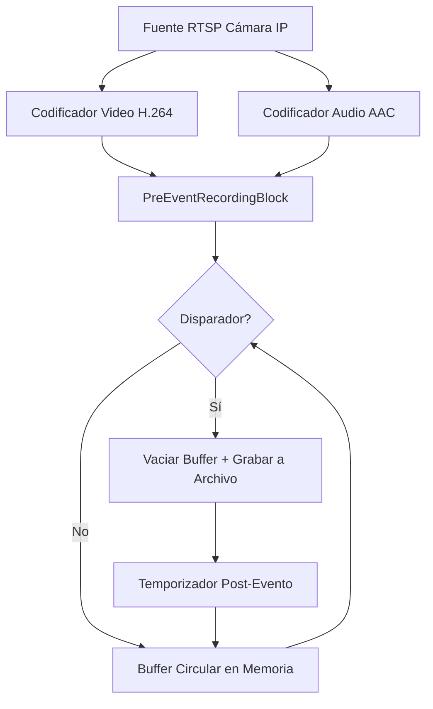

# Cómo Implementar Grabación Pre-Evento para Cámaras IP en C#

[SDK de Media Blocks .Net](https://www.visioforge.com/media-blocks-sdk-net){ .md-button .md-button--primary target="_blank" }

## Tabla de Contenidos

- [Resumen](#resumen)
- [Características Principales](#caracteristicas-principales)
- [Cómo Funciona](#como-funciona)
- [Prerrequisitos](#prerrequisitos)
- [Código de Muestra: Aplicación WPF con Cámara y Detección de Movimiento](#codigo-de-muestra-aplicacion-wpf-con-camara-y-deteccion-de-movimiento)
- [Explicación del Código](#explicacion-del-codigo)
- [Opciones de Configuración](#opciones-de-configuracion)
- [Consideraciones Clave](#consideraciones-clave)
- [Mejores Prácticas](#mejores-practicas)

## Resumen

La grabación pre-evento (también conocida como grabación con buffer circular o grabación retrospectiva) es una característica clave de vigilancia que almacena continuamente los últimos N segundos de video y audio codificados en memoria. Cuando se activa un evento — como detección de movimiento, una señal de alarma o una llamada API — el metraje pre-evento almacenado se escribe a un archivo junto con la grabación post-evento. Esto crea clips de eventos completos que incluyen metraje de antes del disparador, para que nunca se pierda momentos críticos.

Esta guía demuestra cómo grabar streams de cámaras IP y video de webcam con almacenamiento pre-evento usando el SDK de VisioForge Media Blocks para .NET. Cubre captura de cámara RTSP, grabación activada por detección de movimiento y guardado de clips de eventos en archivos MP4 o MPEG-TS.

## Características Principales

- **Almacenamiento continuo en buffer**: Los fotogramas codificados se almacenan en un buffer circular administrado con duración configurable
- **Consciente de keyframes**: La grabación siempre comienza desde el keyframe de video más cercano (I-frame) para reproducción correcta
- **Salida activada por eventos**: Los archivos se crean solo cuando ocurren eventos — sin escrituras continuas en disco
- **Grabación post-evento automática**: Duración post-evento configurable con detención automática
- **Extensión al re-disparar**: Si se activa nuevamente durante la grabación, el temporizador post-evento se reinicia sin crear un nuevo archivo
- **Múltiples formatos de contenedor**: MP4 (predeterminado), MPEG-TS (seguro ante fallos) y MKV
- **Thread-safe**: Todas las operaciones de buffer y estado están sincronizadas para acceso multi-hilo

## Cómo Funciona

El `PreEventRecordingBlock` se ubica al final de un pipeline de codificación y opera en dos modos:

**Modo de almacenamiento en buffer** (operación normal):

1. Los fotogramas de video y audio codificados fluyen al bloque desde los codificadores anteriores
2. Los fotogramas se almacenan en un buffer circular (buffer anillo) limitado por tiempo en memoria
3. Cuando el buffer excede el `PreEventDuration` configurado, los fotogramas más antiguos se eliminan
4. No se realizan operaciones de E/S en disco durante el almacenamiento en buffer

**Modo de grabación** (después del disparador):

1. Se llama a `TriggerRecording("event_001.mp4")`
2. El bloque encuentra el keyframe de video más antiguo en el buffer
3. Se crea un pipeline de salida dinámico: AppSrc → Muxer → FileSink
4. Todos los fotogramas almacenados desde el keyframe en adelante se vacían al archivo
5. Los fotogramas en vivo continúan fluyendo al archivo en tiempo real
6. Después de que el temporizador `PostEventDuration` expire, la grabación se detiene automáticamente
7. El pipeline de salida se destruye y el bloque vuelve al modo de almacenamiento en buffer



## Prerrequisitos

Necesitará el SDK de VisioForge Media Blocks. Agréguelo a su proyecto .NET vía NuGet:

```xml
<PackageReference Include="VisioForge.DotNet.MediaBlocks" Version="2025.5.2" />
```

Dependiendo de su plataforma objetivo, agregue el paquete runtime nativo correspondiente. Para Windows x64:

```xml
<PackageReference Include="VisioForge.CrossPlatform.Core.Windows.x64" Version="2025.4.9" />
<PackageReference Include="VisioForge.CrossPlatform.Libav.Windows.x64.UPX" Version="2025.4.9" />
```

Para dependencias específicas de plataforma detalladas, vea la [Guía de Despliegue](../../deployment-x/index.md).

## Código de Muestra: Aplicación WPF con Cámara y Detección de Movimiento

El siguiente código C# está basado en la [demo WPF de Grabación Pre-Evento](https://github.com/visioforge/.Net-SDK-s-samples). Demuestra un pipeline completo con una fuente de cámara, detección de movimiento para activación automática, vista previa de video y grabación pre-evento a archivos MP4.

!!!info Muestra de Demo
    Para un proyecto funcional completo con XAML y todas las dependencias, vea la [Demo de Grabación Pre-Evento Media Blocks](https://github.com/visioforge/.Net-SDK-s-samples/tree/master/Media%20Blocks%20SDK/WPF/CSharp/PreEventRecording).

```csharp
using System;
using System.Diagnostics;
using System.IO;
using System.Linq;
using System.Windows;

using VisioForge.Core;
using VisioForge.Core.MediaBlocks;
using VisioForge.Core.MediaBlocks.AudioEncoders;
using VisioForge.Core.MediaBlocks.AudioRendering;
using VisioForge.Core.MediaBlocks.Sources;
using VisioForge.Core.MediaBlocks.Special;
using VisioForge.Core.MediaBlocks.VideoEncoders;
using VisioForge.Core.MediaBlocks.VideoProcessing;
using VisioForge.Core.MediaBlocks.VideoRendering;
using VisioForge.Core.Types;
using VisioForge.Core.Types.Events;
using VisioForge.Core.Types.X.PreEventRecording;
using VisioForge.Core.Types.X.Sources;
using VisioForge.Core.Types.X.VideoEffects;

public partial class MainWindow : Window, IDisposable
{
    // Pipeline blocks
    private MediaBlocksPipeline _pipeline;
    private MediaBlock _videoSource;
    private MediaBlock _audioSource;
    private TeeBlock _videoTee;
    private TeeBlock _audioTee;
    private VideoRendererBlock _videoRenderer;
    private AudioRendererBlock _audioRenderer;
    private H264EncoderBlock _h264Encoder;
    private AACEncoderBlock _aacEncoder;
    private PreEventRecordingBlock _preEventBlock;
    private MotionDetectionBlock _motionDetector;
    private MotionDetectionBlockSettings _motionSettings;

    private string _outputFolder;
    private System.Timers.Timer _statusTimer;

    private async void BtStart_Click(object sender, RoutedEventArgs e)
    {
        // Ensure output folder exists
        _outputFolder = Path.Combine(
            Environment.GetFolderPath(Environment.SpecialFolder.MyVideos),
            "PreEventRecording");
        Directory.CreateDirectory(_outputFolder);

        bool audioEnabled = true;

        // Create pipeline
        _pipeline = new MediaBlocksPipeline();
        _pipeline.OnError += (s, args) => Log($"[Error] {args.Message}");

        // Video source (camera device)
        var device = (await DeviceEnumerator.Shared.VideoSourcesAsync()).FirstOrDefault();
        var videoSourceSettings = new VideoCaptureDeviceSourceSettings(device);
        _videoSource = new SystemVideoSourceBlock(videoSourceSettings);

        // Motion detection (frame differencing, no OpenCV required)
        _motionSettings = new MotionDetectionBlockSettings
        {
            MotionThreshold = 5,
            CompareGreyscale = true,
            GridWidth = 8,
            GridHeight = 8
        };
        _motionDetector = new MotionDetectionBlock(_motionSettings);
        _motionDetector.OnMotionDetected += OnMotionDetected;

        // Video tee: preview + encoder
        _videoTee = new TeeBlock(2, MediaBlockPadMediaType.Video);

        // Video renderer (preview)
        _videoRenderer = new VideoRendererBlock(_pipeline, VideoView1);

        // H264 encoder for the recording branch
        _h264Encoder = new H264EncoderBlock();

        // Pre-event recording block
        var preEventSettings = new PreEventRecordingSettings
        {
            PreEventDuration = TimeSpan.FromSeconds(10),
            PostEventDuration = TimeSpan.FromSeconds(5)
        };
        _preEventBlock = new PreEventRecordingBlock(preEventSettings, "mp4mux");
        _preEventBlock.AudioEnabled = audioEnabled;

        // Subscribe to recording events
        _preEventBlock.OnRecordingStarted += (s, args) =>
            Log($"Recording started: {args.Filename}");
        _preEventBlock.OnRecordingStopped += (s, args) =>
            Log($"Recording stopped: {args.Filename}");
        _preEventBlock.OnStateChanged += (s, args) =>
            Log($"State changed: {args.State}");

        // Connect video: source -> motion detector -> tee -> [renderer, encoder -> preEvent]
        _pipeline.Connect(_videoSource, _motionDetector);
        _pipeline.Connect(_motionDetector, _videoTee);
        _pipeline.Connect(_videoTee, _videoRenderer);
        _pipeline.Connect(_videoTee, _h264Encoder);
        _pipeline.Connect(_h264Encoder.Output, _preEventBlock.VideoInput);

        // Connect audio: source -> tee -> [renderer, encoder -> preEvent]
        if (audioEnabled)
        {
            var audioDevice = (await DeviceEnumerator.Shared.AudioSourcesAsync()).FirstOrDefault();
            if (audioDevice != null)
            {
                _audioSource = new SystemAudioSourceBlock(audioDevice.CreateSourceSettings(null));
                _audioTee = new TeeBlock(2, MediaBlockPadMediaType.Audio);
                _audioRenderer = new AudioRendererBlock();
                _aacEncoder = new AACEncoderBlock();

                _pipeline.Connect(_audioSource, _audioTee);
                _pipeline.Connect(_audioTee, _audioRenderer);
                _pipeline.Connect(_audioTee, _aacEncoder);
                _pipeline.Connect(_aacEncoder.Output, _preEventBlock.AudioInput);
            }
        }

        // Start pipeline — buffering begins immediately
        await _pipeline.StartAsync();

        // Start status timer to display buffer stats
        _statusTimer = new System.Timers.Timer(500);
        _statusTimer.Elapsed += (s, args) => UpdateStatus();
        _statusTimer.Start();

        Log("Pipeline started. Buffering...");
    }

    // Motion detection handler: auto-trigger recording on motion
    private void OnMotionDetected(object sender, MotionDetectionEventArgs e)
    {
        if (_preEventBlock == null) return;

        bool isMotion = e.Level >= _motionSettings.MotionThreshold;
        if (!isMotion) return;

        var state = _preEventBlock.State;
        if (state == PreEventRecordingState.Buffering)
        {
            var filename = Path.Combine(_outputFolder,
                $"motion_{DateTime.Now:yyyyMMdd_HHmmss}.mp4");
            _preEventBlock.TriggerRecording(filename);
            Log($"Motion triggered recording: {filename}");
        }
        else if (state == PreEventRecordingState.Recording ||
                 state == PreEventRecordingState.PostEventRecording)
        {
            // Motion still active — extend the recording
            _preEventBlock.ExtendRecording();
        }
    }

    // Manual trigger button
    private void BtTrigger_Click(object sender, RoutedEventArgs e)
    {
        if (_preEventBlock == null) return;

        var filename = Path.Combine(_outputFolder,
            $"event_{DateTime.Now:yyyyMMdd_HHmmss}.mp4");
        _preEventBlock.TriggerRecording(filename);
        Log($"Trigger recording: {filename}");
    }

    // Manual stop recording button
    private void BtStopRec_Click(object sender, RoutedEventArgs e)
    {
        _preEventBlock?.StopRecording();
        Log("Recording stopped manually.");
    }

    // Extend recording button
    private void BtExtend_Click(object sender, RoutedEventArgs e)
    {
        _preEventBlock?.ExtendRecording();
        Log("Post-event timer extended.");
    }

    // Monitor buffer status periodically
    private void UpdateStatus()
    {
        if (_preEventBlock == null) return;

        var state = _preEventBlock.State;
        var totalBytes = _preEventBlock.BufferTotalBytes;
        var duration = _preEventBlock.BufferedDuration;

        Dispatcher.Invoke(() =>
        {
            lbState.Text = $"State: {state}";
            lbBufferStats.Text = $"Buffer: {totalBytes / 1024.0:F1} KB, {duration.TotalSeconds:F1}s";
        });
    }

    // Stop pipeline and clean up
    private async void BtStop_Click(object sender, RoutedEventArgs e)
    {
        _statusTimer?.Stop();
        _statusTimer?.Dispose();

        if (_pipeline != null)
        {
            await _pipeline.StopAsync();
            _pipeline.Dispose();
            _pipeline = null;
        }

        if (_motionDetector != null)
        {
            _motionDetector.OnMotionDetected -= OnMotionDetected;
            _motionDetector = null;
        }

        _preEventBlock = null;
        _videoSource = null;
        _audioSource = null;

        Log("Pipeline stopped.");
    }
}
```

## Explicación del Código

1. **Fuente de Video**: El `SystemVideoSourceBlock` captura video desde un dispositivo de cámara local. Para cámaras IP RTSP, use `RTSPSourceBlock` con `RTSPSourceSettings.CreateAsync()` en su lugar.

2. **Detección de Movimiento**: El `MotionDetectionBlock` realiza detección de movimiento basada en diferencia de fotogramas sin requerir OpenCV. Dispara eventos `OnMotionDetected` que la aplicación usa para activar grabaciones automáticamente.

3. **Video Tee**: El `TeeBlock` divide el stream de video en dos ramas — una para vista previa en vivo vía `VideoRendererBlock`, y otra para codificación H.264 y almacenamiento pre-evento.

4. **Codificador H264**: El `H264EncoderBlock` codifica fotogramas de video raw para el bloque pre-evento. El bloque selecciona automáticamente el mejor codificador disponible (acelerado por hardware si está disponible).

5. **PreEventRecordingBlock**: El componente principal. Recibe video y audio codificados, los almacena en un buffer circular, y crea archivos de salida dinámicos al activarse. El parámetro `"mp4mux"` establece MP4 como formato de salida.

6. **Ruta de Audio**: El audio sigue un patrón similar — tee divide hacia el renderer (reproducción) y codificador AAC, que alimenta al bloque pre-evento.

7. **Manejo de Eventos**: Tres eventos notifican a su aplicación:
    - `OnRecordingStarted` — se dispara cuando comienza el vaciado del buffer
    - `OnRecordingStopped` — se dispara cuando la grabación termina
    - `OnStateChanged` — se dispara en cada transición de estado

8. **Monitoreo de Estado**: Un temporizador lee periódicamente `BufferTotalBytes` y `BufferedDuration` para mostrar el estado del buffer en la UI.

### Usando una fuente RTSP

Cuando use una cámara IP RTSP en lugar de una cámara local, reemplace la configuración de la fuente:

```csharp
// Replace SystemVideoSourceBlock with RTSPSourceBlock
var rtspSettings = await RTSPSourceSettings.CreateAsync(
    new Uri("rtsp://192.168.1.21:554/Streaming/Channels/101"),
    login: "admin",
    password: "password",
    audioEnabled: true);

var rtspSource = new RTSPSourceBlock(rtspSettings);
_videoSource = rtspSource;

// Video path is the same: rtspSource -> motionDetector -> tee -> ...

// Audio comes from the RTSP source instead of a system audio device:
_pipeline.Connect(rtspSource.AudioOutput, _audioTee.Input);
```

## Opciones de Configuración

### Duración del buffer

```csharp
var settings = new PreEventRecordingSettings
{
    PreEventDuration = TimeSpan.FromSeconds(60),  // Buffer last 60 seconds
    PostEventDuration = TimeSpan.FromSeconds(30)   // Record 30s after trigger
};
```

### Límite de memoria

```csharp
var settings = new PreEventRecordingSettings
{
    PreEventDuration = TimeSpan.FromSeconds(30),
    PostEventDuration = TimeSpan.FromSeconds(10),
    MaxBufferBytes = 50 * 1024 * 1024  // Hard limit: 50 MB per camera
};
```

### MPEG-TS para seguridad ante fallos

```csharp
// MPEG-TS files are always playable even if the process crashes during recording
var preEventBlock = new PreEventRecordingBlock(settings, "mpegtsmux");
preEventBlock.TriggerRecording("/recordings/event_001.ts");
```

### Salida MKV

```csharp
var preEventBlock = new PreEventRecordingBlock(settings, "matroskamux");
preEventBlock.TriggerRecording("/recordings/event_001.mkv");
```

### Deshabilitar audio

```csharp
var preEventBlock = new PreEventRecordingBlock(settings, "mp4mux");
preEventBlock.AudioEnabled = false;

// Only connect video
pipeline.Connect(rtspSource.VideoOutput, preEventBlock.VideoInput);
```

## Consideraciones Clave

- **Uso de memoria**: 30 segundos de video H.264 almacenado a 4 Mbps más audio AAC a 128 kbps usa aproximadamente 15.5 MB de memoria administrada por cámara. Escale según corresponda al monitorear múltiples cámaras.
- **Alineación de keyframes**: La duración pre-evento real en el archivo de salida puede ser ligeramente menor que la configurada, ya que el buffer se drena desde el keyframe más cercano. Con un GOP típico de 2 segundos, el metraje pre-evento real comienza dentro de 2 segundos de la duración configurada.
- **Comportamiento de re-disparo**: Llamar a `TriggerRecording()` mientras ya está grabando extiende la grabación actual en lugar de crear un nuevo archivo. Llame a `StopRecording()` primero si necesita un nuevo archivo.
- **Formato de contenedor**: Use MP4 para máxima compatibilidad. Use MPEG-TS para seguridad ante fallos en despliegues desatendidos/headless donde pueden ocurrir cortes de energía o fallos.
- **Entrada codificada requerida**: El `PreEventRecordingBlock` espera fotogramas codificados. Cuando use fuentes que producen video raw (como `SystemVideoSourceBlock`), agregue bloques codificadores (H264, HEVC) entre la fuente y el bloque pre-evento.

## Mejores Prácticas

- Establezca `PreEventDuration` basado en los requisitos de su aplicación — buffers más largos usan más memoria pero capturan más contexto
- Use `MaxBufferBytes` como red de seguridad en sistemas multi-cámara para prevenir crecimiento ilimitado de memoria
- Suscríbase a `OnRecordingStopped` para confirmar que las grabaciones se finalizaron exitosamente
- Use MPEG-TS para aplicaciones de vigilancia que funcionan desatendidas
- Implemente una estrategia de nombres de archivo que incluya marcas de tiempo (ej. `event_2024-01-15_14-30-00.mp4`) para fácil organización
- Monitoree `BufferTotalBytes` periódicamente para verificar que el buffer se está llenando y eliminando correctamente
