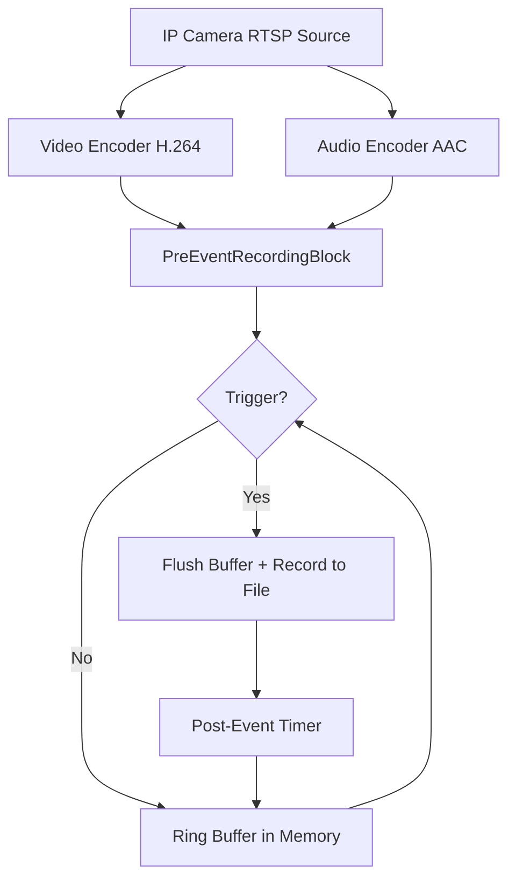

# Implémenter l'enregistrement pré-événement pour caméras IP en C#

[Media Blocks SDK .Net](https://www.visioforge.com/media-blocks-sdk-net){ .md-button .md-button--primary target="_blank" }

## Table des matières

- [Vue d'ensemble](#vue-densemble)
- [Fonctionnalités principales](#fonctionnalites-principales)
- [Fonctionnement](#fonctionnement)
- [Prérequis](#prerequis)
- [Exemple de code : application WPF avec caméra et détection de mouvement](#exemple-de-code-application-wpf-avec-camera-et-detection-de-mouvement)
- [Explication du code](#explication-du-code)
- [Options de configuration](#options-de-configuration)
- [Considérations clés](#considerations-cles)
- [Bonnes pratiques](#bonnes-pratiques)

## Vue d'ensemble

L'enregistrement pré-événement (également appelé enregistrement par tampon circulaire ou rétrospectif) est une fonctionnalité clé de vidéosurveillance qui met en tampon en continu les N dernières secondes de vidéo et d'audio encodées en mémoire. Lorsqu'un événement déclencheur survient — détection de mouvement, signal d'alarme ou appel d'API — la séquence pré-événement mise en tampon est écrite dans un fichier avec l'enregistrement post-événement. Cela crée des clips d'événement complets incluant la séquence d'avant le déclenchement, pour ne jamais manquer les moments critiques.

Ce guide montre comment enregistrer les flux de caméras IP et la vidéo webcam avec mise en tampon pré-événement à l'aide du VisioForge Media Blocks SDK pour .NET. Il couvre la capture caméra RTSP, l'enregistrement déclenché par détection de mouvement, et l'enregistrement des clips d'événement vers des fichiers MP4 ou MPEG-TS.

## Fonctionnalités principales

- **Mise en tampon continue** : les images encodées sont stockées dans un tampon circulaire managé avec une durée configurable
- **Sensibilité aux images-clés** : l'enregistrement démarre toujours à partir de la plus proche image-clé vidéo (I-frame) pour une lecture correcte
- **Sortie déclenchée par événement** : les fichiers ne sont créés que lorsqu'un événement survient — pas d'écritures disque continues
- **Enregistrement post-événement automatique** : durée post-événement configurable avec arrêt automatique
- **Extension sur nouveau déclenchement** : si déclenché à nouveau pendant l'enregistrement, le minuteur post-événement se réinitialise sans créer un nouveau fichier
- **Plusieurs formats de conteneurs** : MP4 (par défaut), MPEG-TS (résistant aux plantages) et MKV
- **Thread-safe** : toutes les opérations sur le tampon et l'état sont synchronisées pour l'accès multi-threads

## Fonctionnement

Le `PreEventRecordingBlock` se trouve à la fin d'un pipeline d'encodage et fonctionne en deux modes :

**Mode mise en tampon** (fonctionnement normal) :

1. Les images vidéo et audio encodées arrivent au bloc depuis les encodeurs en amont
2. Les images sont stockées dans un tampon circulaire à durée limitée (ring buffer) en mémoire
3. Lorsque le tampon dépasse la `PreEventDuration` configurée, les images les plus anciennes sont expulsées
4. Aucune E/S disque ne se produit pendant la mise en tampon

**Mode enregistrement** (après déclenchement) :

1. `TriggerRecording("event_001.mp4")` est appelée
2. Le bloc trouve la plus ancienne image-clé vidéo dans le tampon
3. Un pipeline de sortie dynamique est créé : AppSrc → Muxer → FileSink
4. Toutes les images en tampon depuis l'image-clé sont vidées dans le fichier
5. Les images en direct continuent d'affluer dans le fichier en temps réel
6. Une fois le minuteur `PostEventDuration` expiré, l'enregistrement s'arrête automatiquement
7. Le pipeline de sortie est démonté et le bloc revient en mode mise en tampon



## Prérequis

Vous aurez besoin du VisioForge Media Blocks SDK. Ajoutez-le à votre projet .NET via NuGet :

```xml
<PackageReference Include="VisioForge.DotNet.MediaBlocks" Version="2025.5.2" />
```

Selon votre plateforme cible, ajoutez le paquet de runtime natif correspondant. Pour Windows x64 :

```xml
<PackageReference Include="VisioForge.CrossPlatform.Core.Windows.x64" Version="2025.4.9" />
<PackageReference Include="VisioForge.CrossPlatform.Libav.Windows.x64.UPX" Version="2025.4.9" />
```

Pour les dépendances détaillées par plateforme, consultez le [guide de déploiement](../../deployment-x/index.md).

## Exemple de code : application WPF avec caméra et détection de mouvement

Le code C# suivant est basé sur la [démo Pre-Event Recording WPF](https://github.com/visioforge/.Net-SDK-s-samples). Il montre un pipeline complet avec source caméra, détection de mouvement pour déclenchement automatique, aperçu vidéo et enregistrement pré-événement vers des fichiers MP4.

!!!info Exemple de démo
    Pour un projet complet et fonctionnel avec XAML et toutes les dépendances, consultez la [démo Pre-Event Recording Media Blocks](https://github.com/visioforge/.Net-SDK-s-samples/tree/master/Media%20Blocks%20SDK/WPF/CSharp/PreEventRecording%20Demo).

```csharp
using System;
using System.Diagnostics;
using System.IO;
using System.Linq;
using System.Windows;

using VisioForge.Core;
using VisioForge.Core.MediaBlocks;
using VisioForge.Core.MediaBlocks.AudioEncoders;
using VisioForge.Core.MediaBlocks.AudioRendering;
using VisioForge.Core.MediaBlocks.Sources;
using VisioForge.Core.MediaBlocks.Special;
using VisioForge.Core.MediaBlocks.VideoEncoders;
using VisioForge.Core.MediaBlocks.VideoProcessing;
using VisioForge.Core.MediaBlocks.VideoRendering;
using VisioForge.Core.Types;
using VisioForge.Core.Types.Events;
using VisioForge.Core.Types.X.PreEventRecording;
using VisioForge.Core.Types.X.Sources;
using VisioForge.Core.Types.X.VideoEffects;

public partial class MainWindow : Window, IDisposable
{
    // Blocs du pipeline
    private MediaBlocksPipeline _pipeline;
    private MediaBlock _videoSource;
    private MediaBlock _audioSource;
    private TeeBlock _videoTee;
    private TeeBlock _audioTee;
    private VideoRendererBlock _videoRenderer;
    private AudioRendererBlock _audioRenderer;
    private H264EncoderBlock _h264Encoder;
    private AACEncoderBlock _aacEncoder;
    private PreEventRecordingBlock _preEventBlock;
    private MotionDetectionBlock _motionDetector;
    private MotionDetectionBlockSettings _motionSettings;

    private string _outputFolder;
    private System.Timers.Timer _statusTimer;

    private async void BtStart_Click(object sender, RoutedEventArgs e)
    {
        // S'assurer que le dossier de sortie existe
        _outputFolder = Path.Combine(
            Environment.GetFolderPath(Environment.SpecialFolder.MyVideos),
            "PreEventRecording");
        Directory.CreateDirectory(_outputFolder);

        bool audioEnabled = true;

        // Créer le pipeline
        _pipeline = new MediaBlocksPipeline();
        _pipeline.OnError += (s, args) => Log($"[Error] {args.Message}");

        // Source vidéo (périphérique caméra)
        var device = (await DeviceEnumerator.Shared.VideoSourcesAsync()).FirstOrDefault();
        var videoSourceSettings = new VideoCaptureDeviceSourceSettings(device);
        _videoSource = new SystemVideoSourceBlock(videoSourceSettings);

        // Détection de mouvement (différentiation d'images, ne nécessite pas OpenCV)
        _motionSettings = new MotionDetectionBlockSettings
        {
            MotionThreshold = 5,
            CompareGreyscale = true,
            GridWidth = 8,
            GridHeight = 8
        };
        _motionDetector = new MotionDetectionBlock(_motionSettings);
        _motionDetector.OnMotionDetected += OnMotionDetected;

        // Tee vidéo : aperçu + encodeur
        _videoTee = new TeeBlock(2, MediaBlockPadMediaType.Video);

        // Moteur de rendu vidéo (aperçu)
        _videoRenderer = new VideoRendererBlock(_pipeline, VideoView1);

        // Encodeur H264 pour la branche d'enregistrement
        _h264Encoder = new H264EncoderBlock();

        // Bloc d'enregistrement pré-événement
        var preEventSettings = new PreEventRecordingSettings
        {
            PreEventDuration = TimeSpan.FromSeconds(10),
            PostEventDuration = TimeSpan.FromSeconds(5)
        };
        _preEventBlock = new PreEventRecordingBlock(preEventSettings, "mp4mux");
        _preEventBlock.AudioEnabled = audioEnabled;

        // S'abonner aux événements d'enregistrement
        _preEventBlock.OnRecordingStarted += (s, args) =>
            Log($"Recording started: {args.Filename}");
        _preEventBlock.OnRecordingStopped += (s, args) =>
            Log($"Recording stopped: {args.Filename}");
        _preEventBlock.OnStateChanged += (s, args) =>
            Log($"State changed: {args.State}");

        // Connecter la vidéo : source -> détecteur de mouvement -> tee -> [renderer, encodeur -> preEvent]
        _pipeline.Connect(_videoSource, _motionDetector);
        _pipeline.Connect(_motionDetector, _videoTee);
        _pipeline.Connect(_videoTee, _videoRenderer);
        _pipeline.Connect(_videoTee, _h264Encoder);
        _pipeline.Connect(_h264Encoder.Output, _preEventBlock.VideoInput);

        // Connecter l'audio : source -> tee -> [renderer, encodeur -> preEvent]
        if (audioEnabled)
        {
            var audioDevice = (await DeviceEnumerator.Shared.AudioSourcesAsync()).FirstOrDefault();
            if (audioDevice != null)
            {
                _audioSource = new SystemAudioSourceBlock(audioDevice.CreateSourceSettings(null));
                _audioTee = new TeeBlock(2, MediaBlockPadMediaType.Audio);
                _audioRenderer = new AudioRendererBlock();
                _aacEncoder = new AACEncoderBlock();

                _pipeline.Connect(_audioSource, _audioTee);
                _pipeline.Connect(_audioTee, _audioRenderer);
                _pipeline.Connect(_audioTee, _aacEncoder);
                _pipeline.Connect(_aacEncoder.Output, _preEventBlock.AudioInput);
            }
        }

        // Démarrer le pipeline — la mise en tampon commence immédiatement
        await _pipeline.StartAsync();

        // Démarrer le minuteur de statut pour afficher les stats du tampon
        _statusTimer = new System.Timers.Timer(500);
        _statusTimer.Elapsed += (s, args) => UpdateStatus();
        _statusTimer.Start();

        Log("Pipeline started. Buffering...");
    }

    // Gestionnaire de détection de mouvement : déclenche automatiquement l'enregistrement
    private void OnMotionDetected(object sender, MotionDetectionEventArgs e)
    {
        if (_preEventBlock == null) return;

        bool isMotion = e.Level >= _motionSettings.MotionThreshold;
        if (!isMotion) return;

        var state = _preEventBlock.State;
        if (state == PreEventRecordingState.Buffering)
        {
            var filename = Path.Combine(_outputFolder,
                $"motion_{DateTime.Now:yyyyMMdd_HHmmss}.mp4");
            _preEventBlock.TriggerRecording(filename);
            Log($"Motion triggered recording: {filename}");
        }
        else if (state == PreEventRecordingState.Recording ||
                 state == PreEventRecordingState.PostEventRecording)
        {
            // Mouvement toujours actif — étendre l'enregistrement
            _preEventBlock.ExtendRecording();
        }
    }

    // Bouton de déclenchement manuel
    private void BtTrigger_Click(object sender, RoutedEventArgs e)
    {
        if (_preEventBlock == null) return;

        var filename = Path.Combine(_outputFolder,
            $"event_{DateTime.Now:yyyyMMdd_HHmmss}.mp4");
        _preEventBlock.TriggerRecording(filename);
        Log($"Trigger recording: {filename}");
    }

    // Bouton d'arrêt manuel de l'enregistrement
    private void BtStopRec_Click(object sender, RoutedEventArgs e)
    {
        _preEventBlock?.StopRecording();
        Log("Recording stopped manually.");
    }

    // Bouton d'extension de l'enregistrement
    private void BtExtend_Click(object sender, RoutedEventArgs e)
    {
        _preEventBlock?.ExtendRecording();
        Log("Post-event timer extended.");
    }

    // Surveiller périodiquement le statut du tampon
    private void UpdateStatus()
    {
        if (_preEventBlock == null) return;

        var state = _preEventBlock.State;
        var totalBytes = _preEventBlock.BufferTotalBytes;
        var duration = _preEventBlock.BufferedDuration;

        Dispatcher.Invoke(() =>
        {
            lbState.Text = $"State: {state}";
            lbBufferStats.Text = $"Buffer: {totalBytes / 1024.0:F1} KB, {duration.TotalSeconds:F1}s";
        });
    }

    // Arrêter le pipeline et nettoyer
    private async void BtStop_Click(object sender, RoutedEventArgs e)
    {
        _statusTimer?.Stop();
        _statusTimer?.Dispose();

        if (_pipeline != null)
        {
            await _pipeline.StopAsync();
            _pipeline.Dispose();
            _pipeline = null;
        }

        if (_motionDetector != null)
        {
            _motionDetector.OnMotionDetected -= OnMotionDetected;
            _motionDetector = null;
        }

        _preEventBlock = null;
        _videoSource = null;
        _audioSource = null;

        Log("Pipeline stopped.");
    }
}
```

## Explication du code

1. **Source vidéo** : le `SystemVideoSourceBlock` capture la vidéo depuis un périphérique caméra local. Pour les caméras IP RTSP, utilisez plutôt `RTSPSourceBlock` avec `RTSPSourceSettings.CreateAsync()`.

2. **Détection de mouvement** : le `MotionDetectionBlock` effectue une détection de mouvement par différence d'images sans nécessiter OpenCV. Il déclenche les événements `OnMotionDetected` que l'application utilise pour déclencher automatiquement les enregistrements.

3. **Tee vidéo** : le `TeeBlock` divise le flux vidéo en deux branches — une pour l'aperçu en direct via `VideoRendererBlock`, l'autre pour l'encodage H.264 et la mise en tampon pré-événement.

4. **Encodeur H264** : le `H264EncoderBlock` encode les images vidéo brutes pour le bloc pré-événement. Le bloc sélectionne automatiquement le meilleur encodeur disponible (accéléré matériellement si disponible).

5. **PreEventRecordingBlock** : le composant central. Il reçoit la vidéo et l'audio encodés, les stocke dans un tampon circulaire et crée des fichiers de sortie dynamiques au déclenchement. Le paramètre `"mp4mux"` définit MP4 comme format de sortie.

6. **Chemin audio** : l'audio suit un schéma similaire — le tee divise vers le moteur de rendu (lecture) et l'encodeur AAC, qui alimente le bloc pré-événement.

7. **Gestion des événements** : trois événements notifient votre application :
    - `OnRecordingStarted` — déclenché lorsque la vidange du tampon commence
    - `OnRecordingStopped` — déclenché à la fin de l'enregistrement
    - `OnStateChanged` — déclenché à chaque transition d'état

8. **Surveillance du statut** : un minuteur lit périodiquement `BufferTotalBytes` et `BufferedDuration` pour afficher l'état du tampon dans l'interface.

### Utiliser une source RTSP

Lorsque vous utilisez une caméra IP RTSP au lieu d'une caméra locale, remplacez la configuration de source :

```csharp
// Remplacer SystemVideoSourceBlock par RTSPSourceBlock
var rtspSettings = await RTSPSourceSettings.CreateAsync(
    new Uri("rtsp://192.168.1.21:554/Streaming/Channels/101"),
    login: "admin",
    password: "password",
    audioEnabled: true);

var rtspSource = new RTSPSourceBlock(rtspSettings);
_videoSource = rtspSource;

// Le chemin vidéo est identique : rtspSource -> motionDetector -> tee -> ...

// L'audio provient de la source RTSP au lieu d'un périphérique audio système :
_pipeline.Connect(rtspSource.AudioOutput, _audioTee.Input);
```

## Options de configuration

### Durée du tampon

```csharp
var settings = new PreEventRecordingSettings
{
    PreEventDuration = TimeSpan.FromSeconds(60),  // Mettre en tampon les 60 dernières secondes
    PostEventDuration = TimeSpan.FromSeconds(30)   // Enregistrer 30 s après le déclenchement
};
```

### Limite mémoire

```csharp
var settings = new PreEventRecordingSettings
{
    PreEventDuration = TimeSpan.FromSeconds(30),
    PostEventDuration = TimeSpan.FromSeconds(10),
    MaxBufferBytes = 50 * 1024 * 1024  // Limite stricte : 50 Mo par caméra
};
```

### MPEG-TS pour la résistance aux plantages

```csharp
// Les fichiers MPEG-TS sont toujours lisibles même si le processus plante pendant l'enregistrement
var preEventBlock = new PreEventRecordingBlock(settings, "mpegtsmux");
preEventBlock.TriggerRecording("/recordings/event_001.ts");
```

### Sortie MKV

```csharp
var preEventBlock = new PreEventRecordingBlock(settings, "matroskamux");
preEventBlock.TriggerRecording("/recordings/event_001.mkv");
```

### Désactiver l'audio

```csharp
var preEventBlock = new PreEventRecordingBlock(settings, "mp4mux");
preEventBlock.AudioEnabled = false;

// Ne connecter que la vidéo
pipeline.Connect(rtspSource.VideoOutput, preEventBlock.VideoInput);
```

## Considérations clés

- **Utilisation mémoire** : 30 secondes de vidéo H.264 en tampon à 4 Mbps plus de l'audio AAC à 128 kbps utilisent environ 15,5 Mo de mémoire managée par caméra. Adaptez l'échelle lorsque vous surveillez plusieurs caméras.
- **Alignement sur les images-clés** : la durée pré-événement réelle dans le fichier de sortie peut être légèrement inférieure à celle configurée, le tampon se vidant à partir de l'image-clé la plus proche. Avec un GOP typique de 2 secondes, la séquence pré-événement réelle commence dans les 2 secondes de la durée configurée.
- **Comportement de redéclenchement** : appeler `TriggerRecording()` pendant un enregistrement déjà en cours étend l'enregistrement actuel au lieu de créer un nouveau fichier. Appelez d'abord `StopRecording()` si vous avez besoin d'un nouveau fichier.
- **Format de conteneur** : utilisez MP4 pour une compatibilité maximale. Utilisez MPEG-TS pour la résistance aux plantages dans les déploiements sans surveillance/headless où des coupures d'alimentation ou plantages peuvent survenir.
- **Entrée encodée requise** : le `PreEventRecordingBlock` attend des images encodées. Lors de l'utilisation de sources qui produisent de la vidéo brute (comme `SystemVideoSourceBlock`), ajoutez des blocs d'encodage (H264, HEVC) entre la source et le bloc pré-événement.

## Bonnes pratiques

- Définissez `PreEventDuration` en fonction des exigences de votre application — des tampons plus longs utilisent plus de mémoire mais capturent plus de contexte
- Utilisez `MaxBufferBytes` comme filet de sécurité dans les systèmes multi-caméras pour éviter une croissance mémoire non bornée
- Abonnez-vous à `OnRecordingStopped` pour confirmer que les enregistrements ont été finalisés avec succès
- Utilisez MPEG-TS pour les applications de vidéosurveillance fonctionnant sans surveillance
- Implémentez une stratégie de nommage de fichiers incluant des horodatages (par ex. `event_2024-01-15_14-30-00.mp4`) pour une organisation facile
- Surveillez périodiquement `BufferTotalBytes` pour vérifier que le tampon se remplit et s'expulse correctement
