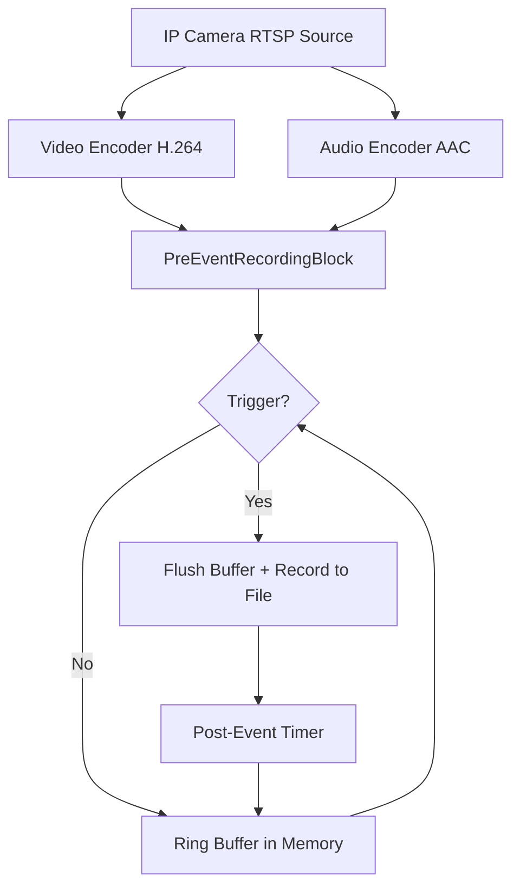

# How to Implement Pre-Event Recording for IP Cameras in C#

[Media Blocks SDK .Net](https://www.visioforge.com/media-blocks-sdk-net){ .md-button .md-button--primary target="_blank" }

## Table of Contents

- [Overview](#overview)
- [Core Features](#core-features)
- [How It Works](#how-it-works)
- [Prerequisites](#prerequisites)
- [Code Sample: WPF Application with Camera and Motion Detection](#code-sample-wpf-application-with-camera-and-motion-detection)
- [Explanation of the Code](#explanation-of-the-code)
- [Configuration Options](#configuration-options)
- [Key Considerations](#key-considerations)
- [Best Practices](#best-practices)

## Overview

Pre-event recording (also known as circular buffer recording or retrospective recording) is a key surveillance feature that continuously buffers the last N seconds of encoded video and audio in memory. When an event triggers — such as motion detection, an alarm signal, or an API call — the buffered pre-event footage is written to a file along with post-event recording. This creates complete event clips that include footage from before the trigger, so you never miss critical moments.

This guide demonstrates how to record IP camera streams and webcam video with pre-event buffering using the VisioForge Media Blocks SDK for .NET. It covers RTSP camera capture, motion detection triggered recording, and saving event clips to MP4 or MPEG-TS files.

## Core Features

- **Continuous buffering**: Encoded frames are stored in a managed circular buffer with configurable duration
- **Keyframe-aware**: Recording always starts from the nearest video keyframe (I-frame) for proper playback
- **Event-triggered output**: Files are created only when events occur — no continuous disk writes
- **Automatic post-event recording**: Configurable post-event duration with auto-stop
- **Extend on re-trigger**: If triggered again during recording, the post-event timer resets without creating a new file
- **Multiple container formats**: MP4 (default), MPEG-TS (crash-safe), and MKV
- **Thread-safe**: All buffer and state operations are synchronized for multi-threaded access

## How It Works

The `PreEventRecordingBlock` sits at the end of an encoding pipeline and operates in two modes:

**Buffering mode** (normal operation):

1. Encoded video and audio frames flow into the block from upstream encoders
2. Frames are stored in a time-limited circular buffer (ring buffer) in memory
3. When the buffer exceeds the configured `PreEventDuration`, the oldest frames are evicted
4. No disk I/O occurs during buffering

**Recording mode** (after trigger):

1. `TriggerRecording("event_001.mp4")` is called
2. The block finds the earliest video keyframe in the buffer
3. A dynamic output pipeline is created: AppSrc → Muxer → FileSink
4. All buffered frames from the keyframe onward are flushed to the file
5. Live frames continue flowing to the file in real-time
6. After the `PostEventDuration` timer expires, recording stops automatically
7. The output pipeline is torn down and the block returns to buffering mode



## Prerequisites

You'll need the VisioForge Media Blocks SDK. Add it to your .NET project via NuGet:

```xml
<PackageReference Include="VisioForge.DotNet.MediaBlocks" Version="2025.5.2" />
```

Depending on your target platform, add the corresponding native runtime package. For Windows x64:

```xml
<PackageReference Include="VisioForge.CrossPlatform.Core.Windows.x64" Version="2025.4.9" />
<PackageReference Include="VisioForge.CrossPlatform.Libav.Windows.x64.UPX" Version="2025.4.9" />
```

For detailed platform-specific dependencies, see the [Deployment Guide](../../deployment-x/index.md).

## Code Sample: WPF Application with Camera and Motion Detection

The following C# code is based on the [Pre-Event Recording WPF demo](https://github.com/visioforge/.Net-SDK-s-samples). It demonstrates a complete pipeline with a camera source, motion detection for automatic triggering, video preview, and pre-event recording to MP4 files.

!!!info Demo Sample
    For a complete working project with XAML and all dependencies, see the [Pre-Event Recording Media Blocks Demo](https://github.com/visioforge/.Net-SDK-s-samples/tree/master/Media%20Blocks%20SDK/WPF/CSharp/PreEventRecording).

```csharp
using System;
using System.Diagnostics;
using System.IO;
using System.Linq;
using System.Windows;

using VisioForge.Core;
using VisioForge.Core.MediaBlocks;
using VisioForge.Core.MediaBlocks.AudioEncoders;
using VisioForge.Core.MediaBlocks.AudioRendering;
using VisioForge.Core.MediaBlocks.Sources;
using VisioForge.Core.MediaBlocks.Special;
using VisioForge.Core.MediaBlocks.VideoEncoders;
using VisioForge.Core.MediaBlocks.VideoProcessing;
using VisioForge.Core.MediaBlocks.VideoRendering;
using VisioForge.Core.Types;
using VisioForge.Core.Types.Events;
using VisioForge.Core.Types.X.PreEventRecording;
using VisioForge.Core.Types.X.Sources;
using VisioForge.Core.Types.X.VideoEffects;

public partial class MainWindow : Window, IDisposable
{
    // Pipeline blocks
    private MediaBlocksPipeline _pipeline;
    private MediaBlock _videoSource;
    private MediaBlock _audioSource;
    private TeeBlock _videoTee;
    private TeeBlock _audioTee;
    private VideoRendererBlock _videoRenderer;
    private AudioRendererBlock _audioRenderer;
    private H264EncoderBlock _h264Encoder;
    private AACEncoderBlock _aacEncoder;
    private PreEventRecordingBlock _preEventBlock;
    private MotionDetectionBlock _motionDetector;
    private MotionDetectionBlockSettings _motionSettings;

    private string _outputFolder;
    private System.Timers.Timer _statusTimer;

    private async void BtStart_Click(object sender, RoutedEventArgs e)
    {
        // Ensure output folder exists
        _outputFolder = Path.Combine(
            Environment.GetFolderPath(Environment.SpecialFolder.MyVideos),
            "PreEventRecording");
        Directory.CreateDirectory(_outputFolder);

        bool audioEnabled = true;

        // Create pipeline
        _pipeline = new MediaBlocksPipeline();
        _pipeline.OnError += (s, args) => Log($"[Error] {args.Message}");

        // Video source (camera device)
        var device = (await DeviceEnumerator.Shared.VideoSourcesAsync()).FirstOrDefault();
        var videoSourceSettings = new VideoCaptureDeviceSourceSettings(device);
        _videoSource = new SystemVideoSourceBlock(videoSourceSettings);

        // Motion detection (frame differencing, no OpenCV required)
        _motionSettings = new MotionDetectionBlockSettings
        {
            MotionThreshold = 5,
            CompareGreyscale = true,
            GridWidth = 8,
            GridHeight = 8
        };
        _motionDetector = new MotionDetectionBlock(_motionSettings);
        _motionDetector.OnMotionDetected += OnMotionDetected;

        // Video tee: preview + encoder
        _videoTee = new TeeBlock(2, MediaBlockPadMediaType.Video);

        // Video renderer (preview)
        _videoRenderer = new VideoRendererBlock(_pipeline, VideoView1);

        // H264 encoder for the recording branch
        _h264Encoder = new H264EncoderBlock();

        // Pre-event recording block
        var preEventSettings = new PreEventRecordingSettings
        {
            PreEventDuration = TimeSpan.FromSeconds(10),
            PostEventDuration = TimeSpan.FromSeconds(5)
        };
        _preEventBlock = new PreEventRecordingBlock(preEventSettings, "mp4mux");
        _preEventBlock.AudioEnabled = audioEnabled;

        // Subscribe to recording events
        _preEventBlock.OnRecordingStarted += (s, args) =>
            Log($"Recording started: {args.Filename}");
        _preEventBlock.OnRecordingStopped += (s, args) =>
            Log($"Recording stopped: {args.Filename}");
        _preEventBlock.OnStateChanged += (s, args) =>
            Log($"State changed: {args.State}");

        // Connect video: source -> motion detector -> tee -> [renderer, encoder -> preEvent]
        _pipeline.Connect(_videoSource, _motionDetector);
        _pipeline.Connect(_motionDetector, _videoTee);
        _pipeline.Connect(_videoTee, _videoRenderer);
        _pipeline.Connect(_videoTee, _h264Encoder);
        _pipeline.Connect(_h264Encoder.Output, _preEventBlock.VideoInput);

        // Connect audio: source -> tee -> [renderer, encoder -> preEvent]
        if (audioEnabled)
        {
            var audioDevice = (await DeviceEnumerator.Shared.AudioSourcesAsync()).FirstOrDefault();
            if (audioDevice != null)
            {
                _audioSource = new SystemAudioSourceBlock(audioDevice.CreateSourceSettings(null));
                _audioTee = new TeeBlock(2, MediaBlockPadMediaType.Audio);
                _audioRenderer = new AudioRendererBlock();
                _aacEncoder = new AACEncoderBlock();

                _pipeline.Connect(_audioSource, _audioTee);
                _pipeline.Connect(_audioTee, _audioRenderer);
                _pipeline.Connect(_audioTee, _aacEncoder);
                _pipeline.Connect(_aacEncoder.Output, _preEventBlock.AudioInput);
            }
        }

        // Start pipeline — buffering begins immediately
        await _pipeline.StartAsync();

        // Start status timer to display buffer stats
        _statusTimer = new System.Timers.Timer(500);
        _statusTimer.Elapsed += (s, args) => UpdateStatus();
        _statusTimer.Start();

        Log("Pipeline started. Buffering...");
    }

    // Motion detection handler: auto-trigger recording on motion
    private void OnMotionDetected(object sender, MotionDetectionEventArgs e)
    {
        if (_preEventBlock == null) return;

        bool isMotion = e.Level >= _motionSettings.MotionThreshold;
        if (!isMotion) return;

        var state = _preEventBlock.State;
        if (state == PreEventRecordingState.Buffering)
        {
            var filename = Path.Combine(_outputFolder,
                $"motion_{DateTime.Now:yyyyMMdd_HHmmss}.mp4");
            _preEventBlock.TriggerRecording(filename);
            Log($"Motion triggered recording: {filename}");
        }
        else if (state == PreEventRecordingState.Recording ||
                 state == PreEventRecordingState.PostEventRecording)
        {
            // Motion still active — extend the recording
            _preEventBlock.ExtendRecording();
        }
    }

    // Manual trigger button
    private void BtTrigger_Click(object sender, RoutedEventArgs e)
    {
        if (_preEventBlock == null) return;

        var filename = Path.Combine(_outputFolder,
            $"event_{DateTime.Now:yyyyMMdd_HHmmss}.mp4");
        _preEventBlock.TriggerRecording(filename);
        Log($"Trigger recording: {filename}");
    }

    // Manual stop recording button
    private void BtStopRec_Click(object sender, RoutedEventArgs e)
    {
        _preEventBlock?.StopRecording();
        Log("Recording stopped manually.");
    }

    // Extend recording button
    private void BtExtend_Click(object sender, RoutedEventArgs e)
    {
        _preEventBlock?.ExtendRecording();
        Log("Post-event timer extended.");
    }

    // Monitor buffer status periodically
    private void UpdateStatus()
    {
        if (_preEventBlock == null) return;

        var state = _preEventBlock.State;
        var totalBytes = _preEventBlock.BufferTotalBytes;
        var duration = _preEventBlock.BufferedDuration;

        Dispatcher.Invoke(() =>
        {
            lbState.Text = $"State: {state}";
            lbBufferStats.Text = $"Buffer: {totalBytes / 1024.0:F1} KB, {duration.TotalSeconds:F1}s";
        });
    }

    // Stop pipeline and clean up
    private async void BtStop_Click(object sender, RoutedEventArgs e)
    {
        _statusTimer?.Stop();
        _statusTimer?.Dispose();

        if (_pipeline != null)
        {
            await _pipeline.StopAsync();
            _pipeline.Dispose();
            _pipeline = null;
        }

        if (_motionDetector != null)
        {
            _motionDetector.OnMotionDetected -= OnMotionDetected;
            _motionDetector = null;
        }

        _preEventBlock = null;
        _videoSource = null;
        _audioSource = null;

        Log("Pipeline stopped.");
    }
}
```

## Explanation of the Code

1. **Video Source**: The `SystemVideoSourceBlock` captures video from a local camera device. For RTSP IP cameras, use `RTSPSourceBlock` with `RTSPSourceSettings.CreateAsync()` instead.

2. **Motion Detection**: The `MotionDetectionBlock` performs frame-differencing-based motion detection without requiring OpenCV. It fires `OnMotionDetected` events that the application uses to automatically trigger recordings.

3. **Video Tee**: The `TeeBlock` splits the video stream into two branches — one for live preview via `VideoRendererBlock`, and one for H.264 encoding and pre-event buffering.

4. **H264 Encoder**: The `H264EncoderBlock` encodes raw video frames for the pre-event block. The block automatically selects the best available encoder (hardware-accelerated if available).

5. **PreEventRecordingBlock**: The core component. It receives encoded video and audio, stores them in a ring buffer, and creates dynamic output files on trigger. The `"mp4mux"` parameter sets MP4 as the output format.

6. **Audio Path**: Audio follows a similar pattern — tee splits to renderer (playback) and AAC encoder, which feeds into the pre-event block.

7. **Event Handling**: Three events notify your application:
    - `OnRecordingStarted` — fired when buffer flush begins
    - `OnRecordingStopped` — fired when recording finishes
    - `OnStateChanged` — fired on every state transition

8. **Status Monitoring**: A timer periodically reads `BufferTotalBytes` and `BufferedDuration` to display buffer health in the UI.

### Using an RTSP source

When using an RTSP IP camera instead of a local camera, replace the source setup:

```csharp
// Replace SystemVideoSourceBlock with RTSPSourceBlock
var rtspSettings = await RTSPSourceSettings.CreateAsync(
    new Uri("rtsp://192.168.1.21:554/Streaming/Channels/101"),
    login: "admin",
    password: "password",
    audioEnabled: true);

var rtspSource = new RTSPSourceBlock(rtspSettings);
_videoSource = rtspSource;

// Video path is the same: rtspSource -> motionDetector -> tee -> ...

// Audio comes from the RTSP source instead of a system audio device:
_pipeline.Connect(rtspSource.AudioOutput, _audioTee.Input);
```

## Configuration Options

### Buffer duration

```csharp
var settings = new PreEventRecordingSettings
{
    PreEventDuration = TimeSpan.FromSeconds(60),  // Buffer last 60 seconds
    PostEventDuration = TimeSpan.FromSeconds(30)   // Record 30s after trigger
};
```

### Memory limit

```csharp
var settings = new PreEventRecordingSettings
{
    PreEventDuration = TimeSpan.FromSeconds(30),
    PostEventDuration = TimeSpan.FromSeconds(10),
    MaxBufferBytes = 50 * 1024 * 1024  // Hard limit: 50 MB per camera
};
```

### MPEG-TS for crash safety

```csharp
// MPEG-TS files are always playable even if the process crashes during recording
var preEventBlock = new PreEventRecordingBlock(settings, "mpegtsmux");
preEventBlock.TriggerRecording("/recordings/event_001.ts");
```

### MKV output

```csharp
var preEventBlock = new PreEventRecordingBlock(settings, "matroskamux");
preEventBlock.TriggerRecording("/recordings/event_001.mkv");
```

### Disable audio

```csharp
var preEventBlock = new PreEventRecordingBlock(settings, "mp4mux");
preEventBlock.AudioEnabled = false;

// Only connect video
pipeline.Connect(rtspSource.VideoOutput, preEventBlock.VideoInput);
```

## Key Considerations

- **Memory usage**: 30 seconds of buffered H.264 video at 4 Mbps plus AAC audio at 128 kbps uses approximately 15.5 MB of managed memory per camera. Scale accordingly when monitoring multiple cameras.
- **Keyframe alignment**: The actual pre-event duration in the output file may be slightly less than configured, as the buffer drains from the nearest keyframe. With a typical 2-second GOP, the actual pre-event footage starts within 2 seconds of the configured duration.
- **Re-trigger behavior**: Calling `TriggerRecording()` while already recording extends the current recording rather than creating a new file. Call `StopRecording()` first if you need a new file.
- **Container format**: Use MP4 for maximum compatibility. Use MPEG-TS for crash safety in unattended/headless deployments where power loss or crashes may occur.
- **Encoded input required**: The `PreEventRecordingBlock` expects encoded frames. When using sources that output raw video (like `SystemVideoSourceBlock`), add encoder blocks (H264, HEVC) between the source and the pre-event block.

## Best Practices

- Set `PreEventDuration` based on your application requirements — longer buffers use more memory but capture more context
- Use `MaxBufferBytes` as a safety net in multi-camera systems to prevent unbounded memory growth
- Subscribe to `OnRecordingStopped` to confirm recordings were finalized successfully
- Use MPEG-TS for surveillance applications running unattended
- Implement a file naming strategy that includes timestamps (e.g., `event_2024-01-15_14-30-00.mp4`) for easy organization
- Monitor `BufferTotalBytes` periodically to verify the buffer is being populated and evicted correctly
