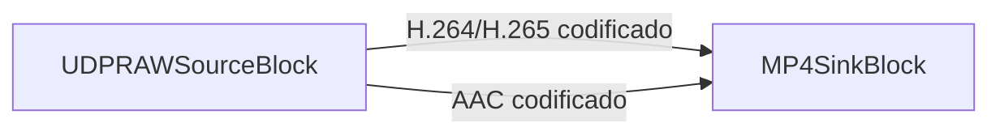

# Cómo grabar un flujo UDP MPEG-TS en archivo sin recodificar

[Media Blocks SDK .Net](https://www.visioforge.com/media-blocks-sdk-net){ .md-button .md-button--primary target="_blank" }

!!!info Ejemplo de demostración
Para un ejemplo completo y ejecutable, consulta la [demo UDP RAW Capture](https://github.com/visioforge/.Net-SDK-s-samples/tree/master/Media%20Blocks%20SDK/WPF/CSharp/UDP%20RAW%20Capture%20Demo).

Para los fundamentos del streaming UDP (lado emisor, contenedor, multicast), consulta la [guía de streaming UDP](../../general/network-streaming/udp.md).
!!!

## Tabla de contenidos

- [Resumen](#resumen)
- [Características principales](#caracteristicas-principales)
- [Concepto central](#concepto-central)
- [Requisitos previos](#requisitos-previos)
- [Ejemplo de código: clase UDPRemuxRecorder](#ejemplo-de-codigo-clase-udpremuxrecorder)
- [Explicación del código](#explicacion-del-codigo)
- [Cómo usar UDPRemuxRecorder](#como-usar-udpremuxrecorder)
- [Grabar en MPEG-TS en lugar de MP4](#grabar-en-mpeg-ts-en-lugar-de-mp4)
- [Dividir la grabación en archivos](#dividir-la-grabacion-en-archivos)
- [Añadir una vista previa en vivo](#anadir-una-vista-previa-en-vivo)
- [Consideraciones clave](#consideraciones-clave)
- [Solución de problemas](#solucion-de-problemas)
- [Preguntas frecuentes](#preguntas-frecuentes)
- [Véase también](#vease-tambien)

## Resumen

Esta guía muestra cómo recibir un flujo UDP MPEG-TS y escribirlo en un archivo **sin recodificar** el vídeo ni el audio. Muchos codificadores, equipos de hardware y feeds de contribución de difusión envían vídeo H.264 o H.265 junto con audio AAC por UDP dentro de un flujo de transporte MPEG. Cuando solo necesitas grabar ese feed, decodificarlo y recodificarlo desperdicia CPU y degrada la calidad. El **remultiplexado** —también llamado copia de flujo o captura passthrough— traslada los paquetes ya comprimidos a un nuevo contenedor, de modo que la grabación es idéntica bit a bit a lo que llegó por la red.

VisioForge Media Blocks SDK convierte esto en un pipeline corto: un `UDPRAWSourceBlock` escucha en un puerto UDP, demultiplexa el flujo de transporte y expone los flujos elementales codificados en sus pads de salida. Conectas esos pads directamente a un sink MP4 o MPEG-TS y el SDK multiplexa los datos al disco. Sin decodificador, sin codificador, con un uso mínimo de CPU.

Esta es la contraparte UDP de la guía [Guardar un flujo RTSP sin recodificar](rtsp-save-original-stream.md); el concepto de grabación es el mismo, solo cambia la fuente de red.

## Características principales

- **Cero recodificación**: el vídeo y el audio se copian directamente al contenedor, preservando la calidad original.
- **Bajo uso de CPU**: sin etapas de decodificación/codificación, ideal para dispositivos embebidos y muchas grabaciones simultáneas.
- **Vídeo H.264 y H.265** más passthrough de **audio AAC** a MP4 o MPEG-TS.
- **Entrada UDP unicast y multicast** mediante una URI sencilla `udp://host:port`.
- **División en archivos** para captura continua y prolongada con segmentos de tamaño acotado.
- **Vista previa en vivo opcional** junto a la grabación.

## Concepto central

Un feed UDP MPEG-TS transporta uno o más flujos elementales (vídeo codificado, audio codificado) empaquetados en el flujo de transporte. Para grabarlo sin recodificar, el pipeline solo necesita:

1. Recibir los paquetes UDP y analizar el contenedor MPEG-TS.
2. Seleccionar los flujos elementales de vídeo y audio codificados.
3. Marcar cada búfer con una marca de tiempo de presentación (PTS) válida — los multiplexores estrictos como `mp4mux` rechazan los búferes que no la tienen.
4. Multiplexar los flujos codificados en el contenedor de destino.

`UDPRAWSourceBlock` realiza los pasos 1–3 por ti. En modo `Auto`/`MPEGTS` pasa el flujo de transporte por una cadena de analizadores (`h264parse`/`h265parse` para vídeo, `aacparse` para audio) que infiere e interpola las marcas de tiempo, de modo que los búferes que salen de la fuente ya están listos para multiplexar. Solo conectas la fuente a un sink:



## Requisitos previos

Añade el Media Blocks SDK a tu proyecto mediante NuGet:

```xml
<PackageReference Include="VisioForge.DotNet.MediaBlocks" Version="2026.5.30" />
```

En Windows también necesitas los paquetes de runtime nativo. Para grabar (multiplexar) necesitas el runtime principal; el paquete Libav aporta los multiplexores:

```xml
<PackageReference Include="VisioForge.CrossPlatform.Core.Windows.x64" Version="2026.4.29" />
<PackageReference Include="VisioForge.CrossPlatform.Libav.Windows.x64.UPX" Version="2026.4.29" />
```

Para los paquetes de runtime de macOS, Linux, Android e iOS y las notas específicas de cada plataforma, consulta la [Guía de despliegue](../../deployment-x/index.md).

## Ejemplo de código: clase UDPRemuxRecorder

La clase `UDPRemuxRecorder` siguiente encapsula todo el pipeline. Recibe un flujo UDP MPEG-TS y lo remultiplexa a un archivo MP4, con passthrough de audio opcional.

```csharp
using System;
using System.Threading.Tasks;
using VisioForge.Core;
using VisioForge.Core.MediaBlocks;
using VisioForge.Core.MediaBlocks.Sinks;
using VisioForge.Core.MediaBlocks.Sources;
using VisioForge.Core.Types.Events;
using VisioForge.Core.Types.X.Sinks;
using VisioForge.Core.Types.X.Sources;

namespace UDPCaptureSample
{
    /// <summary>
    /// Records a UDP MPEG-TS stream (H.264/HEVC + AAC) to an MP4 file without re-encoding.
    /// The encoded elementary streams are remuxed straight into the container.
    /// </summary>
    public class UDPRemuxRecorder : IAsyncDisposable
    {
        private MediaBlocksPipeline _pipeline;
        private UDPRAWSourceBlock _source;
        private MP4SinkBlock _sink;

        /// <summary>
        /// Raised when the underlying pipeline reports an error.
        /// </summary>
        public event EventHandler<ErrorsEventArgs> OnError;

        /// <summary>
        /// Builds the recording pipeline.
        /// </summary>
        /// <param name="udpUrl">UDP source URL, e.g. "udp://0.0.0.0:1234" or "udp://239.1.1.1:1234".</param>
        /// <param name="outputFile">Destination MP4 file path.</param>
        /// <param name="recordAudio">Capture the AAC audio track in addition to video.</param>
        public async Task BuildAsync(string udpUrl, string outputFile, bool recordAudio = true)
        {
            // Initialize the SDK once. InitSDKAsync() is idempotent, so a second
            // recorder calling it again is a safe no-op. In a larger app you can
            // instead call it a single time at startup.
            await VisioForgeX.InitSDKAsync();

            _pipeline = new MediaBlocksPipeline();
            _pipeline.OnError += (sender, e) => OnError?.Invoke(this, e);

            // 1. UDP MPEG-TS source. Auto mode detects the container and exposes the
            //    encoded elementary streams (no decoding). AudioEnabled adds the AAC pad.
            var settings = new UDPRAWSourceSettings(new Uri(udpUrl))
            {
                Mode = UDPRAWSourceMode.Auto,
                AudioEnabled = recordAudio
            };

            _source = new UDPRAWSourceBlock(settings);

            // 2. MP4 sink. Each track gets its own dynamic input pad.
            _sink = new MP4SinkBlock(new MP4SinkSettings(outputFile));

            // 3. Connect the encoded video stream directly to the muxer (passthrough).
            var videoInput = (_sink as IMediaBlockDynamicInputs).CreateNewInput(MediaBlockPadMediaType.Video);
            _pipeline.Connect(_source.VideoOutput, videoInput);

            // 4. Connect the encoded audio stream, if present. AudioOutput is non-null
            //    only when AudioEnabled is true and the stream actually carries audio.
            if (recordAudio && _source.AudioOutput != null)
            {
                var audioInput = (_sink as IMediaBlockDynamicInputs).CreateNewInput(MediaBlockPadMediaType.Audio);
                _pipeline.Connect(_source.AudioOutput, audioInput);
            }
        }

        /// <summary>
        /// Starts recording. Returns false if the pipeline failed to start.
        /// </summary>
        public Task<bool> StartAsync() => _pipeline?.StartAsync() ?? Task.FromResult(false);

        /// <summary>
        /// Stops recording and finalizes the output file.
        /// </summary>
        public async Task StopAsync()
        {
            if (_pipeline != null)
            {
                await _pipeline.StopAsync();
            }
        }

        /// <inheritdoc/>
        public async ValueTask DisposeAsync()
        {
            if (_pipeline != null)
            {
                await _pipeline.DisposeAsync();
                _pipeline = null;
            }

            _sink = null;
            _source = null;
        }
    }
}
```

## Explicación del código

- **`VisioForgeX.InitSDKAsync()`** inicializa el SDK una vez por proceso. Llama a `VisioForgeX.DestroySDK()` cuando tu aplicación se cierre.
- **`UDPRAWSourceSettings`** recibe la URL de escucha. `Mode = UDPRAWSourceMode.Auto` permite que la fuente detecte el contenedor MPEG-TS y exponga los flujos codificados; `UDPRAWSourceMode.MPEGTS` fuerza el mismo comportamiento de forma explícita. Establecer `AudioEnabled = true` indica a la fuente que exponga el flujo elemental de audio en `AudioOutput`.
- **`_source.VideoOutput`** siempre transporta el vídeo codificado (H.264 o H.265) — no se produce decodificación. **`_source.AudioOutput`** solo es no nulo cuando `AudioEnabled` es `true` y el modo es `Auto`/`MPEGTS`; transporta el audio AAC codificado.
- **`MP4SinkBlock` implementa `IMediaBlockDynamicInputs`**, por lo que llamas a `CreateNewInput(MediaBlockPadMediaType.Video)` / `CreateNewInput(MediaBlockPadMediaType.Audio)` para añadir un pad de entrada por pista y luego conectas el pad de origen correspondiente.
- **Marcas de tiempo**: en modo `Auto`/`MPEGTS` la fuente inserta `h264parse`/`h265parse`/`aacparse` con inferencia e interpolación de marcas de tiempo, de modo que cada búfer que llega al multiplexor MP4 tiene un PTS válido. Por eso el archivo remultiplexado tiene una temporización correcta sin ningún paso de decodificación.
- **`StartAsync()`** devuelve `Task<bool>` — comprueba el resultado y libera los recursos si es `false`.

## Cómo usar UDPRemuxRecorder

```csharp
await using var recorder = new UDPRemuxRecorder();
recorder.OnError += (s, e) => Console.WriteLine($"Pipeline error: {e.Message}");

await recorder.BuildAsync("udp://0.0.0.0:1234", "output.mp4", recordAudio: true);

if (await recorder.StartAsync())
{
    Console.WriteLine("Recording... press any key to stop.");
    Console.ReadKey(true);
    await recorder.StopAsync();
    Console.WriteLine("Saved output.mp4");
}
else
{
    Console.WriteLine("Failed to start. Check the UDP URL and port.");
}

VisioForgeX.DestroySDK();
```

La URL es el **punto de escucha local**, no la dirección del emisor:

- `udp://0.0.0.0:1234` — escucha en todas las interfaces, puerto 1234 (unicast).
- `udp://239.1.1.1:1234` — se une al grupo multicast `239.1.1.1` en el puerto 1234 (la fuente se une al grupo automáticamente).
- `udp://192.168.1.10:1234` — se vincula a una interfaz local concreta.

## Grabar en MPEG-TS en lugar de MP4

Para mantener la grabación en un contenedor MPEG-TS (`.ts`) —que tolera una gama más amplia de códecs y es robusto frente a truncamientos— cambia el sink por un `MPEGTSSinkBlock`. La fuente y la lógica de conexión son idénticas:

```csharp
using VisioForge.Core.MediaBlocks.Sinks;
using VisioForge.Core.Types.X.Sinks;

var sink = new MPEGTSSinkBlock(new MPEGTSSinkSettings("output.ts"));

var videoInput = (sink as IMediaBlockDynamicInputs).CreateNewInput(MediaBlockPadMediaType.Video);
pipeline.Connect(source.VideoOutput, videoInput);

if (source.AudioOutput != null)
{
    var audioInput = (sink as IMediaBlockDynamicInputs).CreateNewInput(MediaBlockPadMediaType.Audio);
    pipeline.Connect(source.AudioOutput, audioInput);
}
```

## Dividir la grabación en archivos

Para una captura continua y de larga duración, divide la salida en segmentos con `MP4SplitSinkSettings`. El multiplexor inicia un archivo nuevo en un fotograma clave tras la duración configurada, por lo que cada segmento se reproduce de forma independiente:

```csharp
var splitSettings = new MP4SplitSinkSettings("capture_%05d.mp4")
{
    SplitDuration = TimeSpan.FromMinutes(5),  // new file every 5 minutes
    SplitMaxFiles = 12                        // keep the latest 12 files (0 = unlimited)
};

var sink = new MP4SinkBlock(splitSettings);
```

El marcador `%05d` del patrón de ubicación se sustituye por el índice de segmento con ceros a la izquierda.

## Añadir una vista previa en vivo

Puedes grabar y previsualizar simultáneamente ramificando (tee) el vídeo codificado, enviando una rama al grabador y decodificando la otra para mostrarla. Esto refleja la [demo UDP RAW Capture](https://github.com/visioforge/.Net-SDK-s-samples/tree/master/Media%20Blocks%20SDK/WPF/CSharp/UDP%20RAW%20Capture%20Demo):

```csharp
using VisioForge.Core.MediaBlocks.Special;
using VisioForge.Core.MediaBlocks.VideoRendering;

var tee = new TeeBlock(2, MediaBlockPadMediaType.Video);

var recorder = new MP4SinkBlock(new MP4SinkSettings("output.mp4"));
var recVideoInput = (recorder as IMediaBlockDynamicInputs).CreateNewInput(MediaBlockPadMediaType.Video);

// Preview branch: decode for display only.
var decoder = new DecodeBinBlock(renderVideo: true, renderAudio: false, renderSubtitle: false);
var renderer = new VideoRendererBlock(pipeline, VideoView1); // VideoView1 is your UI control

pipeline.Connect(source.VideoOutput, tee.Input);
pipeline.Connect(tee.Outputs[0], recVideoInput);             // recording branch (no decode)
pipeline.Connect(tee.Outputs[1], decoder.Input);             // preview branch
pipeline.Connect(decoder.VideoOutput, renderer.Input);
```

La rama de grabación sigue siendo un passthrough puro; solo la rama de vista previa decodifica.

## Consideraciones clave

- **Compatibilidad de contenedor/códec**: MP4 almacena bien H.264, H.265 y AAC — justo lo que transporta un feed de difusión UDP MPEG-TS típico. MPEG-TS (`.ts`) es más permisivo y más resistente ante una grabación que termina de forma abrupta (corte de corriente), porque no tiene un índice final que escribir.
- **El audio es opcional**: si dejas `AudioEnabled = false`, `AudioOutput` permanece `null` y la grabación es solo de vídeo. Comprueba siempre `if (source.AudioOutput != null)` antes de conectar el audio.
- **Multicast frente a unicast**: una dirección de grupo multicast en la URL (`224.0.0.0`–`239.255.255.255`) se une automáticamente; un enlace unicast (`0.0.0.0` o una IP local concreta) solo escucha. Asegúrate de que tu firewall permita el tráfico UDP entrante en el puerto elegido.
- **Pérdida de paquetes**: UDP no retransmite. En una red con pérdidas puedes ver breves artefactos en la grabación; el multiplexor sigue funcionando y el archivo permanece válido.
- **Liberación de recursos**: libera el grabador (y por tanto el pipeline) cuando termines, y llama a `VisioForgeX.DestroySDK()` una vez al cerrar la aplicación.

## Solución de problemas

- **Archivo vacío o de duración cero** — normalmente significa que no llegaron datos. Confirma que el emisor apunta al mismo puerto, revisa el firewall y verifica que la URL sea el punto de escucha local (`0.0.0.0:puerto`), no la dirección del emisor.
- **Errores `Could not multiplex` / del multiplexor** — indican búferes sin PTS. Usa `Mode = Auto` o `Mode = MPEGTS` para que la fuente inserte los analizadores que infieren las marcas de tiempo; no los omitas para un feed con contenedor.
- **Grabación sin sonido** — `AudioEnabled` se dejó en `false`, o el flujo no transporta audio, por lo que `AudioOutput` era `null` y no se conectó ningún pad de audio.
- **No se recibe el flujo multicast** — puede que la red no enrute el grupo a tu host. Confirma la dirección multicast y que el switch/router la reenvíe; prueba primero con un enlace unicast.
- **Códec erróneo asumido en modo RTP/Raw** — los modos `Auto`/`MPEGTS` detectan el códec a partir del contenedor. Solo los modos `RTP` y `Raw` requieren que establezcas `VideoCodec` explícitamente.

## Preguntas frecuentes

### ¿Puedo grabar un flujo UDP MPEG-TS sin recodificar en C#?

Sí. `UDPRAWSourceBlock` expone el vídeo H.264/H.265 y el audio AAC ya codificados en sus pads de salida. Conéctalos directamente a un `MP4SinkBlock` o `MPEGTSSinkBlock` y los flujos se remultiplexan al disco sin ningún paso de decodificación o codificación.

### ¿Cuál es la diferencia entre remultiplexar y transcodificar?

Remultiplexar (copia de flujo/passthrough) copia los paquetes comprimidos a un nuevo contenedor sin cambios — rápido, sin pérdidas, bajo uso de CPU. Transcodificar decodifica el flujo y lo recodifica, lo que permite cambiar el códec, la resolución o el bitrate, pero consume CPU y reduce la calidad. Para simplemente guardar un feed UDP, remultiplexar es la opción correcta.

### ¿Cómo grabo un flujo UDP multicast?

Usa una dirección de grupo multicast en la URL, p. ej. `udp://239.1.1.1:1234`. La fuente se une al grupo automáticamente. Asegúrate de que tu red reenvíe el grupo multicast al host de grabación y de que el firewall permita el tráfico UDP entrante en el puerto.

### ¿En qué contenedor debo grabar: MP4 o MPEG-TS?

Usa MP4 cuando quieras un único archivo ampliamente compatible para H.264/H.265 + AAC. Usa MPEG-TS (`.ts`) cuando necesites la máxima flexibilidad de códecs o resistencia ante una parada abrupta, ya que TS no tiene un índice final que deba finalizarse.

### ¿Remultiplexar a MP4 conserva la calidad de vídeo original?

Sí. Los paquetes de vídeo y audio codificados se copian bit a bit al contenedor MP4, por lo que la grabación es idéntica en calidad al flujo entrante. La calidad solo cambia si decides transcodificar en su lugar.

## Véase también

- [Guardar un flujo RTSP sin recodificar](rtsp-save-original-stream.md) — el mismo concepto de grabación passthrough para cámaras IP RTSP
- [Streaming UDP con los SDK de VisioForge](../../general/network-streaming/udp.md) — el protocolo UDP, el contenedor MPEG-TS y el lado emisor
- [Capturar vídeo a MPEG-TS](../../general/guides/video-capture-to-mpegts.md) — produce salida MPEG-TS desde un pipeline de captura
- [Bloques de origen de Media Blocks](../Sources/index.md) — todas las fuentes disponibles, incluidas las entradas de red y de dispositivo
- [Primeros pasos con Media Blocks](../GettingStarted/index.md) — fundamentos del pipeline y el modelo de bloques
