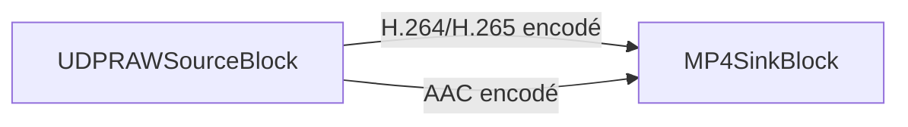

# Comment enregistrer un flux UDP MPEG-TS dans un fichier sans réencodage

[Media Blocks SDK .Net](https://www.visioforge.com/media-blocks-sdk-net){ .md-button .md-button--primary target="_blank" }

!!!info Exemple de démonstration
Pour un exemple complet et exécutable, consultez la [démo UDP RAW Capture](https://github.com/visioforge/.Net-SDK-s-samples/tree/master/Media%20Blocks%20SDK/WPF/CSharp/UDP%20RAW%20Capture%20Demo).

Pour les fondamentaux du streaming UDP (côté émetteur, conteneur, multicast), consultez le [guide du streaming UDP](../../general/network-streaming/udp.md).
!!!

## Table des matières

- [Aperçu](#apercu)
- [Fonctionnalités principales](#fonctionnalites-principales)
- [Concept central](#concept-central)
- [Prérequis](#prerequis)
- [Exemple de code : classe UDPRemuxRecorder](#exemple-de-code-classe-udpremuxrecorder)
- [Explication du code](#explication-du-code)
- [Comment utiliser UDPRemuxRecorder](#comment-utiliser-udpremuxrecorder)
- [Enregistrer en MPEG-TS au lieu de MP4](#enregistrer-en-mpeg-ts-au-lieu-de-mp4)
- [Diviser l'enregistrement en fichiers](#diviser-lenregistrement-en-fichiers)
- [Ajouter un aperçu en direct](#ajouter-un-apercu-en-direct)
- [Points clés](#points-cles)
- [Dépannage](#depannage)
- [Foire aux questions](#foire-aux-questions)
- [Voir aussi](#voir-aussi)

## Aperçu

Ce guide montre comment recevoir un flux UDP MPEG-TS et l'écrire dans un fichier **sans réencoder** la vidéo ni l'audio. De nombreux encodeurs, équipements matériels et flux de contribution de diffusion envoient de la vidéo H.264 ou H.265 accompagnée d'audio AAC via UDP au sein d'un flux de transport MPEG. Lorsque vous avez seulement besoin d'enregistrer ce flux, le décoder puis le réencoder gaspille du CPU et dégrade la qualité. Le **remultiplexage** — aussi appelé copie de flux ou capture passthrough — déplace les paquets déjà compressés vers un nouveau conteneur, de sorte que l'enregistrement est identique bit à bit à ce qui est arrivé sur le réseau.

VisioForge Media Blocks SDK réduit cela à un pipeline court : un `UDPRAWSourceBlock` écoute sur un port UDP, démultiplexe le flux de transport et expose les flux élémentaires encodés sur ses pads de sortie. Vous connectez ces pads directement à un sink MP4 ou MPEG-TS, et le SDK multiplexe les données sur le disque. Aucun décodeur, aucun encodeur, une utilisation minimale du CPU.

C'est la contrepartie UDP du guide [Enregistrer un flux RTSP sans réencodage](rtsp-save-original-stream.md) ; le concept d'enregistrement est le même, seule la source réseau change.

## Fonctionnalités principales

- **Zéro réencodage** : la vidéo et l'audio sont copiés directement dans le conteneur, en préservant la qualité d'origine.
- **Faible utilisation du CPU** : aucune étape de décodage/encodage, adapté aux appareils embarqués et à de nombreux enregistreurs simultanés.
- **Vidéo H.264 et H.265** plus passthrough de l'**audio AAC** vers MP4 ou MPEG-TS.
- **Entrée UDP unicast et multicast** via une simple URI `udp://host:port`.
- **Division en fichiers** pour une capture continue et de longue durée avec des segments de taille bornée.
- **Aperçu en direct facultatif** parallèlement à l'enregistrement.

## Concept central

Un flux UDP MPEG-TS transporte un ou plusieurs flux élémentaires (vidéo encodée, audio encodé) empaquetés dans le flux de transport. Pour l'enregistrer sans réencodage, le pipeline doit seulement :

1. Recevoir les paquets UDP et analyser le conteneur MPEG-TS.
2. Sélectionner les flux élémentaires vidéo et audio encodés.
3. Horodater chaque tampon avec une marque de présentation (PTS) valide — les multiplexeurs stricts comme `mp4mux` rejettent les tampons qui n'en ont pas.
4. Multiplexer les flux encodés dans le conteneur cible.

`UDPRAWSourceBlock` effectue les étapes 1 à 3 pour vous. En mode `Auto`/`MPEGTS`, il fait passer le flux de transport par une chaîne d'analyseurs (`h264parse`/`h265parse` pour la vidéo, `aacparse` pour l'audio) qui infère et interpole les marques temporelles, de sorte que les tampons sortant de la source sont déjà prêts à être multiplexés. Vous connectez simplement la source à un sink :



## Prérequis

Ajoutez le Media Blocks SDK à votre projet via NuGet :

```xml
<PackageReference Include="VisioForge.DotNet.MediaBlocks" Version="2026.5.30" />
```

Sous Windows, vous avez également besoin des paquets de runtime natif. Pour enregistrer (multiplexer), vous avez besoin du runtime principal ; le paquet Libav fournit les multiplexeurs :

```xml
<PackageReference Include="VisioForge.CrossPlatform.Core.Windows.x64" Version="2026.4.29" />
<PackageReference Include="VisioForge.CrossPlatform.Libav.Windows.x64.UPX" Version="2026.4.29" />
```

Pour les paquets de runtime macOS, Linux, Android et iOS et les notes propres à chaque plateforme, consultez le [Guide de déploiement](../../deployment-x/index.md).

## Exemple de code : classe UDPRemuxRecorder

La classe `UDPRemuxRecorder` ci-dessous encapsule l'ensemble du pipeline. Elle reçoit un flux UDP MPEG-TS et le remultiplexe vers un fichier MP4, avec passthrough audio facultatif.

```csharp
using System;
using System.Threading.Tasks;
using VisioForge.Core;
using VisioForge.Core.MediaBlocks;
using VisioForge.Core.MediaBlocks.Sinks;
using VisioForge.Core.MediaBlocks.Sources;
using VisioForge.Core.Types.Events;
using VisioForge.Core.Types.X.Sinks;
using VisioForge.Core.Types.X.Sources;

namespace UDPCaptureSample
{
    /// <summary>
    /// Records a UDP MPEG-TS stream (H.264/HEVC + AAC) to an MP4 file without re-encoding.
    /// The encoded elementary streams are remuxed straight into the container.
    /// </summary>
    public class UDPRemuxRecorder : IAsyncDisposable
    {
        private MediaBlocksPipeline _pipeline;
        private UDPRAWSourceBlock _source;
        private MP4SinkBlock _sink;

        /// <summary>
        /// Raised when the underlying pipeline reports an error.
        /// </summary>
        public event EventHandler<ErrorsEventArgs> OnError;

        /// <summary>
        /// Builds the recording pipeline.
        /// </summary>
        /// <param name="udpUrl">UDP source URL, e.g. "udp://0.0.0.0:1234" or "udp://239.1.1.1:1234".</param>
        /// <param name="outputFile">Destination MP4 file path.</param>
        /// <param name="recordAudio">Capture the AAC audio track in addition to video.</param>
        public async Task BuildAsync(string udpUrl, string outputFile, bool recordAudio = true)
        {
            // Initialize the SDK once. InitSDKAsync() is idempotent, so a second
            // recorder calling it again is a safe no-op. In a larger app you can
            // instead call it a single time at startup.
            await VisioForgeX.InitSDKAsync();

            _pipeline = new MediaBlocksPipeline();
            _pipeline.OnError += (sender, e) => OnError?.Invoke(this, e);

            // 1. UDP MPEG-TS source. Auto mode detects the container and exposes the
            //    encoded elementary streams (no decoding). AudioEnabled adds the AAC pad.
            var settings = new UDPRAWSourceSettings(new Uri(udpUrl))
            {
                Mode = UDPRAWSourceMode.Auto,
                AudioEnabled = recordAudio
            };

            _source = new UDPRAWSourceBlock(settings);

            // 2. MP4 sink. Each track gets its own dynamic input pad.
            _sink = new MP4SinkBlock(new MP4SinkSettings(outputFile));

            // 3. Connect the encoded video stream directly to the muxer (passthrough).
            var videoInput = (_sink as IMediaBlockDynamicInputs).CreateNewInput(MediaBlockPadMediaType.Video);
            _pipeline.Connect(_source.VideoOutput, videoInput);

            // 4. Connect the encoded audio stream, if present. AudioOutput is non-null
            //    only when AudioEnabled is true and the stream actually carries audio.
            if (recordAudio && _source.AudioOutput != null)
            {
                var audioInput = (_sink as IMediaBlockDynamicInputs).CreateNewInput(MediaBlockPadMediaType.Audio);
                _pipeline.Connect(_source.AudioOutput, audioInput);
            }
        }

        /// <summary>
        /// Starts recording. Returns false if the pipeline failed to start.
        /// </summary>
        public Task<bool> StartAsync() => _pipeline?.StartAsync() ?? Task.FromResult(false);

        /// <summary>
        /// Stops recording and finalizes the output file.
        /// </summary>
        public async Task StopAsync()
        {
            if (_pipeline != null)
            {
                await _pipeline.StopAsync();
            }
        }

        /// <inheritdoc/>
        public async ValueTask DisposeAsync()
        {
            if (_pipeline != null)
            {
                await _pipeline.DisposeAsync();
                _pipeline = null;
            }

            _sink = null;
            _source = null;
        }
    }
}
```

## Explication du code

- **`VisioForgeX.InitSDKAsync()`** initialise le SDK une fois par processus. Appelez `VisioForgeX.DestroySDK()` à la fermeture de votre application.
- **`UDPRAWSourceSettings`** reçoit l'URL d'écoute. `Mode = UDPRAWSourceMode.Auto` permet à la source de détecter le conteneur MPEG-TS et d'exposer les flux encodés ; `UDPRAWSourceMode.MPEGTS` force le même comportement de manière explicite. Définir `AudioEnabled = true` indique à la source d'exposer le flux élémentaire audio sur `AudioOutput`.
- **`_source.VideoOutput`** transporte toujours la vidéo encodée (H.264 ou H.265) — aucun décodage n'a lieu. **`_source.AudioOutput`** n'est non nul que lorsque `AudioEnabled` vaut `true` et que le mode est `Auto`/`MPEGTS` ; il transporte l'audio AAC encodé.
- **`MP4SinkBlock` implémente `IMediaBlockDynamicInputs`**, vous appelez donc `CreateNewInput(MediaBlockPadMediaType.Video)` / `CreateNewInput(MediaBlockPadMediaType.Audio)` pour ajouter un pad d'entrée par piste, puis vous connectez le pad source correspondant.
- **Marques temporelles** : en mode `Auto`/`MPEGTS`, la source insère `h264parse`/`h265parse`/`aacparse` avec inférence et interpolation des marques temporelles, de sorte que chaque tampon atteignant le multiplexeur MP4 possède un PTS valide. C'est pourquoi le fichier remultiplexé a une synchronisation correcte sans aucune étape de décodage.
- **`StartAsync()`** renvoie `Task<bool>` — vérifiez le résultat et libérez les ressources si c'est `false`.

## Comment utiliser UDPRemuxRecorder

```csharp
await using var recorder = new UDPRemuxRecorder();
recorder.OnError += (s, e) => Console.WriteLine($"Pipeline error: {e.Message}");

await recorder.BuildAsync("udp://0.0.0.0:1234", "output.mp4", recordAudio: true);

if (await recorder.StartAsync())
{
    Console.WriteLine("Recording... press any key to stop.");
    Console.ReadKey(true);
    await recorder.StopAsync();
    Console.WriteLine("Saved output.mp4");
}
else
{
    Console.WriteLine("Failed to start. Check the UDP URL and port.");
}

VisioForgeX.DestroySDK();
```

L'URL est le **point d'écoute local**, et non l'adresse de l'émetteur :

- `udp://0.0.0.0:1234` — écoute sur toutes les interfaces, port 1234 (unicast).
- `udp://239.1.1.1:1234` — rejoint le groupe multicast `239.1.1.1` sur le port 1234 (la source rejoint le groupe automatiquement).
- `udp://192.168.1.10:1234` — se lie à une interface locale précise.

## Enregistrer en MPEG-TS au lieu de MP4

Pour conserver l'enregistrement dans un conteneur MPEG-TS (`.ts`) — qui tolère une plus large gamme de codecs et résiste à la troncature — remplacez le sink par un `MPEGTSSinkBlock`. La source et la logique de connexion sont identiques :

```csharp
using VisioForge.Core.MediaBlocks.Sinks;
using VisioForge.Core.Types.X.Sinks;

var sink = new MPEGTSSinkBlock(new MPEGTSSinkSettings("output.ts"));

var videoInput = (sink as IMediaBlockDynamicInputs).CreateNewInput(MediaBlockPadMediaType.Video);
pipeline.Connect(source.VideoOutput, videoInput);

if (source.AudioOutput != null)
{
    var audioInput = (sink as IMediaBlockDynamicInputs).CreateNewInput(MediaBlockPadMediaType.Audio);
    pipeline.Connect(source.AudioOutput, audioInput);
}
```

## Diviser l'enregistrement en fichiers

Pour une capture continue et de longue durée, divisez la sortie en segments avec `MP4SplitSinkSettings`. Le multiplexeur démarre un nouveau fichier sur une image clé après la durée configurée, de sorte que chaque segment est lisible indépendamment :

```csharp
var splitSettings = new MP4SplitSinkSettings("capture_%05d.mp4")
{
    SplitDuration = TimeSpan.FromMinutes(5),  // new file every 5 minutes
    SplitMaxFiles = 12                        // keep the latest 12 files (0 = unlimited)
};

var sink = new MP4SinkBlock(splitSettings);
```

Le marqueur `%05d` du motif d'emplacement est remplacé par l'indice de segment complété par des zéros.

## Ajouter un aperçu en direct

Vous pouvez enregistrer et prévisualiser simultanément en dérivant (tee) la vidéo encodée, en envoyant une branche vers l'enregistreur et en décodant l'autre pour l'affichage. Cela reflète la [démo UDP RAW Capture](https://github.com/visioforge/.Net-SDK-s-samples/tree/master/Media%20Blocks%20SDK/WPF/CSharp/UDP%20RAW%20Capture%20Demo) :

```csharp
using VisioForge.Core.MediaBlocks.Special;
using VisioForge.Core.MediaBlocks.VideoRendering;

var tee = new TeeBlock(2, MediaBlockPadMediaType.Video);

var recorder = new MP4SinkBlock(new MP4SinkSettings("output.mp4"));
var recVideoInput = (recorder as IMediaBlockDynamicInputs).CreateNewInput(MediaBlockPadMediaType.Video);

// Preview branch: decode for display only.
var decoder = new DecodeBinBlock(renderVideo: true, renderAudio: false, renderSubtitle: false);
var renderer = new VideoRendererBlock(pipeline, VideoView1); // VideoView1 is your UI control

pipeline.Connect(source.VideoOutput, tee.Input);
pipeline.Connect(tee.Outputs[0], recVideoInput);             // recording branch (no decode)
pipeline.Connect(tee.Outputs[1], decoder.Input);             // preview branch
pipeline.Connect(decoder.VideoOutput, renderer.Input);
```

La branche d'enregistrement reste un passthrough pur ; seule la branche d'aperçu décode.

## Points clés

- **Compatibilité conteneur/codec** : MP4 stocke bien H.264, H.265 et AAC — exactement ce que transporte un flux de diffusion UDP MPEG-TS typique. MPEG-TS (`.ts`) est plus permissif et plus résistant lorsqu'un enregistrement se termine brutalement (coupure de courant), car il n'a pas d'index final à écrire.
- **L'audio est facultatif** : si vous laissez `AudioEnabled = false`, `AudioOutput` reste `null` et l'enregistrement est uniquement vidéo. Vérifiez toujours `if (source.AudioOutput != null)` avant de connecter l'audio.
- **Multicast contre unicast** : une adresse de groupe multicast dans l'URL (`224.0.0.0`–`239.255.255.255`) est rejointe automatiquement ; une liaison unicast (`0.0.0.0` ou une IP locale précise) se contente d'écouter. Assurez-vous que votre pare-feu autorise le trafic UDP entrant sur le port choisi.
- **Perte de paquets** : UDP ne retransmet pas. Sur un réseau avec pertes, vous pouvez voir de brefs artefacts dans l'enregistrement ; le multiplexeur continue de fonctionner et le fichier reste valide.
- **Libération des ressources** : libérez l'enregistreur (et donc le pipeline) une fois terminé, et appelez `VisioForgeX.DestroySDK()` une seule fois à la fermeture de l'application.

## Dépannage

- **Fichier vide ou de durée nulle** — signifie généralement qu'aucune donnée n'est arrivée. Vérifiez que l'émetteur cible le même port, contrôlez le pare-feu et assurez-vous que l'URL est bien le point d'écoute local (`0.0.0.0:port`), et non l'adresse de l'émetteur.
- **Erreurs `Could not multiplex` / du multiplexeur** — indiquent des tampons sans PTS. Utilisez `Mode = Auto` ou `Mode = MPEGTS` pour que la source insère les analyseurs qui infèrent les marques temporelles ; ne les contournez pas pour un flux avec conteneur.
- **Enregistrement muet** — `AudioEnabled` a été laissé à `false`, ou le flux ne transporte pas d'audio, de sorte que `AudioOutput` valait `null` et aucun pad audio n'a été connecté.
- **Flux multicast non reçu** — le réseau n'achemine peut-être pas le groupe vers votre hôte. Vérifiez l'adresse multicast et le fait que le commutateur/routeur la relaie ; testez d'abord avec une liaison unicast.
- **Codec erroné supposé en mode RTP/Raw** — les modes `Auto`/`MPEGTS` détectent le codec à partir du conteneur. Seuls les modes `RTP` et `Raw` exigent que vous définissiez `VideoCodec` explicitement.

## Foire aux questions

### Puis-je enregistrer un flux UDP MPEG-TS sans réencodage en C# ?

Oui. `UDPRAWSourceBlock` expose la vidéo H.264/H.265 et l'audio AAC déjà encodés sur ses pads de sortie. Connectez-les directement à un `MP4SinkBlock` ou un `MPEGTSSinkBlock` et les flux sont remultiplexés sur le disque sans aucune étape de décodage ni d'encodage.

### Quelle est la différence entre le remultiplexage et le transcodage ?

Le remultiplexage (copie de flux/passthrough) copie les paquets compressés vers un nouveau conteneur sans les modifier — rapide, sans perte, faible utilisation du CPU. Le transcodage décode le flux et le réencode, ce qui permet de changer le codec, la résolution ou le débit, mais consomme du CPU et réduit la qualité. Pour simplement enregistrer un flux UDP, le remultiplexage est le bon choix.

### Comment enregistrer un flux UDP multicast ?

Utilisez une adresse de groupe multicast dans l'URL, par exemple `udp://239.1.1.1:1234`. La source rejoint le groupe automatiquement. Assurez-vous que votre réseau relaie le groupe multicast vers l'hôte d'enregistrement et que le pare-feu autorise le trafic UDP entrant sur le port.

### Dans quel conteneur enregistrer : MP4 ou MPEG-TS ?

Utilisez MP4 lorsque vous voulez un fichier unique largement compatible pour H.264/H.265 + AAC. Utilisez MPEG-TS (`.ts`) lorsque vous avez besoin d'une flexibilité maximale de codecs ou d'une résistance à un arrêt brutal, car TS n'a pas d'index final à finaliser.

### Le remultiplexage vers MP4 conserve-t-il la qualité vidéo d'origine ?

Oui. Les paquets vidéo et audio encodés sont copiés bit à bit dans le conteneur MP4, de sorte que l'enregistrement est de qualité identique au flux entrant. La qualité ne change que si vous choisissez de transcoder à la place.

## Voir aussi

- [Enregistrer un flux RTSP sans réencodage](rtsp-save-original-stream.md) — le même concept d'enregistrement passthrough pour les caméras IP RTSP
- [Streaming UDP avec les SDK VisioForge](../../general/network-streaming/udp.md) — le protocole UDP, le conteneur MPEG-TS et le côté émetteur
- [Capturer la vidéo vers MPEG-TS](../../general/guides/video-capture-to-mpegts.md) — produire une sortie MPEG-TS depuis un pipeline de capture
- [Blocs source de Media Blocks](../Sources/index.md) — toutes les sources disponibles, y compris les entrées réseau et périphériques
- [Premiers pas avec Media Blocks](../GettingStarted/index.md) — fondamentaux du pipeline et modèle de blocs
