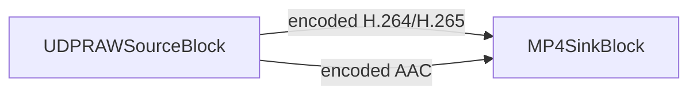

# How to Record a UDP MPEG-TS Stream to File Without Re-encoding

[Media Blocks SDK .Net](https://www.visioforge.com/media-blocks-sdk-net){ .md-button .md-button--primary target="_blank" }

!!!info Demo Sample
For a complete, runnable example see the [UDP RAW Capture Demo](https://github.com/visioforge/.Net-SDK-s-samples/tree/master/Media%20Blocks%20SDK/WPF/CSharp/UDP%20RAW%20Capture%20Demo).

For UDP streaming fundamentals (sending side, container, multicast), see the [UDP Streaming guide](../../general/network-streaming/udp.md).
!!!

## Table of Contents

- [Overview](#overview)
- [Core Features](#core-features)
- [Core Concept](#core-concept)
- [Prerequisites](#prerequisites)
- [Code Sample: UDPRemuxRecorder Class](#code-sample-udpremuxrecorder-class)
- [Explanation of the Code](#explanation-of-the-code)
- [How to Use the UDPRemuxRecorder](#how-to-use-the-udpremuxrecorder)
- [Recording to MPEG-TS Instead of MP4](#recording-to-mpeg-ts-instead-of-mp4)
- [Splitting the Recording into Files](#splitting-the-recording-into-files)
- [Adding a Live Preview](#adding-a-live-preview)
- [Key Considerations](#key-considerations)
- [Troubleshooting](#troubleshooting)
- [Frequently Asked Questions](#frequently-asked-questions)
- [See Also](#see-also)

## Overview

This guide shows how to receive a UDP MPEG-TS stream and write it to a file **without re-encoding** the video or audio. Many encoders, hardware appliances, and broadcast contribution feeds push H.264 or H.265 video together with AAC audio over UDP inside an MPEG transport stream. When you only need to record that feed, decoding and re-encoding it wastes CPU and degrades quality. **Remuxing** — also called stream copy or passthrough capture — moves the already-compressed packets straight into a new container, so the recording is bit-for-bit identical to what arrived on the wire.

The VisioForge Media Blocks SDK makes this a short pipeline: a `UDPRAWSourceBlock` listens on a UDP port, demultiplexes the transport stream, and exposes the encoded elementary streams on its output pads. You connect those pads directly to an MP4 or MPEG-TS sink, and the SDK muxes the data to disk. No decoder, no encoder, minimal CPU.

This is the UDP counterpart of the [Save RTSP Stream Without Re-encoding](rtsp-save-original-stream.md) guide; the recording concept is the same, only the network source differs.

## Core Features

- **Zero re-encoding**: video and audio are copied straight to the container, preserving the original quality.
- **Low CPU usage**: no decode/encode stages, suitable for embedded devices and many simultaneous recorders.
- **H.264 and H.265 video** plus **AAC audio** passthrough into MP4 or MPEG-TS.
- **Unicast and multicast** UDP input via a simple `udp://host:port` URI.
- **File splitting** for continuous, long-running capture with size-bounded segments.
- **Optional live preview** alongside the recording.

## Core Concept

A UDP MPEG-TS feed carries one or more elementary streams (encoded video, encoded audio) packetized into the transport stream. To record it without re-encoding, the pipeline only needs to:

1. Receive the UDP packets and parse the MPEG-TS container.
2. Pick out the encoded video and audio elementary streams.
3. Stamp each buffer with a valid presentation timestamp (PTS) — strict muxers such as `mp4mux` reject buffers without one.
4. Mux the encoded streams into the target container.

`UDPRAWSourceBlock` performs steps 1–3 for you. In `Auto`/`MPEGTS` mode it runs the transport stream through a parser chain (`h264parse`/`h265parse` for video, `aacparse` for audio) that infers and interpolates timestamps, so the buffers leaving the source are already mux-ready. You only wire the source to a sink:



## Prerequisites

Add the Media Blocks SDK to your project via NuGet:

```xml
<PackageReference Include="VisioForge.DotNet.MediaBlocks" Version="2026.5.30" />
```

On Windows you also need the native runtime packages. For recording (muxing) you need the core runtime; the Libav package supplies the muxers:

```xml
<PackageReference Include="VisioForge.CrossPlatform.Core.Windows.x64" Version="2026.4.29" />
<PackageReference Include="VisioForge.CrossPlatform.Libav.Windows.x64.UPX" Version="2026.4.29" />
```

For macOS, Linux, Android, and iOS runtime packages and platform-specific notes, see the [Deployment Guide](../../deployment-x/index.md).

## Code Sample: UDPRemuxRecorder Class

The `UDPRemuxRecorder` class below encapsulates the whole pipeline. It receives a UDP MPEG-TS stream and remuxes it to an MP4 file, with optional audio passthrough.

```csharp
using System;
using System.Threading.Tasks;
using VisioForge.Core;
using VisioForge.Core.MediaBlocks;
using VisioForge.Core.MediaBlocks.Sinks;
using VisioForge.Core.MediaBlocks.Sources;
using VisioForge.Core.Types.Events;
using VisioForge.Core.Types.X.Sinks;
using VisioForge.Core.Types.X.Sources;

namespace UDPCaptureSample
{
    /// <summary>
    /// Records a UDP MPEG-TS stream (H.264/HEVC + AAC) to an MP4 file without re-encoding.
    /// The encoded elementary streams are remuxed straight into the container.
    /// </summary>
    public class UDPRemuxRecorder : IAsyncDisposable
    {
        private MediaBlocksPipeline _pipeline;
        private UDPRAWSourceBlock _source;
        private MP4SinkBlock _sink;

        /// <summary>
        /// Raised when the underlying pipeline reports an error.
        /// </summary>
        public event EventHandler<ErrorsEventArgs> OnError;

        /// <summary>
        /// Builds the recording pipeline.
        /// </summary>
        /// <param name="udpUrl">UDP source URL, e.g. "udp://0.0.0.0:1234" or "udp://239.1.1.1:1234".</param>
        /// <param name="outputFile">Destination MP4 file path.</param>
        /// <param name="recordAudio">Capture the AAC audio track in addition to video.</param>
        public async Task BuildAsync(string udpUrl, string outputFile, bool recordAudio = true)
        {
            // Initialize the SDK once. InitSDKAsync() is idempotent, so a second
            // recorder calling it again is a safe no-op. In a larger app you can
            // instead call it a single time at startup.
            await VisioForgeX.InitSDKAsync();

            _pipeline = new MediaBlocksPipeline();
            _pipeline.OnError += (sender, e) => OnError?.Invoke(this, e);

            // 1. UDP MPEG-TS source. Auto mode detects the container and exposes the
            //    encoded elementary streams (no decoding). AudioEnabled adds the AAC pad.
            var settings = new UDPRAWSourceSettings(new Uri(udpUrl))
            {
                Mode = UDPRAWSourceMode.Auto,
                AudioEnabled = recordAudio
            };

            _source = new UDPRAWSourceBlock(settings);

            // 2. MP4 sink. Each track gets its own dynamic input pad.
            _sink = new MP4SinkBlock(new MP4SinkSettings(outputFile));

            // 3. Connect the encoded video stream directly to the muxer (passthrough).
            var videoInput = (_sink as IMediaBlockDynamicInputs).CreateNewInput(MediaBlockPadMediaType.Video);
            _pipeline.Connect(_source.VideoOutput, videoInput);

            // 4. Connect the encoded audio stream, if present. AudioOutput is non-null
            //    only when AudioEnabled is true and the stream actually carries audio.
            if (recordAudio && _source.AudioOutput != null)
            {
                var audioInput = (_sink as IMediaBlockDynamicInputs).CreateNewInput(MediaBlockPadMediaType.Audio);
                _pipeline.Connect(_source.AudioOutput, audioInput);
            }
        }

        /// <summary>
        /// Starts recording. Returns false if the pipeline failed to start.
        /// </summary>
        public Task<bool> StartAsync() => _pipeline?.StartAsync() ?? Task.FromResult(false);

        /// <summary>
        /// Stops recording and finalizes the output file.
        /// </summary>
        public async Task StopAsync()
        {
            if (_pipeline != null)
            {
                await _pipeline.StopAsync();
            }
        }

        /// <inheritdoc/>
        public async ValueTask DisposeAsync()
        {
            if (_pipeline != null)
            {
                await _pipeline.DisposeAsync();
                _pipeline = null;
            }

            _sink = null;
            _source = null;
        }
    }
}
```

## Explanation of the Code

- **`VisioForgeX.InitSDKAsync()`** initializes the SDK once per process. Call `VisioForgeX.DestroySDK()` when your application exits.
- **`UDPRAWSourceSettings`** takes the listening URL. `Mode = UDPRAWSourceMode.Auto` lets the source detect the MPEG-TS container and expose the encoded streams; `UDPRAWSourceMode.MPEGTS` forces the same behavior explicitly. Setting `AudioEnabled = true` tells the source to expose the audio elementary stream on `AudioOutput`.
- **`_source.VideoOutput`** always carries the encoded video (H.264 or H.265) — no decoding happens. **`_source.AudioOutput`** is non-null only when `AudioEnabled` is `true` and the mode is `Auto`/`MPEGTS`; it carries the encoded AAC audio.
- **`MP4SinkBlock` implements `IMediaBlockDynamicInputs`**, so you call `CreateNewInput(MediaBlockPadMediaType.Video)` / `CreateNewInput(MediaBlockPadMediaType.Audio)` to add one input pad per track, then connect the matching source pad.
- **Timestamps**: in `Auto`/`MPEGTS` mode the source inserts `h264parse`/`h265parse`/`aacparse` with timestamp inference and interpolation, so every buffer reaching the MP4 muxer has a valid PTS. This is why the remuxed file has correct timing without any decode step.
- **`StartAsync()`** returns `Task<bool>` — check the result and tear down on `false`.

## How to Use the UDPRemuxRecorder

```csharp
await using var recorder = new UDPRemuxRecorder();
recorder.OnError += (s, e) => Console.WriteLine($"Pipeline error: {e.Message}");

await recorder.BuildAsync("udp://0.0.0.0:1234", "output.mp4", recordAudio: true);

if (await recorder.StartAsync())
{
    Console.WriteLine("Recording... press any key to stop.");
    Console.ReadKey(true);
    await recorder.StopAsync();
    Console.WriteLine("Saved output.mp4");
}
else
{
    Console.WriteLine("Failed to start. Check the UDP URL and port.");
}

VisioForgeX.DestroySDK();
```

The URL is the **local listening endpoint**, not the sender's address:

- `udp://0.0.0.0:1234` — listen on all interfaces, port 1234 (unicast).
- `udp://239.1.1.1:1234` — join the multicast group `239.1.1.1` on port 1234 (the source joins the group automatically).
- `udp://192.168.1.10:1234` — bind to a specific local interface.

## Recording to MPEG-TS Instead of MP4

To keep the recording in an MPEG-TS container (`.ts`) — which tolerates a wider range of codecs and is robust to truncation — swap the sink for an `MPEGTSSinkBlock`. The source and connection logic are identical:

```csharp
using VisioForge.Core.MediaBlocks.Sinks;
using VisioForge.Core.Types.X.Sinks;

var sink = new MPEGTSSinkBlock(new MPEGTSSinkSettings("output.ts"));

var videoInput = (sink as IMediaBlockDynamicInputs).CreateNewInput(MediaBlockPadMediaType.Video);
pipeline.Connect(source.VideoOutput, videoInput);

if (source.AudioOutput != null)
{
    var audioInput = (sink as IMediaBlockDynamicInputs).CreateNewInput(MediaBlockPadMediaType.Audio);
    pipeline.Connect(source.AudioOutput, audioInput);
}
```

## Splitting the Recording into Files

For continuous, long-running capture, split the output into segments with `MP4SplitSinkSettings`. The muxer starts a new file on a key frame after the configured duration, so each segment is independently playable:

```csharp
var splitSettings = new MP4SplitSinkSettings("capture_%05d.mp4")
{
    SplitDuration = TimeSpan.FromMinutes(5),  // new file every 5 minutes
    SplitMaxFiles = 12                        // keep the latest 12 files (0 = unlimited)
};

var sink = new MP4SinkBlock(splitSettings);
```

The `%05d` placeholder in the location pattern is replaced with the zero-padded segment index.

## Adding a Live Preview

You can record and preview simultaneously by teeing the encoded video, sending one branch to the recorder and decoding the other for display. This mirrors the [UDP RAW Capture Demo](https://github.com/visioforge/.Net-SDK-s-samples/tree/master/Media%20Blocks%20SDK/WPF/CSharp/UDP%20RAW%20Capture%20Demo):

```csharp
using VisioForge.Core.MediaBlocks.Special;
using VisioForge.Core.MediaBlocks.VideoRendering;

var tee = new TeeBlock(2, MediaBlockPadMediaType.Video);

var recorder = new MP4SinkBlock(new MP4SinkSettings("output.mp4"));
var recVideoInput = (recorder as IMediaBlockDynamicInputs).CreateNewInput(MediaBlockPadMediaType.Video);

// Preview branch: decode for display only.
var decoder = new DecodeBinBlock(renderVideo: true, renderAudio: false, renderSubtitle: false);
var renderer = new VideoRendererBlock(pipeline, VideoView1); // VideoView1 is your UI control

pipeline.Connect(source.VideoOutput, tee.Input);
pipeline.Connect(tee.Outputs[0], recVideoInput);             // recording branch (no decode)
pipeline.Connect(tee.Outputs[1], decoder.Input);             // preview branch
pipeline.Connect(decoder.VideoOutput, renderer.Input);
```

The recording branch stays a pure passthrough; only the preview branch decodes.

## Key Considerations

- **Container/codec compatibility**: MP4 stores H.264, H.265, and AAC well — exactly what a typical UDP MPEG-TS broadcast feed carries. MPEG-TS (`.ts`) is more permissive and more resilient to a recording that ends abruptly (power loss), because it has no trailing index to write.
- **Audio is opt-in**: if you leave `AudioEnabled = false`, `AudioOutput` stays `null` and the recording is video-only. Always guard `if (source.AudioOutput != null)` before connecting audio.
- **Multicast vs unicast**: a multicast group address in the URL (`224.0.0.0`–`239.255.255.255`) is joined automatically; a unicast bind (`0.0.0.0` or a specific local IP) just listens. Make sure your firewall allows inbound UDP on the chosen port.
- **Packet loss**: UDP does not retransmit. On a lossy network you may see brief artifacts in the recording; the muxer keeps running and the file stays valid.
- **Resource cleanup**: dispose the recorder (and therefore the pipeline) when done, and call `VisioForgeX.DestroySDK()` once on application exit.

## Troubleshooting

- **Empty or zero-duration file** — usually means no data arrived. Confirm the sender targets the same port, check the firewall, and verify the URL is the local listening endpoint (`0.0.0.0:port`), not the sender's address.
- **`Could not multiplex` / muxer errors** — indicates buffers without a PTS. Use `Mode = Auto` or `Mode = MPEGTS` so the source inserts the timestamp-inferring parsers; do not bypass them for a container feed.
- **Silent recording** — `AudioEnabled` was left `false`, or the stream carries no audio, so `AudioOutput` was `null` and no audio pad was connected.
- **Multicast stream not received** — the network may not route the group to your host. Confirm the multicast address and that the switch/router forwards it; test with a unicast bind first.
- **Wrong codec assumed in RTP/Raw mode** — `Auto`/`MPEGTS` modes detect the codec from the container. Only `RTP` and `Raw` modes require you to set `VideoCodec` explicitly.

## Frequently Asked Questions

### Can I record a UDP MPEG-TS stream without re-encoding in C#?

Yes. `UDPRAWSourceBlock` exposes the already-encoded H.264/H.265 video and AAC audio on its output pads. Connect them straight to an `MP4SinkBlock` or `MPEGTSSinkBlock` and the streams are remuxed to disk with no decode or encode step.

### What is the difference between remuxing and transcoding?

Remuxing (stream copy/passthrough) copies the compressed packets into a new container unchanged — fast, lossless, low CPU. Transcoding decodes the stream and re-encodes it, which lets you change codec, resolution, or bitrate but costs CPU and reduces quality. To simply save a UDP feed, remuxing is the right choice.

### How do I record a multicast UDP stream?

Use a multicast group address in the URL, e.g. `udp://239.1.1.1:1234`. The source joins the group automatically. Make sure your network forwards the multicast group to the recording host and the firewall allows inbound UDP on the port.

### Which container should I record to — MP4 or MPEG-TS?

Use MP4 when you want a single, widely-compatible file for H.264/H.265 + AAC. Use MPEG-TS (`.ts`) when you need maximum codec flexibility or resilience to an abrupt stop, since TS has no trailing index that must be finalized.

### Does remuxing to MP4 keep the original video quality?

Yes. The encoded video and audio packets are copied byte-for-byte into the MP4 container, so the recording is identical in quality to the incoming stream. Quality only changes if you choose to transcode instead.

## See Also

- [Save RTSP Stream Without Re-encoding](rtsp-save-original-stream.md) — the same passthrough recording concept for RTSP IP cameras
- [UDP Streaming with VisioForge SDKs](../../general/network-streaming/udp.md) — UDP protocol, MPEG-TS container, and the sending side
- [Capture Video to MPEG-TS](../../general/guides/video-capture-to-mpegts.md) — produce MPEG-TS output from a capture pipeline
- [Media Blocks Source Blocks](../Sources/index.md) — all available sources, including network and device inputs
- [Getting Started with Media Blocks](../GettingStarted/index.md) — pipeline fundamentals and the block model
